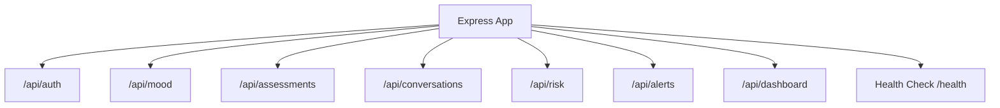
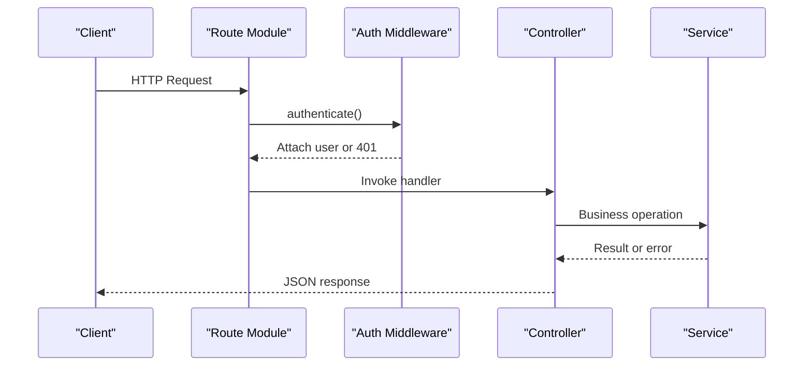
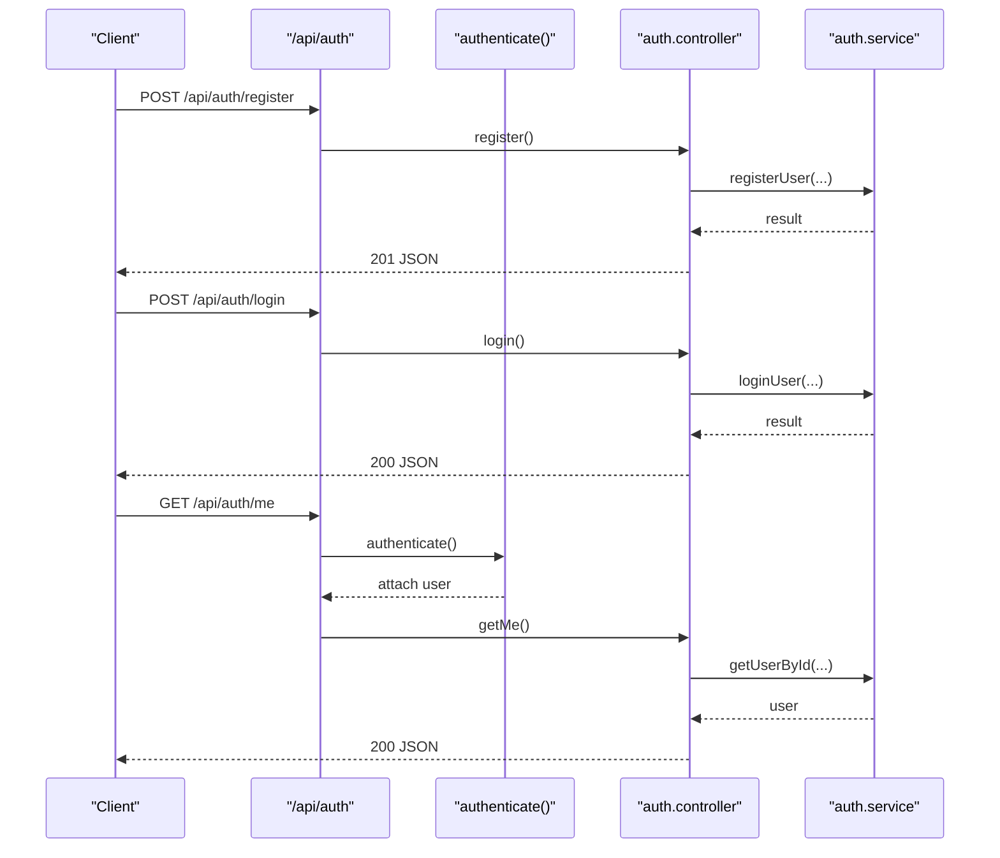
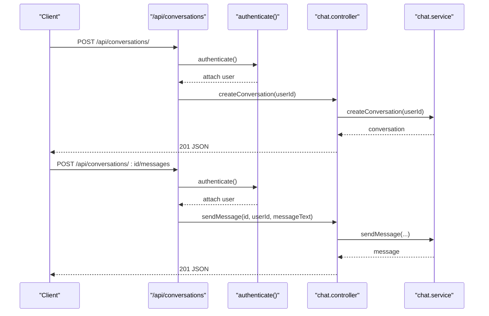
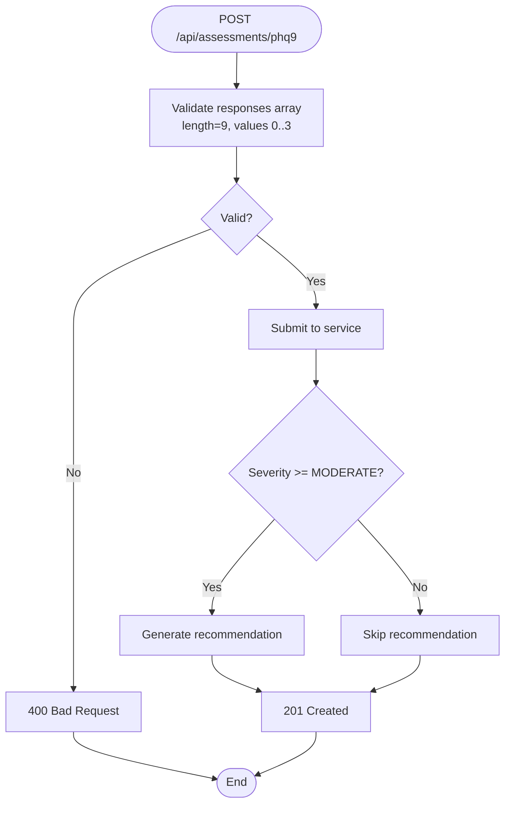
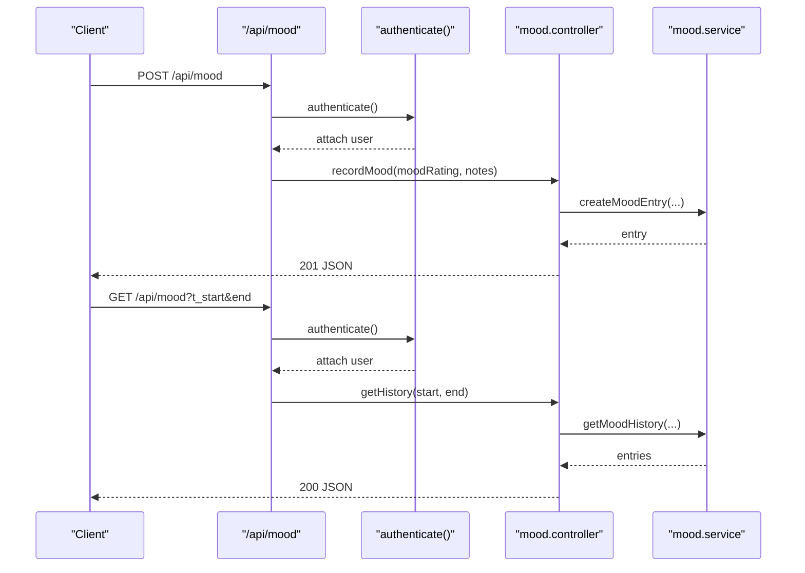
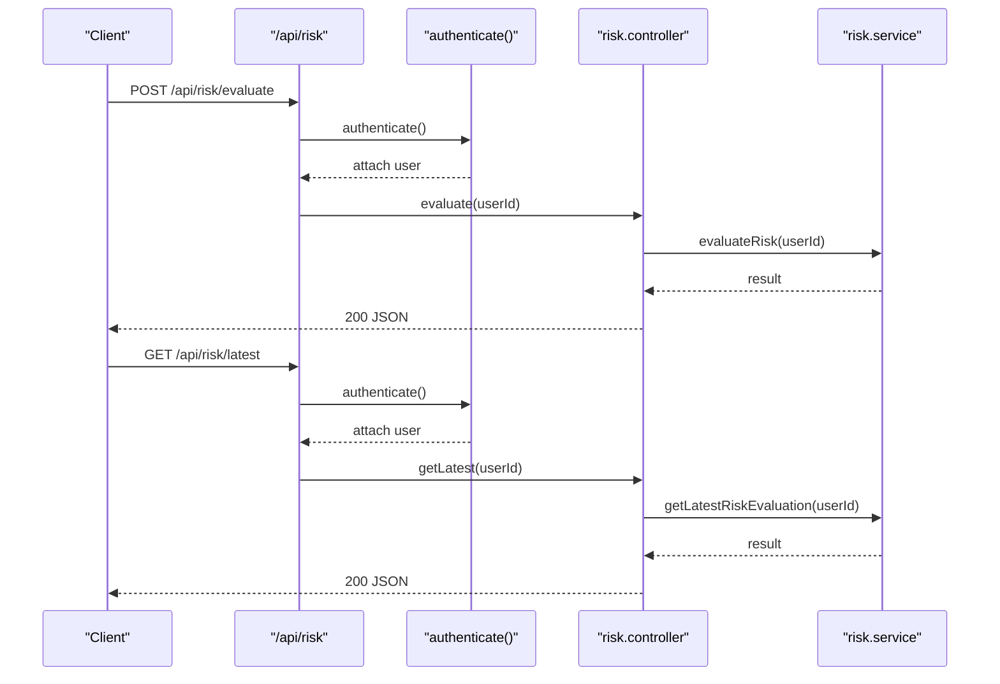
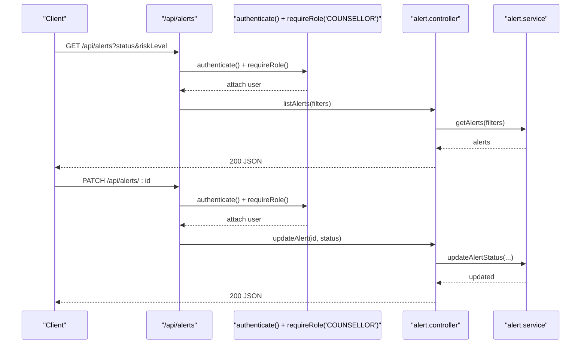
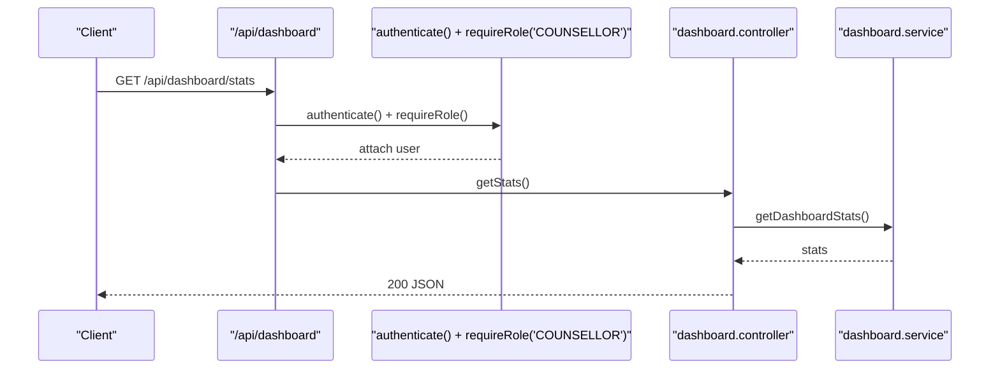
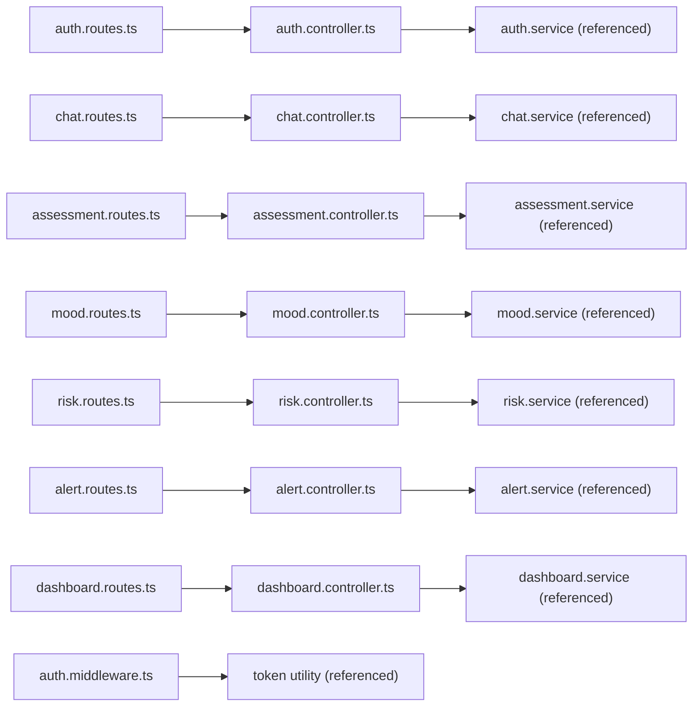

# API Reference

<cite>
**Referenced Files in This Document**
- [index.ts](file://server/src/index.ts)
- [auth.routes.ts](file://server/src/routes/auth.routes.ts)
- [chat.routes.ts](file://server/src/routes/chat.routes.ts)
- [assessment.routes.ts](file://server/src/routes/assessment.routes.ts)
- [mood.routes.ts](file://server/src/routes/mood.routes.ts)
- [risk.routes.ts](file://server/src/routes/risk.routes.ts)
- [alert.routes.ts](file://server/src/routes/alert.routes.ts)
- [dashboard.routes.ts](file://server/src/routes/dashboard.routes.ts)
- [auth.middleware.ts](file://server/src/middleware/auth.ts)
- [auth.controller.ts](file://server/src/controllers/auth.controller.ts)
- [chat.controller.ts](file://server/src/controllers/chat.controller.ts)
- [assessment.controller.ts](file://server/src/controllers/assessment.controller.ts)
- [mood.controller.ts](file://server/src/controllers/mood.controller.ts)
- [risk.controller.ts](file://server/src/controllers/risk.controller.ts)
- [alert.controller.ts](file://server/src/controllers/alert.controller.ts)
- [dashboard.controller.ts](file://server/src/controllers/dashboard.controller.ts)
</cite>

## Table of Contents
1. [Introduction](#introduction)
2. [Project Structure](#project-structure)
3. [Core Components](#core-components)
4. [Architecture Overview](#architecture-overview)
5. [Detailed Component Analysis](#detailed-component-analysis)
6. [Dependency Analysis](#dependency-analysis)
7. [Performance Considerations](#performance-considerations)
8. [Troubleshooting Guide](#troubleshooting-guide)
9. [Conclusion](#conclusion)
10. [Appendices](#appendices)

## Introduction
This document provides comprehensive API documentation for the BuddyAI RESTful backend. It covers endpoint groups for authentication, chat/conversation messaging, psychological assessments (PHQ-9), mood tracking, risk evaluation, alert management, and counselor dashboard statistics. For each endpoint, we specify HTTP methods, URL patterns, request/response schemas, authentication requirements, validation rules, and error responses. We also outline client integration patterns, security considerations, rate limiting guidance, and testing strategies.

## Project Structure
The server exposes a single base path for all API groups under /api. The primary routes registered are:
- /api/auth (authentication)
- /api/mood (mood tracking)
- /api/assessments (psychological assessments)
- /api/conversations (chat and messaging)
- /api/risk (risk evaluation)
- /api/alerts (alerts and counselor actions)
- /api/dashboard (counselor dashboard)

**Diagram sources**
- [index.ts:18-28](file://server/src/index.ts#L18-L28)

**Section sources**
- [index.ts:1-35](file://server/src/index.ts#L1-L35)

## Core Components
- Authentication middleware enforces Bearer tokens and role-based access for privileged endpoints.
- Route modules define endpoint routing and attach controller handlers.
- Controllers implement request validation, orchestrate service calls, and produce structured JSON responses.
- Services encapsulate business logic and database interactions.

Key shared behaviors:
- All authenticated endpoints require Authorization: Bearer <token>.
- Role-protected endpoints additionally require role-based checks.
- Standardized error responses use JSON with an error field and appropriate HTTP status codes.

**Section sources**
- [auth.middleware.ts:5-38](file://server/src/middleware/auth.ts#L5-L38)
- [auth.routes.ts:1-12](file://server/src/routes/auth.routes.ts#L1-L12)
- [mood.routes.ts:1-12](file://server/src/routes/mood.routes.ts#L1-L12)
- [assessment.routes.ts:1-12](file://server/src/routes/assessment.routes.ts#L1-L12)
- [chat.routes.ts:1-13](file://server/src/routes/chat.routes.ts#L1-L13)
- [risk.routes.ts:1-11](file://server/src/routes/risk.routes.ts#L1-L11)
- [alert.routes.ts:1-15](file://server/src/routes/alert.routes.ts#L1-L15)
- [dashboard.routes.ts:1-11](file://server/src/routes/dashboard.routes.ts#L1-L11)

## Architecture Overview
The API follows a layered architecture:
- Routes: Define HTTP endpoints and apply middleware.
- Middleware: Authentication and optional role checks.
- Controllers: Parse requests, validate inputs, call services, and return responses.
- Services: Encapsulate domain logic and data access.

**Diagram sources**
- [auth.routes.ts:7-9](file://server/src/routes/auth.routes.ts#L7-L9)
- [auth.middleware.ts:5-22](file://server/src/middleware/auth.ts#L5-L22)
- [auth.controller.ts:5-19](file://server/src/controllers/auth.controller.ts#L5-L19)

## Detailed Component Analysis

### Authentication Endpoints
Base path: /api/auth

- POST /api/auth/register
  - Purpose: Register a new user account.
  - Authentication: Not required.
  - Request body:
    - fullName: string, required
    - email: string, required
    - password: string, required
  - Responses:
    - 201 Created: Returns user registration result.
    - 400 Bad Request: Missing required fields.
    - 5xx Server Error: Delegated to global error handler.
  - Example request:
    - POST /api/auth/register with JSON payload containing fullName, email, password.
  - Notes:
    - Password strength and normalization are handled by the service layer.

- POST /api/auth/login
  - Purpose: Authenticate user and issue session credentials.
  - Authentication: Not required.
  - Request body:
    - email: string, required
    - password: string, required
  - Responses:
    - 200 OK: Returns authentication result (token and user info).
    - 400 Bad Request: Missing credentials.
    - 5xx Server Error: Delegated to global error handler.
  - Example request:
    - POST /api/auth/login with JSON payload containing email and password.

- GET /api/auth/me
  - Purpose: Retrieve currently authenticated user profile.
  - Authentication: Required (Bearer token).
  - Responses:
    - 200 OK: Returns user object.
    - 401 Unauthorized: Missing or invalid token.
    - 5xx Server Error: Delegated to global error handler.
  - Headers:
    - Authorization: Bearer <token>

**Diagram sources**
- [auth.routes.ts:7-9](file://server/src/routes/auth.routes.ts#L7-L9)
- [auth.middleware.ts:5-22](file://server/src/middleware/auth.ts#L5-L22)
- [auth.controller.ts:5-49](file://server/src/controllers/auth.controller.ts#L5-L49)

**Section sources**
- [auth.routes.ts:1-12](file://server/src/routes/auth.routes.ts#L1-L12)
- [auth.controller.ts:1-50](file://server/src/controllers/auth.controller.ts#L1-L50)
- [auth.middleware.ts:1-39](file://server/src/middleware/auth.ts#L1-L39)

### Chat Management Endpoints
Base path: /api/conversations

- POST /api/conversations/
  - Purpose: Create a new conversation for the authenticated user.
  - Authentication: Required (Bearer token).
  - Responses:
    - 201 Created: Returns newly created conversation object.
    - 401 Unauthorized: Missing or invalid token.
    - 5xx Server Error: Delegated to global error handler.

- GET /api/conversations/
  - Purpose: List all conversations for the authenticated user.
  - Authentication: Required (Bearer token).
  - Responses:
    - 200 OK: Returns array of conversations.
    - 401 Unauthorized: Missing or invalid token.
    - 5xx Server Error: Delegated to global error handler.

- POST /api/conversations/:id/messages
  - Purpose: Send a message in an existing conversation.
  - Authentication: Required (Bearer token).
  - Path parameters:
    - id: number, required (conversation identifier)
  - Request body:
    - messageText: string, required, non-empty
  - Responses:
    - 201 Created: Returns sent message object.
    - 400 Bad Request: Missing or invalid messageText.
    - 401 Unauthorized: Missing or invalid token.
    - 5xx Server Error: Delegated to global error handler.

- GET /api/conversations/:id/messages
  - Purpose: Retrieve messages for a specific conversation.
  - Authentication: Required (Bearer token).
  - Path parameters:
    - id: number, required (conversation identifier)
  - Responses:
    - 200 OK: Returns array of messages.
    - 401 Unauthorized: Missing or invalid token.
    - 5xx Server Error: Delegated to global error handler.

**Diagram sources**
- [chat.routes.ts:7-10](file://server/src/routes/chat.routes.ts#L7-L10)
- [chat.controller.ts:5-53](file://server/src/controllers/chat.controller.ts#L5-L53)

**Section sources**
- [chat.routes.ts:1-13](file://server/src/routes/chat.routes.ts#L1-L13)
- [chat.controller.ts:1-69](file://server/src/controllers/chat.controller.ts#L1-L69)

### Psychological Assessments (PHQ-9)
Base path: /api/assessments

- POST /api/assessments/phq9
  - Purpose: Submit PHQ-9 assessment responses.
  - Authentication: Required (Bearer token).
  - Request body:
    - responses: array<number>, required, length 9, values in range 0..3
  - Behavior:
    - On severity level indicating MODERATE or above, a recommendation may be generated asynchronously via service logic.
  - Responses:
    - 201 Created: Returns assessment result object.
    - 400 Bad Request: Invalid or malformed responses array.
    - 401 Unauthorized: Missing or invalid token.
    - 5xx Server Error: Delegated to global error handler.
  - Example request:
    - POST /api/assessments/phq9 with JSON payload containing responses array.

- GET /api/assessments/phq9
  - Purpose: Retrieve assessment history for the authenticated user.
  - Authentication: Required (Bearer token).
  - Responses:
    - 200 OK: Returns array of assessment records.
    - 401 Unauthorized: Missing or invalid token.
    - 5xx Server Error: Delegated to global error handler.

- GET /api/assessments/phq9/:id
  - Purpose: Retrieve a specific assessment by ID for the authenticated user.
  - Authentication: Required (Bearer token).
  - Path parameters:
    - id: number, required
  - Responses:
    - 200 OK: Returns assessment record.
    - 400 Bad Request: Invalid assessment ID.
    - 404 Not Found: Assessment not found.
    - 401 Unauthorized: Missing or invalid token.
    - 5xx Server Error: Delegated to global error handler.

**Diagram sources**
- [assessment.controller.ts:5-34](file://server/src/controllers/assessment.controller.ts#L5-L34)

**Section sources**
- [assessment.routes.ts:1-12](file://server/src/routes/assessment.routes.ts#L1-L12)
- [assessment.controller.ts:1-74](file://server/src/controllers/assessment.controller.ts#L1-L74)

### Mood Tracking Endpoints
Base path: /api/mood

- POST /api/mood
  - Purpose: Record a mood entry for the authenticated user.
  - Authentication: Required (Bearer token).
  - Request body:
    - moodRating: integer, required, range 1..5
    - notes: string, optional
  - Responses:
    - 201 Created: Returns created mood entry.
    - 400 Bad Request: Invalid moodRating or notes type.
    - 401 Unauthorized: Missing or invalid token.
    - 5xx Server Error: Delegated to global error handler.

- GET /api/mood
  - Purpose: Retrieve mood history for the authenticated user.
  - Authentication: Required (Bearer token).
  - Query parameters:
    - startDate: date string, optional
    - endDate: date string, optional
  - Responses:
    - 200 OK: Returns array of mood entries.
    - 401 Unauthorized: Missing or invalid token.
    - 5xx Server Error: Delegated to global error handler.

- GET /api/mood/trends
  - Purpose: Retrieve aggregated mood trends for the authenticated user.
  - Authentication: Required (Bearer token).
  - Responses:
    - 200 OK: Returns trend data structure.
    - 401 Unauthorized: Missing or invalid token.
    - 5xx Server Error: Delegated to global error handler.

**Diagram sources**
- [mood.routes.ts:7-9](file://server/src/routes/mood.routes.ts#L7-L9)
- [mood.controller.ts:5-52](file://server/src/controllers/mood.controller.ts#L5-L52)

**Section sources**
- [mood.routes.ts:1-12](file://server/src/routes/mood.routes.ts#L1-L12)
- [mood.controller.ts:1-67](file://server/src/controllers/mood.controller.ts#L1-L67)

### Risk Evaluation Endpoints
Base path: /api/risk

- POST /api/risk/evaluate
  - Purpose: Evaluate current risk for the authenticated user.
  - Authentication: Required (Bearer token).
  - Responses:
    - 200 OK: Returns risk evaluation result.
    - 401 Unauthorized: Missing or invalid token.
    - 5xx Server Error: Delegated to global error handler.

- GET /api/risk/latest
  - Purpose: Retrieve the latest risk evaluation for the authenticated user.
  - Authentication: Required (Bearer token).
  - Responses:
    - 200 OK: Returns latest risk evaluation.
    - 401 Unauthorized: Missing or invalid token.
    - 5xx Server Error: Delegated to global error handler.

**Diagram sources**
- [risk.routes.ts:7-8](file://server/src/routes/risk.routes.ts#L7-L8)
- [risk.controller.ts:5-31](file://server/src/controllers/risk.controller.ts#L5-L31)

**Section sources**
- [risk.routes.ts:1-11](file://server/src/routes/risk.routes.ts#L1-L11)
- [risk.controller.ts:1-32](file://server/src/controllers/risk.controller.ts#L1-L32)

### Alerts Management Endpoints
Base path: /api/alerts
- Requires role: COUNSELLOR

- GET /api/alerts
  - Purpose: List alerts with optional filters.
  - Authentication: Required (Bearer token).
  - Role: COUNSELLOR
  - Query parameters:
    - status: string, optional (filter by status)
    - riskLevel: string, optional (filter by risk level)
  - Responses:
    - 200 OK: Returns filtered alerts array.
    - 401 Unauthorized: Missing or invalid token.
    - 403 Forbidden: Insufficient permissions.
    - 5xx Server Error: Delegated to global error handler.

- GET /api/alerts/:id
  - Purpose: Retrieve a specific alert by ID.
  - Authentication: Required (Bearer token).
  - Role: COUNSELLOR
  - Path parameters:
    - id: number, required
  - Responses:
    - 200 OK: Returns alert object.
    - 404 Not Found: Alert not found.
    - 401 Unauthorized: Missing or invalid token.
    - 403 Forbidden: Insufficient permissions.
    - 5xx Server Error: Delegated to global error handler.

- PATCH /api/alerts/:id
  - Purpose: Update alert status.
  - Authentication: Required (Bearer token).
  - Role: COUNSELLOR
  - Path parameters:
    - id: number, required
  - Request body:
    - status: string, required, must be one of PENDING, REVIEWED, RESOLVED
  - Responses:
    - 200 OK: Returns updated alert object.
    - 400 Bad Request: Invalid status value.
    - 404 Not Found: Alert not found.
    - 401 Unauthorized: Missing or invalid token.
    - 403 Forbidden: Insufficient permissions.
    - 5xx Server Error: Delegated to global error handler.

- GET /api/alerts/:id/student
  - Purpose: Retrieve a student summary associated with an alert.
  - Authentication: Required (Bearer token).
  - Role: COUNSELLOR
  - Path parameters:
    - id: number, required
  - Responses:
    - 200 OK: Returns student summary object.
    - 404 Not Found: Alert not found.
    - 401 Unauthorized: Missing or invalid token.
    - 403 Forbidden: Insufficient permissions.
    - 5xx Server Error: Delegated to global error handler.

**Diagram sources**
- [alert.routes.ts:7-12](file://server/src/routes/alert.routes.ts#L7-L12)
- [alert.controller.ts:5-53](file://server/src/controllers/alert.controller.ts#L5-L53)

**Section sources**
- [alert.routes.ts:1-15](file://server/src/routes/alert.routes.ts#L1-L15)
- [alert.controller.ts:1-70](file://server/src/controllers/alert.controller.ts#L1-L70)

### Dashboard Access Endpoints
Base path: /api/dashboard
- Requires role: COUNSELLOR

- GET /api/dashboard/stats
  - Purpose: Retrieve counselor dashboard statistics.
  - Authentication: Required (Bearer token).
  - Role: COUNSELLOR
  - Responses:
    - 200 OK: Returns dashboard statistics object.
    - 401 Unauthorized: Missing or invalid token.
    - 403 Forbidden: Insufficient permissions.
    - 5xx Server Error: Delegated to global error handler.

**Diagram sources**
- [dashboard.routes.ts:7-8](file://server/src/routes/dashboard.routes.ts#L7-L8)
- [dashboard.controller.ts:5-12](file://server/src/controllers/dashboard.controller.ts#L5-L12)

**Section sources**
- [dashboard.routes.ts:1-11](file://server/src/routes/dashboard.routes.ts#L1-L11)
- [dashboard.controller.ts:1-13](file://server/src/controllers/dashboard.controller.ts#L1-L13)

## Dependency Analysis
- Route modules depend on controller handlers.
- Controllers depend on service modules for business logic.
- Authentication middleware depends on token verification utilities and attaches user claims to the request.
- Role enforcement middleware depends on user role present after authentication.

**Diagram sources**
- [auth.routes.ts:2-3](file://server/src/routes/auth.routes.ts#L2-L3)
- [chat.routes.ts:3](file://server/src/routes/chat.routes.ts#L3)
- [assessment.routes.ts:3](file://server/src/routes/assessment.routes.ts#L3)
- [mood.routes.ts:3](file://server/src/routes/mood.routes.ts#L3)
- [risk.routes.ts:3](file://server/src/routes/risk.routes.ts#L3)
- [alert.routes.ts:3](file://server/src/routes/alert.routes.ts#L3)
- [dashboard.routes.ts:3](file://server/src/routes/dashboard.routes.ts#L3)
- [auth.middleware.ts:2](file://server/src/middleware/auth.ts#L2)

**Section sources**
- [index.ts:4-10](file://server/src/index.ts#L4-L10)
- [auth.middleware.ts:1-39](file://server/src/middleware/auth.ts#L1-L39)

## Performance Considerations
- Token verification occurs per request; cache tokens client-side and reuse where appropriate.
- Batch operations: Prefer paginated retrieval for histories and lists (e.g., mood history supports date range filtering).
- Minimize payload sizes: Avoid sending unnecessary fields in requests.
- Asynchronous recommendations: The assessment submission triggers recommendation generation when severity thresholds are met; avoid synchronous waits in clients.
- Rate limiting: Apply client-side throttling and exponential backoff on retries. The server does not implement explicit rate limiting middleware; coordinate with platform policy.

## Troubleshooting Guide
Common errors and resolutions:
- 401 Unauthorized
  - Cause: Missing or malformed Authorization header, invalid/expired token.
  - Resolution: Ensure Authorization: Bearer <token> is set and token is fresh.
- 403 Forbidden
  - Cause: Attempting counselor-only endpoints without required role.
  - Resolution: Authenticate as a user with role COUNSELLOR.
- 400 Bad Request
  - Assessments: Ensure responses array contains exactly 9 integers from 0 to 3.
  - Mood: Ensure moodRating is an integer between 1 and 5; notes must be a string if provided.
  - Chat: Ensure messageText is a non-empty string.
  - Alerts: Ensure status is one of PENDING, REVIEWED, RESOLVED.
- 404 Not Found
  - Assessments and Alerts: Verify resource identifiers are valid numbers and belong to the authenticated user where applicable.
- Health check
  - GET /health returns {"status":"ok"} for liveness probes.

**Section sources**
- [auth.middleware.ts:8-21](file://server/src/middleware/auth.ts#L8-L21)
- [assessment.controller.ts:14-21](file://server/src/controllers/assessment.controller.ts#L14-L21)
- [mood.controller.ts:14-27](file://server/src/controllers/mood.controller.ts#L14-L27)
- [chat.controller.ts:43-46](file://server/src/controllers/chat.controller.ts#L43-L46)
- [alert.controller.ts:37-40](file://server/src/controllers/alert.controller.ts#L37-L40)
- [index.ts:18-20](file://server/src/index.ts#L18-L20)

## Conclusion
This API provides a cohesive set of endpoints for user authentication, conversational messaging, psychological assessments, mood tracking, risk evaluation, counselor alerts, and dashboard analytics. All endpoints follow consistent patterns for authentication, validation, and error reporting. Clients should implement robust token handling, adhere to request schemas, and leverage role-protected endpoints appropriately.

## Appendices

### Authentication Header Requirements
- All authenticated endpoints require:
  - Authorization: Bearer <JWT>
- Tokens are validated on each request; failures return 401 with an error message.

**Section sources**
- [auth.middleware.ts:6-21](file://server/src/middleware/auth.ts#L6-L21)

### Rate Limiting Information
- The server does not implement built-in rate limiting. Clients should implement local rate limiting and retry policies.

**Section sources**
- [index.ts:15-16](file://server/src/index.ts#L15-L16)

### Security Considerations
- Use HTTPS in production.
- Store tokens securely (e.g., HttpOnly cookies or secure storage).
- Validate and sanitize all inputs on the client side before sending requests.
- Rotate tokens periodically and invalidate on logout.

### API Versioning and Compatibility
- Current base path: /api (no version segment in routes).
- Backward compatibility: No explicit deprecation notices observed in routes/controllers. Treat current endpoints as stable for the time being.

**Section sources**
- [index.ts:22-28](file://server/src/index.ts#L22-L28)

### Testing Strategies
- Unit tests: Use Vitest to test route handlers and controllers in isolation.
- Integration tests: Validate middleware behavior (authentication and role checks) and end-to-end flows.
- Mock services: Stub service functions to simulate success and error scenarios.
- Example coverage areas:
  - Authentication: register, login, getMe.
  - Assessments: submit, getHistory, getById.
  - Mood: recordMood, getHistory, getTrends.
  - Chat: createConversation, getConversations, sendMessage, getMessages.
  - Risk: evaluate, getLatest.
  - Alerts: listAlerts, getAlert, updateAlert, studentSummary.
  - Dashboard: getStats.

**Section sources**
- [index.ts:1-35](file://server/src/index.ts#L1-L35)

### Client Implementation Guidelines
- Initialize with health check at /health.
- On successful login, persist the Bearer token and attach it to all authenticated requests.
- For counselor endpoints, ensure the authenticated user has role COUNSELLOR.
- Paginate and filter list endpoints using supported query parameters.
- Handle 401 by prompting re-authentication and 403 by informing insufficient permissions.

### Debugging Approaches
- Enable server logging for unhandled errors.
- Use Postman or curl to manually test endpoints with proper headers.
- Validate request bodies against documented schemas before sending.
- For role errors, confirm the authenticated user’s role claim.