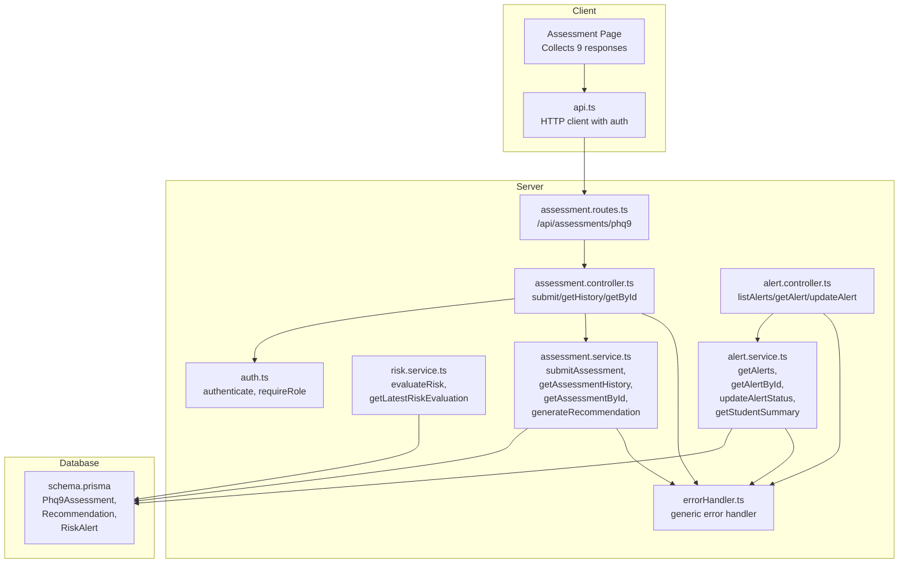
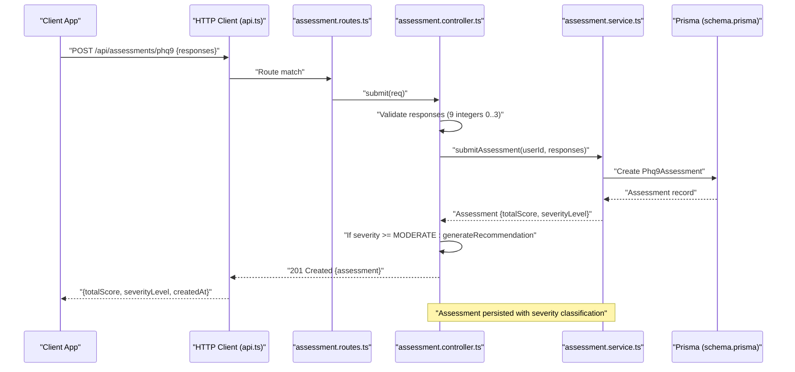
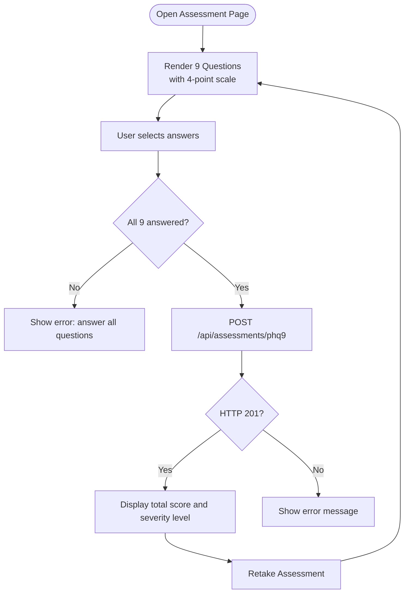
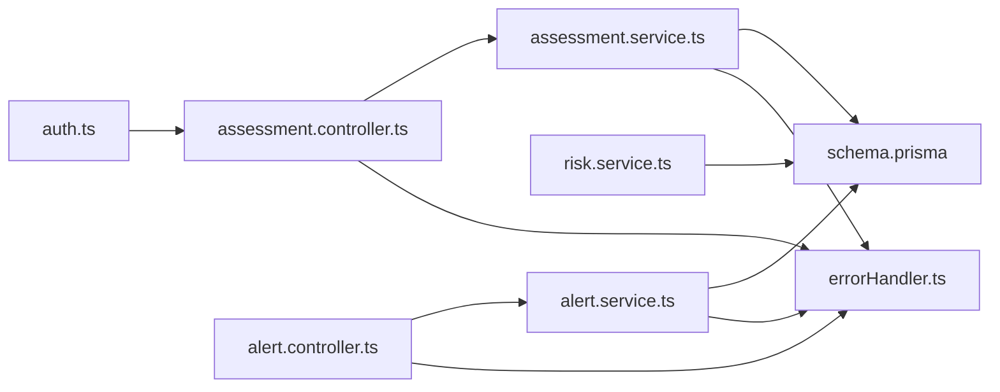
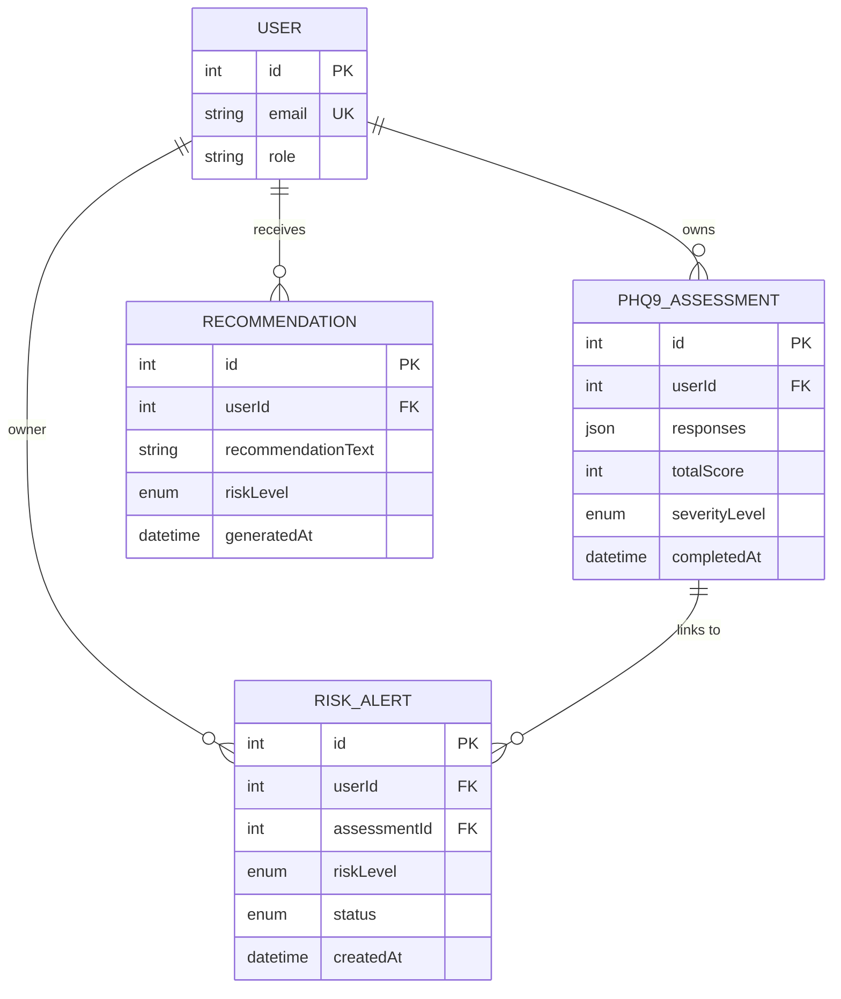

# Assessment API

<cite>
**Referenced Files in This Document**
- [assessment.controller.ts](file://server/src/controllers/assessment.controller.ts)
- [assessment.routes.ts](file://server/src/routes/assessment.routes.ts)
- [assessment.service.ts](file://server/src/services/assessment.service.ts)
- [index.ts](file://server/src/types/index.ts)
- [schema.prisma](file://prisma/schema.prisma)
- [assessment.test.ts](file://server/src/__tests__/assessment.test.ts)
- [errorHandler.ts](file://server/src/middleware/errorHandler.ts)
- [auth.ts](file://server/src/middleware/auth.ts)
- [api.ts](file://client/src/lib/api.ts)
- [page.tsx](file://client/src/app/assessment/page.tsx)
- [risk.service.ts](file://server/src/services/risk.service.ts)
- [alert.service.ts](file://server/src/services/alert.service.ts)
- [alert.controller.ts](file://server/src/controllers/alert.controller.ts)
</cite>

## Table of Contents
1. [Introduction](#introduction)
2. [Project Structure](#project-structure)
3. [Core Components](#core-components)
4. [Architecture Overview](#architecture-overview)
5. [Detailed Component Analysis](#detailed-component-analysis)
6. [Dependency Analysis](#dependency-analysis)
7. [Performance Considerations](#performance-considerations)
8. [Troubleshooting Guide](#troubleshooting-guide)
9. [Conclusion](#conclusion)
10. [Appendices](#appendices)

## Introduction
This document provides comprehensive API documentation for the PHQ-9 assessment endpoints used for mental health screening and evaluation. It covers:
- Endpoint definitions and request/response schemas
- Question management and scoring algorithms
- Risk classification and automated recommendation generation
- Error handling and integration patterns with counseling workflows and risk alert triggering

The PHQ-9 (Patient Health Questionnaire-9) is a widely used nine-item self-report measure for assessing depressive symptoms over the past two weeks. The system supports:
- Starting a new assessment
- Submitting answers
- Retrieving assessment history and individual results
- Scoring and severity classification
- Automated recommendations and risk alerts for moderate/severe cases

## Project Structure
The assessment feature spans the backend (Express server) and the frontend (Next.js client):
- Backend routes define the API endpoints under /api/assessments/phq9
- Controllers handle authentication, validation, and orchestrate service calls
- Services implement scoring, classification, and recommendation logic
- Prisma models define database schemas for assessments, recommendations, and risk alerts
- Frontend renders PHQ-9 questions, collects responses, and displays results

**Diagram sources**
- [assessment.routes.ts:1-12](file://server/src/routes/assessment.routes.ts#L1-L12)
- [assessment.controller.ts:1-74](file://server/src/controllers/assessment.controller.ts#L1-L74)
- [assessment.service.ts:1-89](file://server/src/services/assessment.service.ts#L1-L89)
- [risk.service.ts:1-138](file://server/src/services/risk.service.ts#L1-L138)
- [alert.controller.ts:1-42](file://server/src/controllers/alert.controller.ts#L1-L42)
- [alert.service.ts:1-38](file://server/src/services/alert.service.ts#L1-L38)
- [auth.ts:1-39](file://server/src/middleware/auth.ts#L1-L39)
- [errorHandler.ts:1-13](file://server/src/middleware/errorHandler.ts#L1-L13)
- [schema.prisma:97-133](file://prisma/schema.prisma#L97-L133)

**Section sources**
- [assessment.routes.ts:1-12](file://server/src/routes/assessment.routes.ts#L1-L12)
- [assessment.controller.ts:1-74](file://server/src/controllers/assessment.controller.ts#L1-L74)
- [assessment.service.ts:1-89](file://server/src/services/assessment.service.ts#L1-L89)
- [schema.prisma:97-133](file://prisma/schema.prisma#L97-L133)

## Core Components
- Authentication middleware enforces Bearer tokens and attaches user identity to requests
- Assessment controller validates request bodies, delegates to services, and triggers recommendations for moderate/severe cases
- Assessment service persists PHQ-9 responses, computes total score and severity level, and optionally generates recommendations
- Risk service evaluates combined indicators (PHQ-9, sentiment, mood trends) to compute risk level and create recommendations/alerts
- Alert service manages risk alert lifecycle for counselors
- Prisma models define the data structures for assessments, recommendations, and risk alerts

Key responsibilities:
- POST /api/assessments/phq9: Create a new PHQ-9 assessment with validated responses
- GET /api/assessments/phq9: Retrieve assessment history for the authenticated user
- GET /api/assessments/phq9/:id: Retrieve a specific assessment by ID owned by the authenticated user

**Section sources**
- [assessment.controller.ts:5-73](file://server/src/controllers/assessment.controller.ts#L5-L73)
- [assessment.service.ts:20-46](file://server/src/services/assessment.service.ts#L20-L46)
- [risk.service.ts:11-107](file://server/src/services/risk.service.ts#L11-L107)
- [alert.service.ts:3-33](file://server/src/services/alert.service.ts#L3-L33)
- [schema.prisma:97-133](file://prisma/schema.prisma#L97-L133)

## Architecture Overview
The PHQ-9 workflow integrates client-side question rendering with backend validation, scoring, and risk classification. Moderate/severe severity levels automatically trigger recommendations and risk alerts.

**Diagram sources**
- [assessment.routes.ts:7](file://server/src/routes/assessment.routes.ts#L7)
- [assessment.controller.ts:5-34](file://server/src/controllers/assessment.controller.ts#L5-L34)
- [assessment.service.ts:20-33](file://server/src/services/assessment.service.ts#L20-L33)
- [schema.prisma:97-108](file://prisma/schema.prisma#L97-L108)

## Detailed Component Analysis

### Endpoint Definitions and Schemas

- Base path: /api/assessments/phq9
- Authentication: Bearer token required on all endpoints

Endpoints:
- POST /phq9
  - Purpose: Start a new PHQ-9 assessment
  - Request body:
    - responses: array of 9 integers, each 0, 1, 2, or 3
  - Response (201 Created):
    - id: integer
    - userId: integer
    - responses: JSON array of 9 integers
    - totalScore: integer (sum of responses)
    - severityLevel: enum string (MINIMAL, MILD, MODERATE, MODERATELY_SEVERE, SEVERE)
    - completedAt: ISO datetime string
  - Errors:
    - 400 Bad Request: Invalid responses payload
    - 401 Unauthorized: Missing/invalid token
    - 500 Internal Server Error: Generic error

- GET /phq9
  - Purpose: Retrieve assessment history for the authenticated user
  - Response (200 OK):
    - Array of assessment objects with the same schema as POST response
  - Errors:
    - 401 Unauthorized: Missing/invalid token
    - 500 Internal Server Error: Generic error

- GET /phq9/:id
  - Purpose: Retrieve a specific assessment by ID owned by the authenticated user
  - Path params:
    - id: integer assessment identifier
  - Response (200 OK):
    - Single assessment object with the same schema as POST response
  - Errors:
    - 400 Bad Request: Invalid assessment ID
    - 401 Unauthorized: Missing/invalid token
    - 404 Not Found: Assessment not found or not owned by user
    - 500 Internal Server Error: Generic error

Scoring and Classification:
- Total score: sum of 9 responses (range 0–27)
- Severity levels:
  - 0–4: MINIMAL
  - 5–9: MILD
  - 10–14: MODERATE
  - 15–19: MODERATELY_SEVERE
  - 20–27: SEVERE

Automated Recommendations:
- Triggered when severityLevel is MODERATE, MODERATELY_SEVERE, or SEVERE
- Creates a Recommendation record with riskLevel and recommendationText
- Risk levels derived from severity:
  - MINIMAL/MILD: LOW
  - MODERATE: MODERATE
  - MODERATELY_SEVERE: HIGH
  - SEVERE: SEVERE

Integration with Counseling Workflows:
- Risk alerts are created for HIGH/SEVERE risk levels
- Alerts include status (PENDING, REVIEWED, RESOLVED) and link to the assessment
- Counselors can list, review, and update alert statuses

**Section sources**
- [assessment.routes.ts:7-9](file://server/src/routes/assessment.routes.ts#L7-L9)
- [assessment.controller.ts:5-73](file://server/src/controllers/assessment.controller.ts#L5-L73)
- [assessment.service.ts:12-33](file://server/src/services/assessment.service.ts#L12-L33)
- [assessment.service.ts:48-88](file://server/src/services/assessment.service.ts#L48-L88)
- [schema.prisma:97-133](file://prisma/schema.prisma#L97-L133)
- [risk.service.ts:56-107](file://server/src/services/risk.service.ts#L56-L107)
- [alert.service.ts:3-33](file://server/src/services/alert.service.ts#L3-L33)

### Client-Side Workflow
The client renders PHQ-9 questions and collects responses. It validates completeness before submission and displays results with severity classification.

**Diagram sources**
- [page.tsx:8-25](file://client/src/app/assessment/page.tsx#L8-L25)
- [page.tsx:52-73](file://client/src/app/assessment/page.tsx#L52-L73)
- [api.ts:15-35](file://client/src/lib/api.ts#L15-L35)

**Section sources**
- [page.tsx:8-25](file://client/src/app/assessment/page.tsx#L8-L25)
- [page.tsx:52-73](file://client/src/app/assessment/page.tsx#L52-L73)
- [api.ts:15-35](file://client/src/lib/api.ts#L15-L35)

### Scoring and Interpretation Guidelines
- Scoring algorithm:
  - Sum all 9 responses (each 0–3)
  - Classify severity based on total score thresholds
- Interpretation:
  - MINIMAL: minimal concern
  - MILD: mild concern
  - MODERATE: moderate concern; consider scheduling a session with a counselor
  - MODERATELY_SEVERE: moderately severe concern; strongly recommend consulting a counselor
  - SEVERE: severe concern; immediate consultation advised

Automated recommendations:
- MODERATE: “Consider scheduling a session with a counsellor to discuss coping strategies and support options.”
- MODERATELY_SEVERE: “It is strongly recommended to consult a counsellor or mental health professional for a comprehensive evaluation and treatment plan.”
- SEVERE: “Immediate consultation with a mental health professional is advised. Please reach out to a counsellor or crisis helpline as soon as possible.”

Risk classification mapping:
- MINIMAL/MILD → LOW risk
- MODERATE → MODERATE risk
- MODERATELY_SEVERE → HIGH risk
- SEVERE → SEVERE risk

**Section sources**
- [assessment.service.ts:12-18](file://server/src/services/assessment.service.ts#L12-L18)
- [assessment.service.ts:63-74](file://server/src/services/assessment.service.ts#L63-L74)
- [assessment.service.ts:48-61](file://server/src/services/assessment.service.ts#L48-L61)

### Risk Evaluation and Alerting
Beyond PHQ-9, risk evaluation considers:
- Recent message sentiment (negative ratio)
- Mood trends (recent vs. older averages)
- PHQ-9 score thresholds

Rules:
- PHQ-9 score ≥ 20 → SEVERE risk
- PHQ-9 score ≥ 15 AND negative sentiment ratio > 0.5 → HIGH risk
- PHQ-9 score ≥ 10 OR declining mood trend → MODERATE risk
- Otherwise → LOW risk

Recommendations are stored as Recommendation records and linked to RiskAlerts when risk is HIGH/SEVERE.

**Section sources**
- [risk.service.ts:11-107](file://server/src/services/risk.service.ts#L11-L107)
- [schema.prisma:110-133](file://prisma/schema.prisma#L110-L133)

## Dependency Analysis
The assessment module depends on:
- Authentication middleware for user verification
- Prisma ORM for persistence
- Risk service for broader risk evaluation (optional integration)
- Alert service/controller for counselor workflows

**Diagram sources**
- [auth.ts:5-22](file://server/src/middleware/auth.ts#L5-L22)
- [assessment.controller.ts:5-34](file://server/src/controllers/assessment.controller.ts#L5-L34)
- [assessment.service.ts:1-1](file://server/src/services/assessment.service.ts#L1-L1)
- [risk.service.ts:1-1](file://server/src/services/risk.service.ts#L1-L1)
- [alert.controller.ts:1-42](file://server/src/controllers/alert.controller.ts#L1-L42)
- [alert.service.ts:1-38](file://server/src/services/alert.service.ts#L1-L38)
- [errorHandler.ts:7-12](file://server/src/middleware/errorHandler.ts#L7-L12)
- [schema.prisma:97-133](file://prisma/schema.prisma#L97-L133)

**Section sources**
- [auth.ts:5-22](file://server/src/middleware/auth.ts#L5-L22)
- [assessment.controller.ts:5-34](file://server/src/controllers/assessment.controller.ts#L5-L34)
- [assessment.service.ts:1-1](file://server/src/services/assessment.service.ts#L1-L1)
- [risk.service.ts:1-1](file://server/src/services/risk.service.ts#L1-L1)
- [alert.controller.ts:1-42](file://server/src/controllers/alert.controller.ts#L1-L42)
- [alert.service.ts:1-38](file://server/src/services/alert.service.ts#L1-L38)
- [errorHandler.ts:7-12](file://server/src/middleware/errorHandler.ts#L7-L12)
- [schema.prisma:97-133](file://prisma/schema.prisma#L97-L133)

## Performance Considerations
- Validation occurs in-memory on the server; keep payloads small (9 integers)
- Database writes are single-row inserts for assessments and recommendations
- Sorting by completedAt desc for history retrieval is efficient with an index on userId
- Risk evaluation involves multiple reads; consider caching recent assessments and moods for frequent updates

[No sources needed since this section provides general guidance]

## Troubleshooting Guide
Common errors and resolutions:
- 401 Unauthorized
  - Cause: Missing Authorization header or invalid/expired token
  - Resolution: Re-authenticate and retry with a valid Bearer token
- 400 Bad Request
  - Cause: responses missing, wrong length, or values outside 0–3
  - Resolution: Ensure exactly 9 integers, each 0, 1, 2, or 3
- 400 Bad Request (invalid ID)
  - Cause: Non-numeric or malformed assessment ID
  - Resolution: Pass a valid integer ID
- 404 Not Found
  - Cause: Assessment does not exist or belongs to another user
  - Resolution: Verify ownership and existence of the assessment
- 500 Internal Server Error
  - Cause: Unexpected server-side failure
  - Resolution: Retry; check server logs for stack traces

Recommendations:
- Use the client’s built-in validation to prevent submission of incomplete forms
- Ensure network connectivity and token validity before calling endpoints

**Section sources**
- [assessment.controller.ts:7-21](file://server/src/controllers/assessment.controller.ts#L7-L21)
- [assessment.controller.ts:57-67](file://server/src/controllers/assessment.controller.ts#L57-L67)
- [errorHandler.ts:7-12](file://server/src/middleware/errorHandler.ts#L7-L12)
- [api.ts:20-35](file://client/src/lib/api.ts#L20-L35)

## Conclusion
The PHQ-9 assessment endpoints provide a robust foundation for mental health screening, scoring, and risk classification. They integrate seamlessly with counseling workflows by generating recommendations and risk alerts for moderate/severe cases. The design emphasizes clear validation, standardized scoring, and straightforward client integration.

[No sources needed since this section summarizes without analyzing specific files]

## Appendices

### Data Models Overview

**Diagram sources**
- [schema.prisma:47-61](file://prisma/schema.prisma#L47-L61)
- [schema.prisma:97-108](file://prisma/schema.prisma#L97-L108)
- [schema.prisma:110-119](file://prisma/schema.prisma#L110-L119)
- [schema.prisma:121-133](file://prisma/schema.prisma#L121-L133)

### Example Workflows

- New Assessment Submission
  - Client collects 9 responses (0–3 each)
  - Validates completeness
  - Sends POST /api/assessments/phq9
  - Server responds with assessment including totalScore and severityLevel
  - If severity is MODERATE or above, a recommendation is generated

- Retrieving Results
  - GET /api/assessments/phq9 lists all assessments ordered by completion time
  - GET /api/assessments/phq9/:id retrieves a specific assessment owned by the user

- Partial Submissions
  - The current implementation requires all 9 responses before submission
  - To support partial progress, extend the client to send incremental updates and add a separate endpoint for saving drafts

- Result Formatting
  - totalScore: integer (0–27)
  - severityLevel: one of MINIMAL, MILD, MODERATE, MODERATELY_SEVERE, SEVERE
  - createdAt: ISO datetime string

**Section sources**
- [assessment.controller.ts:5-34](file://server/src/controllers/assessment.controller.ts#L5-L34)
- [assessment.service.ts:20-33](file://server/src/services/assessment.service.ts#L20-L33)
- [page.tsx:52-73](file://client/src/app/assessment/page.tsx#L52-L73)

### Test Coverage Highlights
- Boundary classifications verified for all severity thresholds
- Total score and severity mapping validated across typical distributions
- Tests confirm correct Prisma create calls with expected fields

**Section sources**
- [assessment.test.ts:24-154](file://server/src/__tests__/assessment.test.ts#L24-L154)