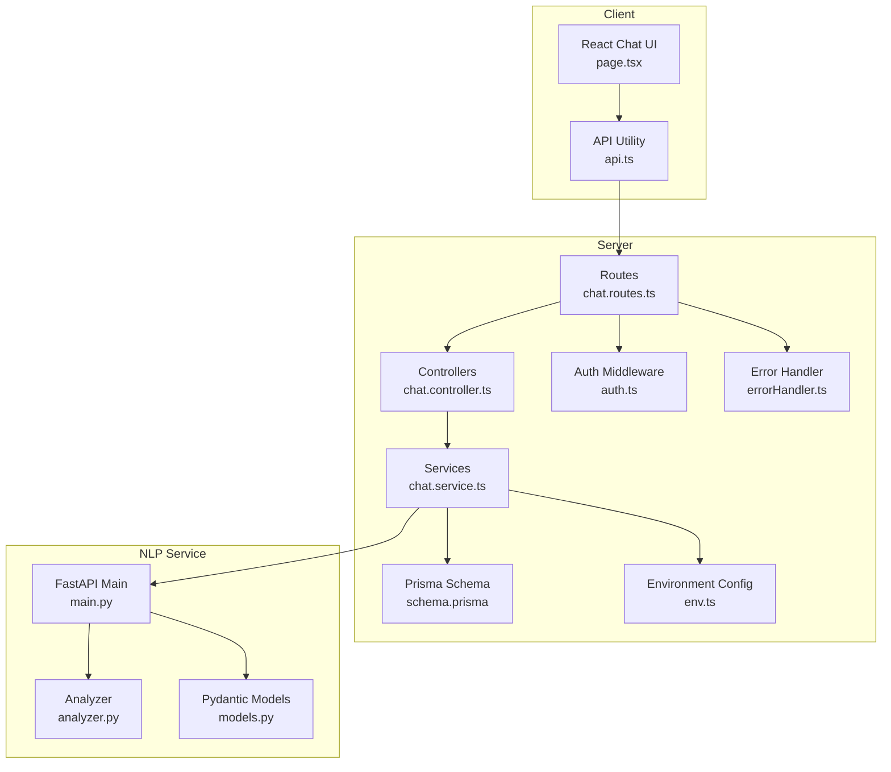
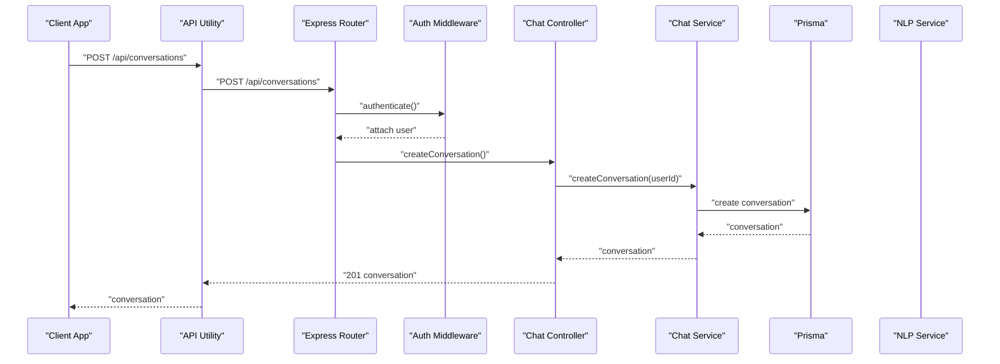
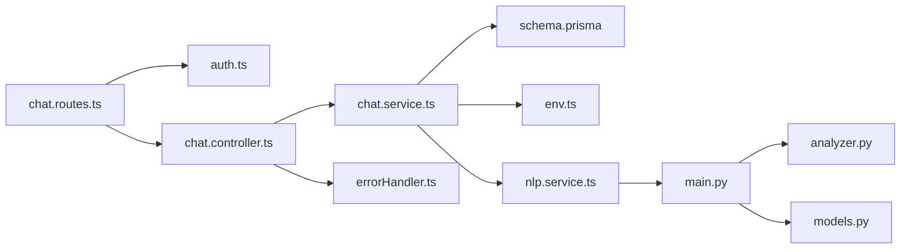

# Chat API

<cite>
**Referenced Files in This Document**
- [chat.controller.ts](file://server/src/controllers/chat.controller.ts)
- [chat.routes.ts](file://server/src/routes/chat.routes.ts)
- [chat.service.ts](file://server/src/services/chat.service.ts)
- [auth.ts](file://server/src/middleware/auth.ts)
- [errorHandler.ts](file://server/src/middleware/errorHandler.ts)
- [env.ts](file://server/src/config/env.ts)
- [index.ts](file://server/src/types/index.ts)
- [schema.prisma](file://prisma/schema.prisma)
- [nlp.service.ts](file://server/src/services/nlp.service.ts)
- [main.py](file://nlp-service/main.py)
- [analyzer.py](file://nlp-service/nlp/analyzer.py)
- [models.py](file://nlp-service/models.py)
- [api.ts](file://client/src/lib/api.ts)
- [page.tsx](file://client/src/app/chat/page.tsx)
</cite>

## Table of Contents
1. [Introduction](#introduction)
2. [Project Structure](#project-structure)
3. [Core Components](#core-components)
4. [Architecture Overview](#architecture-overview)
5. [Detailed Component Analysis](#detailed-component-analysis)
6. [Dependency Analysis](#dependency-analysis)
7. [Performance Considerations](#performance-considerations)
8. [Troubleshooting Guide](#troubleshooting-guide)
9. [Conclusion](#conclusion)

## Introduction
This document provides comprehensive API documentation for chat and conversation management endpoints. It covers conversation creation, listing, message sending, and retrieval with integrated sentiment analysis powered by an external NLP service. The documentation includes request/response schemas, authentication requirements, validation rules, error handling, and practical examples for conversation threading and message ordering.

## Project Structure
The chat API is implemented in the server module with clear separation of concerns:
- Routes define the HTTP endpoints and apply authentication middleware.
- Controllers handle request validation, orchestrate service calls, and manage responses.
- Services encapsulate business logic, database operations, and NLP integration.
- Middleware enforces authentication and global error handling.
- Prisma defines the data model for conversations, messages, and related entities.
- The NLP service performs sentiment analysis using VADER.
- The client consumes the API with typed requests and handles authentication tokens.

**Diagram sources**
- [chat.routes.ts:1-13](file://server/src/routes/chat.routes.ts#L1-L13)
- [chat.controller.ts:1-69](file://server/src/controllers/chat.controller.ts#L1-L69)
- [chat.service.ts:1-105](file://server/src/services/chat.service.ts#L1-L105)
- [auth.ts:1-39](file://server/src/middleware/auth.ts#L1-L39)
- [errorHandler.ts:1-13](file://server/src/middleware/errorHandler.ts#L1-L13)
- [schema.prisma:1-134](file://prisma/schema.prisma#L1-L134)
- [env.ts:1-12](file://server/src/config/env.ts#L1-L12)
- [main.py:1-71](file://nlp-service/main.py#L1-L71)
- [analyzer.py:1-27](file://nlp-service/nlp/analyzer.py#L1-L27)
- [models.py:1-26](file://nlp-service/models.py#L1-L26)
- [api.ts:1-36](file://client/src/lib/api.ts#L1-L36)
- [page.tsx:1-196](file://client/src/app/chat/page.tsx#L1-L196)

**Section sources**
- [chat.routes.ts:1-13](file://server/src/routes/chat.routes.ts#L1-L13)
- [chat.controller.ts:1-69](file://server/src/controllers/chat.controller.ts#L1-L69)
- [chat.service.ts:1-105](file://server/src/services/chat.service.ts#L1-L105)
- [auth.ts:1-39](file://server/src/middleware/auth.ts#L1-L39)
- [errorHandler.ts:1-13](file://server/src/middleware/errorHandler.ts#L1-L13)
- [schema.prisma:1-134](file://prisma/schema.prisma#L1-L134)
- [env.ts:1-12](file://server/src/config/env.ts#L1-L12)
- [main.py:1-71](file://nlp-service/main.py#L1-L71)
- [analyzer.py:1-27](file://nlp-service/nlp/analyzer.py#L1-L27)
- [models.py:1-26](file://nlp-service/models.py#L1-L26)
- [api.ts:1-36](file://client/src/lib/api.ts#L1-L36)
- [page.tsx:1-196](file://client/src/app/chat/page.tsx#L1-L196)

## Core Components
- Authentication middleware validates JWT tokens and attaches user identity to requests.
- Chat routes expose four endpoints under /api/conversations:
  - POST /api/conversations: Create a new conversation for the authenticated user.
  - GET /api/conversations: List user conversations ordered by most recent.
  - POST /api/conversations/:id/messages: Send a message to a specific conversation.
  - GET /api/conversations/:id/messages: Retrieve all messages in a conversation ordered chronologically.
- Controllers enforce authentication and basic validation before delegating to services.
- Services manage database operations, integrate with the NLP service for sentiment analysis, and generate bot responses.
- Error handling middleware standardizes error responses.

**Section sources**
- [auth.ts:1-39](file://server/src/middleware/auth.ts#L1-L39)
- [chat.routes.ts:1-13](file://server/src/routes/chat.routes.ts#L1-L13)
- [chat.controller.ts:1-69](file://server/src/controllers/chat.controller.ts#L1-L69)
- [chat.service.ts:1-105](file://server/src/services/chat.service.ts#L1-L105)
- [errorHandler.ts:1-13](file://server/src/middleware/errorHandler.ts#L1-L13)

## Architecture Overview
The chat API follows a layered architecture:
- Presentation layer: Express routes and controllers.
- Application layer: Services encapsulate business logic.
- Persistence layer: Prisma ORM manages PostgreSQL.
- External integration: NLP service provides sentiment analysis.
- Client integration: React UI communicates via a typed API utility.

**Diagram sources**
- [chat.routes.ts:7](file://server/src/routes/chat.routes.ts#L7)
- [auth.ts:5-22](file://server/src/middleware/auth.ts#L5-L22)
- [chat.controller.ts:5-17](file://server/src/controllers/chat.controller.ts#L5-L17)
- [chat.service.ts:26-30](file://server/src/services/chat.service.ts#L26-L30)
- [schema.prisma:63-71](file://prisma/schema.prisma#L63-L71)

## Detailed Component Analysis

### Authentication and Authorization
- Authentication middleware verifies Bearer tokens and decodes user identity.
- Controllers check for presence of user before processing requests.
- Role-based authorization is available via a helper that can be applied to routes.

Key behaviors:
- Missing or malformed Authorization header yields 401 Access denied.
- Invalid/expired token yields 401 Invalid or expired token.
- Controllers return 401 Authentication required when user is absent.

**Section sources**
- [auth.ts:1-39](file://server/src/middleware/auth.ts#L1-L39)
- [chat.controller.ts:7-10](file://server/src/controllers/chat.controller.ts#L7-L10)
- [chat.controller.ts:21](file://server/src/controllers/chat.controller.ts#L21)
- [chat.controller.ts:35](file://server/src/controllers/chat.controller.ts#L35)

### Conversation Management
Endpoints:
- POST /api/conversations: Creates a new conversation for the authenticated user.
- GET /api/conversations: Lists user conversations ordered by most recent.

Data model:
- Conversation entity includes user association and timestamps.
- Endpoint returns minimal conversation metadata with last message preview included.

Validation and behavior:
- Requires authenticated user.
- On creation, returns newly created conversation object.
- On listing, includes the most recent message per conversation.

**Section sources**
- [chat.routes.ts:7-8](file://server/src/routes/chat.routes.ts#L7-L8)
- [chat.controller.ts:5-17](file://server/src/controllers/chat.controller.ts#L5-L17)
- [chat.controller.ts:19-31](file://server/src/controllers/chat.controller.ts#L19-L31)
- [chat.service.ts:26-43](file://server/src/services/chat.service.ts#L26-L43)
- [schema.prisma:63-71](file://prisma/schema.prisma#L63-L71)

### Message Operations
Endpoints:
- POST /api/conversations/:id/messages: Sends a message to a conversation.
- GET /api/conversations/:id/messages: Retrieves all messages in a conversation.

Request validation:
- Requires authenticated user.
- Validates messageText presence and non-empty string.
- Ensures conversation ownership before processing.

Processing pipeline:
- Verify conversation belongs to user; otherwise 404 Conversation not found.
- Call NLP service to analyze sentiment; if unavailable, continue without sentiment.
- Persist user message with sentiment and score.
- Generate and persist bot response based on sentiment.
- Return both user and bot messages.

Response schema:
- POST returns an object containing userMessage and botMessage.
- GET returns an array of messages ordered chronologically.

**Section sources**
- [chat.routes.ts:9-10](file://server/src/routes/chat.routes.ts#L9-L10)
- [chat.controller.ts:33-53](file://server/src/controllers/chat.controller.ts#L33-L53)
- [chat.controller.ts:55-68](file://server/src/controllers/chat.controller.ts#L55-L68)
- [chat.service.ts:45-89](file://server/src/services/chat.service.ts#L45-L89)
- [chat.service.ts:91-104](file://server/src/services/chat.service.ts#L91-L104)
- [schema.prisma:73-84](file://prisma/schema.prisma#L73-L84)

### NLP Integration for Sentiment Analysis
- The chat service calls the NLP service endpoint to analyze message text.
- The NLP service uses VADER sentiment analysis and returns sentiment classification and scores.
- If the NLP service is unavailable, the chat operation continues without sentiment data.

Data exchange:
- Request payload: text string.
- Response payload: sentiment label and normalized scores (compound, pos, neg, neu).

Fallback behavior:
- If NLP request fails, logs error and proceeds with neutral sentiment defaults.

**Section sources**
- [chat.service.ts:54-65](file://server/src/services/chat.service.ts#L54-L65)
- [nlp.service.ts:11-23](file://server/src/services/nlp.service.ts#L11-L23)
- [main.py:43-58](file://nlp-service/main.py#L43-L58)
- [analyzer.py:8-26](file://nlp-service/nlp/analyzer.py#L8-L26)
- [models.py:4-20](file://nlp-service/models.py#L4-L20)

### Client-Side Integration
- The React chat page uses a typed API utility to communicate with the backend.
- It automatically attaches Bearer tokens from local storage.
- Handles unauthorized responses by redirecting to login.
- Implements conversation creation on demand and message threading with sentiment indicators.

Patterns:
- Conversation threading: Single conversation ID is maintained; messages are appended as they arrive.
- Real-time-like updates: New messages are appended immediately upon successful send, simulating near real-time behavior.

**Section sources**
- [api.ts:1-36](file://client/src/lib/api.ts#L1-L36)
- [page.tsx:17-107](file://client/src/app/chat/page.tsx#L17-L107)

## Dependency Analysis
The following diagram shows key dependencies among components:

**Diagram sources**
- [chat.routes.ts:1-13](file://server/src/routes/chat.routes.ts#L1-L13)
- [auth.ts:1-39](file://server/src/middleware/auth.ts#L1-L39)
- [chat.controller.ts:1-69](file://server/src/controllers/chat.controller.ts#L1-L69)
- [chat.service.ts:1-105](file://server/src/services/chat.service.ts#L1-L105)
- [schema.prisma:1-134](file://prisma/schema.prisma#L1-L134)
- [env.ts:1-12](file://server/src/config/env.ts#L1-L12)
- [nlp.service.ts:1-24](file://server/src/services/nlp.service.ts#L1-L24)
- [main.py:1-71](file://nlp-service/main.py#L1-L71)
- [analyzer.py:1-27](file://nlp-service/nlp/analyzer.py#L1-L27)
- [models.py:1-26](file://nlp-service/models.py#L1-L26)
- [errorHandler.ts:1-13](file://server/src/middleware/errorHandler.ts#L1-L13)

**Section sources**
- [chat.routes.ts:1-13](file://server/src/routes/chat.routes.ts#L1-L13)
- [chat.controller.ts:1-69](file://server/src/controllers/chat.controller.ts#L1-L69)
- [chat.service.ts:1-105](file://server/src/services/chat.service.ts#L1-L105)
- [schema.prisma:1-134](file://prisma/schema.prisma#L1-L134)
- [nlp.service.ts:1-24](file://server/src/services/nlp.service.ts#L1-L24)
- [main.py:1-71](file://nlp-service/main.py#L1-L71)
- [analyzer.py:1-27](file://nlp-service/nlp/analyzer.py#L1-L27)
- [models.py:1-26](file://nlp-service/models.py#L1-L26)
- [errorHandler.ts:1-13](file://server/src/middleware/errorHandler.ts#L1-L13)

## Performance Considerations
- Database indexing:
  - Conversation.userId and Message.conversationId are indexed to optimize lookups.
- Query optimization:
  - Conversation listing limits last message inclusion to reduce payload size.
  - Message retrieval orders by creation time for efficient pagination.
- NLP service resilience:
  - If NLP service is unavailable, chat operations continue without sentiment data.
- Client-side:
  - Immediate UI updates after sending messages improve perceived responsiveness.

[No sources needed since this section provides general guidance]

## Troubleshooting Guide
Common errors and resolutions:
- Unauthorized access:
  - Symptom: 401 Access denied or Invalid or expired token.
  - Resolution: Ensure Authorization header with valid Bearer token is present.
- Conversation not found:
  - Symptom: 404 Conversation not found.
  - Resolution: Verify conversationId belongs to the authenticated user.
- Invalid message payload:
  - Symptom: 400 messageText is required and must be a non-empty string.
  - Resolution: Provide a non-empty messageText in request body.
- NLP service unavailability:
  - Symptom: Chat operations succeed but sentiment is missing.
  - Resolution: Confirm NLP service is reachable and healthy.

Operational checks:
- Environment variables:
  - DATABASE_URL and JWT_SECRET configured for server.
  - NLP_SERVICE_URL points to the NLP service endpoint.
- Health endpoints:
  - NLP service exposes a health check endpoint for diagnostics.

**Section sources**
- [auth.ts:8-21](file://server/src/middleware/auth.ts#L8-L21)
- [chat.controller.ts:43-46](file://server/src/controllers/chat.controller.ts#L43-L46)
- [chat.service.ts:50-52](file://server/src/services/chat.service.ts#L50-L52)
- [nlp.service.ts:18-20](file://server/src/services/nlp.service.ts#L18-L20)
- [env.ts:6-11](file://server/src/config/env.ts#L6-L11)
- [main.py:61-64](file://nlp-service/main.py#L61-L64)

## Conclusion
The chat API provides a robust foundation for conversation management with integrated sentiment analysis. It enforces authentication, validates inputs, and integrates with an external NLP service for enriched messaging experiences. The client-side implementation demonstrates practical usage patterns for conversation threading and near real-time updates. Proper error handling and environment configuration ensure reliable operation across deployments.