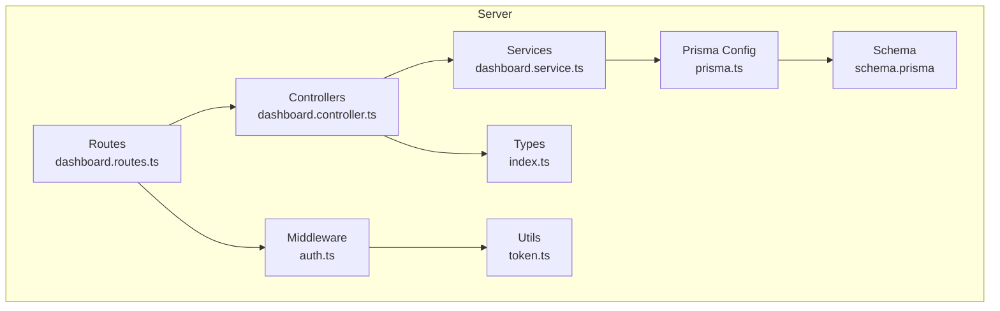
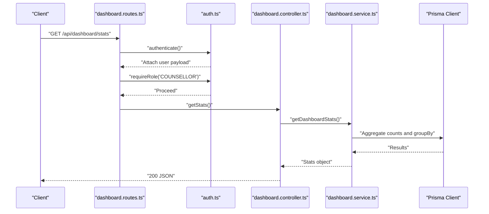
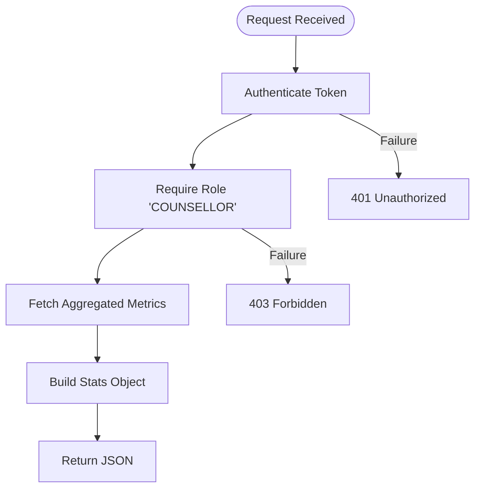
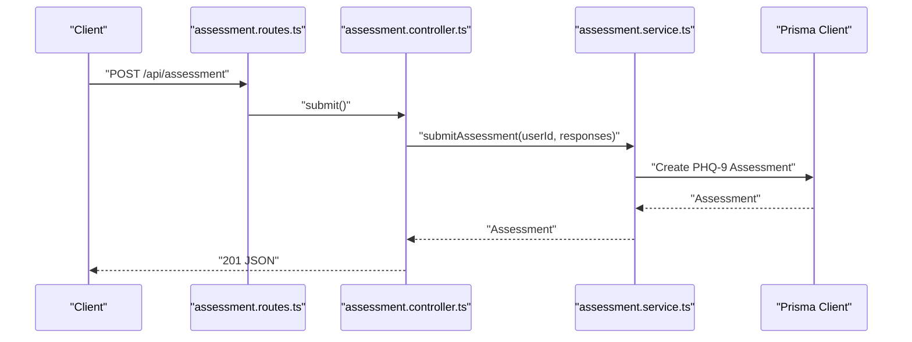
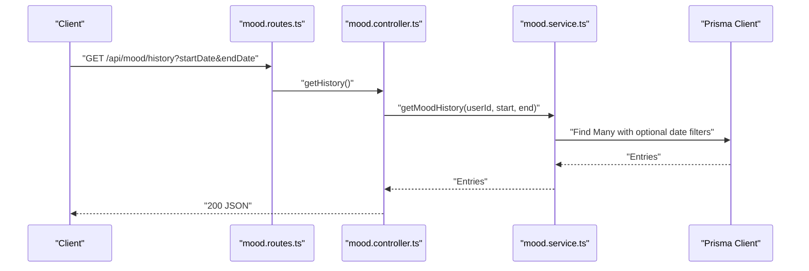
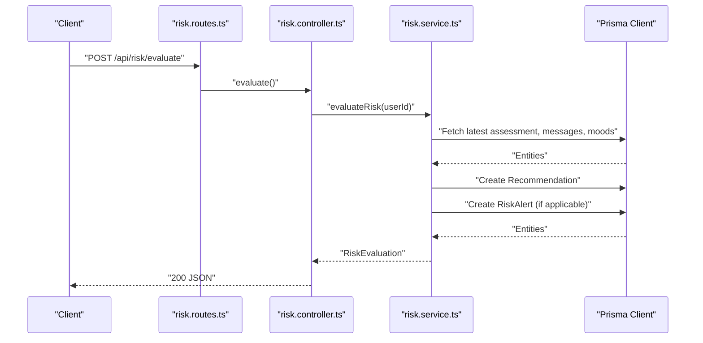
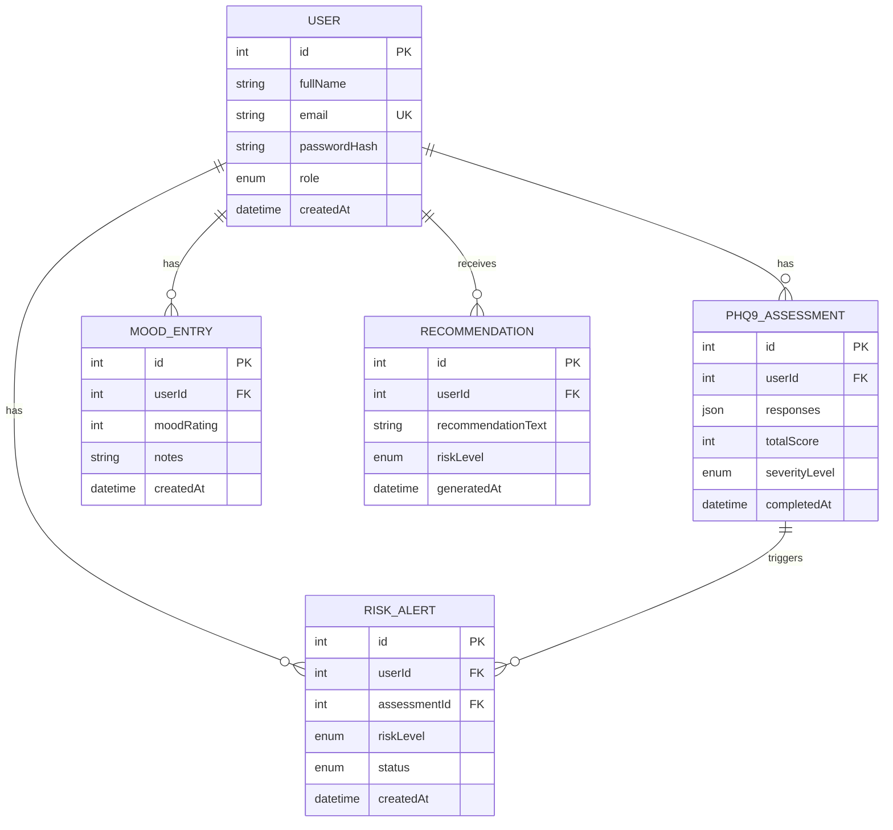
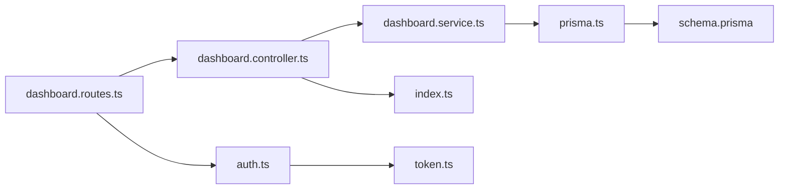

# Dashboard API

<cite>
**Referenced Files in This Document**
- [dashboard.controller.ts](file://server/src/controllers/dashboard.controller.ts)
- [dashboard.routes.ts](file://server/src/routes/dashboard.routes.ts)
- [dashboard.service.ts](file://server/src/services/dashboard.service.ts)
- [auth.ts](file://server/src/middleware/auth.ts)
- [index.ts](file://server/src/types/index.ts)
- [token.ts](file://server/src/utils/token.ts)
- [prisma.ts](file://server/src/config/prisma.ts)
- [schema.prisma](file://prisma/schema.prisma)
- [assessment.controller.ts](file://server/src/controllers/assessment.controller.ts)
- [assessment.service.ts](file://server/src/services/assessment.service.ts)
- [mood.controller.ts](file://server/src/controllers/mood.controller.ts)
- [mood.service.ts](file://server/src/services/mood.service.ts)
- [risk.controller.ts](file://server/src/controllers/risk.controller.ts)
- [risk.service.ts](file://server/src/services/risk.service.ts)
</cite>

## Table of Contents
1. [Introduction](#introduction)
2. [Project Structure](#project-structure)
3. [Core Components](#core-components)
4. [Architecture Overview](#architecture-overview)
5. [Detailed Component Analysis](#detailed-component-analysis)
6. [Dependency Analysis](#dependency-analysis)
7. [Performance Considerations](#performance-considerations)
8. [Troubleshooting Guide](#troubleshooting-guide)
9. [Conclusion](#conclusion)
10. [Appendices](#appendices)

## Introduction
This document provides comprehensive API documentation for dashboard and analytics endpoints focused on administrative reporting and system monitoring. It covers:
- Administrative dashboard overview for counselors
- Student progress tracking via assessments and mood trends
- Counselor workload management through risk alerts
- System-wide analytics for risk distribution and alert statuses
- Role-based access control, data privacy, and performance considerations
- Integration points and compliance-related guidance

Note: The current repository implements a counselor-focused dashboard endpoint. Additional endpoints such as GET /api/dashboard/student/:id and GET /api/dashboard/counselor are not present in the codebase and would require new route/controller/service implementations to fulfill the requested scope.

## Project Structure
The dashboard and analytics functionality is implemented under the server module with clear separation of concerns:
- Routes define HTTP endpoints and apply middleware
- Controllers handle request/response and orchestrate service calls
- Services encapsulate data access and business logic
- Middleware enforces authentication and role-based authorization
- Types define request/response contracts
- Prisma ORM models the domain entities and relationships

**Diagram sources**
- [dashboard.routes.ts:1-11](file://server/src/routes/dashboard.routes.ts#L1-L11)
- [dashboard.controller.ts:1-13](file://server/src/controllers/dashboard.controller.ts#L1-L13)
- [dashboard.service.ts:1-19](file://server/src/services/dashboard.service.ts#L1-L19)
- [auth.ts:1-39](file://server/src/middleware/auth.ts#L1-L39)
- [index.ts:1-12](file://server/src/types/index.ts#L1-L12)
- [token.ts:1-17](file://server/src/utils/token.ts#L1-L17)
- [prisma.ts:1-6](file://server/src/config/prisma.ts#L1-L6)
- [schema.prisma:1-134](file://prisma/schema.prisma#L1-L134)

**Section sources**
- [dashboard.routes.ts:1-11](file://server/src/routes/dashboard.routes.ts#L1-L11)
- [dashboard.controller.ts:1-13](file://server/src/controllers/dashboard.controller.ts#L1-L13)
- [dashboard.service.ts:1-19](file://server/src/services/dashboard.service.ts#L1-L19)
- [auth.ts:1-39](file://server/src/middleware/auth.ts#L1-L39)
- [index.ts:1-12](file://server/src/types/index.ts#L1-L12)
- [token.ts:1-17](file://server/src/utils/token.ts#L1-L17)
- [prisma.ts:1-6](file://server/src/config/prisma.ts#L1-L6)
- [schema.prisma:1-134](file://prisma/schema.prisma#L1-L134)

## Core Components
- Dashboard overview endpoint for counselors
  - Endpoint: GET /api/dashboard/stats
  - Authentication: Bearer token
  - Authorization: COUNSELLOR role
  - Response: Alerts summary, total students, risk distribution
- Student progress tracking
  - Assessments: PHQ-9 scoring and severity classification
  - Mood tracking: History and trend analysis
  - Risk evaluation: Combined assessment and behavioral signals
- Counselor workload management
  - Risk alerts: Pending/Reviewed/Resolved counts and distribution
- System-wide analytics
  - Risk distribution by level across all alerts

Response schema for GET /api/dashboard/stats:
- alerts: object
  - total: integer
  - pending: integer
  - reviewed: integer
  - resolved: integer
- totalStudents: integer
- riskDistribution: array of objects
  - level: string (LOW, MODERATE, HIGH, SEVERE)
  - count: integer

**Section sources**
- [dashboard.controller.ts:5-12](file://server/src/controllers/dashboard.controller.ts#L5-L12)
- [dashboard.routes.ts:7-8](file://server/src/routes/dashboard.routes.ts#L7-L8)
- [dashboard.service.ts:3-18](file://server/src/services/dashboard.service.ts#L3-L18)
- [schema.prisma:41-45](file://prisma/schema.prisma#L41-L45)
- [schema.prisma:34-39](file://prisma/schema.prisma#L34-L39)

## Architecture Overview
The dashboard stack follows a layered architecture:
- HTTP Layer: Express routes
- Control Layer: Controllers handle requests and responses
- Service Layer: Business logic and data aggregation
- Persistence Layer: Prisma ORM with PostgreSQL
- Security Layer: JWT-based authentication and role checks

**Diagram sources**
- [dashboard.routes.ts:7-8](file://server/src/routes/dashboard.routes.ts#L7-L8)
- [auth.ts:5-22](file://server/src/middleware/auth.ts#L5-L22)
- [auth.ts:24-38](file://server/src/middleware/auth.ts#L24-L38)
- [dashboard.controller.ts:5-12](file://server/src/controllers/dashboard.controller.ts#L5-L12)
- [dashboard.service.ts:3-18](file://server/src/services/dashboard.service.ts#L3-L18)
- [prisma.ts:1-6](file://server/src/config/prisma.ts#L1-L6)

## Detailed Component Analysis

### Dashboard Overview Endpoint
- Purpose: Provide counselor-facing dashboard metrics
- Endpoint: GET /api/dashboard/stats
- Authentication: Bearer token required
- Authorization: COUNSELLOR role required
- Response: Alerts summary, total students, risk distribution

**Diagram sources**
- [dashboard.routes.ts:7-8](file://server/src/routes/dashboard.routes.ts#L7-L8)
- [auth.ts:5-22](file://server/src/middleware/auth.ts#L5-L22)
- [auth.ts:24-38](file://server/src/middleware/auth.ts#L24-L38)
- [dashboard.controller.ts:5-12](file://server/src/controllers/dashboard.controller.ts#L5-L12)
- [dashboard.service.ts:3-18](file://server/src/services/dashboard.service.ts#L3-L18)

**Section sources**
- [dashboard.routes.ts:7-8](file://server/src/routes/dashboard.routes.ts#L7-L8)
- [auth.ts:5-22](file://server/src/middleware/auth.ts#L5-L22)
- [auth.ts:24-38](file://server/src/middleware/auth.ts#L24-L38)
- [dashboard.controller.ts:5-12](file://server/src/controllers/dashboard.controller.ts#L5-L12)
- [dashboard.service.ts:3-18](file://server/src/services/dashboard.service.ts#L3-L18)

### Student Progress Tracking
- Assessments
  - Submission validates structured responses and computes severity
  - History retrieval supports pagination and ordering
  - Automatic recommendations for moderate/severe cases
- Mood Tracking
  - Recording validated ratings with optional notes
  - Historical retrieval with optional date filters
  - Trend analysis comparing recent vs. older periods
- Risk Evaluation
  - Combines PHQ-9 scores, recent message sentiment, and mood trends
  - Generates recommendations and creates risk alerts for HIGH/SEVERE

**Diagram sources**
- [assessment.controller.ts:5-34](file://server/src/controllers/assessment.controller.ts#L5-L34)
- [assessment.service.ts:20-33](file://server/src/services/assessment.service.ts#L20-L33)
- [prisma.ts:1-6](file://server/src/config/prisma.ts#L1-L6)

**Section sources**
- [assessment.controller.ts:5-34](file://server/src/controllers/assessment.controller.ts#L5-L34)
- [assessment.controller.ts:36-48](file://server/src/controllers/assessment.controller.ts#L36-L48)
- [assessment.controller.ts:50-73](file://server/src/controllers/assessment.controller.ts#L50-L73)
- [assessment.service.ts:20-46](file://server/src/services/assessment.service.ts#L20-L46)
- [assessment.service.ts:76-88](file://server/src/services/assessment.service.ts#L76-L88)

### Mood Analytics
- Recording mood entries with validation
- Retrieving history with optional date range filters
- Computing trends over recent and older windows and determining direction

**Diagram sources**
- [mood.controller.ts:36-52](file://server/src/controllers/mood.controller.ts#L36-L52)
- [mood.service.ts:9-20](file://server/src/services/mood.service.ts#L9-L20)
- [prisma.ts:1-6](file://server/src/config/prisma.ts#L1-L6)

**Section sources**
- [mood.controller.ts:5-34](file://server/src/controllers/mood.controller.ts#L5-L34)
- [mood.controller.ts:36-52](file://server/src/controllers/mood.controller.ts#L36-L52)
- [mood.controller.ts:54-66](file://server/src/controllers/mood.controller.ts#L54-L66)
- [mood.service.ts:3-20](file://server/src/services/mood.service.ts#L3-L20)
- [mood.service.ts:22-57](file://server/src/services/mood.service.ts#L22-L57)

### Risk Evaluation and Alerts
- Risk evaluation combines PHQ-9, recent message sentiment, and mood trends
- Recommendations stored per user
- Risk alerts created for HIGH/SEVERE with deduplication per assessment

**Diagram sources**
- [risk.controller.ts:5-17](file://server/src/controllers/risk.controller.ts#L5-L17)
- [risk.service.ts:11-107](file://server/src/services/risk.service.ts#L11-L107)
- [prisma.ts:1-6](file://server/src/config/prisma.ts#L1-L6)

**Section sources**
- [risk.controller.ts:5-17](file://server/src/controllers/risk.controller.ts#L5-L17)
- [risk.controller.ts:19-31](file://server/src/controllers/risk.controller.ts#L19-L31)
- [risk.service.ts:11-107](file://server/src/services/risk.service.ts#L11-L107)
- [risk.service.ts:122-137](file://server/src/services/risk.service.ts#L122-L137)

### Data Models and Relationships
The dashboard and analytics rely on the following entities and relationships:
- User: STUDENT and COUNSELLOR roles
- Phq9Assessment: scored assessments linked to users
- MoodEntry: daily mood ratings
- Recommendation: risk recommendations per user
- RiskAlert: alert records with status and risk level

**Diagram sources**
- [schema.prisma:47-61](file://prisma/schema.prisma#L47-L61)
- [schema.prisma:97-108](file://prisma/schema.prisma#L97-L108)
- [schema.prisma:86-95](file://prisma/schema.prisma#L86-L95)
- [schema.prisma:110-119](file://prisma/schema.prisma#L110-L119)
- [schema.prisma:121-133](file://prisma/schema.prisma#L121-L133)

## Dependency Analysis
- Route-to-controller coupling is loose; controllers depend on services
- Services depend on Prisma for data access
- Middleware depends on JWT utilities for token verification
- Types define shared interfaces for request extensions

**Diagram sources**
- [dashboard.routes.ts:1-11](file://server/src/routes/dashboard.routes.ts#L1-L11)
- [dashboard.controller.ts:1-13](file://server/src/controllers/dashboard.controller.ts#L1-L13)
- [dashboard.service.ts:1-19](file://server/src/services/dashboard.service.ts#L1-L19)
- [prisma.ts:1-6](file://server/src/config/prisma.ts#L1-L6)
- [schema.prisma:1-134](file://prisma/schema.prisma#L1-L134)
- [auth.ts:1-39](file://server/src/middleware/auth.ts#L1-L39)
- [token.ts:1-17](file://server/src/utils/token.ts#L1-L17)
- [index.ts:1-12](file://server/src/types/index.ts#L1-L12)

**Section sources**
- [dashboard.routes.ts:1-11](file://server/src/routes/dashboard.routes.ts#L1-L11)
- [dashboard.controller.ts:1-13](file://server/src/controllers/dashboard.controller.ts#L1-L13)
- [dashboard.service.ts:1-19](file://server/src/services/dashboard.service.ts#L1-L19)
- [auth.ts:1-39](file://server/src/middleware/auth.ts#L1-L39)
- [token.ts:1-17](file://server/src/utils/token.ts#L1-L17)
- [prisma.ts:1-6](file://server/src/config/prisma.ts#L1-L6)
- [schema.prisma:1-134](file://prisma/schema.prisma#L1-L134)
- [index.ts:1-12](file://server/src/types/index.ts#L1-L12)

## Performance Considerations
- Use of Promise.all for concurrent metric aggregation reduces round-trips
- Indexes on foreign keys and timestamps improve query performance
- Trend calculations use bounded date windows to limit scan size
- Recommendations: consider caching frequently accessed summaries for counselors
- Pagination: implement cursor-based pagination for long histories
- Database: ensure appropriate indexes exist for alert status and risk level grouping

[No sources needed since this section provides general guidance]

## Troubleshooting Guide
Common issues and resolutions:
- 401 Unauthorized
  - Cause: Missing or invalid Bearer token
  - Resolution: Include a valid JWT in Authorization header
- 403 Forbidden
  - Cause: Non-counselor attempting to access dashboard
  - Resolution: Authenticate as a user with role COUNSELLOR
- 404 Not Found (Assessments)
  - Cause: Assessment ID does not belong to user
  - Resolution: Verify assessment ownership before retrieval
- Validation errors (Assessments/Mood)
  - Cause: Incorrect response formats or rating ranges
  - Resolution: Ensure PHQ-9 responses length and values, and mood rating bounds

**Section sources**
- [auth.ts:5-22](file://server/src/middleware/auth.ts#L5-L22)
- [auth.ts:24-38](file://server/src/middleware/auth.ts#L24-L38)
- [assessment.controller.ts:14-21](file://server/src/controllers/assessment.controller.ts#L14-L21)
- [assessment.controller.ts:57-67](file://server/src/controllers/assessment.controller.ts#L57-L67)
- [mood.controller.ts:14-27](file://server/src/controllers/mood.controller.ts#L14-L27)

## Conclusion
The current dashboard implementation provides counselor-facing analytics centered on alert metrics, student counts, and risk distribution. To meet the full scope of administrative reporting, additional endpoints for student-specific analytics and counselor workload metrics should be implemented alongside robust data privacy and performance safeguards.

[No sources needed since this section summarizes without analyzing specific files]

## Appendices

### Request/Response Schemas

- GET /api/dashboard/stats
  - Response body fields:
    - alerts: object with total, pending, reviewed, resolved
    - totalStudents: integer
    - riskDistribution: array of { level, count }

- POST /api/assessment
  - Request body:
    - responses: array of 9 integers (0–3)
  - Response body:
    - assessment record with computed severity level and total score

- GET /api/mood/history
  - Query parameters:
    - startDate: optional date
    - endDate: optional date
  - Response body:
    - array of mood entries ordered by creation time

- GET /api/mood/trends
  - Response body:
    - recentAverage: number or null
    - thirtyDayAverage: number or null
    - direction: "improving" | "stable" | "declining" | "insufficient_data"
    - totalEntries: integer

- POST /api/risk/evaluate
  - Response body:
    - riskLevel: LOW | MODERATE | HIGH | SEVERE
    - factors: array of strings
    - recommendation: string

- GET /api/risk/latest
  - Response body:
    - recommendation: latest recommendation record
    - alert: latest risk alert record

**Section sources**
- [dashboard.service.ts:13-17](file://server/src/services/dashboard.service.ts#L13-L17)
- [assessment.controller.ts:12-21](file://server/src/controllers/assessment.controller.ts#L12-L21)
- [assessment.service.ts:20-33](file://server/src/services/assessment.service.ts#L20-L33)
- [mood.controller.ts:43-47](file://server/src/controllers/mood.controller.ts#L43-L47)
- [mood.service.ts:51-56](file://server/src/services/mood.service.ts#L51-L56)
- [risk.controller.ts:12-13](file://server/src/controllers/risk.controller.ts#L12-L13)
- [risk.service.ts:109-120](file://server/src/services/risk.service.ts#L109-L120)
- [risk.controller.ts:26-27](file://server/src/controllers/risk.controller.ts#L26-L27)
- [risk.service.ts:122-137](file://server/src/services/risk.service.ts#L122-L137)

### Role-Based Access Control and Data Privacy
- Authentication: JWT bearer tokens verified by middleware
- Authorization: COUNSELLOR role required for dashboard access
- Data minimization: Responses and trends are scoped to authenticated user context
- Privacy: Personal identifiers are not exposed in aggregated dashboards

**Section sources**
- [auth.ts:5-22](file://server/src/middleware/auth.ts#L5-L22)
- [auth.ts:24-38](file://server/src/middleware/auth.ts#L24-L38)
- [token.ts:14-16](file://server/src/utils/token.ts#L14-L16)

### Export Capabilities and Reporting Workflows
- Current state: No explicit export endpoints in the codebase
- Recommended approach: Add CSV/PDF export endpoints for counselor dashboards and student reports
- Workflow suggestion:
  - Generate report data via existing service functions
  - Apply time-based filters and aggregations
  - Stream export artifacts to clients

[No sources needed since this section provides general guidance]

### Compliance and Integration Notes
- Compliance: Implement audit logging for counselor actions and data exports
- Integration: Expose standardized schemas for external reporting systems; consider adding OpenAPI/Swagger definitions
- Security: Enforce HTTPS, rate limiting, and input sanitization for any new endpoints

[No sources needed since this section provides general guidance]