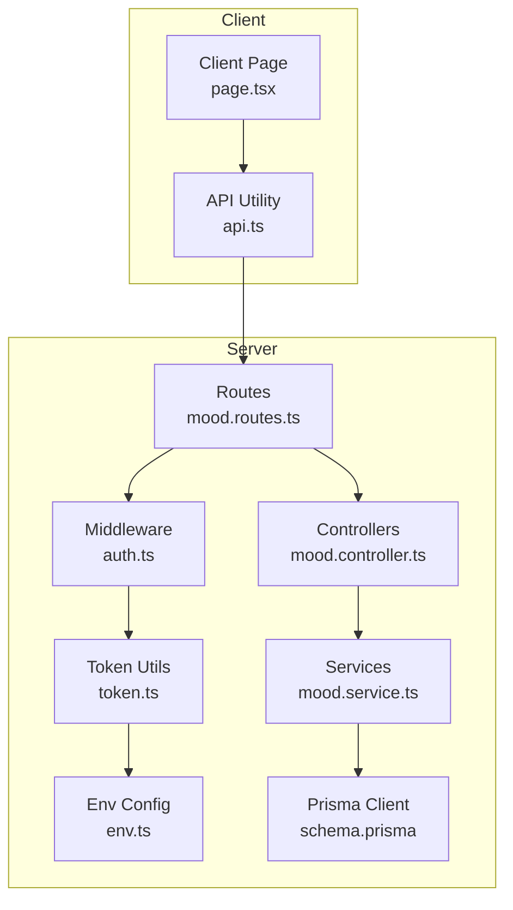
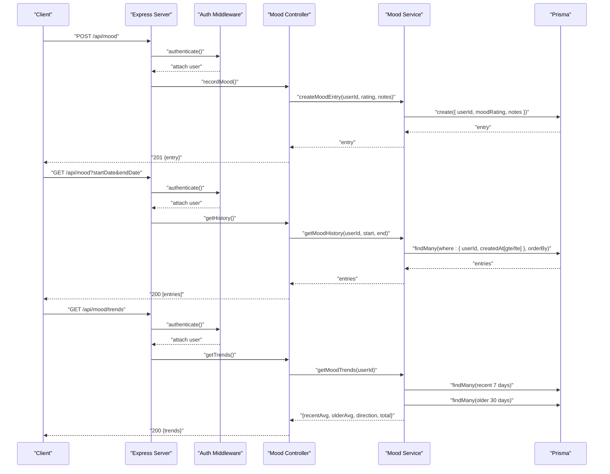
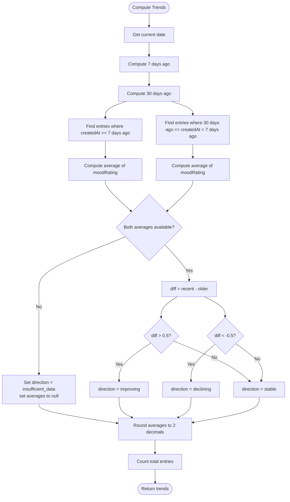
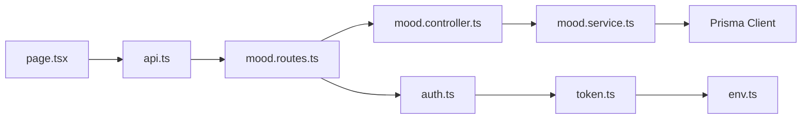

# Mood Tracking API

<cite>
**Referenced Files in This Document**
- [index.ts](file://server/src/index.ts)
- [mood.routes.ts](file://server/src/routes/mood.routes.ts)
- [mood.controller.ts](file://server/src/controllers/mood.controller.ts)
- [mood.service.ts](file://server/src/services/mood.service.ts)
- [auth.ts](file://server/src/middleware/auth.ts)
- [token.ts](file://server/src/utils/token.ts)
- [env.ts](file://server/src/config/env.ts)
- [schema.prisma](file://prisma/schema.prisma)
- [api.ts](file://client/src/lib/api.ts)
- [page.tsx](file://client/src/app/mood/page.tsx)
- [mood.test.ts](file://server/src/__tests__/mood.test.ts)
</cite>

## Table of Contents
1. [Introduction](#introduction)
2. [Project Structure](#project-structure)
3. [Core Components](#core-components)
4. [Architecture Overview](#architecture-overview)
5. [Detailed Component Analysis](#detailed-component-analysis)
6. [Dependency Analysis](#dependency-analysis)
7. [Performance Considerations](#performance-considerations)
8. [Troubleshooting Guide](#troubleshooting-guide)
9. [Conclusion](#conclusion)
10. [Appendices](#appendices)

## Introduction
This document provides comprehensive API documentation for the mood tracking endpoints that enable daily mood logging and trend analysis. It covers:
- Creating mood entries via POST /api/mood
- Retrieving historical mood entries via GET /api/mood
- Computing and retrieving trend analysis via GET /api/mood/trends
- Request/response schemas, validation rules, aggregation logic, and privacy considerations
- Practical workflows for daily reminders, trend reporting, and counselor access patterns
- Integration points with assessment results and client-side usage

## Project Structure
The mood tracking feature spans the backend server (Express), Prisma ORM, and the frontend client:
- Backend routes define the API endpoints and apply authentication middleware
- Controllers validate requests and delegate to services
- Services encapsulate data access and computation logic
- Prisma defines the MoodEntry model and relations
- Frontend integrates with the API to render mood logging, history, and trends

**Diagram sources**
- [index.ts:22-28](file://server/src/index.ts#L22-L28)
- [mood.routes.ts:1-12](file://server/src/routes/mood.routes.ts#L1-L12)
- [mood.controller.ts:1-67](file://server/src/controllers/mood.controller.ts#L1-L67)
- [mood.service.ts:1-58](file://server/src/services/mood.service.ts#L1-L58)
- [auth.ts:1-39](file://server/src/middleware/auth.ts#L1-L39)
- [token.ts:1-17](file://server/src/utils/token.ts#L1-L17)
- [env.ts:1-12](file://server/src/config/env.ts#L1-L12)
- [schema.prisma:86-95](file://prisma/schema.prisma#L86-L95)
- [api.ts:1-36](file://client/src/lib/api.ts#L1-L36)
- [page.tsx:1-245](file://client/src/app/mood/page.tsx#L1-L245)

**Section sources**
- [index.ts:22-28](file://server/src/index.ts#L22-L28)
- [mood.routes.ts:1-12](file://server/src/routes/mood.routes.ts#L1-L12)
- [schema.prisma:86-95](file://prisma/schema.prisma#L86-L95)

## Core Components
- Authentication middleware enforces Bearer token-based access for all mood endpoints
- Controller functions validate inputs and enforce domain rules before delegating to services
- Service functions implement data persistence and trend computations
- Frontend integrates with the API to support daily logging and trend visualization

Key responsibilities:
- POST /api/mood: Create a new mood entry with rating and optional notes
- GET /api/mood: Retrieve history with optional date-range filtering
- GET /api/mood/trends: Compute recent and older averages and trend direction

**Section sources**
- [mood.controller.ts:5-66](file://server/src/controllers/mood.controller.ts#L5-L66)
- [mood.service.ts:3-57](file://server/src/services/mood.service.ts#L3-L57)
- [auth.ts:5-22](file://server/src/middleware/auth.ts#L5-L22)

## Architecture Overview
The mood endpoints follow a layered architecture:
- Routes define endpoint contracts and bind middleware
- Controllers handle request validation and orchestrate service calls
- Services encapsulate data access and analytics
- Middleware authenticates requests and attaches user identity
- Frontend consumes endpoints and renders UI

**Diagram sources**
- [mood.routes.ts:7-9](file://server/src/routes/mood.routes.ts#L7-L9)
- [mood.controller.ts:5-66](file://server/src/controllers/mood.controller.ts#L5-L66)
- [mood.service.ts:3-57](file://server/src/services/mood.service.ts#L3-L57)
- [auth.ts:5-22](file://server/src/middleware/auth.ts#L5-L22)

## Detailed Component Analysis

### Endpoint: POST /api/mood
Purpose: Create a new mood entry for the authenticated user.

- Authentication: Required (Bearer token)
- Request body:
  - moodRating: integer, required, must be between 1 and 5
  - notes: string, optional
- Validation rules:
  - moodRating presence and integer range enforced
  - notes must be a string if provided
- Response:
  - 201 Created with the created mood entry
  - 400 Bad Request for invalid payload
  - 401 Unauthorized if missing/invalid token
- Persistence:
  - Creates a MoodEntry record linked to the user

Example request body:
{
  "moodRating": 4,
  "notes": "Had a productive day"
}

Response schema:
{
  "id": 123,
  "userId": 5,
  "moodRating": 4,
  "notes": "Had a productive day",
  "createdAt": "2025-01-25T10:00:00Z"
}

Common errors:
- Missing or invalid token → 401
- moodRating missing/out-of-range → 400
- notes not a string → 400

**Section sources**
- [mood.controller.ts:12-30](file://server/src/controllers/mood.controller.ts#L12-L30)
- [mood.service.ts:3-7](file://server/src/services/mood.service.ts#L3-L7)
- [schema.prisma:86-95](file://prisma/schema.prisma#L86-L95)

### Endpoint: GET /api/mood
Purpose: Retrieve mood history for the authenticated user with optional date-range filtering.

- Authentication: Required (Bearer token)
- Query parameters:
  - startDate: ISO date string (inclusive)
  - endDate: ISO date string (inclusive)
- Behavior:
  - Filters entries by userId and createdAt within the given range
  - Returns entries ordered by createdAt descending
- Response:
  - 200 OK with array of entries
  - 401 Unauthorized if missing/invalid token

Response schema (array):
[
  {
    "id": 123,
    "userId": 5,
    "moodRating": 4,
    "notes": "Had a productive day",
    "createdAt": "2025-01-25T10:00:00Z"
  },
  ...
]

Usage examples:
- Last 7 days: ?startDate=2025-01-19
- Specific day: ?startDate=2025-01-25&endDate=2025-01-25

**Section sources**
- [mood.controller.ts:36-52](file://server/src/controllers/mood.controller.ts#L36-L52)
- [mood.service.ts:9-20](file://server/src/services/mood.service.ts#L9-L20)

### Endpoint: GET /api/mood/trends
Purpose: Compute and return trend analysis for the authenticated user.

- Authentication: Required (Bearer token)
- Behavior:
  - Computes averages over two windows:
    - Recent: last 7 days
    - Older: 30–7 days ago
  - Direction classification:
    - improving: recentAverage − olderAverage > 0.5
    - declining: recentAverage − olderAverage < −0.5
    - stable: otherwise
    - insufficient_data: if either average cannot be computed
  - Rounds averages to two decimal places
- Response:
  - 200 OK with trend object
  - 401 Unauthorized if missing/invalid token

Response schema:
{
  "recentAverage": 3.75,
  "thirtyDayAverage": 3.20,
  "direction": "improving" | "declining" | "stable" | "insufficient_data",
  "totalEntries": 42
}

Algorithm summary:
- Fetch recent entries (last 7 days)
- Fetch older entries (between 30 and 7 days ago)
- Compute averages; classify direction based on thresholds
- Return rounded averages and counts

**Diagram sources**
- [mood.service.ts:22-57](file://server/src/services/mood.service.ts#L22-L57)

**Section sources**
- [mood.controller.ts:54-66](file://server/src/controllers/mood.controller.ts#L54-L66)
- [mood.service.ts:22-57](file://server/src/services/mood.service.ts#L22-L57)

### Data Model: MoodEntry
The MoodEntry entity stores individual mood logs.

Fields:
- id: integer, primary key
- userId: integer, foreign key to User
- moodRating: integer (1–5)
- notes: string, nullable
- createdAt: datetime, default now()

Indexes:
- Index on userId for efficient lookups

Integration:
- Linked to User via relation
- Used by services for persistence and analytics

**Section sources**
- [schema.prisma:86-95](file://prisma/schema.prisma#L86-L95)

### Authentication and Authorization
- All mood endpoints require a Bearer token in the Authorization header
- Token verification decodes user identity (id, email, role)
- On successful verification, the controller proceeds; otherwise responds with 401

Frontend integration:
- Client adds Authorization header with Bearer token
- On 401 response, client clears token and redirects to login

**Section sources**
- [auth.ts:5-22](file://server/src/middleware/auth.ts#L5-L22)
- [token.ts:14-16](file://server/src/utils/token.ts#L14-L16)
- [api.ts:10-26](file://client/src/lib/api.ts#L10-L26)

### Client-Side Integration
- The mood page fetches history and trends concurrently on load
- Submits new mood entries with validated rating and optional notes
- Displays trend summary and history list with emoji indicators

Frontend schemas used by the UI:
- MoodEntry interface: id, moodRating, notes, createdAt
- MoodTrend interface: averageMood, totalEntries, trend

**Section sources**
- [page.tsx:8-19](file://client/src/app/mood/page.tsx#L8-L19)
- [page.tsx:48-61](file://client/src/app/mood/page.tsx#L48-L61)
- [page.tsx:63-91](file://client/src/app/mood/page.tsx#L63-L91)

## Dependency Analysis
- Route binding: mood.routes.ts binds POST and GET endpoints to controller functions
- Controller-to-service: controllers depend on services for business logic
- Service-to-database: services use Prisma client to persist and query
- Authentication: middleware depends on token utilities and environment configuration

**Diagram sources**
- [mood.routes.ts:1-12](file://server/src/routes/mood.routes.ts#L1-L12)
- [mood.controller.ts:1-67](file://server/src/controllers/mood.controller.ts#L1-L67)
- [mood.service.ts:1-58](file://server/src/services/mood.service.ts#L1-L58)
- [auth.ts:1-39](file://server/src/middleware/auth.ts#L1-L39)
- [token.ts:1-17](file://server/src/utils/token.ts#L1-L17)
- [env.ts:1-12](file://server/src/config/env.ts#L1-L12)
- [api.ts:1-36](file://client/src/lib/api.ts#L1-L36)
- [page.tsx:1-245](file://client/src/app/mood/page.tsx#L1-L245)

**Section sources**
- [mood.routes.ts:1-12](file://server/src/routes/mood.routes.ts#L1-L12)
- [mood.controller.ts:1-67](file://server/src/controllers/mood.controller.ts#L1-L67)
- [mood.service.ts:1-58](file://server/src/services/mood.service.ts#L1-L58)
- [auth.ts:1-39](file://server/src/middleware/auth.ts#L1-L39)
- [token.ts:1-17](file://server/src/utils/token.ts#L1-L17)
- [env.ts:1-12](file://server/src/config/env.ts#L1-L12)
- [api.ts:1-36](file://client/src/lib/api.ts#L1-L36)
- [page.tsx:1-245](file://client/src/app/mood/page.tsx#L1-L245)

## Performance Considerations
- Indexing: The MoodEntry model includes an index on userId, supporting efficient filtering and sorting
- Query patterns:
  - History retrieval uses createdAt bounds and orders by createdAt desc
  - Trend computation performs two bounded queries and simple aggregations
- Recommendations:
  - For large histories, consider pagination for GET /api/mood
  - Cache frequent trend computations per-user if needed
  - Ensure database connection pooling and appropriate timeouts

**Section sources**
- [schema.prisma:94](file://prisma/schema.prisma#L94)
- [mood.service.ts:9-20](file://server/src/services/mood.service.ts#L9-L20)
- [mood.service.ts:27-33](file://server/src/services/mood.service.ts#L27-L33)

## Troubleshooting Guide
Common issues and resolutions:
- 401 Unauthorized
  - Cause: Missing or invalid Bearer token
  - Resolution: Ensure Authorization header is present and valid; client clears token and redirects to login on 401
- 400 Bad Request on POST /api/mood
  - Cause: moodRating missing/outside 1–5, or notes not a string
  - Resolution: Validate inputs before sending; ensure integer rating within range
- Empty history or limited entries
  - Cause: Date range filter excludes data or user has few entries
  - Resolution: Adjust startDate/endDate query parameters; confirm user has entries
- Trend direction “insufficient_data”
  - Cause: Not enough entries in one or both windows
  - Resolution: Encourage consistent daily logging; trend requires at least one entry per relevant window

Privacy and security:
- All endpoints require authentication; tokens are validated server-side
- Data is scoped to the authenticated user’s records
- Avoid exposing sensitive fields in responses beyond the documented schemas

**Section sources**
- [mood.controller.ts:14-27](file://server/src/controllers/mood.controller.ts#L14-L27)
- [mood.controller.ts:38-41](file://server/src/controllers/mood.controller.ts#L38-L41)
- [mood.controller.ts:56-59](file://server/src/controllers/mood.controller.ts#L56-L59)
- [api.ts:20-26](file://client/src/lib/api.ts#L20-L26)

## Conclusion
The mood tracking API provides a focused set of endpoints for daily logging, historical retrieval, and trend analysis. It enforces strong validation, scopes data to authenticated users, and offers a clear client integration pattern. Extending the system could include pagination for history, richer aggregation options, and counselor access controls if needed.

## Appendices

### API Definitions

- POST /api/mood
  - Headers: Authorization: Bearer <token>, Content-Type: application/json
  - Body: { moodRating: integer 1..5, notes?: string }
  - Responses:
    - 201: { id, userId, moodRating, notes, createdAt }
    - 400: { error }
    - 401: { error }

- GET /api/mood
  - Headers: Authorization: Bearer <token>
  - Query: startDate (ISO date), endDate (ISO date)
  - Responses:
    - 200: Array of entries
    - 401: { error }

- GET /api/mood/trends
  - Headers: Authorization: Bearer <token>
  - Responses:
    - 200: { recentAverage, thirtyDayAverage, direction, totalEntries }
    - 401: { error }

### Example Workflows

- Daily reminder workflow
  - Client prompts user to log mood at a fixed time
  - On submission, client posts to POST /api/mood and refreshes history/trends
- Trend reporting
  - Client calls GET /api/mood/trends to display recentAverage, direction, and totalEntries
- Historical analysis
  - Client calls GET /api/mood with startDate/endDate to filter entries for a period

### Integration with Assessment Results
- While assessment endpoints are separate, both mood and assessment data can be combined for holistic insights
- Counselors can correlate mood trends with assessment scores when accessing shared contexts

**Section sources**
- [assessment.controller.ts:5-34](file://server/src/controllers/assessment.controller.ts#L5-L34)
- [assessment.controller.ts:36-48](file://server/src/controllers/assessment.controller.ts#L36-L48)