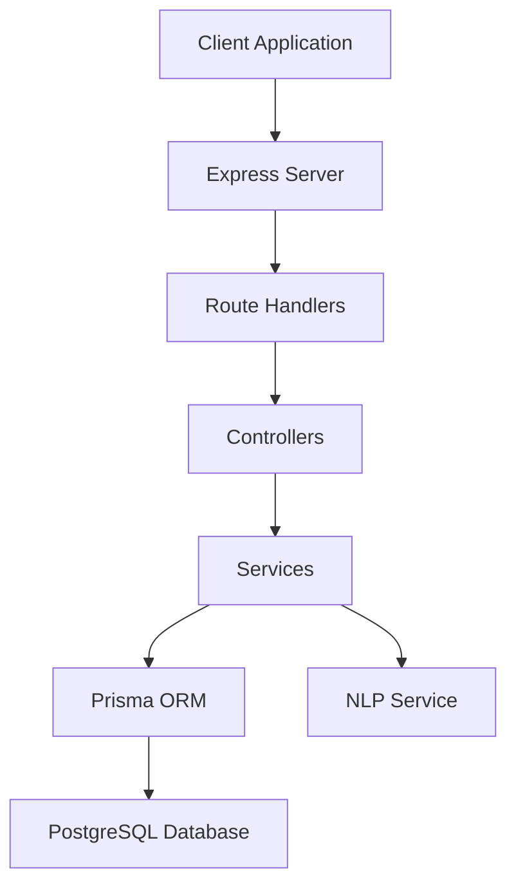
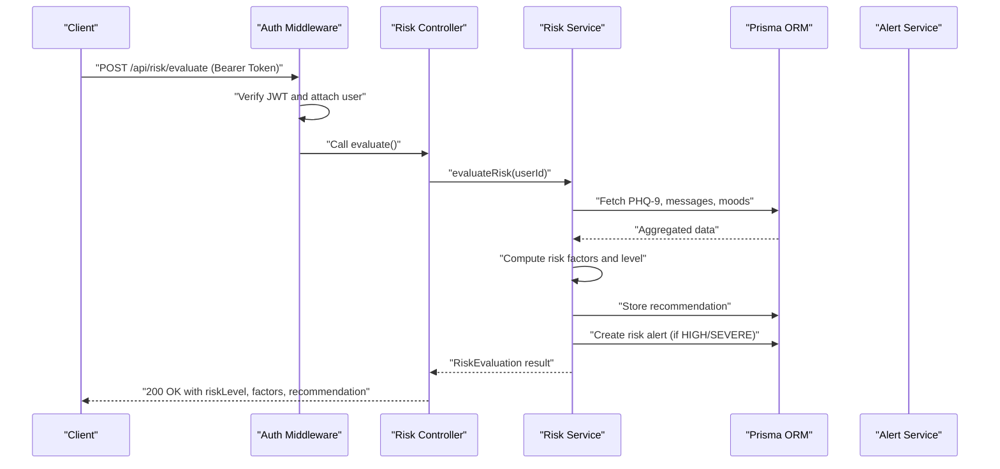
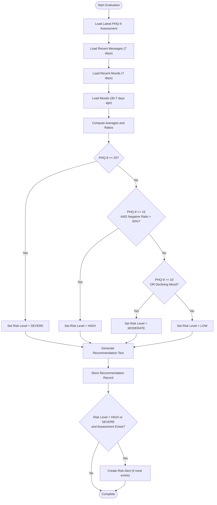
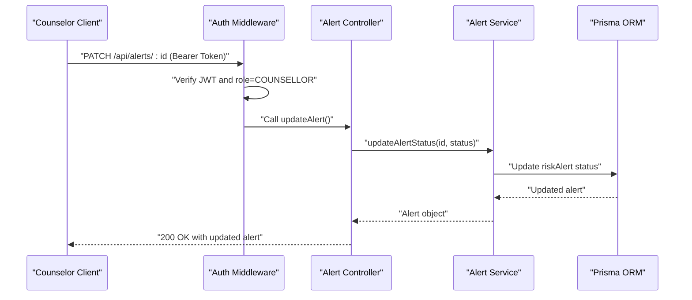
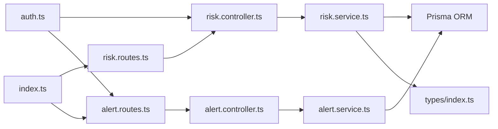
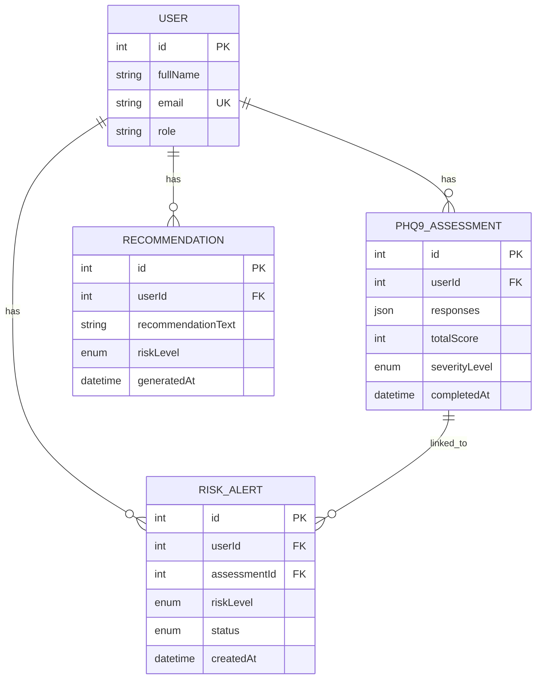

# Risk Management API

<cite>
**Referenced Files in This Document**
- [index.ts](file://server/src/index.ts)
- [env.ts](file://server/src/config/env.ts)
- [risk.routes.ts](file://server/src/routes/risk.routes.ts)
- [risk.controller.ts](file://server/src/controllers/risk.controller.ts)
- [risk.service.ts](file://server/src/services/risk.service.ts)
- [alert.routes.ts](file://server/src/routes/alert.routes.ts)
- [alert.controller.ts](file://server/src/controllers/alert.controller.ts)
- [alert.service.ts](file://server/src/services/alert.service.ts)
- [auth.ts](file://server/src/middleware/auth.ts)
- [types/index.ts](file://server/src/types/index.ts)
- [schema.prisma](file://prisma/schema.prisma)
- [risk.test.ts](file://server/src/__tests__/risk.test.ts)
</cite>

## Table of Contents
1. [Introduction](#introduction)
2. [Project Structure](#project-structure)
3. [Core Components](#core-components)
4. [Architecture Overview](#architecture-overview)
5. [Detailed Component Analysis](#detailed-component-analysis)
6. [Dependency Analysis](#dependency-analysis)
7. [Performance Considerations](#performance-considerations)
8. [Troubleshooting Guide](#troubleshooting-guide)
9. [Security and Access Control](#security-and-access-control)
10. [Integration with Alert Management](#integration-with-alert-management)
11. [Conclusion](#conclusion)

## Introduction
This document provides comprehensive API documentation for the Risk Management system, focusing on automated risk detection, manual risk evaluation, and alert escalation workflows. The system integrates PHQ-9 assessment data, sentiment analysis of user-chat messages, and mood trends to calculate risk levels and generate intervention recommendations. High-risk cases automatically trigger alerts for counselor review and intervention.

## Project Structure
The Risk Management API is part of a larger Express.js backend with modular routing, controllers, services, and database models managed by Prisma ORM.

**Diagram sources**
- [index.ts:13-35](file://server/src/index.ts#L13-L35)
- [risk.routes.ts:1-11](file://server/src/routes/risk.routes.ts#L1-L11)
- [alert.routes.ts:1-15](file://server/src/routes/alert.routes.ts#L1-L15)

**Section sources**
- [index.ts:1-35](file://server/src/index.ts#L1-L35)
- [risk.routes.ts:1-11](file://server/src/routes/risk.routes.ts#L1-L11)
- [alert.routes.ts:1-15](file://server/src/routes/alert.routes.ts#L1-L15)

## Core Components
- Risk Evaluation Engine: Computes risk level from PHQ-9 scores, recent message sentiment ratios, and mood trends.
- Alert Generation: Creates risk alerts for HIGH and SEVERE cases linked to specific assessments.
- Counselor Workflow: Provides endpoints for counselors to view, update, and manage risk alerts.
- Authentication & Authorization: Protects endpoints with JWT bearer tokens and role-based access control.

Key endpoints:
- POST `/api/risk/evaluate`: Initiates risk assessment for the authenticated user.
- GET `/api/risk/latest`: Retrieves the latest risk evaluation and alert for the authenticated user.
- GET `/api/alerts`: Lists all risk alerts (counselors only).
- GET `/api/alerts/:id`: Retrieves a specific alert (counselors only).
- PATCH `/api/alerts/:id`: Updates alert status (counselors only).
- GET `/api/alerts/:id/student`: Retrieves student summary for alert (counselors only).

**Section sources**
- [risk.controller.ts:5-31](file://server/src/controllers/risk.controller.ts#L5-L31)
- [risk.routes.ts:7-8](file://server/src/routes/risk.routes.ts#L7-L8)
- [alert.controller.ts:5-69](file://server/src/controllers/alert.controller.ts#L5-L69)
- [alert.routes.ts:9-12](file://server/src/routes/alert.routes.ts#L9-L12)

## Architecture Overview
The Risk Management API follows a layered architecture with clear separation of concerns:

**Diagram sources**
- [risk.controller.ts:5-17](file://server/src/controllers/risk.controller.ts#L5-L17)
- [risk.service.ts:11-107](file://server/src/services/risk.service.ts#L11-L107)
- [auth.ts:5-22](file://server/src/middleware/auth.ts#L5-L22)

**Section sources**
- [risk.controller.ts:1-32](file://server/src/controllers/risk.controller.ts#L1-L32)
- [risk.service.ts:1-138](file://server/src/services/risk.service.ts#L1-L138)
- [auth.ts:1-39](file://server/src/middleware/auth.ts#L1-L39)

## Detailed Component Analysis

### Risk Evaluation Endpoint
POST `/api/risk/evaluate`
- Purpose: Trigger risk assessment computation for the authenticated user.
- Authentication: Required (Bearer token).
- Request body: None.
- Response: RiskEvaluation object containing riskLevel, factors, and recommendation.
- Behavior:
  - Fetches latest PHQ-9 assessment.
  - Analyzes recent user messages (last 7 days) for sentiment.
  - Compares recent vs older mood averages to detect trends.
  - Applies risk rules to determine riskLevel.
  - Generates recommendation text based on riskLevel.
  - Stores recommendation record.
  - Creates risk alert for HIGH/SEVERE cases if none exists for the assessment.

Risk calculation logic:
- Severe risk: PHQ-9 score ≥ 20.
- High risk: PHQ-9 score ≥ 15 AND negative sentiment ratio > 50%.
- Moderate risk: PHQ-9 score ≥ 10 OR declining mood trend.
- Low risk: Otherwise.

Recommendation text varies by risk level, escalating messaging for higher risks.

**Section sources**
- [risk.routes.ts:7](file://server/src/routes/risk.routes.ts#L7)
- [risk.controller.ts:5-17](file://server/src/controllers/risk.controller.ts#L5-L17)
- [risk.service.ts:11-107](file://server/src/services/risk.service.ts#L11-L107)

### Latest Risk Evaluation Endpoint
GET `/api/risk/latest`
- Purpose: Retrieve the most recent risk recommendation and alert for the authenticated user.
- Authentication: Required (Bearer token).
- Response: Object containing recommendation and alert details.
- Behavior:
  - Queries the latest recommendation record.
  - Queries the latest risk alert.
  - Returns both for client display.

**Section sources**
- [risk.routes.ts:8](file://server/src/routes/risk.routes.ts#L8)
- [risk.controller.ts:19-31](file://server/src/controllers/risk.controller.ts#L19-L31)
- [risk.service.ts:122-137](file://server/src/services/risk.service.ts#L122-L137)

### Risk Detection Algorithm Flow

**Diagram sources**
- [risk.service.ts:11-107](file://server/src/services/risk.service.ts#L11-L107)

**Section sources**
- [risk.service.ts:40-73](file://server/src/services/risk.service.ts#L40-L73)
- [risk.service.ts:109-120](file://server/src/services/risk.service.ts#L109-L120)

### Alert Management Workflow
Counselor endpoints for managing risk alerts:
- GET `/api/alerts`: List alerts with optional filters (status, riskLevel).
- GET `/api/alerts/:id`: Retrieve alert details including user and assessment.
- PATCH `/api/alerts/:id`: Update alert status (PENDING, REVIEWED, RESOLVED).
- GET `/api/alerts/:id/student`: Retrieve student summary including recent assessments, moods, and recommendations.

**Diagram sources**
- [alert.routes.ts:7-12](file://server/src/routes/alert.routes.ts#L7-L12)
- [alert.controller.ts:32-53](file://server/src/controllers/alert.controller.ts#L32-L53)
- [alert.service.ts:28-33](file://server/src/services/alert.service.ts#L28-L33)

**Section sources**
- [alert.controller.ts:1-70](file://server/src/controllers/alert.controller.ts#L1-L70)
- [alert.service.ts:1-62](file://server/src/services/alert.service.ts#L1-L62)
- [alert.routes.ts:1-15](file://server/src/routes/alert.routes.ts#L1-L15)

## Dependency Analysis
The system exhibits clean layering with explicit dependencies:

**Diagram sources**
- [risk.routes.ts:1-11](file://server/src/routes/risk.routes.ts#L1-L11)
- [risk.controller.ts:1-32](file://server/src/controllers/risk.controller.ts#L1-L32)
- [risk.service.ts:1-138](file://server/src/services/risk.service.ts#L1-L138)
- [alert.routes.ts:1-15](file://server/src/routes/alert.routes.ts#L1-L15)
- [alert.controller.ts:1-70](file://server/src/controllers/alert.controller.ts#L1-L70)
- [alert.service.ts:1-62](file://server/src/services/alert.service.ts#L1-L62)
- [auth.ts:1-39](file://server/src/middleware/auth.ts#L1-L39)
- [types/index.ts:1-12](file://server/src/types/index.ts#L1-L12)
- [index.ts:1-35](file://server/src/index.ts#L1-L35)

**Section sources**
- [index.ts:4-28](file://server/src/index.ts#L4-L28)
- [risk.routes.ts:1-11](file://server/src/routes/risk.routes.ts#L1-L11)
- [alert.routes.ts:1-15](file://server/src/routes/alert.routes.ts#L1-L15)

## Performance Considerations
- Database queries are scoped to recent time windows (7 days for messages/moods, 30 days for comparison) to limit data volume.
- Aggregation calculations (averages, ratios) are computed client-side after fetching bounded datasets.
- Recommendations and alerts are stored asynchronously after risk computation to minimize latency.
- Consider adding database indexes on frequently queried fields (assessmentId, userId, createdAt) to optimize alert queries.

## Troubleshooting Guide
Common issues and resolutions:
- Authentication failures: Ensure Bearer token is present and valid. Verify token signature against configured secret.
- Authorization failures: Counselor-only endpoints require role=COUNSELLOR.
- Missing assessment data: Risk evaluation defaults to low risk when no PHQ-9 assessment is found.
- Duplicate alerts: The system checks for existing PENDING alerts before creating new ones.
- Invalid status updates: Only PENDING, REVIEWED, and RESOLVED statuses are accepted.

**Section sources**
- [auth.ts:5-22](file://server/src/middleware/auth.ts#L5-L22)
- [alert.controller.ts:37-40](file://server/src/controllers/alert.controller.ts#L37-L40)
- [risk.service.ts:88-104](file://server/src/services/risk.service.ts#L88-L104)

## Security and Access Control
- Authentication: All risk endpoints require a valid JWT Bearer token attached to the Authorization header.
- Authorization: Alert management endpoints are protected by role-based access control requiring COUNSELLOR role.
- Token verification: Tokens are validated using the configured JWT secret.
- Data exposure: Responses are scoped to authenticated user context; counselor endpoints include user identifiers for alert management.

**Section sources**
- [auth.ts:5-39](file://server/src/middleware/auth.ts#L5-L39)
- [alert.routes.ts:7](file://server/src/routes/alert.routes.ts#L7)
- [env.ts:6-11](file://server/src/config/env.ts#L6-L11)

## Integration with Alert Management
Risk alerts integrate with the broader alert management system:
- Creation: HIGH/SEVERE risk triggers creation of a PENDING risk alert linked to the assessment.
- Status tracking: Counselors update alert status through PATCH requests.
- Student summaries: Detailed student context (assessments, moods, messages) is available for informed decisions.
- Filtering: Alerts can be filtered by status and risk level for efficient triage.

**Diagram sources**
- [schema.prisma:47-133](file://prisma/schema.prisma#L47-L133)

**Section sources**
- [schema.prisma:10-45](file://prisma/schema.prisma#L10-L45)
- [risk.service.ts:88-104](file://server/src/services/risk.service.ts#L88-L104)
- [alert.service.ts:3-16](file://server/src/services/alert.service.ts#L3-L16)

## Conclusion
The Risk Management API provides a robust foundation for automated risk detection and counselor-driven intervention. It combines clinical assessment data, behavioral signals from chat interactions, and mood trends to compute risk levels and generate actionable recommendations. The alert system ensures timely escalation and tracking of high-risk cases, while strict authentication and authorization protect sensitive data. Future enhancements could include configurable thresholds, audit trails, and integration with external reporting systems.