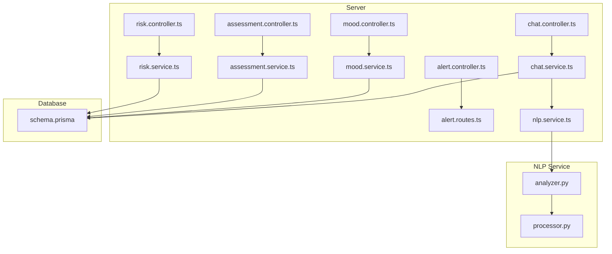
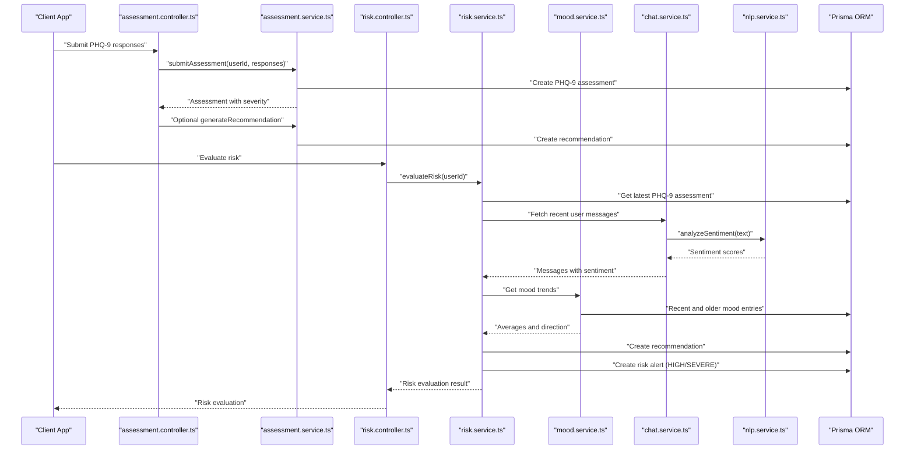
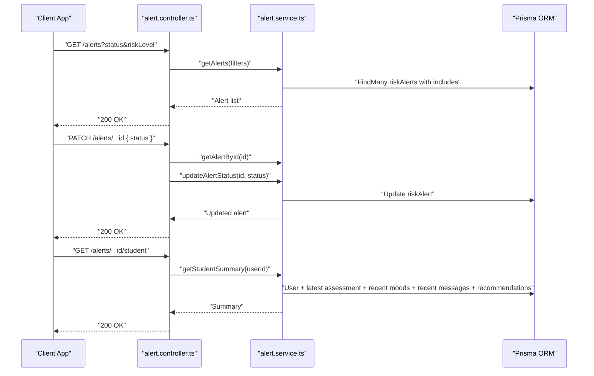
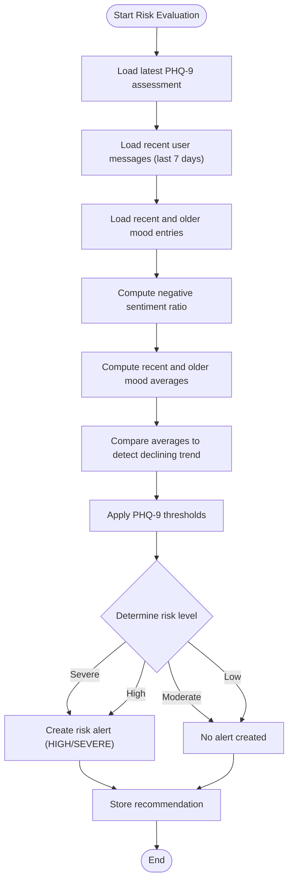
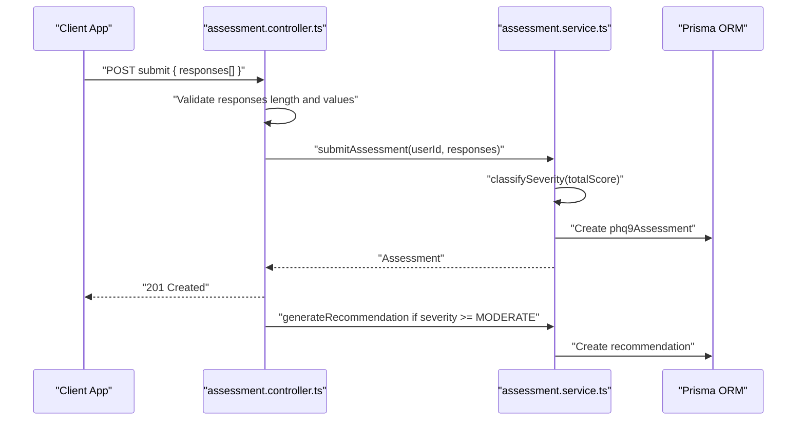
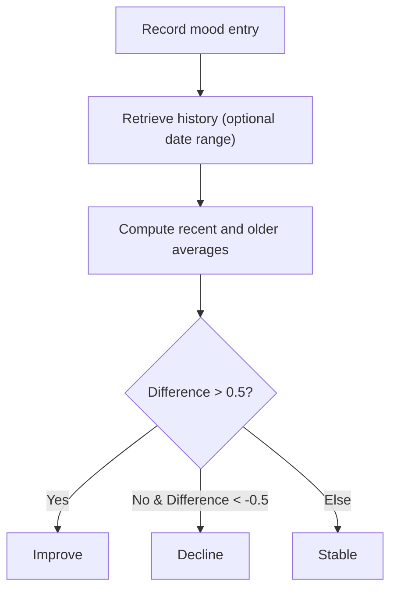
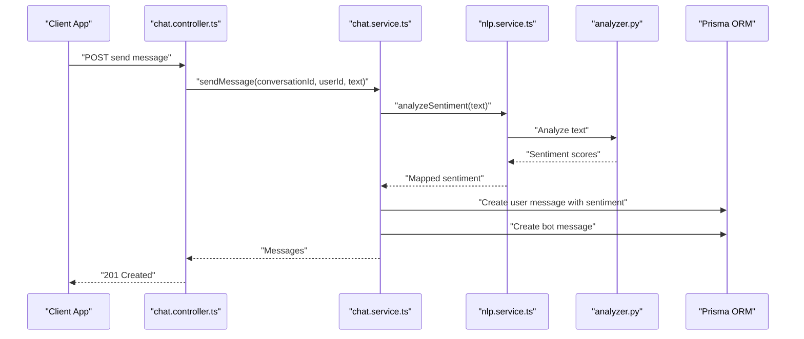
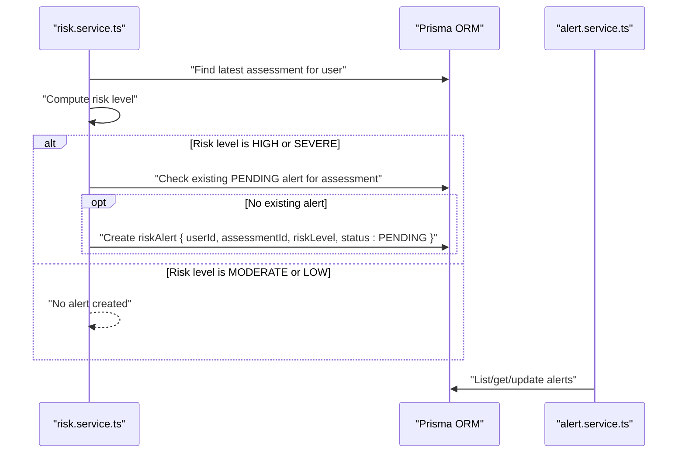
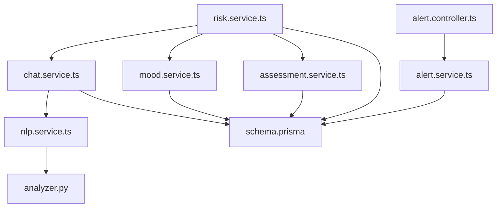
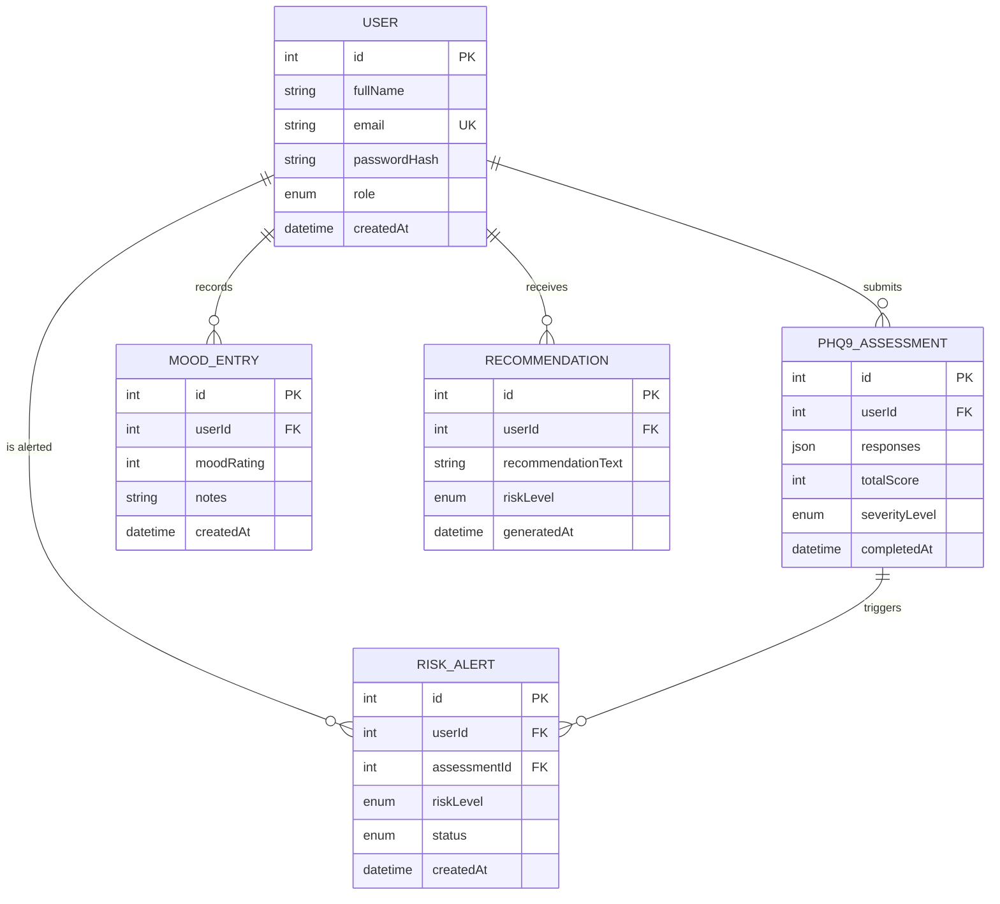

# Alert Creation and Triggering

<cite>
**Referenced Files in This Document**
- [alert.controller.ts](file://server/src/controllers/alert.controller.ts)
- [alert.service.ts](file://server/src/services/alert.service.ts)
- [alert.routes.ts](file://server/src/routes/alert.routes.ts)
- [risk.controller.ts](file://server/src/controllers/risk.controller.ts)
- [risk.service.ts](file://server/src/services/risk.service.ts)
- [assessment.controller.ts](file://server/src/controllers/assessment.controller.ts)
- [assessment.service.ts](file://server/src/services/assessment.service.ts)
- [mood.controller.ts](file://server/src/controllers/mood.controller.ts)
- [mood.service.ts](file://server/src/services/mood.service.ts)
- [chat.controller.ts](file://server/src/controllers/chat.controller.ts)
- [chat.service.ts](file://server/src/services/chat.service.ts)
- [nlp.service.ts](file://server/src/services/nlp.service.ts)
- [analyzer.py](file://nlp-service/nlp/analyzer.py)
- [processor.py](file://nlp-service/nlp/processor.py)
- [schema.prisma](file://prisma/schema.prisma)
</cite>

## Table of Contents
1. [Introduction](#introduction)
2. [Project Structure](#project-structure)
3. [Core Components](#core-components)
4. [Architecture Overview](#architecture-overview)
5. [Detailed Component Analysis](#detailed-component-analysis)
6. [Dependency Analysis](#dependency-analysis)
7. [Performance Considerations](#performance-considerations)
8. [Troubleshooting Guide](#troubleshooting-guide)
9. [Conclusion](#conclusion)
10. [Appendices](#appendices)

## Introduction
This document explains how alerts are automatically generated and triggered within the system. Alerts are created based on PHQ-9 assessment results, mood tracking patterns, and behavioral indicators derived from conversational sentiment. The risk scoring algorithm determines alert thresholds and escalation criteria, and the alert generation workflow spans from data collection to automatic trigger activation. Integration points include assessment services, mood tracking systems, and risk evaluation logic. The document also covers alert timing mechanisms, batch processing capabilities, and real-time monitoring requirements.

## Project Structure
The alert system spans backend controllers, services, and database models, with auxiliary NLP services for sentiment analysis. The backend exposes REST endpoints for alert management and risk evaluation, while the database schema defines the alert, assessment, mood, and recommendation entities.

**Diagram sources**
- [alert.controller.ts:1-70](file://server/src/controllers/alert.controller.ts#L1-L70)
- [alert.routes.ts:1-15](file://server/src/routes/alert.routes.ts#L1-L15)
- [risk.controller.ts:1-32](file://server/src/controllers/risk.controller.ts#L1-L32)
- [risk.service.ts:1-138](file://server/src/services/risk.service.ts#L1-L138)
- [assessment.controller.ts:1-74](file://server/src/controllers/assessment.controller.ts#L1-L74)
- [assessment.service.ts:1-89](file://server/src/services/assessment.service.ts#L1-L89)
- [mood.controller.ts:1-67](file://server/src/controllers/mood.controller.ts#L1-L67)
- [mood.service.ts:1-58](file://server/src/services/mood.service.ts#L1-L58)
- [chat.controller.ts:1-69](file://server/src/controllers/chat.controller.ts#L1-L69)
- [chat.service.ts:1-105](file://server/src/services/chat.service.ts#L1-L105)
- [nlp.service.ts:1-24](file://server/src/services/nlp.service.ts#L1-L24)
- [schema.prisma:1-134](file://prisma/schema.prisma#L1-L134)
- [analyzer.py:1-27](file://nlp-service/nlp/analyzer.py#L1-L27)
- [processor.py:1-19](file://nlp-service/nlp/processor.py#L1-L19)

**Section sources**
- [alert.controller.ts:1-70](file://server/src/controllers/alert.controller.ts#L1-L70)
- [alert.routes.ts:1-15](file://server/src/routes/alert.routes.ts#L1-L15)
- [risk.controller.ts:1-32](file://server/src/controllers/risk.controller.ts#L1-L32)
- [risk.service.ts:1-138](file://server/src/services/risk.service.ts#L1-L138)
- [assessment.controller.ts:1-74](file://server/src/controllers/assessment.controller.ts#L1-L74)
- [assessment.service.ts:1-89](file://server/src/services/assessment.service.ts#L1-L89)
- [mood.controller.ts:1-67](file://server/src/controllers/mood.controller.ts#L1-L67)
- [mood.service.ts:1-58](file://server/src/services/mood.service.ts#L1-L58)
- [chat.controller.ts:1-69](file://server/src/controllers/chat.controller.ts#L1-L69)
- [chat.service.ts:1-105](file://server/src/services/chat.service.ts#L1-L105)
- [nlp.service.ts:1-24](file://server/src/services/nlp.service.ts#L1-L24)
- [schema.prisma:1-134](file://prisma/schema.prisma#L1-L134)
- [analyzer.py:1-27](file://nlp-service/nlp/analyzer.py#L1-L27)
- [processor.py:1-19](file://nlp-service/nlp/processor.py#L1-L19)

## Core Components
- Alert Management
  - Controllers expose endpoints to list, retrieve, update alert status, and fetch student summaries.
  - Services query alerts, update status, and compute student summaries including latest assessment, recent moods, message sentiment breakdown, and recommendations.
- Risk Evaluation
  - Controllers evaluate risk for authenticated users and fetch the latest risk evaluation.
  - Services calculate risk level from PHQ-9 score, recent message sentiment ratios, and mood trends; persist recommendations; and create alerts for HIGH or SEVERE risk.
- Assessment
  - Controllers submit PHQ-9 responses, validate input, and optionally generate recommendations for moderate or higher severity.
  - Services compute total score, classify severity, and map severity to risk level for alerting.
- Mood Tracking
  - Controllers record mood entries and retrieve history and trends.
  - Services compute averages and direction (improving/stable/declining) over recent and older windows.
- Chat and NLP
  - Controllers manage conversations and messages.
  - Services analyze sentiment via external NLP service, store messages with sentiment, and generate bot responses.

**Section sources**
- [alert.controller.ts:1-70](file://server/src/controllers/alert.controller.ts#L1-L70)
- [alert.service.ts:1-62](file://server/src/services/alert.service.ts#L1-L62)
- [risk.controller.ts:1-32](file://server/src/controllers/risk.controller.ts#L1-L32)
- [risk.service.ts:1-138](file://server/src/services/risk.service.ts#L1-L138)
- [assessment.controller.ts:1-74](file://server/src/controllers/assessment.controller.ts#L1-L74)
- [assessment.service.ts:1-89](file://server/src/services/assessment.service.ts#L1-L89)
- [mood.controller.ts:1-67](file://server/src/controllers/mood.controller.ts#L1-L67)
- [mood.service.ts:1-58](file://server/src/services/mood.service.ts#L1-L58)
- [chat.controller.ts:1-69](file://server/src/controllers/chat.controller.ts#L1-L69)
- [chat.service.ts:1-105](file://server/src/services/chat.service.ts#L1-L105)
- [nlp.service.ts:1-24](file://server/src/services/nlp.service.ts#L1-L24)

## Architecture Overview
The alert creation pipeline integrates assessment, mood, and chat data to compute risk and trigger alerts. The process begins when a user submits a PHQ-9 assessment. The system computes severity and risk, stores a recommendation, and evaluates mood trends and recent message sentiment to determine whether to escalate to a risk alert. The alert remains PENDING until reviewed or resolved by a counsellor.

**Diagram sources**
- [assessment.controller.ts:1-74](file://server/src/controllers/assessment.controller.ts#L1-L74)
- [assessment.service.ts:1-89](file://server/src/services/assessment.service.ts#L1-L89)
- [risk.controller.ts:1-32](file://server/src/controllers/risk.controller.ts#L1-L32)
- [risk.service.ts:1-138](file://server/src/services/risk.service.ts#L1-L138)
- [mood.service.ts:1-58](file://server/src/services/mood.service.ts#L1-L58)
- [chat.service.ts:1-105](file://server/src/services/chat.service.ts#L1-L105)
- [nlp.service.ts:1-24](file://server/src/services/nlp.service.ts#L1-L24)
- [schema.prisma:1-134](file://prisma/schema.prisma#L1-L134)

## Detailed Component Analysis

### Alert Management Workflow
- Endpoint exposure: GET /alerts, GET /alerts/:id, PATCH /alerts/:id, GET /alerts/:id/student.
- Authorization: Requires authentication and role COUNSELLOR.
- Operations:
  - List alerts with optional filters by status and risk level.
  - Retrieve a single alert with related user and assessment details.
  - Update alert status with validation (PENDING, REVIEWED, RESOLVED).
  - Fetch student summary including latest assessment, recent moods, sentiment breakdown, and recommendations.

**Diagram sources**
- [alert.controller.ts:1-70](file://server/src/controllers/alert.controller.ts#L1-L70)
- [alert.service.ts:1-62](file://server/src/services/alert.service.ts#L1-L62)
- [alert.routes.ts:1-15](file://server/src/routes/alert.routes.ts#L1-L15)
- [schema.prisma:1-134](file://prisma/schema.prisma#L1-L134)

**Section sources**
- [alert.controller.ts:1-70](file://server/src/controllers/alert.controller.ts#L1-L70)
- [alert.service.ts:1-62](file://server/src/services/alert.service.ts#L1-L62)
- [alert.routes.ts:1-15](file://server/src/routes/alert.routes.ts#L1-L15)

### Risk Scoring and Alert Thresholds
- Inputs:
  - Latest PHQ-9 total score and severity level.
  - Recent user messages (last 7 days) with computed negative sentiment ratio.
  - Mood trend comparison between recent (last 7 days) and older (7–30 days) windows.
- Rules:
  - Severe risk: PHQ-9 total score ≥ 20.
  - High risk: PHQ-9 total score ≥ 15 with negative sentiment ratio > 50%, or PHQ-9 total score ≥ 10 combined with a declining mood trend.
  - Moderate risk: PHQ-9 total score ≥ 10 or a declining mood trend.
  - Low risk: otherwise.
- Escalation:
  - For HIGH or SEVERE risk, a pending risk alert is created only if none exists for the latest assessment.
  - A recommendation is stored for each evaluation.

**Diagram sources**
- [risk.service.ts:1-138](file://server/src/services/risk.service.ts#L1-L138)
- [assessment.service.ts:1-89](file://server/src/services/assessment.service.ts#L1-L89)
- [mood.service.ts:1-58](file://server/src/services/mood.service.ts#L1-L58)
- [chat.service.ts:1-105](file://server/src/services/chat.service.ts#L1-L105)
- [nlp.service.ts:1-24](file://server/src/services/nlp.service.ts#L1-L24)

**Section sources**
- [risk.service.ts:1-138](file://server/src/services/risk.service.ts#L1-L138)
- [assessment.service.ts:1-89](file://server/src/services/assessment.service.ts#L1-L89)
- [mood.service.ts:1-58](file://server/src/services/mood.service.ts#L1-L58)
- [chat.service.ts:1-105](file://server/src/services/chat.service.ts#L1-L105)
- [nlp.service.ts:1-24](file://server/src/services/nlp.service.ts#L1-L24)

### Assessment Integration and Severity Mapping
- Submission validates PHQ-9 responses (exactly nine items, integer values 0–3).
- Computes total score and severity level using a classification function.
- Maps severity to risk level for alerting and generates a recommendation when appropriate.

**Diagram sources**
- [assessment.controller.ts:1-74](file://server/src/controllers/assessment.controller.ts#L1-L74)
- [assessment.service.ts:1-89](file://server/src/services/assessment.service.ts#L1-L89)
- [schema.prisma:1-134](file://prisma/schema.prisma#L1-L134)

**Section sources**
- [assessment.controller.ts:1-74](file://server/src/controllers/assessment.controller.ts#L1-L74)
- [assessment.service.ts:1-89](file://server/src/services/assessment.service.ts#L1-L89)

### Mood Tracking Patterns
- Records mood entries with integer ratings (1–5) and optional notes.
- Retrieves history with date-range filtering and computes trends over recent and older windows.
- Declining trend threshold: difference between recent and older averages below −0.5.

**Diagram sources**
- [mood.controller.ts:1-67](file://server/src/controllers/mood.controller.ts#L1-L67)
- [mood.service.ts:1-58](file://server/src/services/mood.service.ts#L1-L58)
- [schema.prisma:1-134](file://prisma/schema.prisma#L1-L134)

**Section sources**
- [mood.controller.ts:1-67](file://server/src/controllers/mood.controller.ts#L1-L67)
- [mood.service.ts:1-58](file://server/src/services/mood.service.ts#L1-L58)

### Behavioral Indicators via Conversational Sentiment
- Messages are analyzed for sentiment using an external NLP service.
- Stored with sentiment classification and compound score.
- Risk evaluation aggregates recent negative sentiment ratio to inform risk level.

**Diagram sources**
- [chat.controller.ts:1-69](file://server/src/controllers/chat.controller.ts#L1-L69)
- [chat.service.ts:1-105](file://server/src/services/chat.service.ts#L1-L105)
- [nlp.service.ts:1-24](file://server/src/services/nlp.service.ts#L1-L24)
- [analyzer.py:1-27](file://nlp-service/nlp/analyzer.py#L1-L27)
- [schema.prisma:1-134](file://prisma/schema.prisma#L1-L134)

**Section sources**
- [chat.controller.ts:1-69](file://server/src/controllers/chat.controller.ts#L1-L69)
- [chat.service.ts:1-105](file://server/src/services/chat.service.ts#L1-L105)
- [nlp.service.ts:1-24](file://server/src/services/nlp.service.ts#L1-L24)
- [analyzer.py:1-27](file://nlp-service/nlp/analyzer.py#L1-L27)

### Alert Generation Workflow
- Automatic triggers:
  - After risk evaluation, if risk level is HIGH or SEVERE and a matching alert does not already exist for the latest assessment, a PENDING alert is created.
- Manual management:
  - Counsellors can list alerts, filter by status and risk level, update status, and view student summaries.

**Diagram sources**
- [risk.service.ts:1-138](file://server/src/services/risk.service.ts#L1-L138)
- [alert.service.ts:1-62](file://server/src/services/alert.service.ts#L1-L62)
- [schema.prisma:1-134](file://prisma/schema.prisma#L1-L134)

**Section sources**
- [risk.service.ts:1-138](file://server/src/services/risk.service.ts#L1-L138)
- [alert.service.ts:1-62](file://server/src/services/alert.service.ts#L1-L62)

### Examples of Scenarios That Trigger Alerts
- High-risk assessment score: PHQ-9 total score ≥ 20 → Severe risk → Alert created.
- Mixed high-risk indicators: PHQ-9 total score ≥ 15 with negative sentiment ratio > 50% → High risk → Alert created.
- Moderate-risk indicators: PHQ-9 total score ≥ 10 or a declining mood trend → Moderate risk → No alert created; recommendation stored.
- Low-risk baseline: All indicators within normal range → Low risk → No alert created; recommendation stored.

**Section sources**
- [risk.service.ts:1-138](file://server/src/services/risk.service.ts#L1-L138)
- [assessment.service.ts:1-89](file://server/src/services/assessment.service.ts#L1-L89)
- [mood.service.ts:1-58](file://server/src/services/mood.service.ts#L1-L58)

### Alert Timing Mechanisms, Batch Processing, and Real-Time Monitoring
- Real-time monitoring:
  - Risk evaluation runs immediately upon request and after assessment submission.
  - Sentiment analysis occurs during chat message sending.
- Timing:
  - Alerts are created synchronously when risk evaluation deems escalation necessary.
- Batch processing:
  - No explicit batch job is present in the current codebase. Recommendations and alerts are generated per-user evaluation.
- Escalation criteria:
  - Alerts are created only for HIGH or SEVERE risk and only if no matching PENDING alert exists for the latest assessment.

**Section sources**
- [risk.controller.ts:1-32](file://server/src/controllers/risk.controller.ts#L1-L32)
- [risk.service.ts:1-138](file://server/src/services/risk.service.ts#L1-L138)
- [assessment.controller.ts:1-74](file://server/src/controllers/assessment.controller.ts#L1-L74)
- [chat.controller.ts:1-69](file://server/src/controllers/chat.controller.ts#L1-L69)
- [chat.service.ts:1-105](file://server/src/services/chat.service.ts#L1-L105)

## Dependency Analysis
The alert system depends on assessment, mood, and chat services, with Prisma ORM managing persistence. Risk evaluation orchestrates data retrieval and decision-making, while alert management provides administrative controls.

**Diagram sources**
- [risk.service.ts:1-138](file://server/src/services/risk.service.ts#L1-L138)
- [assessment.service.ts:1-89](file://server/src/services/assessment.service.ts#L1-L89)
- [mood.service.ts:1-58](file://server/src/services/mood.service.ts#L1-L58)
- [chat.service.ts:1-105](file://server/src/services/chat.service.ts#L1-L105)
- [nlp.service.ts:1-24](file://server/src/services/nlp.service.ts#L1-L24)
- [alert.controller.ts:1-70](file://server/src/controllers/alert.controller.ts#L1-L70)
- [alert.service.ts:1-62](file://server/src/services/alert.service.ts#L1-L62)
- [schema.prisma:1-134](file://prisma/schema.prisma#L1-L134)
- [analyzer.py:1-27](file://nlp-service/nlp/analyzer.py#L1-L27)

**Section sources**
- [risk.service.ts:1-138](file://server/src/services/risk.service.ts#L1-L138)
- [assessment.service.ts:1-89](file://server/src/services/assessment.service.ts#L1-L89)
- [mood.service.ts:1-58](file://server/src/services/mood.service.ts#L1-L58)
- [chat.service.ts:1-105](file://server/src/services/chat.service.ts#L1-L105)
- [nlp.service.ts:1-24](file://server/src/services/nlp.service.ts#L1-L24)
- [alert.controller.ts:1-70](file://server/src/controllers/alert.controller.ts#L1-L70)
- [alert.service.ts:1-62](file://server/src/services/alert.service.ts#L1-L62)
- [schema.prisma:1-134](file://prisma/schema.prisma#L1-L134)
- [analyzer.py:1-27](file://nlp-service/nlp/analyzer.py#L1-L27)

## Performance Considerations
- Database queries:
  - Risk evaluation performs multiple reads (latest assessment, recent messages, recent and older moods). Consider indexing and pagination for large datasets.
- Sentiment analysis:
  - External NLP service calls introduce latency. Implement retries and fallback strategies to maintain availability.
- Alert deduplication:
  - Prevents duplicate alerts for the same assessment by checking for existing PENDING alerts before creation.
- Batch operations:
  - If scaling to many users, consider scheduled batch evaluations and asynchronous alert creation to reduce peak load.

## Troubleshooting Guide
- Authentication errors:
  - Controllers enforce authentication; ensure requests include valid credentials.
- Validation failures:
  - Assessment submission requires exactly nine integer responses within 0–3; invalid input yields 400 errors.
  - Mood recording requires integer rating within 1–5 and optional string notes; invalid input yields 400 errors.
  - Chat message sending requires non-empty string text; invalid input yields 400 errors.
- Alert updates:
  - Status must be one of PENDING, REVIEWED, or RESOLVED; invalid status yields 400 errors.
- NLP service unavailability:
  - Chat service logs and continues without sentiment when NLP service is unreachable; monitor logs for errors.
- Missing resources:
  - Alert retrieval and updates return 404 if resource is not found.

**Section sources**
- [assessment.controller.ts:1-74](file://server/src/controllers/assessment.controller.ts#L1-L74)
- [mood.controller.ts:1-67](file://server/src/controllers/mood.controller.ts#L1-L67)
- [chat.controller.ts:1-69](file://server/src/controllers/chat.controller.ts#L1-L69)
- [alert.controller.ts:1-70](file://server/src/controllers/alert.controller.ts#L1-L70)
- [chat.service.ts:1-105](file://server/src/services/chat.service.ts#L1-L105)

## Conclusion
The alert creation and triggering mechanism integrates PHQ-9 assessments, mood tracking, and conversational sentiment to compute risk levels and automatically escalate to alerts when appropriate. The system supports real-time evaluation and manual management by counsellors, with clear escalation criteria and operational safeguards such as alert deduplication. Future enhancements could include scheduled batch processing and improved resilience for external NLP services.

## Appendices
- Data model relationships for alerts, assessments, moods, and recommendations.

**Diagram sources**
- [schema.prisma:1-134](file://prisma/schema.prisma#L1-L134)