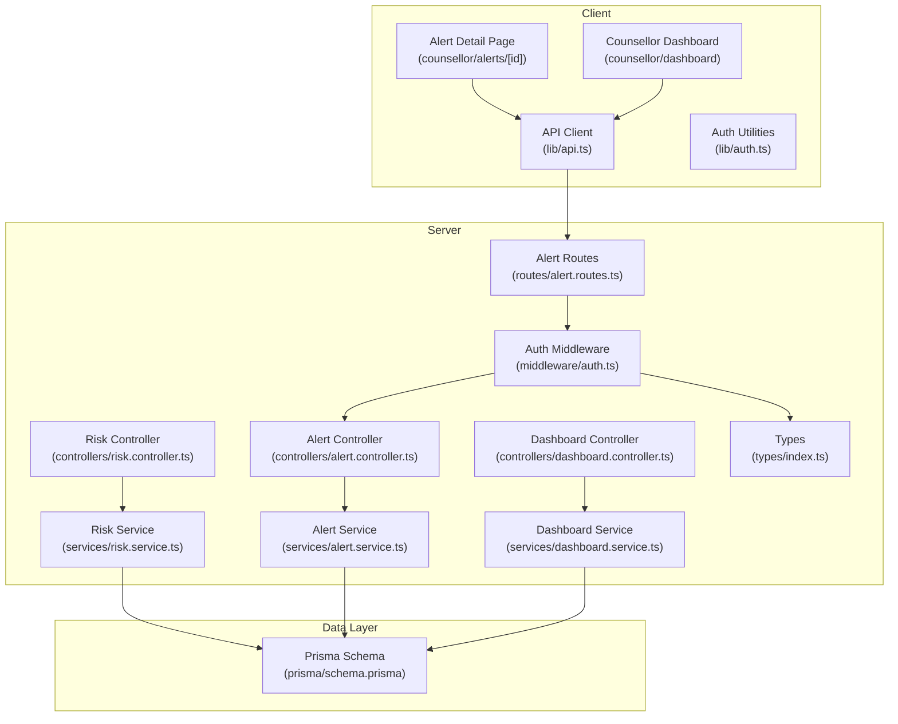
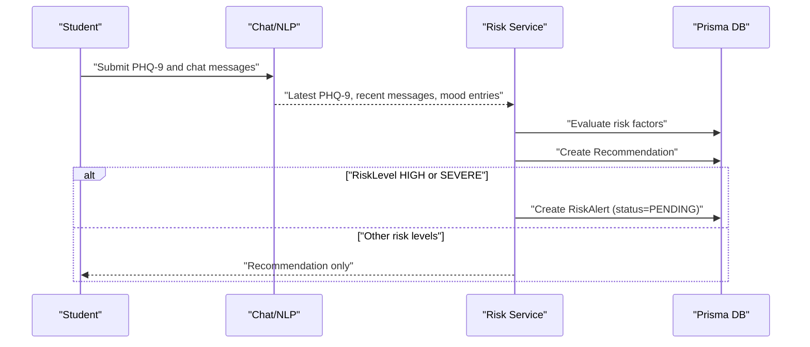
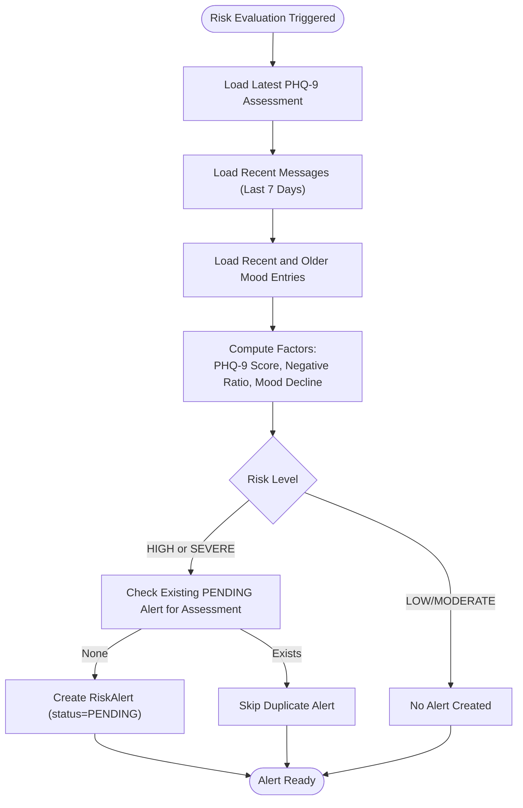
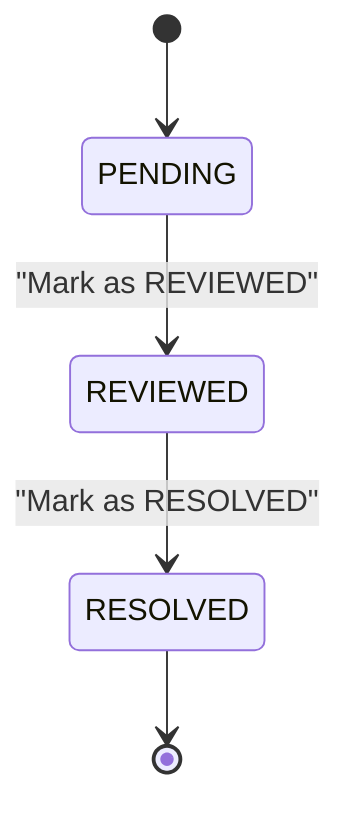
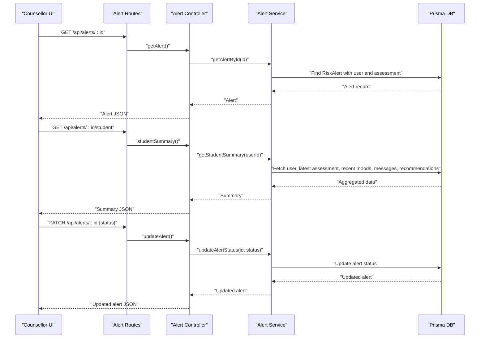
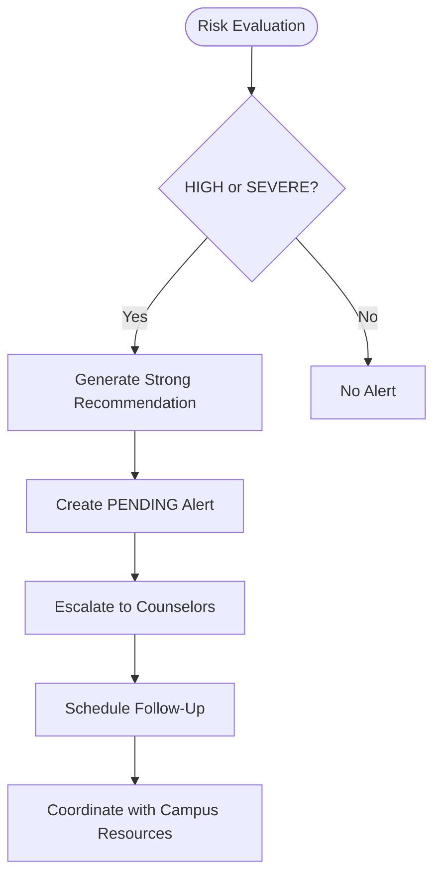
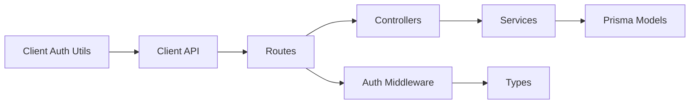
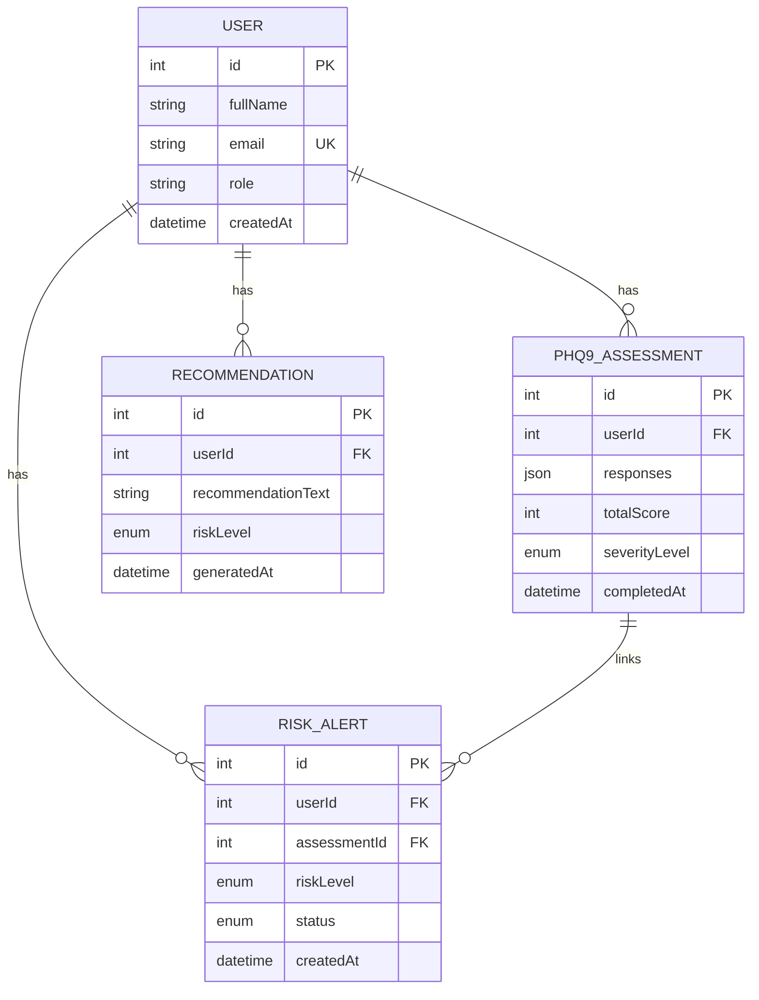

# Alert Management System

<cite>
**Referenced Files in This Document**
- [alert.controller.ts](file://server/src/controllers/alert.controller.ts)
- [alert.service.ts](file://server/src/services/alert.service.ts)
- [alert.routes.ts](file://server/src/routes/alert.routes.ts)
- [risk.controller.ts](file://server/src/controllers/risk.controller.ts)
- [risk.service.ts](file://server/src/services/risk.service.ts)
- [assessment.controller.ts](file://server/src/controllers/assessment.controller.ts)
- [assessment.service.ts](file://server/src/services/assessment.service.ts)
- [dashboard.controller.ts](file://server/src/controllers/dashboard.controller.ts)
- [dashboard.service.ts](file://server/src/services/dashboard.service.ts)
- [auth.middleware.ts](file://server/src/middleware/auth.ts)
- [types.index.ts](file://server/src/types/index.ts)
- [api.lib.ts](file://client/src/lib/api.ts)
- [auth.lib.ts](file://client/src/lib/auth.ts)
- [alert.detail.page.tsx](file://client/src/app/counsellor/alerts/[id]/page.tsx)
- [counsellor.dashboard.page.tsx](file://client/src/app/counsellor/dashboard/page.tsx)
- [prisma.schema.ts](file://prisma/schema.prisma)
- [requirements.md](file://requirements.md)
</cite>

## Table of Contents
1. [Introduction](#introduction)
2. [Project Structure](#project-structure)
3. [Core Components](#core-components)
4. [Architecture Overview](#architecture-overview)
5. [Detailed Component Analysis](#detailed-component-analysis)
6. [Dependency Analysis](#dependency-analysis)
7. [Performance Considerations](#performance-considerations)
8. [Troubleshooting Guide](#troubleshooting-guide)
9. [Conclusion](#conclusion)
10. [Appendices](#appendices)

## Introduction
This document describes the alert management system that handles risk alerts and counselor interventions. The system triggers alerts based on PHQ-9 assessments and mood/sentiment patterns, manages alert statuses (PENDING, REVIEWED, RESOLVED), and supports counselor workflows for reviewing student profiles, documenting interventions, and closing alerts. It also outlines escalation procedures for severe cases, follow-up scheduling, and integration with institutional protocols.

## Project Structure
The alert management system spans the backend (Express server with Prisma ORM) and the frontend (Next.js client):
- Backend routes expose alert CRUD and status updates, risk evaluation, and dashboard statistics.
- Services encapsulate data retrieval, risk scoring, and alert creation logic.
- Frontend provides counselor dashboards and alert detail pages with role-based access control.

**Diagram sources**
- [alert.routes.ts:1-15](file://server/src/routes/alert.routes.ts#L1-L15)
- [alert.controller.ts:1-70](file://server/src/controllers/alert.controller.ts#L1-L70)
- [alert.service.ts:1-62](file://server/src/services/alert.service.ts#L1-L62)
- [risk.controller.ts:1-32](file://server/src/controllers/risk.controller.ts#L1-L32)
- [risk.service.ts:1-138](file://server/src/services/risk.service.ts#L1-L138)
- [dashboard.controller.ts:1-13](file://server/src/controllers/dashboard.controller.ts#L1-L13)
- [dashboard.service.ts:1-19](file://server/src/services/dashboard.service.ts#L1-L19)
- [auth.middleware.ts:1-39](file://server/src/middleware/auth.ts#L1-L39)
- [types.index.ts:1-12](file://server/src/types/index.ts#L1-L12)
- [api.lib.ts:1-36](file://client/src/lib/api.ts#L1-L36)
- [auth.lib.ts:1-27](file://client/src/lib/auth.ts#L1-L27)
- [prisma.schema.ts:1-134](file://prisma/schema.prisma#L1-L134)

**Section sources**
- [alert.routes.ts:1-15](file://server/src/routes/alert.routes.ts#L1-L15)
- [alert.controller.ts:1-70](file://server/src/controllers/alert.controller.ts#L1-L70)
- [alert.service.ts:1-62](file://server/src/services/alert.service.ts#L1-L62)
- [risk.service.ts:1-138](file://server/src/services/risk.service.ts#L1-L138)
- [prisma.schema.ts:1-134](file://prisma/schema.prisma#L1-L134)

## Core Components
- Alert model and enums define risk levels and alert statuses.
- Risk evaluation service computes risk from PHQ-9, sentiment, and mood trends, and creates PENDING alerts for HIGH/SEVERE cases.
- Alert controller/service manage listing, retrieving, updating status, and student summaries.
- Counselor UI provides dashboard filtering and alert detail editing.
- Authentication middleware enforces role-based access (COUNSELLOR) and token verification.

Key capabilities:
- Automatic alert creation upon risk evaluation for HIGH/SEVERE.
- Controlled status transitions (PENDING → REVIEWED → RESOLVED).
- Student summary aggregation (latest assessment, recent moods, sentiment breakdown, recommendations).

**Section sources**
- [prisma.schema.ts:41-45](file://prisma/schema.prisma#L41-L45)
- [prisma.schema.ts:121-133](file://prisma/schema.prisma#L121-L133)
- [risk.service.ts:87-104](file://server/src/services/risk.service.ts#L87-L104)
- [alert.controller.ts:32-53](file://server/src/controllers/alert.controller.ts#L32-L53)
- [alert.service.ts:3-16](file://server/src/services/alert.service.ts#L3-L16)
- [alert.detail.page.tsx:72-85](file://client/src/app/counsellor/alerts/[id]/page.tsx#L72-L85)
- [auth.middleware.ts:24-38](file://server/src/middleware/auth.ts#L24-L38)

## Architecture Overview
The system follows a layered architecture:
- Presentation layer: Next.js pages for counselors.
- Application layer: Express routes, controllers, and services.
- Data layer: Prisma ORM models and database.

**Diagram sources**
- [risk.service.ts:11-107](file://server/src/services/risk.service.ts#L11-L107)
- [prisma.schema.ts:121-133](file://prisma/schema.prisma#L121-L133)

**Section sources**
- [risk.service.ts:11-107](file://server/src/services/risk.service.ts#L11-L107)
- [assessment.controller.ts:5-34](file://server/src/controllers/assessment.controller.ts#L5-L34)
- [assessment.service.ts:48-88](file://server/src/services/assessment.service.ts#L48-L88)

## Detailed Component Analysis

### Alert Creation Workflow (PHQ-9 and Mood Tracking)
Alerts are created automatically when risk evaluation yields HIGH or SEVERE risk levels. The process checks for existing PENDING alerts tied to the same assessment to avoid duplicates.

**Diagram sources**
- [risk.service.ts:11-107](file://server/src/services/risk.service.ts#L11-L107)
- [prisma.schema.ts:121-133](file://prisma/schema.prisma#L121-L133)

**Section sources**
- [risk.service.ts:87-104](file://server/src/services/risk.service.ts#L87-L104)
- [assessment.controller.ts:5-34](file://server/src/controllers/assessment.controller.ts#L5-L34)

### Alert Status Management
Alerts progress through three statuses:
- PENDING: Newly created, awaiting review.
- REVIEWED: Counselor reviewed details and documented intervention.
- RESOLVED: Case closed after follow-up and outcomes.

**Diagram sources**
- [alert.controller.ts:37-40](file://server/src/controllers/alert.controller.ts#L37-L40)
- [alert.detail.page.tsx:106-112](file://client/src/app/counsellor/alerts/[id]/page.tsx#L106-L112)

**Section sources**
- [alert.controller.ts:32-53](file://server/src/controllers/alert.controller.ts#L32-L53)
- [alert.detail.page.tsx:72-85](file://client/src/app/counsellor/alerts/[id]/page.tsx#L72-L85)

### Counselor Workflow
Counselors access alerts via the dashboard, filter by status and risk level, and navigate to alert detail pages. On the detail page, they can view student summaries and update alert status.

**Diagram sources**
- [alert.routes.ts:9-12](file://server/src/routes/alert.routes.ts#L9-L12)
- [alert.controller.ts:18-69](file://server/src/controllers/alert.controller.ts#L18-L69)
- [alert.service.ts:18-33](file://server/src/services/alert.service.ts#L18-L33)
- [alert.detail.page.tsx:57-85](file://client/src/app/counsellor/alerts/[id]/page.tsx#L57-L85)

**Section sources**
- [counsellor.dashboard.page.tsx:50-81](file://client/src/app/counsellor/dashboard/page.tsx#L50-L81)
- [alert.detail.page.tsx:34-129](file://client/src/app/counsellor/alerts/[id]/page.tsx#L34-L129)
- [alert.routes.ts:7-12](file://server/src/routes/alert.routes.ts#L7-L12)

### Escalation Procedures and Campus Coordination
Escalation applies to HIGH and SEVERE risk levels. The system generates strong recommendations and creates PENDING alerts. Escalation steps include:
- Immediate notification to counselors.
- Strong recommendations for professional consultation.
- Follow-up scheduling and coordination with campus resources (as part of institutional protocols).

**Diagram sources**
- [risk.service.ts:109-120](file://server/src/services/risk.service.ts#L109-L120)
- [risk.service.ts:87-104](file://server/src/services/risk.service.ts#L87-L104)
- [requirements.md:343-344](file://requirements.md#L343-L344)

**Section sources**
- [risk.service.ts:109-120](file://server/src/services/risk.service.ts#L109-L120)
- [requirements.md:343-344](file://requirements.md#L343-L344)

### Communication Protocols and Audit Trail
- Communication: Strong recommendations are generated per risk level and stored with the risk evaluation.
- Audit trail: Alerts include timestamps and status changes; counselor actions can be logged at the application level (recommended enhancement).
- Notifications: The current implementation focuses on alert creation and status updates; external notification channels (email/SMS) are not present in the codebase.

**Section sources**
- [risk.service.ts:78-85](file://server/src/services/risk.service.ts#L78-L85)
- [prisma.schema.ts:126-127](file://prisma/schema.prisma#L126-L127)

### Practical Examples
Example workflows:
- Example 1: A student completes a PHQ-9 with a score indicating HIGH risk and shows increased negative sentiment. The system creates a PENDING alert. A counselor reviews the alert, documents intervention, marks it as REVIEWED, schedules follow-up, and closes it as RESOLVED.
- Example 2: A student with MODERATE risk receives a recommendation but no alert is created. The counselor can still access the student’s summary and track progress.

**Section sources**
- [risk.service.ts:67-73](file://server/src/services/risk.service.ts#L67-L73)
- [alert.detail.page.tsx:182-242](file://client/src/app/counsellor/alerts/[id]/page.tsx#L182-L242)

## Dependency Analysis
The system exhibits clean separation of concerns:
- Controllers depend on services for business logic.
- Services depend on Prisma for data access.
- Routes enforce authentication and role-based authorization.
- Client-side utilities handle token management and API requests.

**Diagram sources**
- [alert.routes.ts:1-15](file://server/src/routes/alert.routes.ts#L1-L15)
- [alert.controller.ts:1-70](file://server/src/controllers/alert.controller.ts#L1-L70)
- [alert.service.ts:1-62](file://server/src/services/alert.service.ts#L1-L62)
- [auth.middleware.ts:1-39](file://server/src/middleware/auth.ts#L1-L39)
- [types.index.ts:1-12](file://server/src/types/index.ts#L1-L12)
- [api.lib.ts:1-36](file://client/src/lib/api.ts#L1-L36)
- [auth.lib.ts:1-27](file://client/src/lib/auth.ts#L1-L27)

**Section sources**
- [alert.routes.ts:1-15](file://server/src/routes/alert.routes.ts#L1-L15)
- [auth.middleware.ts:24-38](file://server/src/middleware/auth.ts#L24-L38)
- [api.lib.ts:1-36](file://client/src/lib/api.ts#L1-L36)

## Performance Considerations
- Asynchronous operations: Services use Promise.all for efficient data fetching (e.g., student summary).
- Indexing: Prisma models include indexes on foreign keys to optimize joins.
- Pagination: Listing alerts supports filtering; consider adding pagination for large datasets.
- Caching: No caching layer is implemented; consider caching frequently accessed summaries.

**Section sources**
- [alert.service.ts:35-61](file://server/src/services/alert.service.ts#L35-L61)
- [prisma.schema.ts:131-132](file://prisma/schema.prisma#L131-L132)

## Troubleshooting Guide
Common issues and resolutions:
- Unauthorized access: Ensure Bearer token is present and valid; role must be COUNSELLOR.
- Alert not found: Verify alert ID and that the alert belongs to the counselor’s scope.
- Invalid status update: Only PENDING, REVIEWED, and RESOLVED are accepted.
- Token expiration: Client removes token and redirects to login on 401.

**Section sources**
- [auth.middleware.ts:5-22](file://server/src/middleware/auth.ts#L5-L22)
- [alert.controller.ts:37-40](file://server/src/controllers/alert.controller.ts#L37-L40)
- [api.lib.ts:20-26](file://client/src/lib/api.ts#L20-L26)

## Conclusion
The alert management system integrates PHQ-9 results, sentiment analysis, and mood trends to automatically create HIGH/SEVERE alerts. It provides a streamlined counselor workflow for reviewing, documenting, and resolving alerts while supporting escalation and follow-up. Enhancements such as intervention logging, notifications, and audit trails would further strengthen institutional compliance and operational transparency.

## Appendices

### Data Model Overview

**Diagram sources**
- [prisma.schema.ts:47-133](file://prisma/schema.prisma#L47-L133)