# Alert Status Management

<cite>
**Referenced Files in This Document**
- [alert.controller.ts](file://server/src/controllers/alert.controller.ts)
- [alert.service.ts](file://server/src/services/alert.service.ts)
- [alert.routes.ts](file://server/src/routes/alert.routes.ts)
- [risk.service.ts](file://server/src/services/risk.service.ts)
- [schema.prisma](file://prisma/schema.prisma)
- [api.ts](file://client/src/lib/api.ts)
- [page.tsx](file://client/src/app/counsellor/alerts/[id]/page.tsx)
- [page.tsx](file://client/src/app/counsellor/dashboard/page.tsx)
- [dashboard.service.ts](file://server/src/services/dashboard.service.ts)
- [dashboard.controller.ts](file://server/src/controllers/dashboard.controller.ts)
- [dashboard.routes.ts](file://server/src/routes/dashboard.routes.ts)
- [auth.ts](file://server/src/middleware/auth.ts)
- [errorHandler.ts](file://server/src/middleware/errorHandler.ts)
- [index.ts](file://server/src/index.ts)
</cite>

## Table of Contents
1. [Introduction](#introduction)
2. [Project Structure](#project-structure)
3. [Core Components](#core-components)
4. [Architecture Overview](#architecture-overview)
5. [Detailed Component Analysis](#detailed-component-analysis)
6. [Dependency Analysis](#dependency-analysis)
7. [Performance Considerations](#performance-considerations)
8. [Troubleshooting Guide](#troubleshooting-guide)
9. [Conclusion](#conclusion)
10. [Appendices](#appendices)

## Introduction
This document describes the alert status management and tracking workflows in the system. It focuses on the three-tier status system:
- PENDING: Initial review stage after risk evaluation
- REVIEWED: Active intervention stage
- RESOLVED: Closure stage

It documents status transition logic, approval workflows, timeline tracking, audit trail requirements, notifications, reporting, filtering/sorting mechanisms, validation rules, error handling, and integrations with counselor dashboards and administrative reporting systems.

## Project Structure
The alert management system spans backend controllers, services, and Prisma models, and a React-based frontend for counselors. Key components:
- Backend routes expose endpoints for listing, retrieving, updating alerts, and fetching student summaries
- Services encapsulate database queries and risk evaluation logic
- Prisma defines the AlertStatus enum and RiskAlert model
- Frontend provides counselor dashboards and alert detail pages with filtering and status updates

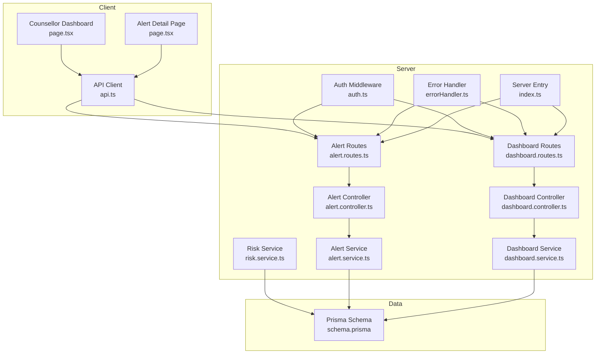

**Diagram sources**
- [alert.routes.ts:1-15](file://server/src/routes/alert.routes.ts#L1-L15)
- [dashboard.routes.ts:1-11](file://server/src/routes/dashboard.routes.ts#L1-L11)
- [alert.controller.ts:1-70](file://server/src/controllers/alert.controller.ts#L1-L70)
- [dashboard.controller.ts:1-13](file://server/src/controllers/dashboard.controller.ts#L1-L13)
- [alert.service.ts:1-62](file://server/src/services/alert.service.ts#L1-L62)
- [dashboard.service.ts:1-19](file://server/src/services/dashboard.service.ts#L1-L19)
- [risk.service.ts:1-138](file://server/src/services/risk.service.ts#L1-L138)
- [auth.ts:1-39](file://server/src/middleware/auth.ts#L1-L39)
- [errorHandler.ts:1-13](file://server/src/middleware/errorHandler.ts#L1-L13)
- [index.ts:1-35](file://server/src/index.ts#L1-L35)
- [schema.prisma:41-45](file://prisma/schema.prisma#L41-L45)

**Section sources**
- [alert.routes.ts:1-15](file://server/src/routes/alert.routes.ts#L1-L15)
- [dashboard.routes.ts:1-11](file://server/src/routes/dashboard.routes.ts#L1-L11)
- [alert.controller.ts:1-70](file://server/src/controllers/alert.controller.ts#L1-L70)
- [alert.service.ts:1-62](file://server/src/services/alert.service.ts#L1-L62)
- [risk.service.ts:1-138](file://server/src/services/risk.service.ts#L1-L138)
- [schema.prisma:41-45](file://prisma/schema.prisma#L41-L45)
- [api.ts:1-36](file://client/src/lib/api.ts#L1-L36)
- [page.tsx:1-246](file://client/src/app/counsellor/alerts/[id]/page.tsx#L1-L246)
- [page.tsx:1-212](file://client/src/app/counsellor/dashboard/page.tsx#L1-L212)

## Core Components
- Alert model and status enum: Defined in Prisma schema with AlertStatus enum and RiskAlert model including status and timestamps
- Risk evaluation: Generates risk levels and creates PENDING alerts when appropriate
- Alert CRUD: Listing, retrieval, status update, and student summary
- Dashboard: Counselor dashboard statistics and filtering
- Authentication and authorization: Token verification and role gating for counselors
- Error handling: Centralized error handler for API responses

Key implementation references:
- AlertStatus enum and RiskAlert model definition
- Risk evaluation and alert creation logic
- Alert listing, retrieval, status update, and student summary
- Dashboard statistics aggregation
- Authentication middleware and route protection
- Client API client and UI components for counselor views

**Section sources**
- [schema.prisma:41-45](file://prisma/schema.prisma#L41-L45)
- [schema.prisma:121-133](file://prisma/schema.prisma#L121-L133)
- [risk.service.ts:11-107](file://server/src/services/risk.service.ts#L11-L107)
- [alert.controller.ts:5-69](file://server/src/controllers/alert.controller.ts#L5-L69)
- [alert.service.ts:3-33](file://server/src/services/alert.service.ts#L3-L33)
- [dashboard.service.ts:3-18](file://server/src/services/dashboard.service.ts#L3-L18)
- [auth.ts:5-38](file://server/src/middleware/auth.ts#L5-L38)
- [api.ts:3-35](file://client/src/lib/api.ts#L3-L35)
- [page.tsx:34-85](file://client/src/app/counsellor/alerts/[id]/page.tsx#L34-L85)
- [page.tsx:28-99](file://client/src/app/counsellor/dashboard/page.tsx#L28-L99)

## Architecture Overview
The alert management architecture follows a layered pattern:
- Presentation layer: React pages for counselor dashboard and alert detail
- API layer: Express routes and controllers
- Service layer: Business logic for alerts, risk evaluation, and dashboard stats
- Persistence layer: Prisma ORM mapping to PostgreSQL

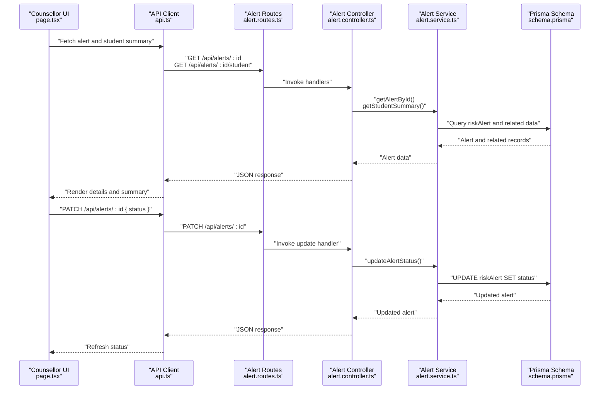

**Diagram sources**
- [page.tsx:57-85](file://client/src/app/counsellor/alerts/[id]/page.tsx#L57-L85)
- [api.ts:3-35](file://client/src/lib/api.ts#L3-L35)
- [alert.routes.ts:9-12](file://server/src/routes/alert.routes.ts#L9-L12)
- [alert.controller.ts:5-69](file://server/src/controllers/alert.controller.ts#L5-L69)
- [alert.service.ts:18-33](file://server/src/services/alert.service.ts#L18-L33)
- [schema.prisma:121-133](file://prisma/schema.prisma#L121-L133)

## Detailed Component Analysis

### Alert Model and Status Enum
The AlertStatus enum defines the lifecycle states:
- PENDING
- REVIEWED
- RESOLVED

The RiskAlert model stores alert metadata, links to user and assessment, and maintains status and timestamps.

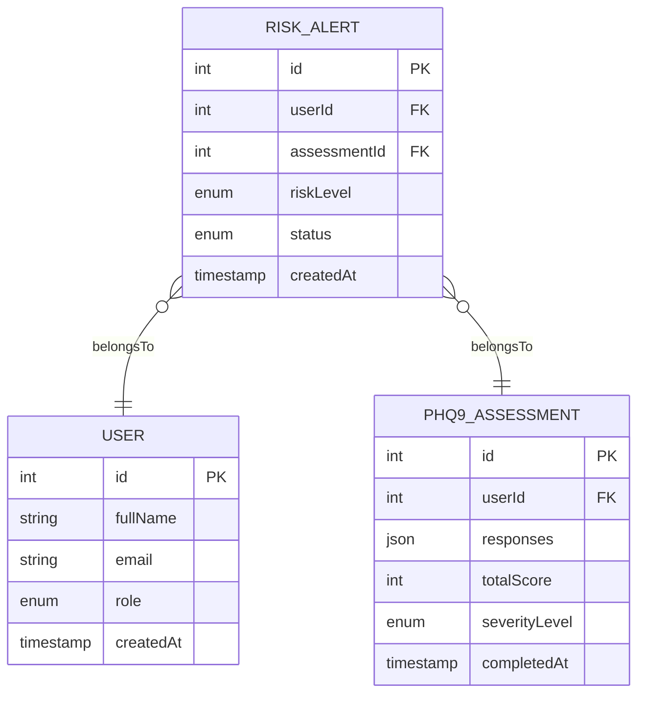

**Diagram sources**
- [schema.prisma:41-45](file://prisma/schema.prisma#L41-L45)
- [schema.prisma:121-133](file://prisma/schema.prisma#L121-L133)
- [schema.prisma:47-61](file://prisma/schema.prisma#L47-L61)
- [schema.prisma:97-108](file://prisma/schema.prisma#L97-L108)

**Section sources**
- [schema.prisma:41-45](file://prisma/schema.prisma#L41-L45)
- [schema.prisma:121-133](file://prisma/schema.prisma#L121-L133)

### Risk Evaluation and Alert Creation
Risk evaluation aggregates:
- Latest PHQ-9 total score
- Recent message sentiment ratios (last 7 days)
- Mood trends (last 7 vs previous 7 days)

If risk level is HIGH or SEVERE, a PENDING alert is created for the latest assessment, avoiding duplicates.

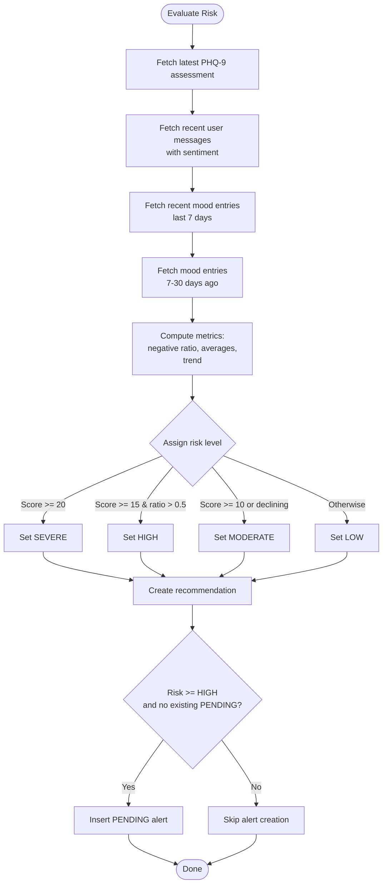

**Diagram sources**
- [risk.service.ts:11-107](file://server/src/services/risk.service.ts#L11-L107)

**Section sources**
- [risk.service.ts:11-107](file://server/src/services/risk.service.ts#L11-L107)

### Alert Status Update Workflow
The controller validates the incoming status against the enum values and updates the alert record via the service.

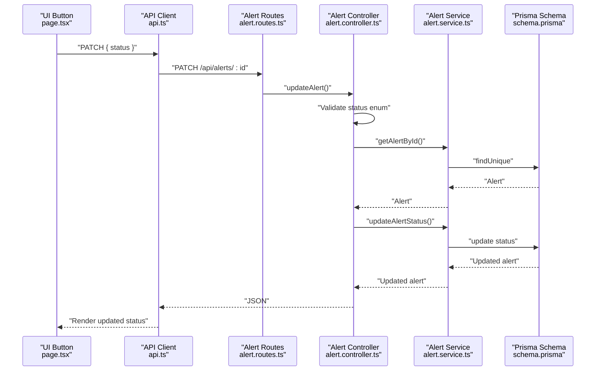

**Diagram sources**
- [page.tsx:72-85](file://client/src/app/counsellor/alerts/[id]/page.tsx#L72-L85)
- [api.ts:3-35](file://client/src/lib/api.ts#L3-L35)
- [alert.routes.ts:11-12](file://server/src/routes/alert.routes.ts#L11-L12)
- [alert.controller.ts:32-53](file://server/src/controllers/alert.controller.ts#L32-L53)
- [alert.service.ts:28-33](file://server/src/services/alert.service.ts#L28-L33)
- [schema.prisma:121-133](file://prisma/schema.prisma#L121-L133)

**Section sources**
- [alert.controller.ts:32-53](file://server/src/controllers/alert.controller.ts#L32-L53)
- [alert.service.ts:28-33](file://server/src/services/alert.service.ts#L28-L33)

### Filtering and Sorting Mechanisms
- Backend filtering: listAlerts supports status and riskLevel filters
- Sorting: Alerts are ordered by createdAt descending for recency
- Frontend filtering: Counselor dashboard supports status and risk level dropdowns

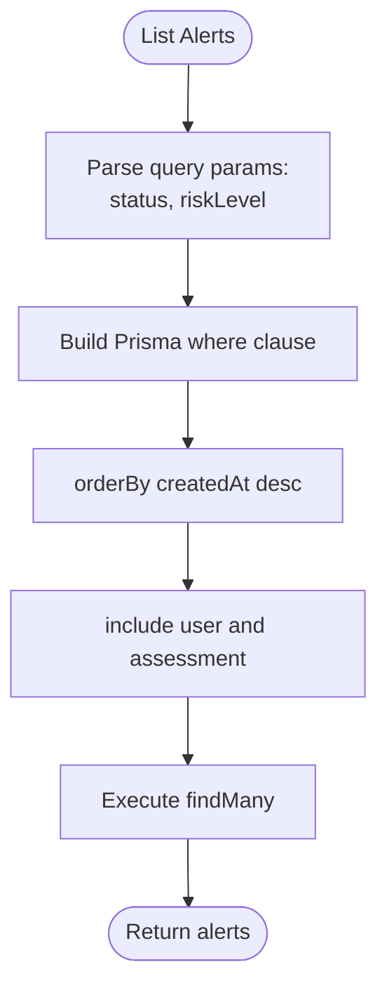

**Diagram sources**
- [alert.controller.ts:7-11](file://server/src/controllers/alert.controller.ts#L7-L11)
- [alert.service.ts:3-16](file://server/src/services/alert.service.ts#L3-L16)
- [page.tsx:32-34](file://client/src/app/counsellor/dashboard/page.tsx#L32-L34)

**Section sources**
- [alert.controller.ts:7-11](file://server/src/controllers/alert.controller.ts#L7-L11)
- [alert.service.ts:3-16](file://server/src/services/alert.service.ts#L3-L16)
- [page.tsx:146-167](file://client/src/app/counsellor/dashboard/page.tsx#L146-L167)

### Timeline Tracking and Audit Trail
- createdAt timestamp on RiskAlert captures alert creation time
- Status transitions occur via PATCH requests; current implementation does not persist separate transition logs
- Recommendation generation and alert creation are recorded in their respective tables

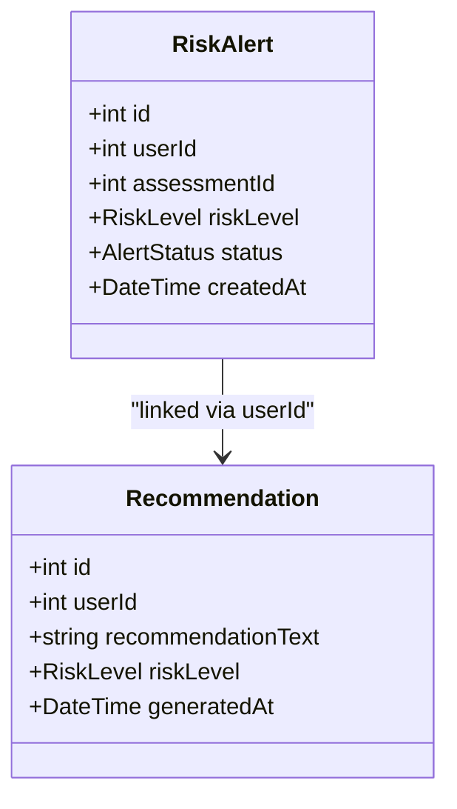

**Diagram sources**
- [schema.prisma:121-133](file://prisma/schema.prisma#L121-L133)
- [schema.prisma:110-119](file://prisma/schema.prisma#L110-L119)

**Section sources**
- [schema.prisma:126-127](file://prisma/schema.prisma#L126-L127)
- [risk.service.ts:78-85](file://server/src/services/risk.service.ts#L78-L85)

### Status Transition Logic
- Allowed transitions are enforced by the frontend getNextStatus helper:
  - PENDING → REVIEWED
  - REVIEWED → RESOLVED
- The controller validates the status against the enum values before updating

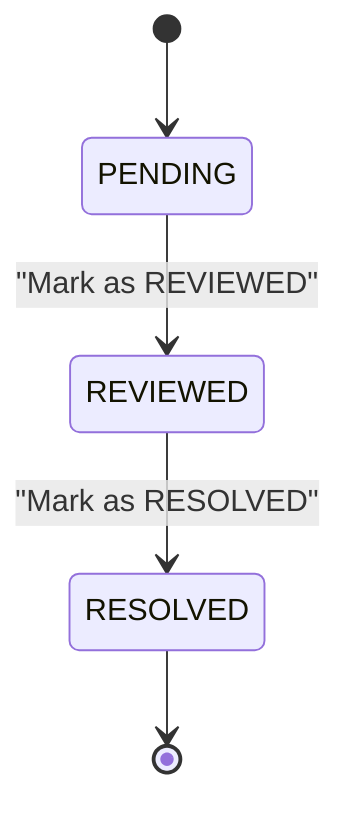

**Diagram sources**
- [page.tsx:106-112](file://client/src/app/counsellor/alerts/[id]/page.tsx#L106-L112)
- [alert.controller.ts:37-40](file://server/src/controllers/alert.controller.ts#L37-L40)

**Section sources**
- [page.tsx:106-112](file://client/src/app/counsellor/alerts/[id]/page.tsx#L106-L112)
- [alert.controller.ts:37-40](file://server/src/controllers/alert.controller.ts#L37-L40)

### Approval Workflows and Escalation Triggers
- Escalation: HIGH and SEVERE risk levels trigger automatic PENDING alert creation linked to the latest assessment
- Approval: The system does not define a separate “approved” state; REVIEWED implies active intervention and RESOLVED implies closure

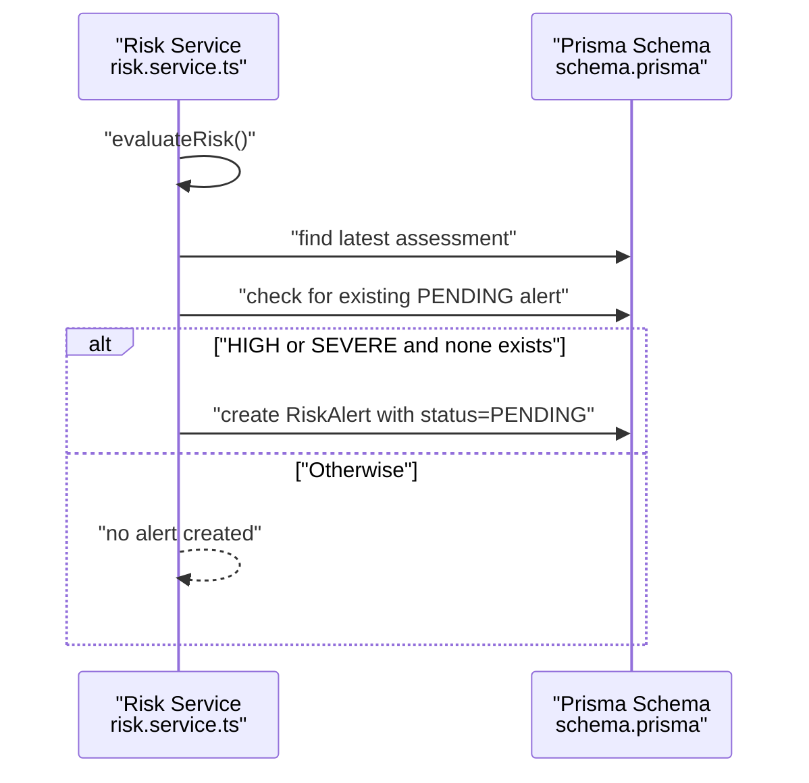

**Diagram sources**
- [risk.service.ts:87-104](file://server/src/services/risk.service.ts#L87-L104)
- [schema.prisma:121-133](file://prisma/schema.prisma#L121-L133)

**Section sources**
- [risk.service.ts:87-104](file://server/src/services/risk.service.ts#L87-L104)

### Resolution Criteria
- RESOLVED status is set by counselors via the UI; the controller enforces valid status values
- Resolution criteria are implicit in the UI’s getNextStatus logic and do not enforce additional business rules in the backend

**Section sources**
- [page.tsx:106-112](file://client/src/app/counsellor/alerts/[id]/page.tsx#L106-L112)
- [alert.controller.ts:37-40](file://server/src/controllers/alert.controller.ts#L37-L40)

### Reporting Capabilities
- Dashboard statistics endpoint aggregates counts for total alerts, pending, reviewed, resolved, total students, and risk distribution
- These stats power the counselor dashboard UI

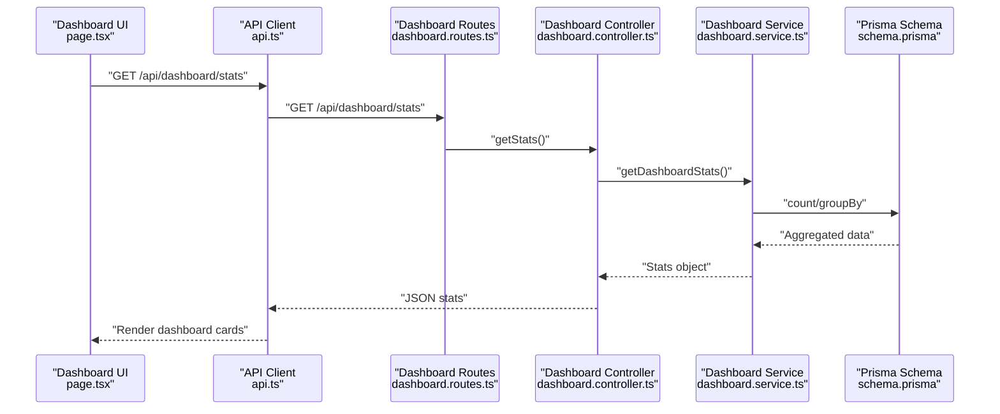

**Diagram sources**
- [page.tsx:49-53](file://client/src/app/counsellor/dashboard/page.tsx#L49-L53)
- [api.ts:3-35](file://client/src/lib/api.ts#L3-L35)
- [dashboard.routes.ts](file://server/src/routes/dashboard.routes.ts#L8)
- [dashboard.controller.ts:5-12](file://server/src/controllers/dashboard.controller.ts#L5-L12)
- [dashboard.service.ts:3-18](file://server/src/services/dashboard.service.ts#L3-L18)
- [schema.prisma:47-61](file://prisma/schema.prisma#L47-L61)

**Section sources**
- [dashboard.service.ts:3-18](file://server/src/services/dashboard.service.ts#L3-L18)
- [dashboard.controller.ts:5-12](file://server/src/controllers/dashboard.controller.ts#L5-L12)
- [page.tsx:117-167](file://client/src/app/counsellor/dashboard/page.tsx#L117-L167)

### Integration with Counselor Dashboards and Administrative Reporting
- Route protection ensures only counselors can access alert and dashboard endpoints
- The dashboard page renders stats and filtered alert lists for counselors
- Administrative reporting can leverage the dashboard stats and alert listing endpoints

**Section sources**
- [alert.routes.ts](file://server/src/routes/alert.routes.ts#L7)
- [dashboard.routes.ts](file://server/src/routes/dashboard.routes.ts#L7)
- [auth.ts:24-38](file://server/src/middleware/auth.ts#L24-L38)
- [page.tsx:28-47](file://client/src/app/counsellor/dashboard/page.tsx#L28-L47)

## Dependency Analysis
The system exhibits clean separation of concerns:
- Controllers depend on services
- Services depend on Prisma client
- Routes depend on controllers and middleware
- UI components depend on API client and auth helpers

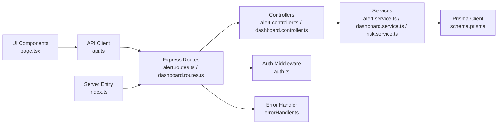

**Diagram sources**
- [page.tsx:1-7](file://client/src/app/counsellor/alerts/[id]/page.tsx#L1-L7)
- [api.ts:1-36](file://client/src/lib/api.ts#L1-L36)
- [alert.routes.ts:1-15](file://server/src/routes/alert.routes.ts#L1-L15)
- [dashboard.routes.ts:1-11](file://server/src/routes/dashboard.routes.ts#L1-L11)
- [alert.controller.ts:1-3](file://server/src/controllers/alert.controller.ts#L1-L3)
- [dashboard.controller.ts:1-3](file://server/src/controllers/dashboard.controller.ts#L1-L3)
- [alert.service.ts](file://server/src/services/alert.service.ts#L1)
- [dashboard.service.ts](file://server/src/services/dashboard.service.ts#L1)
- [risk.service.ts](file://server/src/services/risk.service.ts#L1)
- [auth.ts:1-39](file://server/src/middleware/auth.ts#L1-L39)
- [errorHandler.ts:1-13](file://server/src/middleware/errorHandler.ts#L1-L13)
- [index.ts:1-35](file://server/src/index.ts#L1-L35)

**Section sources**
- [index.ts:1-35](file://server/src/index.ts#L1-L35)
- [alert.routes.ts:1-15](file://server/src/routes/alert.routes.ts#L1-L15)
- [dashboard.routes.ts:1-11](file://server/src/routes/dashboard.routes.ts#L1-L11)
- [alert.controller.ts:1-3](file://server/src/controllers/alert.controller.ts#L1-L3)
- [dashboard.controller.ts:1-3](file://server/src/controllers/dashboard.controller.ts#L1-L3)
- [alert.service.ts](file://server/src/services/alert.service.ts#L1)
- [dashboard.service.ts](file://server/src/services/dashboard.service.ts#L1)
- [risk.service.ts](file://server/src/services/risk.service.ts#L1)
- [auth.ts:1-39](file://server/src/middleware/auth.ts#L1-L39)
- [errorHandler.ts:1-13](file://server/src/middleware/errorHandler.ts#L1-L13)
- [api.ts:1-36](file://client/src/lib/api.ts#L1-L36)

## Performance Considerations
- Database queries use selective includes and ordering by createdAt desc to optimize loading of recent alerts
- Dashboard stats use concurrent queries to reduce latency
- Client-side filtering is minimal; backend filtering by status and riskLevel reduces payload sizes
- Consider adding pagination for large alert volumes and indexing on frequently queried fields

## Troubleshooting Guide
Common issues and resolutions:
- Unauthorized access: Ensure Bearer token is present and valid; middleware returns 401 for missing/expired tokens
- Insufficient permissions: requireRole('COUNSELLOR') protects endpoints; UI redirects non-counselors appropriately
- Invalid status updates: Controller validates status against enum values and returns 400 for invalid inputs
- Alert not found: Handlers return 404 when alert ID does not exist
- Centralized error handling: errorHandler responds with structured error objects

**Section sources**
- [auth.ts:5-38](file://server/src/middleware/auth.ts#L5-L38)
- [alert.controller.ts:37-46](file://server/src/controllers/alert.controller.ts#L37-L46)
- [errorHandler.ts:7-12](file://server/src/middleware/errorHandler.ts#L7-L12)
- [api.ts:20-32](file://client/src/lib/api.ts#L20-L32)

## Conclusion
The alert status management system implements a clear three-tier lifecycle with automatic escalation for HIGH/SEVERE risks and straightforward counselor-driven transitions. Filtering, sorting, and dashboard reporting enable efficient monitoring and triage. While the current implementation does not track detailed status change timelines, the foundation is in place to extend auditing and notifications as needed.

## Appendices

### API Endpoints Summary
- GET /api/alerts?status=&riskLevel=
- GET /api/alerts/:id
- PATCH /api/alerts/:id { status }
- GET /api/alerts/:id/student
- GET /api/dashboard/stats

**Section sources**
- [alert.routes.ts:9-12](file://server/src/routes/alert.routes.ts#L9-L12)
- [dashboard.routes.ts](file://server/src/routes/dashboard.routes.ts#L8)