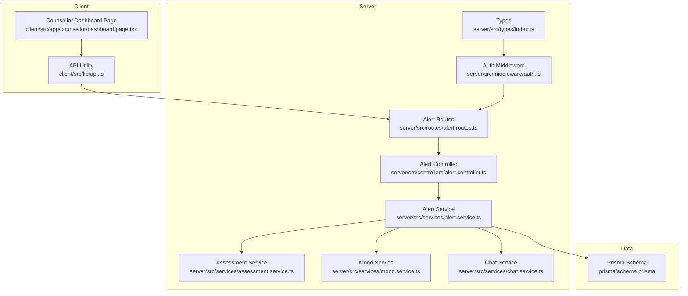
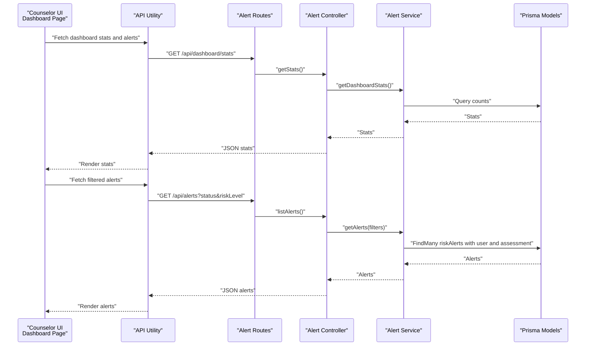
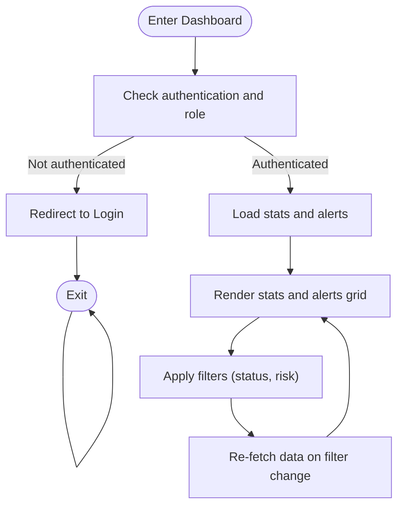
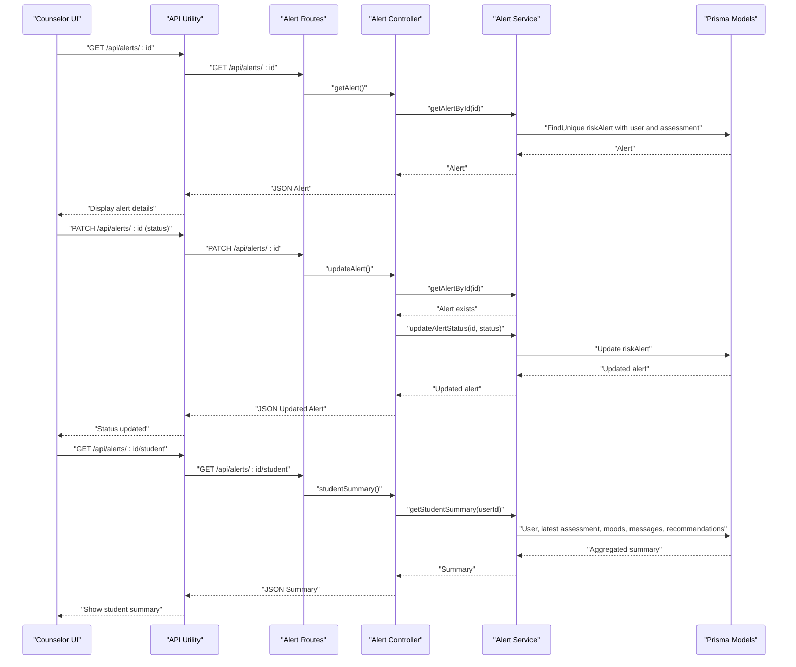
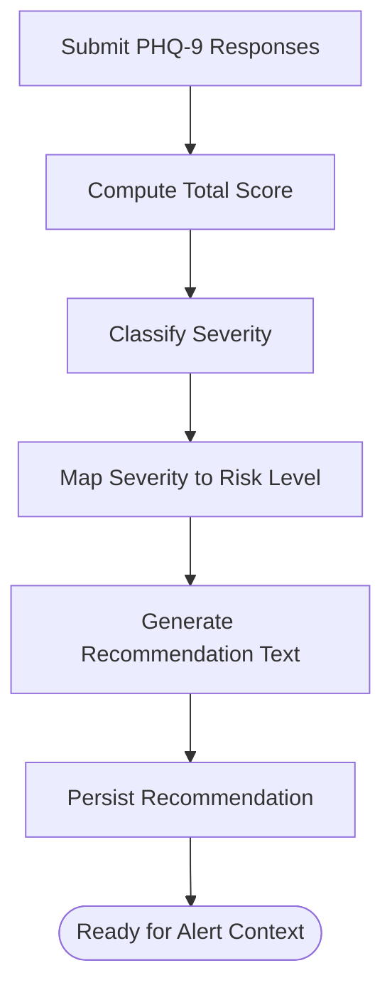
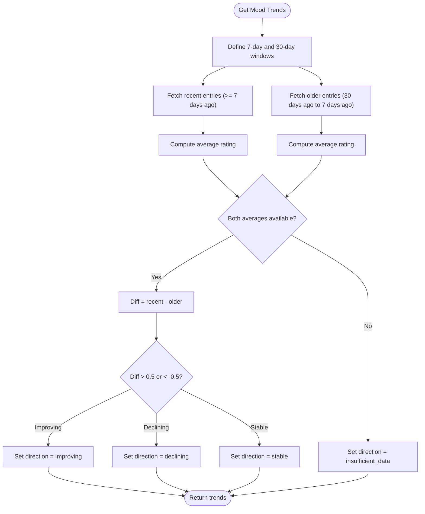
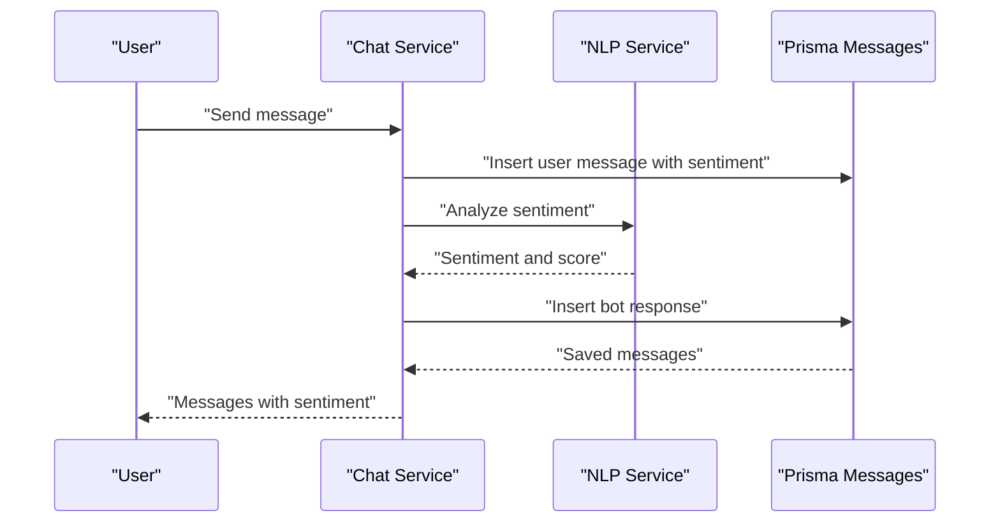
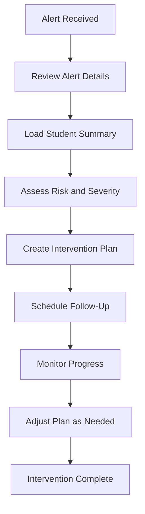
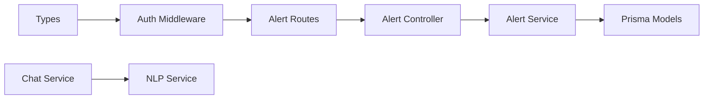

# Counselor Workflow and Interventions

<cite>
**Referenced Files in This Document**
- [client\src\app\counsellor\dashboard\page.tsx](file://client/src/app/counsellor/dashboard/page.tsx)
- [client\src\lib\api.ts](file://client/src/lib/api.ts)
- [server\src\routes\alert.routes.ts](file://server/src/routes/alert.routes.ts)
- [server\src\controllers\alert.controller.ts](file://server/src/controllers/alert.controller.ts)
- [server\src\services\alert.service.ts](file://server/src/services/alert.service.ts)
- [server\src\services\assessment.service.ts](file://server/src/services/assessment.service.ts)
- [server\src\services\mood.service.ts](file://server/src/services/mood.service.ts)
- [server\src\services\chat.service.ts](file://server/src/services/chat.service.ts)
- [server\src\middleware\auth.ts](file://server/src/middleware/auth.ts)
- [server\src\types\index.ts](file://server/src/types/index.ts)
- [prisma\schema.prisma](file://prisma/schema.prisma)
</cite>

## Table of Contents
1. [Introduction](#introduction)
2. [Project Structure](#project-structure)
3. [Core Components](#core-components)
4. [Architecture Overview](#architecture-overview)
5. [Detailed Component Analysis](#detailed-component-analysis)
6. [Dependency Analysis](#dependency-analysis)
7. [Performance Considerations](#performance-considerations)
8. [Troubleshooting Guide](#troubleshooting-guide)
9. [Conclusion](#conclusion)
10. [Appendices](#appendices)

## Introduction
This document describes counselor workflows and intervention procedures within the alert management system. It explains how counselors review alerts, access student profiles, and document interventions. It also covers the end-to-end workflow from alert receipt through intervention completion, integration with assessment history, mood tracking, and communication logs, along with planning, follow-up scheduling, progress monitoring, communication protocols, common scenarios, documentation templates, quality assurance, training, competency assessments, and performance metrics.

## Project Structure
The alert management system comprises:
- Frontend (Next.js) pages for counselor dashboard and alert detail navigation
- Backend (Express) routes, controllers, and services for alert retrieval, updates, and student summaries
- Prisma schema modeling users, alerts, assessments, moods, messages, and recommendations
- Middleware for authentication and role-based authorization
- Utilities for API requests and token verification

**Diagram sources**
- [client\src\app\counsellor\dashboard\page.tsx:1-213](file://client/src/app/counsellor/dashboard/page.tsx#L1-L213)
- [client\src\lib\api.ts:1-36](file://client/src/lib/api.ts#L1-L36)
- [server\src\routes\alert.routes.ts:1-15](file://server/src/routes/alert.routes.ts#L1-L15)
- [server\src\controllers\alert.controller.ts:1-70](file://server/src/controllers/alert.controller.ts#L1-L70)
- [server\src\services\alert.service.ts:1-62](file://server/src/services/alert.service.ts#L1-L62)
- [server\src\services\assessment.service.ts:1-89](file://server/src/services/assessment.service.ts#L1-L89)
- [server\src\services\mood.service.ts:1-58](file://server/src/services/mood.service.ts#L1-L58)
- [server\src\services\chat.service.ts:1-105](file://server/src/services/chat.service.ts#L1-L105)
- [server\src\middleware\auth.ts:1-39](file://server/src/middleware/auth.ts#L1-L39)
- [server\src\types\index.ts:1-12](file://server/src/types/index.ts#L1-L12)
- [prisma\schema.prisma:1-134](file://prisma/schema.prisma#L1-L134)

**Section sources**
- [client\src\app\counsellor\dashboard\page.tsx:1-213](file://client/src/app/counsellor/dashboard/page.tsx#L1-L213)
- [client\src\lib\api.ts:1-36](file://client/src/lib/api.ts#L1-L36)
- [server\src\routes\alert.routes.ts:1-15](file://server/src/routes/alert.routes.ts#L1-L15)
- [server\src\controllers\alert.controller.ts:1-70](file://server/src/controllers/alert.controller.ts#L1-L70)
- [server\src\services\alert.service.ts:1-62](file://server/src/services/alert.service.ts#L1-L62)
- [server\src\middleware\auth.ts:1-39](file://server/src/middleware/auth.ts#L1-L39)
- [server\src\types\index.ts:1-12](file://server/src/types/index.ts#L1-L12)
- [prisma\schema.prisma:1-134](file://prisma/schema.prisma#L1-L134)

## Core Components
- Counselor Dashboard: Lists alerts with filtering by status and risk level, displays summary statistics, and navigates to alert detail.
- Alert Management: Retrieve alerts, update alert status, and fetch student summaries including assessment, mood, sentiment, and recommendations.
- Student Profile Integration: Accesses assessment history, mood trends, recent messages, and recommendations.
- Communication Logs: Provides message history and sentiment breakdown for recent conversations.
- Intervention Planning: Uses assessment severity and recommendations to guide planning; future extensions can include follow-up scheduling and progress monitoring.

Key implementation references:
- Dashboard page renders alert list and filters, and authenticates counselors.
- Alert routes enforce counselor role and expose list, detail, update, and student summary endpoints.
- Alert service aggregates student summary data from assessments, moods, messages, and recommendations.
- Assessment service classifies severity and generates recommendations.
- Mood service computes recent and historical averages and trend direction.
- Chat service records messages, analyzes sentiment, and stores bot responses.

**Section sources**
- [client\src\app\counsellor\dashboard\page.tsx:28-212](file://client/src/app/counsellor/dashboard/page.tsx#L28-L212)
- [server\src\routes\alert.routes.ts:7-12](file://server/src/routes/alert.routes.ts#L7-L12)
- [server\src\controllers\alert.controller.ts:5-69](file://server/src/controllers/alert.controller.ts#L5-L69)
- [server\src\services\alert.service.ts:3-61](file://server/src/services/alert.service.ts#L3-L61)
- [server\src\services\assessment.service.ts:12-88](file://server/src/services/assessment.service.ts#L12-L88)
- [server\src\services\mood.service.ts:22-57](file://server/src/services/mood.service.ts#L22-L57)
- [server\src\services\chat.service.ts:45-88](file://server/src/services/chat.service.ts#L45-L88)

## Architecture Overview
The counselor workflow follows a client-server pattern:
- The counselor dashboard page fetches alerts and statistics via the API utility.
- Routes authenticate and authorize counselors, then delegate to controllers.
- Controllers call services to query Prisma models and assemble student summaries.
- Services encapsulate data aggregation and computation for assessments, moods, and chat.

**Diagram sources**
- [client\src\app\counsellor\dashboard\page.tsx:49-80](file://client/src/app/counsellor/dashboard/page.tsx#L49-L80)
- [client\src\lib\api.ts:3-35](file://client/src/lib/api.ts#L3-L35)
- [server\src\routes\alert.routes.ts:9-12](file://server/src/routes/alert.routes.ts#L9-L12)
- [server\src\controllers\alert.controller.ts:5-16](file://server/src/controllers/alert.controller.ts#L5-L16)
- [server\src\services\alert.service.ts:3-16](file://server/src/services/alert.service.ts#L3-L16)
- [prisma\schema.prisma:121-133](file://prisma/schema.prisma#L121-L133)

## Detailed Component Analysis

### Counselor Dashboard
Responsibilities:
- Authenticate counselor and restrict access to counselors only.
- Fetch dashboard statistics and alerts concurrently.
- Apply filters for status and risk level and re-fetch on filter change.
- Navigate to alert detail by ID.

**Diagram sources**
- [client\src\app\counsellor\dashboard\page.tsx:36-80](file://client/src/app/counsellor/dashboard/page.tsx#L36-L80)

**Section sources**
- [client\src\app\counsellor\dashboard\page.tsx:28-212](file://client/src/app/counsellor/dashboard/page.tsx#L28-L212)
- [client\src\lib\api.ts:3-35](file://client/src/lib/api.ts#L3-L35)
- [server\src\middleware\auth.ts:5-38](file://server/src/middleware/auth.ts#L5-L38)
- [server\src\types\index.ts:3-11](file://server/src/types/index.ts#L3-L11)

### Alert Detail and Student Summary
Responsibilities:
- Retrieve a single alert by ID and update its status.
- Fetch a student summary including user profile, latest assessment, recent moods, recent messages, and recommendations.
- Enforce counselor role for access.

**Diagram sources**
- [server\src\routes\alert.routes.ts:7-12](file://server/src/routes/alert.routes.ts#L7-L12)
- [server\src\controllers\alert.controller.ts:18-69](file://server/src/controllers/alert.controller.ts#L18-L69)
- [server\src\services\alert.service.ts:18-61](file://server/src/services/alert.service.ts#L18-L61)
- [prisma\schema.prisma:47-133](file://prisma/schema.prisma#L47-L133)

**Section sources**
- [server\src\routes\alert.routes.ts:7-12](file://server/src/routes/alert.routes.ts#L7-L12)
- [server\src\controllers\alert.controller.ts:18-69](file://server/src/controllers/alert.controller.ts#L18-L69)
- [server\src\services\alert.service.ts:35-61](file://server/src/services/alert.service.ts#L35-L61)

### Student Assessment History and Recommendations
Responsibilities:
- Classify PHQ-9 severity based on total score.
- Generate risk-level-aware recommendations.
- Provide assessment history for trend analysis.

**Diagram sources**
- [server\src\services\assessment.service.ts:20-88](file://server/src/services/assessment.service.ts#L20-L88)

**Section sources**
- [server\src\services\assessment.service.ts:12-88](file://server/src/services/assessment.service.ts#L12-L88)
- [prisma\schema.prisma:97-108](file://prisma/schema.prisma#L97-L108)

### Mood Tracking and Trends
Responsibilities:
- Compute recent and 30-day averages.
- Determine trend direction (improving/stable/declining/insufficient data).
- Support progress monitoring during interventions.

**Diagram sources**
- [server\src\services\mood.service.ts:22-57](file://server/src/services/mood.service.ts#L22-L57)

**Section sources**
- [server\src\services\mood.service.ts:22-57](file://server/src/services/mood.service.ts#L22-L57)

### Communication Logs and Sentiment
Responsibilities:
- Record user messages and derive sentiment via NLP.
- Generate bot responses based on sentiment.
- Provide message history for context during interventions.

**Diagram sources**
- [server\src\services\chat.service.ts:45-88](file://server/src/services/chat.service.ts#L45-L88)
- [prisma\schema.prisma:73-84](file://prisma/schema.prisma#L73-L84)

**Section sources**
- [server\src\services\chat.service.ts:45-104](file://server/src/services/chat.service.ts#L45-L104)
- [prisma\schema.prisma:73-84](file://prisma/schema.prisma#L73-L84)

### Intervention Planning Tools
Current capabilities:
- Use assessment severity and recommendations to inform planning.
- Access student summary (latest assessment, recent moods, sentiment breakdown, recent messages, recommendations).
Future enhancements (planned):
- Add intervention plan creation and editing.
- Schedule follow-ups linked to alerts.
- Track progress against goals and adjust plans.

[No sources needed since this diagram shows conceptual workflow, not actual code structure]

## Dependency Analysis
- Authentication and Authorization:
  - Routes require authentication and counselor role.
  - Types define authenticated request shape.
- Data Access:
  - Alert service composes queries across user, assessment, mood, message, and recommendation models.
- External Integrations:
  - Chat service integrates with NLP service for sentiment analysis.

**Diagram sources**
- [server\src\middleware\auth.ts:5-38](file://server/src/middleware/auth.ts#L5-L38)
- [server\src\types\index.ts:9-11](file://server/src/types/index.ts#L9-L11)
- [server\src\routes\alert.routes.ts:7-12](file://server/src/routes/alert.routes.ts#L7-L12)
- [server\src\controllers\alert.controller.ts:1-3](file://server/src/controllers/alert.controller.ts#L1-L3)
- [server\src\services\alert.service.ts:1-1](file://server/src/services/alert.service.ts#L1-L1)
- [prisma\schema.prisma:47-133](file://prisma/schema.prisma#L47-L133)
- [server\src\services\chat.service.ts:2-2](file://server/src/services/chat.service.ts#L2-L2)

**Section sources**
- [server\src\middleware\auth.ts:5-38](file://server/src/middleware/auth.ts#L5-L38)
- [server\src\types\index.ts:9-11](file://server/src/types/index.ts#L9-L11)
- [server\src\routes\alert.routes.ts:7-12](file://server/src/routes/alert.routes.ts#L7-L12)
- [server\src\services\alert.service.ts:35-61](file://server/src/services/alert.service.ts#L35-L61)
- [prisma\schema.prisma:47-133](file://prisma/schema.prisma#L47-L133)

## Performance Considerations
- Concurrent Data Loading: The dashboard fetches stats and alerts concurrently to reduce latency.
- Pagination and Limits: Student summaries limit recent messages and moods to manageable sizes.
- Trend Computation: Efficient averaging avoids repeated scans by leveraging recent windows.
- Network Resilience: API utility handles unauthorized responses by redirecting to login.

[No sources needed since this section provides general guidance]

## Troubleshooting Guide
Common issues and resolutions:
- Unauthorized Access: If a counselor token is missing or invalid, the API utility redirects to login and throws an error.
- Insufficient Permissions: Routes restrict access to counselors; non-counselors receive a forbidden response.
- Alert Not Found: Controllers return 404 when an alert ID is invalid.
- Invalid Status Update: Controllers validate status values and reject unsupported statuses.
- NLP Service Unavailable: Chat service continues without sentiment when NLP is unreachable.

**Section sources**
- [client\src\lib\api.ts:20-26](file://client/src/lib/api.ts#L20-L26)
- [server\src\middleware\auth.ts:8-21](file://server/src/middleware/auth.ts#L8-L21)
- [server\src\controllers\alert.controller.ts:22-40](file://server/src/controllers/alert.controller.ts#L22-L40)
- [server\src\services\chat.service.ts:62-65](file://server/src/services/chat.service.ts#L62-L65)

## Conclusion
The alert management system provides a robust foundation for counselor workflows: secure access, alert triage, integrated student summaries, and contextual insights from assessments, moods, and communications. The documented architecture and components enable counselors to review alerts, gather evidence, decide on interventions, and document outcomes efficiently. Planned enhancements will further strengthen intervention planning, follow-up scheduling, and progress monitoring.

## Appendices

### Step-by-Step Workflow: From Alert Receipt to Completion
1. Receive Alert
   - Alert triggers risk classification and recommendation generation.
2. Review Alert Details
   - View risk level, status, and timestamps.
   - Navigate to alert detail page.
3. Access Student Profile
   - Load student summary: latest assessment, recent moods, sentiment breakdown, recent messages, recommendations.
4. Evidence Gathering
   - Combine alert context with assessment history, mood trends, and communication logs.
5. Decision-Making
   - Use severity and recommendations to determine intervention type and urgency.
6. Document Interventions
   - Record action taken, decisions, and rationale in the system.
7. Follow-Up and Monitoring
   - Schedule follow-ups and track progress using mood trends and future assessments.
8. Complete Intervention
   - Update alert status to resolved and archive documentation.

[No sources needed since this section doesn't analyze specific files]

### Communication Protocols
- Students: Use chat to engage and monitor sentiment; escalate when indicated by severity and trends.
- Families: Coordinate care through recommendations and follow-ups; maintain confidentiality per policy.
- Campus Resources: Reference recommendations and risk levels to connect students with appropriate services.

[No sources needed since this section doesn't analyze specific files]

### Common Intervention Scenarios
- Mild to Moderate Depression: Consider counseling sessions and weekly check-ins; monitor mood trends.
- Moderately Severe Depression: Recommend immediate professional consultation; schedule urgent follow-up.
- Severe Depression: Activate crisis protocol; coordinate emergency support and frequent monitoring.

[No sources needed since this section doesn't analyze specific files]

### Documentation Templates
- Alert Review Template: Date, alert ID, risk level, status, reviewer, summary of evidence.
- Intervention Plan Template: Student ID, date, problem statement, goals, actions, responsible parties, timeline.
- Progress Notes Template: Date, session summary, mood trends, sentiment observations, adjustments.

[No sources needed since this section doesn't analyze specific files]

### Quality Assurance Measures
- Audit Trail: Maintain logs of alert status changes and counselor actions.
- Peer Review: Optional supervisor review of high-risk interventions.
- Outcome Metrics: Track resolution rates, recidivism, and student satisfaction.

[No sources needed since this section doesn't analyze specific files]

### Training Requirements and Competency Assessments
- Role-Based Access: Ensure counselors can only access alerts and data relevant to their role.
- Competency Checks: Validate understanding of risk levels, assessment interpretation, and intervention steps.
- Ongoing Education: Provide refresher training on tools, protocols, and emerging best practices.

[No sources needed since this section doesn't analyze specific files]

### Performance Metrics for Counselor Workflows
- Throughput: Alerts reviewed per counselor per period.
- Resolution Rate: Percentage of alerts resolved within target timelines.
- Accuracy: Correct risk classification and appropriate intervention selection.
- Engagement: Frequency of follow-ups and student participation in care plans.

[No sources needed since this section doesn't analyze specific files]