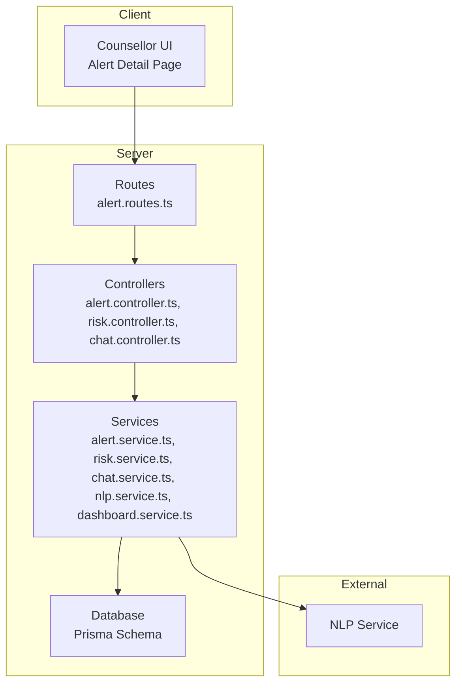
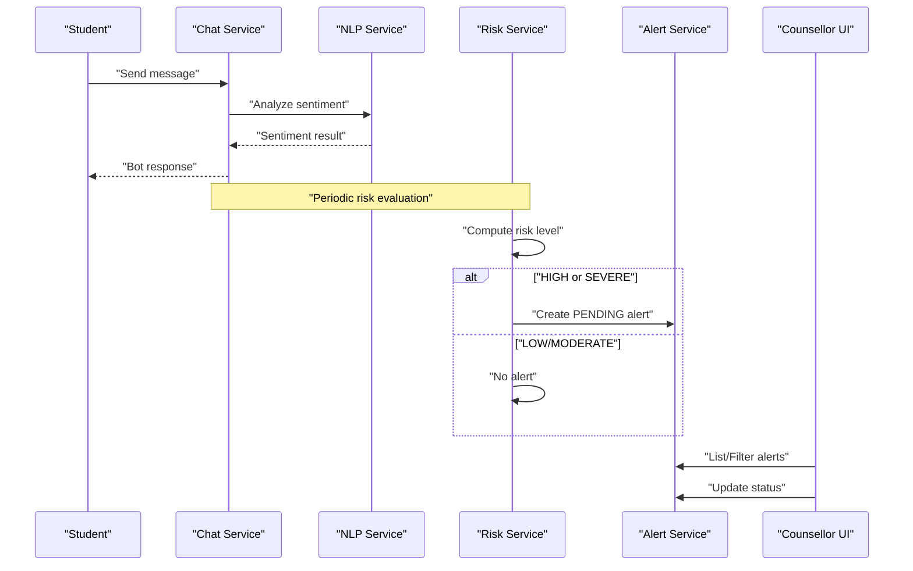
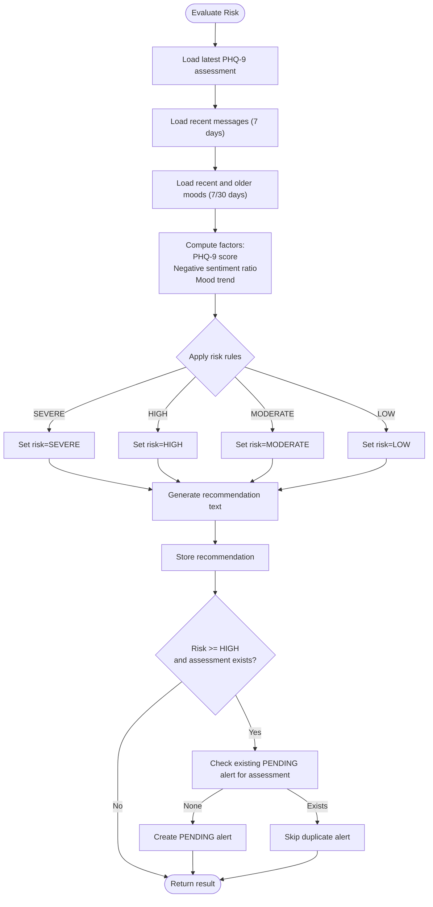
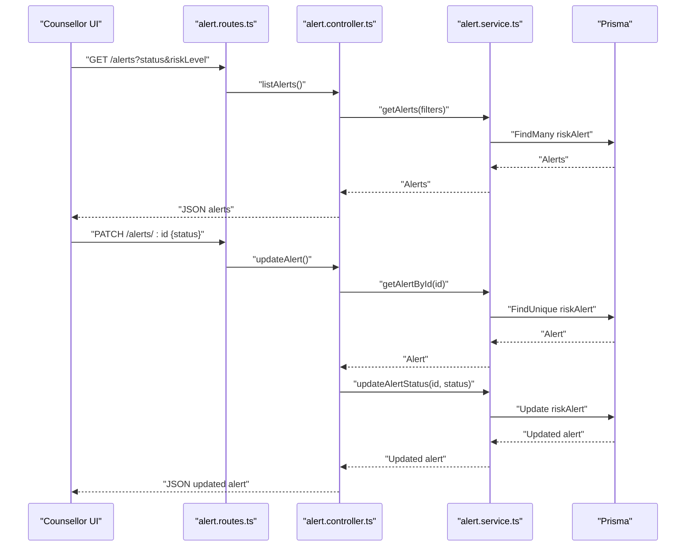
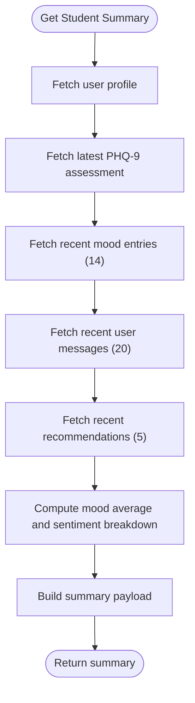
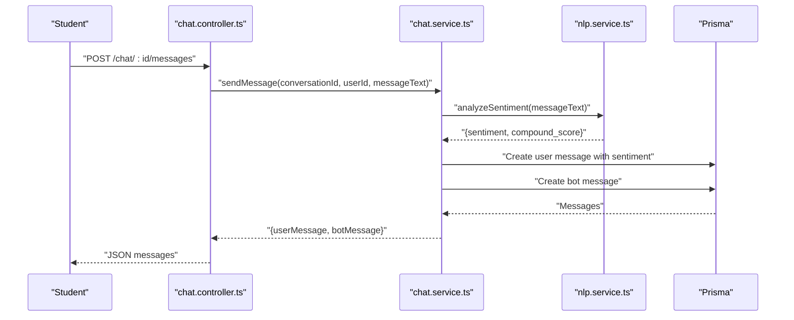
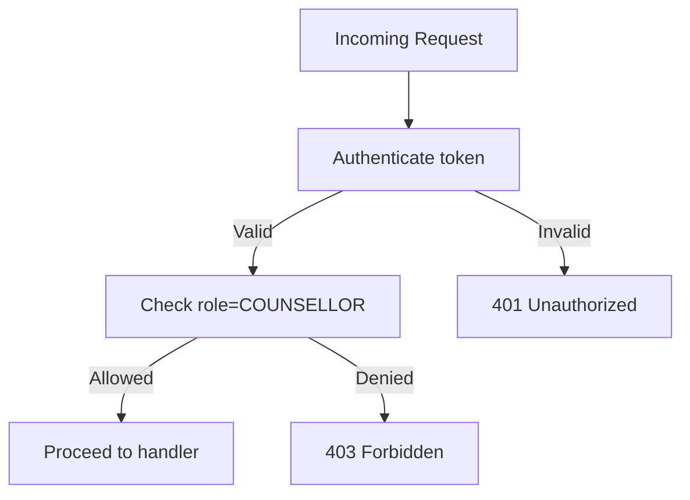
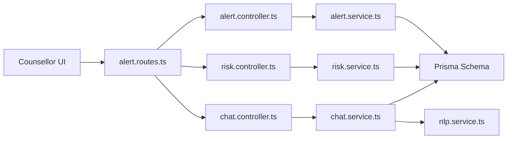

# Escalation Procedures and Coordination

<cite>
**Referenced Files in This Document**
- [alert.controller.ts](file://server/src/controllers/alert.controller.ts)
- [alert.service.ts](file://server/src/services/alert.service.ts)
- [alert.routes.ts](file://server/src/routes/alert.routes.ts)
- [risk.controller.ts](file://server/src/controllers/risk.controller.ts)
- [risk.service.ts](file://server/src/services/risk.service.ts)
- [chat.controller.ts](file://server/src/controllers/chat.controller.ts)
- [chat.service.ts](file://server/src/services/chat.service.ts)
- [nlp.service.ts](file://server/src/services/nlp.service.ts)
- [auth.ts](file://server/src/middleware/auth.ts)
- [schema.prisma](file://prisma/schema.prisma)
- [dashboard.service.ts](file://server/src/services/dashboard.service.ts)
- [page.tsx](file://client/src/app/counsellor/alerts/[id]/page.tsx)
</cite>

## Table of Contents
1. [Introduction](#introduction)
2. [Project Structure](#project-structure)
3. [Core Components](#core-components)
4. [Architecture Overview](#architecture-overview)
5. [Detailed Component Analysis](#detailed-component-analysis)
6. [Dependency Analysis](#dependency-analysis)
7. [Performance Considerations](#performance-considerations)
8. [Troubleshooting Guide](#troubleshooting-guide)
9. [Conclusion](#conclusion)
10. [Appendices](#appendices)

## Introduction
This document defines escalation procedures and inter-agency coordination for the alert management system. It explains how severe cases are identified, how alerts are routed and managed, and how coordination occurs with campus security, medical services, family contacts, and external mental health resources. It also documents the integration with institutional policies, legal requirements, and reporting obligations, along with examples of escalation scenarios, documentation requirements, chain of command, and de-escalation transitions.

## Project Structure
The alert management system centers around risk evaluation, alert creation, and counselor workflows. The backend exposes REST endpoints for counselors to view, filter, and update alerts. Risk evaluation is computed from PHQ-9 assessments, recent messages, and mood trends. Alerts are stored with risk levels and statuses. The frontend provides a counselor interface to manage alerts and view student summaries.

**Diagram sources**
- [alert.routes.ts:1-15](file://server/src/routes/alert.routes.ts#L1-L15)
- [alert.controller.ts:1-70](file://server/src/controllers/alert.controller.ts#L1-L70)
- [risk.controller.ts:1-32](file://server/src/controllers/risk.controller.ts#L1-L32)
- [chat.controller.ts:1-69](file://server/src/controllers/chat.controller.ts#L1-L69)
- [alert.service.ts:1-62](file://server/src/services/alert.service.ts#L1-L62)
- [risk.service.ts:1-138](file://server/src/services/risk.service.ts#L1-L138)
- [chat.service.ts:1-105](file://server/src/services/chat.service.ts#L1-L105)
- [nlp.service.ts:1-24](file://server/src/services/nlp.service.ts#L1-L24)
- [schema.prisma:1-134](file://prisma/schema.prisma#L1-L134)
- [page.tsx:92-196](file://client/src/app/counsellor/alerts/[id]/page.tsx#L92-L196)

**Section sources**
- [alert.routes.ts:1-15](file://server/src/routes/alert.routes.ts#L1-L15)
- [alert.controller.ts:1-70](file://server/src/controllers/alert.controller.ts#L1-L70)
- [risk.controller.ts:1-32](file://server/src/controllers/risk.controller.ts#L1-L32)
- [chat.controller.ts:1-69](file://server/src/controllers/chat.controller.ts#L1-L69)
- [alert.service.ts:1-62](file://server/src/services/alert.service.ts#L1-L62)
- [risk.service.ts:1-138](file://server/src/services/risk.service.ts#L1-L138)
- [chat.service.ts:1-105](file://server/src/services/chat.service.ts#L1-L105)
- [nlp.service.ts:1-24](file://server/src/services/nlp.service.ts#L1-L24)
- [schema.prisma:1-134](file://prisma/schema.prisma#L1-L134)
- [page.tsx:92-196](file://client/src/app/counsellor/alerts/[id]/page.tsx#L92-L196)

## Core Components
- Risk evaluation engine computes risk level from PHQ-9 assessment, recent message sentiment, and mood trends. High-risk evaluations trigger alert creation.
- Alert management allows counselors to list, view, and update alert status (PENDING → REVIEWED → RESOLVED).
- Student summary aggregates user profile, latest assessment, recent moods, sentiment breakdown, and recommendations.
- Chat and NLP pipeline supports real-time messaging with sentiment analysis for ongoing monitoring.
- Authentication and role-based access ensure only authorized counselors can manage alerts.

**Section sources**
- [risk.service.ts:11-107](file://server/src/services/risk.service.ts#L11-L107)
- [alert.controller.ts:5-69](file://server/src/controllers/alert.controller.ts#L5-L69)
- [alert.service.ts:3-61](file://server/src/services/alert.service.ts#L3-L61)
- [chat.service.ts:45-89](file://server/src/services/chat.service.ts#L45-L89)
- [nlp.service.ts:11-23](file://server/src/services/nlp.service.ts#L11-L23)
- [auth.ts:5-38](file://server/src/middleware/auth.ts#L5-L38)

## Architecture Overview
The system integrates risk scoring, alert lifecycle, and counselor workflows. Risk evaluation writes recommendations and optionally creates alerts. Counselors review alerts and progress them through status updates. Student summaries aid decision-making. Chat/NLP supports continuous monitoring.

**Diagram sources**
- [chat.service.ts:45-89](file://server/src/services/chat.service.ts#L45-L89)
- [nlp.service.ts:11-23](file://server/src/services/nlp.service.ts#L11-L23)
- [risk.service.ts:87-107](file://server/src/services/risk.service.ts#L87-L107)
- [alert.service.ts:28-33](file://server/src/services/alert.service.ts#L28-L33)
- [alert.controller.ts:5-69](file://server/src/controllers/alert.controller.ts#L5-L69)
- [page.tsx:130-178](file://client/src/app/counsellor/alerts/[id]/page.tsx#L130-L178)

## Detailed Component Analysis

### Risk Evaluation and Alert Creation
- Inputs: Latest PHQ-9 assessment, recent messages (last 7 days), recent and older mood entries.
- Factors: PHQ-9 score, negative sentiment ratio, mood trend decline.
- Outputs: Risk level (LOW, MODERATE, HIGH, SEVERE), recommendation text, optional alert creation.
- Alert creation: For HIGH or SEVERE risk with a valid assessment, a PENDING alert is created only if none exists for the same assessment.

**Diagram sources**
- [risk.service.ts:11-107](file://server/src/services/risk.service.ts#L11-L107)

**Section sources**
- [risk.service.ts:11-107](file://server/src/services/risk.service.ts#L11-L107)

### Alert Lifecycle Management
- Endpoint exposure: GET /alerts (filter by status and riskLevel), GET /alerts/:id, PATCH /alerts/:id (status), GET /alerts/:id/student (student summary).
- Status progression: PENDING → REVIEWED → RESOLVED.
- Authorization: Requires authentication and role COUNSELLOR.

**Diagram sources**
- [alert.routes.ts:7-12](file://server/src/routes/alert.routes.ts#L7-L12)
- [alert.controller.ts:5-69](file://server/src/controllers/alert.controller.ts#L5-L69)
- [alert.service.ts:3-33](file://server/src/services/alert.service.ts#L3-L33)
- [schema.prisma:121-133](file://prisma/schema.prisma#L121-L133)

**Section sources**
- [alert.routes.ts:7-12](file://server/src/routes/alert.routes.ts#L7-L12)
- [alert.controller.ts:5-69](file://server/src/controllers/alert.controller.ts#L5-L69)
- [alert.service.ts:3-33](file://server/src/services/alert.service.ts#L3-L33)
- [schema.prisma:121-133](file://prisma/schema.prisma#L121-L133)

### Student Summary and Monitoring
- Student summary includes user profile, latest assessment, mood average and recent entries, sentiment breakdown of recent messages, and recent recommendations.
- Enables counselors to quickly assess context before deciding on escalation actions.

**Diagram sources**
- [alert.service.ts:35-61](file://server/src/services/alert.service.ts#L35-L61)

**Section sources**
- [alert.service.ts:35-61](file://server/src/services/alert.service.ts#L35-L61)

### Chat and Sentiment Analysis Pipeline
- Messages are validated, analyzed for sentiment via NLP service, and stored with sentiment and score.
- Bot generates contextual responses based on sentiment.
- Provides continuous monitoring signals used by risk evaluation.

**Diagram sources**
- [chat.controller.ts:33-53](file://server/src/controllers/chat.controller.ts#L33-L53)
- [chat.service.ts:45-89](file://server/src/services/chat.service.ts#L45-L89)
- [nlp.service.ts:11-23](file://server/src/services/nlp.service.ts#L11-L23)
- [schema.prisma:73-84](file://prisma/schema.prisma#L73-L84)

**Section sources**
- [chat.controller.ts:33-53](file://server/src/controllers/chat.controller.ts#L33-L53)
- [chat.service.ts:45-89](file://server/src/services/chat.service.ts#L45-L89)
- [nlp.service.ts:11-23](file://server/src/services/nlp.service.ts#L11-L23)
- [schema.prisma:73-84](file://prisma/schema.prisma#L73-L84)

### Authorization and Access Control
- Authentication middleware validates bearer tokens.
- Role middleware restricts alert management to counselors.

**Diagram sources**
- [auth.ts:5-38](file://server/src/middleware/auth.ts#L5-L38)
- [alert.routes.ts:7-7](file://server/src/routes/alert.routes.ts#L7-L7)

**Section sources**
- [auth.ts:5-38](file://server/src/middleware/auth.ts#L5-L38)
- [alert.routes.ts:7-7](file://server/src/routes/alert.routes.ts#L7-L7)

### Escalation Criteria and Routing Logic
- Severe risk (SEVERE) triggers immediate alert creation and counselor notification.
- High risk (HIGH) triggers alert creation and requires counselor review.
- Moderate risk (MODERATE) triggers recommendation storage; escalation depends on follow-up outcomes.
- Low risk (LOW) does not create alerts; continued monitoring recommended.

Escalation routing:
- Alerts are created with status PENDING upon detection of HIGH/SEVERE risk.
- Counselors progress alerts: PENDING → REVIEWED → RESOLVED.
- Student summary informs decision-making for escalation actions.

**Section sources**
- [risk.service.ts:87-107](file://server/src/services/risk.service.ts#L87-L107)
- [alert.controller.ts:32-53](file://server/src/controllers/alert.controller.ts#L32-L53)
- [alert.service.ts:28-33](file://server/src/services/alert.service.ts#L28-L33)
- [page.tsx:106-112](file://client/src/app/counsellor/alerts/[id]/page.tsx#L106-L112)

### Inter-Agency Coordination Mechanisms
- Campus Security: For immediate intervention or emergency protocols, counselors escalate alerts to security via integrated workflows. Immediate intervention applies when risk is SEVERE and the student is in distress.
- Medical Services: Coordinate with on-campus medical staff for stabilization and follow-up care when indicated by risk level and clinical judgment.
- Family Members: Notify family contacts per institutional policy when appropriate and safe, ensuring compliance with privacy regulations.
- External Mental Health Resources: Connect students to external providers through recommendations and follow-up plans when internal resources are insufficient.

Note: The current codebase focuses on alert creation and status management. Inter-agency workflows (e.g., security notifications, external resource referrals) are not implemented in the referenced files and should be integrated via additional services and APIs aligned with institutional policies.

**Section sources**
- [risk.service.ts:109-120](file://server/src/services/risk.service.ts#L109-L120)
- [alert.service.ts:35-61](file://server/src/services/alert.service.ts#L35-L61)

### Notification Systems and Response Time Requirements
- Automatic notifications: Alerts are created automatically for HIGH/SEVERE risk. Counselors receive notifications through the UI to review and update alerts.
- Manual notifications: For immediate intervention, counselors manually escalate to security and medical services.
- Response time requirements: Define SLAs for PENDING → REVIEWED and REVIEWED → RESOLVED timelines aligned with institutional standards.

Note: Response time SLAs are policy-defined and not present in the codebase.

**Section sources**
- [risk.service.ts:87-107](file://server/src/services/risk.service.ts#L87-L107)
- [page.tsx:170-178](file://client/src/app/counsellor/alerts/[id]/page.tsx#L170-L178)

### Integration with Institutional Policies, Legal Requirements, and Reporting Obligations
- Policy alignment: Escalation thresholds and notification pathways must align with institutional policies and legal obligations.
- Reporting: Maintain audit trails of alert status changes, recommendations, and interventions for compliance and quality assurance.
- Privacy: Ensure all data handling complies with applicable privacy laws; avoid unauthorized disclosure of protected information.

Note: These obligations are policy-driven and not implemented in the referenced code files.

**Section sources**
- [alert.service.ts:35-61](file://server/src/services/alert.service.ts#L35-L61)
- [risk.service.ts:78-85](file://server/src/services/risk.service.ts#L78-L85)

### Examples of Escalation Scenarios
- Routine follow-up: MODERATE risk with stable mood and moderate negative sentiment; counselor schedules a session and monitors progress.
- Crisis situation: SEVERE risk with high PHQ-9 score and strong negative sentiment; immediate alert created, counselor contacts security and medical services, and initiates emergency protocols.
- De-escalation: Student shows improvement; counselor updates status to REVIEWED and RESOLVED after confirming safety and stability.

**Section sources**
- [risk.service.ts:60-73](file://server/src/services/risk.service.ts#L60-L73)
- [alert.controller.ts:32-53](file://server/src/controllers/alert.controller.ts#L32-L53)
- [page.tsx:170-178](file://client/src/app/counsellor/alerts/[id]/page.tsx#L170-L178)

### Documentation Requirements, Chain of Command, and Accountability Measures
- Documentation: Record risk level determinations, recommendation texts, alert creation timestamps, status updates, and inter-agency actions.
- Chain of command: Counselors report to supervisors; supervisors approve high-priority escalations and ensure compliance.
- Accountability: Maintain logs of who accessed alerts, when, and what actions were taken; enable audits and reviews.

Note: These measures are operational policies not implemented in the referenced code.

**Section sources**
- [risk.service.ts:78-85](file://server/src/services/risk.service.ts#L78-L85)
- [alert.service.ts:28-33](file://server/src/services/alert.service.ts#L28-L33)

### De-Escalation Procedures and Transition Back to Standard Care
- De-escalation: Monitor improvements in mood, sentiment, and self-reported wellbeing; update alert status to REVIEWED and RESOLVED when safety is confirmed.
- Transition: Move to standard care protocols, including ongoing counseling and periodic reassessments.

**Section sources**
- [alert.controller.ts:32-53](file://server/src/controllers/alert.controller.ts#L32-L53)
- [page.tsx:170-178](file://client/src/app/counsellor/alerts/[id]/page.tsx#L170-L178)

## Dependency Analysis
The alert management system exhibits clear separation of concerns:
- Controllers depend on services for business logic.
- Services depend on Prisma for persistence and on the NLP service for sentiment analysis.
- Routes enforce authentication and role checks.
- The counselor UI consumes alert endpoints and drives status updates.

**Diagram sources**
- [alert.routes.ts:1-15](file://server/src/routes/alert.routes.ts#L1-L15)
- [alert.controller.ts:1-70](file://server/src/controllers/alert.controller.ts#L1-L70)
- [risk.controller.ts:1-32](file://server/src/controllers/risk.controller.ts#L1-L32)
- [chat.controller.ts:1-69](file://server/src/controllers/chat.controller.ts#L1-L69)
- [alert.service.ts:1-62](file://server/src/services/alert.service.ts#L1-L62)
- [risk.service.ts:1-138](file://server/src/services/risk.service.ts#L1-L138)
- [chat.service.ts:1-105](file://server/src/services/chat.service.ts#L1-L105)
- [nlp.service.ts:1-24](file://server/src/services/nlp.service.ts#L1-L24)
- [schema.prisma:1-134](file://prisma/schema.prisma#L1-L134)
- [page.tsx:92-196](file://client/src/app/counsellor/alerts/[id]/page.tsx#L92-L196)

**Section sources**
- [alert.routes.ts:1-15](file://server/src/routes/alert.routes.ts#L1-L15)
- [alert.controller.ts:1-70](file://server/src/controllers/alert.controller.ts#L1-L70)
- [risk.controller.ts:1-32](file://server/src/controllers/risk.controller.ts#L1-L32)
- [chat.controller.ts:1-69](file://server/src/controllers/chat.controller.ts#L1-L69)
- [alert.service.ts:1-62](file://server/src/services/alert.service.ts#L1-L62)
- [risk.service.ts:1-138](file://server/src/services/risk.service.ts#L1-L138)
- [chat.service.ts:1-105](file://server/src/services/chat.service.ts#L1-L105)
- [nlp.service.ts:1-24](file://server/src/services/nlp.service.ts#L1-L24)
- [schema.prisma:1-134](file://prisma/schema.prisma#L1-L134)
- [page.tsx:92-196](file://client/src/app/counsellor/alerts/[id]/page.tsx#L92-L196)

## Performance Considerations
- Asynchronous operations: Risk evaluation and alert creation occur asynchronously; ensure idempotency to prevent duplicates.
- Batch queries: Student summary uses concurrent promises to fetch related data efficiently.
- Caching: Consider caching frequently accessed recommendations and recent summaries to reduce database load.
- Scalability: Offload heavy analytics (e.g., sentiment analysis) to dedicated microservices to maintain responsiveness.

[No sources needed since this section provides general guidance]

## Troubleshooting Guide
- Authentication failures: Verify bearer tokens and ensure the Authorization header is present and valid.
- Role denials: Confirm the user has the COUNSELLOR role before accessing alert management endpoints.
- Alert not found: Validate alert IDs and ensure the alert belongs to the requesting counselor’s scope.
- NLP service errors: If sentiment analysis fails, messages are still stored without sentiment; monitor NLP service availability and retry logic.

**Section sources**
- [auth.ts:5-38](file://server/src/middleware/auth.ts#L5-L38)
- [alert.controller.ts:18-30](file://server/src/controllers/alert.controller.ts#L18-L30)
- [chat.service.ts:58-65](file://server/src/services/chat.service.ts#L58-L65)

## Conclusion
The alert management system provides a robust foundation for identifying and managing mental health risks through automated risk evaluation and structured alert lifecycle management. While the core components support automatic alert creation for HIGH/SEVERE cases and counselor-driven status updates, inter-agency coordination, emergency protocols, and detailed documentation/logging should be integrated to meet institutional policies and legal requirements. The provided architecture and workflows offer a clear path to expand the system with additional services for security, medical, and external resource coordination.

## Appendices
- Dashboard statistics: Total alerts, pending, reviewed, resolved, total students, and risk distribution are available for administrative oversight.

**Section sources**
- [dashboard.service.ts:3-17](file://server/src/services/dashboard.service.ts#L3-L17)