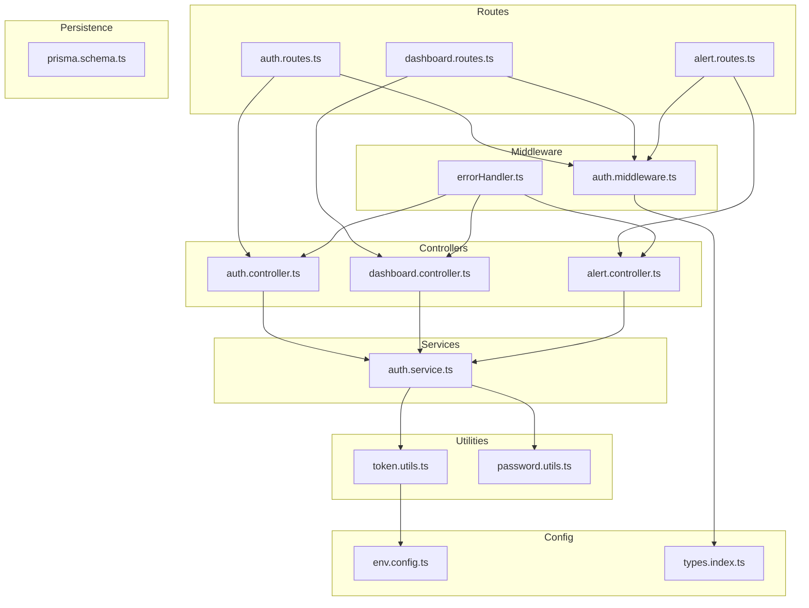
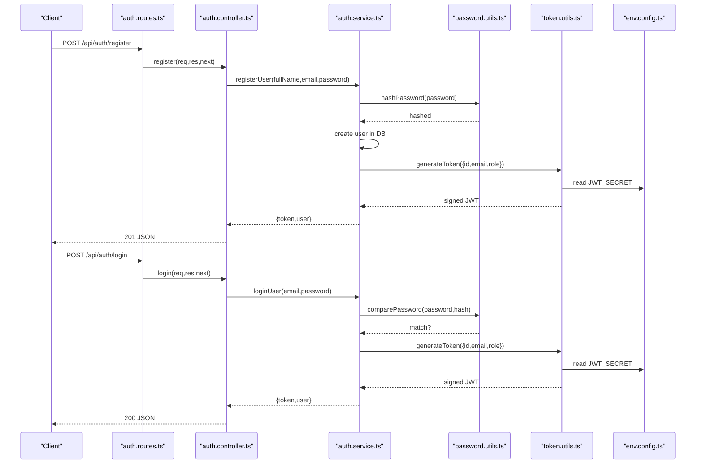
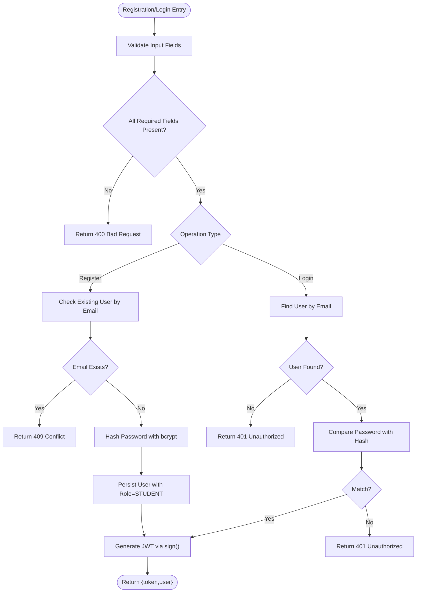
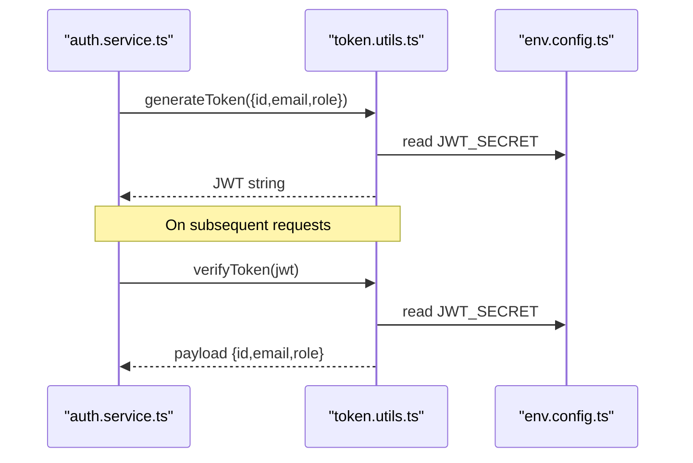
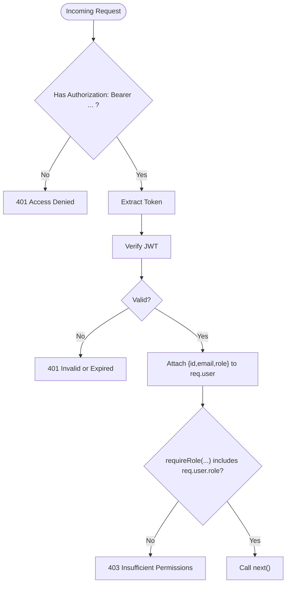
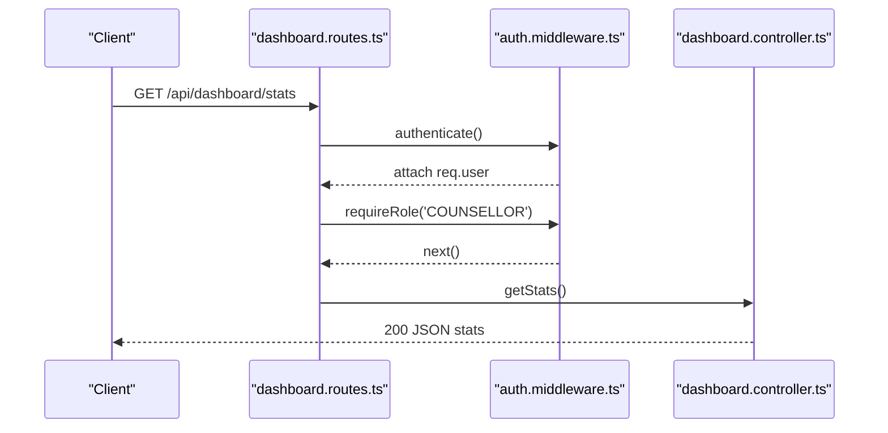
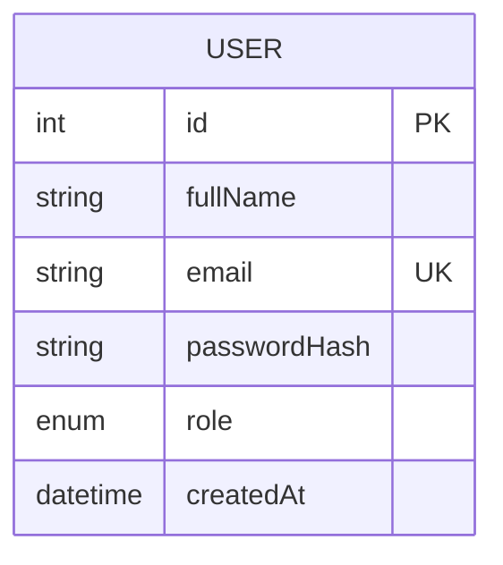
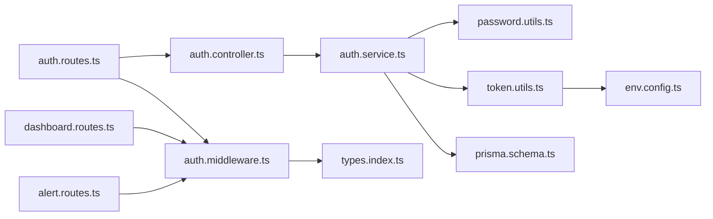

# Authentication and Authorization

<cite>
**Referenced Files in This Document**
- [auth.controller.ts](file://server/src/controllers/auth.controller.ts)
- [auth.service.ts](file://server/src/services/auth.service.ts)
- [auth.middleware.ts](file://server/src/middleware/auth.ts)
- [token.utils.ts](file://server/src/utils/token.ts)
- [password.utils.ts](file://server/src/utils/password.ts)
- [auth.routes.ts](file://server/src/routes/auth.routes.ts)
- [env.config.ts](file://server/src/config/env.ts)
- [types.index.ts](file://server/src/types/index.ts)
- [prisma.schema.ts](file://prisma/schema.prisma)
- [dashboard.routes.ts](file://server/src/routes/dashboard.routes.ts)
- [alert.routes.ts](file://server/src/routes/alert.routes.ts)
- [errorHandler.ts](file://server/src/middleware/errorHandler.ts)
</cite>

## Table of Contents
1. [Introduction](#introduction)
2. [Project Structure](#project-structure)
3. [Core Components](#core-components)
4. [Architecture Overview](#architecture-overview)
5. [Detailed Component Analysis](#detailed-component-analysis)
6. [Dependency Analysis](#dependency-analysis)
7. [Performance Considerations](#performance-considerations)
8. [Security Best Practices](#security-best-practices)
9. [Troubleshooting Guide](#troubleshooting-guide)
10. [Conclusion](#conclusion)

## Introduction
This document explains the authentication and authorization system built on JWT-based security. It covers user registration and login, password hashing with bcrypt, token generation and verification, middleware-based route protection, and role-based access control (RBAC) with STUDENT and COUNSELLOR roles. It also outlines practical examples for protecting routes, verifying tokens, and enforcing roles, along with recommended security enhancements such as CSRF protection, secure cookie handling, rate limiting, account lockout, and audit logging.

## Project Structure
The authentication subsystem is organized around Express controllers, middleware, services, utilities, and Prisma models. Routes define entry points, middleware enforces authentication and roles, services encapsulate business logic, and utilities handle cryptographic operations and token lifecycle.

**Diagram sources**
- [auth.routes.ts:1-12](file://server/src/routes/auth.routes.ts#L1-L12)
- [dashboard.routes.ts:1-11](file://server/src/routes/dashboard.routes.ts#L1-L11)
- [alert.routes.ts:1-15](file://server/src/routes/alert.routes.ts#L1-L15)
- [auth.controller.ts:1-50](file://server/src/controllers/auth.controller.ts#L1-L50)
- [auth.service.ts:1-72](file://server/src/services/auth.service.ts#L1-L72)
- [auth.middleware.ts:1-39](file://server/src/middleware/auth.ts#L1-L39)
- [token.utils.ts:1-17](file://server/src/utils/token.ts#L1-L17)
- [password.utils.ts:1-12](file://server/src/utils/password.ts#L1-L12)
- [env.config.ts:1-12](file://server/src/config/env.ts#L1-L12)
- [types.index.ts:1-12](file://server/src/types/index.ts#L1-L12)
- [prisma.schema.ts:1-134](file://prisma/schema.prisma#L1-L134)
- [errorHandler.ts:1-13](file://server/src/middleware/errorHandler.ts#L1-L13)

**Section sources**
- [auth.routes.ts:1-12](file://server/src/routes/auth.routes.ts#L1-L12)
- [auth.controller.ts:1-50](file://server/src/controllers/auth.controller.ts#L1-L50)
- [auth.service.ts:1-72](file://server/src/services/auth.service.ts#L1-L72)
- [auth.middleware.ts:1-39](file://server/src/middleware/auth.ts#L1-L39)
- [token.utils.ts:1-17](file://server/src/utils/token.ts#L1-L17)
- [password.utils.ts:1-12](file://server/src/utils/password.ts#L1-L12)
- [env.config.ts:1-12](file://server/src/config/env.ts#L1-L12)
- [types.index.ts:1-12](file://server/src/types/index.ts#L1-L12)
- [prisma.schema.ts:1-134](file://prisma/schema.prisma#L1-L134)
- [errorHandler.ts:1-13](file://server/src/middleware/errorHandler.ts#L1-L13)

## Core Components
- Authentication controller: Handles registration, login, and profile retrieval.
- Authentication service: Manages user persistence, password hashing/verification, and token issuance.
- Authentication middleware: Validates bearer tokens and enforces role-based access.
- Token utilities: Generate and verify JWT tokens using a shared secret.
- Password utilities: Hash and compare passwords using bcrypt.
- Environment configuration: Provides runtime secrets and service URLs.
- Types: Defines request extensions for authenticated requests.
- Prisma schema: Declares the User model with role enumeration and relations.
- Route protection: Applies middleware to restrict access to counselors-only endpoints.

**Section sources**
- [auth.controller.ts:1-50](file://server/src/controllers/auth.controller.ts#L1-L50)
- [auth.service.ts:1-72](file://server/src/services/auth.service.ts#L1-L72)
- [auth.middleware.ts:1-39](file://server/src/middleware/auth.ts#L1-L39)
- [token.utils.ts:1-17](file://server/src/utils/token.ts#L1-L17)
- [password.utils.ts:1-12](file://server/src/utils/password.ts#L1-L12)
- [env.config.ts:1-12](file://server/src/config/env.ts#L1-L12)
- [types.index.ts:1-12](file://server/src/types/index.ts#L1-L12)
- [prisma.schema.ts:10-61](file://prisma/schema.prisma#L10-L61)
- [auth.routes.ts:1-12](file://server/src/routes/auth.routes.ts#L1-L12)
- [dashboard.routes.ts:1-11](file://server/src/routes/dashboard.routes.ts#L1-L11)
- [alert.routes.ts:1-15](file://server/src/routes/alert.routes.ts#L1-L15)

## Architecture Overview
The system follows a layered architecture:
- Routes define endpoints and apply middleware.
- Controllers delegate to services for business logic.
- Services interact with Prisma for persistence and use utilities for cryptography and token handling.
- Middleware validates tokens and enforces roles.
- Environment configuration supplies secrets and external service URLs.

**Diagram sources**
- [auth.routes.ts:1-12](file://server/src/routes/auth.routes.ts#L1-L12)
- [auth.controller.ts:1-50](file://server/src/controllers/auth.controller.ts#L1-L50)
- [auth.service.ts:1-72](file://server/src/services/auth.service.ts#L1-L72)
- [password.utils.ts:1-12](file://server/src/utils/password.ts#L1-L12)
- [token.utils.ts:1-17](file://server/src/utils/token.ts#L1-L17)
- [env.config.ts:1-12](file://server/src/config/env.ts#L1-L12)

## Detailed Component Analysis

### Authentication Flow: Registration and Login
- Registration validates input, checks for existing users, hashes the password, persists the user with a default STUDENT role, and issues a JWT.
- Login validates credentials against stored hash, and issues a JWT upon successful authentication.

**Diagram sources**
- [auth.controller.ts:5-35](file://server/src/controllers/auth.controller.ts#L5-L35)
- [auth.service.ts:5-59](file://server/src/services/auth.service.ts#L5-L59)
- [password.utils.ts:5-11](file://server/src/utils/password.ts#L5-L11)
- [token.utils.ts:10-12](file://server/src/utils/token.ts#L10-L12)

**Section sources**
- [auth.controller.ts:5-35](file://server/src/controllers/auth.controller.ts#L5-L35)
- [auth.service.ts:5-59](file://server/src/services/auth.service.ts#L5-L59)
- [password.utils.ts:5-11](file://server/src/utils/password.ts#L5-L11)
- [token.utils.ts:10-12](file://server/src/utils/token.ts#L10-L12)

### Token Generation and Verification
- Tokens are signed with a shared secret and expire after 24 hours.
- Verification reuses the same secret; failures yield 401 responses.

**Diagram sources**
- [auth.service.ts:26-30](file://server/src/services/auth.service.ts#L26-L30)
- [auth.service.ts:52-56](file://server/src/services/auth.service.ts#L52-L56)
- [token.utils.ts:10-16](file://server/src/utils/token.ts#L10-L16)
- [env.config.ts](file://server/src/config/env.ts#L9)

**Section sources**
- [token.utils.ts:1-17](file://server/src/utils/token.ts#L1-L17)
- [env.config.ts](file://server/src/config/env.ts#L9)

### Authentication Middleware and RBAC
- Bearer token extraction from Authorization header.
- JWT verification attaches user payload to the request object.
- Role enforcement middleware checks inclusion of required roles.

**Diagram sources**
- [auth.middleware.ts:5-22](file://server/src/middleware/auth.ts#L5-L22)
- [auth.middleware.ts:24-38](file://server/src/middleware/auth.ts#L24-L38)
- [types.index.ts:3-11](file://server/src/types/index.ts#L3-L11)

**Section sources**
- [auth.middleware.ts:1-39](file://server/src/middleware/auth.ts#L1-L39)
- [types.index.ts:1-12](file://server/src/types/index.ts#L1-L12)

### Protected Routes and Role-Based Access Control
- Public routes: POST /api/auth/register, POST /api/auth/login, GET /api/auth/me.
- Counselor-only routes: GET /api/dashboard/stats, GET/PUT /api/alerts/*.

**Diagram sources**
- [dashboard.routes.ts:7-8](file://server/src/routes/dashboard.routes.ts#L7-L8)
- [auth.middleware.ts:24-38](file://server/src/middleware/auth.ts#L24-L38)
- [dashboard.controller.ts:5-12](file://server/src/controllers/dashboard.controller.ts#L5-L12)

**Section sources**
- [auth.routes.ts:7-9](file://server/src/routes/auth.routes.ts#L7-L9)
- [dashboard.routes.ts:7-8](file://server/src/routes/dashboard.routes.ts#L7-L8)
- [alert.routes.ts](file://server/src/routes/alert.routes.ts#L7)

### Data Model: Users and Roles
The User model defines the role enumeration and default value, enabling RBAC enforcement.

**Diagram sources**
- [prisma.schema.ts:47-61](file://prisma/schema.prisma#L47-L61)

**Section sources**
- [prisma.schema.ts:10-13](file://prisma/schema.prisma#L10-L13)
- [prisma.schema.ts:47-61](file://prisma/schema.prisma#L47-L61)

## Dependency Analysis
Key dependencies and their roles:
- Controllers depend on services for business logic.
- Services depend on utilities for password hashing and token generation.
- Middleware depends on token utilities and type definitions.
- Routes depend on controllers and middleware.
- Environment configuration is consumed by token utilities and middleware.
- Prisma schema defines the User model and role defaults.

**Diagram sources**
- [auth.controller.ts:1-50](file://server/src/controllers/auth.controller.ts#L1-L50)
- [auth.service.ts:1-72](file://server/src/services/auth.service.ts#L1-L72)
- [password.utils.ts:1-12](file://server/src/utils/password.ts#L1-L12)
- [token.utils.ts:1-17](file://server/src/utils/token.ts#L1-L17)
- [env.config.ts:1-12](file://server/src/config/env.ts#L1-L12)
- [auth.routes.ts:1-12](file://server/src/routes/auth.routes.ts#L1-L12)
- [auth.middleware.ts:1-39](file://server/src/middleware/auth.ts#L1-L39)
- [types.index.ts:1-12](file://server/src/types/index.ts#L1-L12)
- [prisma.schema.ts:1-134](file://prisma/schema.prisma#L1-L134)

**Section sources**
- [auth.controller.ts:1-50](file://server/src/controllers/auth.controller.ts#L1-L50)
- [auth.service.ts:1-72](file://server/src/services/auth.service.ts#L1-L72)
- [auth.middleware.ts:1-39](file://server/src/middleware/auth.ts#L1-L39)
- [token.utils.ts:1-17](file://server/src/utils/token.ts#L1-L17)
- [password.utils.ts:1-12](file://server/src/utils/password.ts#L1-L12)
- [auth.routes.ts:1-12](file://server/src/routes/auth.routes.ts#L1-L12)
- [dashboard.routes.ts:1-11](file://server/src/routes/dashboard.routes.ts#L1-L11)
- [alert.routes.ts:1-15](file://server/src/routes/alert.routes.ts#L1-L15)
- [env.config.ts:1-12](file://server/src/config/env.ts#L1-L12)
- [types.index.ts:1-12](file://server/src/types/index.ts#L1-L12)
- [prisma.schema.ts:1-134](file://prisma/schema.prisma#L1-L134)

## Performance Considerations
- Token lifetime: 24-hour expiration balances usability and security; consider shorter expirations with refresh tokens for sensitive environments.
- Password hashing cost: bcrypt salt rounds are set; adjust based on hardware capacity to maintain acceptable login latency.
- Middleware overhead: Keep token verification lightweight; avoid redundant decoding by caching verified claims per request lifecycle.
- Database queries: Indexes on email and foreign keys reduce lookup costs; ensure Prisma client is reused via connection pooling.

[No sources needed since this section provides general guidance]

## Security Best Practices
- Secret management: Ensure JWT_SECRET is strong and rotated periodically; avoid development defaults in production.
- Transport security: Enforce HTTPS to protect tokens in transit.
- Token storage: Store tokens in httpOnly cookies or secure storage; avoid localStorage for bearer tokens.
- CSRF protection: Implement anti-CSRF measures for state-changing operations; consider SameSite cookies and CSRF tokens.
- Secure cookie handling: Set secure, httpOnly, sameSite attributes; configure domain/path appropriately.
- Rate limiting: Apply per-endpoint rate limits and IP-based quotas to mitigate brute-force attacks.
- Account lockout: Temporarily lock accounts after repeated failed attempts; auto-unlock after timeout windows.
- Audit logging: Log authentication events (login, logout, failed attempts), token issuance/revocation, and role-based access decisions.
- Logout: Implement token blacklisting or short-lived tokens with revocation lists; alternatively, rely on token expiry.
- Password policies: Enforce minimum length, character diversity, and reject common passwords; rotate secrets regularly.

[No sources needed since this section provides general guidance]

## Troubleshooting Guide
Common issues and resolutions:
- Invalid or expired token: Returned when JWT verification fails; ensure correct secret and unexpired tokens.
- Missing or malformed Authorization header: Returned when Bearer token is absent or incorrectly formatted.
- Insufficient permissions: Returned when role-based middleware denies access; verify user role and endpoint requirements.
- Internal errors: Centralized error handler returns structured error responses with appropriate status codes.

**Section sources**
- [auth.middleware.ts:8-21](file://server/src/middleware/auth.ts#L8-L21)
- [auth.middleware.ts:31-36](file://server/src/middleware/auth.ts#L31-L36)
- [errorHandler.ts:7-12](file://server/src/middleware/errorHandler.ts#L7-L12)

## Conclusion
The system implements a clean, modular JWT-based authentication and authorization framework. Registration and login leverage bcrypt for secure password handling and emit signed tokens with a 24-hour TTL. Middleware enforces bearer token validation and role-based access control, while routes selectively apply protections. To harden the system, adopt CSRF safeguards, secure cookie practices, rate limiting, lockout policies, and comprehensive audit logging aligned with organizational security standards.