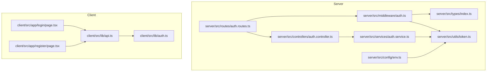
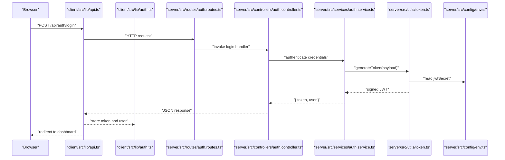
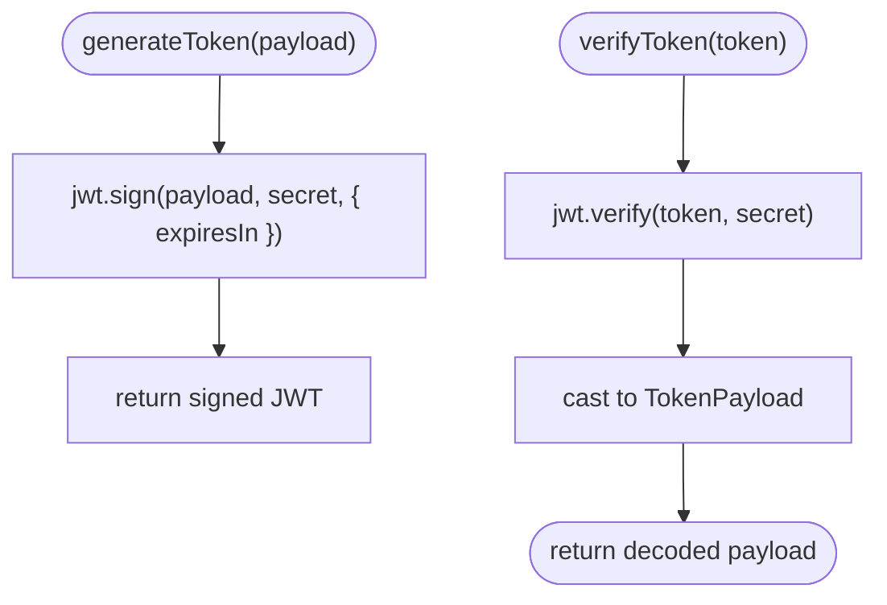
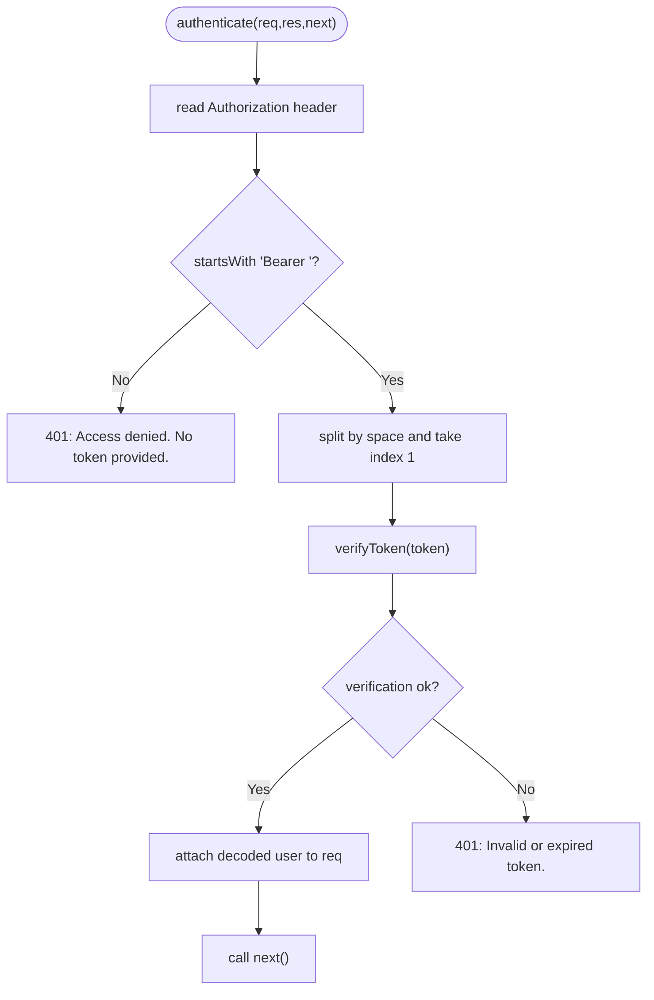
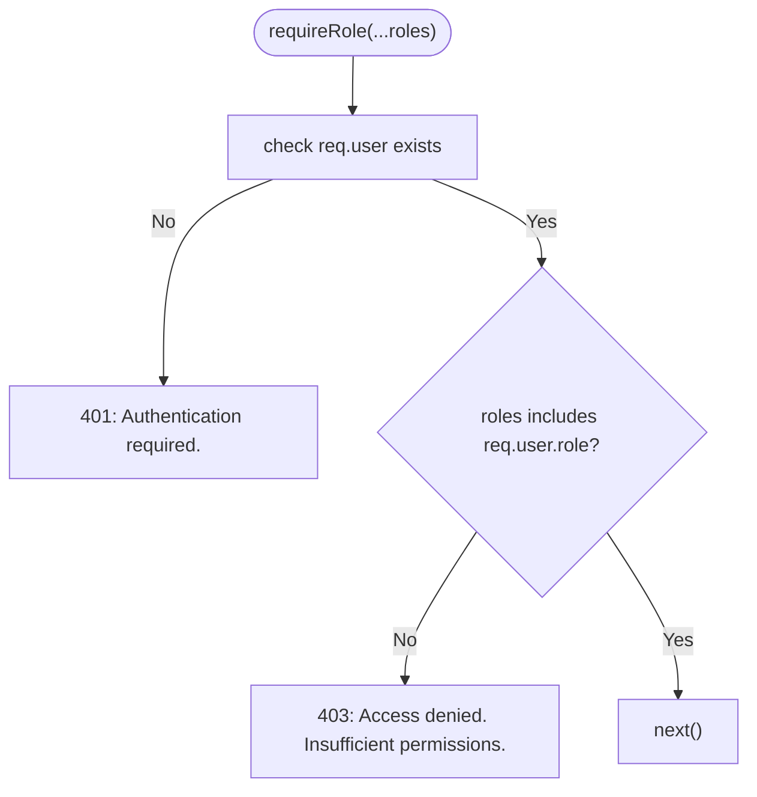
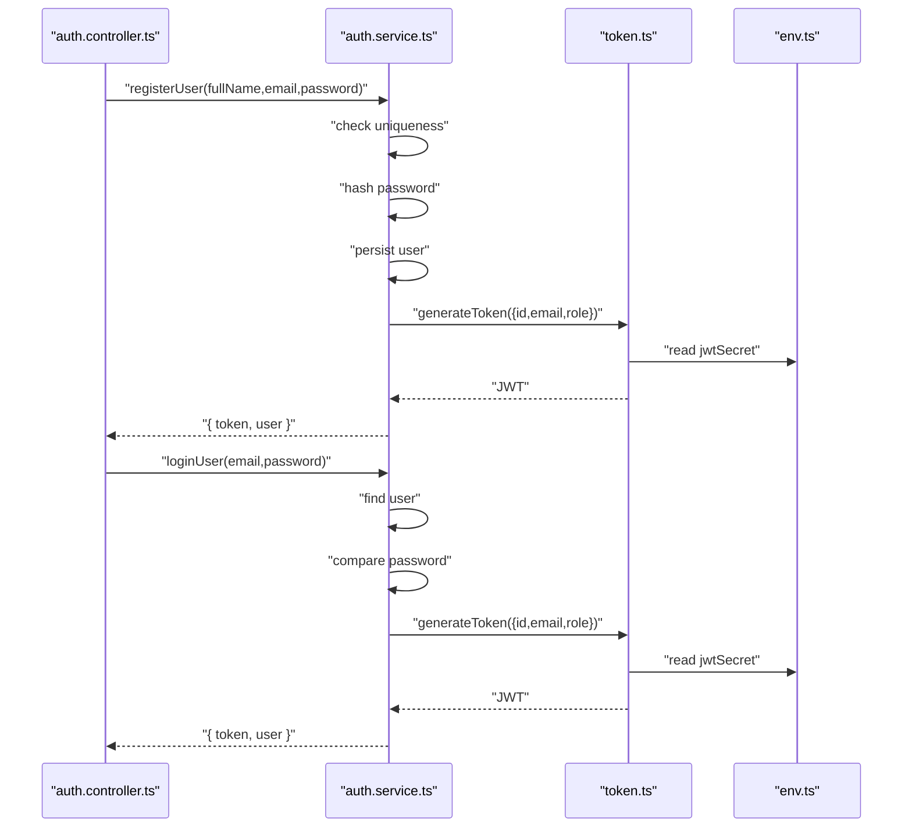
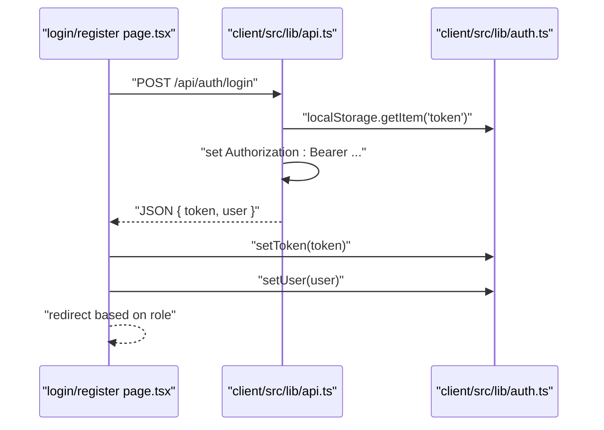
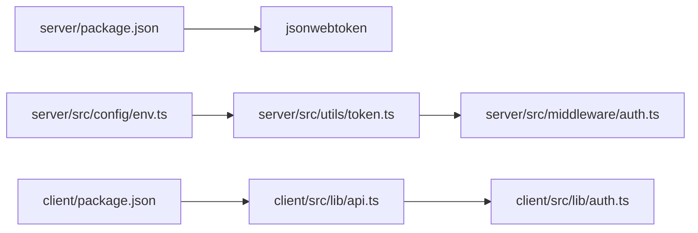

# JWT Token Management

<cite>
**Referenced Files in This Document**
- [token.ts](file://server/src/utils/token.ts)
- [auth.ts](file://server/src/middleware/auth.ts)
- [auth.service.ts](file://server/src/services/auth.service.ts)
- [auth.controller.ts](file://server/src/controllers/auth.controller.ts)
- [auth.routes.ts](file://server/src/routes/auth.routes.ts)
- [env.ts](file://server/src/config/env.ts)
- [index.ts](file://server/src/types/index.ts)
- [api.ts](file://client/src/lib/api.ts)
- [auth.ts](file://client/src/lib/auth.ts)
- [page.tsx](file://client/src/app/login/page.tsx)
- [page.tsx](file://client/src/app/register/page.tsx)
- [package.json](file://server/package.json)
- [package.json](file://client/package.json)
</cite>

## Table of Contents
1. [Introduction](#introduction)
2. [Project Structure](#project-structure)
3. [Core Components](#core-components)
4. [Architecture Overview](#architecture-overview)
5. [Detailed Component Analysis](#detailed-component-analysis)
6. [Dependency Analysis](#dependency-analysis)
7. [Performance Considerations](#performance-considerations)
8. [Troubleshooting Guide](#troubleshooting-guide)
9. [Conclusion](#conclusion)
10. [Appendices](#appendices)

## Introduction
This document explains the JWT token management implementation in the BuddyAI project. It covers token generation with user ID, email, and role claims, verification using shared secrets, expiration handling, and secure storage recommendations. It also documents the current lack of token refresh and blacklist mechanisms, outlines practical workflows for login and protected requests, and highlights security considerations for browser-based storage.

## Project Structure
The JWT implementation spans the server-side token utilities, middleware, controller, service, and routes, and the client-side API integration and local storage helpers.

**Diagram sources**
- [auth.routes.ts:1-12](file://server/src/routes/auth.routes.ts#L1-L12)
- [auth.controller.ts:1-50](file://server/src/controllers/auth.controller.ts#L1-L50)
- [auth.service.ts:1-72](file://server/src/services/auth.service.ts#L1-L72)
- [token.ts:1-17](file://server/src/utils/token.ts#L1-L17)
- [auth.ts:1-39](file://server/src/middleware/auth.ts#L1-L39)
- [env.ts:1-12](file://server/src/config/env.ts#L1-L12)
- [index.ts:1-12](file://server/src/types/index.ts#L1-L12)
- [api.ts:1-36](file://client/src/lib/api.ts#L1-L36)
- [auth.ts:1-27](file://client/src/lib/auth.ts#L1-L27)
- [page.tsx:1-108](file://client/src/app/login/page.tsx#L1-L108)
- [page.tsx:1-120](file://client/src/app/register/page.tsx#L1-L120)

**Section sources**
- [auth.routes.ts:1-12](file://server/src/routes/auth.routes.ts#L1-L12)
- [auth.controller.ts:1-50](file://server/src/controllers/auth.controller.ts#L1-L50)
- [auth.service.ts:1-72](file://server/src/services/auth.service.ts#L1-L72)
- [token.ts:1-17](file://server/src/utils/token.ts#L1-L17)
- [auth.ts:1-39](file://server/src/middleware/auth.ts#L1-L39)
- [env.ts:1-12](file://server/src/config/env.ts#L1-L12)
- [index.ts:1-12](file://server/src/types/index.ts#L1-L12)
- [api.ts:1-36](file://client/src/lib/api.ts#L1-L36)
- [auth.ts:1-27](file://client/src/lib/auth.ts#L1-L27)
- [page.tsx:1-108](file://client/src/app/login/page.tsx#L1-L108)
- [page.tsx:1-120](file://client/src/app/register/page.tsx#L1-L120)

## Core Components
- Token utilities: define the payload shape and provide sign/verify functions with a configured secret and 24-hour expiry.
- Authentication middleware: extracts the Authorization header, validates the Bearer token, and attaches user info to the request.
- Service layer: generates tokens during registration and login using the payload shape.
- Routes and controller: expose endpoints for registration, login, and protected profile retrieval.
- Client API: automatically attaches the stored token to outgoing requests and handles 401 responses by clearing local storage and redirecting to login.
- Client auth helpers: manage token and user data in localStorage.

Key implementation references:
- Payload interface and token functions: [token.ts:4-16](file://server/src/utils/token.ts#L4-L16)
- Middleware authentication and role guard: [auth.ts:5-38](file://server/src/middleware/auth.ts#L5-L38)
- Service token generation on login/register: [auth.service.ts:26-56](file://server/src/services/auth.service.ts#L26-L56)
- Route protection and endpoint handlers: [auth.routes.ts:7-9](file://server/src/routes/auth.routes.ts#L7-L9), [auth.controller.ts:5-49](file://server/src/controllers/auth.controller.ts#L5-L49)
- Client bearer injection and 401 handling: [api.ts:3-26](file://client/src/lib/api.ts#L3-L26)
- Client token storage helpers: [auth.ts:1-27](file://client/src/lib/auth.ts#L1-L27)

**Section sources**
- [token.ts:4-16](file://server/src/utils/token.ts#L4-L16)
- [auth.ts:5-38](file://server/src/middleware/auth.ts#L5-L38)
- [auth.service.ts:26-56](file://server/src/services/auth.service.ts#L26-L56)
- [auth.routes.ts:7-9](file://server/src/routes/auth.routes.ts#L7-L9)
- [auth.controller.ts:5-49](file://server/src/controllers/auth.controller.ts#L5-L49)
- [api.ts:3-26](file://client/src/lib/api.ts#L3-L26)
- [auth.ts:1-27](file://client/src/lib/auth.ts#L1-L27)

## Architecture Overview
The system uses symmetric JWT signing with a shared secret. On successful authentication, the server signs a token containing user identity and role, returning it to the client. Subsequent requests include the token in the Authorization header. The server middleware verifies the token and decodes the payload to authorize access.

**Diagram sources**
- [auth.routes.ts:7-9](file://server/src/routes/auth.routes.ts#L7-L9)
- [auth.controller.ts:21-35](file://server/src/controllers/auth.controller.ts#L21-L35)
- [auth.service.ts:35-58](file://server/src/services/auth.service.ts#L35-L58)
- [token.ts:10-12](file://server/src/utils/token.ts#L10-L12)
- [env.ts:9-9](file://server/src/config/env.ts#L9-L9)
- [api.ts:22-29](file://client/src/lib/api.ts#L22-L29)
- [auth.ts:6-8](file://client/src/lib/auth.ts#L6-L8)

## Detailed Component Analysis

### Token Utilities
- Payload structure: id, email, role.
- Generation: signs payload with the configured secret and sets a 24-hour expiry.
- Verification: verifies signature against the secret and returns decoded payload.

**Diagram sources**
- [token.ts:10-16](file://server/src/utils/token.ts#L10-L16)

**Section sources**
- [token.ts:4-16](file://server/src/utils/token.ts#L4-L16)
- [env.ts:9-9](file://server/src/config/env.ts#L9-L9)

### Authentication Middleware
- Extracts Authorization header and ensures it starts with Bearer.
- Splits the header to obtain the token.
- Calls verifyToken; on success, attaches decoded user to the request and continues; otherwise responds with 401.

**Diagram sources**
- [auth.ts:5-22](file://server/src/middleware/auth.ts#L5-L22)

**Section sources**
- [auth.ts:5-22](file://server/src/middleware/auth.ts#L5-L22)
- [token.ts:14-16](file://server/src/utils/token.ts#L14-L16)

### Role-Based Access Control
- requireRole creates a higher-order function that checks whether the authenticated user’s role is included in the allowed roles list.
- Returns 401 if not authenticated or 403 if insufficient permissions.

**Diagram sources**
- [auth.ts:24-38](file://server/src/middleware/auth.ts#L24-L38)

**Section sources**
- [auth.ts:24-38](file://server/src/middleware/auth.ts#L24-L38)
- [index.ts:3-11](file://server/src/types/index.ts#L3-L11)

### Service Layer (Login and Registration)
- Registration: checks uniqueness, hashes password, persists user, and generates a token with id, email, role.
- Login: finds user, compares passwords, and generates a token with id, email, role.

**Diagram sources**
- [auth.controller.ts:5-35](file://server/src/controllers/auth.controller.ts#L5-L35)
- [auth.service.ts:5-58](file://server/src/services/auth.service.ts#L5-L58)
- [token.ts:10-12](file://server/src/utils/token.ts#L10-L12)
- [env.ts:9-9](file://server/src/config/env.ts#L9-L9)

**Section sources**
- [auth.controller.ts:5-35](file://server/src/controllers/auth.controller.ts#L5-L35)
- [auth.service.ts:5-58](file://server/src/services/auth.service.ts#L5-L58)
- [token.ts:10-12](file://server/src/utils/token.ts#L10-L12)

### Client-Side Integration
- apiRequest reads the token from localStorage and adds an Authorization header with Bearer scheme.
- On receiving a 401 response, it clears the token and redirects to the login page.
- Login/Register pages call apiRequest, store the returned token and user, then navigate based on role.

**Diagram sources**
- [page.tsx:16-40](file://client/src/app/login/page.tsx#L16-L40)
- [page.tsx:17-36](file://client/src/app/register/page.tsx#L17-L36)
- [api.ts:3-13](file://client/src/lib/api.ts#L3-L13)
- [auth.ts:6-8](file://client/src/lib/auth.ts#L6-L8)

**Section sources**
- [api.ts:3-26](file://client/src/lib/api.ts#L3-L26)
- [auth.ts:1-27](file://client/src/lib/auth.ts#L1-L27)
- [page.tsx:16-40](file://client/src/app/login/page.tsx#L16-L40)
- [page.tsx:17-36](file://client/src/app/register/page.tsx#L17-L36)

## Dependency Analysis
- Server runtime dependencies include jsonwebtoken for signing/verifying tokens.
- Environment configuration supplies the JWT secret.
- Client depends on Next.js and stores tokens in localStorage.

**Diagram sources**
- [package.json:19-19](file://server/package.json#L19-L19)
- [env.ts:9-9](file://server/src/config/env.ts#L9-L9)
- [token.ts:1-2](file://server/src/utils/token.ts#L1-L2)
- [auth.ts:1-3](file://server/src/middleware/auth.ts#L1-L3)
- [package.json:11-15](file://client/package.json#L11-L15)
- [api.ts:1-1](file://client/src/lib/api.ts#L1-L1)
- [auth.ts:1-1](file://client/src/lib/auth.ts#L1-L1)

**Section sources**
- [package.json:13-20](file://server/package.json#L13-L20)
- [env.ts:9-9](file://server/src/config/env.ts#L9-L9)
- [token.ts:1-2](file://server/src/utils/token.ts#L1-L2)
- [auth.ts:1-3](file://server/src/middleware/auth.ts#L1-L3)
- [package.json:11-15](file://client/package.json#L11-L15)
- [api.ts:1-1](file://client/src/lib/api.ts#L1-L1)
- [auth.ts:1-1](file://client/src/lib/auth.ts#L1-L1)

## Performance Considerations
- Token verification occurs per request; keep middleware lightweight and avoid unnecessary decoding.
- 24-hour expiry balances convenience and security; consider shorter expirations for sensitive operations and refresh tokens for extended sessions.
- Centralize token operations in utilities to minimize repeated logic and errors.

## Troubleshooting Guide
Common issues and resolutions:
- Missing or malformed Authorization header: ensure requests include "Authorization: Bearer <token>".
- Invalid or expired token: server responds with 401; client clears token and redirects to login.
- Role-based access denials: verify the user’s role is included in the required roles list.
- Secret misconfiguration: ensure JWT_SECRET is set in the environment and consistent across deployments.

Operational references:
- Header parsing and 401 on missing token: [auth.ts:8-11](file://server/src/middleware/auth.ts#L8-L11)
- Verification failure handling: [auth.ts:19-21](file://server/src/middleware/auth.ts#L19-L21)
- Client-side 401 handling and redirect: [api.ts:20-26](file://client/src/lib/api.ts#L20-L26)
- Role guard failures: [auth.ts:27-34](file://server/src/middleware/auth.ts#L27-L34)
- Environment secret configuration: [env.ts:9-9](file://server/src/config/env.ts#L9-L9)

**Section sources**
- [auth.ts:8-21](file://server/src/middleware/auth.ts#L8-L21)
- [api.ts:20-26](file://client/src/lib/api.ts#L20-L26)
- [auth.ts:27-34](file://server/src/middleware/auth.ts#L27-L34)
- [env.ts:9-9](file://server/src/config/env.ts#L9-L9)

## Conclusion
The project implements a straightforward JWT-based authentication flow with symmetric signing, 24-hour expiry, and role-based access control. Token generation and verification are centralized, and the client integrates tokens seamlessly via localStorage and automatic header injection. The current implementation does not include token refresh or blacklist mechanisms; extending it with refresh tokens and a blacklist would improve session lifecycle management and logout functionality.

## Appendices

### Practical Workflows

- Token Creation (Login/Registration)
  - Server signs a token with id, email, role claims and 24-hour expiry.
  - Client receives token and user data, stores them, and navigates accordingly.
  - References: [auth.service.ts:26-56](file://server/src/services/auth.service.ts#L26-L56), [page.tsx:22-30](file://client/src/app/login/page.tsx#L22-L30), [page.tsx:23-29](file://client/src/app/register/page.tsx#L23-L29)

- Token Verification (Protected Requests)
  - Client sends Authorization: Bearer <token>.
  - Server middleware verifies the token and attaches user info to the request.
  - References: [api.ts:11-13](file://client/src/lib/api.ts#L11-L13), [auth.ts:15-18](file://server/src/middleware/auth.ts#L15-L18)

- Logout Behavior
  - On 401, client clears token and redirects to login.
  - References: [api.ts:20-26](file://client/src/lib/api.ts#L20-L26)

- Token Refresh and Blacklist
  - Not implemented in the current codebase.
  - Recommended extensions: add refresh endpoints, maintain a revocation list, and enforce blacklist checks during verification.

### Security Considerations
- Storage
  - Browser: localStorage is convenient but susceptible to XSS; prefer httpOnly cookies for serverside storage.
  - Server: environment variables must securely store JWT_SECRET; rotate periodically.
- Transmission
  - Always transmit tokens over HTTPS/TLS to prevent interception.
  - Avoid logging tokens or including them in URLs.
- Signing Algorithm
  - Symmetric signing with HS256 is used; ensure secret strength and distribution controls.
- Expiration
  - 24-hour expiry is applied; consider sliding windows or shorter expirations for sensitive endpoints.