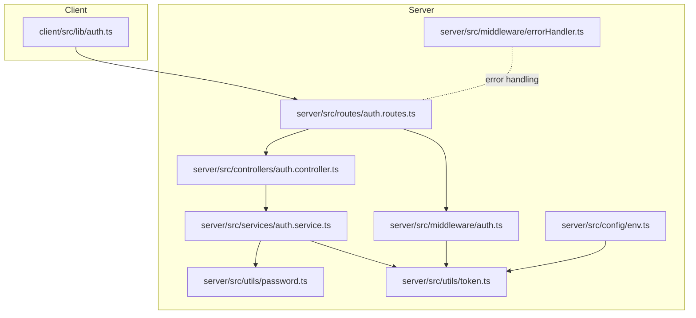
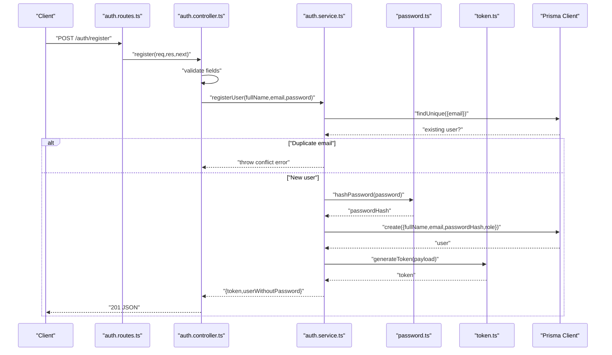
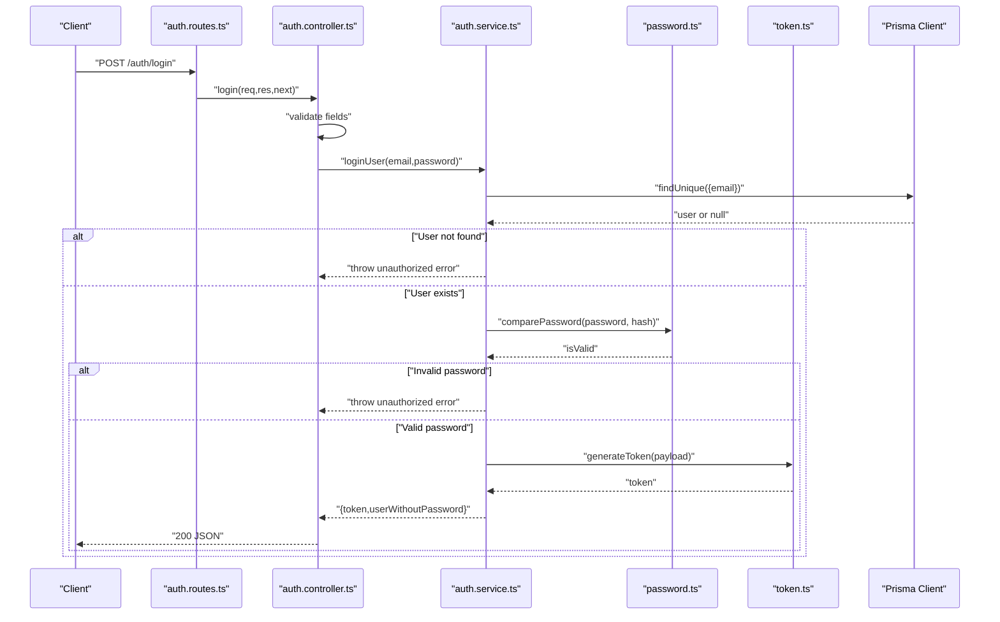
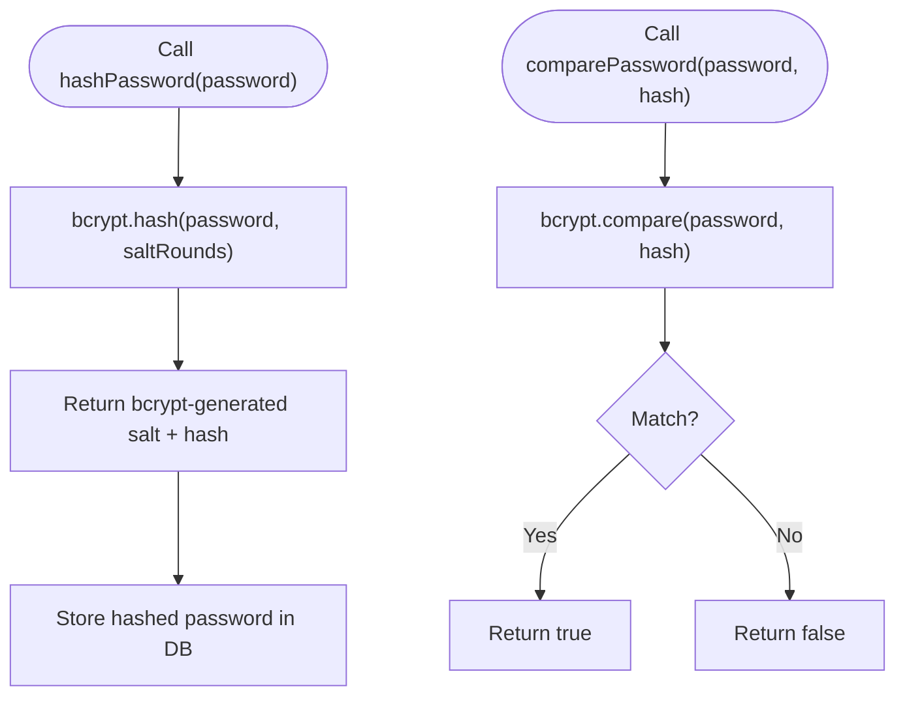
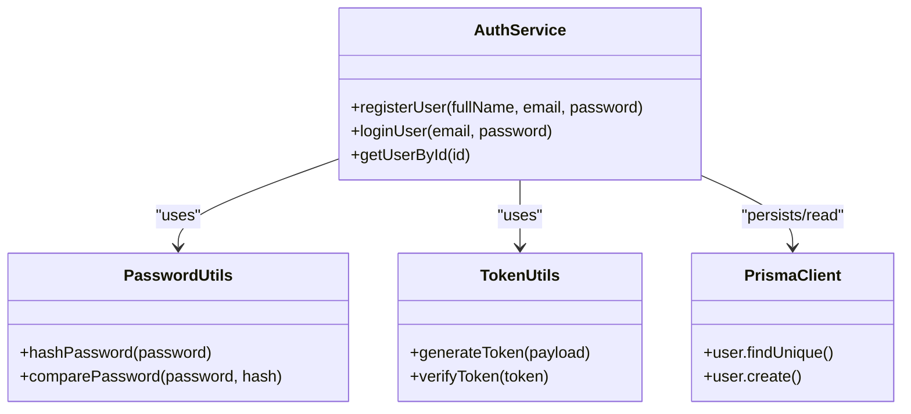
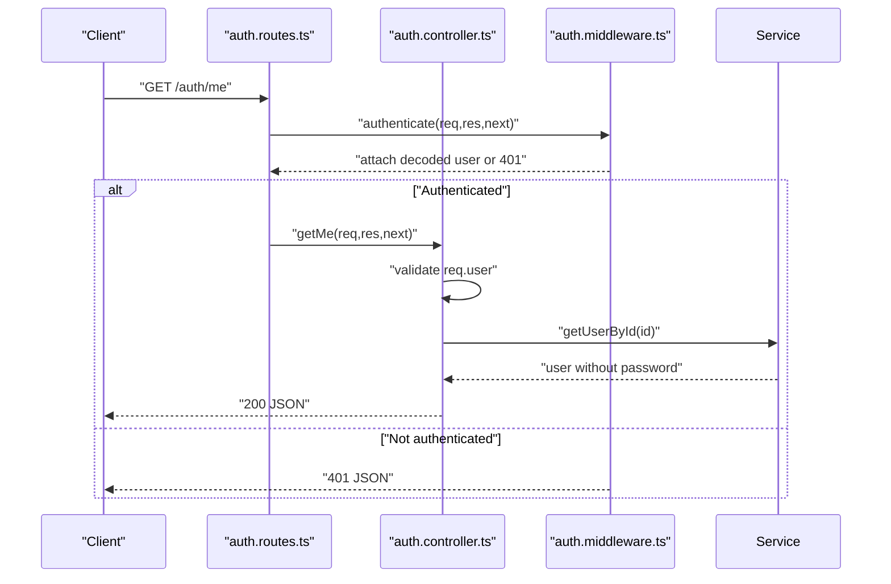
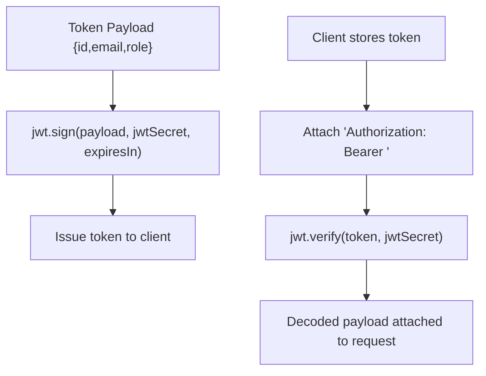
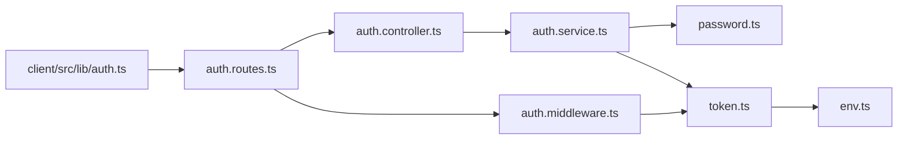

# Password Security

<cite>
**Referenced Files in This Document**
- [password.ts](file://server/src/utils/password.ts)
- [auth.service.ts](file://server/src/services/auth.service.ts)
- [auth.controller.ts](file://server/src/controllers/auth.controller.ts)
- [auth.routes.ts](file://server/src/routes/auth.routes.ts)
- [auth.middleware.ts](file://server/src/middleware/auth.ts)
- [token.utils.ts](file://server/src/utils/token.ts)
- [env.config.ts](file://server/src/config/env.ts)
- [auth.client.lib.ts](file://client/src/lib/auth.ts)
- [error.handler.ts](file://server/src/middleware/errorHandler.ts)
- [requirements.md](file://requirements.md)
</cite>

## Table of Contents
1. [Introduction](#introduction)
2. [Project Structure](#project-structure)
3. [Core Components](#core-components)
4. [Architecture Overview](#architecture-overview)
5. [Detailed Component Analysis](#detailed-component-analysis)
6. [Dependency Analysis](#dependency-analysis)
7. [Performance Considerations](#performance-considerations)
8. [Security Policies and Validation](#security-policies-and-validation)
9. [Troubleshooting Guide](#troubleshooting-guide)
10. [Conclusion](#conclusion)

## Introduction
This document provides comprehensive guidance for password security in the system, focusing on bcrypt-based password hashing, secure verification, and robust authentication controls. It explains how salts are generated, how hashes are computed and verified, and how the system enforces authentication and authorization. It also outlines recommended password strength policies, secure password change workflows, and account protection strategies such as rate limiting and lockout mechanisms. Practical examples illustrate password hashing during registration, verification during login, and secure password updates.

## Project Structure
Password security spans several layers:
- Utilities: bcrypt hashing and comparison utilities
- Services: user registration, login, and profile retrieval
- Controllers: request handling for registration, login, and protected profile access
- Routes: endpoint exposure for authentication
- Middleware: authentication guard and role-based authorization
- Tokens: JWT generation and verification
- Environment: secrets and configuration
- Client: token persistence and retrieval
- Requirements: documented non-functional security requirements

**Diagram sources**
- [auth.routes.ts:1-12](file://server/src/routes/auth.routes.ts#L1-L12)
- [auth.controller.ts:1-50](file://server/src/controllers/auth.controller.ts#L1-L50)
- [auth.service.ts:1-72](file://server/src/services/auth.service.ts#L1-L72)
- [password.ts:1-12](file://server/src/utils/password.ts#L1-L12)
- [token.utils.ts:1-17](file://server/src/utils/token.ts#L1-L17)
- [auth.middleware.ts:1-39](file://server/src/middleware/auth.ts#L1-L39)
- [env.config.ts:1-12](file://server/src/config/env.ts#L1-L12)
- [error.handler.ts:1-13](file://server/src/middleware/errorHandler.ts#L1-L13)
- [auth.client.lib.ts:1-27](file://client/src/lib/auth.ts#L1-L27)

**Section sources**
- [auth.routes.ts:1-12](file://server/src/routes/auth.routes.ts#L1-L12)
- [auth.controller.ts:1-50](file://server/src/controllers/auth.controller.ts#L1-L50)
- [auth.service.ts:1-72](file://server/src/services/auth.service.ts#L1-L72)
- [password.ts:1-12](file://server/src/utils/password.ts#L1-L12)
- [token.utils.ts:1-17](file://server/src/utils/token.ts#L1-L17)
- [auth.middleware.ts:1-39](file://server/src/middleware/auth.ts#L1-L39)
- [env.config.ts:1-12](file://server/src/config/env.ts#L1-L12)
- [auth.client.lib.ts:1-27](file://client/src/lib/auth.ts#L1-L27)
- [error.handler.ts:1-13](file://server/src/middleware/errorHandler.ts#L1-L13)

## Core Components
- Password hashing and verification utilities:
  - Hashing uses bcrypt with a fixed number of rounds for cost control.
  - Verification uses bcrypt’s constant-time comparison to mitigate timing attacks.
- Authentication service:
  - Registration checks for duplicate emails, hashes the password, persists the user, and issues a signed JWT.
  - Login validates credentials against stored hash and issues a JWT upon success.
- Controllers:
  - Enforce presence of required fields and delegate to services.
- Middleware:
  - Validates Authorization header and decodes JWT to attach user identity to requests.
- Token utilities and environment:
  - JWT payload includes user identity and role; secret is loaded from environment.
- Client-side token management:
  - Stores and retrieves JWT in local storage for session persistence.

**Section sources**
- [password.ts:1-12](file://server/src/utils/password.ts#L1-L12)
- [auth.service.ts:1-72](file://server/src/services/auth.service.ts#L1-L72)
- [auth.controller.ts:1-50](file://server/src/controllers/auth.controller.ts#L1-L50)
- [auth.middleware.ts:1-39](file://server/src/middleware/auth.ts#L1-L39)
- [token.utils.ts:1-17](file://server/src/utils/token.ts#L1-L17)
- [env.config.ts:1-12](file://server/src/config/env.ts#L1-L12)
- [auth.client.lib.ts:1-27](file://client/src/lib/auth.ts#L1-L27)

## Architecture Overview
The authentication flow integrates route handling, controller logic, service operations, and cryptographic utilities. The following sequence diagrams map the actual code paths for registration and login.

**Diagram sources**
- [auth.routes.ts:1-12](file://server/src/routes/auth.routes.ts#L1-L12)
- [auth.controller.ts:1-50](file://server/src/controllers/auth.controller.ts#L1-L50)
- [auth.service.ts:1-72](file://server/src/services/auth.service.ts#L1-L72)
- [password.ts:1-12](file://server/src/utils/password.ts#L1-L12)
- [token.utils.ts:1-17](file://server/src/utils/token.ts#L1-L17)

**Diagram sources**
- [auth.routes.ts:1-12](file://server/src/routes/auth.routes.ts#L1-L12)
- [auth.controller.ts:1-50](file://server/src/controllers/auth.controller.ts#L1-L50)
- [auth.service.ts:1-72](file://server/src/services/auth.service.ts#L1-L72)
- [password.ts:1-12](file://server/src/utils/password.ts#L1-L12)
- [token.utils.ts:1-17](file://server/src/utils/token.ts#L1-L17)

## Detailed Component Analysis

### Password Hashing Utility
- Salt generation: bcrypt generates a salt internally per hash operation; the configured cost factor determines computational work.
- Hash computation: Fixed cost factor ensures consistent security and performance trade-offs.
- Verification: Uses bcrypt’s constant-time compare to prevent timing attacks.

**Diagram sources**
- [password.ts:1-12](file://server/src/utils/password.ts#L1-L12)

**Section sources**
- [password.ts:1-12](file://server/src/utils/password.ts#L1-L12)

### Authentication Service
- Registration:
  - Checks for existing user by email.
  - Hashes the plaintext password.
  - Persists user record with role and password hash.
  - Generates and returns a signed JWT and sanitized user object.
- Login:
  - Retrieves user by email.
  - Compares provided password with stored hash.
  - On success, returns a signed JWT and sanitized user object.
- Profile retrieval:
  - Returns user without password hash.

**Diagram sources**
- [auth.service.ts:1-72](file://server/src/services/auth.service.ts#L1-L72)
- [password.ts:1-12](file://server/src/utils/password.ts#L1-L12)
- [token.utils.ts:1-17](file://server/src/utils/token.ts#L1-L17)

**Section sources**
- [auth.service.ts:1-72](file://server/src/services/auth.service.ts#L1-L72)

### Controllers and Routes
- Registration and login enforce presence of required fields and delegate to services.
- Protected profile endpoint requires authentication via middleware.

**Diagram sources**
- [auth.routes.ts:1-12](file://server/src/routes/auth.routes.ts#L1-L12)
- [auth.controller.ts:1-50](file://server/src/controllers/auth.controller.ts#L1-L50)
- [auth.middleware.ts:1-39](file://server/src/middleware/auth.ts#L1-L39)

**Section sources**
- [auth.controller.ts:1-50](file://server/src/controllers/auth.controller.ts#L1-L50)
- [auth.routes.ts:1-12](file://server/src/routes/auth.routes.ts#L1-L12)
- [auth.middleware.ts:1-39](file://server/src/middleware/auth.ts#L1-L39)

### Token Utilities and Environment
- JWT payload carries user identity and role.
- Secret key is loaded from environment variables.
- Token verification throws on invalid/expired tokens.

**Diagram sources**
- [token.utils.ts:1-17](file://server/src/utils/token.ts#L1-L17)
- [env.config.ts:1-12](file://server/src/config/env.ts#L1-L12)

**Section sources**
- [token.utils.ts:1-17](file://server/src/utils/token.ts#L1-L17)
- [env.config.ts:1-12](file://server/src/config/env.ts#L1-L12)

### Client-Side Token Management
- Stores and retrieves JWT from local storage.
- Provides an isAuthenticated helper for UI state.

**Section sources**
- [auth.client.lib.ts:1-27](file://client/src/lib/auth.ts#L1-L27)

## Dependency Analysis
The authentication subsystem exhibits low coupling and clear separation of concerns:
- Controllers depend on services.
- Services depend on utilities and the database client.
- Middleware depends on token utilities.
- Routes orchestrate controllers and apply middleware.
- Environment configuration supplies secrets.

**Diagram sources**
- [auth.routes.ts:1-12](file://server/src/routes/auth.routes.ts#L1-L12)
- [auth.controller.ts:1-50](file://server/src/controllers/auth.controller.ts#L1-L50)
- [auth.service.ts:1-72](file://server/src/services/auth.service.ts#L1-L72)
- [password.ts:1-12](file://server/src/utils/password.ts#L1-L12)
- [token.utils.ts:1-17](file://server/src/utils/token.ts#L1-L17)
- [auth.middleware.ts:1-39](file://server/src/middleware/auth.ts#L1-L39)
- [env.config.ts:1-12](file://server/src/config/env.ts#L1-L12)
- [auth.client.lib.ts:1-27](file://client/src/lib/auth.ts#L1-L27)

**Section sources**
- [auth.routes.ts:1-12](file://server/src/routes/auth.routes.ts#L1-L12)
- [auth.controller.ts:1-50](file://server/src/controllers/auth.controller.ts#L1-L50)
- [auth.service.ts:1-72](file://server/src/services/auth.service.ts#L1-L72)
- [password.ts:1-12](file://server/src/utils/password.ts#L1-L12)
- [token.utils.ts:1-17](file://server/src/utils/token.ts#L1-L17)
- [auth.middleware.ts:1-39](file://server/src/middleware/auth.ts#L1-L39)
- [env.config.ts:1-12](file://server/src/config/env.ts#L1-L12)
- [auth.client.lib.ts:1-27](file://client/src/lib/auth.ts#L1-L27)

## Performance Considerations
- bcrypt cost factor: The fixed number of rounds balances security and performance. Adjusting rounds increases CPU work and improves resistance to brute-force attacks but may increase latency under load.
- Constant-time comparison: bcrypt’s compare function mitigates timing attacks, reducing side-channel risks.
- Token lifetime: Short-lived tokens reduce exposure windows; consider refresh token strategies if needed.
- Database indexing: Ensure unique indexes on email to optimize lookup performance.

[No sources needed since this section provides general guidance]

## Security Policies and Validation
Recommended password strength and security policies (policy statements):
- Enforce minimum length (e.g., 12 characters).
- Require mixed-case letters, digits, and special characters.
- Prohibit commonly breached passwords and reuse of recent hashes.
- Enforce periodic password rotation (e.g., every 90 days).
- Implement temporary lockout after repeated failed attempts.
- Enforce rate limits on authentication endpoints.
- Log and monitor suspicious activities (failed attempts, new device logins).

These policies align with the documented requirement that “Passwords shall be encrypted before storage.”

**Section sources**
- [requirements.md:275-293](file://requirements.md#L275-L293)

## Troubleshooting Guide
Common issues and resolutions:
- Invalid email or password errors: Thrown on missing credentials, user not found, or mismatched password. Ensure clients send required fields and handle 401 responses.
- Access denied due to missing or invalid token: Verify Authorization header format and token validity.
- Duplicate email during registration: Ensure pre-checks or handle 409 conflicts gracefully.
- Internal errors: Centralized error handler returns generic messages; inspect logs for stack traces.

Operational checks:
- Confirm JWT secret is set in environment.
- Verify bcrypt cost factor is appropriate for deployment capacity.
- Ensure HTTPS is enforced to protect token transmission.

**Section sources**
- [auth.controller.ts:1-50](file://server/src/controllers/auth.controller.ts#L1-L50)
- [auth.service.ts:1-72](file://server/src/services/auth.service.ts#L1-L72)
- [auth.middleware.ts:1-39](file://server/src/middleware/auth.ts#L1-L39)
- [error.handler.ts:1-13](file://server/src/middleware/errorHandler.ts#L1-L13)
- [env.config.ts:1-12](file://server/src/config/env.ts#L1-L12)

## Conclusion
The system employs bcrypt for secure password hashing and constant-time verification, ensuring resistance to rainbow table and timing attacks. JWT-based authentication secures protected endpoints, while middleware enforces bearer token validation and role-based access. To further strengthen security, integrate recommended password policies, rate limiting, lockout mechanisms, and continuous monitoring aligned with the documented non-functional requirements.