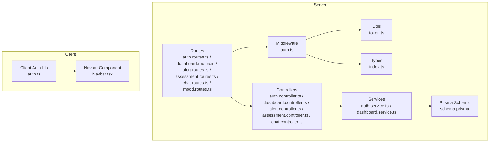
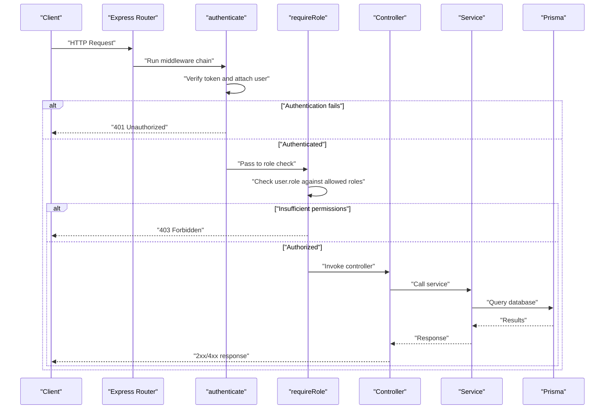
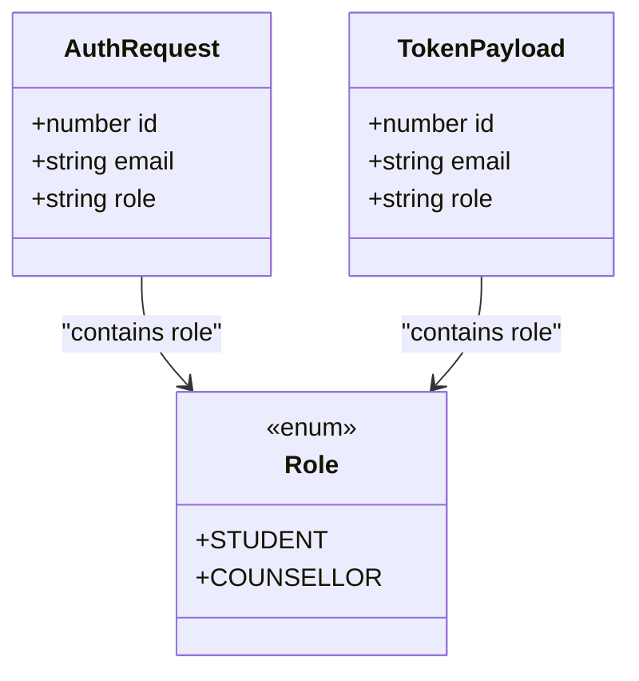
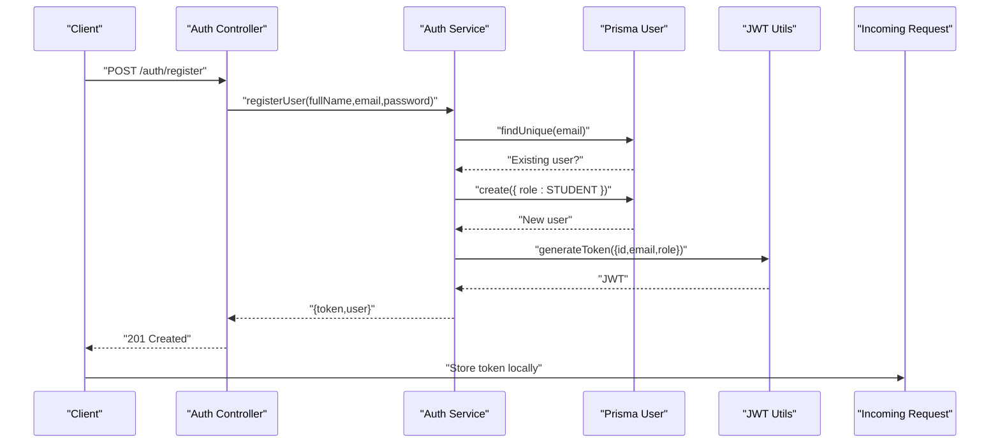
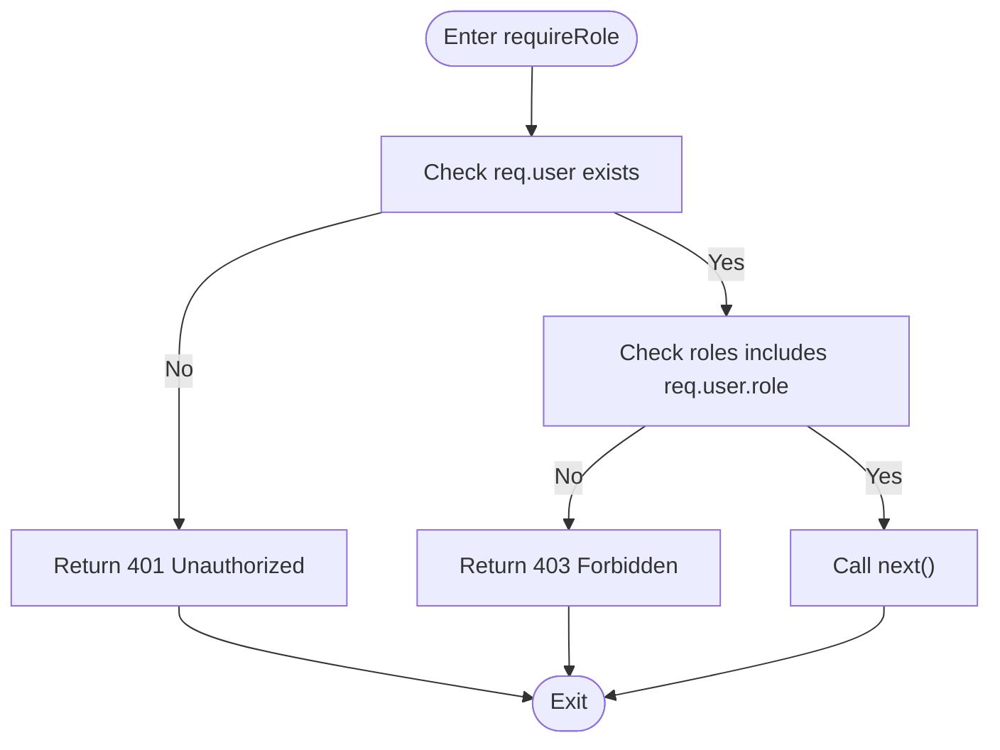
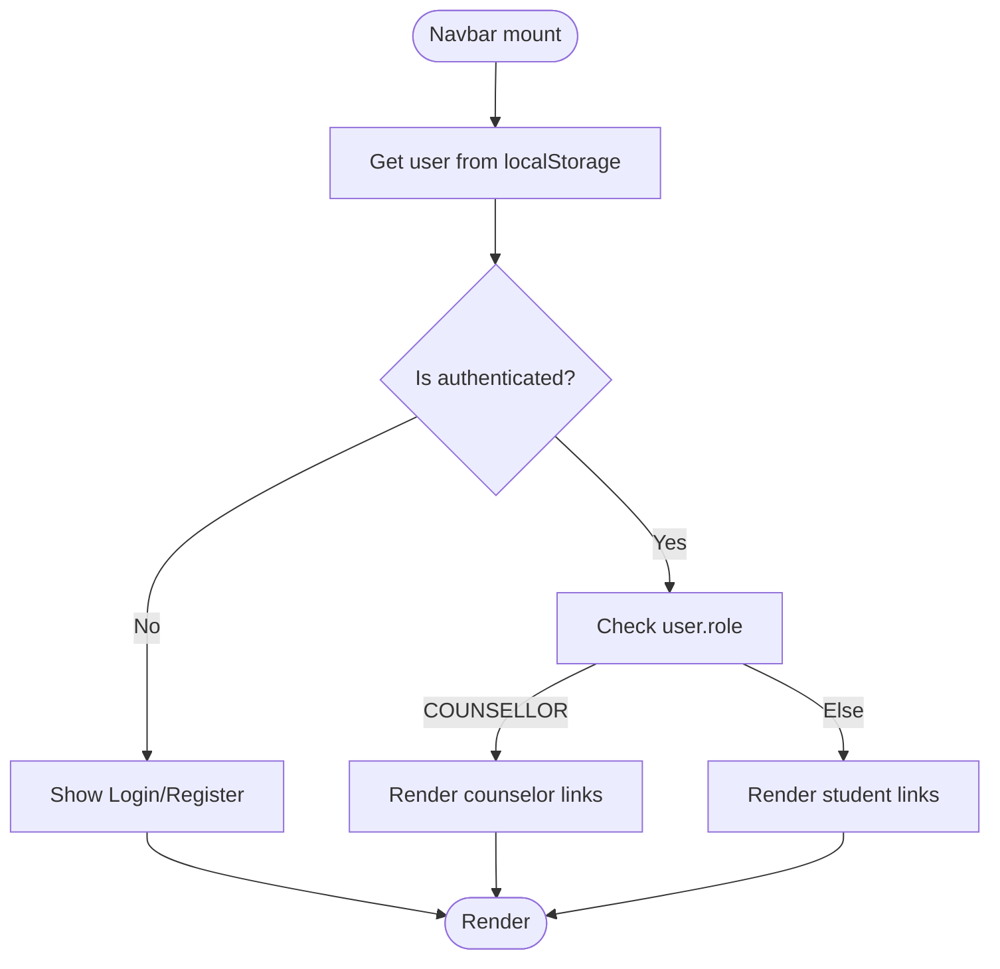
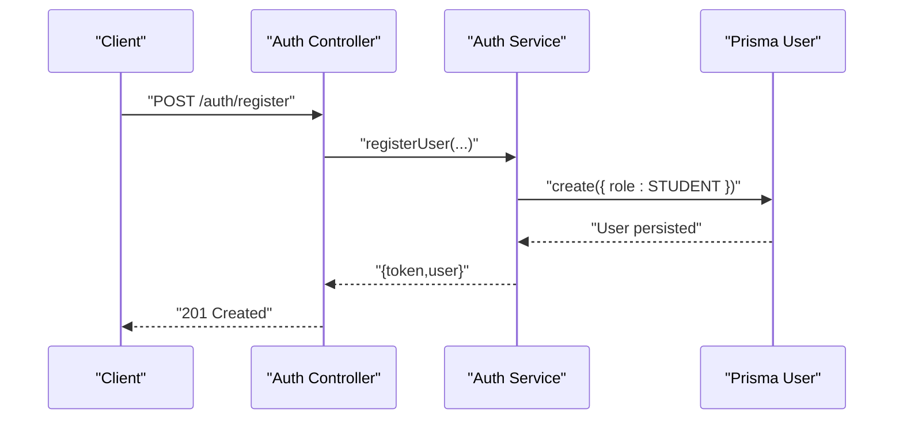
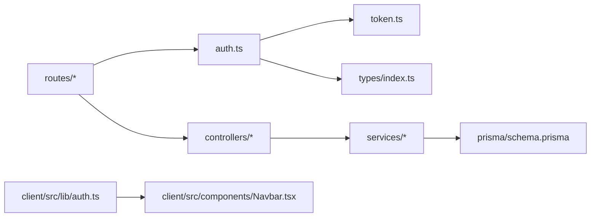
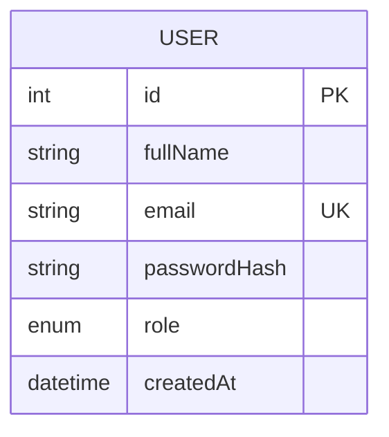

# Role-Based Access Control (RBAC)

<cite>
**Referenced Files in This Document**
- [auth.middleware.ts](file://server/src/middleware/auth.ts)
- [token.utils.ts](file://server/src/utils/token.ts)
- [types.index.ts](file://server/src/types/index.ts)
- [auth.controller.ts](file://server/src/controllers/auth.controller.ts)
- [auth.service.ts](file://server/src/services/auth.service.ts)
- [prisma.schema](file://prisma/schema.prisma)
- [auth.routes.ts](file://server/src/routes/auth.routes.ts)
- [dashboard.routes.ts](file://server/src/routes/dashboard.routes.ts)
- [alert.routes.ts](file://server/src/routes/alert.routes.ts)
- [assessment.routes.ts](file://server/src/routes/assessment.routes.ts)
- [chat.routes.ts](file://server/src/routes/chat.routes.ts)
- [mood.routes.ts](file://server/src/routes/mood.routes.ts)
- [dashboard.controller.ts](file://server/src/controllers/dashboard.controller.ts)
- [alert.controller.ts](file://server/src/controllers/alert.controller.ts)
- [assessment.controller.ts](file://server/src/controllers/assessment.controller.ts)
- [chat.controller.ts](file://server/src/controllers/chat.controller.ts)
- [dashboard.service.ts](file://server/src/services/dashboard.service.ts)
- [auth.client.lib.ts](file://client/src/lib/auth.ts)
- [navbar.component.tsx](file://client/src/components/Navbar.tsx)
</cite>

## Table of Contents
1. [Introduction](#introduction)
2. [Project Structure](#project-structure)
3. [Core Components](#core-components)
4. [Architecture Overview](#architecture-overview)
5. [Detailed Component Analysis](#detailed-component-analysis)
6. [Dependency Analysis](#dependency-analysis)
7. [Performance Considerations](#performance-considerations)
8. [Troubleshooting Guide](#troubleshooting-guide)
9. [Conclusion](#conclusion)
10. [Appendices](#appendices)

## Introduction
This document explains the Role-Based Access Control (RBAC) implementation in the application. It defines the STUDENT and COUNSELLOR roles, documents the permission matrix, and details how access control is enforced via middleware and route protection. It also covers role assignment during registration, role updates, privilege escalation controls, and practical examples for protecting endpoints, controlling frontend menu visibility, and performing dynamic permission checks. Security considerations for preventing role manipulation and ensuring robust authorization checks are addressed throughout.

## Project Structure
The RBAC implementation spans backend middleware, controllers, routes, services, and Prisma models, with complementary frontend utilities for token and user state management.

**Diagram sources**
- [auth.middleware.ts:1-39](file://server/src/middleware/auth.ts#L1-L39)
- [token.utils.ts:1-17](file://server/src/utils/token.ts#L1-L17)
- [types.index.ts:1-12](file://server/src/types/index.ts#L1-L12)
- [auth.routes.ts:1-12](file://server/src/routes/auth.routes.ts#L1-L12)
- [dashboard.routes.ts:1-11](file://server/src/routes/dashboard.routes.ts#L1-L11)
- [alert.routes.ts:1-15](file://server/src/routes/alert.routes.ts#L1-L15)
- [assessment.routes.ts:1-12](file://server/src/routes/assessment.routes.ts#L1-L12)
- [chat.routes.ts:1-13](file://server/src/routes/chat.routes.ts#L1-L13)
- [mood.routes.ts:1-12](file://server/src/routes/mood.routes.ts#L1-L12)
- [auth.controller.ts:1-50](file://server/src/controllers/auth.controller.ts#L1-L50)
- [dashboard.controller.ts:1-13](file://server/src/controllers/dashboard.controller.ts#L1-L13)
- [alert.controller.ts:1-70](file://server/src/controllers/alert.controller.ts#L1-L70)
- [assessment.controller.ts:1-74](file://server/src/controllers/assessment.controller.ts#L1-L74)
- [chat.controller.ts:1-69](file://server/src/controllers/chat.controller.ts#L1-L69)
- [auth.service.ts:1-72](file://server/src/services/auth.service.ts#L1-L72)
- [dashboard.service.ts:1-19](file://server/src/services/dashboard.service.ts#L1-L19)
- [prisma.schema:1-134](file://prisma/schema.prisma#L1-L134)
- [auth.client.lib.ts:1-27](file://client/src/lib/auth.ts#L1-L27)
- [navbar.component.tsx:1-96](file://client/src/components/Navbar.tsx#L1-L96)

**Section sources**
- [auth.middleware.ts:1-39](file://server/src/middleware/auth.ts#L1-L39)
- [token.utils.ts:1-17](file://server/src/utils/token.ts#L1-L17)
- [types.index.ts:1-12](file://server/src/types/index.ts#L1-L12)
- [prisma.schema:10-13](file://prisma/schema.prisma#L10-L13)
- [auth.routes.ts:1-12](file://server/src/routes/auth.routes.ts#L1-L12)
- [dashboard.routes.ts:1-11](file://server/src/routes/dashboard.routes.ts#L1-L11)
- [alert.routes.ts:1-15](file://server/src/routes/alert.routes.ts#L1-L15)
- [assessment.routes.ts:1-12](file://server/src/routes/assessment.routes.ts#L1-L12)
- [chat.routes.ts:1-13](file://server/src/routes/chat.routes.ts#L1-L13)
- [mood.routes.ts:1-12](file://server/src/routes/mood.routes.ts#L1-L12)
- [auth.controller.ts:1-50](file://server/src/controllers/auth.controller.ts#L1-L50)
- [auth.service.ts:1-72](file://server/src/services/auth.service.ts#L1-L72)
- [dashboard.controller.ts:1-13](file://server/src/controllers/dashboard.controller.ts#L1-L13)
- [alert.controller.ts:1-70](file://server/src/controllers/alert.controller.ts#L1-L70)
- [assessment.controller.ts:1-74](file://server/src/controllers/assessment.controller.ts#L1-L74)
- [chat.controller.ts:1-69](file://server/src/controllers/chat.controller.ts#L1-L69)
- [dashboard.service.ts:1-19](file://server/src/services/dashboard.service.ts#L1-L19)
- [auth.client.lib.ts:1-27](file://client/src/lib/auth.ts#L1-L27)
- [navbar.component.tsx:1-96](file://client/src/components/Navbar.tsx#L1-L96)

## Core Components
- Roles and Token Payload
  - Roles are defined as an enum with STUDENT and COUNSELLOR.
  - Tokens carry id, email, and role for downstream authorization decisions.
- Authentication Middleware
  - Extracts Authorization header, verifies JWT, attaches user payload to request.
- Role-Based Authorization Middleware
  - Validates that the authenticated user’s role matches one of the allowed roles.
- Route Protection
  - Routes apply authenticate followed by requireRole where appropriate.
- Registration and Role Assignment
  - New users are assigned the STUDENT role by default.
- Frontend Role Visibility
  - Client reads stored user role to conditionally render navigation links.

**Section sources**
- [prisma.schema:10-13](file://prisma/schema.prisma#L10-L13)
- [token.utils.ts:4-16](file://server/src/utils/token.ts#L4-L16)
- [auth.middleware.ts:5-38](file://server/src/middleware/auth.ts#L5-L38)
- [auth.routes.ts:7-9](file://server/src/routes/auth.routes.ts#L7-L9)
- [dashboard.routes.ts:7-8](file://server/src/routes/dashboard.routes.ts#L7-L8)
- [alert.routes.ts:7-12](file://server/src/routes/alert.routes.ts#L7-L12)
- [auth.service.ts:15-22](file://server/src/services/auth.service.ts#L15-L22)
- [auth.client.lib.ts:14-22](file://client/src/lib/auth.ts#L14-L22)
- [navbar.component.tsx:27-60](file://client/src/components/Navbar.tsx#L27-L60)

## Architecture Overview
The RBAC architecture enforces authorization at two layers:
- Transport Layer: authenticate middleware validates tokens and injects user identity.
- Application Layer: requireRole middleware enforces role-based access to protected routes.

**Diagram sources**
- [auth.middleware.ts:5-38](file://server/src/middleware/auth.ts#L5-L38)
- [auth.routes.ts:7-9](file://server/src/routes/auth.routes.ts#L7-L9)
- [dashboard.routes.ts:7-8](file://server/src/routes/dashboard.routes.ts#L7-L8)
- [alert.routes.ts:7-12](file://server/src/routes/alert.routes.ts#L7-L12)
- [auth.controller.ts:37-49](file://server/src/controllers/auth.controller.ts#L37-L49)
- [auth.service.ts:61-71](file://server/src/services/auth.service.ts#L61-L71)
- [prisma.schema:47-61](file://prisma/schema.prisma#L47-L61)

## Detailed Component Analysis

### Role Definitions and Permission Matrix
- Roles
  - STUDENT: Can access self-service endpoints (assessment, mood, chat).
  - COUNSELLOR: Can access counselor-only endpoints (alerts, dashboard stats).
- Permission Matrix (high level)
  - STUDENT can call: assessment routes, mood routes, chat routes, auth/me.
  - COUNSELLOR can call: alert routes, dashboard stats route, plus any STUDENT endpoints if exposed.
  - Administrative privileges (e.g., changing roles) are not present in current routes.

**Diagram sources**
- [prisma.schema:10-13](file://prisma/schema.prisma#L10-L13)
- [types.index.ts:3-11](file://server/src/types/index.ts#L3-L11)
- [token.utils.ts:4-8](file://server/src/utils/token.ts#L4-L8)

**Section sources**
- [prisma.schema:10-13](file://prisma/schema.prisma#L10-L13)
- [types.index.ts:3-11](file://server/src/types/index.ts#L3-L11)
- [token.utils.ts:4-8](file://server/src/utils/token.ts#L4-L8)

### Authentication and Token Flow
- Token generation includes role claim.
- authenticate middleware decodes and attaches user to request.
- Controllers rely on presence of req.user for authorization decisions.

**Diagram sources**
- [auth.controller.ts:5-19](file://server/src/controllers/auth.controller.ts#L5-L19)
- [auth.service.ts:5-33](file://server/src/services/auth.service.ts#L5-L33)
- [prisma.schema:47-58](file://prisma/schema.prisma#L47-L58)
- [token.utils.ts:10-16](file://server/src/utils/token.ts#L10-L16)

**Section sources**
- [auth.controller.ts:5-19](file://server/src/controllers/auth.controller.ts#L5-L19)
- [auth.service.ts:5-33](file://server/src/services/auth.service.ts#L5-L33)
- [prisma.schema:52-52](file://prisma/schema.prisma#L52-L52)
- [token.utils.ts:10-16](file://server/src/utils/token.ts#L10-L16)

### requireRole Middleware Implementation
- Enforces role-based access by checking req.user.role against allowed roles.
- Returns 401 if unauthenticated, 403 if insufficient permissions.

**Diagram sources**
- [auth.middleware.ts:24-38](file://server/src/middleware/auth.ts#L24-L38)

**Section sources**
- [auth.middleware.ts:24-38](file://server/src/middleware/auth.ts#L24-L38)

### Route Protection Strategies
- Public routes: /auth/register, /auth/login.
- Self-service routes (authenticated only): assessment, mood, chat.
- Counselor-only routes: dashboard stats, alerts.

Examples:
- Dashboard stats: protected by authenticate + requireRole('COUNSELLOR').
- Alerts: protected by authenticate + requireRole('COUNSELLOR').
- Assessment, mood, chat: protected by authenticate only.

**Section sources**
- [auth.routes.ts:7-9](file://server/src/routes/auth.routes.ts#L7-L9)
- [assessment.routes.ts:7-9](file://server/src/routes/assessment.routes.ts#L7-L9)
- [mood.routes.ts:7-9](file://server/src/routes/mood.routes.ts#L7-L9)
- [chat.routes.ts:7-10](file://server/src/routes/chat.routes.ts#L7-L10)
- [dashboard.routes.ts:7-8](file://server/src/routes/dashboard.routes.ts#L7-L8)
- [alert.routes.ts:7-12](file://server/src/routes/alert.routes.ts#L7-L12)

### Practical Examples: Protecting API Endpoints
- Counselor-only endpoint
  - Apply authenticate followed by requireRole('COUNSELLOR') before controller.
  - Example pattern: dashboard routes.
- Student self-service endpoint
  - Apply authenticate before controller.
  - Example pattern: assessment, mood, chat routes.
- Mixed access (student can view own data, counselor can view all)
  - Controllers enforce ownership checks or cross-role logic as needed.

**Section sources**
- [dashboard.routes.ts:7-8](file://server/src/routes/dashboard.routes.ts#L7-L8)
- [alert.routes.ts:7-12](file://server/src/routes/alert.routes.ts#L7-L12)
- [assessment.routes.ts:7-9](file://server/src/routes/assessment.routes.ts#L7-L9)
- [mood.routes.ts:7-9](file://server/src/routes/mood.routes.ts#L7-L9)
- [chat.routes.ts:7-10](file://server/src/routes/chat.routes.ts#L7-L10)

### Role-Based Menu Visibility in the Frontend
- Client stores token and user profile in localStorage.
- Navbar reads user role and renders counselor-only links for COUNSELLOR.

**Diagram sources**
- [auth.client.lib.ts:14-22](file://client/src/lib/auth.ts#L14-L22)
- [navbar.component.tsx:13-62](file://client/src/components/Navbar.tsx#L13-L62)

**Section sources**
- [auth.client.lib.ts:14-22](file://client/src/lib/auth.ts#L14-L22)
- [navbar.component.tsx:27-60](file://client/src/components/Navbar.tsx#L27-L60)

### Dynamic Permission Checking
- Use requireRole middleware to gate endpoints dynamically.
- Combine with controller-level checks for ownership or data visibility (e.g., fetch only records belonging to the authenticated user).

**Section sources**
- [auth.middleware.ts:24-38](file://server/src/middleware/auth.ts#L24-L38)
- [assessment.controller.ts:63-67](file://server/src/controllers/assessment.controller.ts#L63-L67)
- [chat.controller.ts:63-64](file://server/src/controllers/chat.controller.ts#L63-L64)

### Role Assignment During Registration and Updates
- Registration assigns STUDENT role by default.
- Privilege escalation (promoting STUDENT to COUNSELLOR) is not exposed in current routes/services.

**Diagram sources**
- [auth.controller.ts:5-19](file://server/src/controllers/auth.controller.ts#L5-L19)
- [auth.service.ts:15-22](file://server/src/services/auth.service.ts#L15-L22)
- [prisma.schema:52-52](file://prisma/schema.prisma#L52-L52)

**Section sources**
- [auth.service.ts:15-22](file://server/src/services/auth.service.ts#L15-L22)
- [prisma.schema:52-52](file://prisma/schema.prisma#L52-L52)

### Privilege Escalation Controls
- Current schema and routes do not expose endpoints to modify user roles.
- To implement escalation safely, introduce admin-only endpoints with strong authentication and audit logging.

[No sources needed since this section provides general guidance]

### Common Access Control Scenarios
- Counselor-only endpoints
  - Use requireRole('COUNSELLOR') on routes like dashboard stats and alerts.
- Student self-service areas
  - Use authenticate on routes like assessment, mood, chat; implement ownership checks in controllers.
- Administrative privileges
  - Not present in current codebase; adding such features requires careful design and least-privilege enforcement.

**Section sources**
- [dashboard.routes.ts:7-8](file://server/src/routes/dashboard.routes.ts#L7-L8)
- [alert.routes.ts:7-12](file://server/src/routes/alert.routes.ts#L7-L12)
- [assessment.routes.ts:7-9](file://server/src/routes/assessment.routes.ts#L7-L9)
- [mood.routes.ts:7-9](file://server/src/routes/mood.routes.ts#L7-L9)
- [chat.routes.ts:7-10](file://server/src/routes/chat.routes.ts#L7-L10)

## Dependency Analysis
- Middleware depends on token utilities and type definitions.
- Routes depend on middleware and controllers.
- Controllers depend on services; services depend on Prisma models.
- Frontend depends on client auth utilities for token and user state.

**Diagram sources**
- [auth.middleware.ts:1-39](file://server/src/middleware/auth.ts#L1-L39)
- [token.utils.ts:1-17](file://server/src/utils/token.ts#L1-L17)
- [types.index.ts:1-12](file://server/src/types/index.ts#L1-L12)
- [auth.routes.ts:1-12](file://server/src/routes/auth.routes.ts#L1-L12)
- [dashboard.routes.ts:1-11](file://server/src/routes/dashboard.routes.ts#L1-L11)
- [alert.routes.ts:1-15](file://server/src/routes/alert.routes.ts#L1-L15)
- [assessment.routes.ts:1-12](file://server/src/routes/assessment.routes.ts#L1-L12)
- [chat.routes.ts:1-13](file://server/src/routes/chat.routes.ts#L1-L13)
- [mood.routes.ts:1-12](file://server/src/routes/mood.routes.ts#L1-L12)
- [auth.controller.ts:1-50](file://server/src/controllers/auth.controller.ts#L1-L50)
- [dashboard.controller.ts:1-13](file://server/src/controllers/dashboard.controller.ts#L1-L13)
- [alert.controller.ts:1-70](file://server/src/controllers/alert.controller.ts#L1-L70)
- [assessment.controller.ts:1-74](file://server/src/controllers/assessment.controller.ts#L1-L74)
- [chat.controller.ts:1-69](file://server/src/controllers/chat.controller.ts#L1-L69)
- [auth.service.ts:1-72](file://server/src/services/auth.service.ts#L1-L72)
- [dashboard.service.ts:1-19](file://server/src/services/dashboard.service.ts#L1-L19)
- [prisma.schema:1-134](file://prisma/schema.prisma#L1-L134)
- [auth.client.lib.ts:1-27](file://client/src/lib/auth.ts#L1-L27)
- [navbar.component.tsx:1-96](file://client/src/components/Navbar.tsx#L1-L96)

**Section sources**
- [auth.middleware.ts:1-39](file://server/src/middleware/auth.ts#L1-L39)
- [token.utils.ts:1-17](file://server/src/utils/token.ts#L1-L17)
- [types.index.ts:1-12](file://server/src/types/index.ts#L1-L12)
- [prisma.schema:1-134](file://prisma/schema.prisma#L1-L134)
- [auth.client.lib.ts:1-27](file://client/src/lib/auth.ts#L1-L27)
- [navbar.component.tsx:1-96](file://client/src/components/Navbar.tsx#L1-L96)

## Performance Considerations
- Token verification is lightweight; keep middleware order minimal to avoid redundant checks.
- Prefer early exits in middleware to reduce downstream work.
- Cache frequently accessed user roles only if session state is managed centrally.

[No sources needed since this section provides general guidance]

## Troubleshooting Guide
- 401 Unauthorized
  - Missing or malformed Authorization header.
  - Expired or invalid JWT.
- 403 Forbidden
  - Authenticated but role not permitted for the endpoint.
- Endpoint still accessible to wrong role
  - Verify route applies authenticate followed by requireRole with correct role.
- Frontend shows wrong menu
  - Confirm user role is stored and read correctly from localStorage.

**Section sources**
- [auth.middleware.ts:8-21](file://server/src/middleware/auth.ts#L8-L21)
- [auth.middleware.ts:31-34](file://server/src/middleware/auth.ts#L31-L34)
- [auth.routes.ts:7-9](file://server/src/routes/auth.routes.ts#L7-L9)
- [dashboard.routes.ts:7-8](file://server/src/routes/dashboard.routes.ts#L7-L8)
- [alert.routes.ts:7-12](file://server/src/routes/alert.routes.ts#L7-L12)
- [auth.client.lib.ts:14-22](file://client/src/lib/auth.ts#L14-L22)
- [navbar.component.tsx:27-60](file://client/src/components/Navbar.tsx#L27-L60)

## Conclusion
The application implements a clear RBAC model with STUDENT and COUNSELLOR roles, enforced by middleware and route protection. Registration defaults users to STUDENT, while counselor-only endpoints are guarded by requireRole. Frontend visibility aligns with user roles. To strengthen the system, consider adding explicit admin endpoints for role changes with strict controls, audit logs, and consistent authorization checks across all controllers.

## Appendices

### Appendix A: Data Model for Users and Roles

**Diagram sources**
- [prisma.schema:47-61](file://prisma/schema.prisma#L47-L61)

**Section sources**
- [prisma.schema:47-61](file://prisma/schema.prisma#L47-L61)

### Appendix B: Sample Controller-Level Ownership Checks
- Assessment retrieval by ID should verify user.id matches assessment.userId.
- Chat message retrieval should verify user.id matches conversation.userId.

**Section sources**
- [assessment.controller.ts:63-67](file://server/src/controllers/assessment.controller.ts#L63-L67)
- [chat.controller.ts:63-64](file://server/src/controllers/chat.controller.ts#L63-L64)