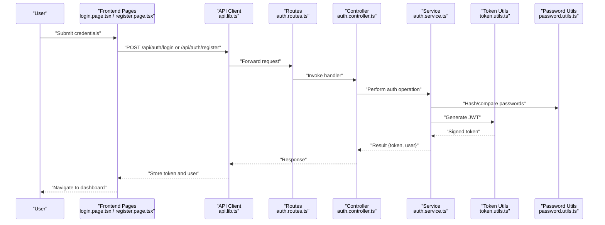
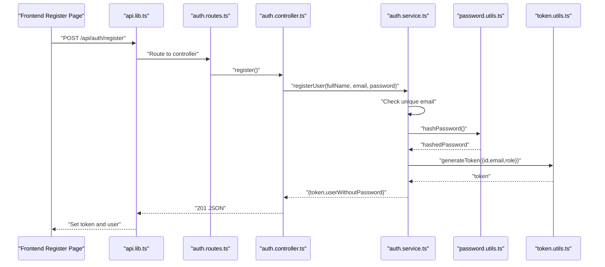
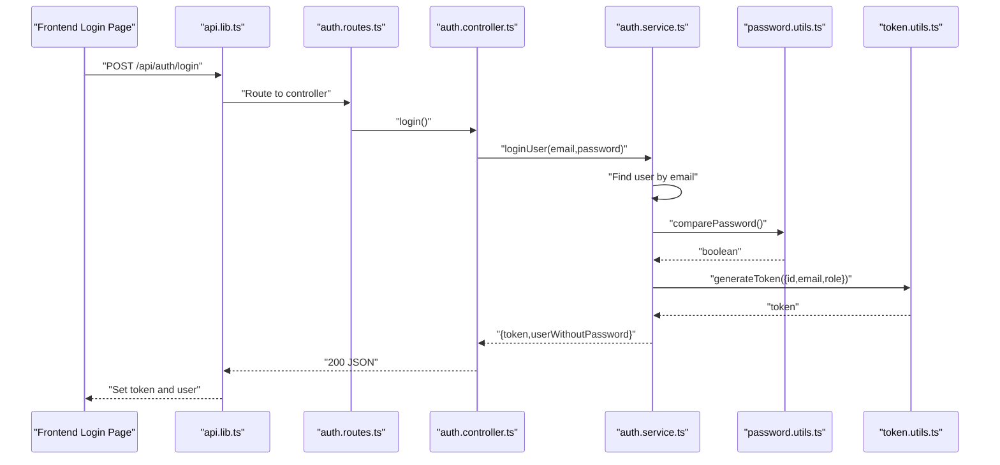
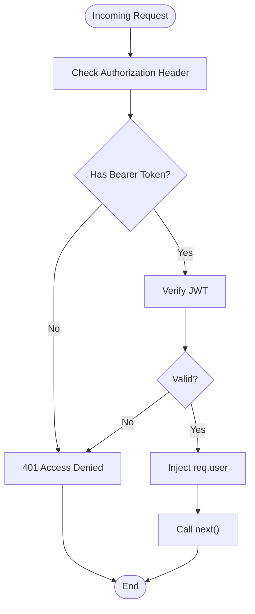
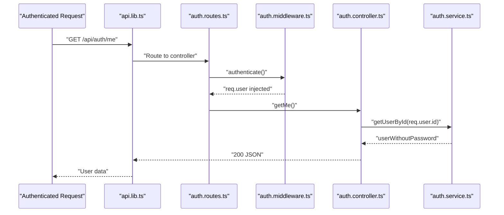
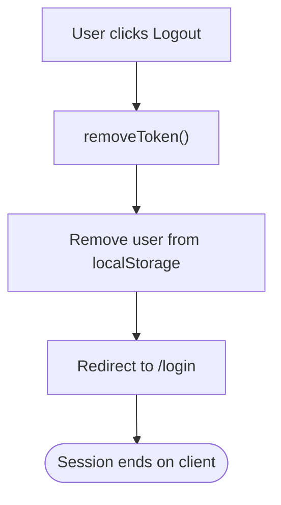
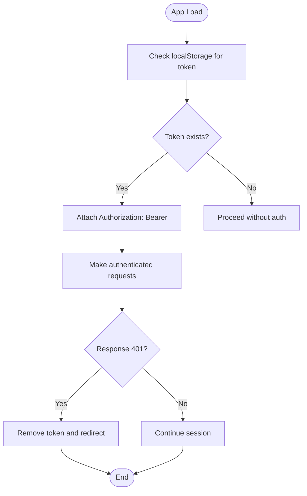
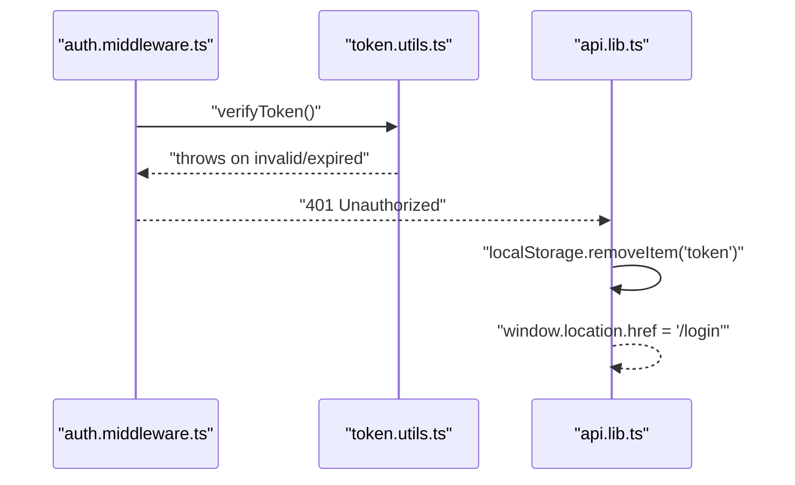
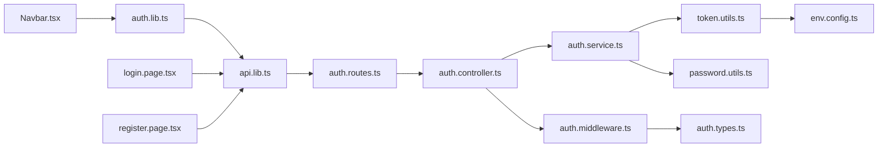

# Session Management

<cite>
**Referenced Files in This Document**
- [auth.controller.ts](file://server/src/controllers/auth.controller.ts)
- [auth.service.ts](file://server/src/services/auth.service.ts)
- [auth.middleware.ts](file://server/src/middleware/auth.ts)
- [token.utils.ts](file://server/src/utils/token.ts)
- [password.utils.ts](file://server/src/utils/password.ts)
- [auth.types.ts](file://server/src/types/index.ts)
- [env.config.ts](file://server/src/config/env.ts)
- [auth.routes.ts](file://server/src/routes/auth.routes.ts)
- [error.handler.ts](file://server/src/middleware/errorHandler.ts)
- [api.lib.ts](file://client/src/lib/api.ts)
- [auth.lib.ts](file://client/src/lib/auth.ts)
- [login.page.tsx](file://client/src/app/login/page.tsx)
- [register.page.tsx](file://client/src/app/register/page.tsx)
- [Navbar.tsx](file://client/src/components/Navbar.tsx)
</cite>

## Table of Contents
1. [Introduction](#introduction)
2. [Project Structure](#project-structure)
3. [Core Components](#core-components)
4. [Architecture Overview](#architecture-overview)
5. [Detailed Component Analysis](#detailed-component-analysis)
6. [Dependency Analysis](#dependency-analysis)
7. [Performance Considerations](#performance-considerations)
8. [Security Measures](#security-measures)
9. [Practical Examples](#practical-examples)
10. [Troubleshooting Guide](#troubleshooting-guide)
11. [Conclusion](#conclusion)

## Introduction
This document provides comprehensive coverage of session management and authentication flow in the application. It documents the complete lifecycle from user registration and login validation to session establishment and logout procedures. It also explains the authentication middleware, request preprocessing, and user context injection. Additional topics include session persistence strategies, automatic logout on token expiration, concurrent session handling, CSRF protection, secure cookie settings, session fixation prevention, token refresh strategies, multi-device access, and session hijacking prevention techniques.

## Project Structure
The authentication system spans both the backend (Express server) and the frontend (Next.js client):
- Backend: Controllers, Services, Middleware, Utilities, Routes, and Configuration
- Frontend: Authentication utilities, API client, and UI pages/components

```mermaid
graph TB
subgraph "Client"
A["login.page.tsx"]
B["register.page.tsx"]
C["Navbar.tsx"]
D["api.lib.ts"]
E["auth.lib.ts"]
end
subgraph "Server"
F["auth.routes.ts"]
G["auth.controller.ts"]
H["auth.service.ts"]
I["auth.middleware.ts"]
J["token.utils.ts"]
K["password.utils.ts"]
L["auth.types.ts"]
M["env.config.ts"]
N["error.handler.ts"]
end
A --> D
B --> D
C --> E
D --> F
F --> G
G --> H
H --> J
H --> K
G --> I
I --> L
J --> M
H --> N
```

**Diagram sources**
- [login.page.tsx:1-108](file://client/src/app/login/page.tsx#L1-L108)
- [register.page.tsx:1-120](file://client/src/app/register/page.tsx#L1-L120)
- [Navbar.tsx:1-96](file://client/src/components/Navbar.tsx#L1-L96)
- [api.lib.ts:1-36](file://client/src/lib/api.ts#L1-L36)
- [auth.lib.ts:1-27](file://client/src/lib/auth.ts#L1-L27)
- [auth.routes.ts:1-12](file://server/src/routes/auth.routes.ts#L1-L12)
- [auth.controller.ts:1-50](file://server/src/controllers/auth.controller.ts#L1-L50)
- [auth.service.ts:1-72](file://server/src/services/auth.service.ts#L1-L72)
- [auth.middleware.ts:1-39](file://server/src/middleware/auth.ts#L1-L39)
- [token.utils.ts:1-17](file://server/src/utils/token.ts#L1-L17)
- [password.utils.ts:1-12](file://server/src/utils/password.ts#L1-L12)
- [auth.types.ts:1-12](file://server/src/types/index.ts#L1-L12)
- [env.config.ts:1-12](file://server/src/config/env.ts#L1-L12)
- [error.handler.ts:1-13](file://server/src/middleware/errorHandler.ts#L1-L13)

**Section sources**
- [auth.routes.ts:1-12](file://server/src/routes/auth.routes.ts#L1-L12)
- [auth.controller.ts:1-50](file://server/src/controllers/auth.controller.ts#L1-L50)
- [auth.service.ts:1-72](file://server/src/services/auth.service.ts#L1-L72)
- [auth.middleware.ts:1-39](file://server/src/middleware/auth.ts#L1-L39)
- [token.utils.ts:1-17](file://server/src/utils/token.ts#L1-L17)
- [password.utils.ts:1-12](file://server/src/utils/password.ts#L1-L12)
- [auth.types.ts:1-12](file://server/src/types/index.ts#L1-L12)
- [env.config.ts:1-12](file://server/src/config/env.ts#L1-L12)
- [error.handler.ts:1-13](file://server/src/middleware/errorHandler.ts#L1-L13)
- [api.lib.ts:1-36](file://client/src/lib/api.ts#L1-L36)
- [auth.lib.ts:1-27](file://client/src/lib/auth.ts#L1-L27)
- [login.page.tsx:1-108](file://client/src/app/login/page.tsx#L1-L108)
- [register.page.tsx:1-120](file://client/src/app/register/page.tsx#L1-L120)
- [Navbar.tsx:1-96](file://client/src/components/Navbar.tsx#L1-L96)

## Core Components
- Authentication controller: Handles registration, login, and fetching current user
- Authentication service: Manages user persistence, password hashing, and JWT generation/verification
- Authentication middleware: Validates bearer tokens and injects user context
- Token utilities: JWT signing and verification with secret configuration
- Password utilities: Bcrypt-based hashing and comparison
- Types: Strong typing for user payload and Express request extension
- Environment configuration: JWT secret and service URLs
- Routes: Public endpoints for auth and protected endpoint for profile retrieval
- Error handler: Centralized error response formatting
- Client-side auth utilities: Local storage token and user management
- Client-side API client: Automatic Authorization header injection and 401 handling
- UI pages/components: Login, registration, and navigation with logout

**Section sources**
- [auth.controller.ts:1-50](file://server/src/controllers/auth.controller.ts#L1-L50)
- [auth.service.ts:1-72](file://server/src/services/auth.service.ts#L1-L72)
- [auth.middleware.ts:1-39](file://server/src/middleware/auth.ts#L1-L39)
- [token.utils.ts:1-17](file://server/src/utils/token.ts#L1-L17)
- [password.utils.ts:1-12](file://server/src/utils/password.ts#L1-L12)
- [auth.types.ts:1-12](file://server/src/types/index.ts#L1-L12)
- [env.config.ts:1-12](file://server/src/config/env.ts#L1-L12)
- [auth.routes.ts:1-12](file://server/src/routes/auth.routes.ts#L1-L12)
- [error.handler.ts:1-13](file://server/src/middleware/errorHandler.ts#L1-L13)
- [api.lib.ts:1-36](file://client/src/lib/api.ts#L1-L36)
- [auth.lib.ts:1-27](file://client/src/lib/auth.ts#L1-L27)
- [login.page.tsx:1-108](file://client/src/app/login/page.tsx#L1-L108)
- [register.page.tsx:1-120](file://client/src/app/register/page.tsx#L1-L120)
- [Navbar.tsx:1-96](file://client/src/components/Navbar.tsx#L1-L96)

## Architecture Overview
The authentication architecture follows a token-based session model:
- Clients send credentials to the backend to obtain a signed JWT
- Subsequent requests include the JWT in the Authorization header
- Middleware verifies the token and injects user context into the request
- Protected routes enforce authentication and optional role-based authorization
- Client stores the token and user profile in local storage and attaches the token to outgoing requests

**Diagram sources**
- [login.page.tsx:16-40](file://client/src/app/login/page.tsx#L16-L40)
- [register.page.tsx:17-36](file://client/src/app/register/page.tsx#L17-L36)
- [api.lib.ts:3-35](file://client/src/lib/api.ts#L3-L35)
- [auth.routes.ts:7-9](file://server/src/routes/auth.routes.ts#L7-L9)
- [auth.controller.ts:5-49](file://server/src/controllers/auth.controller.ts#L5-L49)
- [auth.service.ts:5-71](file://server/src/services/auth.service.ts#L5-L71)
- [token.utils.ts:10-16](file://server/src/utils/token.ts#L10-L16)
- [password.utils.ts:5-11](file://server/src/utils/password.ts#L5-L11)

## Detailed Component Analysis

### Authentication Lifecycle: Registration
- Input validation ensures required fields are present
- Service checks for existing user by email
- Password is hashed using bcrypt
- A JWT is generated containing user identity and role
- Response returns token and sanitized user object

**Diagram sources**
- [register.page.tsx:22-36](file://client/src/app/register/page.tsx#L22-L36)
- [api.lib.ts:3-35](file://client/src/lib/api.ts#L3-L35)
- [auth.routes.ts:7-9](file://server/src/routes/auth.routes.ts#L7-L9)
- [auth.controller.ts:5-19](file://server/src/controllers/auth.controller.ts#L5-L19)
- [auth.service.ts:5-33](file://server/src/services/auth.service.ts#L5-L33)
- [password.utils.ts:5-7](file://server/src/utils/password.ts#L5-L7)
- [token.utils.ts:10-12](file://server/src/utils/token.ts#L10-L12)

**Section sources**
- [auth.controller.ts:5-19](file://server/src/controllers/auth.controller.ts#L5-L19)
- [auth.service.ts:5-33](file://server/src/services/auth.service.ts#L5-L33)
- [password.utils.ts:5-11](file://server/src/utils/password.ts#L5-L11)
- [token.utils.ts:10-12](file://server/src/utils/token.ts#L10-L12)
- [register.page.tsx:17-36](file://client/src/app/register/page.tsx#L17-L36)
- [api.lib.ts:3-35](file://client/src/lib/api.ts#L3-L35)

### Authentication Lifecycle: Login
- Validates presence of email and password
- Looks up user by email and compares password hashes
- Generates a JWT upon successful authentication
- Returns token and sanitized user object

**Diagram sources**
- [login.page.tsx:21-40](file://client/src/app/login/page.tsx#L21-L40)
- [api.lib.ts:3-35](file://client/src/lib/api.ts#L3-L35)
- [auth.routes.ts:7-9](file://server/src/routes/auth.routes.ts#L7-L9)
- [auth.controller.ts:21-35](file://server/src/controllers/auth.controller.ts#L21-L35)
- [auth.service.ts:35-58](file://server/src/services/auth.service.ts#L35-L58)
- [password.utils.ts:9-11](file://server/src/utils/password.ts#L9-L11)
- [token.utils.ts:10-12](file://server/src/utils/token.ts#L10-L12)

**Section sources**
- [auth.controller.ts:21-35](file://server/src/controllers/auth.controller.ts#L21-L35)
- [auth.service.ts:35-58](file://server/src/services/auth.service.ts#L35-L58)
- [password.utils.ts:9-11](file://server/src/utils/password.ts#L9-L11)
- [token.utils.ts:10-12](file://server/src/utils/token.ts#L10-L12)
- [login.page.tsx:16-40](file://client/src/app/login/page.tsx#L16-L40)
- [api.lib.ts:3-35](file://client/src/lib/api.ts#L3-L35)

### Authentication Middleware and User Context Injection
- Extracts Authorization header and validates Bearer token
- Verifies JWT using the configured secret
- Injects user payload into the request object for downstream handlers
- Supports role-based authorization via a higher-order function

**Diagram sources**
- [auth.middleware.ts:5-22](file://server/src/middleware/auth.ts#L5-L22)
- [auth.types.ts:9-11](file://server/src/types/index.ts#L9-L11)
- [token.utils.ts:14-16](file://server/src/utils/token.ts#L14-L16)
- [env.config.ts:9-9](file://server/src/config/env.ts#L9-L9)

**Section sources**
- [auth.middleware.ts:5-39](file://server/src/middleware/auth.ts#L5-L39)
- [auth.types.ts:3-11](file://server/src/types/index.ts#L3-L11)
- [token.utils.ts:14-16](file://server/src/utils/token.ts#L14-L16)
- [env.config.ts:9-9](file://server/src/config/env.ts#L9-L9)

### Protected Route Implementation
- The `/api/auth/me` endpoint requires authentication
- On success, returns the current user profile
- Role-based enforcement can be applied using the role-checker middleware

**Diagram sources**
- [auth.routes.ts:9-9](file://server/src/routes/auth.routes.ts#L9-L9)
- [auth.middleware.ts:5-22](file://server/src/middleware/auth.ts#L5-L22)
- [auth.controller.ts:37-49](file://server/src/controllers/auth.controller.ts#L37-L49)
- [auth.service.ts:61-71](file://server/src/services/auth.service.ts#L61-L71)

**Section sources**
- [auth.routes.ts:9-9](file://server/src/routes/auth.routes.ts#L9-L9)
- [auth.controller.ts:37-49](file://server/src/controllers/auth.controller.ts#L37-L49)
- [auth.service.ts:61-71](file://server/src/services/auth.service.ts#L61-L71)
- [auth.middleware.ts:24-38](file://server/src/middleware/auth.ts#L24-L38)

### Logout Procedures
- Client removes token and user from local storage
- Navigation redirects to the login page
- Subsequent requests without a valid token will fail at the middleware level

**Diagram sources**
- [Navbar.tsx:18-22](file://client/src/components/Navbar.tsx#L18-L22)
- [auth.lib.ts:10-12](file://client/src/lib/auth.ts#L10-L12)

**Section sources**
- [Navbar.tsx:18-22](file://client/src/components/Navbar.tsx#L18-L22)
- [auth.lib.ts:10-12](file://client/src/lib/auth.ts#L10-L12)

### Session Persistence Strategies
- Client persists token and user profile in local storage
- API client automatically attaches Authorization header for all requests
- On receiving a 401 Unauthorized response, the client clears the token and navigates to login

**Diagram sources**
- [auth.lib.ts:1-27](file://client/src/lib/auth.ts#L1-L27)
- [api.lib.ts:3-35](file://client/src/lib/api.ts#L3-L35)

**Section sources**
- [auth.lib.ts:1-27](file://client/src/lib/auth.ts#L1-L27)
- [api.lib.ts:3-35](file://client/src/lib/api.ts#L3-L35)

### Automatic Logout on Token Expiration
- JWTs are signed with an expiration time
- On verification failure, the middleware responds with 401
- The API client detects 401 and clears the token, forcing re-authentication

**Diagram sources**
- [auth.middleware.ts:15-21](file://server/src/middleware/auth.ts#L15-L21)
- [token.utils.ts:14-16](file://server/src/utils/token.ts#L14-L16)
- [api.lib.ts:20-26](file://client/src/lib/api.ts#L20-L26)

**Section sources**
- [auth.middleware.ts:15-21](file://server/src/middleware/auth.ts#L15-L21)
- [token.utils.ts:14-16](file://server/src/utils/token.ts#L14-L16)
- [api.lib.ts:20-26](file://client/src/lib/api.ts#L20-L26)

### Concurrent Session Handling
- Current implementation does not track or limit concurrent sessions
- Each login generates a new JWT; there is no server-side session store
- To prevent concurrent logins, consider adding a device/session table and validating against it during login or implementing a logout-on-reissue strategy

[No sources needed since this section provides general guidance]

### Token Refresh
- No explicit refresh mechanism is implemented
- Recommended approaches:
  - Short-lived access tokens with long-lived refresh tokens stored securely
  - Stateless refresh via rotating tokens or sliding expiration with server-side validation
  - Frontend polling or background refresh to maintain session without user action

[No sources needed since this section provides general guidance]

### Multi-Device Access
- Tokens are stored per browser/local storage; switching devices requires separate logins
- To support multi-device scenarios:
  - Store refresh tokens server-side with device metadata
  - Implement device-specific token rotation
  - Allow selective revocation per device

[No sources needed since this section provides general guidance]

### Session Hijacking Prevention
- Use short-lived access tokens and rotate them regularly
- Implement IP binding or device fingerprinting at login
- Add refresh token binding and single-use refresh tokens
- Enforce HTTPS and secure, same-site cookies for sensitive environments

[No sources needed since this section provides general guidance]

## Dependency Analysis
The authentication stack exhibits clear separation of concerns:
- Routes depend on Controllers
- Controllers depend on Services
- Services depend on Utilities and Prisma
- Middleware depends on Utilities and Types
- Client utilities depend on browser APIs and environment variables

**Diagram sources**
- [auth.routes.ts:1-12](file://server/src/routes/auth.routes.ts#L1-L12)
- [auth.controller.ts:1-50](file://server/src/controllers/auth.controller.ts#L1-L50)
- [auth.service.ts:1-72](file://server/src/services/auth.service.ts#L1-L72)
- [auth.middleware.ts:1-39](file://server/src/middleware/auth.ts#L1-L39)
- [token.utils.ts:1-17](file://server/src/utils/token.ts#L1-L17)
- [password.utils.ts:1-12](file://server/src/utils/password.ts#L1-L12)
- [auth.types.ts:1-12](file://server/src/types/index.ts#L1-L12)
- [env.config.ts:1-12](file://server/src/config/env.ts#L1-L12)
- [api.lib.ts:1-36](file://client/src/lib/api.ts#L1-L36)
- [auth.lib.ts:1-27](file://client/src/lib/auth.ts#L1-L27)
- [login.page.tsx:1-108](file://client/src/app/login/page.tsx#L1-L108)
- [register.page.tsx:1-120](file://client/src/app/register/page.tsx#L1-L120)
- [Navbar.tsx:1-96](file://client/src/components/Navbar.tsx#L1-L96)

**Section sources**
- [auth.routes.ts:1-12](file://server/src/routes/auth.routes.ts#L1-L12)
- [auth.controller.ts:1-50](file://server/src/controllers/auth.controller.ts#L1-L50)
- [auth.service.ts:1-72](file://server/src/services/auth.service.ts#L1-L72)
- [auth.middleware.ts:1-39](file://server/src/middleware/auth.ts#L1-L39)
- [token.utils.ts:1-17](file://server/src/utils/token.ts#L1-L17)
- [password.utils.ts:1-12](file://server/src/utils/password.ts#L1-L12)
- [auth.types.ts:1-12](file://server/src/types/index.ts#L1-L12)
- [env.config.ts:1-12](file://server/src/config/env.ts#L1-L12)
- [api.lib.ts:1-36](file://client/src/lib/api.ts#L1-L36)
- [auth.lib.ts:1-27](file://client/src/lib/auth.ts#L1-L27)
- [login.page.tsx:1-108](file://client/src/app/login/page.tsx#L1-L108)
- [register.page.tsx:1-120](file://client/src/app/register/page.tsx#L1-L120)
- [Navbar.tsx:1-96](file://client/src/components/Navbar.tsx#L1-L96)

## Performance Considerations
- Keep JWT payload minimal to reduce header size
- Use efficient hashing (bcrypt) for password storage
- Avoid unnecessary database queries by caching frequently accessed user roles
- Consider rate limiting on authentication endpoints to mitigate brute force attacks

[No sources needed since this section provides general guidance]

## Security Measures
- JWT Secret: Loaded from environment configuration
- Token Expiration: Set to 24 hours
- Password Hashing: bcrypt with salt rounds
- Authorization Header: Bearer token scheme
- Error Handling: Centralized error responses with appropriate status codes

Recommended enhancements:
- CSRF Protection: Implement anti-CSRF tokens for state-changing requests
- Secure Cookies: Use HttpOnly, Secure, SameSite cookies for sensitive deployments
- Session Fixation: Regenerate tokens on login and invalidate previous tokens
- Transport Security: Enforce HTTPS in production
- Audit Logging: Log authentication events for monitoring

**Section sources**
- [env.config.ts:9-9](file://server/src/config/env.ts#L9-L9)
- [token.utils.ts:11-11](file://server/src/utils/token.ts#L11-L11)
- [password.utils.ts:3-3](file://server/src/utils/password.ts#L3-L3)
- [auth.middleware.ts:8-11](file://server/src/middleware/auth.ts#L8-L11)
- [error.handler.ts:7-12](file://server/src/middleware/errorHandler.ts#L7-L12)

## Practical Examples

### Protected Route Implementation
- Apply the authentication middleware to any route requiring login
- Optionally apply role-based authorization using the role checker
- Use the injected user context to tailor responses or enforce access controls

**Section sources**
- [auth.routes.ts:9-9](file://server/src/routes/auth.routes.ts#L9-L9)
- [auth.middleware.ts:24-38](file://server/src/middleware/auth.ts#L24-L38)

### Authentication State Management in the Frontend
- Store token and user profile in local storage after successful login/registration
- Automatically attach Authorization header to all authenticated requests
- Clear authentication state on 401 responses and redirect to login

**Section sources**
- [login.page.tsx:27-34](file://client/src/app/login/page.tsx#L27-L34)
- [register.page.tsx:28-30](file://client/src/app/register/page.tsx#L28-L30)
- [api.lib.ts:11-26](file://client/src/lib/api.ts#L11-L26)
- [auth.lib.ts:1-27](file://client/src/lib/auth.ts#L1-L27)

### Session Timeout Handling
- Rely on JWT expiration to trigger automatic logout
- On verification failure, the middleware returns 401
- The API client clears the token and navigates to the login page

**Section sources**
- [auth.middleware.ts:15-21](file://server/src/middleware/auth.ts#L15-L21)
- [api.lib.ts:20-26](file://client/src/lib/api.ts#L20-L26)

## Troubleshooting Guide
- 401 Unauthorized on protected routes:
  - Ensure Authorization header is present and formatted as Bearer token
  - Verify token is unexpired and signed with the correct secret
- 403 Forbidden on role-based routes:
  - Confirm the user’s role matches the required role
- Registration failures:
  - Check for duplicate email and proper password strength
- Login failures:
  - Verify email exists and password matches hash
- Frontend redirect loops:
  - Confirm environment variable for API URL is set correctly
  - Ensure local storage keys exist and are readable

**Section sources**
- [auth.middleware.ts:8-21](file://server/src/middleware/auth.ts#L8-L21)
- [auth.service.ts:7-11](file://server/src/services/auth.service.ts#L7-L11)
- [auth.service.ts:37-48](file://server/src/services/auth.service.ts#L37-L48)
- [api.lib.ts:1-36](file://client/src/lib/api.ts#L1-L36)
- [auth.lib.ts:1-27](file://client/src/lib/auth.ts#L1-L27)

## Conclusion
The application implements a robust token-based authentication system with clear separation of concerns across backend and frontend. The current design supports user registration, login, protected routing, and logout using JWTs and local storage. To enhance security and user experience, consider implementing CSRF protection, secure cookie settings, session fixation prevention, token refresh mechanisms, and concurrent session controls. These additions will strengthen the system against modern threats while maintaining simplicity and scalability.