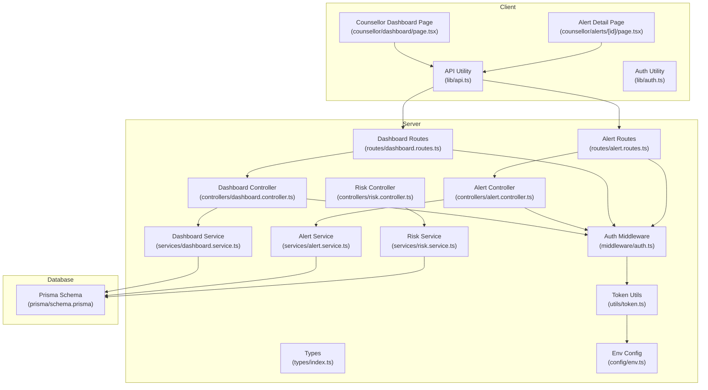
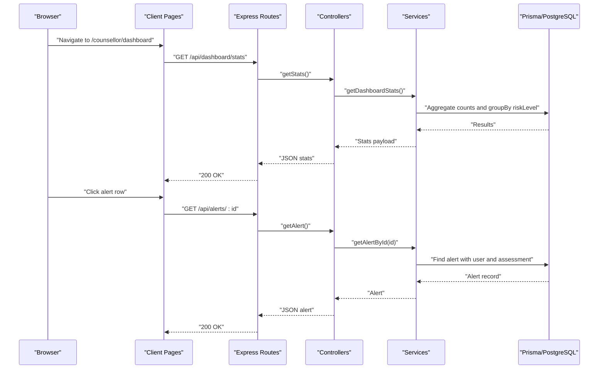
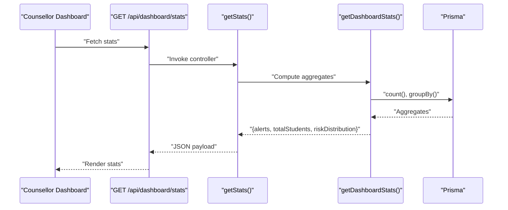
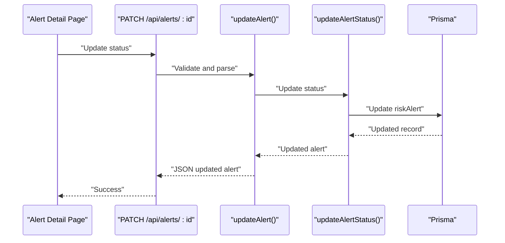
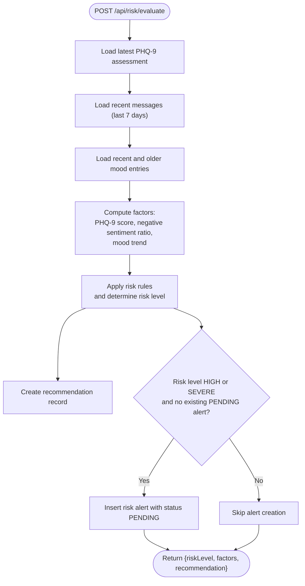
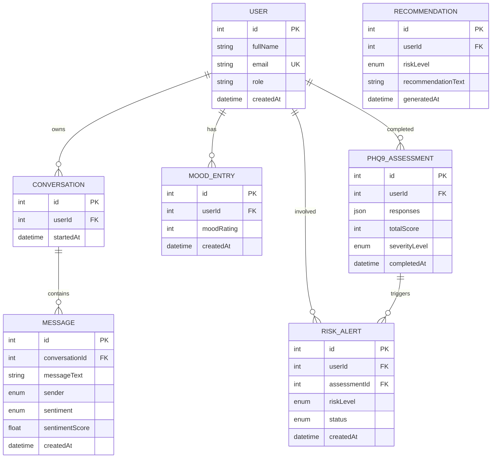

# Administrative Services

<cite>
**Referenced Files in This Document**
- [dashboard.controller.ts](file://server/src/controllers/dashboard.controller.ts)
- [dashboard.routes.ts](file://server/src/routes/dashboard.routes.ts)
- [dashboard.service.ts](file://server/src/services/dashboard.service.ts)
- [alert.controller.ts](file://server/src/controllers/alert.controller.ts)
- [alert.routes.ts](file://server/src/routes/alert.routes.ts)
- [alert.service.ts](file://server/src/services/alert.service.ts)
- [risk.controller.ts](file://server/src/controllers/risk.controller.ts)
- [risk.service.ts](file://server/src/services/risk.service.ts)
- [auth.middleware.ts](file://server/src/middleware/auth.ts)
- [types.index.ts](file://server/src/types/index.ts)
- [token.utils.ts](file://server/src/utils/token.ts)
- [env.config.ts](file://server/src/config/env.ts)
- [schema.prisma](file://prisma/schema.prisma)
- [counsellor.dashboard.page.tsx](file://client/src/app/counsellor/dashboard/page.tsx)
- [counsellor.alerts.detail.page.tsx](file://client/src/app/counsellor/alerts/[id]/page.tsx)
- [api.lib.ts](file://client/src/lib/api.ts)
- [auth.lib.ts](file://client/src/lib/auth.ts)
</cite>

## Table of Contents
1. [Introduction](#introduction)
2. [Project Structure](#project-structure)
3. [Core Components](#core-components)
4. [Architecture Overview](#architecture-overview)
5. [Detailed Component Analysis](#detailed-component-analysis)
6. [Dependency Analysis](#dependency-analysis)
7. [Performance Considerations](#performance-considerations)
8. [Troubleshooting Guide](#troubleshooting-guide)
9. [Conclusion](#conclusion)
10. [Appendices](#appendices)

## Introduction
This document describes the administrative services supporting counselor dashboards and system monitoring. It covers the dashboard endpoints for counselors, alert management workflows, risk evaluation integration, role-based permissions, and client-side dashboard features. It also outlines administrative workflows for reviewing high-risk cases, updating alert statuses, generating summaries, and leveraging system analytics for oversight.

## Project Structure
The system is split into:
- Server (Express + Prisma): Controllers, Routes, Services, Middleware, Types, and Environment configuration
- Client (Next.js): Counselor dashboard and alert detail pages, integrated with API utilities and authentication helpers
- Database (Prisma schema): Defines roles, risk levels, alert statuses, and entity relationships



**Diagram sources**
- [counsellor.dashboard.page.tsx:1-213](file://client/src/app/counsellor/dashboard/page.tsx#L1-L213)
- [counsellor.alerts.detail.page.tsx:1-246](file://client/src/app/counsellor/alerts/[id]/page.tsx#L1-L246)
- [api.lib.ts:1-36](file://client/src/lib/api.ts#L1-L36)
- [auth.lib.ts:1-27](file://client/src/lib/auth.ts#L1-L27)
- [dashboard.routes.ts:1-11](file://server/src/routes/dashboard.routes.ts#L1-L11)
- [dashboard.controller.ts:1-13](file://server/src/controllers/dashboard.controller.ts#L1-L13)
- [dashboard.service.ts:1-19](file://server/src/services/dashboard.service.ts#L1-L19)
- [alert.routes.ts:1-15](file://server/src/routes/alert.routes.ts#L1-L15)
- [alert.controller.ts:1-70](file://server/src/controllers/alert.controller.ts#L1-L70)
- [alert.service.ts:1-62](file://server/src/services/alert.service.ts#L1-L62)
- [risk.controller.ts:1-32](file://server/src/controllers/risk.controller.ts#L1-L32)
- [risk.service.ts:1-138](file://server/src/services/risk.service.ts#L1-L138)
- [auth.middleware.ts:1-39](file://server/src/middleware/auth.ts#L1-L39)
- [types.index.ts:1-12](file://server/src/types/index.ts#L1-L12)
- [token.utils.ts:1-17](file://server/src/utils/token.ts#L1-L17)
- [env.config.ts:1-12](file://server/src/config/env.ts#L1-L12)
- [schema.prisma:1-134](file://prisma/schema.prisma#L1-L134)

**Section sources**
- [dashboard.routes.ts:1-11](file://server/src/routes/dashboard.routes.ts#L1-L11)
- [alert.routes.ts:1-15](file://server/src/routes/alert.routes.ts#L1-L15)
- [auth.middleware.ts:1-39](file://server/src/middleware/auth.ts#L1-L39)
- [schema.prisma:1-134](file://prisma/schema.prisma#L1-L134)

## Core Components
- Dashboard endpoint for counselors
  - Endpoint: GET /api/dashboard/stats
  - Purpose: Provide aggregated statistics for alerts and students
  - Access: Requires authentication and role COUNSELLOR
  - Implementation: Controller delegates to service; service queries Prisma for counts and grouped risk distribution
- Alert management endpoint for counselors
  - Endpoint: GET /api/alerts
  - Purpose: List alerts with optional filters (status, riskLevel)
  - Endpoint: GET /api/alerts/:id
  - Purpose: Retrieve a single alert with related user and assessment data
  - Endpoint: PATCH /api/alerts/:id
  - Purpose: Update alert status (PENDING, REVIEWED, RESOLVED)
  - Endpoint: GET /api/alerts/:id/student
  - Purpose: Fetch student summary including latest assessment, mood metrics, sentiment breakdown, and recommendations
  - Access: Requires authentication and role COUNSELLOR
- Risk evaluation integration
  - Endpoint: POST /api/risk/evaluate
  - Purpose: Evaluate current risk for the authenticated user and create alerts when appropriate
  - Endpoint: GET /api/risk/latest
  - Purpose: Retrieve latest recommendation and alert for the authenticated user
- Client-side counselor dashboard
  - Displays dashboard stats and filtered alert list
  - Provides navigation to alert detail and status transitions
- Client-side alert detail
  - Shows alert metadata, student summary, and status controls

**Section sources**
- [dashboard.controller.ts:1-13](file://server/src/controllers/dashboard.controller.ts#L1-L13)
- [dashboard.routes.ts:1-11](file://server/src/routes/dashboard.routes.ts#L1-L11)
- [dashboard.service.ts:1-19](file://server/src/services/dashboard.service.ts#L1-L19)
- [alert.controller.ts:1-70](file://server/src/controllers/alert.controller.ts#L1-L70)
- [alert.routes.ts:1-15](file://server/src/routes/alert.routes.ts#L1-L15)
- [alert.service.ts:1-62](file://server/src/services/alert.service.ts#L1-L62)
- [risk.controller.ts:1-32](file://server/src/controllers/risk.controller.ts#L1-L32)
- [risk.service.ts:1-138](file://server/src/services/risk.service.ts#L1-L138)
- [counsellor.dashboard.page.tsx:1-213](file://client/src/app/counsellor/dashboard/page.tsx#L1-L213)
- [counsellor.alerts.detail.page.tsx:1-246](file://client/src/app/counsellor/alerts/[id]/page.tsx#L1-L246)

## Architecture Overview
The administrative services follow a layered architecture:
- Presentation layer: Next.js pages for counselor dashboard and alert detail
- API layer: Express routes and controllers
- Service layer: Business logic and data aggregation
- Persistence layer: Prisma ORM against PostgreSQL
- Security layer: JWT-based authentication and role-based access control



**Diagram sources**
- [counsellor.dashboard.page.tsx:1-213](file://client/src/app/counsellor/dashboard/page.tsx#L1-L213)
- [dashboard.routes.ts:1-11](file://server/src/routes/dashboard.routes.ts#L1-L11)
- [dashboard.controller.ts:1-13](file://server/src/controllers/dashboard.controller.ts#L1-L13)
- [dashboard.service.ts:1-19](file://server/src/services/dashboard.service.ts#L1-L19)
- [alert.routes.ts:1-15](file://server/src/routes/alert.routes.ts#L1-L15)
- [alert.controller.ts:1-70](file://server/src/controllers/alert.controller.ts#L1-L70)
- [alert.service.ts:1-62](file://server/src/services/alert.service.ts#L1-L62)

## Detailed Component Analysis

### Dashboard Endpoint (/api/dashboard/stats)
- Authentication and authorization
  - Route requires bearer token and role COUNSELLOR
- Functionality
  - Aggregates total alerts, pending, reviewed, and resolved counts
  - Counts total students by role
  - Groups risk alerts by riskLevel and counts occurrences
- Client integration
  - Counselor dashboard page fetches stats and renders summary cards
  - Supports filtering alerts by status and risk level



**Diagram sources**
- [dashboard.routes.ts:1-11](file://server/src/routes/dashboard.routes.ts#L1-L11)
- [dashboard.controller.ts:1-13](file://server/src/controllers/dashboard.controller.ts#L1-L13)
- [dashboard.service.ts:1-19](file://server/src/services/dashboard.service.ts#L1-L19)
- [counsellor.dashboard.page.tsx:1-213](file://client/src/app/counsellor/dashboard/page.tsx#L1-L213)

**Section sources**
- [dashboard.controller.ts:1-13](file://server/src/controllers/dashboard.controller.ts#L1-L13)
- [dashboard.routes.ts:1-11](file://server/src/routes/dashboard.routes.ts#L1-L11)
- [dashboard.service.ts:1-19](file://server/src/services/dashboard.service.ts#L1-L19)
- [counsellor.dashboard.page.tsx:1-213](file://client/src/app/counsellor/dashboard/page.tsx#L1-L213)

### Alert Management Endpoints (/api/alerts)
- List alerts
  - GET /api/alerts with query params status and riskLevel
  - Returns alerts ordered by creation date with included user and assessment info
- Get alert by ID
  - GET /api/alerts/:id
  - Returns alert with user and assessment details
- Update alert status
  - PATCH /api/alerts/:id with body { status }
  - Validates status against PENDING, REVIEWED, RESOLVED
- Student summary
  - GET /api/alerts/:id/student
  - Returns user profile, latest assessment, recent moods, sentiment breakdown, and recommendations



**Diagram sources**
- [alert.routes.ts:1-15](file://server/src/routes/alert.routes.ts#L1-L15)
- [alert.controller.ts:1-70](file://server/src/controllers/alert.controller.ts#L1-L70)
- [alert.service.ts:1-62](file://server/src/services/alert.service.ts#L1-L62)
- [counsellor.alerts.detail.page.tsx:1-246](file://client/src/app/counsellor/alerts/[id]/page.tsx#L1-L246)

**Section sources**
- [alert.controller.ts:1-70](file://server/src/controllers/alert.controller.ts#L1-L70)
- [alert.routes.ts:1-15](file://server/src/routes/alert.routes.ts#L1-L15)
- [alert.service.ts:1-62](file://server/src/services/alert.service.ts#L1-L62)
- [counsellor.alerts.detail.page.tsx:1-246](file://client/src/app/counsellor/alerts/[id]/page.tsx#L1-L246)

### Risk Evaluation Integration (/api/risk)
- Evaluate risk
  - POST /api/risk/evaluate
  - Computes risk level from latest PHQ-9 assessment, recent messages sentiment, and mood trends
  - Creates recommendation and risk alert when appropriate
- Latest risk
  - GET /api/risk/latest
  - Returns latest recommendation and alert for the user



**Diagram sources**
- [risk.service.ts:1-138](file://server/src/services/risk.service.ts#L1-L138)

**Section sources**
- [risk.controller.ts:1-32](file://server/src/controllers/risk.controller.ts#L1-L32)
- [risk.service.ts:1-138](file://server/src/services/risk.service.ts#L1-L138)

### Client-Side Counselor Dashboard Features
- Dashboard page
  - Loads stats and alerts concurrently
  - Supports filtering by status and risk level
  - Renders alert rows with risk and status badges
- Alert detail page
  - Displays alert metadata and student summary
  - Provides status transition buttons (PENDING → REVIEWED → RESOLVED)
  - Shows mood averages, recent entries, sentiment breakdown, and recommendations

```mermaid
classDiagram
class DashboardPage {
+fetchData()
+buildQuery()
+getStatusBadge(status)
+getRiskBadge(level)
}
class AlertDetailPage {
+fetchData()
+updateStatus(newStatus)
+getNextStatus(current)
+getStatusBadge(status)
+getRiskBadge(level)
}
class API {
+apiRequest(endpoint, options)
}
DashboardPage --> API : "GET /api/dashboard/stats, /api/alerts"
AlertDetailPage --> API : "GET /api/alerts/ : id, /api/alerts/ : id/student, PATCH /api/alerts/ : id"
```

**Diagram sources**
- [counsellor.dashboard.page.tsx:1-213](file://client/src/app/counsellor/dashboard/page.tsx#L1-L213)
- [counsellor.alerts.detail.page.tsx:1-246](file://client/src/app/counsellor/alerts/[id]/page.tsx#L1-L246)
- [api.lib.ts:1-36](file://client/src/lib/api.ts#L1-L36)

**Section sources**
- [counsellor.dashboard.page.tsx:1-213](file://client/src/app/counsellor/dashboard/page.tsx#L1-L213)
- [counsellor.alerts.detail.page.tsx:1-246](file://client/src/app/counsellor/alerts/[id]/page.tsx#L1-L246)
- [api.lib.ts:1-36](file://client/src/lib/api.ts#L1-L36)

## Dependency Analysis
- Authentication and authorization
  - Middleware verifies JWT and enforces role-based access
  - Token payload includes user identity and role
- Data model
  - Users, Conversations, Messages, MoodEntries, PHQ9Assessments, Recommendations, and RiskAlerts define the domain
  - Enums for roles, sentiments, severities, risk levels, and alert statuses
- Service-to-database relationships
  - Dashboard service aggregates counts and distributions
  - Alert service retrieves related entities and updates status
  - Risk service orchestrates evaluation and alert creation



**Diagram sources**
- [schema.prisma:1-134](file://prisma/schema.prisma#L1-L134)

**Section sources**
- [auth.middleware.ts:1-39](file://server/src/middleware/auth.ts#L1-L39)
- [token.utils.ts:1-17](file://server/src/utils/token.ts#L1-L17)
- [types.index.ts:1-12](file://server/src/types/index.ts#L1-L12)
- [schema.prisma:1-134](file://prisma/schema.prisma#L1-L134)

## Performance Considerations
- Concurrent data fetching
  - Dashboard uses concurrent requests for stats and alerts to reduce latency
- Efficient aggregations
  - Dashboard service uses Prisma’s count and groupBy to minimize round trips
- Pagination and limits
  - Alert listing and student summary apply reasonable limits to avoid large payloads
- Caching opportunities
  - Consider caching static dashboard stats and frequently accessed summaries
- Network optimization
  - Client-side loading states and minimal re-renders improve perceived performance

[No sources needed since this section provides general guidance]

## Troubleshooting Guide
- Authentication errors
  - Missing or invalid bearer token leads to 401 responses
  - Client removes token and redirects to login on 401
- Authorization errors
  - Non-counselor users receive 403 when accessing counselor-only endpoints
- Validation errors
  - PATCH /api/alerts/:id rejects invalid status values
  - Not found responses for missing alerts
- Frontend handling
  - API utility throws on non-OK responses and surfaces error messages
  - Client displays loading states and handles partial failures gracefully

**Section sources**
- [auth.middleware.ts:1-39](file://server/src/middleware/auth.ts#L1-L39)
- [alert.controller.ts:1-70](file://server/src/controllers/alert.controller.ts#L1-L70)
- [api.lib.ts:1-36](file://client/src/lib/api.ts#L1-L36)
- [auth.lib.ts:1-27](file://client/src/lib/auth.ts#L1-L27)

## Conclusion
The administrative services provide a secure, role-based foundation for counselor dashboards and alert management. Counselors can monitor system-wide metrics, filter and triage alerts, and review student summaries enriched with assessments, mood trends, and sentiment analytics. Risk evaluation integrates automatically to escalate high-risk cases, while the client-side pages offer intuitive controls for status updates and navigation.

[No sources needed since this section summarizes without analyzing specific files]

## Appendices

### Administrative Workflows

- Reviewing high-risk cases
  - Use counselor dashboard filters to isolate HIGH and SEVERE alerts
  - Navigate to alert detail to view student summary and recommendations
  - Transition status from PENDING to REVIEWED, then to RESOLVED after follow-up
- Managing alert statuses
  - Validate status values before patching
  - Ensure audit trail via alert history and recommendation records
- Generating system reports
  - Aggregate risk distribution and alert counts from dashboard stats
  - Export student summaries and recent assessments for institutional oversight
- Dashboard customization
  - Filter alerts by status and risk level
  - Customize time windows for sentiment and mood analysis in future enhancements
- Data export
  - Client-side pages can trigger export of visible lists and summaries
  - Backend can expose CSV endpoints for bulk exports (extension point)

[No sources needed since this section provides general guidance]