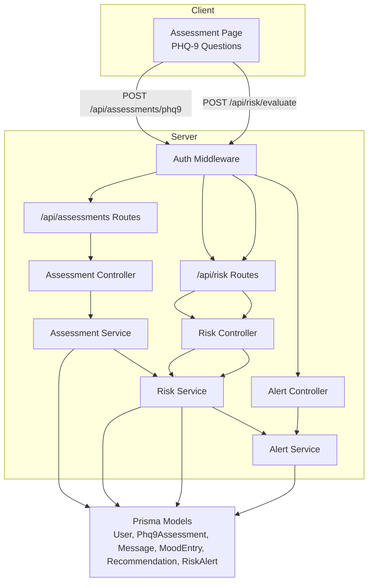
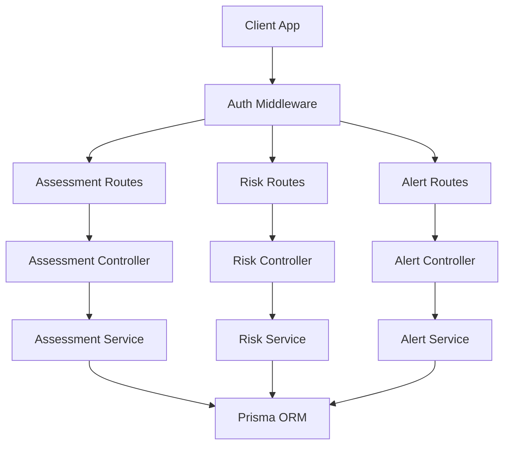
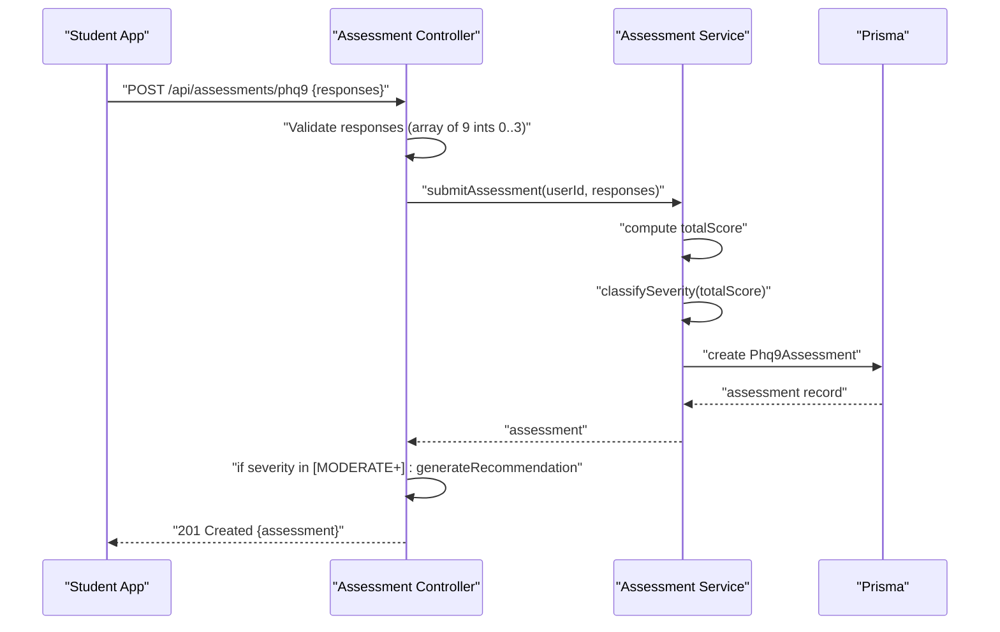
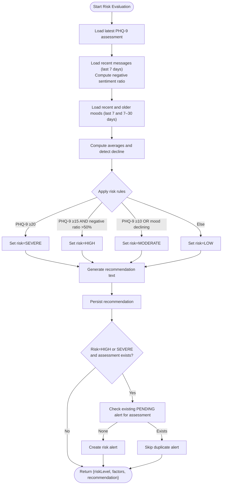
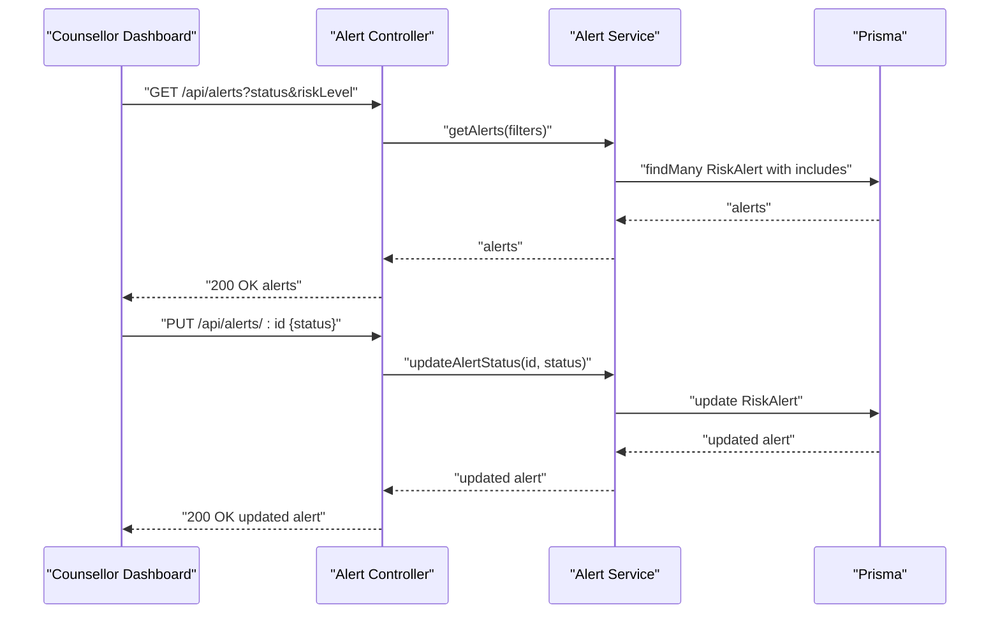
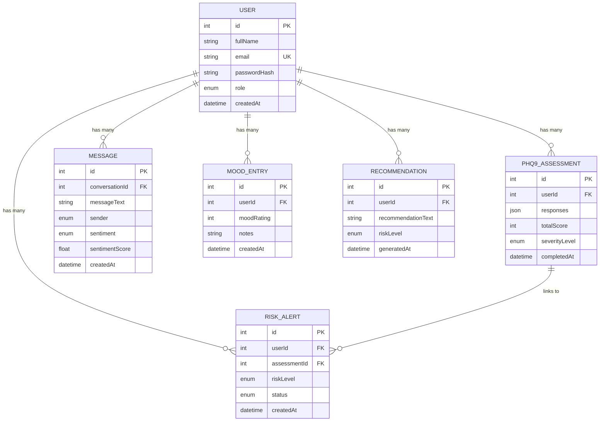
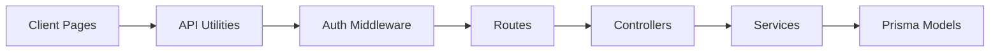

# Assessment Services

<cite>
**Referenced Files in This Document**
- [assessment.controller.ts](file://server/src/controllers/assessment.controller.ts)
- [assessment.service.ts](file://server/src/services/assessment.service.ts)
- [assessment.routes.ts](file://server/src/routes/assessment.routes.ts)
- [risk.controller.ts](file://server/src/controllers/risk.controller.ts)
- [risk.service.ts](file://server/src/services/risk.service.ts)
- [risk.routes.ts](file://server/src/routes/risk.routes.ts)
- [alert.controller.ts](file://server/src/controllers/alert.controller.ts)
- [alert.service.ts](file://server/src/services/alert.service.ts)
- [auth.ts](file://server/src/middleware/auth.ts)
- [api.ts](file://client/src/lib/api.ts)
- [assessment.page.tsx](file://client/src/app/assessment/page.tsx)
- [counsellor.dashboard.page.tsx](file://client/src/app/counsellor/dashboard/page.tsx)
- [schema.prisma](file://prisma/schema.prisma)
</cite>

## Table of Contents
1. [Introduction](#introduction)
2. [Project Structure](#project-structure)
3. [Core Components](#core-components)
4. [Architecture Overview](#architecture-overview)
5. [Detailed Component Analysis](#detailed-component-analysis)
6. [Dependency Analysis](#dependency-analysis)
7. [Performance Considerations](#performance-considerations)
8. [Troubleshooting Guide](#troubleshooting-guide)
9. [Conclusion](#conclusion)
10. [Appendices](#appendices)

## Introduction
This document describes the assessment services for PHQ-9 depression screening and risk classification. It covers the complete workflow from questionnaire administration, automated scoring and severity classification, risk evaluation, alert generation, and counselor notifications. It also documents endpoints, data models, privacy and retention considerations, and integration with counseling workflows.

## Project Structure
The assessment system spans a React frontend and a TypeScript/Node.js backend with Prisma ORM. Key areas:
- Frontend: PHQ-9 questionnaire UI and submission flow
- Backend: Controllers, services, and routes for assessments, risk evaluation, and alerts
- Persistence: PostgreSQL via Prisma with models for users, assessments, messages, moods, recommendations, and risk alerts

**Diagram sources**
- [assessment.routes.ts:1-12](file://server/src/routes/assessment.routes.ts#L1-L12)
- [assessment.controller.ts:1-74](file://server/src/controllers/assessment.controller.ts#L1-L74)
- [assessment.service.ts:1-89](file://server/src/services/assessment.service.ts#L1-L89)
- [risk.routes.ts:1-11](file://server/src/routes/risk.routes.ts#L1-L11)
- [risk.controller.ts:1-32](file://server/src/controllers/risk.controller.ts#L1-L32)
- [risk.service.ts:1-138](file://server/src/services/risk.service.ts#L1-L138)
- [alert.controller.ts:1-70](file://server/src/controllers/alert.controller.ts#L1-L70)
- [alert.service.ts:1-62](file://server/src/services/alert.service.ts#L1-L62)
- [schema.prisma:1-134](file://prisma/schema.prisma#L1-L134)

**Section sources**
- [assessment.routes.ts:1-12](file://server/src/routes/assessment.routes.ts#L1-L12)
- [risk.routes.ts:1-11](file://server/src/routes/risk.routes.ts#L1-L11)
- [assessment.controller.ts:1-74](file://server/src/controllers/assessment.controller.ts#L1-L74)
- [risk.controller.ts:1-32](file://server/src/controllers/risk.controller.ts#L1-L32)
- [alert.controller.ts:1-70](file://server/src/controllers/alert.controller.ts#L1-L70)
- [assessment.service.ts:1-89](file://server/src/services/assessment.service.ts#L1-L89)
- [risk.service.ts:1-138](file://server/src/services/risk.service.ts#L1-L138)
- [alert.service.ts:1-62](file://server/src/services/alert.service.ts#L1-L62)
- [schema.prisma:1-134](file://prisma/schema.prisma#L1-L134)

## Core Components
- Assessment controller validates responses, computes total score, severity level, persists assessment, and optionally generates a recommendation for counselors when severity is moderate or higher.
- Assessment service performs scoring, severity classification, persistence, and recommendation creation.
- Risk controller exposes endpoints to evaluate current risk and fetch the latest risk evaluation.
- Risk service evaluates risk using PHQ-9 score, sentiment trends, and mood trends; stores recommendations and creates risk alerts for HIGH/SEVERE.
- Alert controller and service manage listing, updating, and retrieving alert details and student summaries for counselors.
- Authentication middleware enforces bearer tokens and role checks.
- Frontend assessment page renders PHQ-9 questions, collects answers, submits to backend, and displays severity and recommendation.

Key severity and risk thresholds:
- PHQ-9 severity classification:
  - Minimal: 0–4
  - Mild: 5–9
  - Moderate: 10–14
  - Moderately severe: 15–19
  - Severe: 20–27
- Risk mapping:
  - Minimal/Mild → Low risk
  - Moderate → Moderate risk
  - Moderately severe/Severe → High/Severe risk
- Risk evaluation rules:
  - Severe PHQ-9 (≥20) → Severe risk
  - Moderately severe PHQ-9 (≥15) AND high negative sentiment ratio (>50%) → High risk
  - Moderate PHQ-9 (≥10) OR declining mood trend → Moderate risk
  - Otherwise → Low risk

**Section sources**
- [assessment.controller.ts:5-34](file://server/src/controllers/assessment.controller.ts#L5-L34)
- [assessment.service.ts:12-33](file://server/src/services/assessment.service.ts#L12-L33)
- [assessment.service.ts:48-61](file://server/src/services/assessment.service.ts#L48-L61)
- [assessment.service.ts:63-74](file://server/src/services/assessment.service.ts#L63-L74)
- [risk.controller.ts:5-17](file://server/src/controllers/risk.controller.ts#L5-L17)
- [risk.controller.ts:19-31](file://server/src/controllers/risk.controller.ts#L19-L31)
- [risk.service.ts:11-107](file://server/src/services/risk.service.ts#L11-L107)
- [risk.service.ts:109-120](file://server/src/services/risk.service.ts#L109-L120)
- [risk.service.ts:122-137](file://server/src/services/risk.service.ts#L122-L137)
- [alert.controller.ts:5-53](file://server/src/controllers/alert.controller.ts#L5-L53)
- [alert.service.ts:3-33](file://server/src/services/alert.service.ts#L3-L33)
- [assessment.page.tsx:8-25](file://client/src/app/assessment/page.tsx#L8-L25)
- [assessment.page.tsx:52-73](file://client/src/app/assessment/page.tsx#L52-L73)

## Architecture Overview
The system follows a layered architecture:
- Presentation layer: Next.js pages for student assessment and counselor dashboard
- API layer: Express routes and controllers
- Domain layer: Services implementing business logic
- Persistence layer: Prisma models mapped to PostgreSQL

**Diagram sources**
- [assessment.routes.ts:1-12](file://server/src/routes/assessment.routes.ts#L1-L12)
- [assessment.controller.ts:1-74](file://server/src/controllers/assessment.controller.ts#L1-L74)
- [assessment.service.ts:1-89](file://server/src/services/assessment.service.ts#L1-L89)
- [risk.routes.ts:1-11](file://server/src/routes/risk.routes.ts#L1-L11)
- [risk.controller.ts:1-32](file://server/src/controllers/risk.controller.ts#L1-L32)
- [risk.service.ts:1-138](file://server/src/services/risk.service.ts#L1-L138)
- [alert.controller.ts:1-70](file://server/src/controllers/alert.controller.ts#L1-L70)
- [alert.service.ts:1-62](file://server/src/services/alert.service.ts#L1-L62)

## Detailed Component Analysis

### Assessment Workflow
- Questionnaire administration:
  - The frontend presents nine PHQ-9 items with four Likert-scale options per item.
  - Submission requires all nine responses selected.
- Automated scoring and classification:
  - Total score equals the sum of responses (0–3 per item).
  - Severity level derived from total score thresholds.
- Persistence and recommendation:
  - Assessment stored with user ID, responses, total score, and severity level.
  - If severity is moderate or higher, a recommendation is generated and persisted.

**Diagram sources**
- [assessment.controller.ts:5-34](file://server/src/controllers/assessment.controller.ts#L5-L34)
- [assessment.service.ts:20-33](file://server/src/services/assessment.service.ts#L20-L33)
- [assessment.service.ts:76-88](file://server/src/services/assessment.service.ts#L76-L88)

**Section sources**
- [assessment.page.tsx:8-25](file://client/src/app/assessment/page.tsx#L8-L25)
- [assessment.page.tsx:52-73](file://client/src/app/assessment/page.tsx#L52-L73)
- [assessment.controller.ts:14-21](file://server/src/controllers/assessment.controller.ts#L14-L21)
- [assessment.service.ts:20-33](file://server/src/services/assessment.service.ts#L20-L33)
- [assessment.service.ts:12-18](file://server/src/services/assessment.service.ts#L12-L18)
- [assessment.service.ts:76-88](file://server/src/services/assessment.service.ts#L76-L88)

### Risk Evaluation Workflow
- Inputs:
  - Latest PHQ-9 assessment
  - Recent messages (last 7 days) with sentiment counts
  - Recent and older mood entries (last 7 and 7–30 days respectively)
- Factors and thresholds:
  - Severe risk if PHQ-9 ≥20
  - High risk if PHQ-9 ≥15 and negative sentiment ratio >50%
  - Moderate risk if PHQ-9 ≥10 or mood trend declining
  - Low risk otherwise
- Outputs:
  - Risk level, contributing factors, and recommendation text
  - Persisted recommendation
  - Risk alert created for HIGH/SEVERE (deduplicated per assessment)

**Diagram sources**
- [risk.service.ts:11-107](file://server/src/services/risk.service.ts#L11-L107)
- [risk.service.ts:109-120](file://server/src/services/risk.service.ts#L109-L120)
- [risk.service.ts:122-137](file://server/src/services/risk.service.ts#L122-L137)

**Section sources**
- [risk.controller.ts:5-17](file://server/src/controllers/risk.controller.ts#L5-L17)
- [risk.controller.ts:19-31](file://server/src/controllers/risk.controller.ts#L19-L31)
- [risk.service.ts:11-107](file://server/src/services/risk.service.ts#L11-L107)
- [risk.service.ts:109-120](file://server/src/services/risk.service.ts#L109-L120)
- [risk.service.ts:122-137](file://server/src/services/risk.service.ts#L122-L137)

### Alert Management for Counselors
- Listing alerts with optional filters by status and risk level
- Updating alert status (PENDING, REVIEWED, RESOLVED)
- Retrieving alert details with user and assessment inclusion
- Generating student summaries for quick triage

**Diagram sources**
- [alert.controller.ts:5-53](file://server/src/controllers/alert.controller.ts#L5-L53)
- [alert.service.ts:3-33](file://server/src/services/alert.service.ts#L3-L33)

**Section sources**
- [alert.controller.ts:5-53](file://server/src/controllers/alert.controller.ts#L5-L53)
- [alert.service.ts:3-33](file://server/src/services/alert.service.ts#L3-L33)
- [alert.service.ts:35-61](file://server/src/services/alert.service.ts#L35-L61)

### Data Models and Relationships
The Prisma schema defines core entities and relationships used by assessment and risk services.

**Diagram sources**
- [schema.prisma:47-133](file://prisma/schema.prisma#L47-L133)

**Section sources**
- [schema.prisma:47-133](file://prisma/schema.prisma#L47-L133)

## Dependency Analysis
- Controllers depend on services for business logic and on Prisma for persistence.
- Services encapsulate domain rules and coordinate multiple model queries.
- Routes depend on authentication middleware to enforce access control.
- Frontend depends on shared API utilities for authenticated requests.

**Diagram sources**
- [api.ts:1-36](file://client/src/lib/api.ts#L1-L36)
- [auth.ts:5-22](file://server/src/middleware/auth.ts#L5-L22)
- [assessment.routes.ts:1-12](file://server/src/routes/assessment.routes.ts#L1-L12)
- [risk.routes.ts:1-11](file://server/src/routes/risk.routes.ts#L1-L11)
- [assessment.controller.ts:1-74](file://server/src/controllers/assessment.controller.ts#L1-L74)
- [risk.controller.ts:1-32](file://server/src/controllers/risk.controller.ts#L1-L32)
- [assessment.service.ts:1-89](file://server/src/services/assessment.service.ts#L1-L89)
- [risk.service.ts:1-138](file://server/src/services/risk.service.ts#L1-L138)
- [alert.controller.ts:1-70](file://server/src/controllers/alert.controller.ts#L1-L70)
- [alert.service.ts:1-62](file://server/src/services/alert.service.ts#L1-L62)

**Section sources**
- [api.ts:1-36](file://client/src/lib/api.ts#L1-L36)
- [auth.ts:5-22](file://server/src/middleware/auth.ts#L5-L22)
- [assessment.controller.ts:1-74](file://server/src/controllers/assessment.controller.ts#L1-L74)
- [risk.controller.ts:1-32](file://server/src/controllers/risk.controller.ts#L1-L32)
- [alert.controller.ts:1-70](file://server/src/controllers/alert.controller.ts#L1-L70)
- [assessment.service.ts:1-89](file://server/src/services/assessment.service.ts#L1-L89)
- [risk.service.ts:1-138](file://server/src/services/risk.service.ts#L1-L138)
- [alert.service.ts:1-62](file://server/src/services/alert.service.ts#L1-L62)

## Performance Considerations
- Minimize database roundtrips by batching reads (e.g., fetching user, latest assessment, recent moods, recent messages, and recommendations in parallel where applicable).
- Indexes on foreign keys and timestamps improve query performance for alerts, assessments, and messages.
- Avoid redundant computations by caching recent assessments and limiting sentiment/message windows to recent periods.
- Use pagination for alert lists and limit returned fields via selective includes to reduce payload sizes.

## Troubleshooting Guide
Common issues and resolutions:
- Authentication failures:
  - Ensure Authorization header with Bearer token is present and valid.
  - On 401 responses, redirect to login and clear invalid tokens.
- Assessment submission errors:
  - Verify all nine responses are integers within 0–3.
  - Confirm user is authenticated before submitting.
- Risk evaluation errors:
  - If no recent messages or moods exist, defaults are applied; results may reflect low risk.
  - Ensure latest assessment exists for alert creation.
- Alert updates:
  - Validate status is one of PENDING, REVIEWED, RESOLVED.
  - Confirm alert exists and belongs to the requesting counselor.

**Section sources**
- [api.ts:20-35](file://client/src/lib/api.ts#L20-L35)
- [assessment.controller.ts:7-21](file://server/src/controllers/assessment.controller.ts#L7-L21)
- [risk.service.ts:88-104](file://server/src/services/risk.service.ts#L88-L104)
- [alert.controller.ts:37-40](file://server/src/controllers/alert.controller.ts#L37-L40)

## Conclusion
The assessment services provide a robust PHQ-9 screening pipeline with automated scoring, severity classification, and integrated risk evaluation. Risk alerts trigger counselor workflows, while recommendations guide student care. The modular backend and clear data models enable maintainability and future enhancements.

## Appendices

### Assessment Endpoints
- POST /api/assessments/phq9
  - Body: { responses: number[] (exactly 9 ints from 0 to 3) }
  - Responses:
    - 201 Created: { id, userId, responses, totalScore, severityLevel, completedAt }
    - 400 Bad Request: validation error
    - 401 Unauthorized: missing/invalid token
- GET /api/assessments/phq9
  - Returns: array of assessments ordered by completion time descending
- GET /api/assessments/phq9/:id
  - Path param: assessment id
  - Responses: 200 OK or 404 Not Found

**Section sources**
- [assessment.routes.ts:7-9](file://server/src/routes/assessment.routes.ts#L7-L9)
- [assessment.controller.ts:5-48](file://server/src/controllers/assessment.controller.ts#L5-L48)

### Risk Endpoints
- POST /api/risk/evaluate
  - Returns: { riskLevel, factors[], recommendation }
- GET /api/risk/latest
  - Returns: { recommendation, alert }

**Section sources**
- [risk.routes.ts:7-8](file://server/src/routes/risk.routes.ts#L7-L8)
- [risk.controller.ts:5-17](file://server/src/controllers/risk.controller.ts#L5-L17)
- [risk.controller.ts:19-31](file://server/src/controllers/risk.controller.ts#L19-L31)

### Alert Management Endpoints
- GET /api/alerts
  - Query params: status, riskLevel
  - Returns: filtered alerts with user and assessment included
- GET /api/alerts/:id
  - Returns: single alert with includes
- PUT /api/alerts/:id
  - Body: { status: "PENDING" | "REVIEWED" | "RESOLVED" }
  - Returns: updated alert
- GET /api/alerts/student-summary/:id
  - Returns: student summary including latest assessment, mood summary, sentiment breakdown, and recent recommendations

**Section sources**
- [alert.controller.ts:5-53](file://server/src/controllers/alert.controller.ts#L5-L53)
- [alert.service.ts:3-33](file://server/src/services/alert.service.ts#L3-L33)
- [alert.service.ts:35-61](file://server/src/services/alert.service.ts#L35-L61)

### Practical Examples

- Example: Submitting a valid assessment
  - Input: Nine integer responses from 0 to 3
  - Behavior: Total score computed, severity level determined, assessment persisted, recommendation generated if needed
  - Outcome: 201 Created with assessment object

- Example: Risk evaluation triggering alert
  - Scenario: PHQ-9 score 18 with high negative sentiment ratio and declining mood
  - Behavior: Risk set to HIGH, recommendation stored, risk alert created (if none exists for the latest assessment)
  - Outcome: Counselor receives alert for review

- Example: Viewing assessment history
  - Behavior: Fetches all assessments for the authenticated user, most recent first
  - Outcome: Array of assessment records suitable for trend analysis

**Section sources**
- [assessment.controller.ts:23-28](file://server/src/controllers/assessment.controller.ts#L23-L28)
- [assessment.service.ts:20-33](file://server/src/services/assessment.service.ts#L20-L33)
- [risk.service.ts:56-73](file://server/src/services/risk.service.ts#L56-L73)
- [risk.service.ts:87-104](file://server/src/services/risk.service.ts#L87-L104)
- [assessment.routes.ts:8-9](file://server/src/routes/assessment.routes.ts#L8-L9)

### Privacy, Data Retention, and Integration Notes
- Authentication and authorization:
  - All endpoints require a valid bearer token; counselors can only access alerts and summaries via dedicated workflows.
- Data minimization:
  - Risk evaluation uses recent windows (7 days for messages/moods) to balance timeliness and privacy.
- Archival and trend analysis:
  - Assessment history endpoint supports longitudinal analysis; risk recommendations and alerts provide context for follow-up.
- Integration with counseling:
  - Alerts surface risk levels and statuses; student summaries consolidate recent data for efficient triage.

**Section sources**
- [auth.ts:5-22](file://server/src/middleware/auth.ts#L5-L22)
- [risk.service.ts:18-38](file://server/src/services/risk.service.ts#L18-L38)
- [counsellor.dashboard.page.tsx:49-80](file://client/src/app/counsellor/dashboard/page.tsx#L49-L80)
- [alert.service.ts:35-61](file://server/src/services/alert.service.ts#L35-L61)