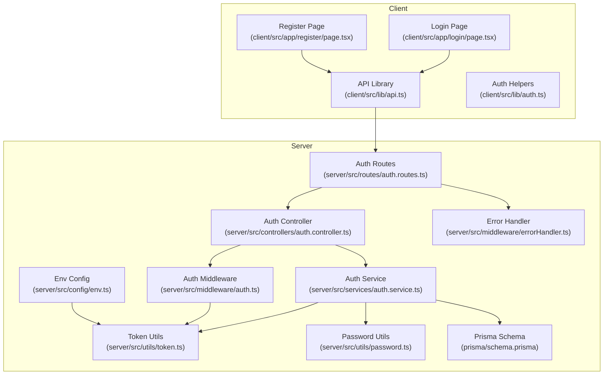
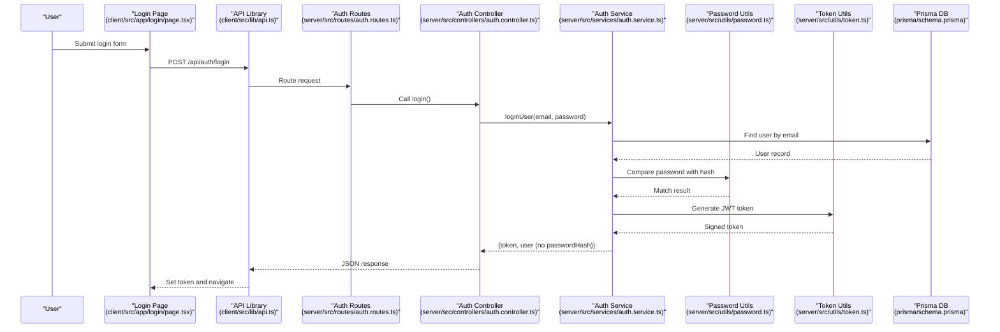
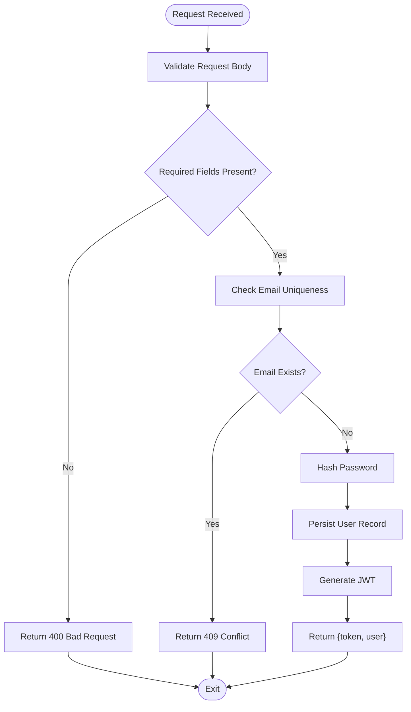
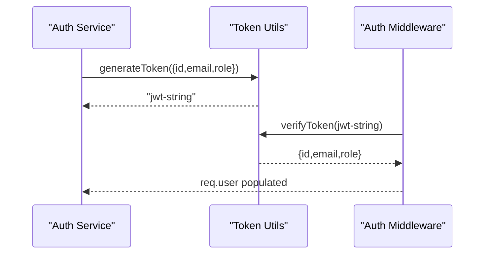
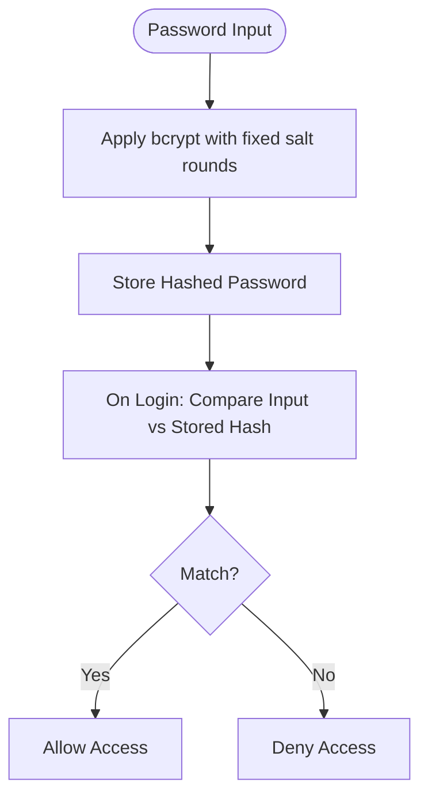
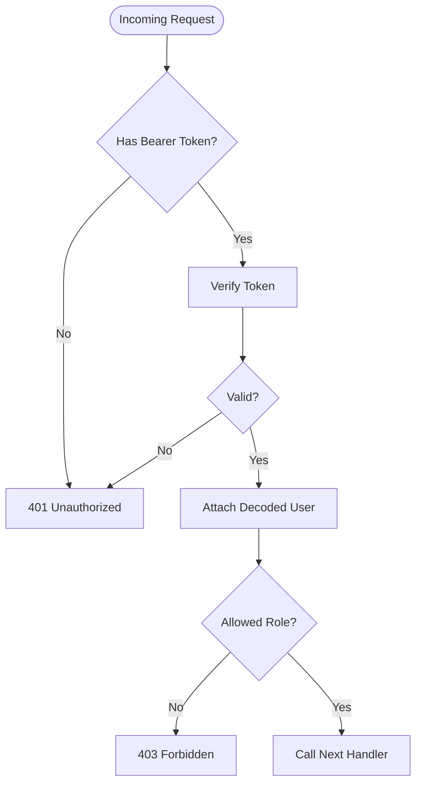
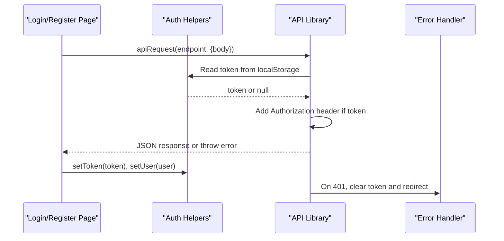
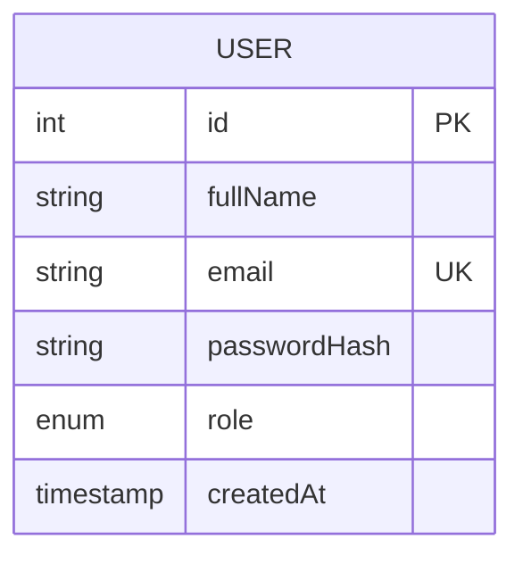
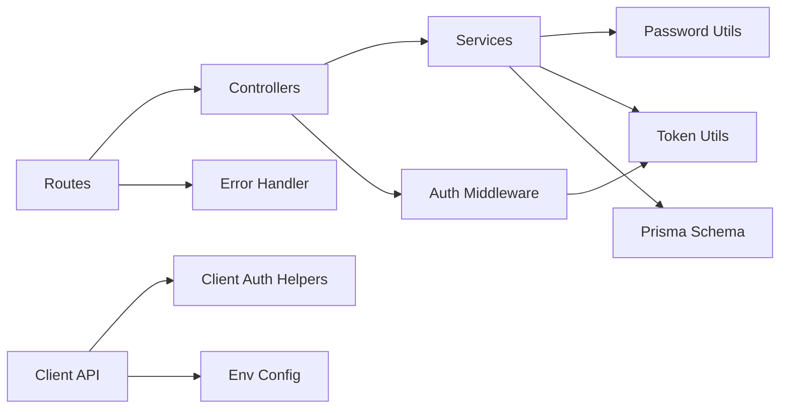

# Authentication System

<cite>
**Referenced Files in This Document**
- [auth.controller.ts](file://server/src/controllers/auth.controller.ts)
- [auth.service.ts](file://server/src/services/auth.service.ts)
- [auth.ts](file://server/src/middleware/auth.ts)
- [token.ts](file://server/src/utils/token.ts)
- [password.ts](file://server/src/utils/password.ts)
- [auth.routes.ts](file://server/src/routes/auth.routes.ts)
- [auth.ts](file://client/src/lib/auth.ts)
- [api.ts](file://client/src/lib/api.ts)
- [index.ts](file://server/src/types/index.ts)
- [schema.prisma](file://prisma/schema.prisma)
- [env.ts](file://server/src/config/env.ts)
- [errorHandler.ts](file://server/src/middleware/errorHandler.ts)
- [page.tsx](file://client/src/app/login/page.tsx)
- [page.tsx](file://client/src/app/register/page.tsx)
- [auth.test.ts](file://server/src/__tests__/auth.test.ts)
</cite>

## Table of Contents
1. [Introduction](#introduction)
2. [Project Structure](#project-structure)
3. [Core Components](#core-components)
4. [Architecture Overview](#architecture-overview)
5. [Detailed Component Analysis](#detailed-component-analysis)
6. [Dependency Analysis](#dependency-analysis)
7. [Performance Considerations](#performance-considerations)
8. [Troubleshooting Guide](#troubleshooting-guide)
9. [Conclusion](#conclusion)
10. [Appendices](#appendices)

## Introduction
This document describes the authentication system for BuddyAI, focusing on user registration, login, and session management. It explains the JWT-based authentication flow, including token generation and verification, password hashing with bcrypt, role-based access control, and the complete authentication endpoints. It also covers client-side integration patterns, error handling, and security best practices. Notably, the current implementation does not include logout, password reset, email verification, or account activation endpoints; these are identified as gaps for future enhancement.

## Project Structure
The authentication system spans the server (Express) and client (Next.js) applications:
- Server-side components:
  - Routes define the authentication endpoints.
  - Controllers handle request/response logic.
  - Services encapsulate business logic and database interactions.
  - Middleware enforces authentication and role checks.
  - Utilities implement JWT token handling and bcrypt password hashing.
  - Types define request/response contracts.
  - Configuration loads environment variables.
  - Tests validate service behavior.
- Client-side components:
  - API library centralizes HTTP requests and attaches tokens.
  - Authentication helpers manage local storage of tokens and user data.
  - Login and register pages orchestrate user input and navigation.

**Diagram sources**
- [auth.routes.ts:1-12](file://server/src/routes/auth.routes.ts#L1-L12)
- [auth.controller.ts:1-50](file://server/src/controllers/auth.controller.ts#L1-L50)
- [auth.service.ts:1-72](file://server/src/services/auth.service.ts#L1-L72)
- [auth.ts:1-39](file://server/src/middleware/auth.ts#L1-L39)
- [token.ts:1-17](file://server/src/utils/token.ts#L1-L17)
- [password.ts:1-12](file://server/src/utils/password.ts#L1-L12)
- [schema.prisma:47-61](file://prisma/schema.prisma#L47-L61)
- [env.ts:1-12](file://server/src/config/env.ts#L1-L12)
- [errorHandler.ts:1-13](file://server/src/middleware/errorHandler.ts#L1-L13)
- [api.ts:1-36](file://client/src/lib/api.ts#L1-L36)
- [auth.ts:1-27](file://client/src/lib/auth.ts#L1-L27)
- [page.tsx:1-108](file://client/src/app/login/page.tsx#L1-L108)
- [page.tsx:1-120](file://client/src/app/register/page.tsx#L1-L120)

**Section sources**
- [auth.routes.ts:1-12](file://server/src/routes/auth.routes.ts#L1-L12)
- [auth.controller.ts:1-50](file://server/src/controllers/auth.controller.ts#L1-L50)
- [auth.service.ts:1-72](file://server/src/services/auth.service.ts#L1-L72)
- [auth.ts:1-39](file://server/src/middleware/auth.ts#L1-L39)
- [token.ts:1-17](file://server/src/utils/token.ts#L1-L17)
- [password.ts:1-12](file://server/src/utils/password.ts#L1-L12)
- [schema.prisma:47-61](file://prisma/schema.prisma#L47-L61)
- [env.ts:1-12](file://server/src/config/env.ts#L1-L12)
- [errorHandler.ts:1-13](file://server/src/middleware/errorHandler.ts#L1-L13)
- [api.ts:1-36](file://client/src/lib/api.ts#L1-L36)
- [auth.ts:1-27](file://client/src/lib/auth.ts#L1-L27)
- [page.tsx:1-108](file://client/src/app/login/page.tsx#L1-L108)
- [page.tsx:1-120](file://client/src/app/register/page.tsx#L1-L120)

## Core Components
- Authentication routes:
  - POST /api/auth/register: Registers a new user with validated input and returns a JWT token and user profile (excluding password hash).
  - POST /api/auth/login: Validates credentials, compares hashed passwords, and returns a JWT token and user profile.
  - GET /api/auth/me: Protected endpoint requiring a valid Bearer token to fetch the current user’s profile.
- Authentication controller:
  - Performs basic input validation and delegates to the service layer.
  - Returns structured JSON responses and forwards errors to the global error handler.
- Authentication service:
  - Enforces uniqueness of email, hashes passwords using bcrypt, persists user records via Prisma, and generates JWT tokens.
  - Returns sanitized user objects without exposing sensitive fields.
- Token utilities:
  - Generates signed JWT tokens with a 24-hour expiration and verifies tokens using the configured secret.
- Password utilities:
  - Hashes passwords with bcrypt using a fixed salt round count and compares plaintext against stored hashes.
- Authentication middleware:
  - Extracts Authorization header, validates Bearer token, decodes payload, and attaches user info to the request.
  - Provides role-based access control by checking allowed roles.
- Client-side integration:
  - Stores tokens and user data in localStorage.
  - Attaches Authorization headers to API requests and handles unauthorized responses by clearing tokens and redirecting to login.
- Database schema:
  - Defines the User model with unique email, password hash, role enumeration, and timestamps.
  - Enumerations include Role (STUDENT, COUNSELLOR), among others.

**Section sources**
- [auth.routes.ts:1-12](file://server/src/routes/auth.routes.ts#L1-L12)
- [auth.controller.ts:1-50](file://server/src/controllers/auth.controller.ts#L1-L50)
- [auth.service.ts:1-72](file://server/src/services/auth.service.ts#L1-L72)
- [token.ts:1-17](file://server/src/utils/token.ts#L1-L17)
- [password.ts:1-12](file://server/src/utils/password.ts#L1-L12)
- [auth.ts:1-39](file://server/src/middleware/auth.ts#L1-L39)
- [auth.ts:1-27](file://client/src/lib/auth.ts#L1-L27)
- [api.ts:1-36](file://client/src/lib/api.ts#L1-L36)
- [schema.prisma:47-61](file://prisma/schema.prisma#L47-L61)

## Architecture Overview
The authentication flow follows a layered architecture:
- Client pages collect user input and submit to the API.
- API routes delegate to controllers, which call services.
- Services interact with the database and utilities for hashing and token generation.
- Middleware enforces authentication and authorization for protected routes.
- Errors are normalized by the error handler middleware.

**Diagram sources**
- [page.tsx:16-40](file://client/src/app/login/page.tsx#L16-L40)
- [api.ts:3-35](file://client/src/lib/api.ts#L3-L35)
- [auth.routes.ts:7-9](file://server/src/routes/auth.routes.ts#L7-L9)
- [auth.controller.ts:21-35](file://server/src/controllers/auth.controller.ts#L21-L35)
- [auth.service.ts:35-59](file://server/src/services/auth.service.ts#L35-L59)
- [password.ts:9-11](file://server/src/utils/password.ts#L9-L11)
- [token.ts:10-16](file://server/src/utils/token.ts#L10-L16)
- [schema.prisma:47-61](file://prisma/schema.prisma#L47-L61)

## Detailed Component Analysis

### Authentication Endpoints
- POST /api/auth/register
  - Request body: { fullName: string, email: string, password: string }
  - Validation: Rejects missing fields; checks email uniqueness; throws conflict if duplicate.
  - Processing: Hashes password; creates user with default role STUDENT; generates JWT.
  - Response: { token: string, user: { id, fullName, email, role } }
  - Security: Passwords are hashed; response excludes password hash.
- POST /api/auth/login
  - Request body: { email: string, password: string }
  - Validation: Rejects missing fields.
  - Processing: Finds user by email; compares password hash; generates JWT.
  - Response: { token: string, user: { id, fullName, email, role } }
  - Security: Invalid credentials trigger a 401 error; password hash is excluded.
- GET /api/auth/me
  - Headers: Authorization: Bearer <token>
  - Processing: Middleware verifies token; controller fetches user by ID.
  - Response: { id, fullName, email, role }
  - Security: Access denied without token or with invalid/expired token.

**Diagram sources**
- [auth.controller.ts:5-19](file://server/src/controllers/auth.controller.ts#L5-L19)
- [auth.service.ts:5-33](file://server/src/services/auth.service.ts#L5-L33)
- [password.ts:5-7](file://server/src/utils/password.ts#L5-L7)
- [token.ts:10-12](file://server/src/utils/token.ts#L10-L12)

**Section sources**
- [auth.routes.ts:7-9](file://server/src/routes/auth.routes.ts#L7-L9)
- [auth.controller.ts:5-49](file://server/src/controllers/auth.controller.ts#L5-L49)
- [auth.service.ts:5-59](file://server/src/services/auth.service.ts#L5-L59)
- [schema.prisma:47-61](file://prisma/schema.prisma#L47-L61)

### JWT Token Generation and Verification
- Token generation:
  - Payload includes id, email, and role.
  - Uses a secret from environment configuration with 24-hour expiration.
- Token verification:
  - Middleware extracts Bearer token from Authorization header.
  - Verifies signature and decodes payload; attaches user to request.
  - Returns 401 for missing/invalid/expired tokens.

**Diagram sources**
- [token.ts:10-16](file://server/src/utils/token.ts#L10-L16)
- [auth.ts:5-22](file://server/src/middleware/auth.ts#L5-L22)

**Section sources**
- [token.ts:1-17](file://server/src/utils/token.ts#L1-L17)
- [auth.ts:1-39](file://server/src/middleware/auth.ts#L1-L39)
- [env.ts:6-11](file://server/src/config/env.ts#L6-L11)

### Password Hashing with bcrypt
- Hashing:
  - Fixed salt rounds constant applied during registration.
- Comparison:
  - Compares submitted password against stored hash during login.
- Security:
  - Never stores plaintext passwords; ensures robust credential verification.

**Diagram sources**
- [password.ts:5-11](file://server/src/utils/password.ts#L5-L11)
- [auth.service.ts:13-48](file://server/src/services/auth.service.ts#L13-L48)

**Section sources**
- [password.ts:1-12](file://server/src/utils/password.ts#L1-L12)
- [auth.service.ts:1-72](file://server/src/services/auth.service.ts#L1-L72)

### Role-Based Access Control
- Middleware supports role enforcement:
  - Requires authentication before role checks.
  - Accepts a variadic list of allowed roles.
  - Returns 403 for insufficient permissions.

**Diagram sources**
- [auth.ts:5-38](file://server/src/middleware/auth.ts#L5-L38)
- [index.ts:3-11](file://server/src/types/index.ts#L3-L11)

**Section sources**
- [auth.ts:24-38](file://server/src/middleware/auth.ts#L24-L38)
- [index.ts:3-11](file://server/src/types/index.ts#L3-L11)

### Client-Side Authentication Integration
- Token and user persistence:
  - Store JWT in localStorage and parsed user object for UI rendering.
- API requests:
  - Automatically attach Authorization header when a token exists.
  - On 401, clear token and redirect to login.
- Login and registration pages:
  - Collect form data, call apiRequest, persist token/user, and navigate based on role or default.

**Diagram sources**
- [api.ts:3-35](file://client/src/lib/api.ts#L3-L35)
- [auth.ts:1-27](file://client/src/lib/auth.ts#L1-L27)
- [page.tsx:16-40](file://client/src/app/login/page.tsx#L16-L40)
- [page.tsx:17-36](file://client/src/app/register/page.tsx#L17-L36)

**Section sources**
- [api.ts:1-36](file://client/src/lib/api.ts#L1-L36)
- [auth.ts:1-27](file://client/src/lib/auth.ts#L1-L27)
- [page.tsx:1-108](file://client/src/app/login/page.tsx#L1-L108)
- [page.tsx:1-120](file://client/src/app/register/page.tsx#L1-L120)

### Database Schema and Types
- User model:
  - Unique email, password hash, role with default STUDENT, timestamps.
- Roles:
  - Enumerated as STUDENT and COUNSELLOR; middleware supports role checks.
- Type safety:
  - AuthUser and AuthRequest types ensure consistent request handling.

**Diagram sources**
- [schema.prisma:47-61](file://prisma/schema.prisma#L47-L61)
- [index.ts:3-11](file://server/src/types/index.ts#L3-L11)

**Section sources**
- [schema.prisma:10-13](file://prisma/schema.prisma#L10-L13)
- [schema.prisma:47-61](file://prisma/schema.prisma#L47-L61)
- [index.ts:3-11](file://server/src/types/index.ts#L3-L11)

## Dependency Analysis
Key dependencies and their relationships:
- Routes depend on controllers.
- Controllers depend on services.
- Services depend on password and token utilities and Prisma.
- Middleware depends on token utilities and types.
- Client API depends on auth helpers and environment configuration.
- Error handling is centralized in the error handler middleware.

**Diagram sources**
- [auth.routes.ts:1-12](file://server/src/routes/auth.routes.ts#L1-L12)
- [auth.controller.ts:1-50](file://server/src/controllers/auth.controller.ts#L1-L50)
- [auth.service.ts:1-72](file://server/src/services/auth.service.ts#L1-L72)
- [auth.ts:1-39](file://server/src/middleware/auth.ts#L1-L39)
- [token.ts:1-17](file://server/src/utils/token.ts#L1-L17)
- [password.ts:1-12](file://server/src/utils/password.ts#L1-L12)
- [schema.prisma:47-61](file://prisma/schema.prisma#L47-L61)
- [api.ts:1-36](file://client/src/lib/api.ts#L1-L36)
- [auth.ts:1-27](file://client/src/lib/auth.ts#L1-L27)
- [env.ts:1-12](file://server/src/config/env.ts#L1-L12)
- [errorHandler.ts:1-13](file://server/src/middleware/errorHandler.ts#L1-L13)

**Section sources**
- [auth.routes.ts:1-12](file://server/src/routes/auth.routes.ts#L1-L12)
- [auth.controller.ts:1-50](file://server/src/controllers/auth.controller.ts#L1-L50)
- [auth.service.ts:1-72](file://server/src/services/auth.service.ts#L1-L72)
- [auth.ts:1-39](file://server/src/middleware/auth.ts#L1-L39)
- [token.ts:1-17](file://server/src/utils/token.ts#L1-L17)
- [password.ts:1-12](file://server/src/utils/password.ts#L1-L12)
- [schema.prisma:47-61](file://prisma/schema.prisma#L47-L61)
- [api.ts:1-36](file://client/src/lib/api.ts#L1-L36)
- [auth.ts:1-27](file://client/src/lib/auth.ts#L1-L27)
- [env.ts:1-12](file://server/src/config/env.ts#L1-L12)
- [errorHandler.ts:1-13](file://server/src/middleware/errorHandler.ts#L1-L13)

## Performance Considerations
- Token expiration: 24-hour expiry balances usability and security; consider shorter expirations with automatic refresh for high-security contexts.
- Password hashing cost: Fixed salt rounds provide consistent performance; monitor database load during peak authentication events.
- Middleware overhead: Single token verification per protected route; caching decoded claims at the edge is unnecessary given short-lived tokens.
- Network latency: Centralized API library reduces redundant header handling; ensure minimal retries on 401 to avoid loops.

[No sources needed since this section provides general guidance]

## Troubleshooting Guide
Common issues and resolutions:
- Invalid credentials:
  - Symptoms: 401 Unauthorized on login/register.
  - Causes: Incorrect email/password or non-existent user.
  - Resolution: Prompt user to re-enter credentials; ensure frontend displays error messages.
- Missing or malformed Authorization header:
  - Symptoms: 401 Access denied on protected routes.
  - Causes: Missing Bearer token or incorrect format.
  - Resolution: Ensure client attaches Authorization: Bearer <token>; verify localStorage token presence.
- Expired token:
  - Symptoms: 401 Invalid or expired token.
  - Causes: Token exceeded 24-hour TTL.
  - Resolution: Require user to log in again; do not attempt silent refresh.
- Duplicate email during registration:
  - Symptoms: 409 Conflict.
  - Causes: Email already exists.
  - Resolution: Prompt user to use another email or log in.
- Global error handling:
  - The error handler middleware normalizes errors and returns consistent JSON with status codes.

**Section sources**
- [auth.controller.ts:21-35](file://server/src/controllers/auth.controller.ts#L21-L35)
- [auth.ts:5-22](file://server/src/middleware/auth.ts#L5-L22)
- [auth.service.ts:35-59](file://server/src/services/auth.service.ts#L35-L59)
- [errorHandler.ts:7-12](file://server/src/middleware/errorHandler.ts#L7-L12)
- [api.ts:20-26](file://client/src/lib/api.ts#L20-L26)

## Conclusion
The authentication system implements a clean, modular JWT-based flow with bcrypt password hashing and role-based access control. It provides secure endpoints for registration and login, along with a protected profile retrieval mechanism. Client-side helpers streamline token and user persistence, while middleware enforces authentication and authorization. Areas for future enhancement include logout, password reset, email verification, and account activation workflows.

[No sources needed since this section summarizes without analyzing specific files]

## Appendices

### Endpoint Reference
- POST /api/auth/register
  - Request: { fullName, email, password }
  - Response: { token, user: { id, fullName, email, role } }
  - Status: 201 Created; 400 Bad Request (missing fields); 409 Conflict (duplicate email)
- POST /api/auth/login
  - Request: { email, password }
  - Response: { token, user: { id, fullName, email, role } }
  - Status: 200 OK; 400 Bad Request (missing fields); 401 Unauthorized (invalid credentials)
- GET /api/auth/me
  - Headers: Authorization: Bearer <token>
  - Response: { id, fullName, email, role }
  - Status: 200 OK; 401 Unauthorized (missing/invalid token); 404 Not Found (user not found)

**Section sources**
- [auth.routes.ts:7-9](file://server/src/routes/auth.routes.ts#L7-L9)
- [auth.controller.ts:5-49](file://server/src/controllers/auth.controller.ts#L5-L49)
- [auth.service.ts:61-71](file://server/src/services/auth.service.ts#L61-L71)
- [auth.ts:5-22](file://server/src/middleware/auth.ts#L5-L22)

### Security Best Practices
- Use HTTPS in production to protect tokens and credentials.
- Rotate JWT secrets regularly and store them securely in environment variables.
- Avoid storing sensitive tokens in plain text; localStorage is acceptable for SPAs but consider HttpOnly cookies for SSR.
- Implement rate limiting on authentication endpoints to mitigate brute-force attacks.
- Log and monitor repeated authentication failures.
- Educate users on strong password policies and enable multi-factor authentication when feasible.

[No sources needed since this section provides general guidance]

### Test Coverage Highlights
- Registration:
  - Hashes password and creates user with default STUDENT role.
  - Throws conflict for duplicate emails.
- Login:
  - Returns token for valid credentials.
  - Throws unauthorized for non-existent emails and wrong passwords.
- Output sanitization:
  - Ensures password hash is not included in returned user objects.

**Section sources**
- [auth.test.ts:36-85](file://server/src/__tests__/auth.test.ts#L36-L85)
- [auth.test.ts:87-131](file://server/src/__tests__/auth.test.ts#L87-L131)