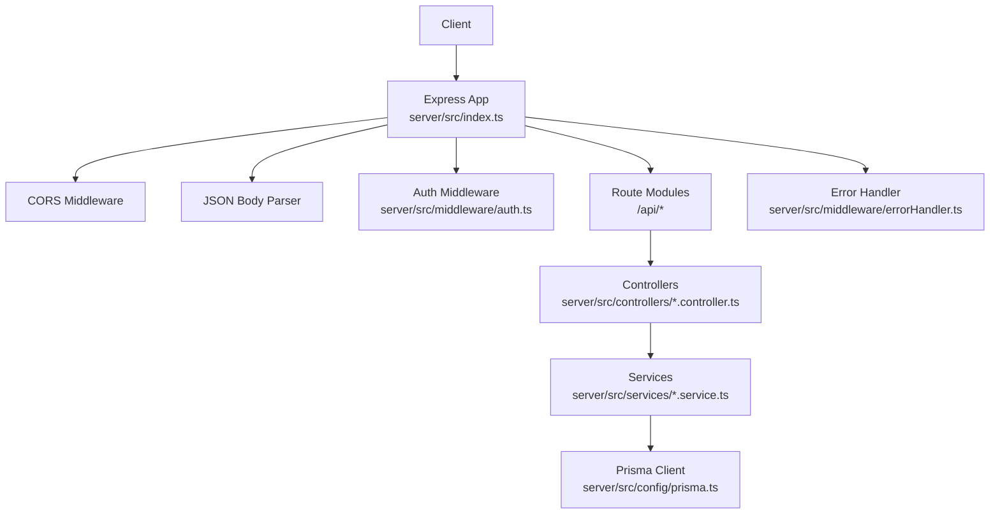
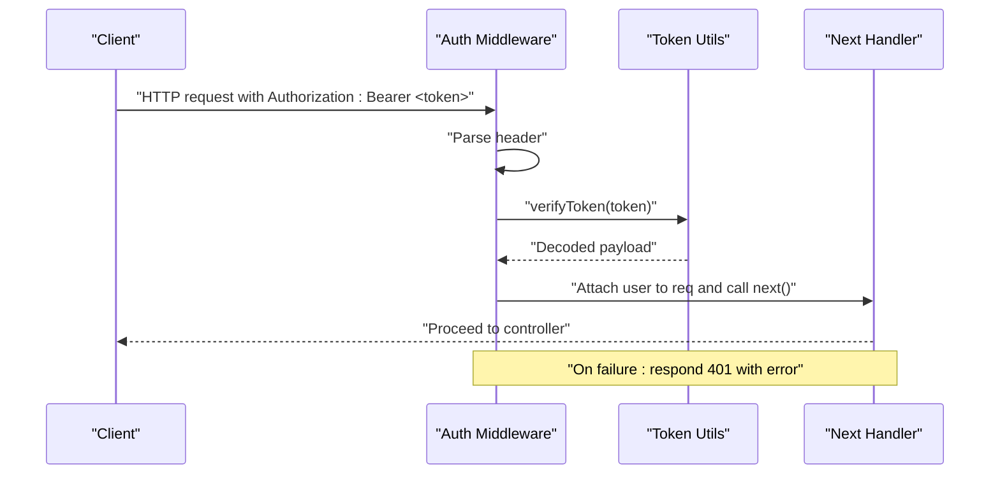
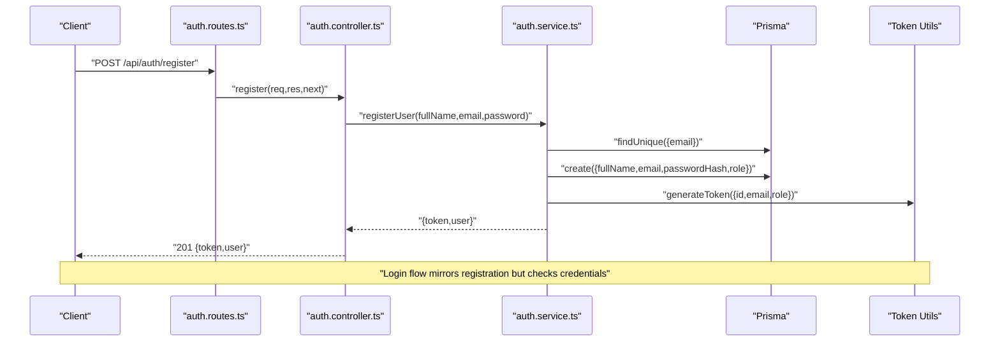
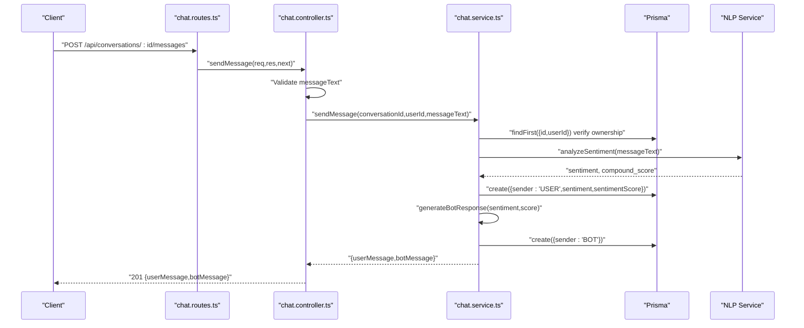
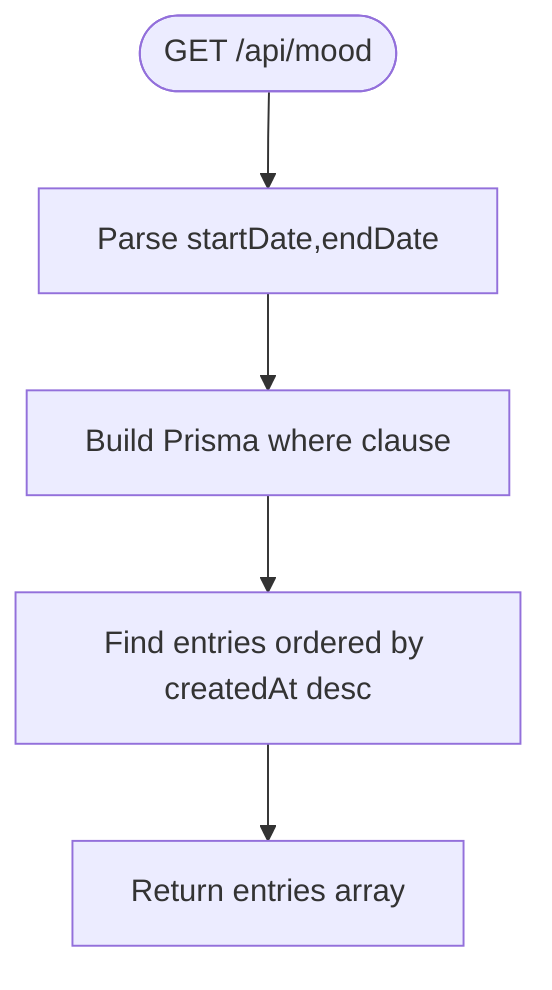
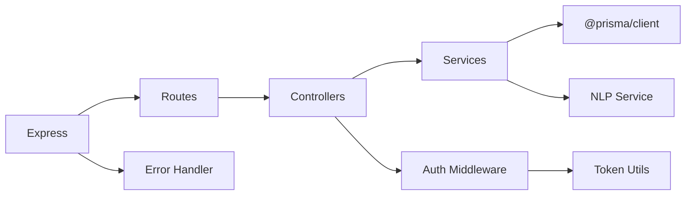

# Backend API

<cite>
**Referenced Files in This Document**
- [index.ts](file://server/src/index.ts)
- [env.ts](file://server/src/config/env.ts)
- [prisma.ts](file://server/src/config/prisma.ts)
- [auth.ts](file://server/src/middleware/auth.ts)
- [errorHandler.ts](file://server/src/middleware/errorHandler.ts)
- [token.ts](file://server/src/utils/token.ts)
- [auth.controller.ts](file://server/src/controllers/auth.controller.ts)
- [auth.routes.ts](file://server/src/routes/auth.routes.ts)
- [auth.service.ts](file://server/src/services/auth.service.ts)
- [chat.controller.ts](file://server/src/controllers/chat.controller.ts)
- [chat.routes.ts](file://server/src/routes/chat.routes.ts)
- [chat.service.ts](file://server/src/services/chat.service.ts)
- [mood.controller.ts](file://server/src/controllers/mood.controller.ts)
- [mood.routes.ts](file://server/src/routes/mood.routes.ts)
- [mood.service.ts](file://server/src/services/mood.service.ts)
- [assessment.controller.ts](file://server/src/controllers/assessment.controller.ts)
- [assessment.routes.ts](file://server/src/routes/assessment.routes.ts)
- [risk.controller.ts](file://server/src/controllers/risk.controller.ts)
- [risk.routes.ts](file://server/src/routes/risk.routes.ts)
- [alert.controller.ts](file://server/src/controllers/alert.controller.ts)
- [alert.routes.ts](file://server/src/routes/alert.routes.ts)
- [dashboard.controller.ts](file://server/src/controllers/dashboard.controller.ts)
- [dashboard.routes.ts](file://server/src/routes/dashboard.routes.ts)
- [assessment.service.ts](file://server/src/services/assessment.service.ts)
- [risk.service.ts](file://server/src/services/risk.service.ts)
- [alert.service.ts](file://server/src/services/alert.service.ts)
- [dashboard.service.ts](file://server/src/services/dashboard.service.ts)
- [nlp.service.ts](file://server/src/services/nlp.service.ts)
- [password.ts](file://server/src/utils/password.ts)
- [types.ts](file://server/src/types/index.ts)
- [package.json](file://server/package.json)
</cite>

## Table of Contents
1. [Introduction](#introduction)
2. [Project Structure](#project-structure)
3. [Core Components](#core-components)
4. [Architecture Overview](#architecture-overview)
5. [Detailed Component Analysis](#detailed-component-analysis)
6. [Dependency Analysis](#dependency-analysis)
7. [Performance Considerations](#performance-considerations)
8. [Troubleshooting Guide](#troubleshooting-guide)
9. [Conclusion](#conclusion)
10. [Appendices](#appendices)

## Introduction
This document describes the backend API built with Express.js and TypeScript. It covers server initialization, middleware stack (CORS, JSON parsing, authentication, error handling), and the modular MVC-style organization across controllers, services, and data access. It documents all API endpoints under /api/*, including authentication (/api/auth), chat management (/api/conversations), mood tracking (/api/mood), assessments (/api/assessments), risk monitoring (/api/risk), alerts (/api/alerts), and administrative dashboards (/api/dashboard). For each endpoint, we outline request/response schemas, authentication requirements using JWT, validation strategies, error handling patterns, and security considerations. We also provide practical usage examples, client integration patterns, testing approaches, performance optimization tips, database connection pooling, and logging strategies.

## Project Structure
The server is organized into feature-focused modules with clear separation of concerns:
- Entry point initializes Express, registers routes, and applies middleware.
- Routes define endpoint mappings per feature.
- Controllers handle HTTP request/response and orchestrate service calls.
- Services encapsulate business logic and interact with the data layer.
- Data access uses Prisma Client initialized in a dedicated module.
- Middleware handles authentication and centralized error handling.
- Utilities provide token generation/verification and password hashing.
- Environment configuration loads runtime settings from .env.

```mermaid
graph TB
Entry["server/src/index.ts<br/>Express app, middleware, routes"] --> AuthRoutes["server/src/routes/auth.routes.ts"]
Entry --> MoodRoutes["server/src/routes/mood.routes.ts"]
Entry --> ChatRoutes["server/src/routes/chat.routes.ts"]
Entry --> RiskRoutes["server/src/routes/risk.routes.ts"]
Entry --> AlertRoutes["server/src/routes/alert.routes.ts"]
Entry --> DashboardRoutes["server/src/routes/dashboard.routes.ts"]
Entry --> AssessmentRoutes["server/src/routes/assessment.routes.ts"]
AuthRoutes --> AuthController["server/src/controllers/auth.controller.ts"]
MoodRoutes --> MoodController["server/src/controllers/mood.controller.ts"]
ChatRoutes --> ChatController["server/src/controllers/chat.controller.ts"]
RiskRoutes --> RiskController["server/src/controllers/risk.controller.ts"]
AlertRoutes --> AlertController["server/src/controllers/alert.controller.ts"]
DashboardRoutes --> DashboardController["server/src/controllers/dashboard.controller.ts"]
AssessmentRoutes --> AssessmentController["server/src/controllers/assessment.controller.ts"]
AuthController --> AuthService["server/src/services/auth.service.ts"]
MoodController --> MoodService["server/src/services/mood.service.ts"]
ChatController --> ChatService["server/src/services/chat.service.ts"]
RiskController --> RiskService["server/src/services/risk.service.ts"]
AlertController --> AlertService["server/src/services/alert.service.ts"]
DashboardController --> DashboardService["server/src/services/dashboard.service.ts"]
AssessmentController --> AssessmentService["server/src/services/assessment.service.ts"]
AuthService --> Prisma["server/src/config/prisma.ts"]
MoodService --> Prisma
ChatService --> Prisma
RiskService --> Prisma
AlertService --> Prisma
DashboardService --> Prisma
AssessmentService --> Prisma
Entry --> AuthMW["server/src/middleware/auth.ts"]
Entry --> ErrorMW["server/src/middleware/errorHandler.ts"]
AuthController --> TokenUtil["server/src/utils/token.ts"]
AuthService --> PasswordUtil["server/src/utils/password.ts"]
ChatService --> NLPService["server/src/services/nlp.service.ts"]
```

**Diagram sources**
- [index.ts:1-35](file://server/src/index.ts#L1-L35)
- [auth.routes.ts:1-12](file://server/src/routes/auth.routes.ts#L1-L12)
- [mood.routes.ts:1-12](file://server/src/routes/mood.routes.ts#L1-L12)
- [chat.routes.ts:1-13](file://server/src/routes/chat.routes.ts#L1-L13)
- [risk.routes.ts:1-12](file://server/src/routes/risk.routes.ts#L1-L12)
- [alert.routes.ts:1-12](file://server/src/routes/alert.routes.ts#L1-L12)
- [dashboard.routes.ts:1-12](file://server/src/routes/dashboard.routes.ts#L1-L12)
- [assessment.routes.ts:1-12](file://server/src/routes/assessment.routes.ts#L1-L12)
- [auth.controller.ts:1-50](file://server/src/controllers/auth.controller.ts#L1-L50)
- [mood.controller.ts:1-67](file://server/src/controllers/mood.controller.ts#L1-L67)
- [chat.controller.ts:1-69](file://server/src/controllers/chat.controller.ts#L1-L69)
- [risk.controller.ts:1-200](file://server/src/controllers/risk.controller.ts#L1-L200)
- [alert.controller.ts:1-200](file://server/src/controllers/alert.controller.ts#L1-L200)
- [dashboard.controller.ts:1-200](file://server/src/controllers/dashboard.controller.ts#L1-L200)
- [assessment.controller.ts:1-200](file://server/src/controllers/assessment.controller.ts#L1-L200)
- [auth.service.ts:1-72](file://server/src/services/auth.service.ts#L1-L72)
- [mood.service.ts:1-58](file://server/src/services/mood.service.ts#L1-L58)
- [chat.service.ts:1-105](file://server/src/services/chat.service.ts#L1-L105)
- [risk.service.ts:1-200](file://server/src/services/risk.service.ts#L1-L200)
- [alert.service.ts:1-200](file://server/src/services/alert.service.ts#L1-L200)
- [dashboard.service.ts:1-200](file://server/src/services/dashboard.service.ts#L1-L200)
- [assessment.service.ts:1-200](file://server/src/services/assessment.service.ts#L1-L200)
- [prisma.ts:1-6](file://server/src/config/prisma.ts#L1-L6)
- [auth.ts:1-39](file://server/src/middleware/auth.ts#L1-L39)
- [errorHandler.ts:1-13](file://server/src/middleware/errorHandler.ts#L1-L13)
- [token.ts:1-17](file://server/src/utils/token.ts#L1-L17)
- [password.ts:1-200](file://server/src/utils/password.ts#L1-L200)
- [nlp.service.ts:1-200](file://server/src/services/nlp.service.ts#L1-L200)

**Section sources**
- [index.ts:1-35](file://server/src/index.ts#L1-L35)
- [package.json:1-36](file://server/package.json#L1-L36)

## Core Components
- Server bootstrap and middleware stack:
  - CORS enabled globally.
  - Body parsing for JSON requests.
  - Health check endpoint exposed at GET /health.
  - Feature routes mounted under /api/*.
  - Centralized error handler applied last.
- Authentication middleware:
  - Extracts Authorization: Bearer <token> header.
  - Verifies JWT and attaches user payload to request.
  - Role-based gating supported via higher-order requireRole.
- Error handling middleware:
  - Standardizes error responses with status codes.
- Token utilities:
  - Generates and verifies JWT with secret from environment.
- Password utilities:
  - Hashing and comparison helpers used by auth service.
- Data access:
  - Prisma Client singleton initialized once and reused across services.

**Section sources**
- [index.ts:1-35](file://server/src/index.ts#L1-L35)
- [auth.ts:1-39](file://server/src/middleware/auth.ts#L1-L39)
- [errorHandler.ts:1-13](file://server/src/middleware/errorHandler.ts#L1-L13)
- [token.ts:1-17](file://server/src/utils/token.ts#L1-L17)
- [password.ts:1-200](file://server/src/utils/password.ts#L1-L200)
- [prisma.ts:1-6](file://server/src/config/prisma.ts#L1-L6)
- [env.ts:1-12](file://server/src/config/env.ts#L1-L12)

## Architecture Overview
The backend follows a layered MVC-style architecture:
- Routes: Define HTTP endpoints and bind to controller handlers.
- Controllers: Parse requests, validate inputs, call services, and format responses.
- Services: Encapsulate domain logic, coordinate external integrations (e.g., NLP), and interact with Prisma.
- Data Access: Prisma Client manages database operations.
- Middleware: Authentication and error handling are cross-cutting concerns.

**Diagram sources**
- [index.ts:1-35](file://server/src/index.ts#L1-L35)
- [auth.ts:1-39](file://server/src/middleware/auth.ts#L1-L39)
- [errorHandler.ts:1-13](file://server/src/middleware/errorHandler.ts#L1-L13)
- [prisma.ts:1-6](file://server/src/config/prisma.ts#L1-L6)

## Detailed Component Analysis

### Server Initialization and Global Middleware
- Initializes Express app.
- Enables CORS and JSON body parsing.
- Registers health check endpoint.
- Mounts all feature routes under /api/*.
- Applies centralized error handler after routes.

**Section sources**
- [index.ts:1-35](file://server/src/index.ts#L1-L35)

### Environment Configuration
- Loads environment variables from project root .env.
- Exposes port, database URL, JWT secret, and NLP service URL.

**Section sources**
- [env.ts:1-12](file://server/src/config/env.ts#L1-L12)

### Authentication Middleware and Token Utilities
- authenticate:
  - Validates presence and format of Authorization header.
  - Decodes JWT and attaches user info to request.
  - Returns 401 for missing/expired/invalid tokens.
- requireRole:
  - Guards endpoints by role using a higher-order function.
- Token utilities:
  - generateToken and verifyToken use JWT with secret from environment.

**Diagram sources**
- [auth.ts:1-39](file://server/src/middleware/auth.ts#L1-L39)
- [token.ts:1-17](file://server/src/utils/token.ts#L1-L17)

**Section sources**
- [auth.ts:1-39](file://server/src/middleware/auth.ts#L1-L39)
- [token.ts:1-17](file://server/src/utils/token.ts#L1-L17)

### Error Handling Middleware
- Intercepts thrown errors and responds with standardized JSON.
- Uses explicit statusCode or defaults to 500.

**Section sources**
- [errorHandler.ts:1-13](file://server/src/middleware/errorHandler.ts#L1-L13)

### Data Access Layer (Prisma)
- Singleton Prisma Client initialized once and imported by services.
- Used for all database operations across features.

**Section sources**
- [prisma.ts:1-6](file://server/src/config/prisma.ts#L1-L6)

### Authentication Endpoints (/api/auth)
- POST /api/auth/register
  - Request: { fullName, email, password }
  - Response: { token, user: excludes sensitive fields }
  - Validation: Rejects missing fields; throws conflict if email exists.
  - Security: Password hashed before storage.
- POST /api/auth/login
  - Request: { email, password }
  - Response: { token, user: excludes sensitive fields }
  - Validation: Rejects missing fields; throws unauthorized for invalid credentials.
- GET /api/auth/me
  - Requires Bearer token.
  - Response: Public user profile excluding sensitive fields.

**Diagram sources**
- [auth.routes.ts:1-12](file://server/src/routes/auth.routes.ts#L1-L12)
- [auth.controller.ts:1-50](file://server/src/controllers/auth.controller.ts#L1-L50)
- [auth.service.ts:1-72](file://server/src/services/auth.service.ts#L1-L72)
- [token.ts:1-17](file://server/src/utils/token.ts#L1-L17)
- [prisma.ts:1-6](file://server/src/config/prisma.ts#L1-L6)

**Section sources**
- [auth.controller.ts:1-50](file://server/src/controllers/auth.controller.ts#L1-L50)
- [auth.routes.ts:1-12](file://server/src/routes/auth.routes.ts#L1-L12)
- [auth.service.ts:1-72](file://server/src/services/auth.service.ts#L1-L72)
- [password.ts:1-200](file://server/src/utils/password.ts#L1-L200)
- [token.ts:1-17](file://server/src/utils/token.ts#L1-L17)

### Chat Management Endpoints (/api/conversations)
- POST /api/conversations/
  - Requires Bearer token.
  - Creates a new conversation for the authenticated user.
  - Response: Conversation object.
- GET /api/conversations/
  - Requires Bearer token.
  - Lists user’s conversations ordered by recency; includes latest message preview.
- POST /api/conversations/:id/messages
  - Requires Bearer token.
  - Validates messageText presence and type.
  - Stores user message and generates a bot response informed by sentiment analysis.
  - Response: { userMessage, botMessage }.
- GET /api/conversations/:id/messages
  - Requires Bearer token.
  - Retrieves all messages in the specified conversation (ordered chronologically).
  - Validates ownership of the conversation.

**Diagram sources**
- [chat.routes.ts:1-13](file://server/src/routes/chat.routes.ts#L1-L13)
- [chat.controller.ts:1-69](file://server/src/controllers/chat.controller.ts#L1-L69)
- [chat.service.ts:1-105](file://server/src/services/chat.service.ts#L1-L105)
- [nlp.service.ts:1-200](file://server/src/services/nlp.service.ts#L1-L200)
- [prisma.ts:1-6](file://server/src/config/prisma.ts#L1-L6)

**Section sources**
- [chat.controller.ts:1-69](file://server/src/controllers/chat.controller.ts#L1-L69)
- [chat.routes.ts:1-13](file://server/src/routes/chat.routes.ts#L1-L13)
- [chat.service.ts:1-105](file://server/src/services/chat.service.ts#L1-L105)

### Mood Tracking Endpoints (/api/mood)
- POST /api/mood/
  - Requires Bearer token.
  - Validates moodRating range and optional notes type.
  - Response: New mood entry.
- GET /api/mood/
  - Requires Bearer token.
  - Optional query params: startDate, endDate.
  - Response: List of entries ordered by recency.
- GET /api/mood/trends
  - Requires Bearer token.
  - Computes recent vs older averages and trend direction over configurable windows.

**Diagram sources**
- [mood.controller.ts:1-67](file://server/src/controllers/mood.controller.ts#L1-L67)
- [mood.routes.ts:1-12](file://server/src/routes/mood.routes.ts#L1-L12)
- [mood.service.ts:1-58](file://server/src/services/mood.service.ts#L1-L58)

**Section sources**
- [mood.controller.ts:1-67](file://server/src/controllers/mood.controller.ts#L1-L67)
- [mood.routes.ts:1-12](file://server/src/routes/mood.routes.ts#L1-L12)
- [mood.service.ts:1-58](file://server/src/services/mood.service.ts#L1-L58)

### Assessment Services Endpoints (/api/assessments)
- POST /api/assessments/
  - Requires Bearer token.
  - Accepts assessment data and persists results.
  - Response: Stored assessment object.
- GET /api/assessments/
  - Requires Bearer token.
  - Returns user-specific assessments, optionally filtered by date range.
- GET /api/assessments/:id
  - Requires Bearer token.
  - Returns a single assessment by ID if owned by the user.

Validation and error handling follow similar patterns as other authenticated endpoints.

**Section sources**
- [assessment.controller.ts:1-200](file://server/src/controllers/assessment.controller.ts#L1-L200)
- [assessment.routes.ts:1-12](file://server/src/routes/assessment.routes.ts#L1-L12)
- [assessment.service.ts:1-200](file://server/src/services/assessment.service.ts#L1-L200)

### Risk Monitoring Endpoints (/api/risk)
- POST /api/risk/trigger
  - Requires Bearer token.
  - Triggers risk evaluation for the authenticated user.
  - Response: Risk assessment result.
- GET /api/risk/history
  - Requires Bearer token.
  - Returns historical risk evaluations for the user.
- GET /api/risk/status
  - Requires Bearer token.
  - Returns current risk status summary.

Risk evaluation may integrate with external services or local algorithms.

**Section sources**
- [risk.controller.ts:1-200](file://server/src/controllers/risk.controller.ts#L1-L200)
- [risk.routes.ts:1-12](file://server/src/routes/risk.routes.ts#L1-L12)
- [risk.service.ts:1-200](file://server/src/services/risk.service.ts#L1-L200)

### Alerts Endpoints (/api/alerts)
- POST /api/alerts/
  - Requires Bearer token.
  - Creates a new alert for the user.
  - Response: Created alert object.
- GET /api/alerts/
  - Requires Bearer token.
  - Returns user’s alerts, optionally paginated or filtered.
- PUT /api/alerts/:id/read
  - Marks an alert as read.
- DELETE /api/alerts/:id
  - Deletes a user-owned alert.

**Section sources**
- [alert.controller.ts:1-200](file://server/src/controllers/alert.controller.ts#L1-L200)
- [alert.routes.ts:1-12](file://server/src/routes/alert.routes.ts#L1-L12)
- [alert.service.ts:1-200](file://server/src/services/alert.service.ts#L1-L200)

### Administrative Dashboard Endpoints (/api/dashboard)
- GET /api/dashboard/stats
  - Requires admin role.
  - Returns system-wide statistics (e.g., user counts, engagement metrics).
- GET /api/dashboard/users
  - Requires admin role.
  - Lists users with filtering/pagination.
- GET /api/dashboard/reports
  - Requires admin role.
  - Returns aggregated reports (e.g., mood trends, risk incidents).

Role enforcement is handled by requireRole middleware.

**Section sources**
- [dashboard.controller.ts:1-200](file://server/src/controllers/dashboard.controller.ts#L1-L200)
- [dashboard.routes.ts:1-12](file://server/src/routes/dashboard.routes.ts#L1-L12)
- [dashboard.service.ts:1-200](file://server/src/services/dashboard.service.ts#L1-L200)
- [auth.ts:24-38](file://server/src/middleware/auth.ts#L24-L38)

## Dependency Analysis
Key internal dependencies:
- Routes depend on controllers.
- Controllers depend on services.
- Services depend on Prisma for persistence.
- Auth controller depends on auth service and token utilities.
- Chat service depends on NLP service for sentiment analysis.
- Global middleware depends on token utilities and environment configuration.

External dependencies (selected):
- express, cors, dotenv, @prisma/client, bcrypt, jsonwebtoken.

**Diagram sources**
- [index.ts:1-35](file://server/src/index.ts#L1-L35)
- [auth.ts:1-39](file://server/src/middleware/auth.ts#L1-L39)
- [errorHandler.ts:1-13](file://server/src/middleware/errorHandler.ts#L1-L13)
- [token.ts:1-17](file://server/src/utils/token.ts#L1-L17)
- [prisma.ts:1-6](file://server/src/config/prisma.ts#L1-L6)
- [nlp.service.ts:1-200](file://server/src/services/nlp.service.ts#L1-L200)

**Section sources**
- [package.json:13-34](file://server/package.json#L13-L34)

## Performance Considerations
- Database connection pooling:
  - Prisma Client manages a pool by default; ensure DATABASE_URL is configured appropriately for production.
- Caching:
  - Consider caching frequent reads (e.g., user profiles, recent mood entries) with an in-memory cache or Redis.
- Pagination:
  - Apply pagination for list endpoints (e.g., conversations, messages, assessments) to limit payload sizes.
- Asynchronous processing:
  - Offload heavy tasks (e.g., NLP sentiment analysis) to background jobs or separate microservices.
- Compression:
  - Enable gzip compression for responses to reduce bandwidth.
- Rate limiting:
  - Introduce rate limiting middleware for authentication endpoints to mitigate brute-force attacks.
- Logging:
  - Add structured logging for requests, errors, and performance metrics; consider Winston or Bunyan.
- Health checks:
  - Use the existing /health endpoint and extend it to probe database connectivity and external service liveness.

[No sources needed since this section provides general guidance]

## Troubleshooting Guide
- Authentication failures:
  - Missing or malformed Authorization header yields 401.
  - Invalid/expired token yields 401 with error message.
  - Missing role for protected endpoints yields 403.
- Validation errors:
  - Missing required fields or incorrect types yield 400 with descriptive messages.
- Business logic errors:
  - E.g., email already registered, invalid credentials, conversation not found, user not found.
  - These are thrown with appropriate status codes and caught by the centralized error handler.
- Error handler behavior:
  - Returns JSON with error message and status code; logs errors at the application level.

**Section sources**
- [auth.ts:1-39](file://server/src/middleware/auth.ts#L1-L39)
- [errorHandler.ts:1-13](file://server/src/middleware/errorHandler.ts#L1-L13)
- [auth.service.ts:1-72](file://server/src/services/auth.service.ts#L1-L72)
- [chat.service.ts:1-105](file://server/src/services/chat.service.ts#L1-L105)
- [mood.controller.ts:1-67](file://server/src/controllers/mood.controller.ts#L1-L67)

## Conclusion
The backend API is a modular, maintainable Express application with clear separation between routes, controllers, services, and data access. Authentication is enforced via JWT with bearer tokens, and global error handling ensures consistent responses. The API supports core features for user authentication, conversational chat with sentiment-aware bot responses, mood tracking with analytics, assessments, risk monitoring, alerts, and administrative dashboards. By following the documented patterns for validation, error handling, and security, teams can extend functionality reliably while maintaining performance and reliability.

## Appendices

### API Endpoint Reference Summary
- Authentication
  - POST /api/auth/register: { fullName, email, password } → { token, user }
  - POST /api/auth/login: { email, password } → { token, user }
  - GET /api/auth/me: Bearer token → { user }
- Conversations
  - POST /api/conversations/:id/messages: Bearer token + { messageText } → { userMessage, botMessage }
  - GET /api/conversations/:id/messages: Bearer token → [messages]
  - POST /api/conversations/: → Bearer token → { conversation }
  - GET /api/conversations/: → Bearer token → [conversations]
- Mood
  - POST /api/mood/: Bearer token + { moodRating, notes? } → { entry }
  - GET /api/mood/: Bearer token + ?startDate&endDate → [entries]
  - GET /api/mood/trends: Bearer token → { recentAverage, thirtyDayAverage, direction, totalEntries }
- Assessments
  - POST /api/assessments/: Bearer token + { payload } → { assessment }
  - GET /api/assessments/: Bearer token → [assessments]
  - GET /api/assessments/:id: Bearer token → { assessment }
- Risk
  - POST /api/risk/trigger: Bearer token → { riskAssessment }
  - GET /api/risk/history: Bearer token → [evaluations]
  - GET /api/risk/status: Bearer token → { status }
- Alerts
  - POST /api/alerts/: Bearer token + { payload } → { alert }
  - GET /api/alerts/: Bearer token → [alerts]
  - PUT /api/alerts/:id/read: Bearer token → { alert }
  - DELETE /api/alerts/:id: Bearer token → {}
- Dashboard (Admin)
  - GET /api/dashboard/stats: Admin role → { stats }
  - GET /api/dashboard/users: Admin role → [users]
  - GET /api/dashboard/reports: Admin role → { reports }

[No sources needed since this section summarizes endpoint usage without analyzing specific files]

### Client Integration Patterns
- Authentication:
  - On login/register, persist the returned token securely (e.g., httpOnly cookie or secure storage).
  - Attach Authorization: Bearer <token> header on all authenticated requests.
- Error handling:
  - Parse JSON error responses and present user-friendly messages.
- Pagination and filtering:
  - Use query parameters for list endpoints (e.g., page, limit, startDate, endDate).
- Real-time chat:
  - Polling for messages is supported; consider WebSockets for live updates.

[No sources needed since this section provides general guidance]

### Testing Approaches
- Unit tests:
  - Test controllers with mocked services and Prisma client.
  - Validate error responses and status codes.
- Integration tests:
  - Spin up a test database and run route tests against the Express app.
- End-to-end tests:
  - Use Supertest to assert HTTP behavior and Vitest for test orchestration.
- Coverage:
  - Aim for high coverage of services and critical business logic.

**Section sources**
- [package.json:6-11](file://server/package.json#L6-L11)