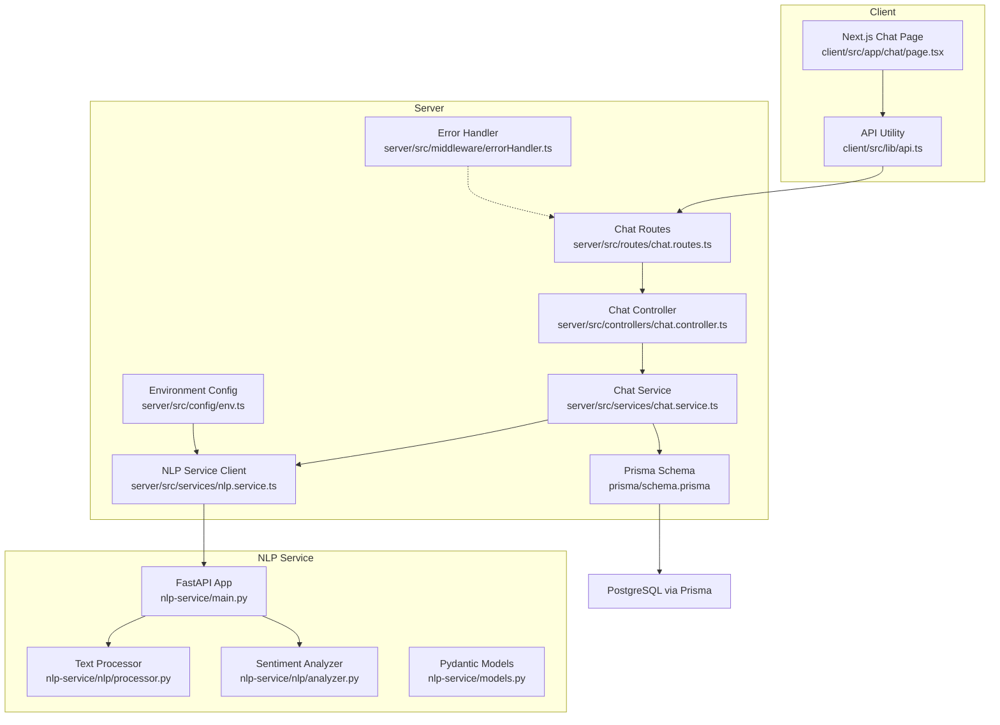
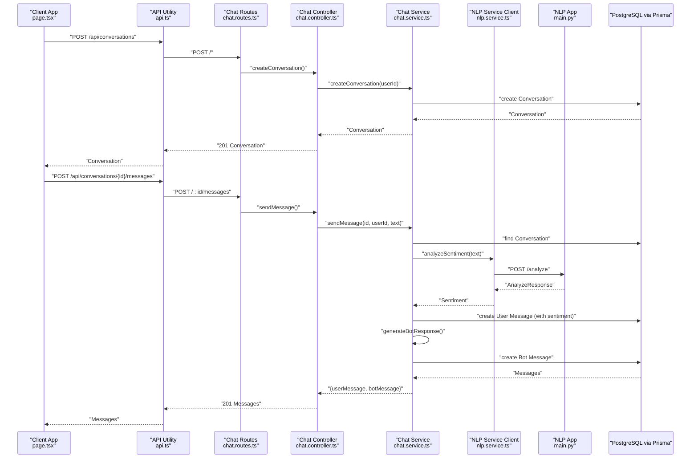
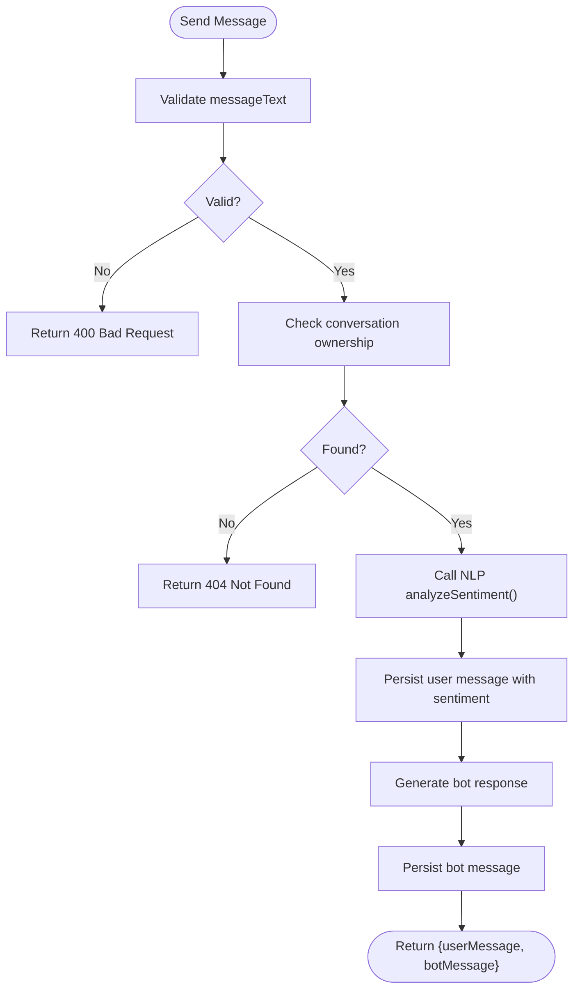
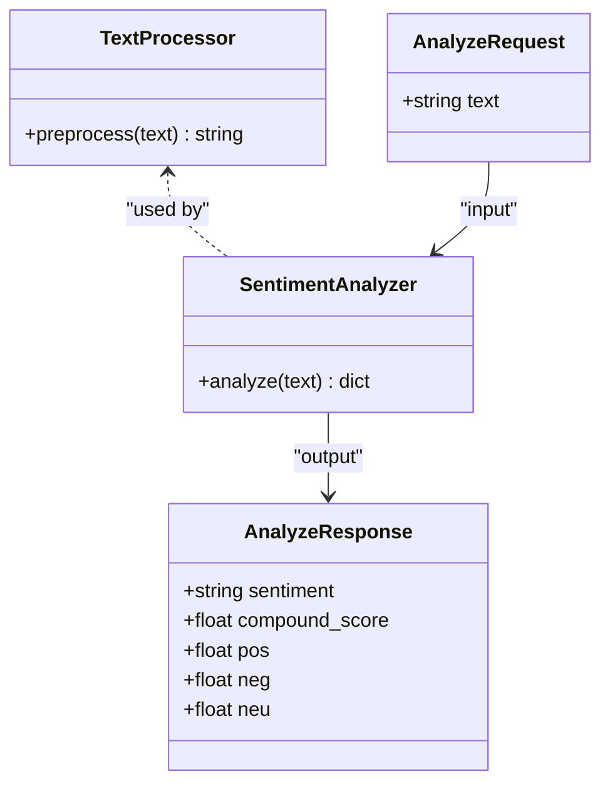
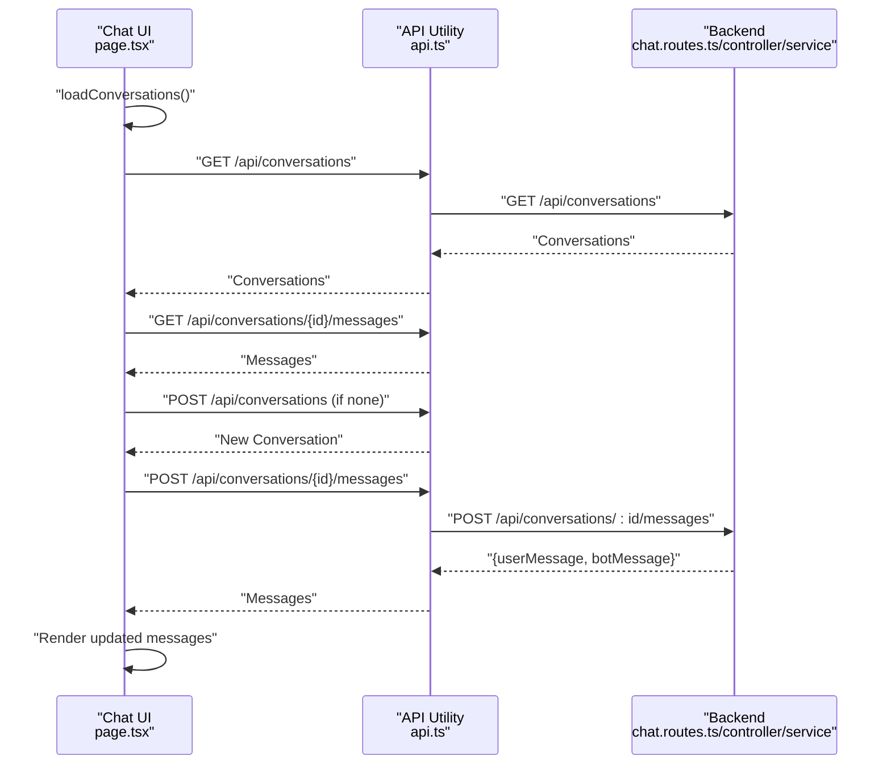
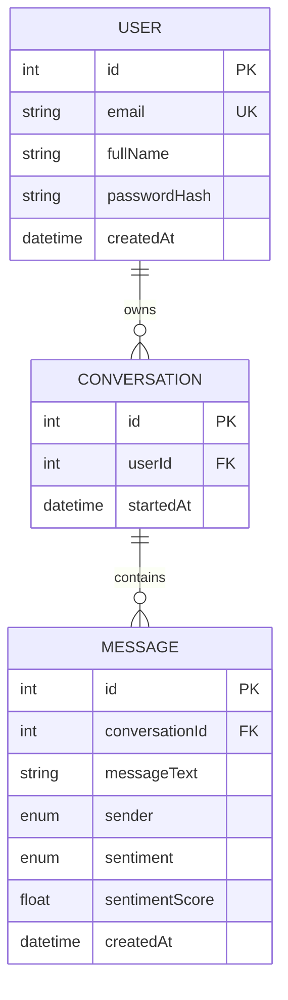
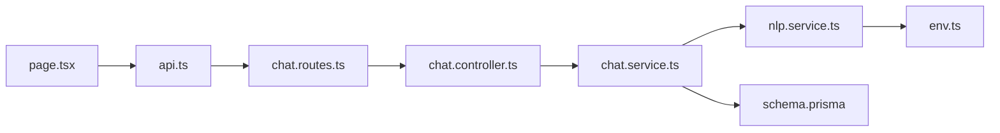

# Chat and Conversation Services

<cite>
**Referenced Files in This Document**
- [chat.controller.ts](file://server/src/controllers/chat.controller.ts)
- [chat.service.ts](file://server/src/services/chat.service.ts)
- [chat.routes.ts](file://server/src/routes/chat.routes.ts)
- [nlp.service.ts](file://server/src/services/nlp.service.ts)
- [env.ts](file://server/src/config/env.ts)
- [errorHandler.ts](file://server/src/middleware/errorHandler.ts)
- [schema.prisma](file://prisma/schema.prisma)
- [main.py](file://nlp-service/main.py)
- [analyzer.py](file://nlp-service/nlp/analyzer.py)
- [processor.py](file://nlp-service/nlp/processor.py)
- [models.py](file://nlp-service/models.py)
- [page.tsx](file://client/src/app/chat/page.tsx)
- [api.ts](file://client/src/lib/api.ts)
- [docker-compose.yml](file://docker-compose.yml)
- [requirements.txt](file://requirements.txt)
</cite>

## Table of Contents
1. [Introduction](#introduction)
2. [Project Structure](#project-structure)
3. [Core Components](#core-components)
4. [Architecture Overview](#architecture-overview)
5. [Detailed Component Analysis](#detailed-component-analysis)
6. [Dependency Analysis](#dependency-analysis)
7. [Performance Considerations](#performance-considerations)
8. [Troubleshooting Guide](#troubleshooting-guide)
9. [Conclusion](#conclusion)
10. [Appendices](#appendices)

## Introduction
This document describes the chat and conversation services powering AI-powered conversational support. It covers the conversation lifecycle (creation, retrieval, and thread organization), integration with an NLP sentiment analysis service using VADER and NLTK, complete chat endpoints, message processing workflows, contextual response generation, and conversation history management. It also includes practical examples for client integration, message formatting, interpreting NLP analysis results, and operational considerations such as persistence, encryption, and privacy.

## Project Structure
The system comprises three primary parts:
- Backend API (Express) exposing chat endpoints and orchestrating conversation and message persistence
- NLP service (FastAPI) performing VADER-based sentiment analysis
- Frontend (Next.js) implementing the chat UI and client-side API integration

**Diagram sources**
- [chat.routes.ts:1-13](file://server/src/routes/chat.routes.ts#L1-L13)
- [chat.controller.ts:1-69](file://server/src/controllers/chat.controller.ts#L1-L69)
- [chat.service.ts:1-105](file://server/src/services/chat.service.ts#L1-L105)
- [nlp.service.ts:1-24](file://server/src/services/nlp.service.ts#L1-L24)
- [schema.prisma:63-84](file://prisma/schema.prisma#L63-L84)
- [main.py:1-71](file://nlp-service/main.py#L1-L71)
- [processor.py:1-19](file://nlp-service/nlp/processor.py#L1-L19)
- [analyzer.py:1-27](file://nlp-service/nlp/analyzer.py#L1-L27)
- [models.py:1-26](file://nlp-service/models.py#L1-L26)
- [env.ts:1-12](file://server/src/config/env.ts#L1-L12)
- [errorHandler.ts:1-13](file://server/src/middleware/errorHandler.ts#L1-L13)

**Section sources**
- [chat.routes.ts:1-13](file://server/src/routes/chat.routes.ts#L1-L13)
- [chat.controller.ts:1-69](file://server/src/controllers/chat.controller.ts#L1-L69)
- [chat.service.ts:1-105](file://server/src/services/chat.service.ts#L1-L105)
- [nlp.service.ts:1-24](file://server/src/services/nlp.service.ts#L1-L24)
- [schema.prisma:63-84](file://prisma/schema.prisma#L63-L84)
- [main.py:1-71](file://nlp-service/main.py#L1-L71)
- [processor.py:1-19](file://nlp-service/nlp/processor.py#L1-L19)
- [analyzer.py:1-27](file://nlp-service/nlp/analyzer.py#L1-L27)
- [models.py:1-26](file://nlp-service/models.py#L1-L26)
- [env.ts:1-12](file://server/src/config/env.ts#L1-L12)
- [errorHandler.ts:1-13](file://server/src/middleware/errorHandler.ts#L1-L13)

## Core Components
- Conversation Management
  - Create a new conversation per user
  - List user conversations ordered by recency
  - Retrieve all messages in a conversation sorted chronologically
- Message Processing
  - Validate and sanitize incoming message text
  - Analyze sentiment using the NLP service
  - Persist user message with sentiment metadata
  - Generate and persist a contextual bot response
- NLP Integration
  - Preprocess text (tokenization, stopword removal, lowercase)
  - Compute VADER sentiment scores and classification
  - Return structured sentiment results to the backend
- Client Integration
  - Fetch existing conversations and messages
  - Create a new conversation when none exists
  - Send messages and render user/bot replies with sentiment indicators

**Section sources**
- [chat.controller.ts:5-68](file://server/src/controllers/chat.controller.ts#L5-L68)
- [chat.service.ts:26-104](file://server/src/services/chat.service.ts#L26-L104)
- [nlp.service.ts:11-23](file://server/src/services/nlp.service.ts#L11-L23)
- [main.py:43-64](file://nlp-service/main.py#L43-L64)
- [processor.py:10-18](file://nlp-service/nlp/processor.py#L10-L18)
- [analyzer.py:8-26](file://nlp-service/nlp/analyzer.py#L8-L26)
- [page.tsx:38-107](file://client/src/app/chat/page.tsx#L38-L107)

## Architecture Overview
The chat system follows a layered architecture:
- Presentation Layer: Next.js chat UI handles user input and renders messages
- API Layer: Express routes and controllers expose REST endpoints
- Service Layer: Business logic orchestrates persistence and NLP integration
- Persistence Layer: Prisma ORM with PostgreSQL stores conversations and messages
- NLP Layer: FastAPI microservice performs VADER sentiment analysis

**Diagram sources**
- [page.tsx:67-107](file://client/src/app/chat/page.tsx#L67-L107)
- [api.ts:3-35](file://client/src/lib/api.ts#L3-L35)
- [chat.routes.ts:7-10](file://server/src/routes/chat.routes.ts#L7-L10)
- [chat.controller.ts:5-68](file://server/src/controllers/chat.controller.ts#L5-L68)
- [chat.service.ts:45-89](file://server/src/services/chat.service.ts#L45-L89)
- [nlp.service.ts:11-23](file://server/src/services/nlp.service.ts#L11-L23)
- [main.py:43-58](file://nlp-service/main.py#L43-L58)
- [schema.prisma:63-84](file://prisma/schema.prisma#L63-L84)

## Detailed Component Analysis

### Conversation Management
- Create Conversation
  - Endpoint: POST /api/conversations
  - Requires authentication; creates a new conversation linked to the current user
- Get Conversations
  - Endpoint: GET /api/conversations
  - Returns user’s conversations ordered by most recent, with a preview of the latest message
- Get Messages
  - Endpoint: GET /api/conversations/:id/messages
  - Returns all messages in a conversation sorted chronologically
- Send Message
  - Endpoint: POST /api/conversations/:id/messages
  - Validates message text, verifies ownership, analyzes sentiment, persists user message, generates and persists a bot reply

**Diagram sources**
- [chat.controller.ts:33-53](file://server/src/controllers/chat.controller.ts#L33-L53)
- [chat.service.ts:45-89](file://server/src/services/chat.service.ts#L45-L89)
- [nlp.service.ts:11-23](file://server/src/services/nlp.service.ts#L11-L23)

**Section sources**
- [chat.controller.ts:5-68](file://server/src/controllers/chat.controller.ts#L5-L68)
- [chat.service.ts:26-104](file://server/src/services/chat.service.ts#L26-L104)
- [chat.routes.ts:7-10](file://server/src/routes/chat.routes.ts#L7-L10)

### NLP Sentiment Analysis Service (VADER + NLTK)
- Preprocessing
  - Lowercases text, tokenizes, removes stopwords and non-alphabetic tokens
- Analysis
  - Uses VADER intensity analyzer to compute compound, positive, negative, and neutral scores
  - Classifies sentiment as positive (> 0.05), negative (< -0.05), neutral otherwise
- API
  - Endpoint: POST /analyze
  - Accepts AnalyzeRequest, returns AnalyzeResponse
  - Includes health check endpoint GET /health

**Diagram sources**
- [processor.py:6-18](file://nlp-service/nlp/processor.py#L6-L18)
- [analyzer.py:4-26](file://nlp-service/nlp/analyzer.py#L4-L26)
- [models.py:4-21](file://nlp-service/models.py#L4-L21)

**Section sources**
- [main.py:43-64](file://nlp-service/main.py#L43-L64)
- [processor.py:10-18](file://nlp-service/nlp/processor.py#L10-L18)
- [analyzer.py:8-26](file://nlp-service/nlp/analyzer.py#L8-L26)
- [models.py:4-21](file://nlp-service/models.py#L4-L21)

### Client-Side Chat Integration
- Behavior
  - On mount, checks authentication and loads conversations
  - If no conversation exists, creates one and then loads messages
  - Sends messages via POST /api/conversations/:id/messages
  - Renders user and bot messages with timestamps and sentiment badges for user messages
- Message Formatting
  - User messages show sentiment classification badge
  - Bot messages display a typing indicator while awaiting response
- Real-time Pattern
  - Current implementation is request-response; no WebSocket is present
  - UI updates immediately after receiving the POST response

**Diagram sources**
- [page.tsx:38-107](file://client/src/app/chat/page.tsx#L38-L107)
- [api.ts:3-35](file://client/src/lib/api.ts#L3-L35)
- [chat.routes.ts:7-10](file://server/src/routes/chat.routes.ts#L7-L10)
- [chat.controller.ts:33-68](file://server/src/controllers/chat.controller.ts#L33-L68)
- [chat.service.ts:45-89](file://server/src/services/chat.service.ts#L45-L89)

**Section sources**
- [page.tsx:17-196](file://client/src/app/chat/page.tsx#L17-L196)
- [api.ts:1-36](file://client/src/lib/api.ts#L1-L36)

### Data Models and Persistence
- Conversation
  - Fields: id, userId, startedAt
  - Relationship: belongs to User; contains many Messages
- Message
  - Fields: id, conversationId, messageText, sender, sentiment?, sentimentScore?, createdAt
  - Relationships: belongs to Conversation; optionally tagged with sentiment metadata
- Enums
  - Sender: USER | BOT
  - Sentiment: POSITIVE | NEUTRAL | NEGATIVE

**Diagram sources**
- [schema.prisma:47-84](file://prisma/schema.prisma#L47-L84)

**Section sources**
- [schema.prisma:63-84](file://prisma/schema.prisma#L63-L84)

### Contextual Response Generation
- Logic
  - Maps NLP sentiment classification to a contextual bot response
  - Positive sentiment: encouraging follow-up prompt
  - Negative sentiment: empathetic acknowledgment and open-ended support offer
  - Neutral/default: welcoming and open-ended response
- Implementation
  - Sentiment and compound score are captured during message creation
  - Bot response text is persisted as a separate Message record

**Section sources**
- [chat.service.ts:15-24](file://server/src/services/chat.service.ts#L15-L24)
- [chat.service.ts:78-86](file://server/src/services/chat.service.ts#L78-L86)

## Dependency Analysis
- Backend-to-NLP
  - The backend service client calls the NLP service at /analyze
  - Environment variable controls the NLP service base URL
- Backend-to-Database
  - Prisma models define relations between User, Conversation, and Message
- NLP Service Dependencies
  - NLTK resources (punkt_tab, stopwords, vader_lexicon) are downloaded at startup
- Client-to-Backend
  - API utility injects Authorization header when available and handles 401 redirects

**Diagram sources**
- [chat.service.ts:1-1](file://server/src/services/chat.service.ts#L1-L1)
- [nlp.service.ts:11-23](file://server/src/services/nlp.service.ts#L11-L23)
- [env.ts:10-10](file://server/src/config/env.ts#L10-L10)
- [schema.prisma:63-84](file://prisma/schema.prisma#L63-L84)
- [page.tsx:5-6](file://client/src/app/chat/page.tsx#L5-L6)
- [api.ts:3-13](file://client/src/lib/api.ts#L3-L13)
- [chat.routes.ts:1-3](file://server/src/routes/chat.routes.ts#L1-L3)
- [chat.controller.ts:1-3](file://server/src/controllers/chat.controller.ts#L1-L3)

**Section sources**
- [nlp.service.ts:11-23](file://server/src/services/nlp.service.ts#L11-L23)
- [env.ts:10-10](file://server/src/config/env.ts#L10-L10)
- [schema.prisma:63-84](file://prisma/schema.prisma#L63-L84)
- [api.ts:3-13](file://client/src/lib/api.ts#L3-L13)
- [chat.routes.ts:1-3](file://server/src/routes/chat.routes.ts#L1-L3)
- [chat.controller.ts:1-3](file://server/src/controllers/chat.controller.ts#L1-L3)

## Performance Considerations
- NLP Latency
  - The backend continues without sentiment if the NLP service is unavailable, ensuring resilience
  - Consider adding retries and circuit breaker patterns for production deployments
- Message Retrieval
  - Ordering by createdAt asc ensures chronological rendering; keep pagination for long threads
- Database Scaling
  - Indexes on userId and conversationId improve lookup performance
- Client Responsiveness
  - Immediate UI updates after POST reduce perceived latency; consider optimistic UI updates for bot responses

[No sources needed since this section provides general guidance]

## Troubleshooting Guide
- Authentication Issues
  - 401 responses trigger automatic logout; verify Authorization header presence and validity
- Conversation Access
  - 404 indicates the conversation does not belong to the current user or does not exist
- NLP Service Failures
  - If NLP is down, sentiment fields will be absent; the system still persists messages and generates a default bot response
- Error Handling Middleware
  - Centralized handler returns standardized error payloads with appropriate status codes

**Section sources**
- [api.ts:20-26](file://client/src/lib/api.ts#L20-L26)
- [chat.service.ts:50-52](file://server/src/services/chat.service.ts#L50-L52)
- [errorHandler.ts:7-12](file://server/src/middleware/errorHandler.ts#L7-L12)

## Conclusion
The chat and conversation services provide a robust foundation for AI-powered conversational support. They integrate seamlessly with a VADER-based NLP service, persist conversations and messages with sentiment metadata, and deliver contextual bot responses. The frontend offers a responsive chat experience with immediate feedback. Operational improvements such as WebSocket real-time updates, message encryption, and stricter privacy controls can further enhance the system for production use.

[No sources needed since this section summarizes without analyzing specific files]

## Appendices

### API Endpoints and Schemas
- Create Conversation
  - Method: POST
  - Path: /api/conversations
  - Auth: Required
  - Response: Conversation object
- Get Conversations
  - Method: GET
  - Path: /api/conversations
  - Auth: Required
  - Response: Array of Conversation objects (each includes latest Message preview)
- Send Message
  - Method: POST
  - Path: /api/conversations/:id/messages
  - Auth: Required
  - Request Body: { messageText: string }
  - Response: { userMessage: Message, botMessage: Message }
- Get Messages
  - Method: GET
  - Path: /api/conversations/:id/messages
  - Auth: Required
  - Response: Array of Message objects ordered by createdAt asc

**Section sources**
- [chat.routes.ts:7-10](file://server/src/routes/chat.routes.ts#L7-L10)
- [chat.controller.ts:5-68](file://server/src/controllers/chat.controller.ts#L5-L68)
- [chat.service.ts:26-104](file://server/src/services/chat.service.ts#L26-L104)

### NLP Service Endpoints and Schemas
- Analyze Sentiment
  - Method: POST
  - Path: /analyze
  - Request: AnalyzeRequest { text: string }
  - Response: AnalyzeResponse { sentiment: "positive"|"neutral"|"negative", compound_score: number, pos: number, neg: number, neu: number }
- Health Check
  - Method: GET
  - Path: /health
  - Response: HealthResponse { status: string, service: string }

**Section sources**
- [main.py:43-64](file://nlp-service/main.py#L43-L64)
- [models.py:4-21](file://nlp-service/models.py#L4-L21)

### Practical Examples
- Client Integration
  - Use the API utility to call endpoints and handle errors
  - Render messages with sender-specific styling and sentiment badges for user messages
- Message Formatting
  - Ensure messageText is trimmed and validated before sending
  - Display timestamps and bot typing indicator during processing
- Interpreting NLP Results
  - compound_score near 1.0 indicates strong positive sentiment; near -1.0 indicates strong negative sentiment
  - Use sentiment classification to tailor contextual responses

**Section sources**
- [page.tsx:55-107](file://client/src/app/chat/page.tsx#L55-L107)
- [analyzer.py:13-18](file://nlp-service/nlp/analyzer.py#L13-L18)

### Privacy and Security Considerations
- Data at Rest
  - PostgreSQL holds sensitive conversation data; ensure secure storage and backups
- Transport Security
  - Use HTTPS in production; configure TLS for both backend and NLP service
- Authentication and Authorization
  - Enforce bearer tokens and verify conversation ownership on all mutation endpoints
- Data Retention and Deletion
  - Implement policies for automated deletion of old conversations and messages
- Client-Side Storage
  - Avoid storing sensitive data in local storage; rely on server-side sessions/tokens

[No sources needed since this section provides general guidance]

### Operational Notes
- Database Setup
  - PostgreSQL is provisioned via Docker Compose; ensure DATABASE_URL is configured
- NLP Service Deployment
  - NLTK resources are downloaded at startup; ensure persistent volume for cached data
- Environment Variables
  - Configure NLP_SERVICE_URL, JWT_SECRET, and DATABASE_URL appropriately

**Section sources**
- [docker-compose.yml:1-19](file://docker-compose.yml#L1-L19)
- [main.py:9-27](file://nlp-service/main.py#L9-L27)
- [env.ts:6-11](file://server/src/config/env.ts#L6-L11)
- [requirements.txt:35-40](file://requirements.txt#L35-L40)