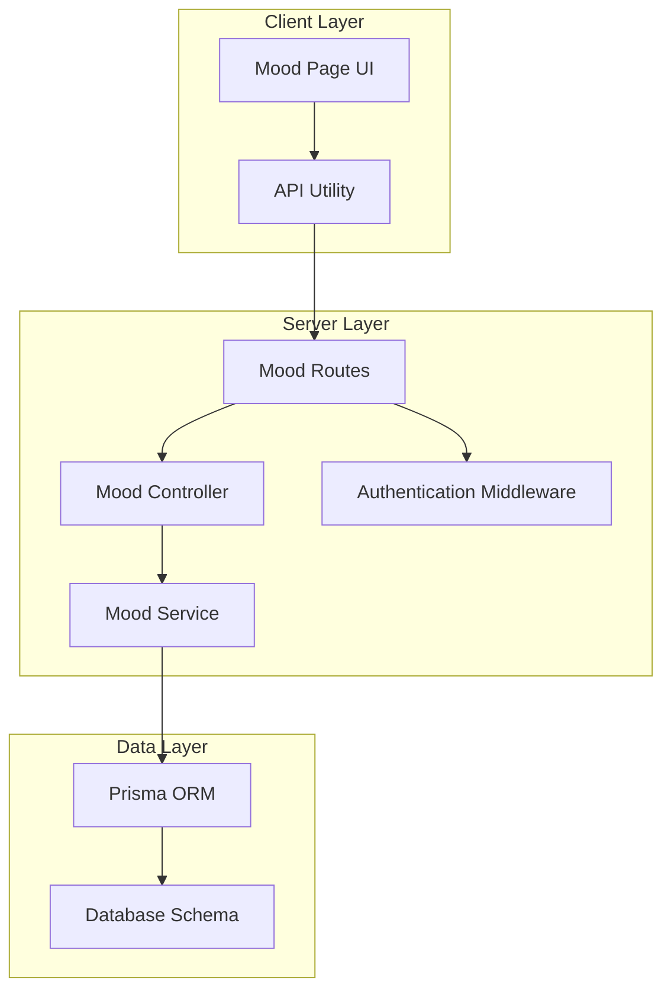
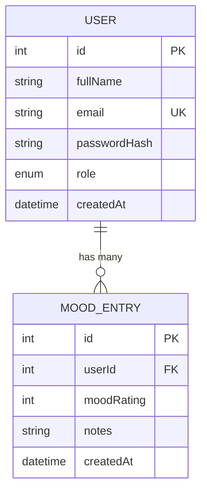
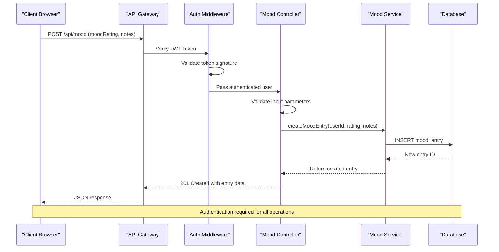
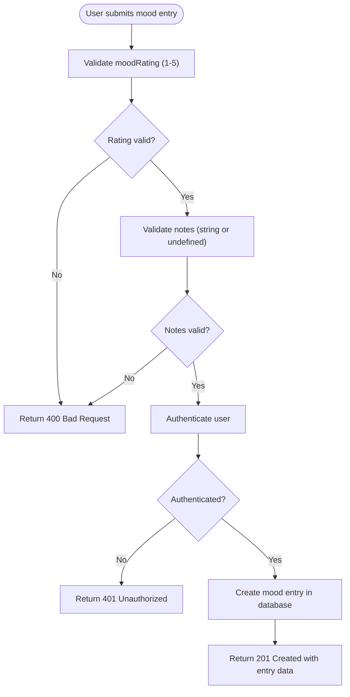
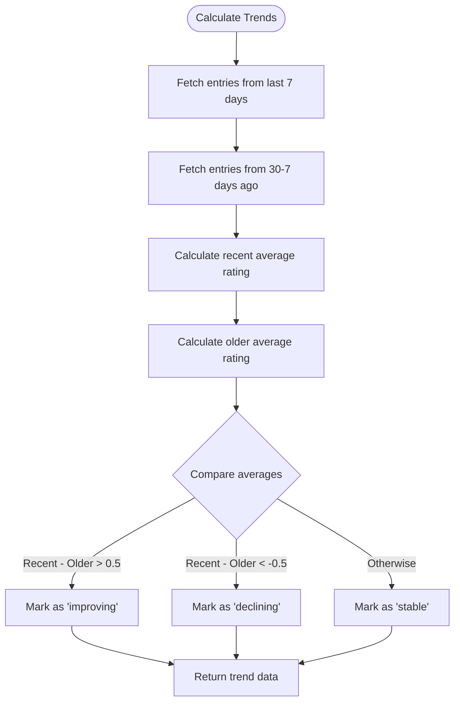
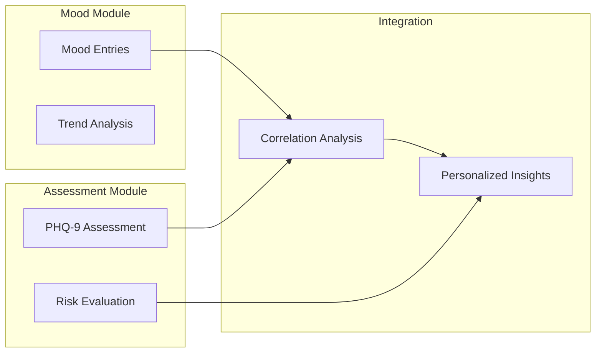
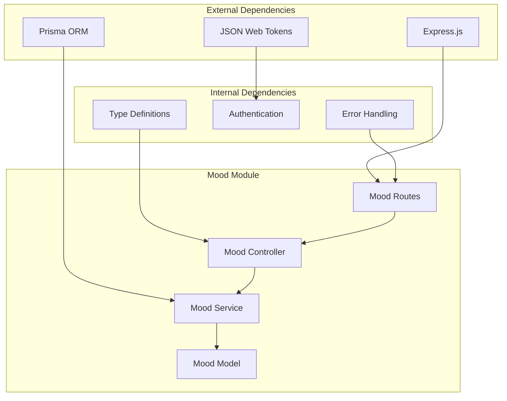

# Mood Tracking Services

<cite>
**Referenced Files in This Document**
- [mood.controller.ts](file://server/src/controllers/mood.controller.ts)
- [mood.service.ts](file://server/src/services/mood.service.ts)
- [mood.routes.ts](file://server/src/routes/mood.routes.ts)
- [page.tsx](file://client/src/app/mood/page.tsx)
- [api.ts](file://client/src/lib/api.ts)
- [auth.ts](file://server/src/middleware/auth.ts)
- [types/index.ts](file://server/src/types/index.ts)
- [schema.prisma](file://prisma/schema.prisma)
- [mood.test.ts](file://server/src/__tests__/mood.test.ts)
- [risk.service.ts](file://server/src/services/risk.service.ts)
- [token.ts](file://server/src/utils/token.ts)
- [errorHandler.ts](file://server/src/middleware/errorHandler.ts)
</cite>

## Table of Contents
1. [Introduction](#introduction)
2. [Project Structure](#project-structure)
3. [Core Components](#core-components)
4. [Architecture Overview](#architecture-overview)
5. [Detailed Component Analysis](#detailed-component-analysis)
6. [Dependency Analysis](#dependency-analysis)
7. [Performance Considerations](#performance-considerations)
8. [Troubleshooting Guide](#troubleshooting-guide)
9. [Conclusion](#conclusion)

## Introduction
This document provides comprehensive documentation for the mood tracking services within the BuddyAI platform. The system enables students to log daily mood entries on a 1-5 scale, view historical records, and receive automated trend analysis. The backend implements robust validation, authentication, and data persistence using Prisma ORM, while the frontend offers an intuitive interface for mood recording and trend visualization.

## Project Structure
The mood tracking functionality spans three primary layers:
- Frontend (Next.js): Provides the user interface for mood logging, history display, and trend visualization
- Backend (Express): Implements REST endpoints for mood management with authentication middleware
- Database (Prisma): Manages mood entries, user relationships, and integrates with assessment data

**Diagram sources**
- [mood.routes.ts:1-12](file://server/src/routes/mood.routes.ts#L1-L12)
- [mood.controller.ts:1-67](file://server/src/controllers/mood.controller.ts#L1-L67)
- [mood.service.ts:1-58](file://server/src/services/mood.service.ts#L1-L58)
- [schema.prisma:86-95](file://prisma/schema.prisma#L86-L95)

**Section sources**
- [mood.routes.ts:1-12](file://server/src/routes/mood.routes.ts#L1-L12)
- [mood.controller.ts:1-67](file://server/src/controllers/mood.controller.ts#L1-L67)
- [mood.service.ts:1-58](file://server/src/services/mood.service.ts#L1-L58)
- [schema.prisma:86-95](file://prisma/schema.prisma#L86-L95)

## Core Components
The mood tracking system consists of several interconnected components that work together to provide a seamless user experience:

### Data Model
The system uses a straightforward yet effective data model centered around the MoodEntry entity:

**Diagram sources**
- [schema.prisma:47-61](file://prisma/schema.prisma#L47-L61)
- [schema.prisma:86-95](file://prisma/schema.prisma#L86-L95)

### Frontend Interface
The client-side implementation provides:
- Interactive mood rating selection with emoji-based visual feedback
- Real-time trend analysis display with directional indicators
- Comprehensive mood history with chronological sorting
- Responsive design supporting various screen sizes

### Backend Services
The server implements:
- Authentication middleware enforcing JWT-based access control
- Validation layer ensuring data integrity and business rules compliance
- Service layer encapsulating database operations and trend calculations
- RESTful API endpoints following standard HTTP conventions

**Section sources**
- [schema.prisma:86-95](file://prisma/schema.prisma#L86-L95)
- [page.tsx:1-245](file://client/src/app/mood/page.tsx#L1-L245)
- [auth.ts:1-39](file://server/src/middleware/auth.ts#L1-L39)

## Architecture Overview
The mood tracking architecture follows a clean separation of concerns with clear boundaries between presentation, business logic, and data access layers:

**Diagram sources**
- [mood.controller.ts:5-34](file://server/src/controllers/mood.controller.ts#L5-L34)
- [mood.service.ts:3-7](file://server/src/services/mood.service.ts#L3-L7)
- [auth.ts:5-22](file://server/src/middleware/auth.ts#L5-L22)

The architecture ensures:
- **Security**: All endpoints require valid authentication tokens
- **Validation**: Input validation occurs at the controller level
- **Data Integrity**: Database constraints prevent invalid data
- **Scalability**: Clear separation allows independent scaling of components

## Detailed Component Analysis

### Mood Entry Management System
The mood entry management system handles the complete lifecycle of mood records:

#### Creation Workflow

**Diagram sources**
- [mood.controller.ts:12-30](file://server/src/controllers/mood.controller.ts#L12-L30)
- [mood.service.ts:3-7](file://server/src/services/mood.service.ts#L3-L7)

#### Modification and Deletion Operations
While the current implementation focuses on creation and retrieval, the underlying Prisma model supports full CRUD operations. The service layer can be extended to include update and delete functionality by adding corresponding methods and controller endpoints.

**Section sources**
- [mood.controller.ts:1-67](file://server/src/controllers/mood.controller.ts#L1-L67)
- [mood.service.ts:1-58](file://server/src/services/mood.service.ts#L1-L58)

### Mood Tracking Endpoints
The system exposes three primary endpoints for mood management:

#### Endpoint Definitions
| Method | Path | Purpose | Authentication |
|--------|------|---------|----------------|
| POST | `/api/mood` | Create new mood entry | Required |
| GET | `/api/mood` | Retrieve mood history | Required |
| GET | `/api/mood/trends` | Get trend analysis | Required |

#### Request/Response Specifications
**POST /api/mood**
- Request Body: `{ moodRating: number, notes?: string }`
- Validation: Integer between 1-5, optional notes string
- Response: Complete mood entry object with metadata

**GET /api/mood**
- Query Parameters: `startDate?`, `endDate?` (ISO dates)
- Response: Array of mood entries ordered by creation date (newest first)

**GET /api/mood/trends**
- Response: `{ recentAverage: number, thirtyDayAverage: number, direction: string, totalEntries: number }`

#### Temporal Organization
The system organizes mood data by creation timestamp with automatic descending order for history retrieval. Trend analysis compares recent entries (last 7 days) against older entries (30 days ago to 7 days ago).

**Section sources**
- [mood.routes.ts:7-9](file://server/src/routes/mood.routes.ts#L7-L9)
- [mood.controller.ts:36-66](file://server/src/controllers/mood.controller.ts#L36-L66)
- [mood.service.ts:9-57](file://server/src/services/mood.service.ts#L9-L57)

### Trend Analysis Algorithms
The trend analysis system implements a sophisticated comparison mechanism:

#### Trend Calculation Logic

**Diagram sources**
- [mood.service.ts:22-57](file://server/src/services/mood.service.ts#L22-L57)

#### Statistical Reporting
The trend analysis provides:
- **Recent Average**: Mean of ratings from the past 7 days
- **Thirty-Day Average**: Mean of ratings from 30-7 days ago
- **Direction Classification**: Improving, Declining, Stable, or Insufficient Data
- **Total Entries**: Count of analyzed entries

**Section sources**
- [mood.service.ts:22-57](file://server/src/services/mood.service.ts#L22-L57)
- [mood.test.ts:54-132](file://server/src/__tests__/mood.test.ts#L54-L132)

### Privacy and Security Features
The system implements comprehensive security measures:

#### Authentication Mechanism
- JWT-based authentication with 24-hour expiration
- Bearer token validation in Authorization headers
- Role-based access control (Student/Counsellor)
- Automatic token refresh and session management

#### Data Protection
- All endpoints require authentication
- User-specific data isolation through foreign key relationships
- Secure token storage in browser localStorage
- Error handling prevents sensitive information leakage

**Section sources**
- [auth.ts:5-22](file://server/src/middleware/auth.ts#L5-L22)
- [token.ts:10-16](file://server/src/utils/token.ts#L10-L16)
- [api.ts:11-13](file://client/src/lib/api.ts#L11-L13)

### Integration with Assessment Results
The mood tracking system integrates seamlessly with the broader assessment framework:

#### Cross-Module Dependencies

**Diagram sources**
- [risk.service.ts:11-107](file://server/src/services/risk.service.ts#L11-L107)
- [mood.service.ts:22-57](file://server/src/services/mood.service.ts#L22-L57)

#### Correlation Analysis Capabilities
The integrated system can analyze relationships between:
- PHQ-9 scores and mood trends
- Sentiment patterns and mood fluctuations
- External factors and psychological state changes

**Section sources**
- [risk.service.ts:11-107](file://server/src/services/risk.service.ts#L11-L107)

## Dependency Analysis
The mood tracking system exhibits strong modularity with clear dependency relationships:

**Diagram sources**
- [mood.routes.ts:1-12](file://server/src/routes/mood.routes.ts#L1-L12)
- [mood.controller.ts:1-3](file://server/src/controllers/mood.controller.ts#L1-L3)
- [mood.service.ts](file://server/src/services/mood.service.ts#L1)

### Cohesion and Coupling
- **High Cohesion**: Each module focuses on a specific aspect (routing, validation, persistence)
- **Low Coupling**: Clear interfaces between components minimize dependencies
- **Single Responsibility**: Each component has a well-defined purpose

**Section sources**
- [mood.routes.ts:1-12](file://server/src/routes/mood.routes.ts#L1-L12)
- [mood.controller.ts:1-67](file://server/src/controllers/mood.controller.ts#L1-L67)
- [mood.service.ts:1-58](file://server/src/services/mood.service.ts#L1-L58)

## Performance Considerations
The mood tracking system is designed for optimal performance and scalability:

### Database Optimization
- Indexes on user_id and creation timestamps for efficient querying
- Efficient pagination through cursor-based approaches
- Batch operations for bulk data retrieval

### API Performance
- Lightweight request/response payloads
- Efficient trend calculation algorithms
- Caching opportunities for frequently accessed data

### Frontend Optimization
- Lazy loading for non-critical components
- Efficient rendering of large datasets
- Optimized state management

## Troubleshooting Guide

### Common Issues and Solutions

#### Authentication Problems
**Symptoms**: 401 Unauthorized responses
**Causes**: Missing/expired tokens, invalid token format
**Solutions**: 
- Verify token presence in localStorage
- Check token expiration (24-hour limit)
- Ensure proper Bearer token format

#### Validation Errors
**Symptoms**: 400 Bad Request responses
**Causes**: Invalid mood rating, malformed notes
**Solutions**:
- Ensure mood rating is integer between 1-5
- Verify notes field is string or undefined
- Check request payload structure

#### Database Connectivity
**Symptoms**: Internal server errors
**Causes**: Database connection failures
**Solutions**:
- Verify DATABASE_URL environment variable
- Check PostgreSQL server availability
- Review Prisma client configuration

**Section sources**
- [errorHandler.ts:7-12](file://server/src/middleware/errorHandler.ts#L7-L12)
- [api.ts:20-35](file://client/src/lib/api.ts#L20-L35)

### Debugging Strategies
1. **Frontend Debugging**: Use browser developer tools to inspect API requests
2. **Backend Logging**: Enable detailed logging for authentication and validation
3. **Database Queries**: Monitor Prisma query execution times
4. **Network Analysis**: Verify token transmission and response handling

## Conclusion
The mood tracking services provide a robust foundation for mental health monitoring within the BuddyAI platform. The system successfully balances user experience with technical excellence, offering:

- **Intuitive User Interface**: Easy-to-use mood rating and visualization
- **Robust Backend Architecture**: Secure, scalable, and maintainable
- **Advanced Analytics**: Meaningful trend analysis and insights
- **Seamless Integration**: Cohesive operation with assessment and risk evaluation systems

The modular design enables future enhancements such as seasonal pattern analysis, correlation studies with external factors, and advanced visualization capabilities. The comprehensive validation, authentication, and error handling mechanisms ensure reliable operation in production environments.

Future development opportunities include expanding the mood scale, implementing advanced analytics, adding export capabilities, and integrating with wearable devices for automated mood tracking.