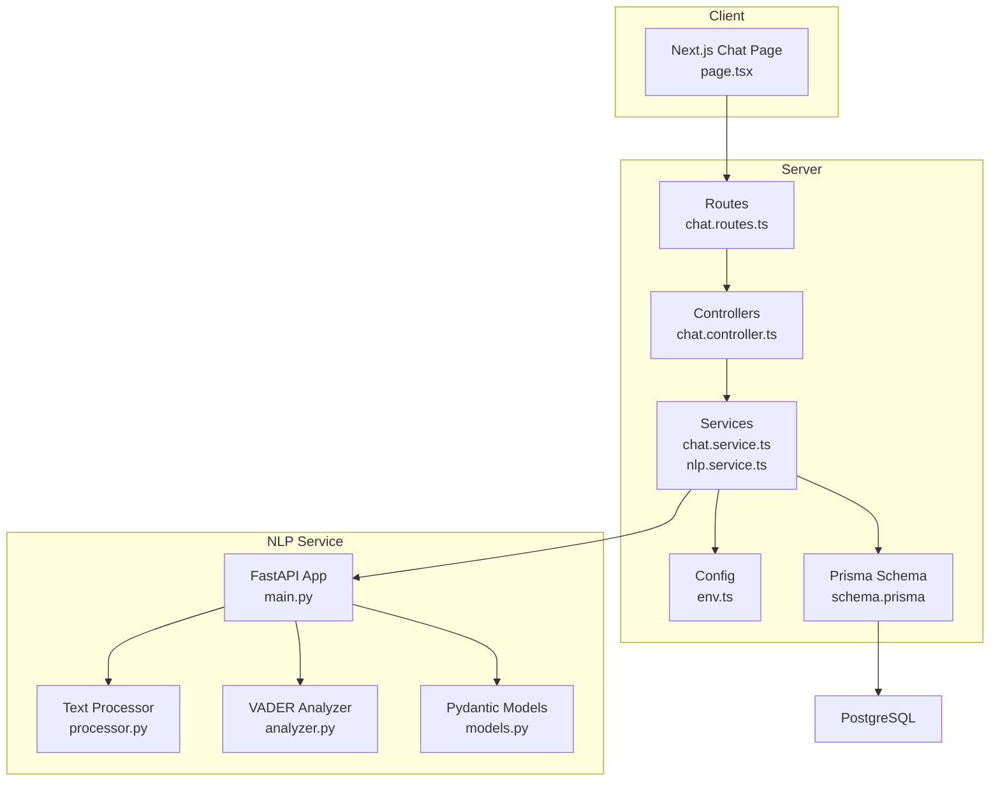
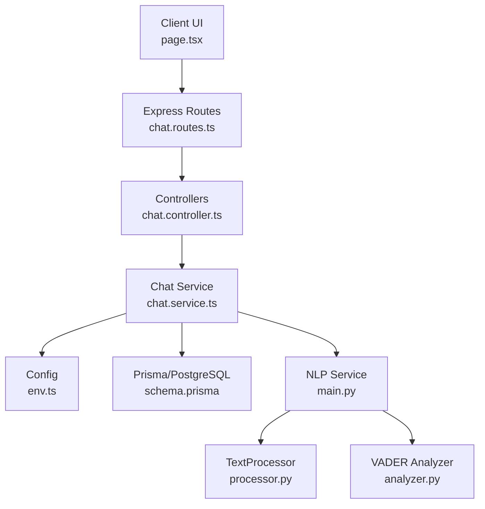
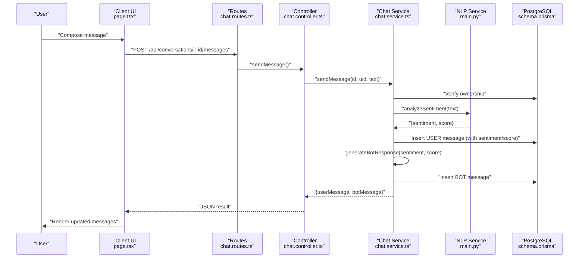
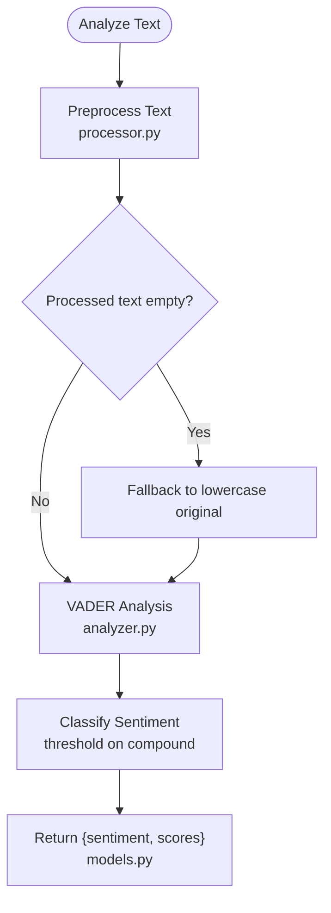
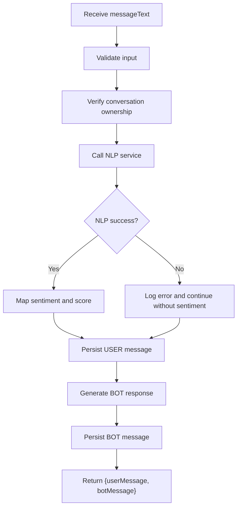
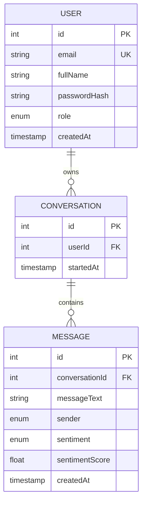
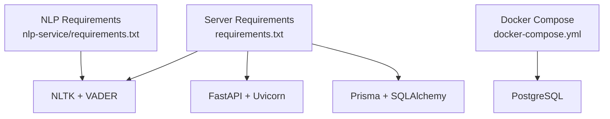

# Chat and Conversation System

<cite>
**Referenced Files in This Document**
- [chat.controller.ts](file://server/src/controllers/chat.controller.ts)
- [chat.service.ts](file://server/src/services/chat.service.ts)
- [nlp.service.ts](file://server/src/services/nlp.service.ts)
- [chat.routes.ts](file://server/src/routes/chat.routes.ts)
- [env.ts](file://server/src/config/env.ts)
- [page.tsx](file://client/src/app/chat/page.tsx)
- [main.py](file://nlp-service/main.py)
- [analyzer.py](file://nlp-service/nlp/analyzer.py)
- [processor.py](file://nlp-service/nlp/processor.py)
- [models.py](file://nlp-service/models.py)
- [schema.prisma](file://prisma/schema.prisma)
- [docker-compose.yml](file://docker-compose.yml)
- [requirements.txt](file://requirements.txt)
- [nlp-service requirements.txt](file://nlp-service/requirements.txt)
</cite>

## Table of Contents
1. [Introduction](#introduction)
2. [Project Structure](#project-structure)
3. [Core Components](#core-components)
4. [Architecture Overview](#architecture-overview)
5. [Detailed Component Analysis](#detailed-component-analysis)
6. [Dependency Analysis](#dependency-analysis)
7. [Performance Considerations](#performance-considerations)
8. [Troubleshooting Guide](#troubleshooting-guide)
9. [Conclusion](#conclusion)
10. [Appendices](#appendices)

## Introduction
This document explains the chat and conversation system powering the AI-powered conversational interface. It covers session creation, message handling, context preservation, NLP integration with NLTK and VADER for sentiment analysis, message flow from user input through preprocessing and response generation, conversation persistence with sentiment scores and timestamps, and real-time communication patterns. Practical examples illustrate conversation flow, sentiment-based response generation, and context-aware dialogue management. Guidance is also provided for performance optimization, error handling for NLP failures, and scalability considerations for concurrent conversations.

## Project Structure
The system comprises three primary parts:
- Frontend chat UI built with Next.js and React
- Backend REST API written in TypeScript/Node.js using Express
- NLP microservice written in Python/FastAPI using NLTK/VADER

**Diagram sources**
- [page.tsx:1-196](file://client/src/app/chat/page.tsx#L1-L196)
- [chat.routes.ts:1-13](file://server/src/routes/chat.routes.ts#L1-L13)
- [chat.controller.ts:1-69](file://server/src/controllers/chat.controller.ts#L1-L69)
- [chat.service.ts:1-105](file://server/src/services/chat.service.ts#L1-L105)
- [nlp.service.ts:1-24](file://server/src/services/nlp.service.ts#L1-L24)
- [env.ts:1-12](file://server/src/config/env.ts#L1-L12)
- [schema.prisma:1-134](file://prisma/schema.prisma#L1-L134)
- [main.py:1-71](file://nlp-service/main.py#L1-L71)
- [processor.py:1-19](file://nlp-service/nlp/processor.py#L1-L19)
- [analyzer.py:1-27](file://nlp-service/nlp/analyzer.py#L1-L27)
- [models.py:1-26](file://nlp-service/models.py#L1-L26)

**Section sources**
- [page.tsx:1-196](file://client/src/app/chat/page.tsx#L1-L196)
- [chat.routes.ts:1-13](file://server/src/routes/chat.routes.ts#L1-L13)
- [chat.controller.ts:1-69](file://server/src/controllers/chat.controller.ts#L1-L69)
- [chat.service.ts:1-105](file://server/src/services/chat.service.ts#L1-L105)
- [nlp.service.ts:1-24](file://server/src/services/nlp.service.ts#L1-L24)
- [env.ts:1-12](file://server/src/config/env.ts#L1-L12)
- [schema.prisma:1-134](file://prisma/schema.prisma#L1-L134)
- [main.py:1-71](file://nlp-service/main.py#L1-L71)
- [processor.py:1-19](file://nlp-service/nlp/processor.py#L1-L19)
- [analyzer.py:1-27](file://nlp-service/nlp/analyzer.py#L1-L27)
- [models.py:1-26](file://nlp-service/models.py#L1-L26)

## Core Components
- Client-side chat UI: Handles conversation loading, message composition, and rendering with sentiment indicators.
- Server routes: Expose REST endpoints for creating conversations, listing conversations, sending messages, and retrieving messages.
- Controllers: Enforce authentication and delegate to services.
- Services:
  - Chat service: Manages conversation lifecycle, persists messages with sentiment metadata, and generates bot responses based on sentiment.
  - NLP service: Invokes the external NLP service for sentiment analysis.
- NLP service: Preprocesses text and performs VADER sentiment analysis, returning normalized scores and classifications.
- Persistence: Prisma schema defines Conversation and Message entities with indexes and enums for roles, sender types, and sentiments.

Key responsibilities:
- Session creation and retrieval
- Message validation and persistence
- Context preservation across messages
- Sentiment-aware response generation
- NLP integration and fallback handling
- Real-time-like UX via polling and optimistic updates

**Section sources**
- [page.tsx:17-107](file://client/src/app/chat/page.tsx#L17-L107)
- [chat.routes.ts:7-10](file://server/src/routes/chat.routes.ts#L7-L10)
- [chat.controller.ts:5-68](file://server/src/controllers/chat.controller.ts#L5-L68)
- [chat.service.ts:26-104](file://server/src/services/chat.service.ts#L26-L104)
- [nlp.service.ts:11-23](file://server/src/services/nlp.service.ts#L11-L23)
- [schema.prisma:63-84](file://prisma/schema.prisma#L63-L84)
- [main.py:43-64](file://nlp-service/main.py#L43-L64)
- [processor.py:10-18](file://nlp-service/nlp/processor.py#L10-L18)
- [analyzer.py:8-26](file://nlp-service/nlp/analyzer.py#L8-L26)

## Architecture Overview
The system follows a layered architecture:
- Presentation layer: Next.js chat page
- Application layer: Express routes, controllers, and services
- Domain/persistence layer: Prisma ORM and PostgreSQL
- External service layer: NLP microservice

**Diagram sources**
- [page.tsx:1-196](file://client/src/app/chat/page.tsx#L1-L196)
- [chat.routes.ts:1-13](file://server/src/routes/chat.routes.ts#L1-L13)
- [chat.controller.ts:1-69](file://server/src/controllers/chat.controller.ts#L1-L69)
- [chat.service.ts:1-105](file://server/src/services/chat.service.ts#L1-L105)
- [env.ts:1-12](file://server/src/config/env.ts#L1-L12)
- [schema.prisma:1-134](file://prisma/schema.prisma#L1-L134)
- [main.py:1-71](file://nlp-service/main.py#L1-L71)
- [processor.py:1-19](file://nlp-service/nlp/processor.py#L1-L19)
- [analyzer.py:1-27](file://nlp-service/nlp/analyzer.py#L1-L27)

## Detailed Component Analysis

### Conversation Management
Conversation lifecycle:
- Creation: POST /api/conversations creates a new conversation linked to the authenticated user.
- Listing: GET /api/conversations lists user conversations, with the most recent message preview.
- Sending: POST /api/conversations/:id/messages validates input, analyzes sentiment, stores user message, generates and stores a bot reply.
- Retrieval: GET /api/conversations/:id/messages returns all messages in chronological order.

**Diagram sources**
- [page.tsx:55-107](file://client/src/app/chat/page.tsx#L55-L107)
- [chat.routes.ts:9-10](file://server/src/routes/chat.routes.ts#L9-L10)
- [chat.controller.ts:33-53](file://server/src/controllers/chat.controller.ts#L33-L53)
- [chat.service.ts:45-89](file://server/src/services/chat.service.ts#L45-L89)
- [nlp.service.ts:11-23](file://server/src/services/nlp.service.ts#L11-L23)
- [main.py:43-58](file://nlp-service/main.py#L43-L58)
- [schema.prisma:73-84](file://prisma/schema.prisma#L73-L84)

**Section sources**
- [chat.controller.ts:5-68](file://server/src/controllers/chat.controller.ts#L5-L68)
- [chat.service.ts:26-104](file://server/src/services/chat.service.ts#L26-L104)
- [chat.routes.ts:7-10](file://server/src/routes/chat.routes.ts#L7-L10)
- [page.tsx:38-107](file://client/src/app/chat/page.tsx#L38-L107)

### NLP Integration: Text Processing and Sentiment Analysis
- Text preprocessing: Lowercasing, tokenization, removal of stopwords and non-alphabetic tokens, and rejoining for analysis.
- Sentiment analysis: VADER polarity scoring with compound thresholding to classify sentiment as positive, neutral, or negative.
- API contract: Request model requires non-empty text; response model includes sentiment label and scores.

**Diagram sources**
- [main.py:43-58](file://nlp-service/main.py#L43-L58)
- [processor.py:10-18](file://nlp-service/nlp/processor.py#L10-L18)
- [analyzer.py:8-26](file://nlp-service/nlp/analyzer.py#L8-L26)
- [models.py:15-21](file://nlp-service/models.py#L15-L21)

**Section sources**
- [main.py:9-27](file://nlp-service/main.py#L9-L27)
- [processor.py:6-18](file://nlp-service/nlp/processor.py#L6-L18)
- [analyzer.py:4-26](file://nlp-service/nlp/analyzer.py#L4-L26)
- [models.py:4-21](file://nlp-service/models.py#L4-L21)

### Message Flow and Context Preservation
- Validation: Rejects missing or empty message text.
- Ownership verification: Ensures the conversation belongs to the authenticated user.
- Sentiment pipeline: Calls NLP service; on failure, logs and continues without sentiment metadata.
- Persistence: Stores user message with sentiment and score; generates a contextually appropriate bot response and persists it.
- Retrieval: Returns messages ordered chronologically to preserve conversation context.

**Diagram sources**
- [chat.controller.ts:43-46](file://server/src/controllers/chat.controller.ts#L43-L46)
- [chat.service.ts:47-89](file://server/src/services/chat.service.ts#L47-L89)
- [nlp.service.ts:11-23](file://server/src/services/nlp.service.ts#L11-L23)

**Section sources**
- [chat.controller.ts:43-46](file://server/src/controllers/chat.controller.ts#L43-L46)
- [chat.service.ts:54-89](file://server/src/services/chat.service.ts#L54-L89)

### Conversation Persistence Layer
- Entities:
  - Conversation: linked to User, indexed by userId, with a startedAt timestamp.
  - Message: linked to Conversation, includes messageText, sender, optional sentiment and sentimentScore, and createdAt.
- Enums:
  - Sender: USER or BOT
  - Sentiment: POSITIVE, NEUTRAL, NEGATIVE
- Indexes: conversationId on Message and userId on Conversation for efficient queries.

**Diagram sources**
- [schema.prisma:47-84](file://prisma/schema.prisma#L47-L84)

**Section sources**
- [schema.prisma:63-84](file://prisma/schema.prisma#L63-L84)

### Real-Time Communication Patterns and Message Queuing
Current implementation:
- Client uses optimistic UI updates: immediately appends user and bot messages upon successful POST to improve perceived latency.
- Polling-style retrieval: Loads conversations and messages on mount and after sending a message.
- No WebSocket or message queue: The system relies on HTTP requests and client-side state management.

Recommendations for real-time enhancements:
- Introduce WebSocket connections for live message delivery and typing indicators.
- Implement a message queue (e.g., Redis) to decouple message ingestion and processing for high concurrency.
- Add deduplication and idempotency keys for reliable message delivery.

**Section sources**
- [page.tsx:55-107](file://client/src/app/chat/page.tsx#L55-L107)

### Practical Examples

#### Example 1: Conversation Flow
- User composes a message and submits.
- Backend validates input, verifies ownership, and calls the NLP service.
- On success, the backend persists the user message with sentiment metadata and generates a bot response based on sentiment.
- The client renders both messages and scrolls to the latest.

**Section sources**
- [page.tsx:55-107](file://client/src/app/chat/page.tsx#L55-L107)
- [chat.controller.ts:33-53](file://server/src/controllers/chat.controller.ts#L33-L53)
- [chat.service.ts:45-89](file://server/src/services/chat.service.ts#L45-L89)

#### Example 2: Sentiment-Based Response Generation
- Positive sentiment triggers an encouraging response.
- Negative sentiment triggers an empathetic response with options to talk or receive coping strategies.
- Neutral sentiment triggers a supportive open-ended response.

**Section sources**
- [chat.service.ts:15-24](file://server/src/services/chat.service.ts#L15-L24)

#### Example 3: Context-Aware Dialogue Management
- Retrieving messages in ascending chronological order ensures the UI and future logic can rely on a coherent conversation history.
- Ownership checks prevent cross-user access to messages.

**Section sources**
- [chat.service.ts:91-104](file://server/src/services/chat.service.ts#L91-L104)

## Dependency Analysis
External dependencies and integrations:
- NLP service depends on NLTK datasets (punkt_tab, stopwords, vader_lexicon) and FastAPI.
- Server depends on Prisma for database operations and environment configuration for NLP service URL.
- Docker Compose provisions a local PostgreSQL instance for development.

**Diagram sources**
- [requirements.txt:1-68](file://requirements.txt#L1-L68)
- [nlp-service requirements.txt:1-6](file://nlp-service/requirements.txt#L1-L6)
- [docker-compose.yml:1-19](file://docker-compose.yml#L1-L19)

**Section sources**
- [requirements.txt:35-40](file://requirements.txt#L35-L40)
- [nlp-service requirements.txt:1-6](file://nlp-service/requirements.txt#L1-L6)
- [docker-compose.yml:4-15](file://docker-compose.yml#L4-L15)

## Performance Considerations
- Asynchronous processing: Offload sentiment analysis to the NLP service to avoid blocking the main thread.
- Caching: Cache frequent sentiment classifications or preprocessed tokens where applicable.
- Connection pooling: Configure Prisma and database connection pools to handle concurrent requests efficiently.
- Rate limiting: Apply rate limits on message sending to protect downstream services.
- Pagination: For long conversations, paginate message retrieval to reduce payload sizes.
- Compression: Enable gzip/brotli on API responses.
- CDN/static assets: Serve client-side assets via CDN to reduce origin load.

## Troubleshooting Guide
Common issues and resolutions:
- NLP service unavailability:
  - Symptom: Chat proceeds without sentiment metadata; errors logged.
  - Resolution: Retry logic in the server; ensure NLP service is healthy and reachable.
- Invalid or empty message text:
  - Symptom: 400 Bad Request returned.
  - Resolution: Validate input on the client and server; ensure trimming and sanitization.
- Conversation not found:
  - Symptom: 404 Not Found when accessing messages or sending to a conversation not owned by the user.
  - Resolution: Confirm conversationId correctness and user authentication.
- Database connectivity:
  - Symptom: Operational errors during create/read operations.
  - Resolution: Verify DATABASE_URL and network connectivity; confirm migrations applied.

**Section sources**
- [chat.controller.ts:43-46](file://server/src/controllers/chat.controller.ts#L43-L46)
- [chat.service.ts:58-65](file://server/src/services/chat.service.ts#L58-L65)
- [chat.service.ts:92-98](file://server/src/services/chat.service.ts#L92-L98)
- [env.ts:10-10](file://server/src/config/env.ts#L10-L10)

## Conclusion
The chat and conversation system integrates a React frontend, a Node/Express backend, and a Python/NLP microservice to deliver a responsive, sentiment-aware conversational interface. Persistence is handled through Prisma and PostgreSQL, while NLP preprocessing and VADER sentiment analysis provide contextual insights. Current real-time behavior is achieved via optimistic UI updates and HTTP polling. Future enhancements could include WebSocket support and a message queue for improved scalability and responsiveness.

## Appendices

### API Endpoints Summary
- POST /api/conversations: Create a new conversation
- GET /api/conversations: List user conversations
- POST /api/conversations/:id/messages: Send a message and receive user and bot messages
- GET /api/conversations/:id/messages: Retrieve all messages in a conversation

**Section sources**
- [chat.routes.ts:7-10](file://server/src/routes/chat.routes.ts#L7-L10)
- [chat.controller.ts:5-68](file://server/src/controllers/chat.controller.ts#L5-L68)