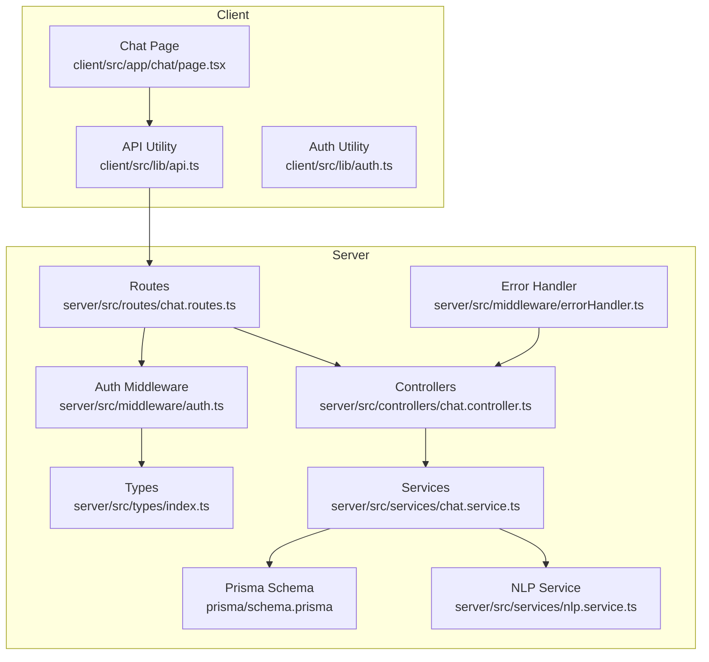
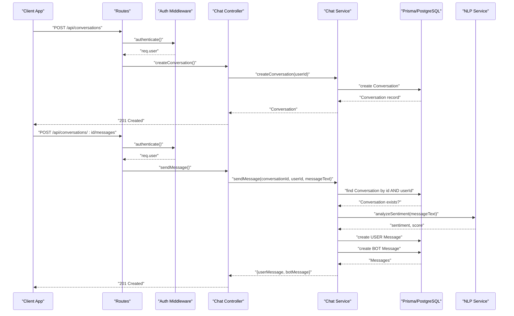
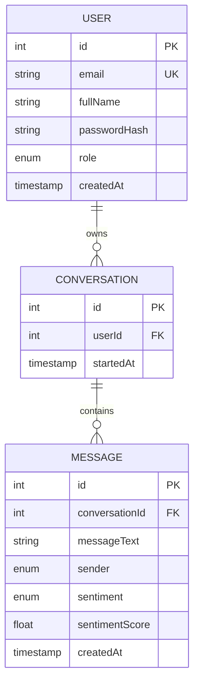
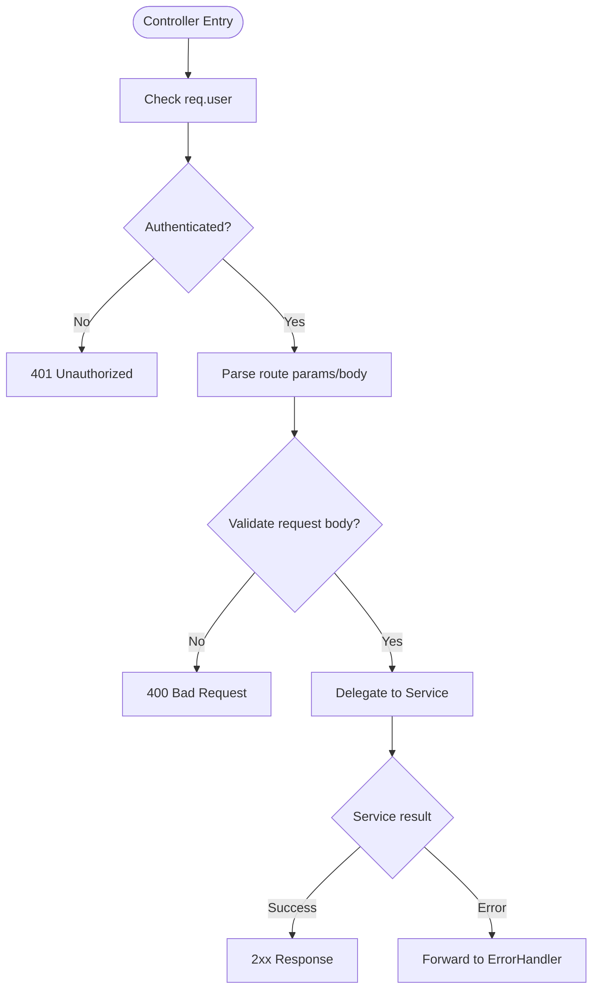
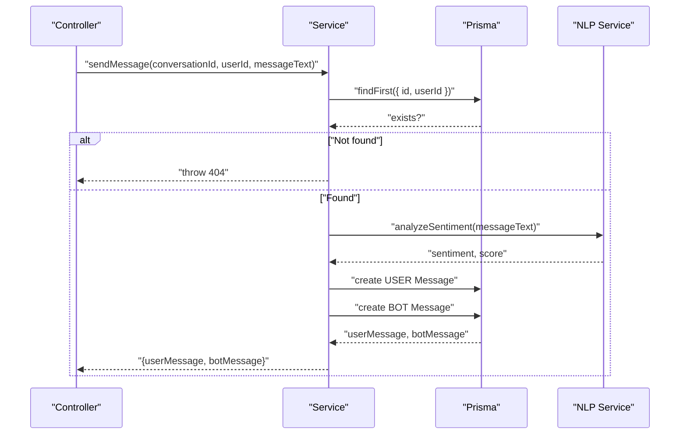
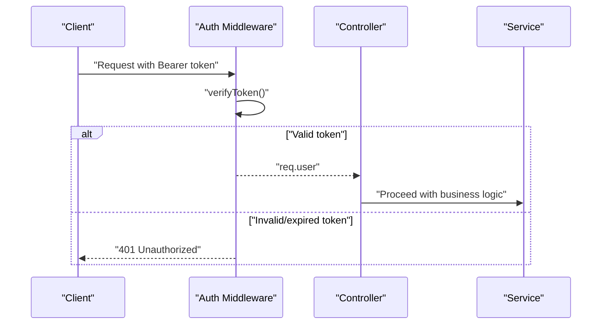
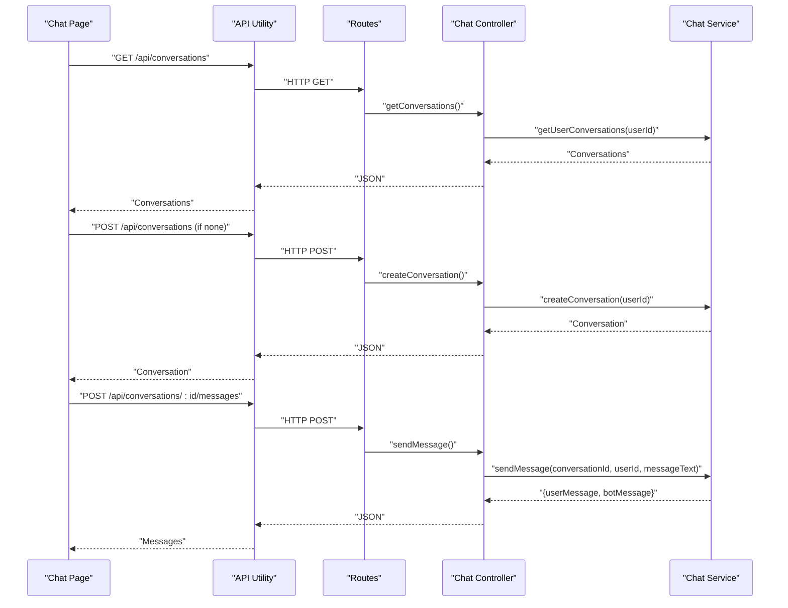
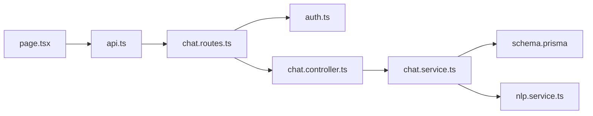

# Conversation Management

<cite>
**Referenced Files in This Document**
- [chat.controller.ts](file://server/src/controllers/chat.controller.ts)
- [chat.service.ts](file://server/src/services/chat.service.ts)
- [chat.routes.ts](file://server/src/routes/chat.routes.ts)
- [auth.ts](file://server/src/middleware/auth.ts)
- [errorHandler.ts](file://server/src/middleware/errorHandler.ts)
- [index.ts](file://server/src/types/index.ts)
- [schema.prisma](file://prisma/schema.prisma)
- [nlp.service.ts](file://server/src/services/nlp.service.ts)
- [token.ts](file://server/src/utils/token.ts)
- [page.tsx](file://client/src/app/chat/page.tsx)
- [api.ts](file://client/src/lib/api.ts)
- [auth.client.ts](file://client/src/lib/auth.ts)
</cite>

## Table of Contents
1. [Introduction](#introduction)
2. [Project Structure](#project-structure)
3. [Core Components](#core-components)
4. [Architecture Overview](#architecture-overview)
5. [Detailed Component Analysis](#detailed-component-analysis)
6. [Dependency Analysis](#dependency-analysis)
7. [Performance Considerations](#performance-considerations)
8. [Troubleshooting Guide](#troubleshooting-guide)
9. [Conclusion](#conclusion)

## Introduction
This document describes the conversation management subsystem responsible for creating, retrieving, and persisting conversations between users and the AI assistant. It explains the conversation lifecycle, the underlying data model, controller functions, access control patterns, and error handling strategies. Practical examples illustrate initialization, ID generation, metadata handling, ownership verification, and cleanup procedures.

## Project Structure
The conversation management subsystem spans the backend (Express routes, controllers, services, middleware, and Prisma schema) and the frontend (Next.js chat page and API utilities). The backend exposes REST endpoints protected by authentication middleware, while the frontend orchestrates conversation creation and message exchange.

**Diagram sources**
- [chat.routes.ts:1-13](file://server/src/routes/chat.routes.ts#L1-L13)
- [chat.controller.ts:1-69](file://server/src/controllers/chat.controller.ts#L1-L69)
- [chat.service.ts:1-105](file://server/src/services/chat.service.ts#L1-L105)
- [nlp.service.ts:1-24](file://server/src/services/nlp.service.ts#L1-L24)
- [auth.ts:1-39](file://server/src/middleware/auth.ts#L1-L39)
- [errorHandler.ts:1-13](file://server/src/middleware/errorHandler.ts#L1-L13)
- [index.ts:1-12](file://server/src/types/index.ts#L1-L12)
- [schema.prisma:1-134](file://prisma/schema.prisma#L1-L134)
- [page.tsx:1-196](file://client/src/app/chat/page.tsx#L1-L196)
- [api.ts:1-36](file://client/src/lib/api.ts#L1-L36)
- [auth.client.ts:1-27](file://client/src/lib/auth.ts#L1-L27)

**Section sources**
- [chat.routes.ts:1-13](file://server/src/routes/chat.routes.ts#L1-L13)
- [chat.controller.ts:1-69](file://server/src/controllers/chat.controller.ts#L1-L69)
- [chat.service.ts:1-105](file://server/src/services/chat.service.ts#L1-L105)
- [schema.prisma:1-134](file://prisma/schema.prisma#L1-L134)
- [page.tsx:1-196](file://client/src/app/chat/page.tsx#L1-L196)
- [api.ts:1-36](file://client/src/lib/api.ts#L1-L36)

## Core Components
- Conversation model: persisted with an auto-incremented ID, user association, and a timestamp for when the conversation started.
- Message model: persisted with text, sender identity, optional sentiment classification and score, and a creation timestamp.
- Controller functions: create a new conversation, list user conversations, send a message, and retrieve conversation history.
- Access control: JWT-based authentication middleware validates tokens and attaches user context to requests.
- Persistence: Prisma ORM connects to PostgreSQL and manages relations between users, conversations, and messages.
- NLP integration: sentiment analysis enriches user messages with sentiment metadata.

**Section sources**
- [schema.prisma:63-84](file://prisma/schema.prisma#L63-L84)
- [chat.controller.ts:5-68](file://server/src/controllers/chat.controller.ts#L5-L68)
- [chat.service.ts:26-104](file://server/src/services/chat.service.ts#L26-L104)
- [auth.ts:5-22](file://server/src/middleware/auth.ts#L5-L22)

## Architecture Overview
The conversation lifecycle follows a clear flow:
- Authentication middleware verifies the client’s bearer token and injects user context.
- Controllers delegate to services for business logic.
- Services validate ownership, persist data via Prisma, and optionally call the NLP service.
- Frontend triggers actions and renders conversation history.

**Diagram sources**
- [chat.routes.ts:7-10](file://server/src/routes/chat.routes.ts#L7-L10)
- [auth.ts:5-22](file://server/src/middleware/auth.ts#L5-L22)
- [chat.controller.ts:5-68](file://server/src/controllers/chat.controller.ts#L5-L68)
- [chat.service.ts:26-89](file://server/src/services/chat.service.ts#L26-L89)
- [nlp.service.ts:11-23](file://server/src/services/nlp.service.ts#L11-L23)
- [schema.prisma:63-84](file://prisma/schema.prisma#L63-L84)

## Detailed Component Analysis

### Conversation Model and Persistence
- Conversation entity:
  - Fields: id (auto-increment), userId (foreign key), startedAt (timestamp).
  - Relationship: belongs to a User and contains many Messages.
- Message entity:
  - Fields: id (auto-increment), conversationId (foreign key), messageText, sender (USER/BOT), sentiment (optional), sentimentScore (optional), createdAt (timestamp).
  - Relationship: belongs to a Conversation.
- Ownership and indexing:
  - Conversations are indexed by userId; Messages are indexed by conversationId.
  - Services enforce ownership checks by filtering records by userId.

**Diagram sources**
- [schema.prisma:47-84](file://prisma/schema.prisma#L47-L84)

**Section sources**
- [schema.prisma:63-84](file://prisma/schema.prisma#L63-L84)

### Controller Functions
- createConversation:
  - Validates authenticated user, delegates to service to create a new conversation, and returns the created record with 201 status.
- getConversations:
  - Validates authenticated user, retrieves user’s conversations ordered by most recent, and includes the latest message per conversation.
- sendMessage:
  - Validates authenticated user, parses conversationId from path params, validates messageText, and delegates to service to store user and bot messages.
- getMessages:
  - Validates authenticated user, parses conversationId, ensures ownership, and returns all messages sorted chronologically.

**Diagram sources**
- [chat.controller.ts:5-68](file://server/src/controllers/chat.controller.ts#L5-L68)

**Section sources**
- [chat.controller.ts:5-68](file://server/src/controllers/chat.controller.ts#L5-L68)

### Service Layer and Business Logic
- createConversation:
  - Creates a new Conversation linked to the authenticated user.
- getUserConversations:
  - Lists conversations for the user, ordered by startedAt descending, with a projection of the latest message per conversation.
- sendMessage:
  - Ownership verification: ensures the conversation belongs to the user.
  - NLP enrichment: calls analyzeSentiment, maps sentiment label, and stores sentiment and score with the user message.
  - Dual-message flow: creates a USER message and a BOT message automatically.
- getConversationMessages:
  - Ownership verification: ensures the conversation belongs to the user.
  - Returns all messages for the conversation ordered by creation time.

**Diagram sources**
- [chat.service.ts:45-89](file://server/src/services/chat.service.ts#L45-L89)
- [nlp.service.ts:11-23](file://server/src/services/nlp.service.ts#L11-L23)

**Section sources**
- [chat.service.ts:26-104](file://server/src/services/chat.service.ts#L26-L104)

### Access Control and Authentication
- Authentication middleware:
  - Extracts Bearer token from Authorization header, verifies it, and attaches user payload to req.user.
  - Returns 401 for missing or invalid tokens.
- Controllers consistently check req.user presence before proceeding.
- Frontend:
  - Stores JWT in localStorage and includes Authorization header on all requests.
  - Redirects to login on 401 responses.

**Diagram sources**
- [auth.ts:5-22](file://server/src/middleware/auth.ts#L5-L22)
- [api.ts:10-26](file://client/src/lib/api.ts#L10-L26)

**Section sources**
- [auth.ts:5-22](file://server/src/middleware/auth.ts#L5-L22)
- [index.ts:3-11](file://server/src/types/index.ts#L3-L11)
- [api.ts:10-26](file://client/src/lib/api.ts#L10-L26)
- [auth.client.ts:1-27](file://client/src/lib/auth.ts#L1-L27)

### Frontend Integration and User Experience
- The chat page:
  - Checks authentication on mount and redirects unauthenticated users.
  - Loads existing conversations and initializes the latest one.
  - Sends messages via POST /api/conversations/:id/messages, creating a conversation if none exists.
  - Renders user and bot messages with timestamps and sentiment indicators.

**Diagram sources**
- [page.tsx:38-107](file://client/src/app/chat/page.tsx#L38-L107)
- [api.ts:3-35](file://client/src/lib/api.ts#L3-L35)
- [chat.routes.ts:7-10](file://server/src/routes/chat.routes.ts#L7-L10)
- [chat.controller.ts:5-68](file://server/src/controllers/chat.controller.ts#L5-L68)
- [chat.service.ts:26-89](file://server/src/services/chat.service.ts#L26-L89)

**Section sources**
- [page.tsx:17-107](file://client/src/app/chat/page.tsx#L17-L107)
- [api.ts:3-35](file://client/src/lib/api.ts#L3-L35)

### Practical Examples

- Conversation initialization:
  - If no conversation exists, the frontend creates one via POST /api/conversations and stores the returned conversationId.
  - The controller delegates to the service to create a new Conversation linked to the authenticated user.

- Conversation ID generation:
  - The Conversation model uses an auto-incremented integer ID managed by Prisma/PostgreSQL.

- Conversation metadata handling:
  - The Conversation model includes startedAt for lifecycle tracking.
  - Messages include sender, sentiment, sentimentScore, and createdAt for analytics and UI rendering.

- Ownership verification:
  - Services query conversations by id AND userId to prevent cross-user access.
  - Controllers enforce authentication before invoking services.

- Cleanup procedures:
  - The schema does not define automatic cleanup policies. Implement retention policies at the application level (e.g., soft delete or scheduled pruning) if needed.

**Section sources**
- [chat.controller.ts:5-31](file://server/src/controllers/chat.controller.ts#L5-L31)
- [chat.service.ts:26-43](file://server/src/services/chat.service.ts#L26-L43)
- [schema.prisma:63-84](file://prisma/schema.prisma#L63-L84)
- [chat.service.ts:47-52](file://server/src/services/chat.service.ts#L47-L52)

## Dependency Analysis
- Routes depend on authentication middleware and controller functions.
- Controllers depend on service functions and type definitions.
- Services depend on Prisma for persistence and the NLP service for sentiment analysis.
- Frontend depends on API utilities and authentication utilities to manage tokens and requests.

**Diagram sources**
- [chat.routes.ts:1-13](file://server/src/routes/chat.routes.ts#L1-L13)
- [auth.ts:1-39](file://server/src/middleware/auth.ts#L1-L39)
- [chat.controller.ts:1-69](file://server/src/controllers/chat.controller.ts#L1-L69)
- [chat.service.ts:1-105](file://server/src/services/chat.service.ts#L1-L105)
- [schema.prisma:1-134](file://prisma/schema.prisma#L1-L134)
- [nlp.service.ts:1-24](file://server/src/services/nlp.service.ts#L1-L24)
- [page.tsx:1-196](file://client/src/app/chat/page.tsx#L1-L196)
- [api.ts:1-36](file://client/src/lib/api.ts#L1-L36)

**Section sources**
- [chat.routes.ts:1-13](file://server/src/routes/chat.routes.ts#L1-L13)
- [chat.controller.ts:1-69](file://server/src/controllers/chat.controller.ts#L1-L69)
- [chat.service.ts:1-105](file://server/src/services/chat.service.ts#L1-L105)
- [schema.prisma:1-134](file://prisma/schema.prisma#L1-L134)
- [nlp.service.ts:1-24](file://server/src/services/nlp.service.ts#L1-L24)
- [page.tsx:1-196](file://client/src/app/chat/page.tsx#L1-L196)
- [api.ts:1-36](file://client/src/lib/api.ts#L1-L36)

## Performance Considerations
- Indexing:
  - Conversations indexed by userId and Messages indexed by conversationId improve query performance for ownership checks and message retrieval.
- Projection:
  - getUserConversations limits included messages to reduce payload size.
- NLP latency:
  - The NLP service call is best-effort; failures are logged and do not block message creation.
- Pagination:
  - For large histories, consider paginating getConversationMessages to limit response size.

[No sources needed since this section provides general guidance]

## Troubleshooting Guide
Common issues and resolutions:
- Invalid conversation ID or unauthorized access:
  - Symptom: 404 “Conversation not found” when calling sendMessage or getMessages.
  - Cause: conversationId does not belong to the authenticated user.
  - Resolution: Ensure the conversation belongs to the current user before accessing messages.
- Unauthorized access attempts:
  - Symptom: 401 “Access denied. No token provided.” or “Invalid or expired token.”
  - Cause: missing, malformed, or expired Bearer token.
  - Resolution: Re-authenticate and store a valid token; ensure Authorization header is present.
- Database connectivity issues:
  - Symptom: Internal Server Error responses from the error handler.
  - Cause: Prisma connection failures or query errors.
  - Resolution: Check database availability, credentials, and network; review server logs.
- NLP service unavailability:
  - Symptom: Messages stored without sentiment metadata.
  - Cause: NLP service endpoint returns non-OK status.
  - Resolution: Retry later or degrade gracefully; log the error for monitoring.

**Section sources**
- [chat.service.ts:47-52](file://server/src/services/chat.service.ts#L47-L52)
- [auth.ts:8-21](file://server/src/middleware/auth.ts#L8-L21)
- [errorHandler.ts:7-12](file://server/src/middleware/errorHandler.ts#L7-L12)
- [nlp.service.ts:18-20](file://server/src/services/nlp.service.ts#L18-L20)

## Conclusion
The conversation management subsystem provides a robust foundation for chat interactions with strong ownership enforcement, clear separation of concerns, and extensible persistence. By leveraging Prisma relations, JWT authentication, and optional NLP enrichment, it supports scalable conversation lifecycles from creation to retrieval. Future enhancements could include conversation archival, retention policies, and pagination for large histories.