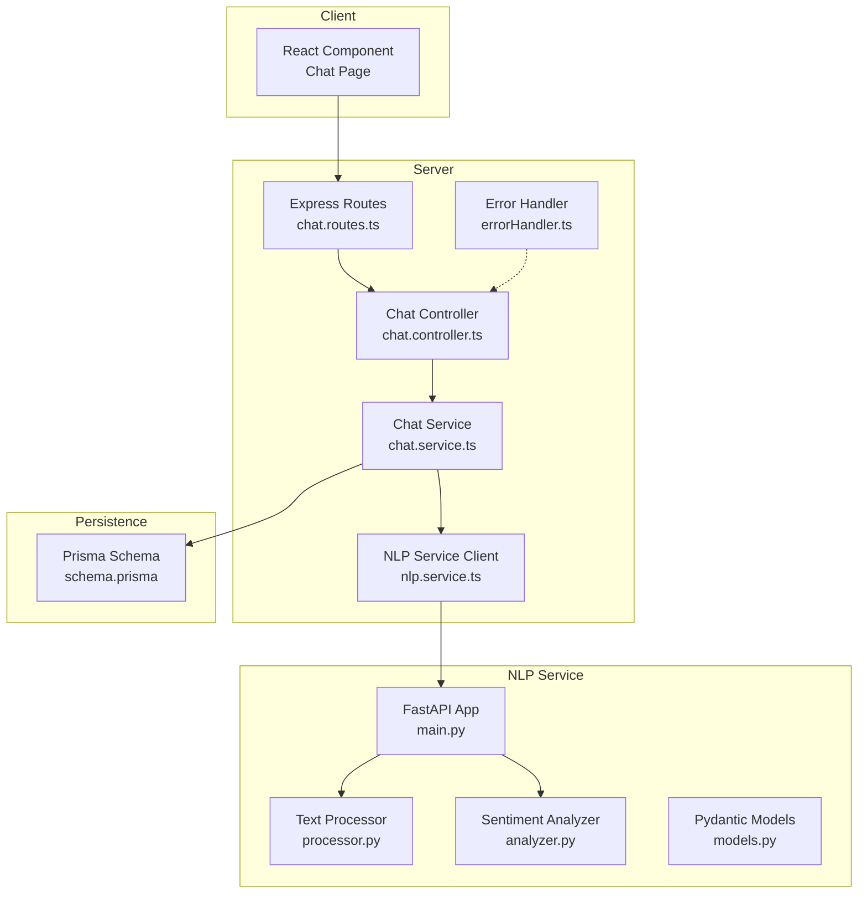
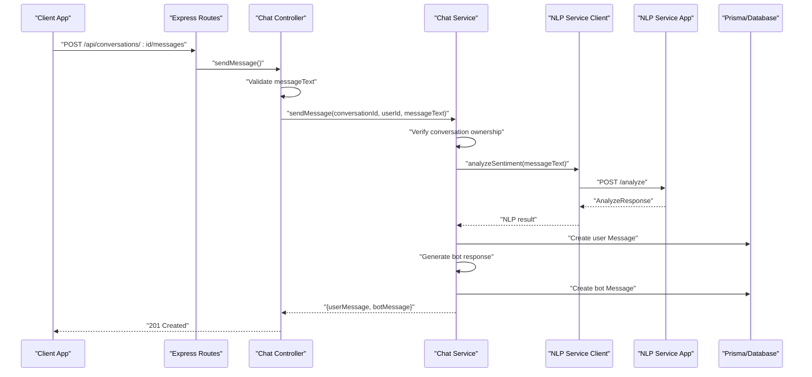
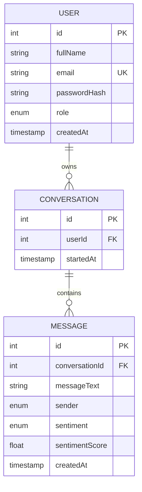
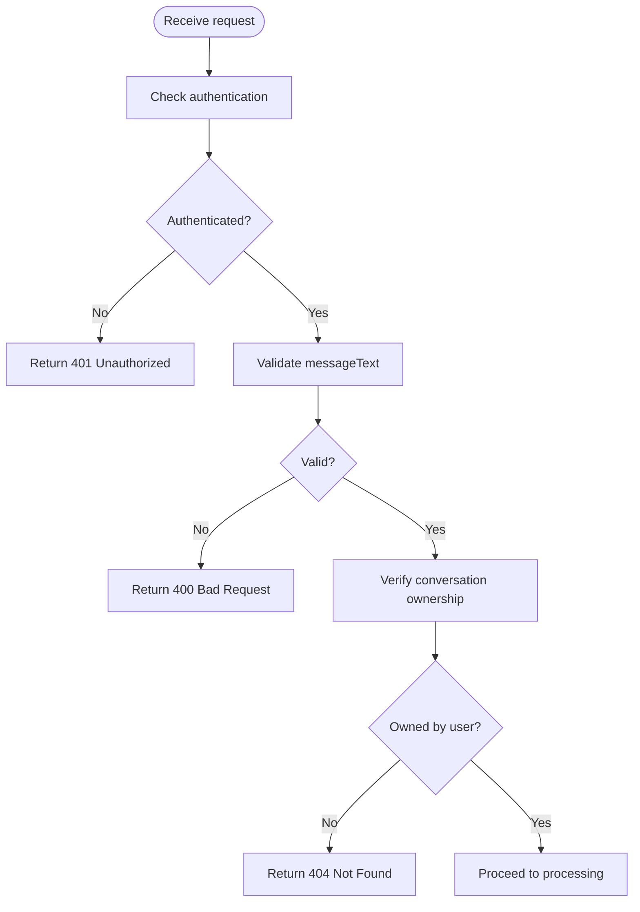
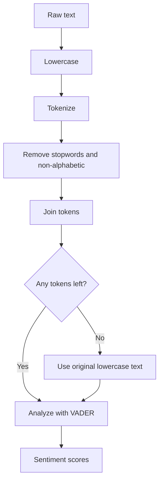
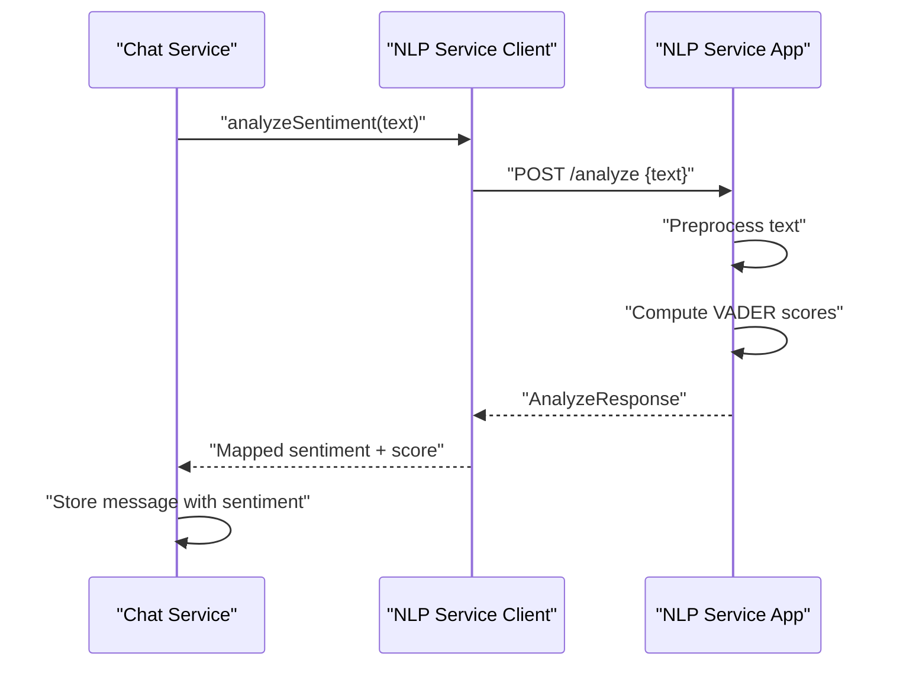
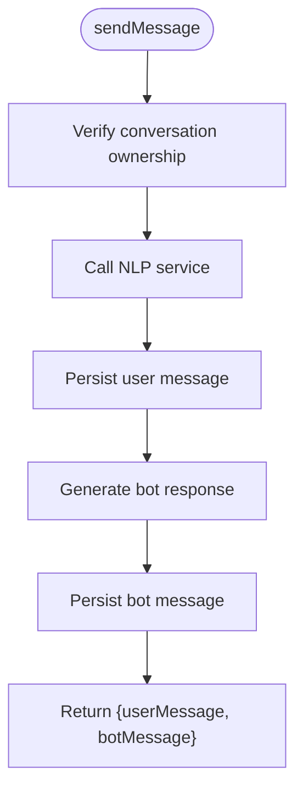
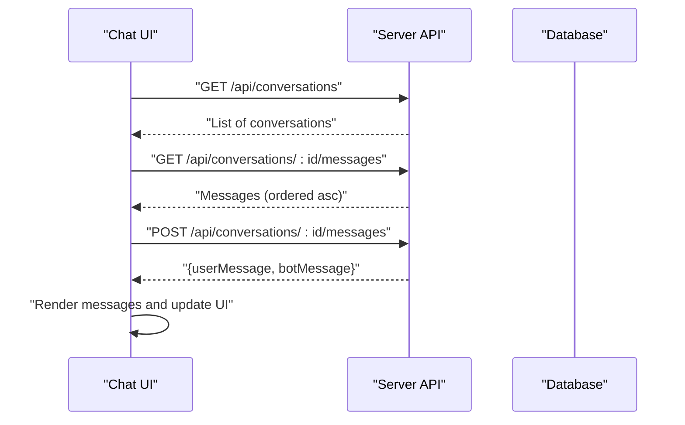
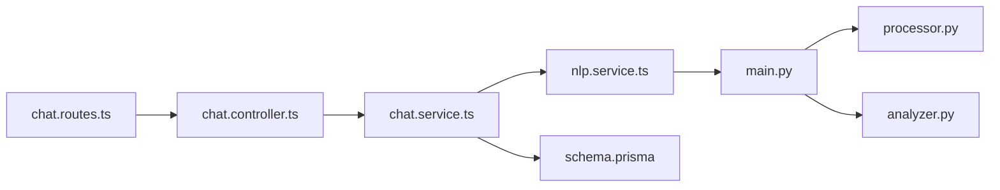

# Message Processing and Storage

<cite>
**Referenced Files in This Document**
- [prisma/schema.prisma](file://prisma/schema.prisma)
- [server/src/controllers/chat.controller.ts](file://server/src/controllers/chat.controller.ts)
- [server/src/services/chat.service.ts](file://server/src/services/chat.service.ts)
- [server/src/services/nlp.service.ts](file://server/src/services/nlp.service.ts)
- [server/src/routes/chat.routes.ts](file://server/src/routes/chat.routes.ts)
- [server/src/middleware/errorHandler.ts](file://server/src/middleware/errorHandler.ts)
- [nlp-service/main.py](file://nlp-service/main.py)
- [nlp-service/nlp/analyzer.py](file://nlp-service/nlp/analyzer.py)
- [nlp-service/nlp/processor.py](file://nlp-service/nlp/processor.py)
- [nlp-service/models.py](file://nlp-service/models.py)
- [client/src/app/chat/page.tsx](file://client/src/app/chat/page.tsx)
</cite>

## Table of Contents
1. [Introduction](#introduction)
2. [Project Structure](#project-structure)
3. [Core Components](#core-components)
4. [Architecture Overview](#architecture-overview)
5. [Detailed Component Analysis](#detailed-component-analysis)
6. [Dependency Analysis](#dependency-analysis)
7. [Performance Considerations](#performance-considerations)
8. [Troubleshooting Guide](#troubleshooting-guide)
9. [Conclusion](#conclusion)
10. [Appendices](#appendices)

## Introduction
This document explains the message processing and storage system that powers the chat functionality. It covers the complete message lifecycle from user input through NLP analysis to database persistence, including validation, preprocessing, sentiment scoring, storage, and retrieval. It also documents the message model structure, integration with the NLP service, error handling, and efficient retrieval patterns for conversation history.

## Project Structure
The message system spans three layers:
- Frontend (Next.js): Handles user input, displays messages, and triggers API requests.
- Backend (Express): Exposes REST endpoints, validates requests, orchestrates processing, and persists data.
- NLP Service (FastAPI): Performs sentiment analysis on incoming text using VADER.

**Diagram sources**
- [server/src/routes/chat.routes.ts:1-13](file://server/src/routes/chat.routes.ts#L1-L13)
- [server/src/controllers/chat.controller.ts:1-69](file://server/src/controllers/chat.controller.ts#L1-L69)
- [server/src/services/chat.service.ts:1-105](file://server/src/services/chat.service.ts#L1-L105)
- [server/src/services/nlp.service.ts:1-24](file://server/src/services/nlp.service.ts#L1-L24)
- [server/src/middleware/errorHandler.ts:1-13](file://server/src/middleware/errorHandler.ts#L1-L13)
- [nlp-service/main.py:1-71](file://nlp-service/main.py#L1-L71)
- [nlp-service/nlp/processor.py:1-19](file://nlp-service/nlp/processor.py#L1-L19)
- [nlp-service/nlp/analyzer.py:1-27](file://nlp-service/nlp/analyzer.py#L1-L27)
- [nlp-service/models.py:1-26](file://nlp-service/models.py#L1-L26)
- [prisma/schema.prisma:1-134](file://prisma/schema.prisma#L1-L134)

**Section sources**
- [server/src/routes/chat.routes.ts:1-13](file://server/src/routes/chat.routes.ts#L1-L13)
- [server/src/controllers/chat.controller.ts:1-69](file://server/src/controllers/chat.controller.ts#L1-L69)
- [server/src/services/chat.service.ts:1-105](file://server/src/services/chat.service.ts#L1-L105)
- [server/src/services/nlp.service.ts:1-24](file://server/src/services/nlp.service.ts#L1-L24)
- [server/src/middleware/errorHandler.ts:1-13](file://server/src/middleware/errorHandler.ts#L1-L13)
- [nlp-service/main.py:1-71](file://nlp-service/main.py#L1-L71)
- [nlp-service/nlp/processor.py:1-19](file://nlp-service/nlp/processor.py#L1-L19)
- [nlp-service/nlp/analyzer.py:1-27](file://nlp-service/nlp/analyzer.py#L1-L27)
- [nlp-service/models.py:1-26](file://nlp-service/models.py#L1-L26)
- [prisma/schema.prisma:1-134](file://prisma/schema.prisma#L1-L134)

## Core Components
- Message model: Stores text content, sender identity, optional sentiment classification and score, and creation timestamp. It is associated with a conversation.
- Conversation model: Links messages to a user and tracks when a conversation started.
- Chat controller: Validates inputs, enforces authentication, and delegates to the chat service.
- Chat service: Orchestrates message creation, integrates with the NLP service, stores messages, and generates bot responses.
- NLP service client: Calls the external NLP service and handles errors gracefully.
- NLP service: Preprocesses text, performs sentiment analysis, and returns structured results.
- Prisma schema: Defines the database models and relationships.

Key data model attributes:
- Message: id, conversationId, messageText, sender, sentiment, sentimentScore, createdAt
- Conversation: id, userId, startedAt
- User: id, fullName, email, role, createdAt

**Section sources**
- [prisma/schema.prisma:73-84](file://prisma/schema.prisma#L73-L84)
- [prisma/schema.prisma:63-71](file://prisma/schema.prisma#L63-L71)
- [prisma/schema.prisma:47-61](file://prisma/schema.prisma#L47-L61)

## Architecture Overview
The message lifecycle follows a strict sequence:
1. Client sends a message to the backend.
2. Controller validates the payload and authenticates the user.
3. Service verifies ownership of the conversation, calls the NLP service for sentiment analysis, and persists both user and bot messages.
4. NLP service preprocesses text and computes sentiment scores using VADER.
5. Results are stored in the database and returned to the client.

**Diagram sources**
- [server/src/routes/chat.routes.ts:9-10](file://server/src/routes/chat.routes.ts#L9-L10)
- [server/src/controllers/chat.controller.ts:33-53](file://server/src/controllers/chat.controller.ts#L33-L53)
- [server/src/services/chat.service.ts:45-89](file://server/src/services/chat.service.ts#L45-L89)
- [server/src/services/nlp.service.ts:11-23](file://server/src/services/nlp.service.ts#L11-L23)
- [nlp-service/main.py:43-58](file://nlp-service/main.py#L43-L58)

## Detailed Component Analysis

### Message Model and Relationships
The message model captures the essential attributes for chat history and sentiment analytics. It is linked to a conversation and inherits timestamps automatically.

**Diagram sources**
- [prisma/schema.prisma:47-61](file://prisma/schema.prisma#L47-L61)
- [prisma/schema.prisma:63-71](file://prisma/schema.prisma#L63-L71)
- [prisma/schema.prisma:73-84](file://prisma/schema.prisma#L73-L84)

**Section sources**
- [prisma/schema.prisma:73-84](file://prisma/schema.prisma#L73-L84)
- [prisma/schema.prisma:63-71](file://prisma/schema.prisma#L63-L71)
- [prisma/schema.prisma:47-61](file://prisma/schema.prisma#L47-L61)

### Message Validation Pipeline
Validation occurs at two layers:
- Frontend: Basic trimming and prevention of empty submissions.
- Backend: Strict validation of messageText presence, type, and emptiness.

Validation rules:
- messageText must be present and a non-empty string.
- Conversation ownership is verified before processing.

**Diagram sources**
- [server/src/controllers/chat.controller.ts:33-53](file://server/src/controllers/chat.controller.ts#L33-L53)
- [server/src/services/chat.service.ts:47-52](file://server/src/services/chat.service.ts#L47-L52)

**Section sources**
- [server/src/controllers/chat.controller.ts:43-46](file://server/src/controllers/chat.controller.ts#L43-L46)
- [server/src/services/chat.service.ts:47-52](file://server/src/services/chat.service.ts#L47-L52)

### Preprocessing and Content Sanitization
The NLP service applies preprocessing to improve sentiment analysis quality:
- Lowercasing
- Tokenization
- Stopword removal
- Non-alphabetic filtering

If preprocessing yields no tokens, the service falls back to the original lowercase text.

**Diagram sources**
- [nlp-service/nlp/processor.py:10-18](file://nlp-service/nlp/processor.py#L10-L18)
- [nlp-service/main.py:47-56](file://nlp-service/main.py#L47-L56)

**Section sources**
- [nlp-service/nlp/processor.py:10-18](file://nlp-service/nlp/processor.py#L10-L18)
- [nlp-service/main.py:47-56](file://nlp-service/main.py#L47-L56)

### NLP Integration and Sentiment Scoring
The backend integrates with the NLP service via a dedicated client:
- Sends text to /analyze
- Receives sentiment classification and numeric scores
- Maps classification to internal enum
- Stores sentiment and score alongside the message

Fallback behavior:
- If the NLP service is unavailable, processing continues without sentiment data.

**Diagram sources**
- [server/src/services/chat.service.ts:58-65](file://server/src/services/chat.service.ts#L58-L65)
- [server/src/services/nlp.service.ts:11-23](file://server/src/services/nlp.service.ts#L11-L23)
- [nlp-service/main.py:43-58](file://nlp-service/main.py#L43-L58)
- [nlp-service/nlp/analyzer.py:8-26](file://nlp-service/nlp/analyzer.py#L8-L26)
- [nlp-service/models.py:4-21](file://nlp-service/models.py#L4-L21)

**Section sources**
- [server/src/services/nlp.service.ts:11-23](file://server/src/services/nlp.service.ts#L11-L23)
- [nlp-service/main.py:43-58](file://nlp-service/main.py#L43-L58)
- [nlp-service/nlp/analyzer.py:8-26](file://nlp-service/nlp/analyzer.py#L8-L26)
- [nlp-service/models.py:4-21](file://nlp-service/models.py#L4-L21)

### Storage Mechanisms and Persistence
The chat service persists messages in two steps:
1. Store the user’s message with computed sentiment and score.
2. Generate a bot response based on sentiment and store it as a separate message.

Retrieval:
- Conversation messages are ordered chronologically ascending for consistent display.

**Diagram sources**
- [server/src/services/chat.service.ts:45-89](file://server/src/services/chat.service.ts#L45-L89)
- [server/src/services/chat.service.ts:91-104](file://server/src/services/chat.service.ts#L91-L104)

**Section sources**
- [server/src/services/chat.service.ts:45-89](file://server/src/services/chat.service.ts#L45-L89)
- [server/src/services/chat.service.ts:91-104](file://server/src/services/chat.service.ts#L91-L104)

### Client-Side Integration and Display
The frontend:
- Loads existing conversations and messages on mount.
- Creates a new conversation if none exists.
- Sends messages and immediately appends both user and bot messages to the UI.
- Displays sentiment indicators for user messages.

**Diagram sources**
- [client/src/app/chat/page.tsx:38-53](file://client/src/app/chat/page.tsx#L38-L53)
- [client/src/app/chat/page.tsx:74-101](file://client/src/app/chat/page.tsx#L74-L101)
- [server/src/controllers/chat.controller.ts:55-68](file://server/src/controllers/chat.controller.ts#L55-L68)
- [server/src/services/chat.service.ts:91-104](file://server/src/services/chat.service.ts#L91-L104)

**Section sources**
- [client/src/app/chat/page.tsx:38-53](file://client/src/app/chat/page.tsx#L38-L53)
- [client/src/app/chat/page.tsx:74-101](file://client/src/app/chat/page.tsx#L74-L101)
- [server/src/controllers/chat.controller.ts:55-68](file://server/src/controllers/chat.controller.ts#L55-L68)
- [server/src/services/chat.service.ts:91-104](file://server/src/services/chat.service.ts#L91-L104)

### Message Ordering and Pagination Strategies
- Ordering: Messages are retrieved in ascending order by creation time to ensure chronological display.
- Pagination: Current implementation retrieves all messages for a conversation. For large histories, consider:
  - Cursor-based pagination using createdAt and id.
  - Limit and offset with explicit ordering.
  - Fetching recent messages first and lazy-loading older ones.

Efficient retrieval patterns:
- Use database indexes on conversationId and createdAt for fast queries.
- Cache recent messages per conversation to reduce repeated loads.

**Section sources**
- [server/src/services/chat.service.ts:100-103](file://server/src/services/chat.service.ts#L100-L103)
- [prisma/schema.prisma:83](file://prisma/schema.prisma#L83)

## Dependency Analysis
The system exhibits clear separation of concerns:
- Express routes depend on the chat controller.
- The chat controller depends on the chat service.
- The chat service depends on the NLP service client and Prisma.
- The NLP service client depends on the NLP service app.
- The NLP service app depends on the processor and analyzer modules.

**Diagram sources**
- [server/src/routes/chat.routes.ts:1-13](file://server/src/routes/chat.routes.ts#L1-L13)
- [server/src/controllers/chat.controller.ts:1-69](file://server/src/controllers/chat.controller.ts#L1-L69)
- [server/src/services/chat.service.ts:1-105](file://server/src/services/chat.service.ts#L1-L105)
- [server/src/services/nlp.service.ts:1-24](file://server/src/services/nlp.service.ts#L1-L24)
- [nlp-service/main.py:1-71](file://nlp-service/main.py#L1-L71)
- [nlp-service/nlp/processor.py:1-19](file://nlp-service/nlp/processor.py#L1-L19)
- [nlp-service/nlp/analyzer.py:1-27](file://nlp-service/nlp/analyzer.py#L1-L27)
- [prisma/schema.prisma:1-134](file://prisma/schema.prisma#L1-L134)

**Section sources**
- [server/src/routes/chat.routes.ts:1-13](file://server/src/routes/chat.routes.ts#L1-L13)
- [server/src/controllers/chat.controller.ts:1-69](file://server/src/controllers/chat.controller.ts#L1-L69)
- [server/src/services/chat.service.ts:1-105](file://server/src/services/chat.service.ts#L1-L105)
- [server/src/services/nlp.service.ts:1-24](file://server/src/services/nlp.service.ts#L1-L24)
- [nlp-service/main.py:1-71](file://nlp-service/main.py#L1-L71)
- [nlp-service/nlp/processor.py:1-19](file://nlp-service/nlp/processor.py#L1-L19)
- [nlp-service/nlp/analyzer.py:1-27](file://nlp-service/nlp/analyzer.py#L1-L27)
- [prisma/schema.prisma:1-134](file://prisma/schema.prisma#L1-L134)

## Performance Considerations
- Asynchronous NLP calls: The service catches failures and continues without sentiment, preventing end-to-end delays.
- Minimal preprocessing cost: Preprocessing is lightweight and executed server-side in the NLP service.
- Efficient queries: Indexes on conversationId and createdAt enable fast retrieval.
- Client caching: Cache recent messages to minimize redundant network requests.
- Batch operations: For bulk uploads, consider batching message inserts to reduce overhead.

[No sources needed since this section provides general guidance]

## Troubleshooting Guide
Common issues and resolutions:
- Authentication failures: Ensure the user is logged in; the controller returns 401 if missing.
- Invalid messageText: The controller validates presence and emptiness; adjust client input handling.
- Conversation not found: Ownership verification throws a 404 if the conversation does not belong to the user.
- NLP service unavailability: The service logs and continues without sentiment; monitor NLP service health.
- Error propagation: Centralized error handler ensures consistent error responses.

**Section sources**
- [server/src/controllers/chat.controller.ts:7-10](file://server/src/controllers/chat.controller.ts#L7-L10)
- [server/src/controllers/chat.controller.ts:43-46](file://server/src/controllers/chat.controller.ts#L43-L46)
- [server/src/services/chat.service.ts:50-52](file://server/src/services/chat.service.ts#L50-L52)
- [server/src/services/chat.service.ts:62-65](file://server/src/services/chat.service.ts#L62-L65)
- [server/src/middleware/errorHandler.ts:7-12](file://server/src/middleware/errorHandler.ts#L7-L12)

## Conclusion
The message processing and storage system provides a robust, extensible foundation for chat functionality. It enforces strong validation, integrates sentiment analysis via a dedicated NLP service, persists messages efficiently, and retrieves them in a user-friendly order. The modular design allows for future enhancements such as pagination, richer analytics, and improved resilience.

[No sources needed since this section summarizes without analyzing specific files]

## Appendices

### API Endpoints Summary
- POST /api/conversations: Create a new conversation
- GET /api/conversations: List user’s conversations (latest preview)
- POST /api/conversations/:id/messages: Send a message and receive user/bot messages
- GET /api/conversations/:id/messages: Retrieve all messages in a conversation (chronological)

**Section sources**
- [server/src/routes/chat.routes.ts:7-10](file://server/src/routes/chat.routes.ts#L7-L10)
- [server/src/controllers/chat.controller.ts:5-31](file://server/src/controllers/chat.controller.ts#L5-L31)
- [server/src/controllers/chat.controller.ts:33-68](file://server/src/controllers/chat.controller.ts#L33-L68)