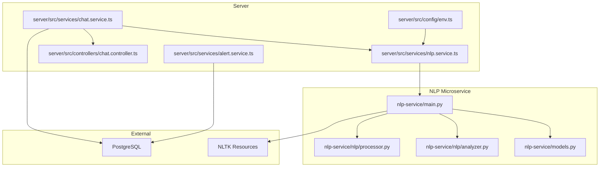
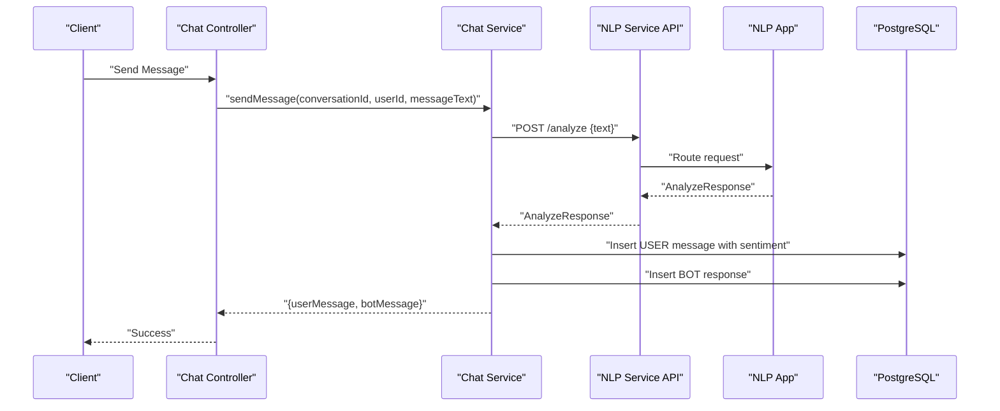
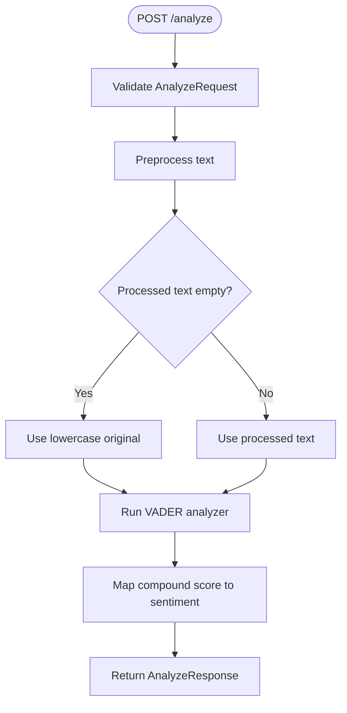
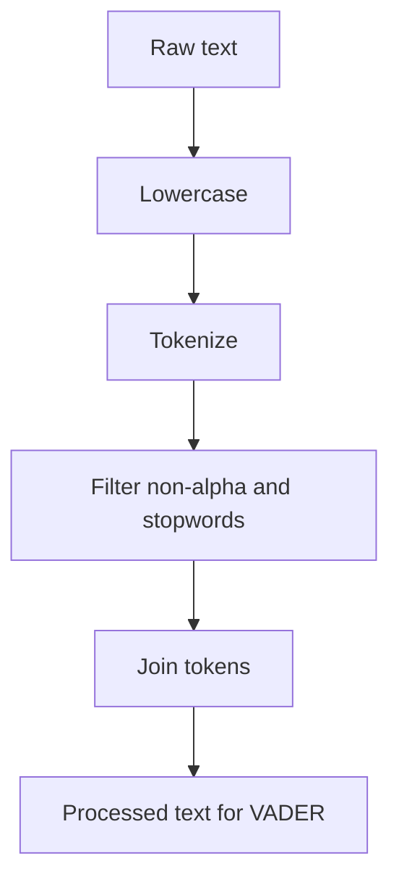
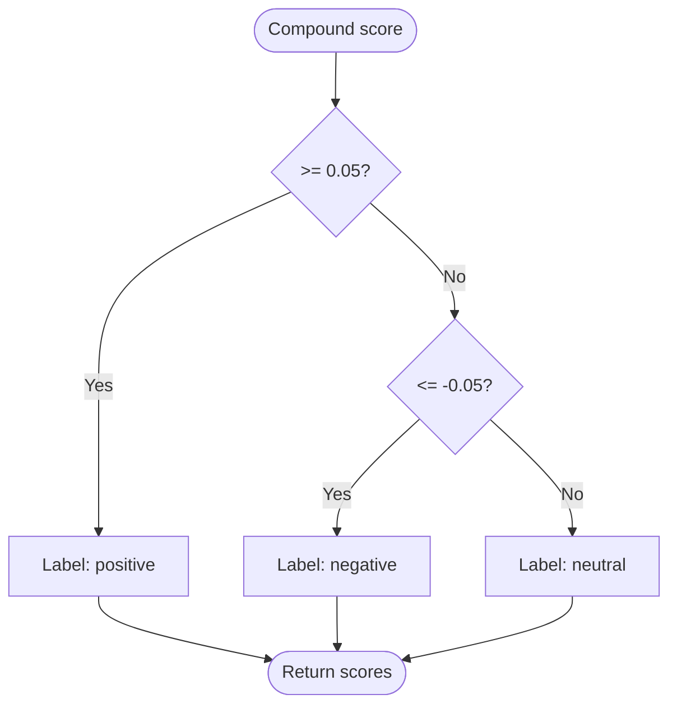
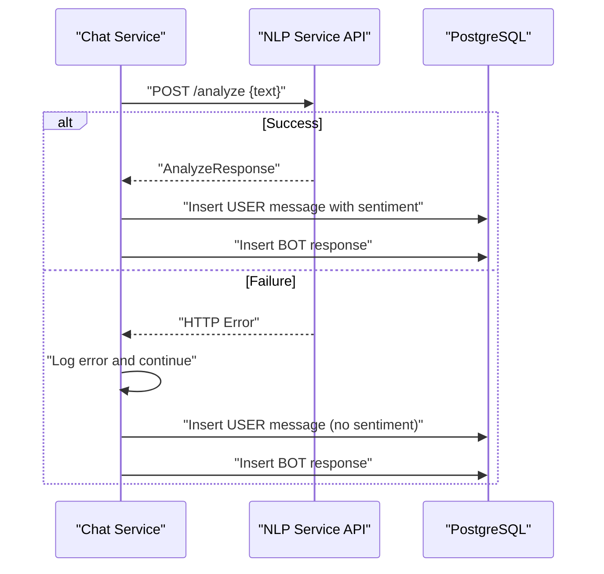
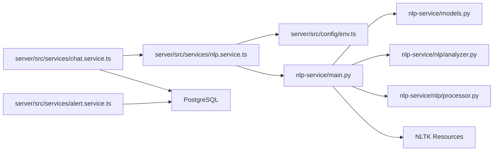

# NLP Integration and Sentiment Analysis

<cite>
**Referenced Files in This Document**
- [main.py](file://nlp-service/main.py)
- [models.py](file://nlp-service/models.py)
- [analyzer.py](file://nlp-service/nlp/analyzer.py)
- [processor.py](file://nlp-service/nlp/processor.py)
- [test_main.py](file://nlp-service/test_main.py)
- [requirements.txt](file://nlp-service/requirements.txt)
- [nlp.service.ts](file://server/src/services/nlp.service.ts)
- [chat.service.ts](file://server/src/services/chat.service.ts)
- [chat.controller.ts](file://server/src/controllers/chat.controller.ts)
- [env.ts](file://server/src/config/env.ts)
- [alert.service.ts](file://server/src/services/alert.service.ts)
- [docker-compose.yml](file://docker-compose.yml)
</cite>

## Table of Contents
1. [Introduction](#introduction)
2. [Project Structure](#project-structure)
3. [Core Components](#core-components)
4. [Architecture Overview](#architecture-overview)
5. [Detailed Component Analysis](#detailed-component-analysis)
6. [Dependency Analysis](#dependency-analysis)
7. [Performance Considerations](#performance-considerations)
8. [Troubleshooting Guide](#troubleshooting-guide)
9. [Conclusion](#conclusion)

## Introduction
This document explains the NLP integration and sentiment analysis system used to detect emotional tone in user messages. The system leverages VADER sentiment analysis via NLTK inside a dedicated NLP microservice, exposing a REST API consumed by the main application server. The server integrates sentiment analysis into chat workflows to adapt bot responses and supports downstream analytics for risk alerts and student summaries.

## Project Structure
The repository is organized into three primary areas:
- NLP microservice: FastAPI application providing sentiment analysis endpoints and local NLTK resources.
- Server: Express-based backend that orchestrates chat, integrates NLP service calls, and persists messages with sentiment metadata.
- Client: Next.js frontend (outside the scope of this document) that interacts with the server.

**Diagram sources**
- [main.py:1-71](file://nlp-service/main.py#L1-L71)
- [models.py:1-26](file://nlp-service/models.py#L1-L26)
- [analyzer.py:1-27](file://nlp-service/nlp/analyzer.py#L1-L27)
- [processor.py:1-19](file://nlp-service/nlp/processor.py#L1-L19)
- [nlp.service.ts:1-24](file://server/src/services/nlp.service.ts#L1-L24)
- [chat.service.ts:1-105](file://server/src/services/chat.service.ts#L1-L105)
- [chat.controller.ts:1-69](file://server/src/controllers/chat.controller.ts#L1-L69)
- [env.ts:1-12](file://server/src/config/env.ts#L1-L12)
- [alert.service.ts:1-62](file://server/src/services/alert.service.ts#L1-L62)

**Section sources**
- [main.py:1-71](file://nlp-service/main.py#L1-L71)
- [models.py:1-26](file://nlp-service/models.py#L1-L26)
- [analyzer.py:1-27](file://nlp-service/nlp/analyzer.py#L1-L27)
- [processor.py:1-19](file://nlp-service/nlp/processor.py#L1-L19)
- [nlp.service.ts:1-24](file://server/src/services/nlp.service.ts#L1-L24)
- [chat.service.ts:1-105](file://server/src/services/chat.service.ts#L1-L105)
- [chat.controller.ts:1-69](file://server/src/controllers/chat.controller.ts#L1-L69)
- [env.ts:1-12](file://server/src/config/env.ts#L1-L12)
- [alert.service.ts:1-62](file://server/src/services/alert.service.ts#L1-L62)

## Core Components
- NLP microservice endpoints:
  - POST /analyze: Accepts a text payload, preprocesses it, runs VADER sentiment analysis, and returns sentiment classification and scores.
  - GET /health: Returns service health status.
- Data models:
  - AnalyzeRequest: Validates non-empty text input.
  - AnalyzeResponse: Defines structured output fields for sentiment classification and polarity scores.
  - HealthResponse: Standardized health check response.
- Text preprocessing:
  - Lowercasing, tokenization, stopword removal, and alphabetic filtering to normalize input for VADER.
- Sentiment analysis:
  - VADER polarity scoring with compound score interpretation into positive, negative, or neutral categories using configurable thresholds.

**Section sources**
- [main.py:43-64](file://nlp-service/main.py#L43-L64)
- [models.py:4-26](file://nlp-service/models.py#L4-L26)
- [processor.py:10-19](file://nlp-service/nlp/processor.py#L10-L19)
- [analyzer.py:8-27](file://nlp-service/nlp/analyzer.py#L8-L27)

## Architecture Overview
The system follows a microservice pattern:
- The server’s chat service invokes the NLP service to analyze user messages.
- On success, the server stores the message with sentiment metadata and generates a tailored bot response.
- On failure, the server logs the error and continues without sentiment enrichment.
- Downstream services (alerts and dashboards) compute sentiment-based summaries from stored messages.

**Diagram sources**
- [chat.controller.ts:33-53](file://server/src/controllers/chat.controller.ts#L33-L53)
- [chat.service.ts:45-89](file://server/src/services/chat.service.ts#L45-L89)
- [nlp.service.ts:11-23](file://server/src/services/nlp.service.ts#L11-L23)
- [main.py:43-58](file://nlp-service/main.py#L43-L58)

## Detailed Component Analysis

### NLP Microservice
- Initialization and resource provisioning:
  - Configures NLTK data path and downloads required corpora on startup.
  - Sets up CORS and registers FastAPI routes.
- Endpoint: POST /analyze
  - Preprocesses incoming text, falls back to lowercase original if preprocessing yields empty content.
  - Calls VADER analyzer and returns standardized response model.
- Endpoint: GET /health
  - Returns health status for monitoring and readiness checks.

**Diagram sources**
- [main.py:43-58](file://nlp-service/main.py#L43-L58)
- [processor.py:10-19](file://nlp-service/nlp/processor.py#L10-L19)
- [analyzer.py:8-27](file://nlp-service/nlp/analyzer.py#L8-L27)

**Section sources**
- [main.py:9-27](file://nlp-service/main.py#L9-L27)
- [main.py:30-36](file://nlp-service/main.py#L30-L36)
- [main.py:43-64](file://nlp-service/main.py#L43-L64)
- [models.py:4-26](file://nlp-service/models.py#L4-L26)

### Data Models
- AnalyzeRequest enforces non-empty text and strips whitespace.
- AnalyzeResponse defines fields for sentiment label and polarity scores (compound, positive, negative, neutral).
- HealthResponse standardizes health endpoint output.

**Section sources**
- [models.py:4-26](file://nlp-service/models.py#L4-L26)

### Text Preprocessing Pipeline
- Lowercases input for normalization.
- Tokenizes and filters out non-alphabetic tokens and stopwords.
- Reassembles cleaned tokens into a single string suitable for VADER.

**Diagram sources**
- [processor.py:10-19](file://nlp-service/nlp/processor.py#L10-L19)

**Section sources**
- [processor.py:10-19](file://nlp-service/nlp/processor.py#L10-L19)

### Sentiment Scoring and Classification
- VADER computes a compound score in [-1, 1].
- Thresholds:
  - Positive if compound ≥ 0.05
  - Negative if compound ≤ -0.05
  - Neutral otherwise
- Returns normalized scores for pos/neg/neu alongside sentiment label.

**Diagram sources**
- [analyzer.py:13-18](file://nlp-service/nlp/analyzer.py#L13-L18)

**Section sources**
- [analyzer.py:8-27](file://nlp-service/nlp/analyzer.py#L8-L27)

### Server Integration Patterns
- HTTP client:
  - The server calls the NLP service via a typed fetch wrapper that posts JSON and validates HTTP status.
- Chat workflow:
  - On send, the server requests sentiment, maps the label to uppercase, and stores both user and bot messages.
  - If the NLP service fails, the server logs the error and proceeds without sentiment metadata.
- Response adaptation:
  - Bot replies are selected based on sentiment label and compound score to tailor empathy and support.

**Diagram sources**
- [nlp.service.ts:11-23](file://server/src/services/nlp.service.ts#L11-L23)
- [chat.service.ts:54-89](file://server/src/services/chat.service.ts#L54-L89)

**Section sources**
- [nlp.service.ts:11-23](file://server/src/services/nlp.service.ts#L11-L23)
- [chat.service.ts:54-89](file://server/src/services/chat.service.ts#L54-L89)

### API Communication Protocols and Error Handling
- Request/Response:
  - POST /analyze expects JSON with a text field; returns AnalyzeResponse.
  - GET /health returns HealthResponse.
- Validation:
  - Empty or missing text triggers a 422 Unprocessable Entity.
- Error handling:
  - NLP service wraps analysis errors into HTTP 500 responses.
  - Server catches NLP errors, logs them, and continues chat processing without sentiment.

**Section sources**
- [models.py:7-12](file://nlp-service/models.py#L7-L12)
- [main.py:57-58](file://nlp-service/main.py#L57-L58)
- [nlp.service.ts:18-20](file://server/src/services/nlp.service.ts#L18-L20)
- [chat.service.ts:62-65](file://server/src/services/chat.service.ts#L62-L65)

### Practical Examples and Response Adaptation
- Thresholds:
  - Positive: compound ≥ 0.05
  - Negative: compound ≤ -0.05
  - Neutral: otherwise
- Emotional state detection:
  - The server maps lowercase "positive"/"negative"/"neutral" to uppercase labels for storage and downstream analytics.
- Response adaptation:
  - POSITIVE: encouraging and supportive language.
  - NEGATIVE: empathetic acknowledgment and open-ended support offers.
  - NEUTRAL: welcoming follow-up prompts.

**Section sources**
- [analyzer.py:13-18](file://nlp-service/nlp/analyzer.py#L13-L18)
- [chat.service.ts:7-24](file://server/src/services/chat.service.ts#L7-L24)

### Integration with Risk Alerts and Analytics
- The alert service aggregates recent user messages and computes sentiment breakdown counts for risk assessment and counselor alerts.
- Messages are filtered to include only those with sentiment metadata present.

**Section sources**
- [alert.service.ts:35-61](file://server/src/services/alert.service.ts#L35-L61)

## Dependency Analysis
- Internal dependencies:
  - NLP microservice depends on NLTK (VADER lexicon, punkt, stopwords) and Pydantic for request/response models.
  - Server depends on the NLP service URL configured via environment variables.
- External dependencies:
  - PostgreSQL for persistence.
  - NLTK corpora downloaded at runtime into a local directory.

**Diagram sources**
- [nlp.service.ts:11-23](file://server/src/services/nlp.service.ts#L11-L23)
- [env.ts:10](file://server/src/config/env.ts#L10)
- [main.py:28-40](file://nlp-service/main.py#L28-L40)
- [models.py:1-26](file://nlp-service/models.py#L1-L26)
- [analyzer.py:1-27](file://nlp-service/nlp/analyzer.py#L1-L27)
- [processor.py:1-19](file://nlp-service/nlp/processor.py#L1-L19)

**Section sources**
- [requirements.txt:1-6](file://nlp-service/requirements.txt#L1-L6)
- [env.ts:10](file://server/src/config/env.ts#L10)
- [docker-compose.yml:1-19](file://docker-compose.yml#L1-L19)

## Performance Considerations
- Batch processing:
  - The current implementation processes one message at a time. To improve throughput, consider batching requests to /analyze and parallelizing NLP calls per message while preserving order for chat sequencing.
- Caching:
  - Implement a cache keyed by sanitized text hashes to avoid recomputation for identical or near-identical messages within short time windows.
- Resource initialization:
  - Ensure NLTK data is downloaded once during container startup to minimize cold-start latency.
- Network resilience:
  - Add retries with exponential backoff and circuit-breaker logic around NLP service calls to handle transient failures gracefully.
- Database writes:
  - Batch message inserts when possible and leverage connection pooling to reduce write latency.

## Troubleshooting Guide
- NLP service health:
  - Call GET /health to verify service availability.
- Input validation:
  - Ensure the text field is present and non-empty; empty or missing fields produce 422 errors.
- Network connectivity:
  - Confirm NLP_SERVICE_URL points to the running NLP service and that CORS allows cross-origin requests.
- Error propagation:
  - Server-side NLP errors surface as HTTP exceptions; inspect logs for stack traces and retry logic.
- Database state:
  - Messages are persisted even if sentiment analysis fails; verify message entries and sentiment fields accordingly.

**Section sources**
- [main.py:61-64](file://nlp-service/main.py#L61-L64)
- [models.py:7-12](file://nlp-service/models.py#L7-L12)
- [nlp.service.ts:18-20](file://server/src/services/nlp.service.ts#L18-L20)
- [chat.service.ts:62-65](file://server/src/services/chat.service.ts#L62-L65)

## Conclusion
The NLP integration employs a robust microservice architecture with VADER-based sentiment analysis, strict input validation, and resilient server-side consumption. The system adapts bot responses to user sentiment, maintains historical sentiment metadata for analytics, and provides fallback behavior when the NLP service is unavailable. With targeted improvements in batching, caching, and network resilience, the system can achieve higher throughput and reliability for production deployments.