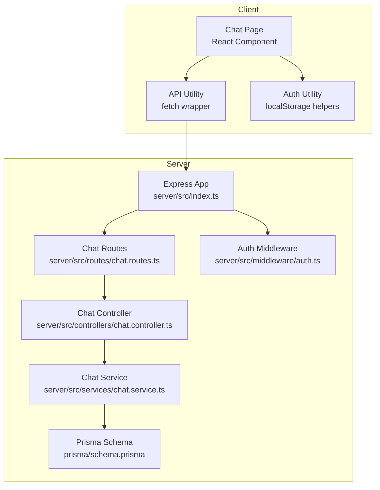
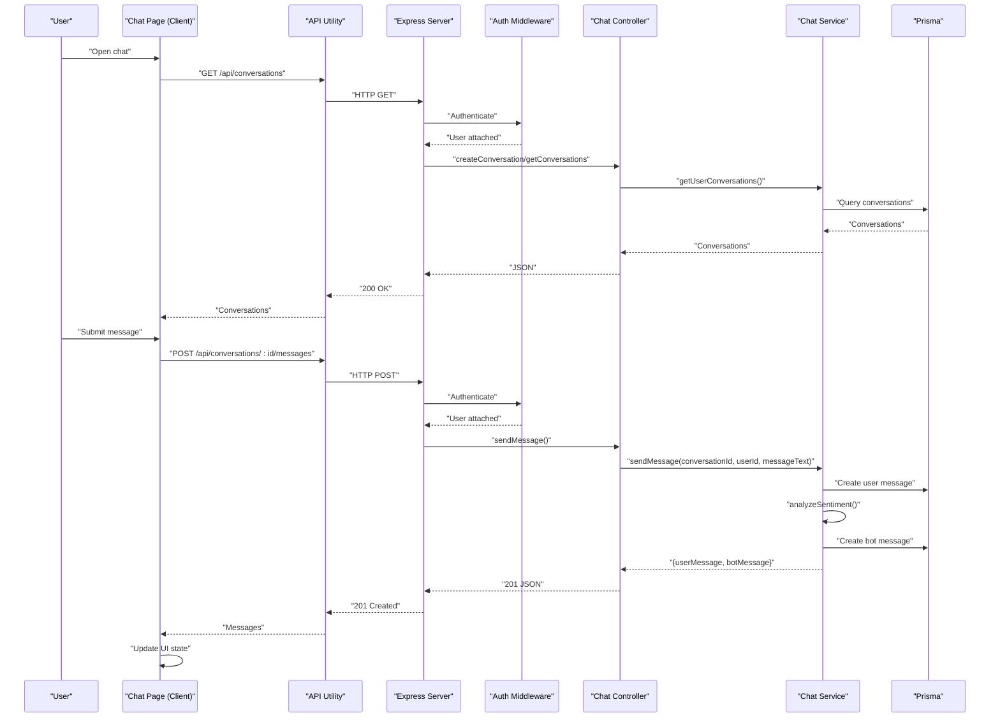
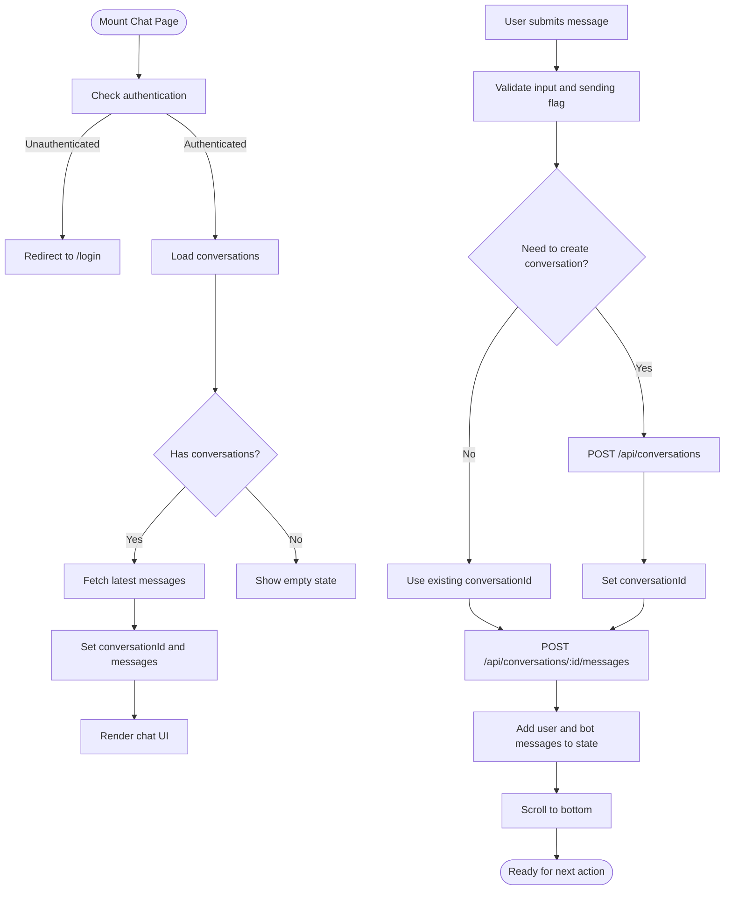
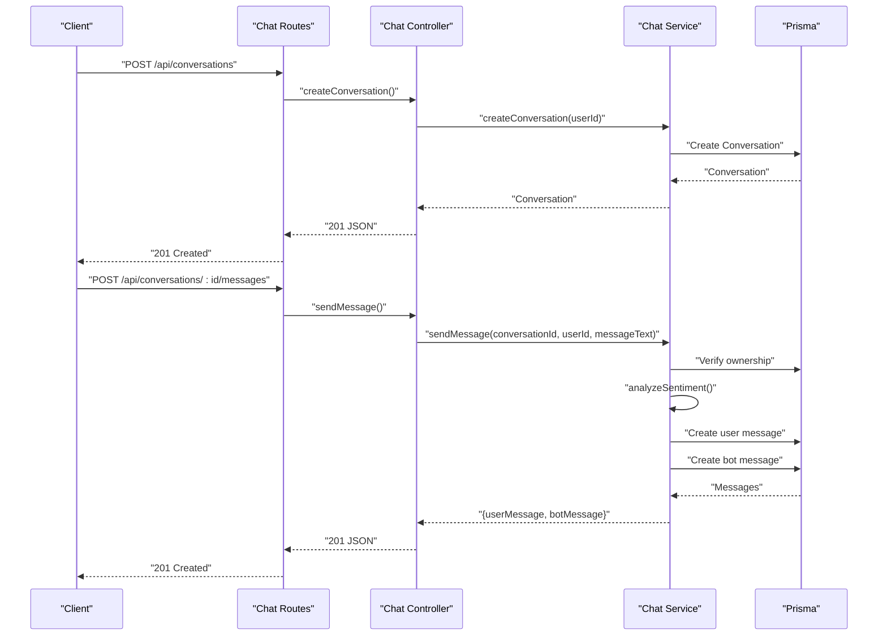
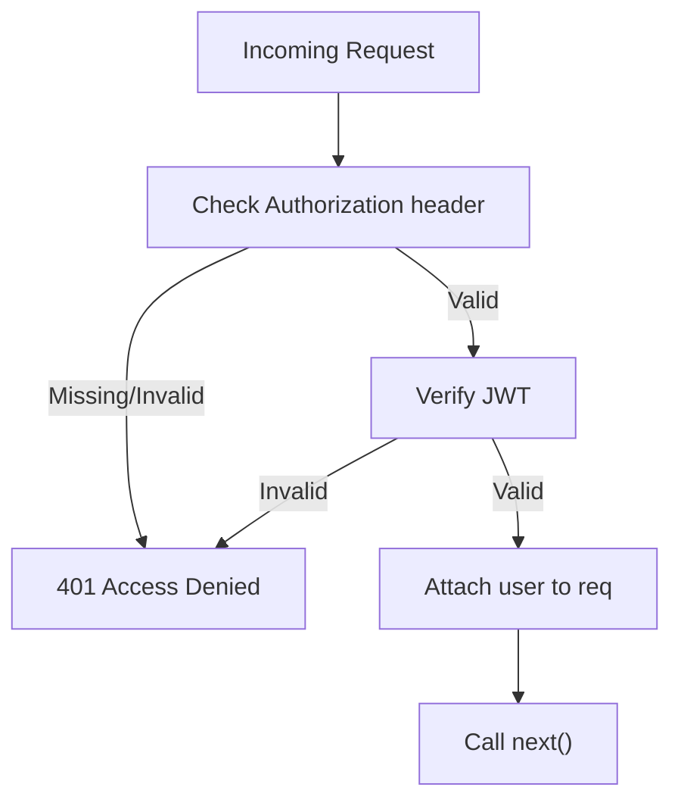
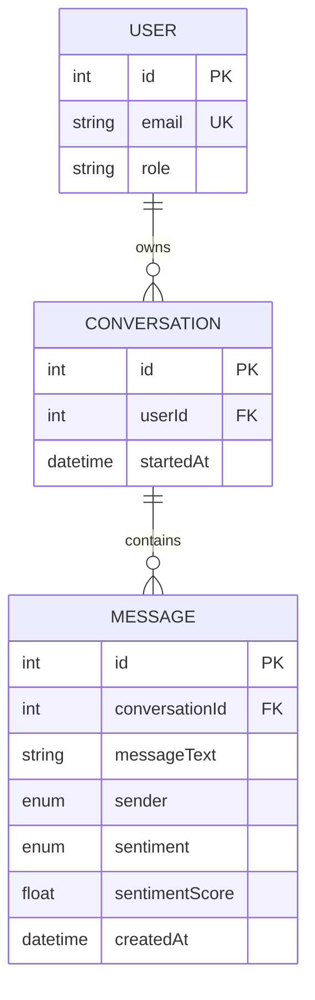
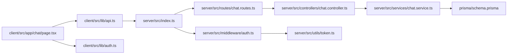

# Real-time Communication and WebSocket Implementation

<cite>
**Referenced Files in This Document**
- [server/src/index.ts](file://server/src/index.ts)
- [server/src/controllers/chat.controller.ts](file://server/src/controllers/chat.controller.ts)
- [server/src/routes/chat.routes.ts](file://server/src/routes/chat.routes.ts)
- [server/src/services/chat.service.ts](file://server/src/services/chat.service.ts)
- [server/src/middleware/auth.ts](file://server/src/middleware/auth.ts)
- [server/src/utils/token.ts](file://server/src/utils/token.ts)
- [server/src/types/index.ts](file://server/src/types/index.ts)
- [client/src/app/chat/page.tsx](file://client/src/app/chat/page.tsx)
- [client/src/lib/api.ts](file://client/src/lib/api.ts)
- [client/src/lib/auth.ts](file://client/src/lib/auth.ts)
- [prisma/schema.prisma](file://prisma/schema.prisma)
</cite>

## Table of Contents
1. [Introduction](#introduction)
2. [Project Structure](#project-structure)
3. [Core Components](#core-components)
4. [Architecture Overview](#architecture-overview)
5. [Detailed Component Analysis](#detailed-component-analysis)
6. [Dependency Analysis](#dependency-analysis)
7. [Performance Considerations](#performance-considerations)
8. [Troubleshooting Guide](#troubleshooting-guide)
9. [Conclusion](#conclusion)

## Introduction
This document explains the real-time communication system that powers instant chat functionality in the BuddyAI platform. Currently, the implementation uses HTTP APIs for bidirectional message exchange between the client and server. The client sends requests to create conversations, send messages, and retrieve message histories. The server validates authentication, persists messages to a database, performs sentiment analysis, and returns both user and bot responses synchronously.

Important note: The current codebase does not implement WebSocket connections. The documentation below describes the existing HTTP-based flow and provides guidance for adding WebSocket support, including connection establishment, message broadcasting, and graceful disconnection handling.

## Project Structure
The real-time chat feature spans three primary areas:
- Server: Express routes, controllers, services, middleware, and Prisma ORM schema
- Client: Next.js page component with React hooks for state management and API integration
- Shared data model: Prisma schema defining conversations and messages

**Diagram sources**
- [server/src/index.ts:1-35](file://server/src/index.ts#L1-L35)
- [server/src/routes/chat.routes.ts:1-13](file://server/src/routes/chat.routes.ts#L1-L13)
- [server/src/controllers/chat.controller.ts:1-69](file://server/src/controllers/chat.controller.ts#L1-L69)
- [server/src/services/chat.service.ts:1-105](file://server/src/services/chat.service.ts#L1-L105)
- [server/src/middleware/auth.ts:1-39](file://server/src/middleware/auth.ts#L1-L39)
- [client/src/app/chat/page.tsx:1-196](file://client/src/app/chat/page.tsx#L1-L196)
- [client/src/lib/api.ts:1-36](file://client/src/lib/api.ts#L1-L36)
- [client/src/lib/auth.ts:1-27](file://client/src/lib/auth.ts#L1-L27)
- [prisma/schema.prisma:1-134](file://prisma/schema.prisma#L1-L134)

**Section sources**
- [server/src/index.ts:1-35](file://server/src/index.ts#L1-L35)
- [server/src/routes/chat.routes.ts:1-13](file://server/src/routes/chat.routes.ts#L1-L13)
- [server/src/controllers/chat.controller.ts:1-69](file://server/src/controllers/chat.controller.ts#L1-L69)
- [server/src/services/chat.service.ts:1-105](file://server/src/services/chat.service.ts#L1-L105)
- [client/src/app/chat/page.tsx:1-196](file://client/src/app/chat/page.tsx#L1-L196)
- [client/src/lib/api.ts:1-36](file://client/src/lib/api.ts#L1-L36)
- [client/src/lib/auth.ts:1-27](file://client/src/lib/auth.ts#L1-L27)
- [prisma/schema.prisma:1-134](file://prisma/schema.prisma#L1-L134)

## Core Components
- Client-side chat page manages conversation state, handles user input, and updates the UI after each HTTP request.
- Server routes expose endpoints for creating conversations, retrieving conversations, sending messages, and fetching message histories.
- Server controller enforces authentication and delegates to the service layer.
- Server service validates ownership, performs sentiment analysis, stores messages, and generates bot responses.
- Authentication middleware verifies JWT tokens and attaches user identity to requests.
- Prisma schema defines the Conversation and Message models with appropriate relations and indexes.

Key implementation references:
- Client state and effects: [client/src/app/chat/page.tsx:17-53](file://client/src/app/chat/page.tsx#L17-L53)
- Client send flow: [client/src/app/chat/page.tsx:55-107](file://client/src/app/chat/page.tsx#L55-L107)
- Server routes: [server/src/routes/chat.routes.ts:7-10](file://server/src/routes/chat.routes.ts#L7-L10)
- Server controller message handling: [server/src/controllers/chat.controller.ts:33-53](file://server/src/controllers/chat.controller.ts#L33-L53)
- Server service message creation: [server/src/services/chat.service.ts:45-89](file://server/src/services/chat.service.ts#L45-L89)
- Authentication middleware: [server/src/middleware/auth.ts:5-22](file://server/src/middleware/auth.ts#L5-L22)
- Prisma models: [prisma/schema.prisma:63-84](file://prisma/schema.prisma#L63-L84)

**Section sources**
- [client/src/app/chat/page.tsx:17-107](file://client/src/app/chat/page.tsx#L17-L107)
- [server/src/routes/chat.routes.ts:7-10](file://server/src/routes/chat.routes.ts#L7-L10)
- [server/src/controllers/chat.controller.ts:33-53](file://server/src/controllers/chat.controller.ts#L33-L53)
- [server/src/services/chat.service.ts:45-89](file://server/src/services/chat.service.ts#L45-L89)
- [server/src/middleware/auth.ts:5-22](file://server/src/middleware/auth.ts#L5-L22)
- [prisma/schema.prisma:63-84](file://prisma/schema.prisma#L63-L84)

## Architecture Overview
The current architecture is HTTP-centric. The client initiates requests to the server, which validates authentication, persists data, and responds with the latest messages. There is no WebSocket connection established.

**Diagram sources**
- [client/src/app/chat/page.tsx:38-53](file://client/src/app/chat/page.tsx#L38-L53)
- [client/src/app/chat/page.tsx:55-107](file://client/src/app/chat/page.tsx#L55-L107)
- [server/src/routes/chat.routes.ts:7-10](file://server/src/routes/chat.routes.ts#L7-L10)
- [server/src/controllers/chat.controller.ts:33-53](file://server/src/controllers/chat.controller.ts#L33-L53)
- [server/src/services/chat.service.ts:45-89](file://server/src/services/chat.service.ts#L45-L89)
- [server/src/middleware/auth.ts:5-22](file://server/src/middleware/auth.ts#L5-L22)

## Detailed Component Analysis

### Client-Side React Implementation
The chat page component orchestrates:
- Authentication checks and redirection to login if unauthenticated
- Loading conversations and messages on mount
- Managing local state for conversationId, messages, input, loading, and sending flags
- Handling form submission to create a conversation (if needed) and send messages
- Updating the UI with user and bot messages and displaying sentiment indicators

**Diagram sources**
- [client/src/app/chat/page.tsx:26-53](file://client/src/app/chat/page.tsx#L26-L53)
- [client/src/app/chat/page.tsx:55-107](file://client/src/app/chat/page.tsx#L55-L107)

**Section sources**
- [client/src/app/chat/page.tsx:17-107](file://client/src/app/chat/page.tsx#L17-L107)
- [client/src/lib/api.ts:1-36](file://client/src/lib/api.ts#L1-L36)
- [client/src/lib/auth.ts:1-27](file://client/src/lib/auth.ts#L1-L27)

### Server-Side HTTP Flow
The server exposes four endpoints under /api/conversations:
- POST /: create a new conversation for the authenticated user
- GET /: list user's conversations with the latest message included
- POST /:id/messages: send a message to a conversation owned by the user
- GET /:id/messages: retrieve all messages in a conversation owned by the user

**Diagram sources**
- [server/src/routes/chat.routes.ts:7-10](file://server/src/routes/chat.routes.ts#L7-L10)
- [server/src/controllers/chat.controller.ts:5-53](file://server/src/controllers/chat.controller.ts#L5-L53)
- [server/src/services/chat.service.ts:26-89](file://server/src/services/chat.service.ts#L26-L89)

**Section sources**
- [server/src/routes/chat.routes.ts:1-13](file://server/src/routes/chat.routes.ts#L1-L13)
- [server/src/controllers/chat.controller.ts:5-69](file://server/src/controllers/chat.controller.ts#L5-L69)
- [server/src/services/chat.service.ts:26-105](file://server/src/services/chat.service.ts#L26-L105)

### Authentication and Session Handling
Authentication is enforced via a Bearer token header. The middleware verifies the token and attaches user identity to the request object. The client stores the token in localStorage and includes it in API requests.

**Diagram sources**
- [server/src/middleware/auth.ts:5-22](file://server/src/middleware/auth.ts#L5-L22)
- [server/src/utils/token.ts:10-16](file://server/src/utils/token.ts#L10-L16)
- [client/src/lib/api.ts:10-13](file://client/src/lib/api.ts#L10-L13)

**Section sources**
- [server/src/middleware/auth.ts:1-39](file://server/src/middleware/auth.ts#L1-L39)
- [server/src/utils/token.ts:1-16](file://server/src/utils/token.ts#L1-L16)
- [client/src/lib/api.ts:1-36](file://client/src/lib/api.ts#L1-L36)
- [client/src/lib/auth.ts:1-27](file://client/src/lib/auth.ts#L1-L27)

### Data Model for Conversations and Messages
The Prisma schema defines:
- Conversation: linked to User, with many Messages
- Message: belongs to a Conversation, includes sender and optional sentiment fields

**Diagram sources**
- [prisma/schema.prisma:47-84](file://prisma/schema.prisma#L47-L84)

**Section sources**
- [prisma/schema.prisma:47-84](file://prisma/schema.prisma#L47-L84)

## Dependency Analysis
The client depends on:
- API utility for HTTP requests and token injection
- Auth utility for authentication state and redirects
- React hooks for state and lifecycle management

The server depends on:
- Express for routing and middleware
- Prisma for data persistence
- JWT utilities for token generation/verification
- Authentication middleware for request validation

**Diagram sources**
- [client/src/app/chat/page.tsx:1-196](file://client/src/app/chat/page.tsx#L1-L196)
- [client/src/lib/api.ts:1-36](file://client/src/lib/api.ts#L1-L36)
- [client/src/lib/auth.ts:1-27](file://client/src/lib/auth.ts#L1-L27)
- [server/src/index.ts:1-35](file://server/src/index.ts#L1-L35)
- [server/src/routes/chat.routes.ts:1-13](file://server/src/routes/chat.routes.ts#L1-L13)
- [server/src/controllers/chat.controller.ts:1-69](file://server/src/controllers/chat.controller.ts#L1-L69)
- [server/src/services/chat.service.ts:1-105](file://server/src/services/chat.service.ts#L1-L105)
- [server/src/middleware/auth.ts:1-39](file://server/src/middleware/auth.ts#L1-L39)
- [server/src/utils/token.ts:1-16](file://server/src/utils/token.ts#L1-L16)
- [prisma/schema.prisma:1-134](file://prisma/schema.prisma#L1-L134)

**Section sources**
- [client/src/app/chat/page.tsx:1-196](file://client/src/app/chat/page.tsx#L1-L196)
- [client/src/lib/api.ts:1-36](file://client/src/lib/api.ts#L1-L36)
- [client/src/lib/auth.ts:1-27](file://client/src/lib/auth.ts#L1-L27)
- [server/src/index.ts:1-35](file://server/src/index.ts#L1-L35)
- [server/src/routes/chat.routes.ts:1-13](file://server/src/routes/chat.routes.ts#L1-L13)
- [server/src/controllers/chat.controller.ts:1-69](file://server/src/controllers/chat.controller.ts#L1-L69)
- [server/src/services/chat.service.ts:1-105](file://server/src/services/chat.service.ts#L1-L105)
- [server/src/middleware/auth.ts:1-39](file://server/src/middleware/auth.ts#L1-L39)
- [server/src/utils/token.ts:1-16](file://server/src/utils/token.ts#L1-L16)
- [prisma/schema.prisma:1-134](file://prisma/schema.prisma#L1-L134)

## Performance Considerations
Current HTTP-based implementation characteristics:
- Latency: Each message incurs round-trip HTTP latency plus server processing time
- Scalability: Stateless requests simplify horizontal scaling but increase network overhead compared to persistent connections
- Memory: No long-lived sessions; server maintains minimal per-request state

Recommendations for future WebSocket integration:
- Connection pooling and room-based broadcasting to efficiently deliver messages to participants
- Heartbeat and ping/pong mechanisms to detect stale connections
- Backpressure handling to prevent overwhelming clients during bursts
- Graceful reconnection with message acknowledgment and replay buffers
- Rate limiting and DDoS protection at the transport level

[No sources needed since this section provides general guidance]

## Troubleshooting Guide
Common issues and remedies:
- Authentication failures: Ensure the Authorization header includes a valid Bearer token. The client removes the token and redirects to login on 401 responses.
- Conversation ownership errors: Sending messages requires a conversationId owned by the authenticated user; otherwise, the server returns a 404-like error.
- Empty conversation lists: On first visit, the client creates a conversation automatically before sending the first message.
- UI state synchronization: The client updates the message list immediately after receiving the server response to avoid stale UI.

**Section sources**
- [client/src/lib/api.ts:20-26](file://client/src/lib/api.ts#L20-L26)
- [server/src/services/chat.service.ts:47-52](file://server/src/services/chat.service.ts#L47-L52)
- [client/src/app/chat/page.tsx:67-71](file://client/src/app/chat/page.tsx#L67-L71)

## Conclusion
The current chat implementation provides reliable synchronous messaging with clear separation of concerns between client and server. While it lacks real-time push capabilities, it is straightforward to extend by integrating WebSocket connections. The existing authentication, routing, and service layers offer a solid foundation for adding bidirectional communication, broadcasting, and scalable session management.

[No sources needed since this section summarizes without analyzing specific files]