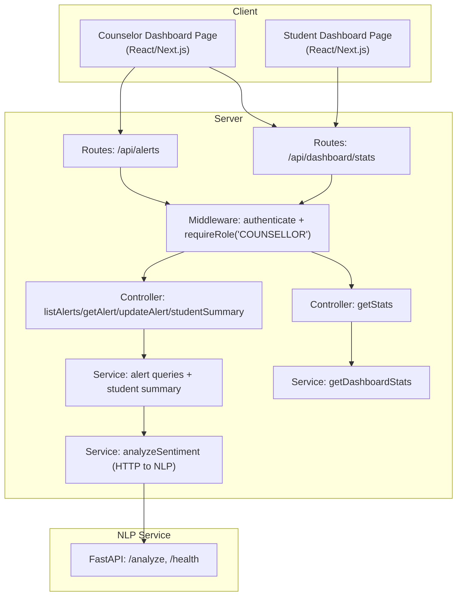
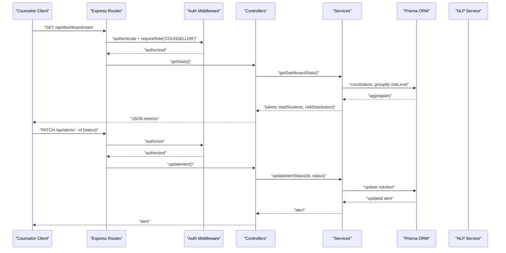
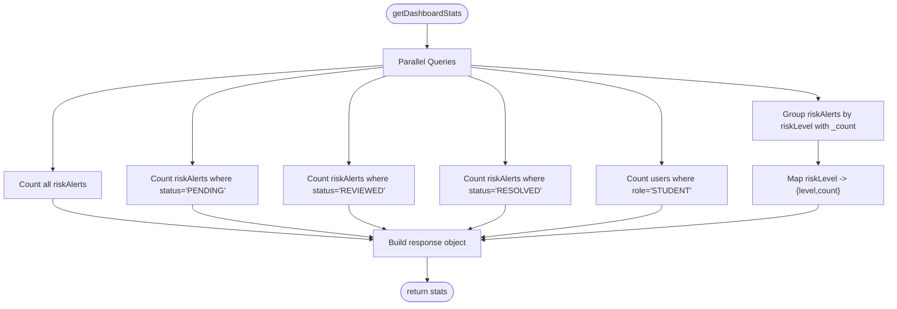
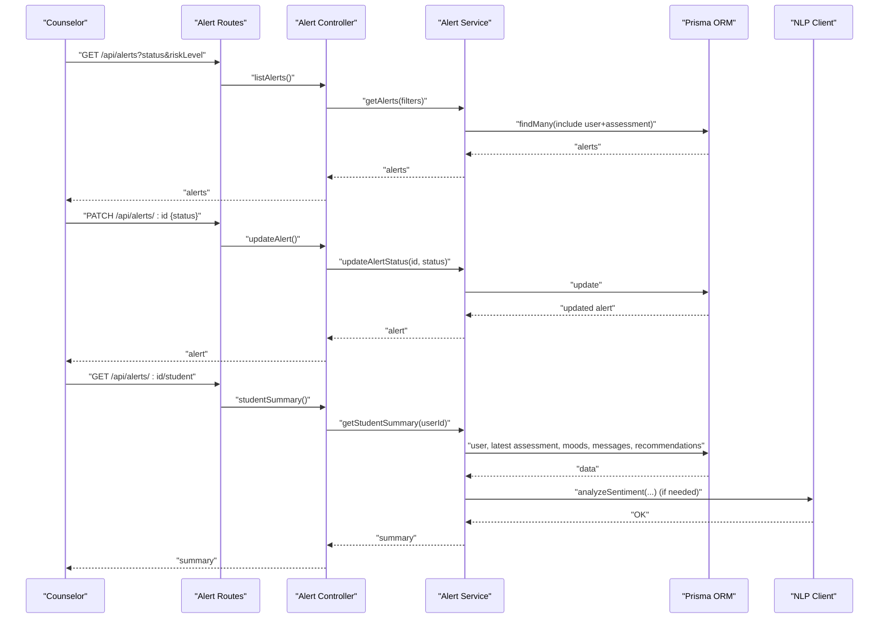
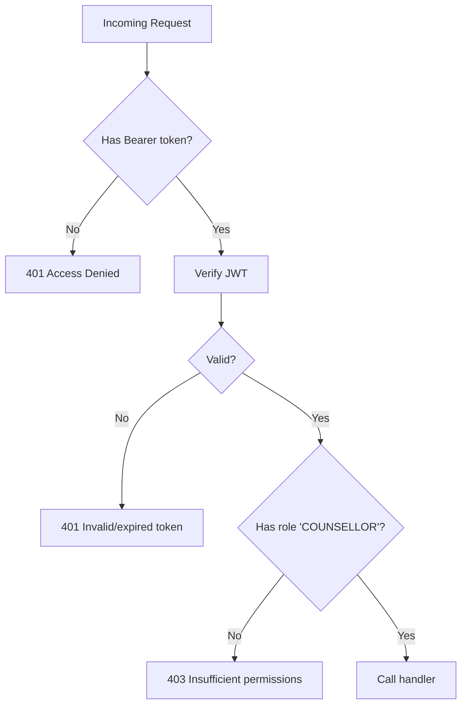
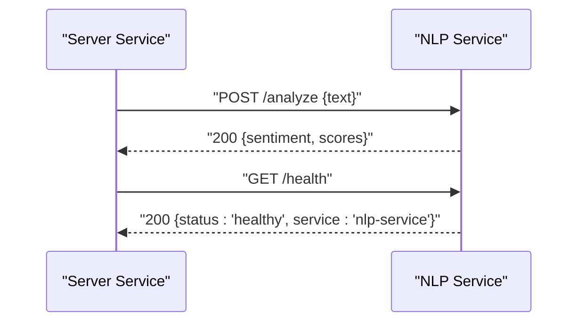
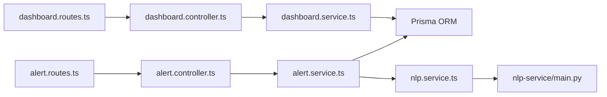

# Administrative Interface

<cite>
**Referenced Files in This Document**
- [dashboard.controller.ts](file://server/src/controllers/dashboard.controller.ts)
- [dashboard.service.ts](file://server/src/services/dashboard.service.ts)
- [dashboard.routes.ts](file://server/src/routes/dashboard.routes.ts)
- [alert.controller.ts](file://server/src/controllers/alert.controller.ts)
- [alert.service.ts](file://server/src/services/alert.service.ts)
- [alert.routes.ts](file://server/src/routes/alert.routes.ts)
- [auth.ts](file://server/src/middleware/auth.ts)
- [nlp.service.ts](file://server/src/services/nlp.service.ts)
- [main.py](file://nlp-service/main.py)
- [models.py](file://nlp-service/models.py)
- [test_main.py](file://nlp-service/test_main.py)
- [page.tsx](file://client/src/app/dashboard/page.tsx)
- [requirements.md](file://requirements.md)
</cite>

## Table of Contents
1. [Introduction](#introduction)
2. [Project Structure](#project-structure)
3. [Core Components](#core-components)
4. [Architecture Overview](#architecture-overview)
5. [Detailed Component Analysis](#detailed-component-analysis)
6. [Dependency Analysis](#dependency-analysis)
7. [Performance Considerations](#performance-considerations)
8. [Troubleshooting Guide](#troubleshooting-guide)
9. [Conclusion](#conclusion)
10. [Appendices](#appendices)

## Introduction
This document describes the administrative dashboard system for monitoring and overseeing the BuddyAI platform. It focuses on:
- System monitoring via counselor dashboards and alert management
- User enrollment and risk analytics
- Institutional oversight for mental health program evaluation, compliance, and outcomes
- Integration points for NLP sentiment analysis and health checks
- Practical administrative workflows for reporting, capacity planning, and quality assurance

The administrative interface is role-protected and centered around counselors who can view system-wide metrics, manage alerts, and generate student summaries for oversight.

## Project Structure
The administrative dashboard spans three layers:
- Frontend (Next.js app) renders counselor dashboards and student-facing dashboards
- Backend (Express server) exposes REST endpoints for counselors and integrates with Prisma ORM
- NLP microservice (FastAPI) provides sentiment analysis and health checks

**Diagram sources**
- [dashboard.routes.ts:1-11](file://server/src/routes/dashboard.routes.ts#L1-L11)
- [alert.routes.ts:1-15](file://server/src/routes/alert.routes.ts#L1-L15)
- [auth.ts:1-39](file://server/src/middleware/auth.ts#L1-L39)
- [dashboard.controller.ts:1-13](file://server/src/controllers/dashboard.controller.ts#L1-L13)
- [dashboard.service.ts:1-19](file://server/src/services/dashboard.service.ts#L1-L19)
- [alert.controller.ts:1-70](file://server/src/controllers/alert.controller.ts#L1-L70)
- [alert.service.ts:1-62](file://server/src/services/alert.service.ts#L1-L62)
- [nlp.service.ts:1-24](file://server/src/services/nlp.service.ts#L1-L24)
- [main.py:1-71](file://nlp-service/main.py#L1-L71)

**Section sources**
- [dashboard.routes.ts:1-11](file://server/src/routes/dashboard.routes.ts#L1-L11)
- [alert.routes.ts:1-15](file://server/src/routes/alert.routes.ts#L1-L15)
- [auth.ts:1-39](file://server/src/middleware/auth.ts#L1-L39)
- [page.tsx:1-206](file://client/src/app/dashboard/page.tsx#L1-L206)

## Core Components
- Counselor Dashboard Metrics Endpoint
  - Route: GET /api/dashboard/stats
  - Role: COUNSELLOR
  - Returns: aggregated counts for alerts (total, pending, reviewed, resolved), total enrolled students, and risk distribution
- Alert Management
  - List alerts with optional filters by status and risk level
  - Retrieve a single alert with user and assessment details
  - Update alert status (PENDING, REVIEWED, RESOLVED)
  - Generate student summary including latest assessment, recent moods, sentiment breakdown, and recommendations
- Authentication and Authorization
  - JWT bearer token verification
  - Role enforcement for counselor-only access
- NLP Integration
  - HTTP client to NLP service /analyze endpoint
  - Health check endpoint exposed by NLP service

**Section sources**
- [dashboard.controller.ts:1-13](file://server/src/controllers/dashboard.controller.ts#L1-L13)
- [dashboard.service.ts:1-19](file://server/src/services/dashboard.service.ts#L1-L19)
- [dashboard.routes.ts:1-11](file://server/src/routes/dashboard.routes.ts#L1-L11)
- [alert.controller.ts:1-70](file://server/src/controllers/alert.controller.ts#L1-L70)
- [alert.service.ts:1-62](file://server/src/services/alert.service.ts#L1-L62)
- [alert.routes.ts:1-15](file://server/src/routes/alert.routes.ts#L1-L15)
- [auth.ts:1-39](file://server/src/middleware/auth.ts#L1-L39)
- [nlp.service.ts:1-24](file://server/src/services/nlp.service.ts#L1-L24)
- [main.py:61-64](file://nlp-service/main.py#L61-L64)

## Architecture Overview
The administrative interface is built on a layered architecture:
- Presentation Layer: React pages for counselors and students
- Application Layer: Express routes, controllers, and services
- Data Access Layer: Prisma ORM queries
- External Services: NLP microservice for sentiment analysis

**Diagram sources**
- [dashboard.routes.ts:1-11](file://server/src/routes/dashboard.routes.ts#L1-L11)
- [alert.routes.ts:1-15](file://server/src/routes/alert.routes.ts#L1-L15)
- [auth.ts:1-39](file://server/src/middleware/auth.ts#L1-L39)
- [dashboard.controller.ts:1-13](file://server/src/controllers/dashboard.controller.ts#L1-L13)
- [alert.controller.ts:1-70](file://server/src/controllers/alert.controller.ts#L1-L70)
- [dashboard.service.ts:1-19](file://server/src/services/dashboard.service.ts#L1-L19)
- [alert.service.ts:1-62](file://server/src/services/alert.service.ts#L1-L62)

## Detailed Component Analysis

### Dashboard Metrics Service
The counselor dashboard aggregates system-wide metrics:
- Total alerts, pending, reviewed, resolved
- Total enrolled students (role: STUDENT)
- Risk distribution across risk levels

**Diagram sources**
- [dashboard.service.ts:3-18](file://server/src/services/dashboard.service.ts#L3-L18)

**Section sources**
- [dashboard.controller.ts:1-13](file://server/src/controllers/dashboard.controller.ts#L1-L13)
- [dashboard.service.ts:1-19](file://server/src/services/dashboard.service.ts#L1-L19)
- [dashboard.routes.ts:1-11](file://server/src/routes/dashboard.routes.ts#L1-L11)

### Alert Management Service
Administrators (counselors) can:
- Filter and list alerts by status and risk level
- View detailed alert with user and assessment info
- Update alert status
- Generate a student summary including:
  - Latest PHQ-9 assessment
  - Average mood rating and recent entries
  - Sentiment breakdown of recent messages
  - Recent recommendations

**Diagram sources**
- [alert.routes.ts:1-15](file://server/src/routes/alert.routes.ts#L1-L15)
- [alert.controller.ts:1-70](file://server/src/controllers/alert.controller.ts#L1-L70)
- [alert.service.ts:1-62](file://server/src/services/alert.service.ts#L1-L62)
- [nlp.service.ts:1-24](file://server/src/services/nlp.service.ts#L1-L24)

**Section sources**
- [alert.controller.ts:1-70](file://server/src/controllers/alert.controller.ts#L1-L70)
- [alert.service.ts:1-62](file://server/src/services/alert.service.ts#L1-L62)
- [alert.routes.ts:1-15](file://server/src/routes/alert.routes.ts#L1-L15)

### Authentication and Authorization
- Token verification middleware enforces bearer token presence and validity
- Role guard ensures only users with role COUNSELLOR can access counselor endpoints
- Unauthorized or insufficient permission responses are returned accordingly

**Diagram sources**
- [auth.ts:1-39](file://server/src/middleware/auth.ts#L1-L39)

**Section sources**
- [auth.ts:1-39](file://server/src/middleware/auth.ts#L1-L39)
- [dashboard.routes.ts:7-8](file://server/src/routes/dashboard.routes.ts#L7-L8)
- [alert.routes.ts:7-12](file://server/src/routes/alert.routes.ts#L7-L12)

### NLP Service Integration
- The backend calls the NLP service’s /analyze endpoint to obtain sentiment classification and scores
- The NLP service exposes a /health endpoint indicating operational status
- Tests validate health and sentiment classification behavior

**Diagram sources**
- [nlp.service.ts:11-23](file://server/src/services/nlp.service.ts#L11-L23)
- [main.py:43-64](file://nlp-service/main.py#L43-L64)
- [test_main.py:8-39](file://nlp-service/test_main.py#L8-L39)

**Section sources**
- [nlp.service.ts:1-24](file://server/src/services/nlp.service.ts#L1-L24)
- [main.py:1-71](file://nlp-service/main.py#L1-L71)
- [test_main.py:1-39](file://nlp-service/test_main.py#L1-L39)

### Student Dashboard (Context)
While not administrative, the student dashboard provides context for counselor oversight:
- Displays latest mood, PHQ-9 severity, and risk level
- Provides quick actions to chat, assessment, and mood logging
- Fetches recent mood entries for trend awareness

**Section sources**
- [page.tsx:1-206](file://client/src/app/dashboard/page.tsx#L1-L206)

## Dependency Analysis
Key dependencies and relationships:
- Routes depend on middleware for authentication and role checks
- Controllers depend on services for data retrieval and updates
- Services depend on Prisma ORM for database operations
- Alert service optionally depends on NLP client for sentiment analysis
- NLP service is a standalone FastAPI application with health and analyze endpoints

**Diagram sources**
- [dashboard.routes.ts:1-11](file://server/src/routes/dashboard.routes.ts#L1-L11)
- [alert.routes.ts:1-15](file://server/src/routes/alert.routes.ts#L1-L15)
- [dashboard.controller.ts:1-13](file://server/src/controllers/dashboard.controller.ts#L1-L13)
- [alert.controller.ts:1-70](file://server/src/controllers/alert.controller.ts#L1-L70)
- [dashboard.service.ts:1-19](file://server/src/services/dashboard.service.ts#L1-L19)
- [alert.service.ts:1-62](file://server/src/services/alert.service.ts#L1-L62)
- [nlp.service.ts:1-24](file://server/src/services/nlp.service.ts#L1-L24)
- [main.py:1-71](file://nlp-service/main.py#L1-L71)

**Section sources**
- [dashboard.routes.ts:1-11](file://server/src/routes/dashboard.routes.ts#L1-L11)
- [alert.routes.ts:1-15](file://server/src/routes/alert.routes.ts#L1-L15)
- [auth.ts:1-39](file://server/src/middleware/auth.ts#L1-L39)

## Performance Considerations
- Parallel aggregation in dashboard service reduces round-trips to the database
- Batched queries for counselor metrics improve responsiveness
- NLP service latency affects real-time sentiment processing; consider caching or rate limiting
- Use pagination for alert listing in future enhancements to handle large datasets

## Troubleshooting Guide
Common issues and resolutions:
- Authentication failures
  - Ensure a valid Bearer token is included in the Authorization header
  - Verify token expiration and signature
- Authorization failures
  - Confirm the user has role COUNSELLOR
  - Role checks block access to counselor endpoints for others
- Alert status updates
  - Validate status values are one of PENDING, REVIEWED, RESOLVED
  - Confirm alert ID exists before updating
- NLP service unavailability
  - Check /health endpoint for operational status
  - Retry requests with exponential backoff
- Database connectivity
  - Verify Prisma connection and migrations applied
  - Monitor query performance for large aggregations

**Section sources**
- [auth.ts:1-39](file://server/src/middleware/auth.ts#L1-L39)
- [alert.controller.ts:32-53](file://server/src/controllers/alert.controller.ts#L32-L53)
- [main.py:61-64](file://nlp-service/main.py#L61-L64)

## Conclusion
The administrative dashboard provides counselors with essential oversight capabilities:
- Real-time system metrics and risk distribution
- Comprehensive alert management with status tracking
- Student summaries integrating assessments, moods, and sentiment
- Integrated NLP health monitoring for service reliability

These features support institutional goals for program evaluation, compliance, and outcome measurement while maintaining strict access controls and data privacy.

## Appendices

### Administrative Workflows

- System Reporting
  - Use counselor dashboard metrics to report total alerts, resolution rates, and risk distributions
  - Export student summaries for case reviews and progress tracking

- Capacity Planning
  - Monitor total enrolled students and alert volumes to assess caseloads
  - Track pending alerts to identify staffing needs

- Quality Assurance Monitoring
  - Audit alert status transitions (PENDING → REVIEWED → RESOLVED)
  - Review sentiment analysis health and response times

- Institutional Compliance and Outcome Measurement
  - Maintain audit trails of alert updates and student summaries
  - Use PHQ-9 severity and risk level classifications for outcome reporting
  - Ensure role-based access prevents unauthorized data exposure

**Section sources**
- [dashboard.service.ts:3-18](file://server/src/services/dashboard.service.ts#L3-L18)
- [alert.service.ts:35-61](file://server/src/services/alert.service.ts#L35-L61)
- [requirements.md:203-221](file://requirements.md#L203-L221)