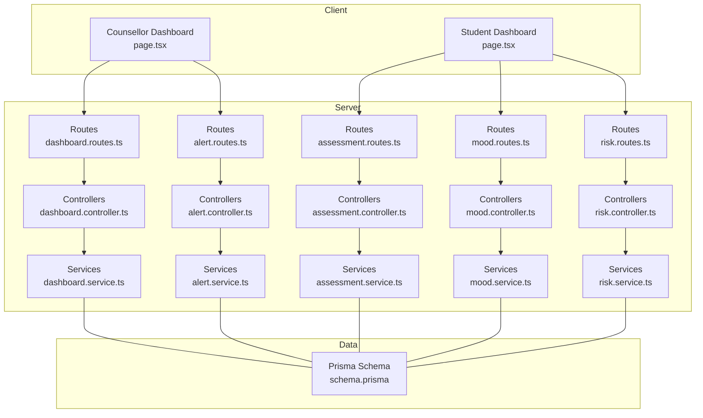
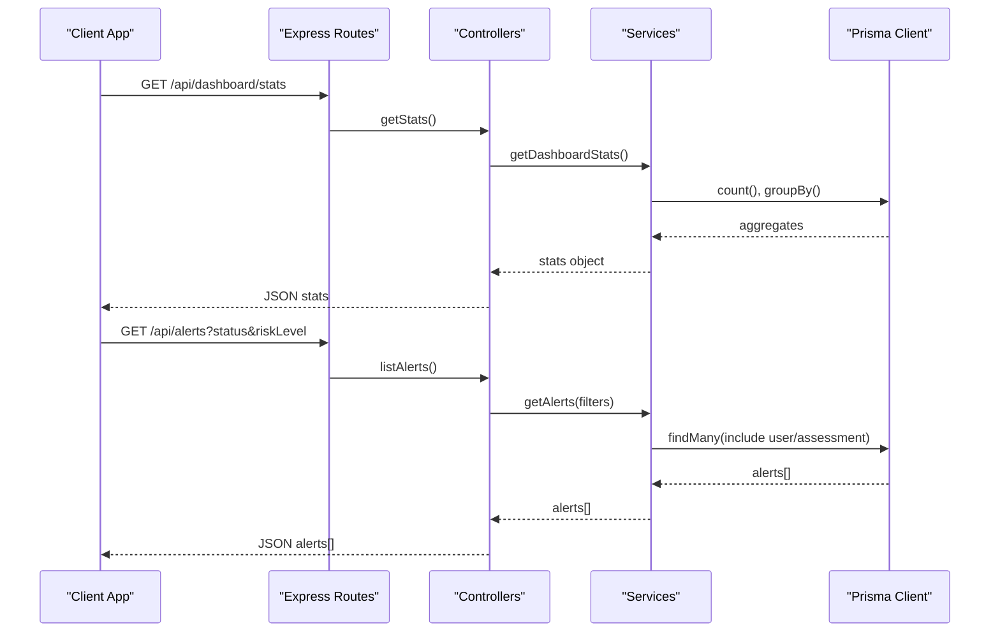
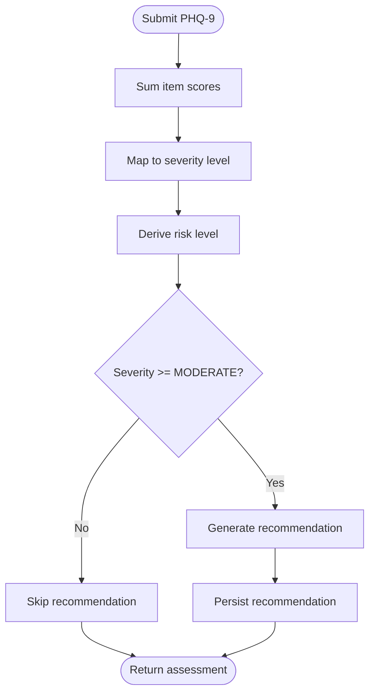
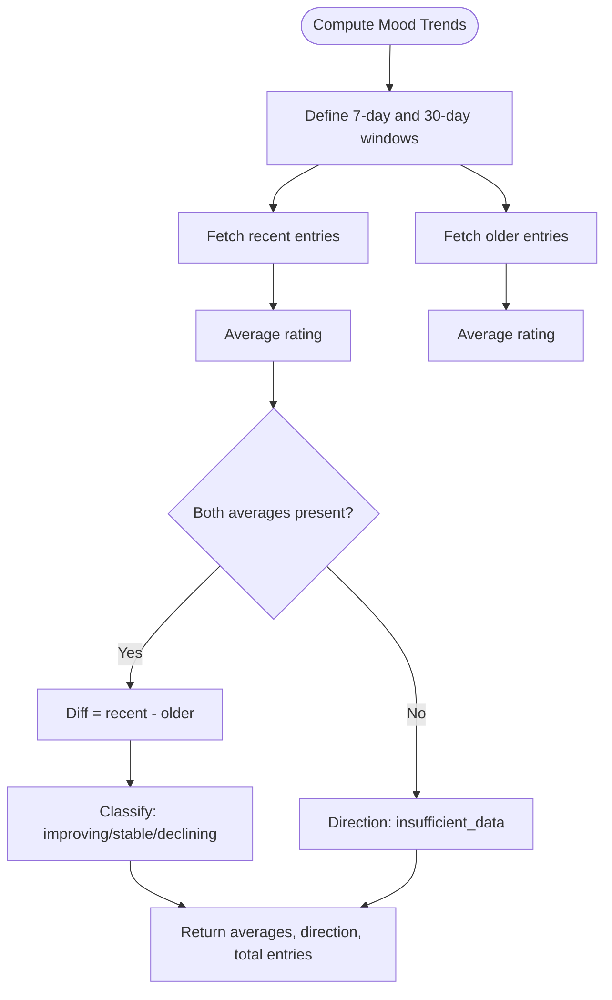
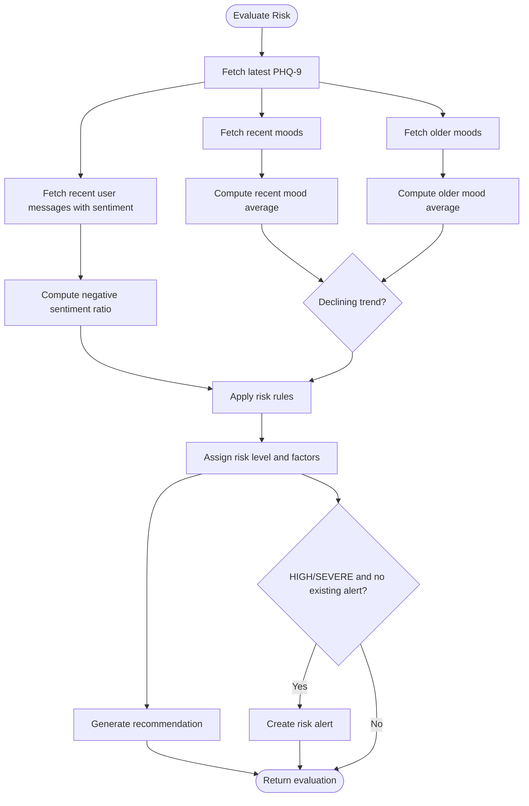
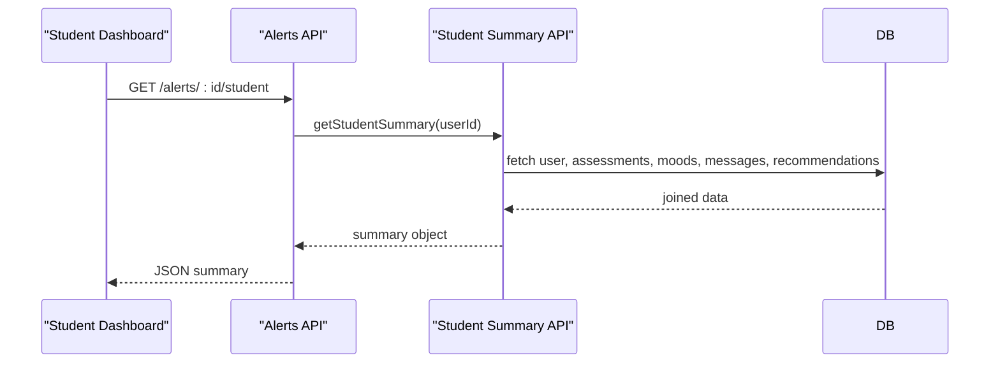
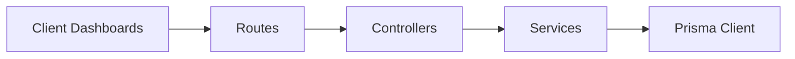

# Analytics and Reporting

<cite>
**Referenced Files in This Document**
- [schema.prisma](file://prisma/schema.prisma)
- [assessment.service.ts](file://server/src/services/assessment.service.ts)
- [assessment.controller.ts](file://server/src/controllers/assessment.controller.ts)
- [mood.service.ts](file://server/src/services/mood.service.ts)
- [mood.controller.ts](file://server/src/controllers/mood.controller.ts)
- [risk.service.ts](file://server/src/services/risk.service.ts)
- [risk.controller.ts](file://server/src/controllers/risk.controller.ts)
- [dashboard.service.ts](file://server/src/services/dashboard.service.ts)
- [dashboard.controller.ts](file://server/src/controllers/dashboard.controller.ts)
- [dashboard.routes.ts](file://server/src/routes/dashboard.routes.ts)
- [alert.service.ts](file://server/src/services/alert.service.ts)
- [alert.controller.ts](file://server/src/controllers/alert.controller.ts)
- [alert.routes.ts](file://server/src/routes/alert.routes.ts)
- [page.tsx](file://client/src/app/dashboard/page.tsx)
- [page.tsx](file://client/src/app/counsellor/dashboard/page.tsx)
- [README.md](file://README.md)
</cite>

## Table of Contents
1. [Introduction](#introduction)
2. [Project Structure](#project-structure)
3. [Core Components](#core-components)
4. [Architecture Overview](#architecture-overview)
5. [Detailed Component Analysis](#detailed-component-analysis)
6. [Dependency Analysis](#dependency-analysis)
7. [Performance Considerations](#performance-considerations)
8. [Troubleshooting Guide](#troubleshooting-guide)
9. [Conclusion](#conclusion)
10. [Appendices](#appendices)

## Introduction
This document describes the analytics and reporting system for generating data-driven insights and institutional intelligence within the BuddyAI platform. It focuses on:
- Data aggregation algorithms for assessment results, mood tracking, and engagement metrics
- Reporting capabilities for institutional summaries, intervention effectiveness, and system utilization
- Visualization components for trends, comparisons, and benchmarks
- Practical examples of report generation, data export formats, and custom query capabilities
- Statistical analysis features for pattern detection, risk factor identification, and program effectiveness
- Integration touchpoints with clinical quality measures, research data collection, and compliance reporting
- Data retention, privacy safeguards, and secure handling practices

## Project Structure
The analytics and reporting system spans the backend services and controllers, the Prisma data model, and the frontend dashboards. Key areas:
- Data model defines entities and enums for assessments, moods, messages, recommendations, and risk alerts
- Services encapsulate analytics computations (e.g., PHQ-9 scoring, mood trends, risk evaluation)
- Controllers expose REST endpoints for clients to fetch analytics and manage alerts
- Routes enforce authentication and role-based access for counselor dashboards
- Frontend dashboards visualize aggregated insights and enable filtering and drill-down

**Diagram sources**
- [dashboard.routes.ts:1-11](file://server/src/routes/dashboard.routes.ts#L1-L11)
- [dashboard.controller.ts:1-13](file://server/src/controllers/dashboard.controller.ts#L1-L13)
- [dashboard.service.ts:1-19](file://server/src/services/dashboard.service.ts#L1-L19)
- [alert.routes.ts:1-15](file://server/src/routes/alert.routes.ts#L1-L15)
- [alert.controller.ts:1-70](file://server/src/controllers/alert.controller.ts#L1-L70)
- [alert.service.ts:1-62](file://server/src/services/alert.service.ts#L1-L62)
- [assessment.controller.ts:1-74](file://server/src/controllers/assessment.controller.ts#L1-L74)
- [assessment.service.ts:1-89](file://server/src/services/assessment.service.ts#L1-L89)
- [mood.controller.ts:1-67](file://server/src/controllers/mood.controller.ts#L1-L67)
- [mood.service.ts:1-58](file://server/src/services/mood.service.ts#L1-L58)
- [risk.controller.ts:1-32](file://server/src/controllers/risk.controller.ts#L1-L32)
- [risk.service.ts:1-138](file://server/src/services/risk.service.ts#L1-L138)
- [schema.prisma:1-134](file://prisma/schema.prisma#L1-L134)

**Section sources**
- [dashboard.routes.ts:1-11](file://server/src/routes/dashboard.routes.ts#L1-L11)
- [alert.routes.ts:1-15](file://server/src/routes/alert.routes.ts#L1-L15)
- [assessment.controller.ts:1-74](file://server/src/controllers/assessment.controller.ts#L1-L74)
- [mood.controller.ts:1-67](file://server/src/controllers/mood.controller.ts#L1-L67)
- [risk.controller.ts:1-32](file://server/src/controllers/risk.controller.ts#L1-L32)
- [schema.prisma:1-134](file://prisma/schema.prisma#L1-L134)

## Core Components
- Assessment analytics: PHQ-9 scoring, severity classification, and recommendation generation
- Mood analytics: rolling averages and directional trends over recent and older windows
- Risk analytics: composite risk evaluation combining PHQ-9, sentiment, and mood trends
- Institutional reporting: counselor dashboard stats, alert lifecycle, and student summaries
- Visualization surfaces: student overview and counselor monitoring dashboards

**Section sources**
- [assessment.service.ts:1-89](file://server/src/services/assessment.service.ts#L1-L89)
- [mood.service.ts:1-58](file://server/src/services/mood.service.ts#L1-L58)
- [risk.service.ts:1-138](file://server/src/services/risk.service.ts#L1-L138)
- [dashboard.service.ts:1-19](file://server/src/services/dashboard.service.ts#L1-L19)
- [alert.service.ts:1-62](file://server/src/services/alert.service.ts#L1-L62)
- [page.tsx:1-206](file://client/src/app/dashboard/page.tsx#L1-L206)
- [page.tsx:1-213](file://client/src/app/counsellor/dashboard/page.tsx#L1-L213)

## Architecture Overview
The analytics pipeline integrates client requests with service-layer computations and the data model. Counselor dashboards rely on aggregated counts and grouped distributions, while student dashboards surface recent insights.

**Diagram sources**
- [dashboard.routes.ts:1-11](file://server/src/routes/dashboard.routes.ts#L1-L11)
- [dashboard.controller.ts:1-13](file://server/src/controllers/dashboard.controller.ts#L1-L13)
- [dashboard.service.ts:1-19](file://server/src/services/dashboard.service.ts#L1-L19)
- [alert.routes.ts:1-15](file://server/src/routes/alert.routes.ts#L1-L15)
- [alert.controller.ts:1-70](file://server/src/controllers/alert.controller.ts#L1-L70)
- [alert.service.ts:1-62](file://server/src/services/alert.service.ts#L1-L62)

## Detailed Component Analysis

### Assessment Analytics
- Scoring and classification: Sum PHQ-9 item scores and map to severity levels; derive risk levels accordingly
- Recommendation generation: Create tailored recommendations for moderate/severe cases and persist them
- Endpoint behavior: Validate input arrays, compute totals, and conditionally generate recommendations

**Diagram sources**
- [assessment.service.ts:20-33](file://server/src/services/assessment.service.ts#L20-L33)
- [assessment.service.ts:48-61](file://server/src/services/assessment.service.ts#L48-L61)
- [assessment.service.ts:76-88](file://server/src/services/assessment.service.ts#L76-L88)
- [assessment.controller.ts:5-34](file://server/src/controllers/assessment.controller.ts#L5-L34)

**Section sources**
- [assessment.service.ts:1-89](file://server/src/services/assessment.service.ts#L1-L89)
- [assessment.controller.ts:1-74](file://server/src/controllers/assessment.controller.ts#L1-L74)

### Mood Analytics
- Trend computation: Compute recent (7-day) and older (30-day excluding 7-day) averages; compare differences to infer direction
- Endpoint behavior: Accept date filters for history; return trend summary for UI rendering

**Diagram sources**
- [mood.service.ts:22-57](file://server/src/services/mood.service.ts#L22-L57)
- [mood.controller.ts:54-66](file://server/src/controllers/mood.controller.ts#L54-L66)

**Section sources**
- [mood.service.ts:1-58](file://server/src/services/mood.service.ts#L1-L58)
- [mood.controller.ts:1-67](file://server/src/controllers/mood.controller.ts#L1-L67)

### Risk Analytics
- Composite evaluation: Combine latest PHQ-9 score, recent negative sentiment ratio, and mood trend to assign risk level
- Recommendation and alerting: Generate recommendations and create risk alerts for HIGH/SEVERE thresholds

**Diagram sources**
- [risk.service.ts:11-107](file://server/src/services/risk.service.ts#L11-L107)
- [risk.controller.ts:5-17](file://server/src/controllers/risk.controller.ts#L5-L17)

**Section sources**
- [risk.service.ts:1-138](file://server/src/services/risk.service.ts#L1-L138)
- [risk.controller.ts:1-32](file://server/src/controllers/risk.controller.ts#L1-L32)

### Institutional Reporting and Dashboards
- Counselor dashboard stats: Counts and distribution of risk alerts; total students; grouped risk distribution
- Student dashboard: Latest mood, PHQ-9 severity, risk level, and recent mood entries
- Alert management: Filter, status update, and student summary retrieval

**Diagram sources**
- [alert.controller.ts:55-69](file://server/src/controllers/alert.controller.ts#L55-L69)
- [alert.service.ts:35-61](file://server/src/services/alert.service.ts#L35-L61)

**Section sources**
- [dashboard.service.ts:1-19](file://server/src/services/dashboard.service.ts#L1-L19)
- [page.tsx:1-206](file://client/src/app/dashboard/page.tsx#L1-L206)
- [page.tsx:1-213](file://client/src/app/counsellor/dashboard/page.tsx#L1-L213)
- [alert.service.ts:1-62](file://server/src/services/alert.service.ts#L1-L62)
- [alert.controller.ts:1-70](file://server/src/controllers/alert.controller.ts#L1-L70)

## Dependency Analysis
The system exhibits clear separation of concerns:
- Routes depend on controllers
- Controllers depend on services
- Services depend on Prisma for data access
- Frontend dashboards consume REST endpoints

**Diagram sources**
- [dashboard.routes.ts:1-11](file://server/src/routes/dashboard.routes.ts#L1-L11)
- [alert.routes.ts:1-15](file://server/src/routes/alert.routes.ts#L1-L15)
- [assessment.controller.ts:1-74](file://server/src/controllers/assessment.controller.ts#L1-L74)
- [mood.controller.ts:1-67](file://server/src/controllers/mood.controller.ts#L1-L67)
- [risk.controller.ts:1-32](file://server/src/controllers/risk.controller.ts#L1-L32)
- [alert.controller.ts:1-70](file://server/src/controllers/alert.controller.ts#L1-L70)
- [dashboard.controller.ts:1-13](file://server/src/controllers/dashboard.controller.ts#L1-L13)
- [assessment.service.ts:1-89](file://server/src/services/assessment.service.ts#L1-L89)
- [mood.service.ts:1-58](file://server/src/services/mood.service.ts#L1-L58)
- [risk.service.ts:1-138](file://server/src/services/risk.service.ts#L1-L138)
- [alert.service.ts:1-62](file://server/src/services/alert.service.ts#L1-L62)
- [dashboard.service.ts:1-19](file://server/src/services/dashboard.service.ts#L1-L19)

**Section sources**
- [schema.prisma:1-134](file://prisma/schema.prisma#L1-L134)

## Performance Considerations
- Aggregation efficiency: Services use batched queries (Promise.all) to minimize round-trips
- Indexing: Prisma models define indexes on foreign keys and frequently queried fields
- Trend calculations: Lightweight window slicing and simple arithmetic reduce CPU overhead
- Endpoint validation: Controllers validate inputs early to avoid unnecessary database work

[No sources needed since this section provides general guidance]

## Troubleshooting Guide
- Authentication failures: Controllers return 401 when req.user is missing; ensure middleware is applied
- Validation errors: Controllers return 400 with descriptive messages for malformed inputs
- Not found errors: Controllers return 404 when resources (e.g., assessments, alerts) are absent
- Error propagation: Middleware can be added to centralize error handling

**Section sources**
- [assessment.controller.ts:7-21](file://server/src/controllers/assessment.controller.ts#L7-L21)
- [mood.controller.ts:14-27](file://server/src/controllers/mood.controller.ts#L14-L27)
- [alert.controller.ts:22-46](file://server/src/controllers/alert.controller.ts#L22-L46)

## Conclusion
The analytics and reporting system integrates assessment scoring, mood trend analysis, and risk evaluation into actionable insights. Counselor dashboards provide institutional oversight via alert statistics and filtered views, while student dashboards deliver personalized summaries. The modular architecture supports extensibility for advanced reporting, export capabilities, and compliance integrations.

[No sources needed since this section summarizes without analyzing specific files]

## Appendices

### Data Aggregation Algorithms Reference
- PHQ-9 scoring and severity mapping: [assessment.service.ts:20-33](file://server/src/services/assessment.service.ts#L20-L33), [assessment.service.ts:48-61](file://server/src/services/assessment.service.ts#L48-L61)
- Mood trend direction: [mood.service.ts:22-57](file://server/src/services/mood.service.ts#L22-L57)
- Risk evaluation rules: [risk.service.ts:11-107](file://server/src/services/risk.service.ts#L11-L107)

**Section sources**
- [assessment.service.ts:1-89](file://server/src/services/assessment.service.ts#L1-L89)
- [mood.service.ts:1-58](file://server/src/services/mood.service.ts#L1-L58)
- [risk.service.ts:1-138](file://server/src/services/risk.service.ts#L1-L138)

### Reporting and Visualization Surfaces
- Student overview dashboard: [page.tsx:1-206](file://client/src/app/dashboard/page.tsx#L1-L206)
- Counselor monitoring dashboard: [page.tsx:1-213](file://client/src/app/counsellor/dashboard/page.tsx#L1-L213)

**Section sources**
- [page.tsx:1-206](file://client/src/app/dashboard/page.tsx#L1-L206)
- [page.tsx:1-213](file://client/src/app/counsellor/dashboard/page.tsx#L1-L213)

### Data Model Entities and Enums
- Entities: User, Conversation, Message, MoodEntry, Phq9Assessment, Recommendation, RiskAlert
- Enums: Role, Sentiment, Sender, SeverityLevel, RiskLevel, AlertStatus

**Section sources**
- [schema.prisma:1-134](file://prisma/schema.prisma#L1-L134)

### Evaluation Metrics and Research Alignment
- Performance metrics include response time, availability, database query time, and recommendation generation time
- PHQ-9 accuracy and severity classification are key assessment metrics
- Risk detection metrics include high-risk and severe-risk flags and intervention rates

**Section sources**
- [README.md:764-820](file://README.md#L764-L820)