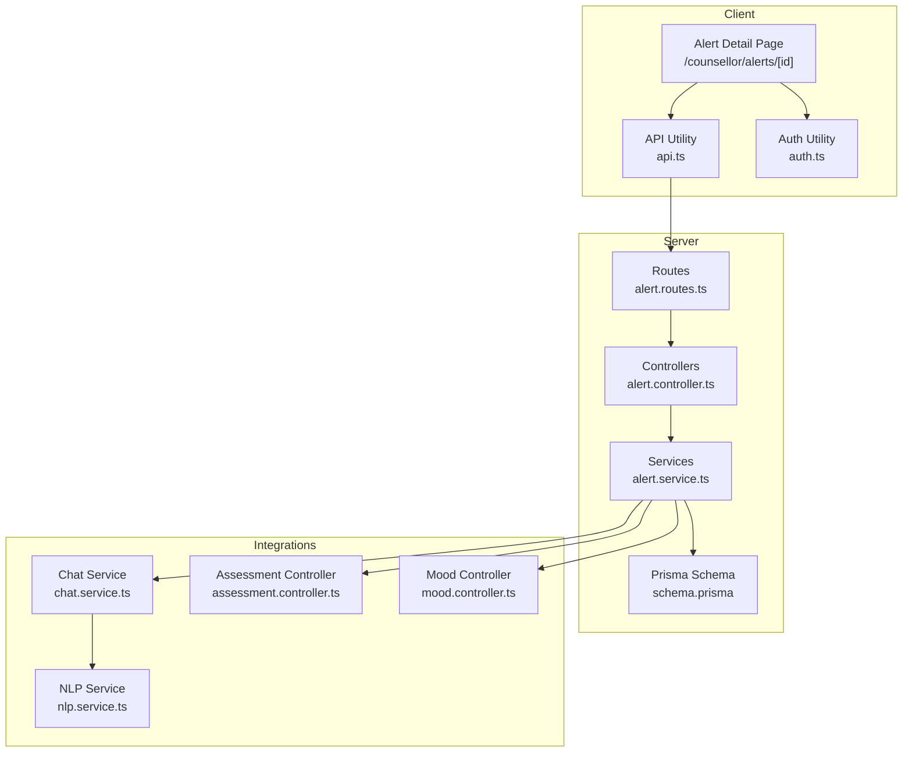
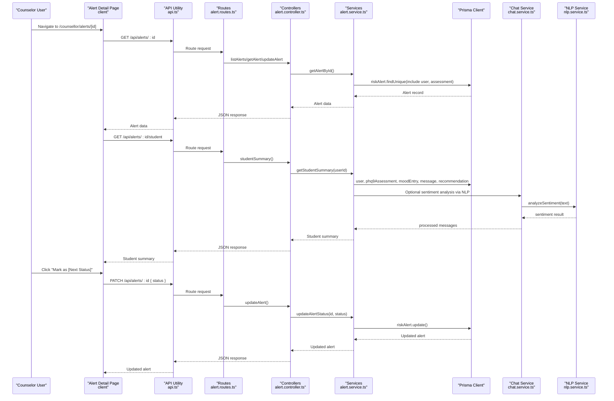
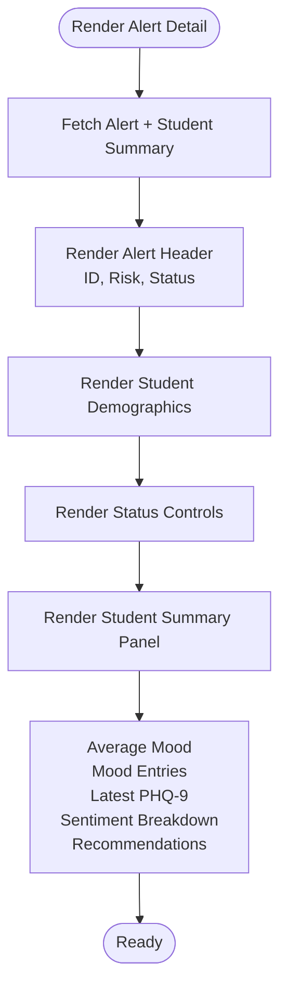
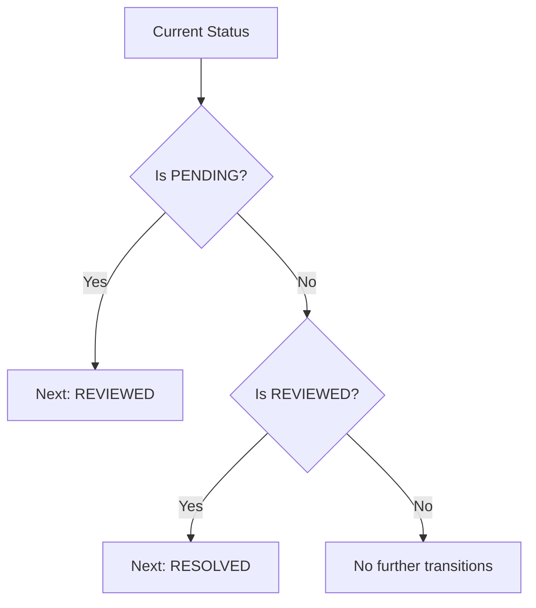
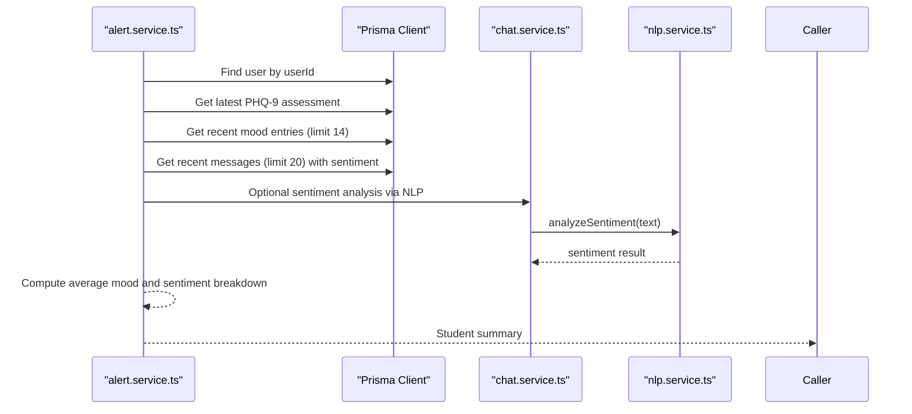
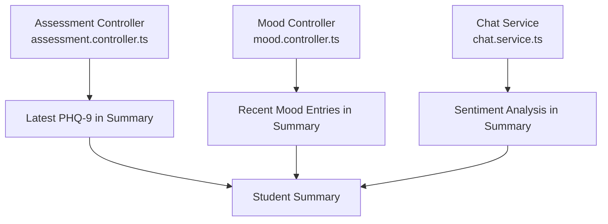
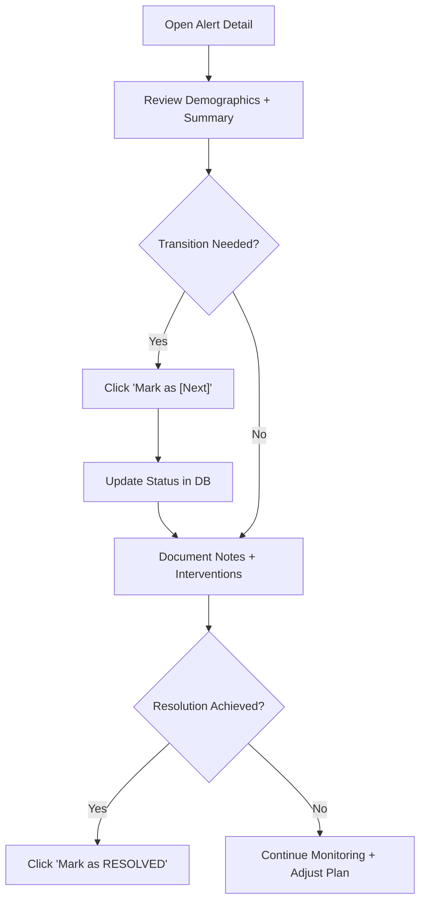
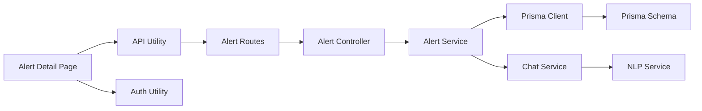

# Alert Detail and Management

<cite>
**Referenced Files in This Document**
- [alert.controller.ts](file://server/src/controllers/alert.controller.ts)
- [alert.service.ts](file://server/src/services/alert.service.ts)
- [alert.routes.ts](file://server/src/routes/alert.routes.ts)
- [page.tsx](file://client/src/app/counsellor/alerts/[id]/page.tsx)
- [api.ts](file://client/src/lib/api.ts)
- [auth.ts](file://client/src/lib/auth.ts)
- [schema.prisma](file://prisma/schema.prisma)
- [chat.service.ts](file://server/src/services/chat.service.ts)
- [nlp.service.ts](file://server/src/services/nlp.service.ts)
- [assessment.controller.ts](file://server/src/controllers/assessment.controller.ts)
- [mood.controller.ts](file://server/src/controllers/mood.controller.ts)
- [page.tsx](file://client/src/app/chat/page.tsx)
- [page.tsx](file://client/src/app/mood/page.tsx)
- [page.tsx](file://client/src/app/counsellor/dashboard/page.tsx)
</cite>

## Table of Contents
1. [Introduction](#introduction)
2. [Project Structure](#project-structure)
3. [Core Components](#core-components)
4. [Architecture Overview](#architecture-overview)
5. [Detailed Component Analysis](#detailed-component-analysis)
6. [Dependency Analysis](#dependency-analysis)
7. [Performance Considerations](#performance-considerations)
8. [Troubleshooting Guide](#troubleshooting-guide)
9. [Conclusion](#conclusion)

## Introduction
This document describes the alert detail management system designed for comprehensive student case review and intervention tracking. It explains the individual alert view interface that displays student demographics, risk assessment history, recent chat conversations, and mood tracking data. It documents the alert status management workflow (PENDING → REVIEWED → RESOLVED), intervention documentation features, counselor notes, and progress tracking capabilities. Practical counselor workflows are outlined from initial alert review through intervention completion, with integration points to assessment history, chat logs, and mood trends to support informed decision-making.

## Project Structure
The alert detail system spans client and server layers:
- Client-side route: `/counsellor/alerts/[id]` renders the alert detail page and orchestrates data fetching.
- Server-side routes: `/api/alerts/:id` and `/api/alerts/:id/student` expose alert and student summary endpoints.
- Services: Alert service retrieves alert records and builds a student summary combining assessments, moods, recent chat sentiment, and recommendations.
- Prisma schema defines the RiskAlert model and relationships to User and Phq9Assessment.
- Integrations: Chat service performs sentiment analysis via NLP, and mood/assessment controllers provide complementary health metrics.

**Diagram sources**
- [page.tsx:34-245](file://client/src/app/counsellor/alerts/[id]/page.tsx#L34-L245)
- [api.ts:1-36](file://client/src/lib/api.ts#L1-L36)
- [auth.ts:1-27](file://client/src/lib/auth.ts#L1-L27)
- [alert.routes.ts:1-15](file://server/src/routes/alert.routes.ts#L1-L15)
- [alert.controller.ts:1-70](file://server/src/controllers/alert.controller.ts#L1-L70)
- [alert.service.ts:1-62](file://server/src/services/alert.service.ts#L1-L62)
- [schema.prisma:121-133](file://prisma/schema.prisma#L121-L133)
- [chat.service.ts:1-104](file://server/src/services/chat.service.ts#L1-L104)
- [nlp.service.ts:1-23](file://server/src/services/nlp.service.ts#L1-L23)
- [assessment.controller.ts:1-74](file://server/src/controllers/assessment.controller.ts#L1-L74)
- [mood.controller.ts:1-67](file://server/src/controllers/mood.controller.ts#L1-L67)

**Section sources**
- [page.tsx:34-245](file://client/src/app/counsellor/alerts/[id]/page.tsx#L34-L245)
- [alert.routes.ts:1-15](file://server/src/routes/alert.routes.ts#L1-L15)
- [alert.controller.ts:1-70](file://server/src/controllers/alert.controller.ts#L1-L70)
- [alert.service.ts:1-62](file://server/src/services/alert.service.ts#L1-L62)
- [schema.prisma:121-133](file://prisma/schema.prisma#L121-L133)

## Core Components
- Alert Detail Page (Client): Fetches alert and student summary, renders student demographics, risk level, date, and current status. Provides a single-click status transition button and displays summary cards for average mood, mood entries, latest PHQ-9, sentiment breakdown, and recommendations.
- Alert Controllers (Server): Expose GET /api/alerts/:id, PATCH /api/alerts/:id for status updates, and GET /api/alerts/:id/student for student summary.
- Alert Service (Server): Retrieves alert by ID with user and assessment inclusion; computes student summary aggregating recent moods, recent messages with sentiment, latest PHQ-9, and recommendations.
- Prisma Schema: Defines RiskAlert with status enum (PENDING, REVIEWED, RESOLVED), riskLevel enum, and relations to User and Phq9Assessment.
- Integrations: Chat service performs sentiment analysis via NLP and stores sentiment with messages; mood and assessment controllers provide historical trends and severity levels.

**Section sources**
- [page.tsx:34-245](file://client/src/app/counsellor/alerts/[id]/page.tsx#L34-L245)
- [alert.controller.ts:18-69](file://server/src/controllers/alert.controller.ts#L18-L69)
- [alert.service.ts:18-61](file://server/src/services/alert.service.ts#L18-L61)
- [schema.prisma:41-45](file://prisma/schema.prisma#L41-L45)
- [chat.service.ts:45-88](file://server/src/services/chat.service.ts#L45-L88)
- [nlp.service.ts:11-22](file://server/src/services/nlp.service.ts#L11-L22)

## Architecture Overview
The alert detail workflow integrates client-side rendering with server-side data aggregation and external NLP processing.

**Diagram sources**
- [page.tsx:57-85](file://client/src/app/counsellor/alerts/[id]/page.tsx#L57-L85)
- [api.ts:3-35](file://client/src/lib/api.ts#L3-L35)
- [alert.routes.ts:9-12](file://server/src/routes/alert.routes.ts#L9-L12)
- [alert.controller.ts:18-53](file://server/src/controllers/alert.controller.ts#L18-L53)
- [alert.service.ts:18-33](file://server/src/services/alert.service.ts#L18-L33)
- [chat.service.ts:45-88](file://server/src/services/chat.service.ts#L45-L88)
- [nlp.service.ts:11-22](file://server/src/services/nlp.service.ts#L11-L22)

## Detailed Component Analysis

### Alert Detail View Interface
The alert detail page presents:
- Alert header with alert ID, risk badge, and status badge.
- Student demographics: name, email, creation date.
- Status controls: a button to advance status to the next logical state.
- Student summary panel:
  - Average mood and total mood entries.
  - Latest PHQ-9 score and severity level.
  - Sentiment breakdown of recent user messages.
  - Recommendations generated for the student.

**Diagram sources**
- [page.tsx:142-242](file://client/src/app/counsellor/alerts/[id]/page.tsx#L142-L242)

**Section sources**
- [page.tsx:34-245](file://client/src/app/counsellor/alerts/[id]/page.tsx#L34-L245)

### Alert Status Management Workflow
The system enforces a linear progression of statuses:
- PENDING → REVIEWED
- REVIEWED → RESOLVED

The client determines the next status based on the current status and invokes a PATCH endpoint to update the alert’s status. The controller validates the requested status against allowed values and updates the record.

**Diagram sources**
- [page.tsx:106-112](file://client/src/app/counsellor/alerts/[id]/page.tsx#L106-L112)
- [alert.controller.ts:32-53](file://server/src/controllers/alert.controller.ts#L32-L53)

**Section sources**
- [page.tsx:72-85](file://client/src/app/counsellor/alerts/[id]/page.tsx#L72-L85)
- [alert.controller.ts:32-53](file://server/src/controllers/alert.controller.ts#L32-L53)

### Student Summary Composition
The student summary aggregates:
- User profile (name, email).
- Latest PHQ-9 assessment (score and severity).
- Recent moods (last 14 entries) with average rating.
- Recent user messages with sentiment (last 20) for POSITIVE/NEUTRAL/NEGATIVE counts.
- Recommendations generated for the student.

**Diagram sources**
- [alert.service.ts:35-61](file://server/src/services/alert.service.ts#L35-L61)
- [chat.service.ts:45-88](file://server/src/services/chat.service.ts#L45-L88)
- [nlp.service.ts:11-22](file://server/src/services/nlp.service.ts#L11-L22)

**Section sources**
- [alert.service.ts:35-61](file://server/src/services/alert.service.ts#L35-L61)

### Integrations with Assessment History, Chat Logs, and Mood Trends
- Assessment history: The latest PHQ-9 score and severity level are included in the alert detail and student summary, enabling counselors to quickly assess recent mental health trends.
- Chat logs: The student summary includes a sentiment breakdown derived from recent user messages, providing insight into emotional tone and potential escalation risks.
- Mood trends: The summary shows average mood and recent entries, complemented by the standalone mood tracker page for deeper trend analysis.

**Diagram sources**
- [assessment.controller.ts:25-28](file://server/src/controllers/assessment.controller.ts#L25-L28)
- [mood.controller.ts:61-62](file://server/src/controllers/mood.controller.ts#L61-L62)
- [chat.service.ts:54-65](file://server/src/services/chat.service.ts#L54-L65)

**Section sources**
- [assessment.controller.ts:25-28](file://server/src/controllers/assessment.controller.ts#L25-L28)
- [mood.controller.ts:61-62](file://server/src/controllers/mood.controller.ts#L61-L62)
- [chat.service.ts:54-65](file://server/src/services/chat.service.ts#L54-L65)

### Practical Counselor Workflows
Example workflows from initial alert review to intervention completion:
- Initial Review:
  - Counselor navigates to the alert detail page from the dashboard.
  - Reviews student demographics, risk level, and date.
  - Reads the student summary: latest PHQ-9, average mood, sentiment breakdown, and recommendations.
- Status Transition:
  - Counselor clicks “Mark as REVIEWED” to move the alert from PENDING to REVIEWED.
  - Records counselor notes and intervention steps in the system (see Intervention Documentation).
- Ongoing Monitoring:
  - Counselor checks recent chat logs for sentiment shifts and mood tracker trends.
  - Updates recommendations as needed.
- Resolution:
  - After completing interventions, counselor clicks “Mark as RESOLVED.”
  - Documents progress outcomes and next steps.

**Diagram sources**
- [page.tsx:170-178](file://client/src/app/counsellor/alerts/[id]/page.tsx#L170-L178)
- [alert.controller.ts:32-53](file://server/src/controllers/alert.controller.ts#L32-L53)

**Section sources**
- [page.tsx:34-245](file://client/src/app/counsellor/alerts/[id]/page.tsx#L34-L245)
- [alert.controller.ts:32-53](file://server/src/controllers/alert.controller.ts#L32-L53)

## Dependency Analysis
Key dependencies and relationships:
- Client depends on API utility for authenticated requests and on auth utility for role checks.
- Routes enforce authentication and role filtering (COUNSELLOR).
- Controllers delegate to services for data retrieval and updates.
- Services depend on Prisma for database queries and on chat/NLP services for sentiment analysis.
- Prisma schema defines enums and relations for RiskAlert, User, and Phq9Assessment.

**Diagram sources**
- [page.tsx:34-70](file://client/src/app/counsellor/alerts/[id]/page.tsx#L34-L70)
- [api.ts:1-36](file://client/src/lib/api.ts#L1-L36)
- [auth.ts:1-27](file://client/src/lib/auth.ts#L1-L27)
- [alert.routes.ts:7-12](file://server/src/routes/alert.routes.ts#L7-L12)
- [alert.controller.ts:1-70](file://server/src/controllers/alert.controller.ts#L1-L70)
- [alert.service.ts:1-62](file://server/src/services/alert.service.ts#L1-L62)
- [chat.service.ts:1-104](file://server/src/services/chat.service.ts#L1-L104)
- [nlp.service.ts:1-23](file://server/src/services/nlp.service.ts#L1-L23)
- [schema.prisma:121-133](file://prisma/schema.prisma#L121-L133)

**Section sources**
- [alert.routes.ts:7-12](file://server/src/routes/alert.routes.ts#L7-L12)
- [alert.controller.ts:1-70](file://server/src/controllers/alert.controller.ts#L1-L70)
- [alert.service.ts:1-62](file://server/src/services/alert.service.ts#L1-L62)
- [schema.prisma:121-133](file://prisma/schema.prisma#L121-L133)

## Performance Considerations
- Parallel data fetching: The client fetches alert and student summary concurrently to reduce perceived latency.
- Efficient queries: The service aggregates recent data using limits (e.g., last 14 moods, last 20 messages) to minimize payload sizes.
- Sentiment analysis fallback: If the NLP service is unavailable, chat continues without sentiment, preventing cascading failures.
- Pagination and sorting: Prisma queries order and limit results to keep responses fast.

[No sources needed since this section provides general guidance]

## Troubleshooting Guide
Common issues and resolutions:
- Unauthorized access: If a non-counselor attempts to access the alert detail page, they are redirected to the appropriate dashboard. Authentication tokens are validated by the API utility; invalid tokens trigger logout.
- Alert not found: The controller returns a 404 when an alert ID does not exist; the client displays a friendly message.
- Invalid status update: The controller validates the status against allowed values and returns a 400 error for invalid inputs.
- NLP service errors: Chat service logs and continues without sentiment if NLP is unavailable; this prevents blocking chat functionality.

**Section sources**
- [page.tsx:44-54](file://client/src/app/counsellor/alerts/[id]/page.tsx#L44-L54)
- [api.ts:20-26](file://client/src/lib/api.ts#L20-L26)
- [alert.controller.ts:37-40](file://server/src/controllers/alert.controller.ts#L37-L40)
- [chat.service.ts:62-65](file://server/src/services/chat.service.ts#L62-L65)

## Conclusion
The alert detail management system provides counselors with a centralized, contextualized view of student cases. By integrating risk assessment history, recent chat sentiment, and mood trends, it supports informed decision-making and streamlined status management. The clean workflow from PENDING to REVIEWED to RESOLVED, combined with concurrent data loading and robust error handling, ensures efficient and reliable case tracking.