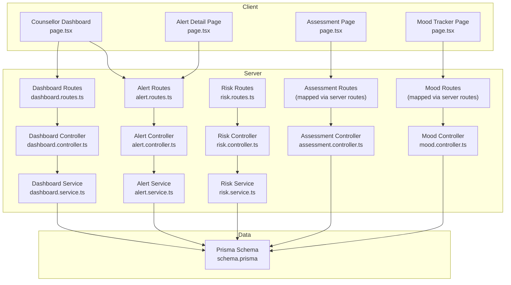
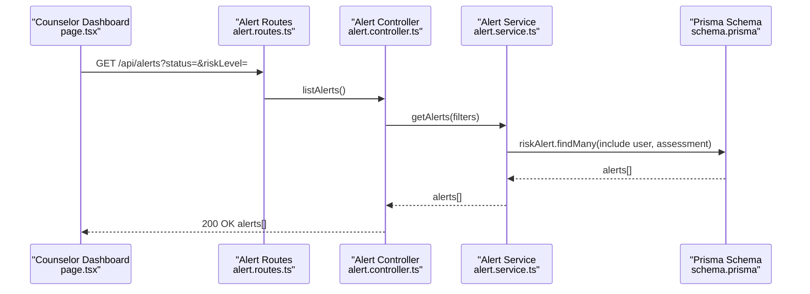
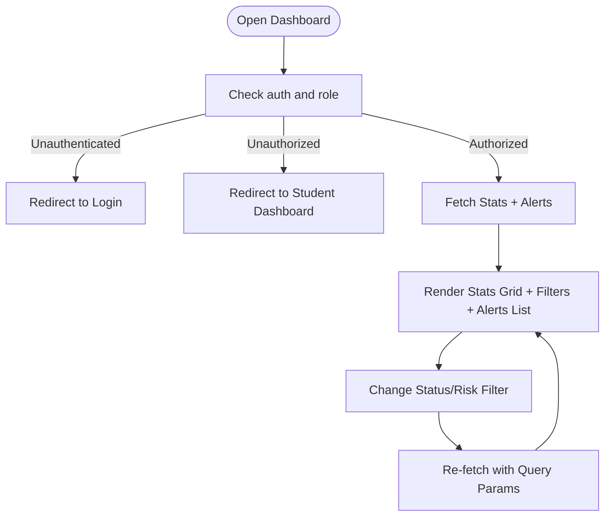
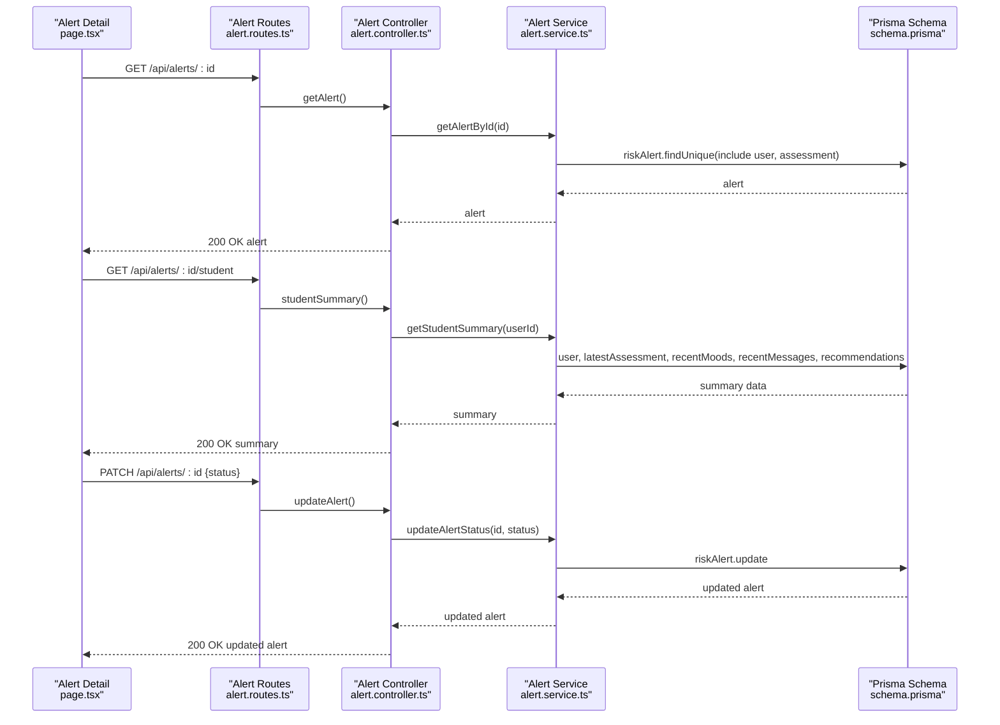
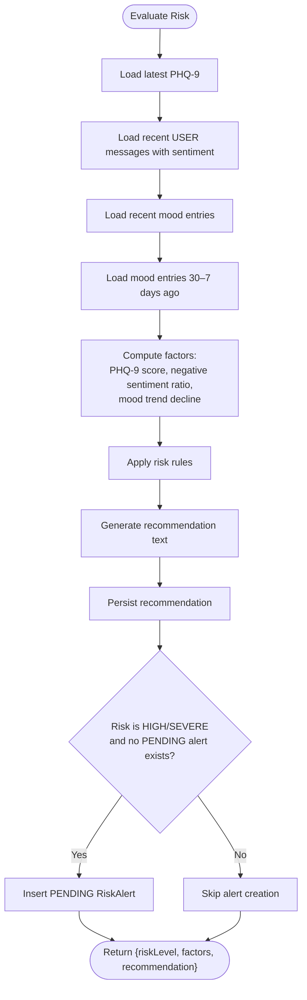
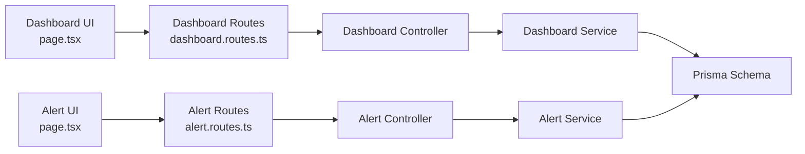
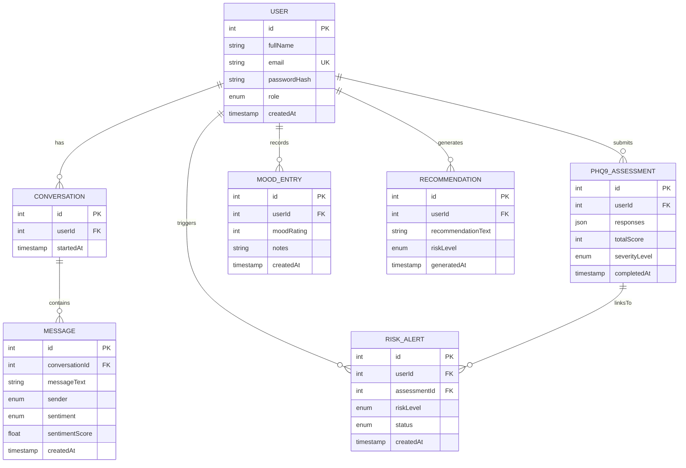

# Counselor Dashboard

<cite>
**Referenced Files in This Document**
- [client\src\app\counsellor\dashboard\page.tsx](file://client/src/app/counsellor/dashboard/page.tsx)
- [client\src\app\counsellor\alerts\[id]\page.tsx](file://client/src/app/counsellor/alerts/[id]/page.tsx)
- [client\src\app\assessment\page.tsx](file://client/src/app/assessment/page.tsx)
- [client\src\app\mood\page.tsx](file://client/src/app/mood/page.tsx)
- [server\src\controllers\dashboard.controller.ts](file://server/src/controllers/dashboard.controller.ts)
- [server\src\services\dashboard.service.ts](file://server/src/services/dashboard.service.ts)
- [server\src\routes\dashboard.routes.ts](file://server/src/routes/dashboard.routes.ts)
- [server\src\controllers\alert.controller.ts](file://server/src/controllers/alert.controller.ts)
- [server\src\services\alert.service.ts](file://server/src/services/alert.service.ts)
- [server\src\routes\alert.routes.ts](file://server/src/routes/alert.routes.ts)
- [server\src\controllers\assessment.controller.ts](file://server/src/controllers/assessment.controller.ts)
- [server\src\controllers\mood.controller.ts](file://server/src/controllers/mood.controller.ts)
- [server\src\services\risk.service.ts](file://server/src/services/risk.service.ts)
- [server\src\controllers\risk.controller.ts](file://server/src/controllers/risk.controller.ts)
- [server\src\routes\risk.routes.ts](file://server/src/routes/risk.routes.ts)
- [prisma\schema.prisma](file://prisma/schema.prisma)
</cite>

## Table of Contents
1. [Introduction](#introduction)
2. [Project Structure](#project-structure)
3. [Core Components](#core-components)
4. [Architecture Overview](#architecture-overview)
5. [Detailed Component Analysis](#detailed-component-analysis)
6. [Dependency Analysis](#dependency-analysis)
7. [Performance Considerations](#performance-considerations)
8. [Troubleshooting Guide](#troubleshooting-guide)
9. [Conclusion](#conclusion)
10. [Appendices](#appendices)

## Introduction
This document describes the counselor dashboard system for monitoring students, interpreting risk, reviewing assessment histories, tracking mood trends, and managing intervention workflows. It explains how the frontend presents high-risk cases, integrates with the alert management system to track risk levels and response times, and supports counselor workflows such as risk assessment interpretation, intervention planning, progress tracking, escalation procedures, documentation, quality assurance, and outcome reporting.

## Project Structure
The counselor dashboard spans a Next.js client and an Express server with Prisma ORM. The client renders dashboards and alert detail pages, while the server exposes REST endpoints for counselor-specific views and integrates with risk evaluation and alert services.

**Diagram sources**
- [client\src\app\counsellor\dashboard\page.tsx](file://client/src/app/counsellor/dashboard/page.tsx)
- [client\src\app\counsellor\alerts\[id]\page.tsx](file://client/src/app/counsellor/alerts/[id]/page.tsx)
- [client\src\app\assessment\page.tsx](file://client/src/app/assessment/page.tsx)
- [client\src\app\mood\page.tsx](file://client/src/app/mood/page.tsx)
- [server\src\routes\dashboard.routes.ts](file://server/src/routes/dashboard.routes.ts)
- [server\src\controllers\dashboard.controller.ts](file://server/src/controllers/dashboard.controller.ts)
- [server\src\services\dashboard.service.ts](file://server/src/services/dashboard.service.ts)
- [server\src\routes\alert.routes.ts](file://server/src/routes/alert.routes.ts)
- [server\src\controllers\alert.controller.ts](file://server/src/controllers/alert.controller.ts)
- [server\src\services\alert.service.ts](file://server/src/services/alert.service.ts)
- [server\src\routes\risk.routes.ts](file://server/src/routes/risk.routes.ts)
- [server\src\controllers\risk.controller.ts](file://server/src/controllers/risk.controller.ts)
- [server\src\services\risk.service.ts](file://server/src/services/risk.service.ts)
- [server\src\controllers\assessment.controller.ts](file://server/src/controllers/assessment.controller.ts)
- [server\src\controllers\mood.controller.ts](file://server/src/controllers/mood.controller.ts)
- [prisma\schema.prisma](file://prisma/schema.prisma)

**Section sources**
- [client\src\app\counsellor\dashboard\page.tsx](file://client/src/app/counsellor/dashboard/page.tsx)
- [client\src\app\counsellor\alerts\[id]\page.tsx](file://client/src/app/counsellor/alerts/[id]/page.tsx)
- [server\src\routes\dashboard.routes.ts](file://server/src/routes/dashboard.routes.ts)
- [server\src\routes\alert.routes.ts](file://server/src/routes/alert.routes.ts)
- [server\src\routes\risk.routes.ts](file://server/src/routes/risk.routes.ts)
- [prisma\schema.prisma](file://prisma/schema.prisma)

## Core Components
- Counselor Dashboard: Displays counselor statistics, filters alerts by status and risk level, and lists actionable alerts.
- Alert Detail: Presents student summary (mood averages, recent assessments, sentiment breakdown, recommendations), and allows status updates along the workflow path.
- Risk Evaluation: Computes risk level from PHQ-9 scores, sentiment trends, and mood trends; creates recommendations and alerts when appropriate.
- Assessment and Mood: Provide assessment history and mood tracking for counselors to review student progress.
- Data Model: Defines roles, statuses, severity levels, and relationships among Users, Assessments, Messages, MoodEntries, Recommendations, and RiskAlerts.

**Section sources**
- [client\src\app\counsellor\dashboard\page.tsx](file://client/src/app/counsellor/dashboard/page.tsx)
- [client\src\app\counsellor\alerts\[id]\page.tsx](file://client/src/app/counsellor/alerts/[id]/page.tsx)
- [server\src\services\risk.service.ts](file://server/src/services/risk.service.ts)
- [server\src\services\alert.service.ts](file://server/src/services/alert.service.ts)
- [prisma\schema.prisma](file://prisma/schema.prisma)

## Architecture Overview
The counselor dashboard is role-restricted and relies on authenticated requests. The frontend fetches counselor-specific data from backend endpoints, which in turn query Prisma-managed PostgreSQL tables. Risk evaluation and alert creation occur server-side, ensuring consistent logic and audit trails.

**Diagram sources**
- [client\src\app\counsellor\dashboard\page.tsx](file://client/src/app/counsellor/dashboard/page.tsx)
- [server\src\routes\alert.routes.ts](file://server/src/routes/alert.routes.ts)
- [server\src\controllers\alert.controller.ts](file://server/src/controllers/alert.controller.ts)
- [server\src\services\alert.service.ts](file://server/src/services/alert.service.ts)
- [prisma\schema.prisma](file://prisma/schema.prisma)

## Detailed Component Analysis

### Counselor Dashboard
- Purpose: Provide an at-a-glance view of alert volume and status distribution, filter alerts by status and risk level, and navigate to alert detail.
- Key features:
  - Stats cards for total alerts, pending, reviewed, resolved.
  - Filter controls for status and risk level.
  - Responsive alert list with risk and status badges and creation date.
- Authentication and routing:
  - Redirects unauthenticated users to login.
  - Restricts access to counselors only.
- Data fetching:
  - Loads dashboard stats and alerts concurrently.
  - Builds query string from filters and reloads data on change.

**Diagram sources**
- [client\src\app\counsellor\dashboard\page.tsx](file://client/src/app/counsellor/dashboard/page.tsx)

**Section sources**
- [client\src\app\counsellor\dashboard\page.tsx](file://client/src/app/counsellor/dashboard/page.tsx)
- [server\src\routes\dashboard.routes.ts](file://server/src/routes/dashboard.routes.ts)
- [server\src\controllers\dashboard.controller.ts](file://server/src/controllers/dashboard.controller.ts)
- [server\src\services\dashboard.service.ts](file://server/src/services/dashboard.service.ts)

### Alert Detail Page
- Purpose: Present detailed alert information, student summary, and enable status transitions along the workflow.
- Key features:
  - Alert metadata (student, date, risk level, current status).
  - Student summary: average mood, total mood entries, latest PHQ-9 score and severity, sentiment breakdown, recommendations.
  - Workflow buttons to move status forward (PENDING → REVIEWED → RESOLVED).
- Navigation:
  - Back to dashboard button.
- Data fetching:
  - Loads alert and student summary in parallel.
  - Updates status via PATCH endpoint.

**Diagram sources**
- [client\src\app\counsellor\alerts\[id]\page.tsx](file://client/src/app/counsellor/alerts/[id]/page.tsx)
- [server\src\routes\alert.routes.ts](file://server/src/routes/alert.routes.ts)
- [server\src\controllers\alert.controller.ts](file://server/src/controllers/alert.controller.ts)
- [server\src\services\alert.service.ts](file://server/src/services/alert.service.ts)
- [prisma\schema.prisma](file://prisma/schema.prisma)

**Section sources**
- [client\src\app\counsellor\alerts\[id]\page.tsx](file://client/src/app/counsellor/alerts/[id]/page.tsx)
- [server\src\controllers\alert.controller.ts](file://server/src/controllers/alert.controller.ts)
- [server\src\services\alert.service.ts](file://server/src/services/alert.service.ts)

### Risk Evaluation and Alert Management
- Risk evaluation:
  - Uses latest PHQ-9 assessment, recent message sentiment, and mood trends to compute risk level and factors.
  - Generates a recommendation and persists it.
  - Creates a PENDING risk alert for HIGH/SEVERE assessments when none exists for the same assessment.
- Alert lifecycle:
  - Status progression: PENDING → REVIEWED → RESOLVED.
  - Controlled via PATCH endpoint with validation.

**Diagram sources**
- [server\src\services\risk.service.ts](file://server/src/services/risk.service.ts)
- [prisma\schema.prisma](file://prisma/schema.prisma)

**Section sources**
- [server\src\services\risk.service.ts](file://server/src/services/risk.service.ts)
- [server\src\controllers\risk.controller.ts](file://server/src/controllers/risk.controller.ts)
- [server\src\routes\risk.routes.ts](file://server/src/routes/risk.routes.ts)
- [prisma\schema.prisma](file://prisma/schema.prisma)

### Assessment Review Tools
- Assessment page enables students to complete PHQ-9 and view results with severity interpretation.
- Counselors can review assessment history and details via alert detail’s student summary, which includes the latest assessment and severity level.

**Section sources**
- [client\src\app\assessment\page.tsx](file://client/src/app/assessment/page.tsx)
- [server\src\controllers\assessment.controller.ts](file://server/src/controllers/assessment.controller.ts)
- [server\src\services\alert.service.ts](file://server/src/services/alert.service.ts)

### Mood Trends Monitoring
- Mood tracker allows students to record daily mood ratings and notes, view history, and see trend metrics (average, total entries, trend direction).
- Counselors can review sentiment breakdown and recent mood entries from the alert detail student summary.

**Section sources**
- [client\src\app\mood\page.tsx](file://client/src/app/mood/page.tsx)
- [server\src\controllers\mood.controller.ts](file://server/src/controllers/mood.controller.ts)
- [server\src\services\alert.service.ts](file://server/src/services/alert.service.ts)

### Communication Features
- Messaging integration:
  - Messages include sentiment and sentiment score.
  - Counselors can review recent messages and sentiment trends in the student summary.
- Recommendations:
  - Automatic recommendations are generated and persisted for counselors to review and act upon.

**Section sources**
- [prisma\schema.prisma](file://prisma/schema.prisma)
- [server\src\services\alert.service.ts](file://server/src/services/alert.service.ts)
- [server\src\services\risk.service.ts](file://server/src/services/risk.service.ts)

### Escalation Procedures and Documentation
- Escalation:
  - HIGH/SEVERE risk triggers automatic PENDING alert creation and a strong recommendation for counselor contact.
- Documentation:
  - Risk evaluation factors, recommendation text, and alert records are stored for auditability.
  - Alert status updates are part of the documented workflow trail.

**Section sources**
- [server\src\services\risk.service.ts](file://server/src/services/risk.service.ts)
- [server\src\services\alert.service.ts](file://server/src/services/alert.service.ts)
- [server\src\controllers\alert.controller.ts](file://server/src/controllers/alert.controller.ts)

### Quality Assurance and Reporting
- Data integrity:
  - Strict input validation for assessments and mood entries.
  - Enumerated statuses and risk levels ensure consistent data.
- Outcome monitoring:
  - Counselors can track alert resolution rates and risk distribution via dashboard stats.
  - Student summaries provide insight into mood trends and sentiment, supporting outcome evaluation.

**Section sources**
- [server\src\controllers\assessment.controller.ts](file://server/src/controllers/assessment.controller.ts)
- [server\src\controllers\mood.controller.ts](file://server/src/controllers/mood.controller.ts)
- [server\src\services\dashboard.service.ts](file://server/src/services/dashboard.service.ts)

## Dependency Analysis
- Frontend-to-backend coupling:
  - Dashboard and alert detail pages depend on alert routes for listing, retrieving, updating, and fetching student summaries.
  - Risk evaluation and latest risk endpoints support contextual insights.
- Backend-to-data coupling:
  - Controllers delegate to services that query Prisma models for Users, Assessments, Messages, MoodEntries, Recommendations, and RiskAlerts.
- Cohesion and separation of concerns:
  - Routes encapsulate authentication and role checks.
  - Controllers validate inputs and orchestrate service calls.
  - Services encapsulate domain logic and data retrieval.
- External dependencies:
  - Prisma client for database operations.
  - Next.js runtime for client-side navigation and API requests.

**Diagram sources**
- [client\src\app\counsellor\dashboard\page.tsx](file://client/src/app/counsellor/dashboard/page.tsx)
- [client\src\app\counsellor\alerts\[id]\page.tsx](file://client/src/app/counsellor/alerts/[id]/page.tsx)
- [server\src\routes\dashboard.routes.ts](file://server/src/routes/dashboard.routes.ts)
- [server\src\routes\alert.routes.ts](file://server/src/routes/alert.routes.ts)
- [server\src\controllers\dashboard.controller.ts](file://server/src/controllers/dashboard.controller.ts)
- [server\src\controllers\alert.controller.ts](file://server/src/controllers/alert.controller.ts)
- [server\src\services\dashboard.service.ts](file://server/src/services/dashboard.service.ts)
- [server\src\services\alert.service.ts](file://server/src/services/alert.service.ts)
- [prisma\schema.prisma](file://prisma/schema.prisma)

**Section sources**
- [server\src\routes\dashboard.routes.ts](file://server/src/routes/dashboard.routes.ts)
- [server\src\routes\alert.routes.ts](file://server/src/routes/alert.routes.ts)
- [server\src\services\dashboard.service.ts](file://server/src/services/dashboard.service.ts)
- [server\src\services\alert.service.ts](file://server/src/services/alert.service.ts)
- [prisma\schema.prisma](file://prisma/schema.prisma)

## Performance Considerations
- Concurrent data loading:
  - Dashboard uses concurrent fetches for stats and alerts to reduce latency.
- Efficient queries:
  - Services use targeted Prisma queries with includes and ordering to minimize payload sizes.
- Pagination and limits:
  - Student summary retrieves bounded recent datasets (e.g., last N messages, last N moods) to keep responses fast.
- Recommendations:
  - Recommendations are cached per-user via latest record lookups, avoiding expensive recomputation.

[No sources needed since this section provides general guidance]

## Troubleshooting Guide
- Authentication errors:
  - Unauthorized or missing role redirects to login or default dashboard.
- Validation failures:
  - Assessment controller validates responses length and value range; returns 400 with error message.
  - Mood controller validates mood rating and notes; returns 400 with error message.
- Resource not found:
  - Alert controller returns 404 when alert does not exist.
- Status transitions:
  - Only valid statuses are accepted; invalid status returns 400 with error message.

**Section sources**
- [client\src\app\counsellor\dashboard\page.tsx](file://client/src/app/counsellor/dashboard/page.tsx)
- [server\src\controllers\assessment.controller.ts](file://server/src/controllers/assessment.controller.ts)
- [server\src\controllers\mood.controller.ts](file://server/src/controllers/mood.controller.ts)
- [server\src\controllers\alert.controller.ts](file://server/src/controllers/alert.controller.ts)

## Conclusion
The counselor dashboard integrates alert management, risk evaluation, assessment history, and mood trend monitoring into a cohesive workflow. It enforces role-based access, ensures data integrity, and supports efficient intervention planning and progress tracking. Escalation and documentation features help maintain quality assurance and outcome visibility for counselors.

[No sources needed since this section summarizes without analyzing specific files]

## Appendices

### Data Model Overview

**Diagram sources**
- [prisma\schema.prisma](file://prisma/schema.prisma)