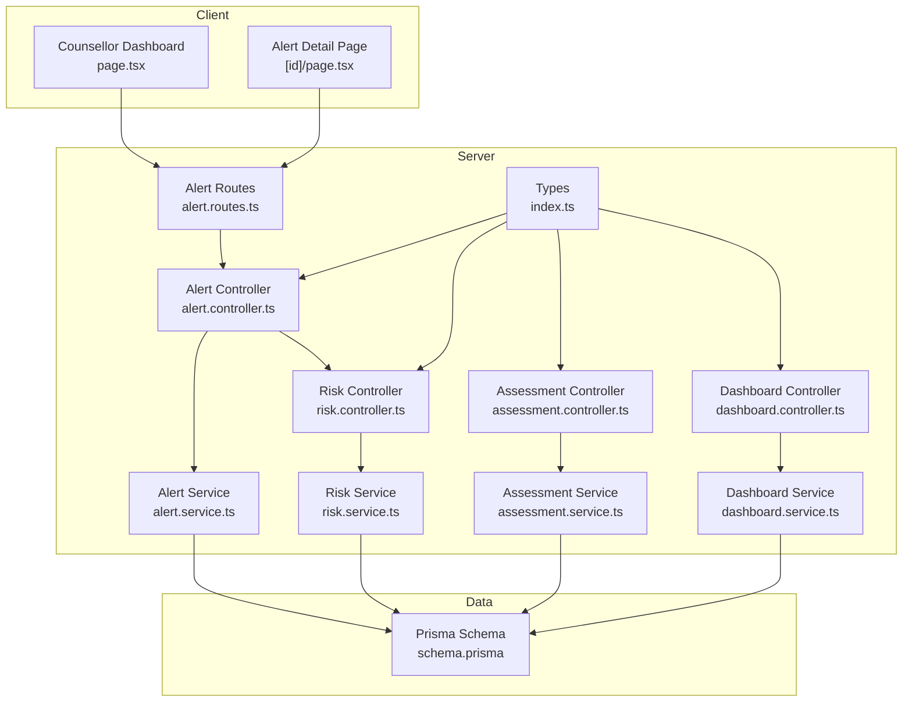
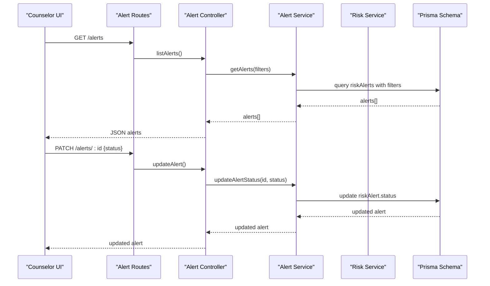
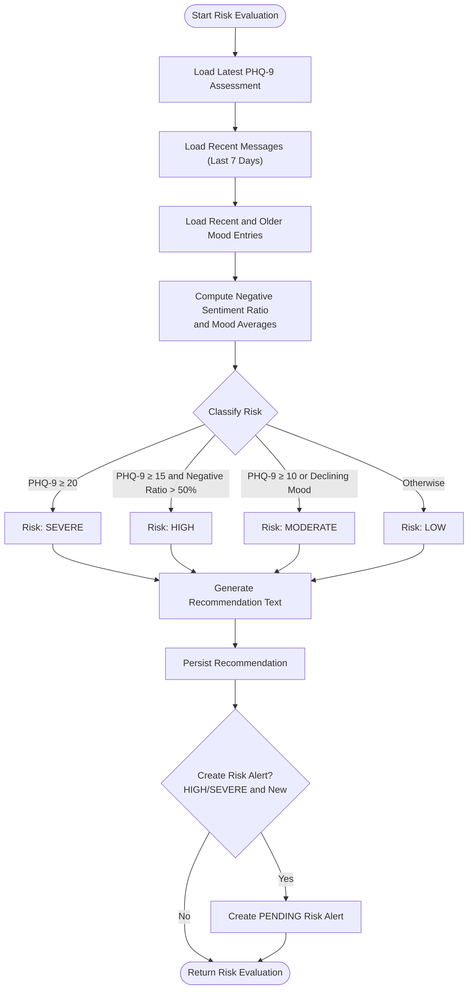
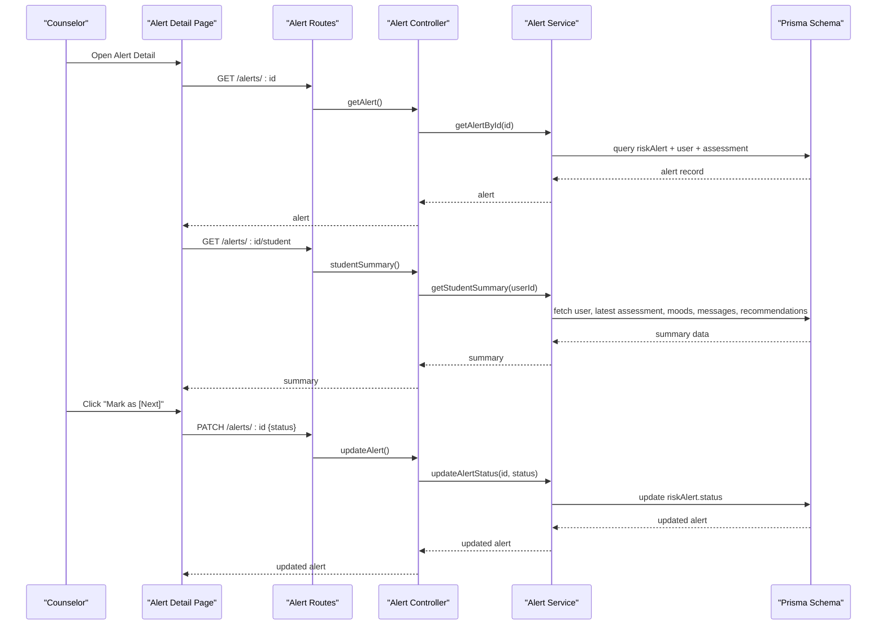
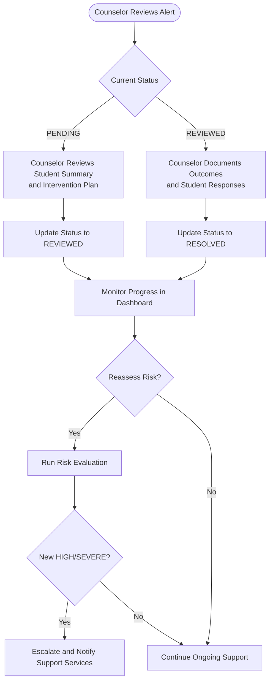
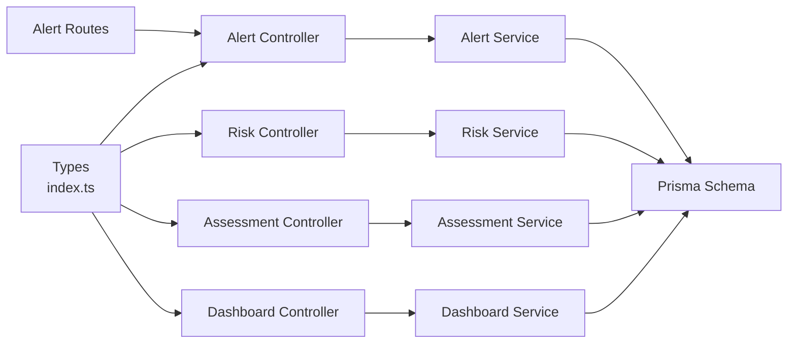
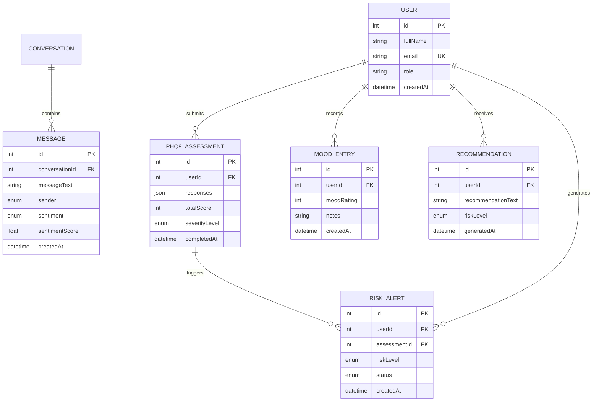

# Intervention Workflow Tools

<cite>
**Referenced Files in This Document**
- [client dashboard page](file://client/src/app/counsellor/dashboard/page.tsx)
- [alert detail page](file://client/src/app/counsellor/alerts/[id]/page.tsx)
- [risk controller](file://server/src/controllers/risk.controller.ts)
- [risk service](file://server/src/services/risk.service.ts)
- [alert controller](file://server/src/controllers/alert.controller.ts)
- [alert service](file://server/src/services/alert.service.ts)
- [assessment controller](file://server/src/controllers/assessment.controller.ts)
- [assessment service](file://server/src/services/assessment.service.ts)
- [dashboard controller](file://server/src/controllers/dashboard.controller.ts)
- [dashboard service](file://server/src/services/dashboard.service.ts)
- [alert routes](file://server/src/routes/alert.routes.ts)
- [types](file://server/src/types/index.ts)
- [Prisma schema](file://prisma/schema.prisma)
</cite>

## Table of Contents
1. [Introduction](#introduction)
2. [Project Structure](#project-structure)
3. [Core Components](#core-components)
4. [Architecture Overview](#architecture-overview)
5. [Detailed Component Analysis](#detailed-component-analysis)
6. [Dependency Analysis](#dependency-analysis)
7. [Performance Considerations](#performance-considerations)
8. [Troubleshooting Guide](#troubleshooting-guide)
9. [Conclusion](#conclusion)
10. [Appendices](#appendices)

## Introduction
This document describes the intervention workflow tools available to counselors within the dashboard system. It explains how counselors assess risk, interpret assessment results, select intervention strategies, monitor progress, escalate severe cases, coordinate with support services, schedule follow-ups, and document outcomes. Practical examples illustrate common scenarios such as crisis response, ongoing support planning, and discharge planning. The documentation also covers integration points with external resources, appointment scheduling, and communication tools for coordinating care with other professionals.

## Project Structure
The intervention workflow spans the frontend dashboard and backend services:
- Frontend (Next.js):
  - Counselor dashboard lists alerts and filters by status and risk level.
  - Alert detail page displays student summary and allows status updates.
- Backend (Express + Prisma):
  - Controllers expose endpoints for alerts, risk evaluation, assessments, and dashboard statistics.
  - Services encapsulate business logic for risk scoring, alert creation, and summaries.
  - Routes enforce counselor role and authentication.
  - Prisma schema defines models for users, assessments, messages, moods, recommendations, and risk alerts.

**Diagram sources**
- [client dashboard page:1-213](file://client/src/app/counsellor/dashboard/page.tsx#L1-L213)
- [alert detail page:1-246](file://client/src/app/counsellor/alerts/[id]/page.tsx#L1-L246)
- [risk controller:1-32](file://server/src/controllers/risk.controller.ts#L1-L32)
- [risk service:1-138](file://server/src/services/risk.service.ts#L1-L138)
- [alert controller:1-70](file://server/src/controllers/alert.controller.ts#L1-L70)
- [alert service:1-62](file://server/src/services/alert.service.ts#L1-L62)
- [assessment controller:1-74](file://server/src/controllers/assessment.controller.ts#L1-L74)
- [assessment service:1-89](file://server/src/services/assessment.service.ts#L1-L89)
- [dashboard controller:1-13](file://server/src/controllers/dashboard.controller.ts#L1-L13)
- [dashboard service:1-19](file://server/src/services/dashboard.service.ts#L1-L19)
- [alert routes:1-15](file://server/src/routes/alert.routes.ts#L1-L15)
- [types:1-12](file://server/src/types/index.ts#L1-L12)
- [Prisma schema:1-134](file://prisma/schema.prisma#L1-L134)

**Section sources**
- [client dashboard page:1-213](file://client/src/app/counsellor/dashboard/page.tsx#L1-L213)
- [alert detail page:1-246](file://client/src/app/counsellor/alerts/[id]/page.tsx#L1-L246)
- [alert routes:1-15](file://server/src/routes/alert.routes.ts#L1-L15)
- [types:1-12](file://server/src/types/index.ts#L1-L12)
- [Prisma schema:1-134](file://prisma/schema.prisma#L1-L134)

## Core Components
- Risk Evaluation Engine:
  - Computes risk level from PHQ-9 assessment, recent message sentiment, and mood trends.
  - Generates recommendations and creates risk alerts for HIGH/SEVERE cases.
- Alert Management:
  - Lists alerts with filtering by status and risk level.
  - Updates alert status and retrieves student summaries for intervention planning.
- Assessment Integration:
  - Submits PHQ-9 responses, classifies severity, and generates recommendations for moderate/severe cases.
- Dashboard Analytics:
  - Provides counts for total alerts, pending, reviewed, resolved, total students, and risk distribution.

**Section sources**
- [risk controller:1-32](file://server/src/controllers/risk.controller.ts#L1-L32)
- [risk service:1-138](file://server/src/services/risk.service.ts#L1-L138)
- [alert controller:1-70](file://server/src/controllers/alert.controller.ts#L1-L70)
- [alert service:1-62](file://server/src/services/alert.service.ts#L1-L62)
- [assessment controller:1-74](file://server/src/controllers/assessment.controller.ts#L1-L74)
- [assessment service:1-89](file://server/src/services/assessment.service.ts#L1-L89)
- [dashboard controller:1-13](file://server/src/controllers/dashboard.controller.ts#L1-L13)
- [dashboard service:1-19](file://server/src/services/dashboard.service.ts#L1-L19)

## Architecture Overview
The counselor workflow centers on three stages:
1. Risk Assessment Interpretation:
   - Risk engine evaluates PHQ-9, sentiment, and mood trends to compute risk level and recommendation.
2. Intervention Strategy Selection:
   - Counselors review alert details and student summaries to choose appropriate interventions.
3. Progress Monitoring and Escalation:
   - Status updates move alerts through PENDING → REVIEWED → RESOLVED.
   - Severe cases trigger automatic alerts and escalation pathways.

**Diagram sources**
- [alert routes:1-15](file://server/src/routes/alert.routes.ts#L1-L15)
- [alert controller:1-70](file://server/src/controllers/alert.controller.ts#L1-L70)
- [alert service:1-62](file://server/src/services/alert.service.ts#L1-L62)
- [Prisma schema:121-133](file://prisma/schema.prisma#L121-L133)

**Section sources**
- [alert routes:1-15](file://server/src/routes/alert.routes.ts#L1-L15)
- [alert controller:1-70](file://server/src/controllers/alert.controller.ts#L1-L70)
- [alert service:1-62](file://server/src/services/alert.service.ts#L1-L62)
- [Prisma schema:121-133](file://prisma/schema.prisma#L121-L133)

## Detailed Component Analysis

### Risk Assessment Interpretation
Risk evaluation combines:
- Latest PHQ-9 total score
- Recent message sentiment (last 7 days)
- Mood trend comparison (last 7 vs previous 23 days)

**Diagram sources**
- [risk service:11-107](file://server/src/services/risk.service.ts#L11-L107)
- [Prisma schema:97-108](file://prisma/schema.prisma#L97-L108)
- [Prisma schema:110-119](file://prisma/schema.prisma#L110-L119)
- [Prisma schema:121-133](file://prisma/schema.prisma#L121-L133)

**Section sources**
- [risk controller:1-32](file://server/src/controllers/risk.controller.ts#L1-L32)
- [risk service:1-138](file://server/src/services/risk.service.ts#L1-L138)
- [Prisma schema:1-134](file://prisma/schema.prisma#L1-L134)

### Intervention Strategy Selection
Counselors use the alert detail page to:
- Review student summary: average mood, mood entries, latest PHQ-9 score and severity, sentiment breakdown, and recent recommendations.
- Update alert status via Mark as buttons (PENDING → REVIEWED → RESOLVED).
- Document outcomes and student responses during sessions.

**Diagram sources**
- [alert detail page:34-246](file://client/src/app/counsellor/alerts/[id]/page.tsx#L34-L246)
- [alert routes:1-15](file://server/src/routes/alert.routes.ts#L1-L15)
- [alert controller:1-70](file://server/src/controllers/alert.controller.ts#L1-L70)
- [alert service:1-62](file://server/src/services/alert.service.ts#L1-L62)
- [Prisma schema:121-133](file://prisma/schema.prisma#L121-L133)

**Section sources**
- [alert detail page:1-246](file://client/src/app/counsellor/alerts/[id]/page.tsx#L1-L246)
- [alert controller:1-70](file://server/src/controllers/alert.controller.ts#L1-L70)
- [alert service:1-62](file://server/src/services/alert.service.ts#L1-L62)

### Progress Monitoring and Escalation
Progress monitoring occurs through:
- Dashboard statistics: total alerts, pending, reviewed, resolved, total students, and risk distribution.
- Alert status lifecycle: PENDING → REVIEWED → RESOLVED.
- Automatic escalation for HIGH/SEVERE risk levels via risk alerts.

**Diagram sources**
- [dashboard service:1-19](file://server/src/services/dashboard.service.ts#L1-L19)
- [risk service:87-104](file://server/src/services/risk.service.ts#L87-L104)
- [alert routes:1-15](file://server/src/routes/alert.routes.ts#L1-L15)
- [alert controller:32-53](file://server/src/controllers/alert.controller.ts#L32-L53)

**Section sources**
- [dashboard controller:1-13](file://server/src/controllers/dashboard.controller.ts#L1-L13)
- [dashboard service:1-19](file://server/src/services/dashboard.service.ts#L1-L19)
- [risk service:87-104](file://server/src/services/risk.service.ts#L87-L104)
- [alert controller:32-53](file://server/src/controllers/alert.controller.ts#L32-L53)

### Documentation Features for Recording Actions and Outcomes
- Student Summary:
  - Average mood, recent mood entries, latest PHQ-9 score and severity, sentiment breakdown, and recent recommendations.
- Outcome Documentation:
  - Counselors update alert status and document outcomes during sessions; the UI exposes “Mark as” controls for status transitions.
- Student Responses:
  - The summary includes sentiment breakdown and mood trends to inform documentation of student responses to interventions.

**Section sources**
- [alert detail page:181-242](file://client/src/app/counsellor/alerts/[id]/page.tsx#L181-L242)
- [alert service:35-61](file://server/src/services/alert.service.ts#L35-L61)
- [alert controller:32-53](file://server/src/controllers/alert.controller.ts#L32-L53)

### Coordination with Other Support Services and Communication Tools
- Automatic Notification:
  - HIGH/SEVERE risk triggers a PENDING risk alert, signaling counselors and support teams.
- Integration Points:
  - The system integrates PHQ-9 assessments, sentiment analysis of messages, and mood trends to support coordinated care decisions.
- Communication:
  - The UI surfaces student contact and identifiers to facilitate communication with students and other professionals.

**Section sources**
- [risk service:87-104](file://server/src/services/risk.service.ts#L87-L104)
- [alert detail page:141-179](file://client/src/app/counsellor/alerts/[id]/page.tsx#L141-L179)

### Follow-Up Scheduling Capabilities
- Ongoing Support Planning:
  - Moderate and severe cases receive recommendations that guide scheduling follow-up sessions.
- Discharge Planning:
  - As cases resolve, counselors can document discharge criteria and plan for continued low-intensity support or community resources.

Note: The current codebase does not include explicit appointment scheduling endpoints. Follow-up scheduling can be integrated by extending the alert workflow to create scheduled sessions linked to risk alerts and recommendations.

**Section sources**
- [assessment service:63-74](file://server/src/services/assessment.service.ts#L63-L74)
- [risk service:109-120](file://server/src/services/risk.service.ts#L109-L120)

### Practical Examples of Common Intervention Scenarios
- Crisis Response (SEVERE risk):
  - Risk evaluation identifies SEVERE risk; a PENDING risk alert is created and counselors are notified. Immediate action includes contacting the student and arranging urgent support.
- Ongoing Support Planning (MODERATE risk):
  - Risk evaluation identifies MODERATE risk; counselors schedule regular sessions, track mood trends, and monitor sentiment changes.
- Discharge Planning (Resolved with LOW risk):
  - After successful resolution, counselors document discharge criteria, recommend continued self-monitoring, and connect the student with community resources.

**Section sources**
- [risk service:109-120](file://server/src/services/risk.service.ts#L109-L120)
- [risk controller:5-17](file://server/src/controllers/risk.controller.ts#L5-L17)
- [alert controller:32-53](file://server/src/controllers/alert.controller.ts#L32-L53)

## Dependency Analysis
Key dependencies and relationships:
- Controllers depend on services for business logic.
- Services depend on Prisma for data access.
- Routes enforce authentication and role checks.
- The alert detail page depends on alert routes and controllers.

**Diagram sources**
- [types:1-12](file://server/src/types/index.ts#L1-L12)
- [alert routes:1-15](file://server/src/routes/alert.routes.ts#L1-L15)
- [alert controller:1-70](file://server/src/controllers/alert.controller.ts#L1-L70)
- [risk controller:1-32](file://server/src/controllers/risk.controller.ts#L1-L32)
- [assessment controller:1-74](file://server/src/controllers/assessment.controller.ts#L1-L74)
- [dashboard controller:1-13](file://server/src/controllers/dashboard.controller.ts#L1-L13)
- [alert service:1-62](file://server/src/services/alert.service.ts#L1-L62)
- [risk service:1-138](file://server/src/services/risk.service.ts#L1-L138)
- [assessment service:1-89](file://server/src/services/assessment.service.ts#L1-L89)
- [dashboard service:1-19](file://server/src/services/dashboard.service.ts#L1-L19)
- [Prisma schema:1-134](file://prisma/schema.prisma#L1-L134)

**Section sources**
- [types:1-12](file://server/src/types/index.ts#L1-L12)
- [alert routes:1-15](file://server/src/routes/alert.routes.ts#L1-L15)
- [alert controller:1-70](file://server/src/controllers/alert.controller.ts#L1-L70)
- [risk controller:1-32](file://server/src/controllers/risk.controller.ts#L1-L32)
- [assessment controller:1-74](file://server/src/controllers/assessment.controller.ts#L1-L74)
- [dashboard controller:1-13](file://server/src/controllers/dashboard.controller.ts#L1-L13)
- [alert service:1-62](file://server/src/services/alert.service.ts#L1-L62)
- [risk service:1-138](file://server/src/services/risk.service.ts#L1-L138)
- [assessment service:1-89](file://server/src/services/assessment.service.ts#L1-L89)
- [dashboard service:1-19](file://server/src/services/dashboard.service.ts#L1-L19)
- [Prisma schema:1-134](file://prisma/schema.prisma#L1-L134)

## Performance Considerations
- Parallel Data Fetching:
  - The dashboard and alert detail pages use parallel requests to reduce latency when loading stats and summaries.
- Efficient Queries:
  - Services use targeted Prisma queries with ordering and limits to minimize payload sizes.
- Recommendation Persistence:
  - Recommendations are persisted once per evaluation to avoid redundant writes.

[No sources needed since this section provides general guidance]

## Troubleshooting Guide
- Authentication and Authorization:
  - Routes enforce counselor role; unauthorized access is blocked at the route layer.
- Validation:
  - Alert status updates require valid status values; invalid inputs return errors.
- Data Availability:
  - If alerts or summaries are missing, verify user roles and data presence in the database.

**Section sources**
- [alert routes:7-12](file://server/src/routes/alert.routes.ts#L7-L12)
- [alert controller:37-40](file://server/src/controllers/alert.controller.ts#L37-L40)
- [alert controller:22-25](file://server/src/controllers/alert.controller.ts#L22-L25)

## Conclusion
The intervention workflow tools provide counselors with a structured approach to risk assessment, intervention planning, progress monitoring, and escalation. By leveraging PHQ-9 results, sentiment analysis, and mood trends, the system supports informed decision-making and timely interventions. The dashboard and alert detail pages streamline status updates and student summaries, while the underlying services ensure robust data handling and escalatory notifications for severe cases.

[No sources needed since this section summarizes without analyzing specific files]

## Appendices

### Data Models Overview

**Diagram sources**
- [Prisma schema:47-133](file://prisma/schema.prisma#L47-L133)