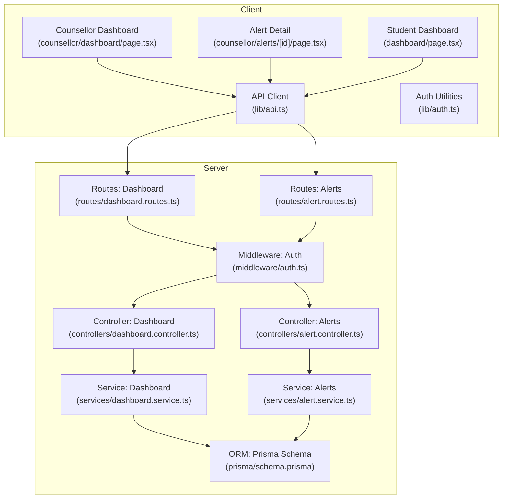
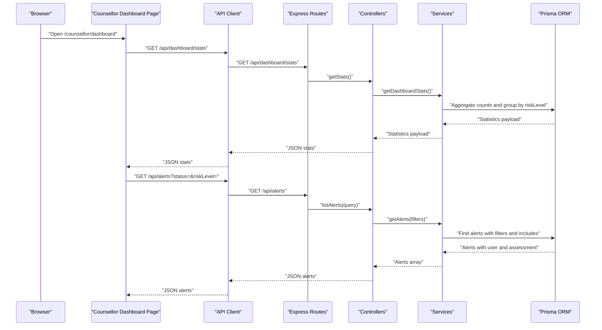
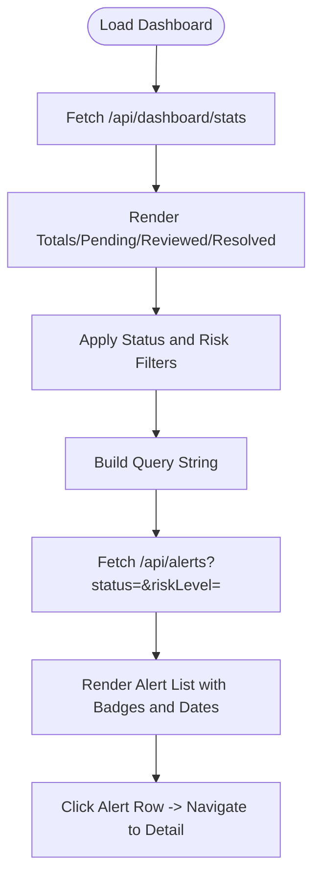
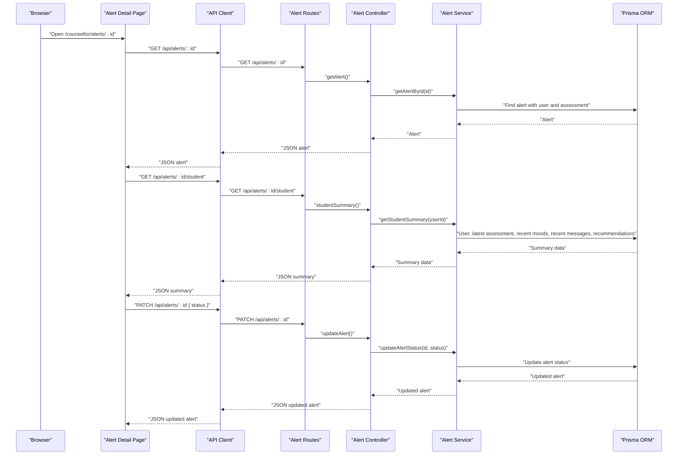
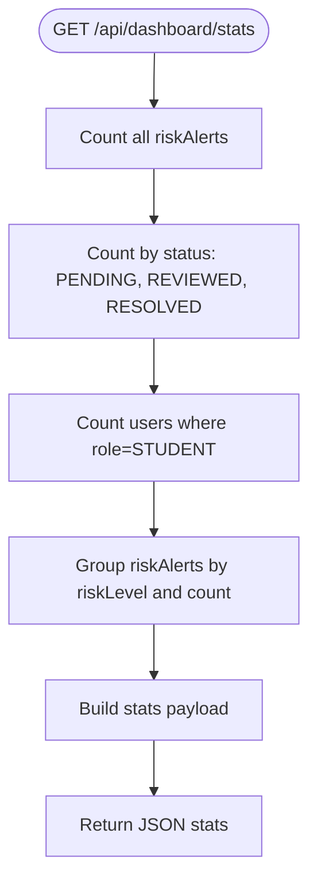
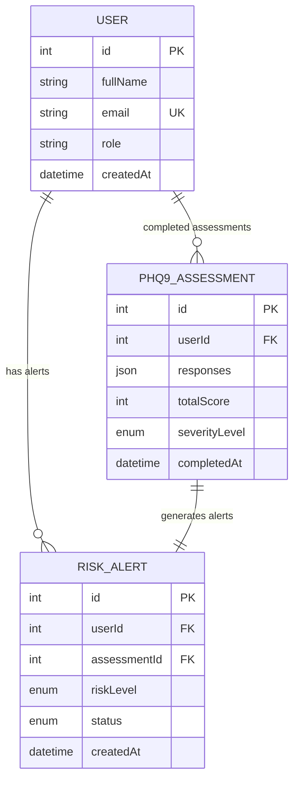
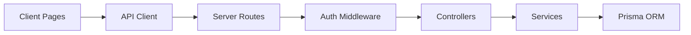

# Risk Monitoring Dashboard

<cite>
**Referenced Files in This Document**
- [client dashboard page](file://client/src/app/dashboard/page.tsx)
- [counsellor dashboard page](file://client/src/app/counsellor/dashboard/page.tsx)
- [alert detail page](file://client/src/app/counsellor/alerts/[id]/page.tsx)
- [dashboard controller](file://server/src/controllers/dashboard.controller.ts)
- [dashboard service](file://server/src/services/dashboard.service.ts)
- [dashboard routes](file://server/src/routes/dashboard.routes.ts)
- [alert controller](file://server/src/controllers/alert.controller.ts)
- [alert service](file://server/src/services/alert.service.ts)
- [alert routes](file://server/src/routes/alert.routes.ts)
- [authentication middleware](file://server/src/middleware/auth.ts)
- [Prisma schema](file://prisma/schema.prisma)
- [API client](file://client/src/lib/api.ts)
- [auth utilities](file://client/src/lib/auth.ts)
</cite>

## Table of Contents
1. [Introduction](#introduction)
2. [Project Structure](#project-structure)
3. [Core Components](#core-components)
4. [Architecture Overview](#architecture-overview)
5. [Detailed Component Analysis](#detailed-component-analysis)
6. [Dependency Analysis](#dependency-analysis)
7. [Performance Considerations](#performance-considerations)
8. [Troubleshooting Guide](#troubleshooting-guide)
9. [Conclusion](#conclusion)

## Introduction
This document describes the risk monitoring dashboard for real-time student risk assessment and alert tracking. It explains the dashboard statistics (total alerts, pending reviews, resolved cases, and risk level distributions), filtering mechanisms by status and risk levels, and the alert listing interface with student information, risk badges, status indicators, and creation dates. It also covers counselor workflows for prioritizing high-risk cases, tracking response times, and monitoring caseload effectiveness, and how the dashboard integrates with the alert management system to feed intervention planning.

## Project Structure
The risk monitoring dashboard spans a React-based client and an Express-based server with Prisma ORM. The client-side dashboards are role-specific: a student overview dashboard and a counsellor dashboard. The server exposes REST endpoints for dashboard statistics and alert management, secured by authentication and role-based authorization.

**Diagram sources**
- [counsellor dashboard page:1-213](file://client/src/app/counsellor/dashboard/page.tsx#L1-L213)
- [alert detail page:1-246](file://client/src/app/counsellor/alerts/[id]/page.tsx#L1-L246)
- [client dashboard page:1-206](file://client/src/app/dashboard/page.tsx#L1-L206)
- [dashboard routes:1-11](file://server/src/routes/dashboard.routes.ts#L1-L11)
- [alert routes:1-15](file://server/src/routes/alert.routes.ts#L1-L15)
- [dashboard controller:1-13](file://server/src/controllers/dashboard.controller.ts#L1-L13)
- [alert controller:1-70](file://server/src/controllers/alert.controller.ts#L1-L70)
- [dashboard service:1-19](file://server/src/services/dashboard.service.ts#L1-L19)
- [alert service:1-62](file://server/src/services/alert.service.ts#L1-L62)
- [authentication middleware:1-39](file://server/src/middleware/auth.ts#L1-L39)
- [Prisma schema:1-134](file://prisma/schema.prisma#L1-L134)
- [API client:1-36](file://client/src/lib/api.ts#L1-L36)
- [auth utilities:1-27](file://client/src/lib/auth.ts#L1-L27)

**Section sources**
- [counsellor dashboard page:1-213](file://client/src/app/counsellor/dashboard/page.tsx#L1-L213)
- [alert detail page:1-246](file://client/src/app/counsellor/alerts/[id]/page.tsx#L1-L246)
- [client dashboard page:1-206](file://client/src/app/dashboard/page.tsx#L1-L206)
- [dashboard routes:1-11](file://server/src/routes/dashboard.routes.ts#L1-L11)
- [alert routes:1-15](file://server/src/routes/alert.routes.ts#L1-L15)
- [dashboard controller:1-13](file://server/src/controllers/dashboard.controller.ts#L1-L13)
- [alert controller:1-70](file://server/src/controllers/alert.controller.ts#L1-L70)
- [dashboard service:1-19](file://server/src/services/dashboard.service.ts#L1-L19)
- [alert service:1-62](file://server/src/services/alert.service.ts#L1-L62)
- [authentication middleware:1-39](file://server/src/middleware/auth.ts#L1-L39)
- [Prisma schema:1-134](file://prisma/schema.prisma#L1-L134)
- [API client:1-36](file://client/src/lib/api.ts#L1-L36)
- [auth utilities:1-27](file://client/src/lib/auth.ts#L1-L27)

## Core Components
- Counsellor Dashboard: Displays aggregated statistics (total alerts, pending, reviewed, resolved), risk level distribution, and a filtered list of alerts with student info, risk badges, status indicators, and creation dates.
- Alert Detail: Shows alert metadata, student summary (average mood, mood entries, latest PHQ-9), sentiment breakdown, and recommendations; allows updating alert status.
- Dashboard Statistics Endpoint: Aggregates counts and distributions for counselors.
- Alert Management Endpoints: List alerts with filters, retrieve individual alerts, update status, and fetch student summaries.

Key capabilities:
- Real-time statistics via a single endpoint returning totals, counts per status, and risk distribution.
- Filtering by status and risk level for targeted alert lists.
- Rich alert listing with actionable links to detailed views.
- Secure access control ensuring only authenticated counsellors can view and update alerts.

**Section sources**
- [counsellor dashboard page:28-213](file://client/src/app/counsellor/dashboard/page.tsx#L28-L213)
- [alert detail page:34-246](file://client/src/app/counsellor/alerts/[id]/page.tsx#L34-L246)
- [dashboard controller:5-12](file://server/src/controllers/dashboard.controller.ts#L5-L12)
- [dashboard service:3-18](file://server/src/services/dashboard.service.ts#L3-L18)
- [alert controller:5-69](file://server/src/controllers/alert.controller.ts#L5-L69)
- [alert service:3-61](file://server/src/services/alert.service.ts#L3-L61)

## Architecture Overview
The dashboard architecture follows a client-server pattern:
- Client dashboards (Next.js pages) call REST endpoints via a shared API client.
- Server routes enforce authentication and role checks, then delegate to controllers and services.
- Services query Prisma for statistics and alert data, returning normalized payloads.
- The alert detail page composes data from two endpoints: alert metadata and student summary.

**Diagram sources**
- [counsellor dashboard page:49-80](file://client/src/app/counsellor/dashboard/page.tsx#L49-L80)
- [dashboard routes:7-8](file://server/src/routes/dashboard.routes.ts#L7-L8)
- [dashboard controller:5-12](file://server/src/controllers/dashboard.controller.ts#L5-L12)
- [dashboard service:3-18](file://server/src/services/dashboard.service.ts#L3-L18)
- [alert routes:9-12](file://server/src/routes/alert.routes.ts#L9-L12)
- [alert controller:5-16](file://server/src/controllers/alert.controller.ts#L5-L16)
- [alert service:3-16](file://server/src/services/alert.service.ts#L3-L16)
- [Prisma schema:121-133](file://prisma/schema.prisma#L121-L133)
- [API client:3-35](file://client/src/lib/api.ts#L3-L35)

**Section sources**
- [counsellor dashboard page:49-80](file://client/src/app/counsellor/dashboard/page.tsx#L49-L80)
- [dashboard routes:7-8](file://server/src/routes/dashboard.routes.ts#L7-L8)
- [dashboard controller:5-12](file://server/src/controllers/dashboard.controller.ts#L5-L12)
- [dashboard service:3-18](file://server/src/services/dashboard.service.ts#L3-L18)
- [alert routes:9-12](file://server/src/routes/alert.routes.ts#L9-L12)
- [alert controller:5-16](file://server/src/controllers/alert.controller.ts#L5-L16)
- [alert service:3-16](file://server/src/services/alert.service.ts#L3-L16)
- [Prisma schema:121-133](file://prisma/schema.prisma#L121-L133)
- [API client:3-35](file://client/src/lib/api.ts#L3-L35)

## Detailed Component Analysis

### Counsellor Dashboard
Displays:
- Total alerts, pending, reviewed, resolved cards.
- Filters for status and risk level.
- Alert list with student name/email, risk badge, status badge, and creation date.

Filtering mechanism:
- Status filter: PENDING, REVIEWED, RESOLVED.
- Risk level filter: LOW, MODERATE, HIGH, SEVERE.
- Query string built dynamically and appended to the alerts endpoint.

Alert listing:
- Each row links to the alert detail page.
- Badges reflect current risk and status.
- Creation date shown in local date format.

**Diagram sources**
- [counsellor dashboard page:49-80](file://client/src/app/counsellor/dashboard/page.tsx#L49-L80)
- [counsellor dashboard page:116-167](file://client/src/app/counsellor/dashboard/page.tsx#L116-L167)
- [counsellor dashboard page:169-209](file://client/src/app/counsellor/dashboard/page.tsx#L169-L209)

**Section sources**
- [counsellor dashboard page:28-213](file://client/src/app/counsellor/dashboard/page.tsx#L28-L213)

### Alert Detail Page
Displays:
- Alert metadata: student name/email/date.
- Risk and status badges.
- Student summary: average mood, total mood entries, latest PHQ-9 score/severity, sentiment breakdown, and recommendations.
- Actionable button to advance alert status (PENDING → REVIEWED → RESOLVED).

Status transitions:
- Enforces sequential progression and disables button when at final state.

**Diagram sources**
- [alert detail page:57-85](file://client/src/app/counsellor/alerts/[id]/page.tsx#L57-L85)
- [alert routes:10-12](file://server/src/routes/alert.routes.ts#L10-L12)
- [alert controller:18-53](file://server/src/controllers/alert.controller.ts#L18-L53)
- [alert service:18-33](file://server/src/services/alert.service.ts#L18-L33)
- [Prisma schema:47-133](file://prisma/schema.prisma#L47-L133)
- [API client:3-35](file://client/src/lib/api.ts#L3-L35)

**Section sources**
- [alert detail page:34-246](file://client/src/app/counsellor/alerts/[id]/page.tsx#L34-L246)
- [alert controller:18-53](file://server/src/controllers/alert.controller.ts#L18-L53)
- [alert service:35-61](file://server/src/services/alert.service.ts#L35-L61)

### Dashboard Statistics Endpoint
Aggregates:
- Total alerts.
- Alerts by status: PENDING, REVIEWED, RESOLVED.
- Total number of students.
- Risk level distribution (LOW, MODERATE, HIGH, SEVERE).

**Diagram sources**
- [dashboard controller:5-12](file://server/src/controllers/dashboard.controller.ts#L5-L12)
- [dashboard service:3-18](file://server/src/services/dashboard.service.ts#L3-L18)
- [Prisma schema:10-45](file://prisma/schema.prisma#L10-L45)

**Section sources**
- [dashboard controller:5-12](file://server/src/controllers/dashboard.controller.ts#L5-L12)
- [dashboard service:3-18](file://server/src/services/dashboard.service.ts#L3-L18)

### Alert Management Endpoints
Endpoints:
- GET /api/alerts: List alerts with optional status and riskLevel filters.
- GET /api/alerts/:id: Retrieve a specific alert with user and assessment included.
- PATCH /api/alerts/:id: Update alert status (PENDING → REVIEWED → RESOLVED).
- GET /api/alerts/:id/student: Get student summary (mood average, recent entries, latest PHQ-9, sentiment breakdown, recommendations).

Validation and error handling:
- Status updates reject invalid statuses and missing alert IDs.
- Unauthorized and forbidden responses enforced by middleware.

**Section sources**
- [alert controller:5-69](file://server/src/controllers/alert.controller.ts#L5-L69)
- [alert service:3-61](file://server/src/services/alert.service.ts#L3-L61)
- [alert routes:9-12](file://server/src/routes/alert.routes.ts#L9-L12)
- [authentication middleware:5-38](file://server/src/middleware/auth.ts#L5-L38)

### Data Models and Relationships
The dashboard relies on the following models and enums:

**Diagram sources**
- [Prisma schema:47-133](file://prisma/schema.prisma#L47-L133)

**Section sources**
- [Prisma schema:10-45](file://prisma/schema.prisma#L10-L45)
- [Prisma schema:47-133](file://prisma/schema.prisma#L47-L133)

## Dependency Analysis
- Client depends on the API client for HTTP requests and on auth utilities for tokens and user info.
- Server routes depend on authentication middleware to enforce bearer tokens and role checks.
- Controllers depend on services for business logic and on Prisma for data access.
- Services encapsulate queries and transformations, minimizing controller complexity.

**Diagram sources**
- [API client:1-36](file://client/src/lib/api.ts#L1-L36)
- [authentication middleware:1-39](file://server/src/middleware/auth.ts#L1-L39)
- [alert routes:1-15](file://server/src/routes/alert.routes.ts#L1-L15)
- [dashboard routes:1-11](file://server/src/routes/dashboard.routes.ts#L1-L11)
- [alert controller:1-70](file://server/src/controllers/alert.controller.ts#L1-L70)
- [dashboard controller:1-13](file://server/src/controllers/dashboard.controller.ts#L1-L13)
- [alert service:1-62](file://server/src/services/alert.service.ts#L1-L62)
- [dashboard service:1-19](file://server/src/services/dashboard.service.ts#L1-L19)

**Section sources**
- [API client:1-36](file://client/src/lib/api.ts#L1-L36)
- [authentication middleware:1-39](file://server/src/middleware/auth.ts#L1-L39)
- [alert routes:1-15](file://server/src/routes/alert.routes.ts#L1-L15)
- [dashboard routes:1-11](file://server/src/routes/dashboard.routes.ts#L1-L11)
- [alert controller:1-70](file://server/src/controllers/alert.controller.ts#L1-L70)
- [dashboard controller:1-13](file://server/src/controllers/dashboard.controller.ts#L1-L13)
- [alert service:1-62](file://server/src/services/alert.service.ts#L1-L62)
- [dashboard service:1-19](file://server/src/services/dashboard.service.ts#L1-L19)

## Performance Considerations
- Parallel fetching: The client uses Promise.allSettled to fetch dashboard stats and alerts concurrently, reducing load time.
- Efficient aggregations: The server computes counts and distributions in a single batch using Prisma’s aggregation and grouping capabilities.
- Minimal payload: Services include only necessary fields (user profile, assessment) to keep responses lean.
- Pagination: The alert listing does not implement pagination; consider adding limit/skip or cursor-based pagination for large datasets.

[No sources needed since this section provides general guidance]

## Troubleshooting Guide
Common issues and resolutions:
- Unauthorized access: If a token is missing or invalid, the API client redirects to login. Ensure the Authorization header is present and valid.
- Forbidden access: Access is restricted to authenticated users with the COUNSELLOR role. Verify the user role stored locally.
- Alert not found: The alert endpoints return 404 when an alert ID is invalid. Confirm the alert exists and belongs to the current user’s caseload.
- Invalid status update: The server rejects updates with invalid status values. Ensure the new status is one of PENDING, REVIEWED, or RESOLVED.
- Empty alert list: Without filters, the list may be empty if no alerts exist. Apply filters or wait for new alerts.

**Section sources**
- [API client:20-35](file://client/src/lib/api.ts#L20-L35)
- [auth utilities:1-27](file://client/src/lib/auth.ts#L1-L27)
- [alert controller:32-53](file://server/src/controllers/alert.controller.ts#L32-L53)
- [authentication middleware:5-38](file://server/src/middleware/auth.ts#L5-L38)

## Conclusion
The risk monitoring dashboard provides counsellors with a centralized, real-time view of student risk alerts. Its statistics and filtering mechanisms enable rapid prioritization of high-risk cases, while the alert detail page offers actionable insights to inform interventions. The clean separation between client, server, and data access layers ensures maintainability and scalability, supporting effective caseload management and improved student outcomes.