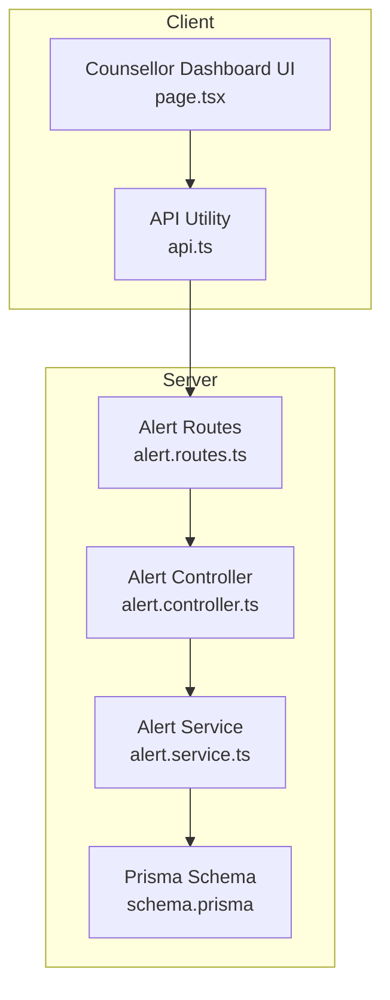
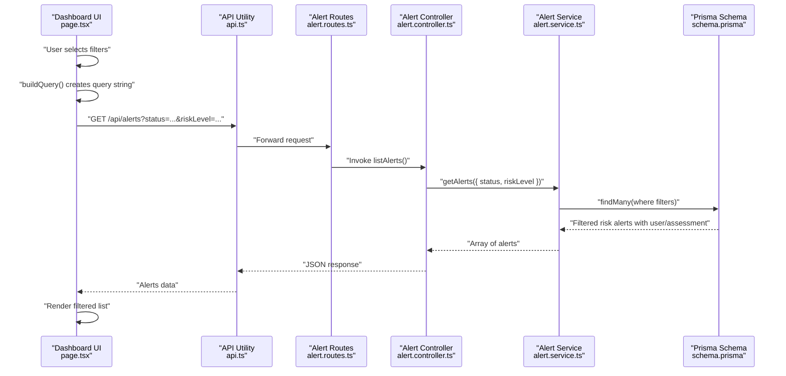
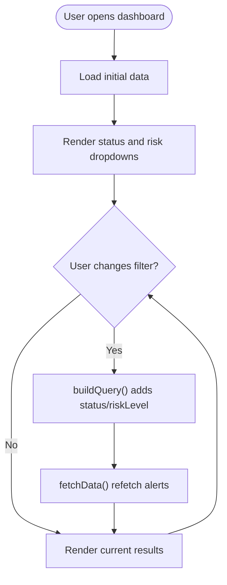
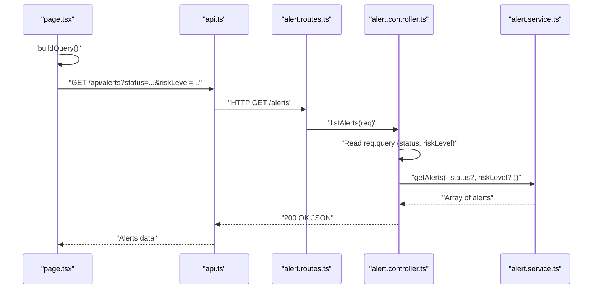
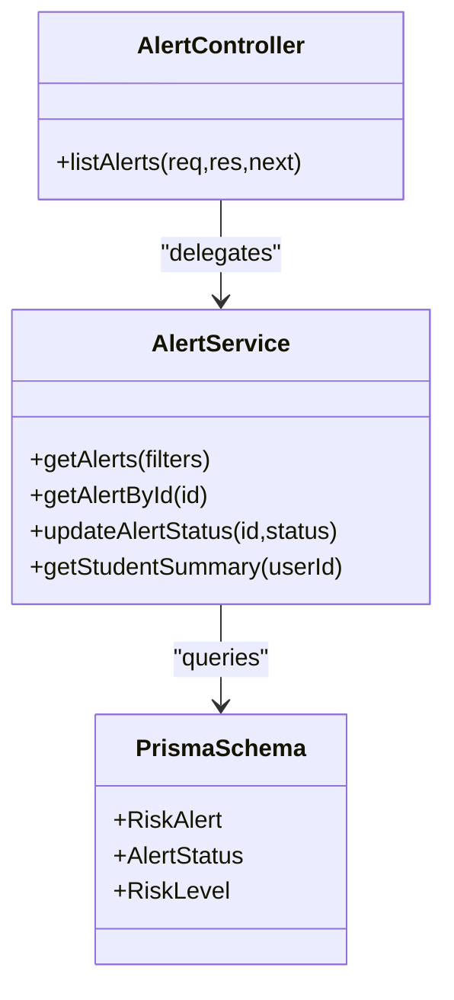
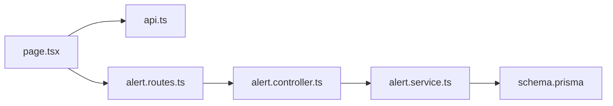

# Student Search and Filtering

<cite>
**Referenced Files in This Document**
- [page.tsx](file://client/src/app/counsellor/dashboard/page.tsx)
- [alert.routes.ts](file://server/src/routes/alert.routes.ts)
- [alert.controller.ts](file://server/src/controllers/alert.controller.ts)
- [alert.service.ts](file://server/src/services/alert.service.ts)
- [api.ts](file://client/src/lib/api.ts)
- [schema.prisma](file://prisma/schema.prisma)
</cite>

## Table of Contents
1. [Introduction](#introduction)
2. [Project Structure](#project-structure)
3. [Core Components](#core-components)
4. [Architecture Overview](#architecture-overview)
5. [Detailed Component Analysis](#detailed-component-analysis)
6. [Dependency Analysis](#dependency-analysis)
7. [Performance Considerations](#performance-considerations)
8. [Troubleshooting Guide](#troubleshooting-guide)
9. [Conclusion](#conclusion)

## Introduction
This document explains the student search and filtering capabilities within the counselor dashboard. It covers how counselors can filter risk alerts by status and risk level, how query parameters are constructed and passed to the backend, and how the frontend displays filtered results. It also documents the API integration, UI components, and practical usage scenarios such as identifying high-risk students or locating pending alerts.

## Project Structure
The student search and filtering feature spans the client-side React component and the server-side Express routes and services. The client composes query parameters and renders filtered lists, while the server applies filters to the database and returns structured data.

**Diagram sources**
- [page.tsx:1-213](file://client/src/app/counsellor/dashboard/page.tsx#L1-L213)
- [api.ts:1-36](file://client/src/lib/api.ts#L1-L36)
- [alert.routes.ts:1-15](file://server/src/routes/alert.routes.ts#L1-L15)
- [alert.controller.ts:1-69](file://server/src/controllers/alert.controller.ts#L1-L69)
- [alert.service.ts:1-62](file://server/src/services/alert.service.ts#L1-L62)
- [schema.prisma:1-134](file://prisma/schema.prisma#L1-L134)

**Section sources**
- [page.tsx:1-213](file://client/src/app/counsellor/dashboard/page.tsx#L1-L213)
- [alert.routes.ts:1-15](file://server/src/routes/alert.routes.ts#L1-L15)
- [alert.controller.ts:1-69](file://server/src/controllers/alert.controller.ts#L1-L69)
- [alert.service.ts:1-62](file://server/src/services/alert.service.ts#L1-L62)
- [api.ts:1-36](file://client/src/lib/api.ts#L1-L36)
- [schema.prisma:1-134](file://prisma/schema.prisma#L1-L134)

## Core Components
- Client dashboard page: Manages filters, constructs query parameters, fetches data, and renders results.
- API utility: Centralizes HTTP requests and handles authentication headers.
- Alert routes: Expose GET /alerts with query parameters for filtering.
- Alert controller: Extracts query parameters and delegates to the service.
- Alert service: Applies filters to the database and returns enriched alert records.
- Prisma schema: Defines enums and relations used by the filtering logic.

Key responsibilities:
- Filter construction: Build query strings for status and risk level.
- API integration: Fetch filtered alerts and dashboard stats concurrently.
- Result rendering: Display alerts with risk level and status badges.

**Section sources**
- [page.tsx:28-80](file://client/src/app/counsellor/dashboard/page.tsx#L28-L80)
- [api.ts:1-36](file://client/src/lib/api.ts#L1-L36)
- [alert.routes.ts:9-12](file://server/src/routes/alert.routes.ts#L9-L12)
- [alert.controller.ts:5-16](file://server/src/controllers/alert.controller.ts#L5-L16)
- [alert.service.ts:3-16](file://server/src/services/alert.service.ts#L3-L16)
- [schema.prisma:41-45](file://prisma/schema.prisma#L41-L45)

## Architecture Overview
The filtering pipeline follows a clear flow from UI to API to database and back to UI.

**Diagram sources**
- [page.tsx:49-80](file://client/src/app/counsellor/dashboard/page.tsx#L49-L80)
- [api.ts:3-35](file://client/src/lib/api.ts#L3-L35)
- [alert.routes.ts:9-12](file://server/src/routes/alert.routes.ts#L9-L12)
- [alert.controller.ts:5-16](file://server/src/controllers/alert.controller.ts#L5-L16)
- [alert.service.ts:3-16](file://server/src/services/alert.service.ts#L3-L16)
- [schema.prisma:121-133](file://prisma/schema.prisma#L121-L133)

## Detailed Component Analysis

### Client Dashboard Page (Filtering UI and Data Fetch)
- State management:
  - statusFilter and riskFilter track selected dropdown values.
  - loading indicates ongoing fetches.
- Query construction:
  - buildQuery() uses URLSearchParams to append status and riskLevel when present.
  - Returns empty string when no filters are selected.
- Fetch strategy:
  - fetchData() performs concurrent requests for stats and alerts.
  - On filter change, handleFilterChange() triggers a refetch.
- Rendering:
  - Filters: Two select dropdowns for status and risk level.
  - Results: A list of alerts with user name/email, risk level badge, status badge, and creation date.
  - Empty state: Displays a message when no alerts match filters.

**Diagram sources**
- [page.tsx:28-80](file://client/src/app/counsellor/dashboard/page.tsx#L28-L80)

**Section sources**
- [page.tsx:28-80](file://client/src/app/counsellor/dashboard/page.tsx#L28-L80)
- [page.tsx:138-167](file://client/src/app/counsellor/dashboard/page.tsx#L138-L167)
- [page.tsx:169-212](file://client/src/app/counsellor/dashboard/page.tsx#L169-L212)

### API Integration and Query Parameter Construction
- Client:
  - apiRequest() centralizes HTTP calls, injects Authorization header when available, and throws errors on non-OK responses.
  - buildQuery() builds a query string from statusFilter and riskFilter.
- Server:
  - Routes define GET /alerts and apply authentication and role checks.
  - Controller extracts query parameters and passes them to the service.
  - Service constructs a where clause from filters and queries the database.

**Diagram sources**
- [page.tsx:49-75](file://client/src/app/counsellor/dashboard/page.tsx#L49-L75)
- [api.ts:3-35](file://client/src/lib/api.ts#L3-L35)
- [alert.routes.ts:9-12](file://server/src/routes/alert.routes.ts#L9-L12)
- [alert.controller.ts:5-16](file://server/src/controllers/alert.controller.ts#L5-L16)
- [alert.service.ts:3-16](file://server/src/services/alert.service.ts#L3-L16)

**Section sources**
- [page.tsx:49-75](file://client/src/app/counsellor/dashboard/page.tsx#L49-L75)
- [api.ts:1-36](file://client/src/lib/api.ts#L1-L36)
- [alert.routes.ts:1-15](file://server/src/routes/alert.routes.ts#L1-L15)
- [alert.controller.ts:5-16](file://server/src/controllers/alert.controller.ts#L5-L16)
- [alert.service.ts:3-16](file://server/src/services/alert.service.ts#L3-L16)

### Backend Filtering Logic
- Controller:
  - Reads status and riskLevel from req.query and forwards to service.
- Service:
  - Builds a where object conditionally based on provided filters.
  - Orders results by creation date descending and includes user and assessment details.
- Prisma model:
  - RiskAlert has status and riskLevel fields aligned with AlertStatus and RiskLevel enums.

**Diagram sources**
- [alert.controller.ts:5-16](file://server/src/controllers/alert.controller.ts#L5-L16)
- [alert.service.ts:3-16](file://server/src/services/alert.service.ts#L3-L16)
- [schema.prisma:41-45](file://prisma/schema.prisma#L41-L45)
- [schema.prisma:121-133](file://prisma/schema.prisma#L121-L133)

**Section sources**
- [alert.controller.ts:5-16](file://server/src/controllers/alert.controller.ts#L5-L16)
- [alert.service.ts:3-16](file://server/src/services/alert.service.ts#L3-L16)
- [schema.prisma:41-45](file://prisma/schema.prisma#L41-L45)
- [schema.prisma:121-133](file://prisma/schema.prisma#L121-L133)

### Practical Search Scenarios
- Find high-risk students:
  - Select risk level “HIGH” or “SEVERE” in the risk dropdown.
  - The client’s buildQuery() appends riskLevel to the query string.
  - The server filters RiskAlert entries accordingly.
- Locate students with pending alerts:
  - Select status “PENDING” in the status dropdown.
  - The query string includes status=PENDING.
- Combine filters:
  - Selecting both a risk level and a status yields a query string with both parameters.
- Search by name, email, or ID:
  - Current implementation does not support searching by name, email, or user ID in the dashboard.
  - The alert list shows user name and email because the service includes user details, but filtering by these fields is not implemented.

Note: The current UI and backend only support filtering by status and risk level. There is no dedicated search input for name/email/ID.

**Section sources**
- [page.tsx:138-167](file://client/src/app/counsellor/dashboard/page.tsx#L138-L167)
- [alert.controller.ts:5-16](file://server/src/controllers/alert.controller.ts#L5-L16)
- [alert.service.ts:3-16](file://server/src/services/alert.service.ts#L3-L16)

## Dependency Analysis
- Client depends on:
  - api.ts for HTTP communication.
  - React state hooks for managing filters and loading.
- Server depends on:
  - Express routes for endpoint exposure.
  - Alert controller for request handling.
  - Alert service for database queries.
  - Prisma schema for enum-backed fields and relations.

**Diagram sources**
- [page.tsx:1-213](file://client/src/app/counsellor/dashboard/page.tsx#L1-L213)
- [api.ts:1-36](file://client/src/lib/api.ts#L1-L36)
- [alert.routes.ts:1-15](file://server/src/routes/alert.routes.ts#L1-L15)
- [alert.controller.ts:1-69](file://server/src/controllers/alert.controller.ts#L1-L69)
- [alert.service.ts:1-62](file://server/src/services/alert.service.ts#L1-L62)
- [schema.prisma:1-134](file://prisma/schema.prisma#L1-L134)

**Section sources**
- [page.tsx:1-213](file://client/src/app/counsellor/dashboard/page.tsx#L1-L213)
- [api.ts:1-36](file://client/src/lib/api.ts#L1-L36)
- [alert.routes.ts:1-15](file://server/src/routes/alert.routes.ts#L1-L15)
- [alert.controller.ts:1-69](file://server/src/controllers/alert.controller.ts#L1-L69)
- [alert.service.ts:1-62](file://server/src/services/alert.service.ts#L1-L62)
- [schema.prisma:1-134](file://prisma/schema.prisma#L1-L134)

## Performance Considerations
- Current state:
  - The dashboard fetches alerts without pagination or sorting beyond createdAt desc.
  - Filtering is applied server-side using Prisma where conditions.
- Recommendations for large populations:
  - Pagination:
    - Add limit and offset parameters to the query string.
    - Implement “Load More” or page navigation to reduce payload size.
  - Indexing:
    - Ensure database indexes exist on frequently filtered columns (riskLevel, status, createdAt).
  - Debouncing:
    - Debounce rapid filter changes to avoid excessive network requests.
  - Caching:
    - Cache recent filter results for short periods if acceptable for counselor workflows.
  - Client-side virtualization:
    - For long lists, render only visible rows to improve UI responsiveness.

[No sources needed since this section provides general guidance]

## Troubleshooting Guide
- Unauthorized access:
  - If the Authorization header is missing or invalid, the API returns 401.
  - The client removes the token and redirects to login.
- Invalid role:
  - Access is restricted to counselors; non-counselor roles receive 403.
- Invalid status values:
  - Updating an alert requires a valid status among PENDING, REVIEWED, RESOLVED.
- Network failures:
  - Non-OK responses throw errors; the UI remains responsive due to concurrent fetching and fallbacks.

**Section sources**
- [api.ts:20-32](file://client/src/lib/api.ts#L20-L32)
- [auth.ts:5-38](file://server/src/middleware/auth.ts#L5-L38)
- [alert.controller.ts:32-52](file://server/src/controllers/alert.controller.ts#L32-L52)

## Conclusion
The counselor dashboard currently supports filtering risk alerts by status and risk level. The client composes query parameters dynamically and fetches filtered results concurrently with dashboard statistics. While the UI and backend provide robust filtering for status and risk level, advanced search by name, email, or ID is not implemented. For large student populations, adding pagination, debouncing, and indexing would significantly improve performance and user experience.