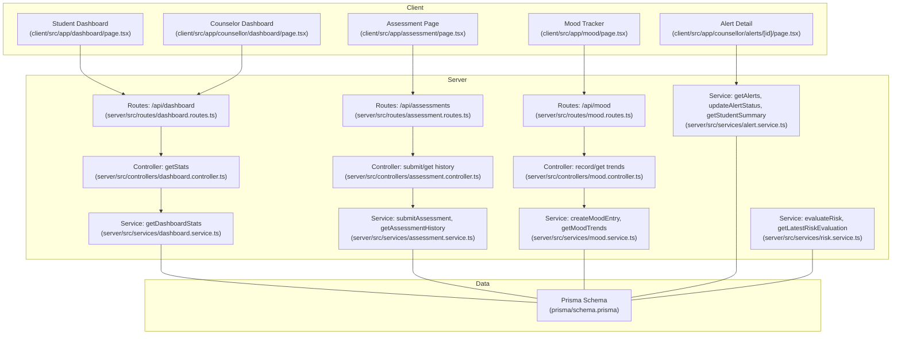
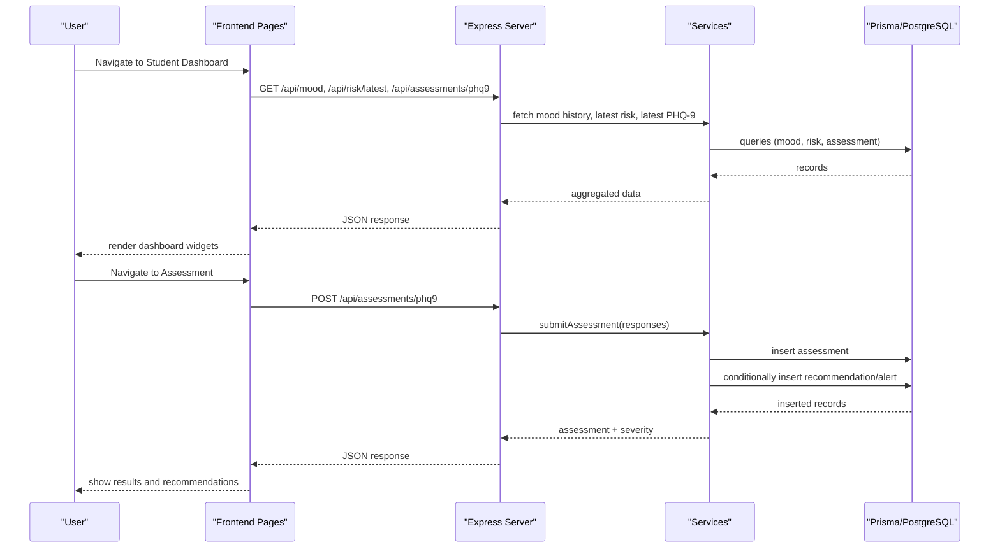
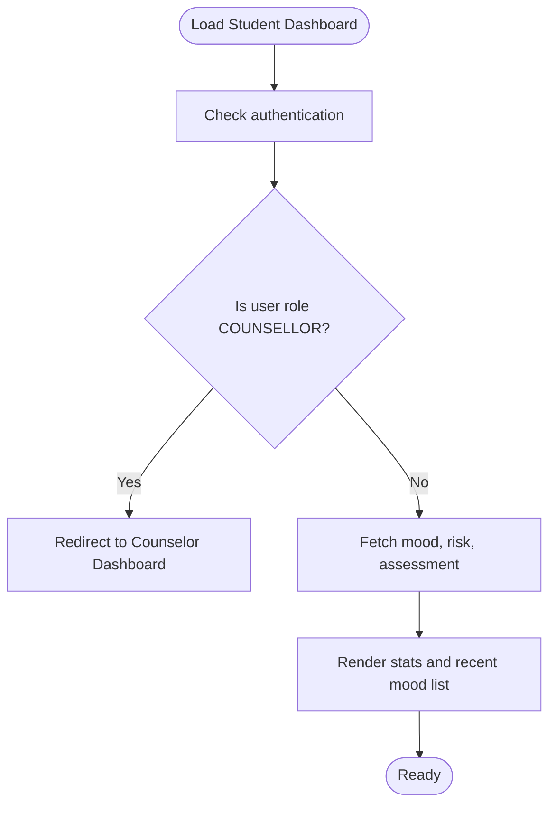
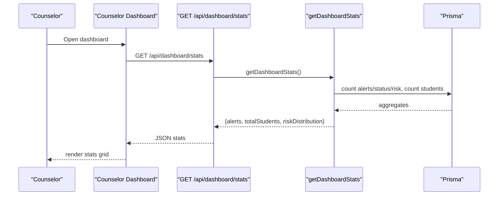
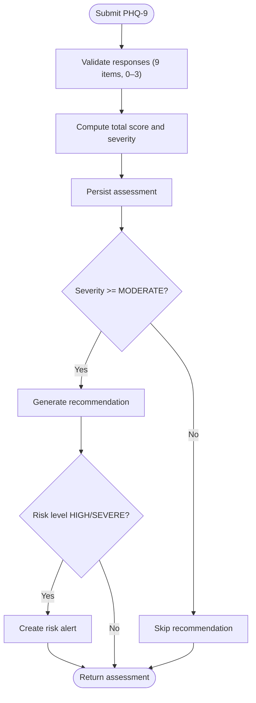
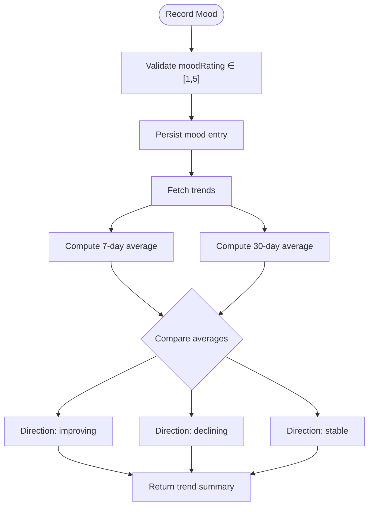
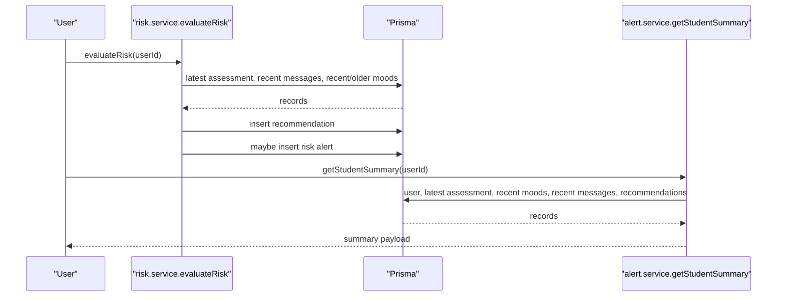
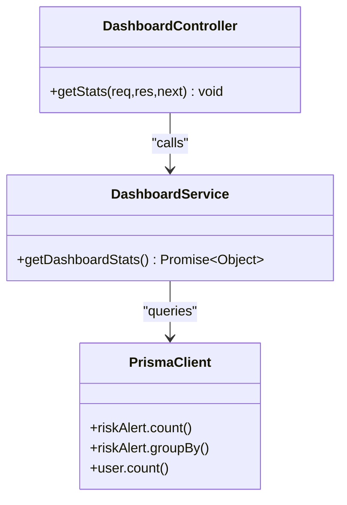
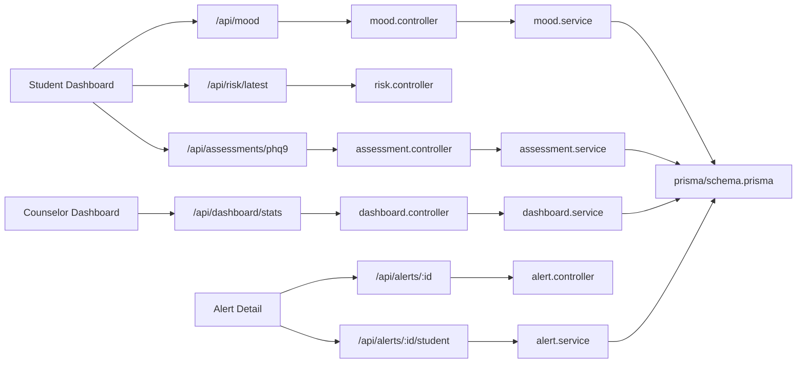
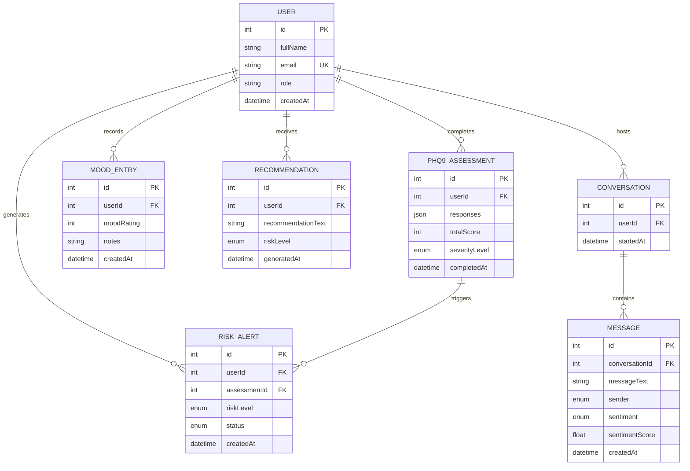

# Dashboard and Analytics

<cite>
**Referenced Files in This Document**
- [client/src/app/dashboard/page.tsx](file://client/src/app/dashboard/page.tsx)
- [client/src/app/counsellor/dashboard/page.tsx](file://client/src/app/counsellor/dashboard/page.tsx)
- [client/src/app/assessment/page.tsx](file://client/src/app/assessment/page.tsx)
- [client/src/app/mood/page.tsx](file://client/src/app/mood/page.tsx)
- [client/src/app/counsellor/alerts/[id]/page.tsx](file://client/src/app/counsellor/alerts/[id]/page.tsx)
- [server/src/controllers/dashboard.controller.ts](file://server/src/controllers/dashboard.controller.ts)
- [server/src/services/dashboard.service.ts](file://server/src/services/dashboard.service.ts)
- [server/src/routes/dashboard.routes.ts](file://server/src/routes/dashboard.routes.ts)
- [server/src/controllers/assessment.controller.ts](file://server/src/controllers/assessment.controller.ts)
- [server/src/services/assessment.service.ts](file://server/src/services/assessment.service.ts)
- [server/src/controllers/mood.controller.ts](file://server/src/controllers/mood.controller.ts)
- [server/src/services/mood.service.ts](file://server/src/services/mood.service.ts)
- [server/src/services/alert.service.ts](file://server/src/services/alert.service.ts)
- [server/src/services/risk.service.ts](file://server/src/services/risk.service.ts)
- [prisma/schema.prisma](file://prisma/schema.prisma)
</cite>

## Table of Contents
1. [Introduction](#introduction)
2. [Project Structure](#project-structure)
3. [Core Components](#core-components)
4. [Architecture Overview](#architecture-overview)
5. [Detailed Component Analysis](#detailed-component-analysis)
6. [Dependency Analysis](#dependency-analysis)
7. [Performance Considerations](#performance-considerations)
8. [Troubleshooting Guide](#troubleshooting-guide)
9. [Conclusion](#conclusion)
10. [Appendices](#appendices)

## Introduction
This document describes the dashboard and analytics system for administrative monitoring and reporting. It covers:
- Student dashboard: personal assessment history, mood trends, recommendation access, and resource navigation
- Counselor dashboard: risk alert management, student monitoring tools, assessment review capabilities, and intervention tracking
- Administrative interface: system monitoring, user management, report generation, and analytics visualization
- Data aggregation algorithms for insights, trend analysis, and performance metrics
- Reporting system for institutional summaries, intervention effectiveness, and system utilization
- Practical examples of dashboard navigation, data interpretation, and decision support
- Privacy considerations, access controls, and integration with clinical quality measures

## Project Structure
The system comprises:
- Frontend (Next.js app) with pages for student and counselor dashboards, assessments, mood tracking, and alert detail
- Backend (Express server) with controllers, services, and routes for dashboards, assessments, mood, alerts, and risk
- Prisma schema modeling users, assessments, mood entries, risk alerts, recommendations, and messages
- NLP service for sentiment analysis (external to this document scope)

**Diagram sources**
- [client/src/app/dashboard/page.tsx:1-206](file://client/src/app/dashboard/page.tsx#L1-L206)
- [client/src/app/counsellor/dashboard/page.tsx:1-213](file://client/src/app/counsellor/dashboard/page.tsx#L1-L213)
- [client/src/app/assessment/page.tsx:1-192](file://client/src/app/assessment/page.tsx#L1-L192)
- [client/src/app/mood/page.tsx:1-245](file://client/src/app/mood/page.tsx#L1-L245)
- [client/src/app/counsellor/alerts/[id]/page.tsx](file://client/src/app/counsellor/alerts/[id]/page.tsx#L1-L246)
- [server/src/routes/dashboard.routes.ts:1-11](file://server/src/routes/dashboard.routes.ts#L1-L11)
- [server/src/controllers/dashboard.controller.ts:1-13](file://server/src/controllers/dashboard.controller.ts#L1-L13)
- [server/src/services/dashboard.service.ts:1-19](file://server/src/services/dashboard.service.ts#L1-L19)
- [server/src/controllers/assessment.controller.ts:1-74](file://server/src/controllers/assessment.controller.ts#L1-L74)
- [server/src/services/assessment.service.ts:1-89](file://server/src/services/assessment.service.ts#L1-L89)
- [server/src/controllers/mood.controller.ts:1-67](file://server/src/controllers/mood.controller.ts#L1-L67)
- [server/src/services/mood.service.ts:1-58](file://server/src/services/mood.service.ts#L1-L58)
- [server/src/services/alert.service.ts:1-62](file://server/src/services/alert.service.ts#L1-L62)
- [server/src/services/risk.service.ts:1-138](file://server/src/services/risk.service.ts#L1-L138)
- [prisma/schema.prisma:1-134](file://prisma/schema.prisma#L1-L134)

**Section sources**
- [client/src/app/dashboard/page.tsx:1-206](file://client/src/app/dashboard/page.tsx#L1-L206)
- [client/src/app/counsellor/dashboard/page.tsx:1-213](file://client/src/app/counsellor/dashboard/page.tsx#L1-L213)
- [client/src/app/assessment/page.tsx:1-192](file://client/src/app/assessment/page.tsx#L1-L192)
- [client/src/app/mood/page.tsx:1-245](file://client/src/app/mood/page.tsx#L1-L245)
- [client/src/app/counsellor/alerts/[id]/page.tsx](file://client/src/app/counsellor/alerts/[id]/page.tsx#L1-L246)
- [server/src/routes/dashboard.routes.ts:1-11](file://server/src/routes/dashboard.routes.ts#L1-L11)
- [server/src/controllers/dashboard.controller.ts:1-13](file://server/src/controllers/dashboard.controller.ts#L1-L13)
- [server/src/services/dashboard.service.ts:1-19](file://server/src/services/dashboard.service.ts#L1-L19)
- [server/src/controllers/assessment.controller.ts:1-74](file://server/src/controllers/assessment.controller.ts#L1-L74)
- [server/src/services/assessment.service.ts:1-89](file://server/src/services/assessment.service.ts#L1-L89)
- [server/src/controllers/mood.controller.ts:1-67](file://server/src/controllers/mood.controller.ts#L1-L67)
- [server/src/services/mood.service.ts:1-58](file://server/src/services/mood.service.ts#L1-L58)
- [server/src/services/alert.service.ts:1-62](file://server/src/services/alert.service.ts#L1-L62)
- [server/src/services/risk.service.ts:1-138](file://server/src/services/risk.service.ts#L1-L138)
- [prisma/schema.prisma:1-134](file://prisma/schema.prisma#L1-L134)

## Core Components
- Student Dashboard
  - Displays latest mood, PHQ-9 severity, and risk level
  - Provides quick actions to chat, take assessment, and log mood
  - Shows recent mood entries with emoji ratings and dates
- Counselor Dashboard
  - Shows counts for total alerts, pending, reviewed, resolved
  - Filters alerts by status and risk level
  - Links to alert detail pages for student summaries and recommendations
- Assessment System
  - PHQ-9 form with severity classification and recommendation generation for moderate/severe cases
  - Assessment history retrieval per user
- Mood Tracking
  - Mood entry recording with validation
  - Trend calculation over 7-day vs 30-day windows with direction indicator
- Risk and Alert Management
  - Risk evaluation combining PHQ-9, sentiment ratios, and mood trends
  - Automatic alert creation for HIGH/SEVERE risks linked to assessments
  - Alert status updates and student summary aggregation
- Administrative Monitoring
  - Dashboard statistics endpoint for counselors
  - Counts and distribution of alerts and students

**Section sources**
- [client/src/app/dashboard/page.tsx:29-205](file://client/src/app/dashboard/page.tsx#L29-L205)
- [client/src/app/counsellor/dashboard/page.tsx:28-212](file://client/src/app/counsellor/dashboard/page.tsx#L28-L212)
- [server/src/controllers/assessment.controller.ts:5-74](file://server/src/controllers/assessment.controller.ts#L5-L74)
- [server/src/services/assessment.service.ts:20-89](file://server/src/services/assessment.service.ts#L20-L89)
- [server/src/controllers/mood.controller.ts:5-67](file://server/src/controllers/mood.controller.ts#L5-L67)
- [server/src/services/mood.service.ts:22-58](file://server/src/services/mood.service.ts#L22-L58)
- [server/src/services/risk.service.ts:11-138](file://server/src/services/risk.service.ts#L11-L138)
- [server/src/services/alert.service.ts:3-62](file://server/src/services/alert.service.ts#L3-L62)
- [server/src/controllers/dashboard.controller.ts:5-12](file://server/src/controllers/dashboard.controller.ts#L5-L12)
- [server/src/services/dashboard.service.ts:3-18](file://server/src/services/dashboard.service.ts#L3-L18)

## Architecture Overview
The frontend communicates with backend routes via authenticated requests. Controllers delegate to services, which query Prisma models. Risk evaluation and alert creation integrate assessment, message sentiment, and mood data.

**Diagram sources**
- [client/src/app/dashboard/page.tsx:51-69](file://client/src/app/dashboard/page.tsx#L51-L69)
- [client/src/app/assessment/page.tsx:63-73](file://client/src/app/assessment/page.tsx#L63-L73)
- [server/src/controllers/assessment.controller.ts:5-34](file://server/src/controllers/assessment.controller.ts#L5-L34)
- [server/src/services/assessment.service.ts:20-33](file://server/src/services/assessment.service.ts#L20-L33)
- [server/src/services/risk.service.ts:87-104](file://server/src/services/risk.service.ts#L87-L104)
- [prisma/schema.prisma:97-108](file://prisma/schema.prisma#L97-L108)

## Detailed Component Analysis

### Student Dashboard
- Fetches three datasets concurrently: recent mood entries, latest risk evaluation, and latest PHQ-9 assessment
- Renders quick stats cards for latest mood, PHQ-9 severity, and risk level
- Provides quick action links to chat, assessment, and mood logging
- Displays recent mood entries with emoji, rating, optional notes, and date

**Diagram sources**
- [client/src/app/dashboard/page.tsx:37-69](file://client/src/app/dashboard/page.tsx#L37-L69)

**Section sources**
- [client/src/app/dashboard/page.tsx:29-205](file://client/src/app/dashboard/page.tsx#L29-L205)

### Counselor Dashboard
- Requires counselor role and authenticates via middleware
- Loads dashboard stats and paginates/queries alerts with filters for status and risk level
- Presents alert list with student info, risk badge, status badge, and date
- Supports filtering and automatic refetch on filter change

**Diagram sources**
- [client/src/app/counsellor/dashboard/page.tsx:49-63](file://client/src/app/counsellor/dashboard/page.tsx#L49-L63)
- [server/src/routes/dashboard.routes.ts:7-8](file://server/src/routes/dashboard.routes.ts#L7-L8)
- [server/src/controllers/dashboard.controller.ts:5-12](file://server/src/controllers/dashboard.controller.ts#L5-L12)
- [server/src/services/dashboard.service.ts:3-18](file://server/src/services/dashboard.service.ts#L3-L18)

**Section sources**
- [client/src/app/counsellor/dashboard/page.tsx:28-212](file://client/src/app/counsellor/dashboard/page.tsx#L28-L212)
- [server/src/routes/dashboard.routes.ts:1-11](file://server/src/routes/dashboard.routes.ts#L1-L11)
- [server/src/controllers/dashboard.controller.ts:1-13](file://server/src/controllers/dashboard.controller.ts#L1-L13)
- [server/src/services/dashboard.service.ts:1-19](file://server/src/services/dashboard.service.ts#L1-L19)

### Assessment System
- Submission validates responses length and value range, computes total score, and classifies severity
- Generates recommendations for moderate/severe cases and creates risk alerts when appropriate
- History retrieval returns ordered assessments by completion time

**Diagram sources**
- [server/src/controllers/assessment.controller.ts:5-34](file://server/src/controllers/assessment.controller.ts#L5-L34)
- [server/src/services/assessment.service.ts:20-89](file://server/src/services/assessment.service.ts#L20-L89)
- [server/src/services/risk.service.ts:87-104](file://server/src/services/risk.service.ts#L87-L104)

**Section sources**
- [client/src/app/assessment/page.tsx:33-191](file://client/src/app/assessment/page.tsx#L33-L191)
- [server/src/controllers/assessment.controller.ts:1-74](file://server/src/controllers/assessment.controller.ts#L1-L74)
- [server/src/services/assessment.service.ts:1-89](file://server/src/services/assessment.service.ts#L1-L89)
- [server/src/services/risk.service.ts:1-138](file://server/src/services/risk.service.ts#L1-L138)

### Mood Tracking
- Records mood entries with validation (1–5) and optional notes
- Calculates trends over 7-day vs 30-day windows and determines direction (improving/stable/declining)
- Retrieves history with optional date range filters

**Diagram sources**
- [server/src/controllers/mood.controller.ts:5-34](file://server/src/controllers/mood.controller.ts#L5-L34)
- [server/src/services/mood.service.ts:22-58](file://server/src/services/mood.service.ts#L22-L58)

**Section sources**
- [client/src/app/mood/page.tsx:29-245](file://client/src/app/mood/page.tsx#L29-L245)
- [server/src/controllers/mood.controller.ts:1-67](file://server/src/controllers/mood.controller.ts#L1-L67)
- [server/src/services/mood.service.ts:1-58](file://server/src/services/mood.service.ts#L1-L58)

### Risk and Alert Management
- Risk evaluation combines PHQ-9 score, recent negative sentiment ratio, and mood trend direction
- Creates recommendations and risk alerts for HIGH/SEVERE thresholds
- Counselor alert detail page aggregates student summary: mood average, sentiment breakdown, latest assessment, and recommendations
- Alert status transitions supported (PENDING → REVIEWED → RESOLVED)

**Diagram sources**
- [server/src/services/risk.service.ts:11-107](file://server/src/services/risk.service.ts#L11-L107)
- [server/src/services/alert.service.ts:35-62](file://server/src/services/alert.service.ts#L35-L62)
- [client/src/app/counsellor/alerts/[id]/page.tsx](file://client/src/app/counsellor/alerts/[id]/page.tsx#L57-L85)

**Section sources**
- [server/src/services/risk.service.ts:1-138](file://server/src/services/risk.service.ts#L1-L138)
- [server/src/services/alert.service.ts:1-62](file://server/src/services/alert.service.ts#L1-L62)
- [client/src/app/counsellor/alerts/[id]/page.tsx](file://client/src/app/counsellor/alerts/[id]/page.tsx#L34-L246)

### Administrative Monitoring
- Dashboard stats endpoint returns alert counts by status, total student count, and risk distribution
- Access controlled to counselors via middleware

**Diagram sources**
- [server/src/controllers/dashboard.controller.ts:5-12](file://server/src/controllers/dashboard.controller.ts#L5-L12)
- [server/src/services/dashboard.service.ts:3-18](file://server/src/services/dashboard.service.ts#L3-L18)
- [prisma/schema.prisma:121-133](file://prisma/schema.prisma#L121-L133)

**Section sources**
- [server/src/routes/dashboard.routes.ts:1-11](file://server/src/routes/dashboard.routes.ts#L1-L11)
- [server/src/controllers/dashboard.controller.ts:1-13](file://server/src/controllers/dashboard.controller.ts#L1-L13)
- [server/src/services/dashboard.service.ts:1-19](file://server/src/services/dashboard.service.ts#L1-L19)

## Dependency Analysis
- Controllers depend on services for business logic
- Services depend on Prisma for data access
- Frontend pages depend on API endpoints exposed by routes/controllers
- Risk evaluation depends on assessment, message sentiment, and mood data
- Alert detail depends on alert and student summary services

**Diagram sources**
- [client/src/app/dashboard/page.tsx:51-69](file://client/src/app/dashboard/page.tsx#L51-L69)
- [client/src/app/counsellor/dashboard/page.tsx:49-63](file://client/src/app/counsellor/dashboard/page.tsx#L49-L63)
- [client/src/app/counsellor/alerts/[id]/page.tsx](file://client/src/app/counsellor/alerts/[id]/page.tsx#L57-L70)
- [server/src/controllers/mood.controller.ts:1-67](file://server/src/controllers/mood.controller.ts#L1-L67)
- [server/src/controllers/assessment.controller.ts:1-74](file://server/src/controllers/assessment.controller.ts#L1-L74)
- [server/src/controllers/dashboard.controller.ts:1-13](file://server/src/controllers/dashboard.controller.ts#L1-L13)
- [server/src/services/alert.service.ts:1-62](file://server/src/services/alert.service.ts#L1-L62)
- [prisma/schema.prisma:1-134](file://prisma/schema.prisma#L1-L134)

**Section sources**
- [client/src/app/dashboard/page.tsx:1-206](file://client/src/app/dashboard/page.tsx#L1-L206)
- [client/src/app/counsellor/dashboard/page.tsx:1-213](file://client/src/app/counsellor/dashboard/page.tsx#L1-L213)
- [client/src/app/counsellor/alerts/[id]/page.tsx](file://client/src/app/counsellor/alerts/[id]/page.tsx#L1-L246)
- [server/src/controllers/mood.controller.ts:1-67](file://server/src/controllers/mood.controller.ts#L1-L67)
- [server/src/controllers/assessment.controller.ts:1-74](file://server/src/controllers/assessment.controller.ts#L1-L74)
- [server/src/controllers/dashboard.controller.ts:1-13](file://server/src/controllers/dashboard.controller.ts#L1-L13)
- [server/src/services/alert.service.ts:1-62](file://server/src/services/alert.service.ts#L1-L62)
- [prisma/schema.prisma:1-134](file://prisma/schema.prisma#L1-L134)

## Performance Considerations
- Concurrent API fetching on dashboards reduces perceived latency
- Trend calculations use bounded recent windows (7 and 30 days) to keep computations lightweight
- Dashboard stats use grouped counts and single queries to minimize round trips
- Filtering on alerts uses URL query parameters to avoid unnecessary data transfer
- Recommendation and alert creation occur only for moderate/severe cases to limit write volume

[No sources needed since this section provides general guidance]

## Troubleshooting Guide
- Authentication failures redirect to login; ensure tokens are present and valid
- Validation errors for assessments and mood entries return explicit messages; confirm input ranges and completeness
- Counselor-only routes block unauthorized access; verify role claims
- Network errors during concurrent fetches are handled gracefully; retry after connectivity is restored
- If alerts do not appear, verify filters and statuses; use “All Statuses” and “All Levels” temporarily to isolate issues

**Section sources**
- [client/src/app/dashboard/page.tsx:37-49](file://client/src/app/dashboard/page.tsx#L37-L49)
- [client/src/app/counsellor/dashboard/page.tsx:36-47](file://client/src/app/counsellor/dashboard/page.tsx#L36-L47)
- [server/src/controllers/assessment.controller.ts:14-21](file://server/src/controllers/assessment.controller.ts#L14-L21)
- [server/src/controllers/mood.controller.ts:14-27](file://server/src/controllers/mood.controller.ts#L14-L27)

## Conclusion
The dashboard and analytics system integrates student self-reporting (assessments and mood), counselor oversight (alerts and summaries), and administrative monitoring (counts and distributions). Robust data aggregation and risk evaluation enable timely interventions while maintaining performance and usability.

[No sources needed since this section summarizes without analyzing specific files]

## Appendices

### Data Models Overview

**Diagram sources**
- [prisma/schema.prisma:47-133](file://prisma/schema.prisma#L47-L133)

### Practical Examples
- Student navigation
  - From the student dashboard, click “Take Assessment” to complete PHQ-9; upon submission, view severity classification and recommendations if applicable
  - From the student dashboard, click “Log Mood” to record daily mood; revisit the Mood Tracker to review history and trends
- Counselor navigation
  - From the counselor dashboard, apply filters for status and risk level to narrow alerts; click an alert to view student summary and recommendations
  - Update alert status using the “Mark as…” buttons; navigate back to the dashboard to refresh counts
- Decision support
  - Use PHQ-9 severity and risk level to guide intervention prioritization
  - Review mood trends and sentiment breakdown to assess changes over time
  - Reference generated recommendations for tailored guidance

[No sources needed since this section provides general guidance]

### Privacy and Access Controls
- Role-based routing ensures counselors access counselor dashboards and alerts; students are redirected appropriately
- All endpoints require authentication; controllers validate presence of user context
- Data exposure limited to authenticated users’ own assessments and moods; counselor views include anonymized identifiers where necessary

**Section sources**
- [client/src/app/dashboard/page.tsx:37-48](file://client/src/app/dashboard/page.tsx#L37-L48)
- [client/src/app/counsellor/dashboard/page.tsx:36-46](file://client/src/app/counsellor/dashboard/page.tsx#L36-L46)
- [server/src/controllers/assessment.controller.ts:7-10](file://server/src/controllers/assessment.controller.ts#L7-L10)
- [server/src/controllers/mood.controller.ts:7-10](file://server/src/controllers/mood.controller.ts#L7-L10)

### Integration with Clinical Quality Measures
- PHQ-9 scoring aligns with standard severity categories enabling outcome tracking
- Risk evaluation criteria incorporate symptom severity, sentiment trends, and mood stability to support quality metrics
- Alert creation and resolution tracking supports intervention effectiveness measurement

[No sources needed since this section provides general guidance]