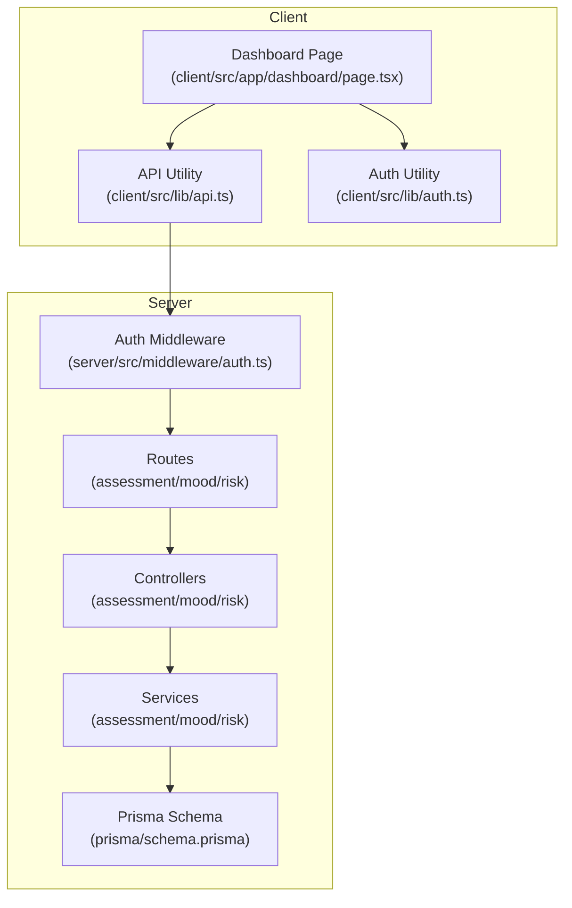
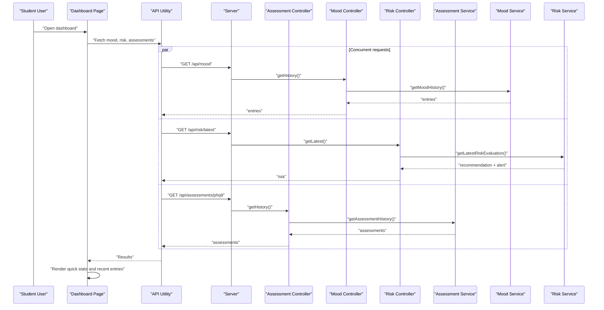
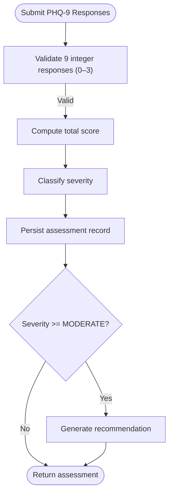
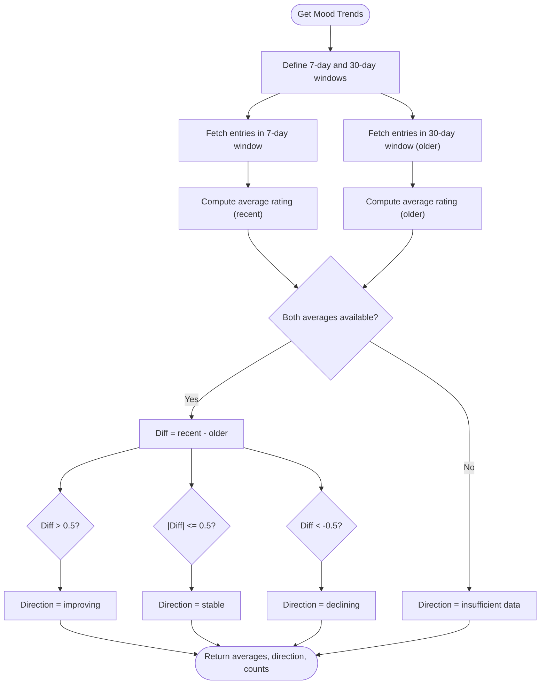
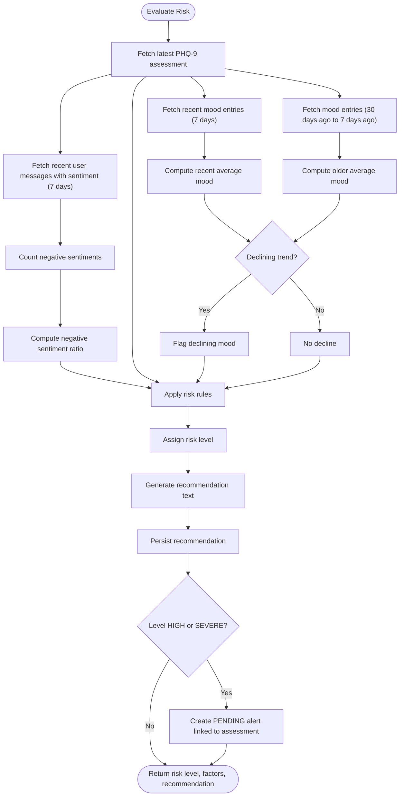
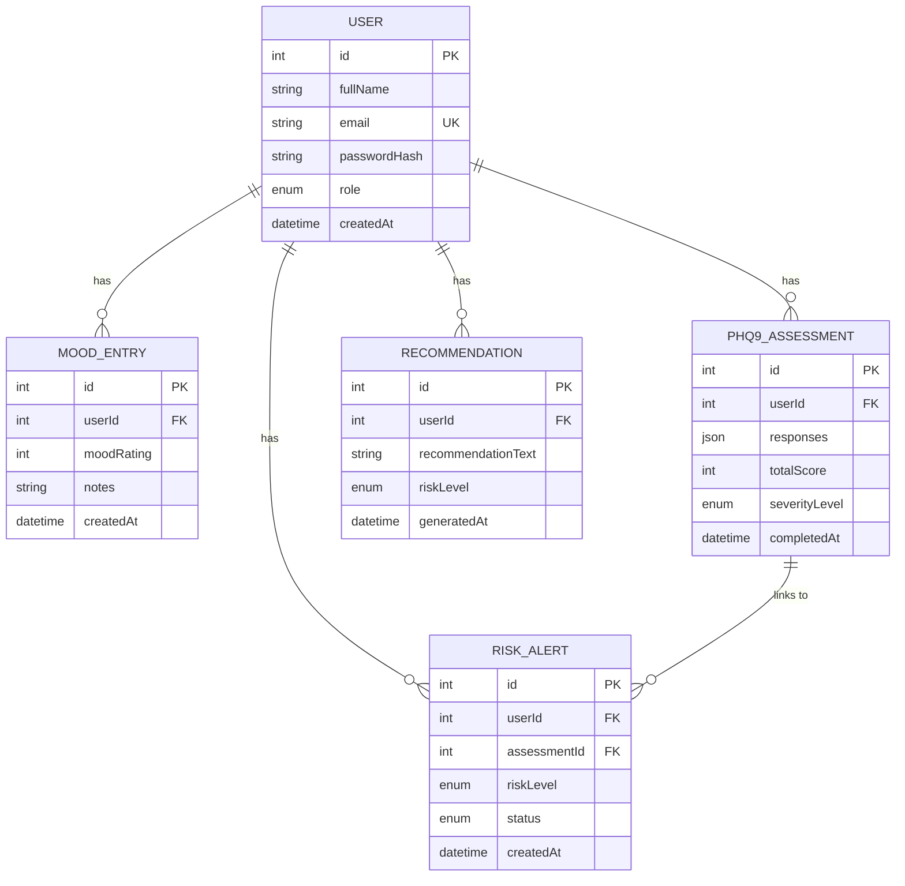
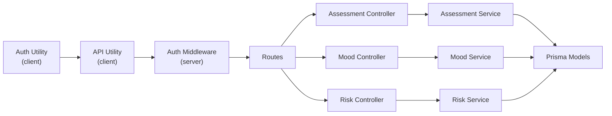

# Student Dashboard

<cite>
**Referenced Files in This Document**
- [client/src/app/dashboard/page.tsx](file://client/src/app/dashboard/page.tsx)
- [client/src/lib/api.ts](file://client/src/lib/api.ts)
- [client/src/lib/auth.ts](file://client/src/lib/auth.ts)
- [server/src/controllers/assessment.controller.ts](file://server/src/controllers/assessment.controller.ts)
- [server/src/controllers/mood.controller.ts](file://server/src/controllers/mood.controller.ts)
- [server/src/controllers/risk.controller.ts](file://server/src/controllers/risk.controller.ts)
- [server/src/services/assessment.service.ts](file://server/src/services/assessment.service.ts)
- [server/src/services/mood.service.ts](file://server/src/services/mood.service.ts)
- [server/src/services/risk.service.ts](file://server/src/services/risk.service.ts)
- [server/src/middleware/auth.ts](file://server/src/middleware/auth.ts)
- [prisma/schema.prisma](file://prisma/schema.prisma)
</cite>

## Table of Contents
1. [Introduction](#introduction)
2. [Project Structure](#project-structure)
3. [Core Components](#core-components)
4. [Architecture Overview](#architecture-overview)
5. [Detailed Component Analysis](#detailed-component-analysis)
6. [Dependency Analysis](#dependency-analysis)
7. [Performance Considerations](#performance-considerations)
8. [Troubleshooting Guide](#troubleshooting-guide)
9. [Privacy Controls and Data Presentation Preferences](#privacy-controls-and-data-presentation-preferences)
10. [Conclusion](#conclusion)

## Introduction
This document describes the student dashboard system designed for personal mental health monitoring and self-care support. It explains the dashboard layout, data aggregation logic, UI components for displaying PHQ-9 scores, mood patterns, and AI-generated wellness suggestions, and how the dashboard integrates with other platform features such as chat access, mood logging, and risk evaluation. Practical examples illustrate navigation, interpreting assessment results, and accessing recommended coping strategies. Privacy controls and data presentation preferences available to students are also documented.

## Project Structure
The dashboard is implemented as a Next.js client page that fetches data from backend endpoints secured by authentication and role-based authorization. The backend exposes REST endpoints for assessments, mood entries, and risk evaluations, backed by Prisma ORM and a PostgreSQL database.

**Diagram sources**
- [client/src/app/dashboard/page.tsx:1-206](file://client/src/app/dashboard/page.tsx#L1-L206)
- [client/src/lib/api.ts:1-36](file://client/src/lib/api.ts#L1-L36)
- [client/src/lib/auth.ts:1-27](file://client/src/lib/auth.ts#L1-L27)
- [server/src/middleware/auth.ts:1-39](file://server/src/middleware/auth.ts#L1-L39)
- [prisma/schema.prisma:1-134](file://prisma/schema.prisma#L1-L134)

**Section sources**
- [client/src/app/dashboard/page.tsx:1-206](file://client/src/app/dashboard/page.tsx#L1-L206)
- [client/src/lib/api.ts:1-36](file://client/src/lib/api.ts#L1-L36)
- [client/src/lib/auth.ts:1-27](file://client/src/lib/auth.ts#L1-L27)
- [server/src/middleware/auth.ts:1-39](file://server/src/middleware/auth.ts#L1-L39)
- [prisma/schema.prisma:1-134](file://prisma/schema.prisma#L1-L134)

## Core Components
- Dashboard page: Renders quick stats (latest mood, PHQ-9 severity, risk level), quick actions, and recent mood entries.
- Authentication and authorization: Ensures only authenticated students can access the dashboard; redirects counselors to their dashboard.
- Data fetching: Uses a unified API utility to call assessment, mood, and risk endpoints concurrently.
- UI helpers: Provides emoji-based mood display and color-coded severity/risk badges.

Key responsibilities:
- Fetch and display recent assessment history (top 5).
- Show current mood rating and notes.
- Present PHQ-9 severity classification and score.
- Display risk level derived from combined signals.
- Offer quick links to chat, assessment, and mood logging.

**Section sources**
- [client/src/app/dashboard/page.tsx:29-206](file://client/src/app/dashboard/page.tsx#L29-L206)
- [client/src/lib/api.ts:3-35](file://client/src/lib/api.ts#L3-L35)
- [client/src/lib/auth.ts:14-26](file://client/src/lib/auth.ts#L14-L26)

## Architecture Overview
The dashboard orchestrates three primary data sources:
- Mood entries: most recent entries and optional trend computation.
- PHQ-9 assessments: latest submission with severity classification.
- Risk evaluation: composite risk level derived from assessment, mood trends, and chat sentiment.

**Diagram sources**
- [client/src/app/dashboard/page.tsx:51-69](file://client/src/app/dashboard/page.tsx#L51-L69)
- [server/src/controllers/assessment.controller.ts:36-48](file://server/src/controllers/assessment.controller.ts#L36-L48)
- [server/src/controllers/mood.controller.ts:36-52](file://server/src/controllers/mood.controller.ts#L36-L52)
- [server/src/controllers/risk.controller.ts:19-31](file://server/src/controllers/risk.controller.ts#L19-L31)
- [server/src/services/assessment.service.ts:35-46](file://server/src/services/assessment.service.ts#L35-L46)
- [server/src/services/mood.service.ts:9-20](file://server/src/services/mood.service.ts#L9-L20)
- [server/src/services/risk.service.ts:122-137](file://server/src/services/risk.service.ts#L122-L137)

## Detailed Component Analysis

### Dashboard Page (Student View)
Responsibilities:
- Redirect unauthenticated users to login.
- Redirect counselors to their dashboard.
- Fetch mood, risk, and assessment data concurrently.
- Render:
  - Latest mood rating with emoji.
  - PHQ-9 severity level and score.
  - Risk level badge.
  - Quick action buttons to chat, take assessment, log mood.
  - Recent mood entries with date and optional notes.

Data aggregation highlights:
- Latest assessment is selected from the returned list.
- Mood list is limited to the five most recent entries.
- Risk level is presented from the latest evaluation.

UI helpers:
- Emoji selection based on mood rating.
- Severity and risk color coding for quick visual assessment.

Navigation examples:
- Click “Start Chat” to access the chat interface.
- Click “Take Assessment” to navigate to the PHQ-9 form.
- Click “Log Mood” to record daily mood.

Interpreting assessment results:
- Severity level is mapped from the PHQ-9 total score.
- Score is shown out of 27.
- Color-coded badges help quickly assess severity.

Accessing recommended coping strategies:
- Risk evaluation generates a recommendation text stored in the database.
- Students can review recommendations via the risk endpoint.

**Section sources**
- [client/src/app/dashboard/page.tsx:29-206](file://client/src/app/dashboard/page.tsx#L29-L206)
- [client/src/lib/auth.ts:24-26](file://client/src/lib/auth.ts#L24-L26)

### Assessment Data Flow
The assessment subsystem computes PHQ-9 totals, classifies severity, and optionally generates recommendations for counselors when severity reaches moderate or higher.

**Diagram sources**
- [server/src/controllers/assessment.controller.ts:5-34](file://server/src/controllers/assessment.controller.ts#L5-L34)
- [server/src/services/assessment.service.ts:20-33](file://server/src/services/assessment.service.ts#L20-L33)
- [server/src/services/assessment.service.ts:63-88](file://server/src/services/assessment.service.ts#L63-L88)

**Section sources**
- [server/src/controllers/assessment.controller.ts:5-74](file://server/src/controllers/assessment.controller.ts#L5-L74)
- [server/src/services/assessment.service.ts:12-18](file://server/src/services/assessment.service.ts#L12-L18)
- [server/src/services/assessment.service.ts:20-33](file://server/src/services/assessment.service.ts#L20-L33)
- [server/src/services/assessment.service.ts:63-88](file://server/src/services/assessment.service.ts#L63-L88)

### Mood Tracking and Trends
The mood subsystem supports recording daily ratings and computing directional trends over recent windows.

Highlights:
- Recording constraints: integer rating 1–5; optional notes.
- Trend calculation compares average mood over the last 7 days versus the previous 30 days.
- Direction categories: improving, stable, declining, insufficient data.

**Diagram sources**
- [server/src/controllers/mood.controller.ts:54-66](file://server/src/controllers/mood.controller.ts#L54-L66)
- [server/src/services/mood.service.ts:22-57](file://server/src/services/mood.service.ts#L22-L57)

**Section sources**
- [server/src/controllers/mood.controller.ts:5-67](file://server/src/controllers/mood.controller.ts#L5-L67)
- [server/src/services/mood.service.ts:3-7](file://server/src/services/mood.service.ts#L3-L7)
- [server/src/services/mood.service.ts:22-57](file://server/src/services/mood.service.ts#L22-L57)

### Risk Evaluation Logic
Risk evaluation synthesizes PHQ-9 severity, recent chat sentiment, and mood trends to produce a risk level and recommendation.

**Diagram sources**
- [server/src/controllers/risk.controller.ts:5-31](file://server/src/controllers/risk.controller.ts#L5-L31)
- [server/src/services/risk.service.ts:11-107](file://server/src/services/risk.service.ts#L11-L107)

**Section sources**
- [server/src/controllers/risk.controller.ts:1-32](file://server/src/controllers/risk.controller.ts#L1-L32)
- [server/src/services/risk.service.ts:11-107](file://server/src/services/risk.service.ts#L11-L107)

### Data Models Involved
The dashboard relies on the following Prisma models and relations:

**Diagram sources**
- [prisma/schema.prisma:47-134](file://prisma/schema.prisma#L47-L134)

**Section sources**
- [prisma/schema.prisma:47-134](file://prisma/schema.prisma#L47-L134)

## Dependency Analysis
- Client-to-server dependencies:
  - Dashboard page depends on API utility for authenticated requests.
  - Authentication utility stores and retrieves tokens and user info.
  - Middleware enforces bearer token validation and role checks.
- Server-side dependencies:
  - Controllers validate inputs and delegate to services.
  - Services encapsulate business logic and interact with Prisma.
  - Prisma schema defines models and relationships.

**Diagram sources**
- [client/src/lib/auth.ts:1-27](file://client/src/lib/auth.ts#L1-L27)
- [client/src/lib/api.ts:1-36](file://client/src/lib/api.ts#L1-L36)
- [server/src/middleware/auth.ts:1-39](file://server/src/middleware/auth.ts#L1-L39)
- [server/src/controllers/assessment.controller.ts:1-74](file://server/src/controllers/assessment.controller.ts#L1-L74)
- [server/src/controllers/mood.controller.ts:1-67](file://server/src/controllers/mood.controller.ts#L1-L67)
- [server/src/controllers/risk.controller.ts:1-32](file://server/src/controllers/risk.controller.ts#L1-L32)
- [server/src/services/assessment.service.ts:1-89](file://server/src/services/assessment.service.ts#L1-L89)
- [server/src/services/mood.service.ts:1-58](file://server/src/services/mood.service.ts#L1-L58)
- [server/src/services/risk.service.ts:1-138](file://server/src/services/risk.service.ts#L1-L138)
- [prisma/schema.prisma:1-134](file://prisma/schema.prisma#L1-L134)

**Section sources**
- [client/src/lib/auth.ts:1-27](file://client/src/lib/auth.ts#L1-L27)
- [client/src/lib/api.ts:1-36](file://client/src/lib/api.ts#L1-L36)
- [server/src/middleware/auth.ts:1-39](file://server/src/middleware/auth.ts#L1-L39)
- [prisma/schema.prisma:1-134](file://prisma/schema.prisma#L1-L134)

## Performance Considerations
- Concurrent data fetching: The dashboard fetches mood, risk, and assessment data in parallel to minimize load time.
- Data limits: Recent mood entries are capped to five items to keep the UI responsive.
- Trend computation: Trend calculations operate over bounded windows (7 and 30 days) to avoid heavy scans.
- Recommendations: Risk recommendations are persisted to reduce recomputation overhead.

[No sources needed since this section provides general guidance]

## Troubleshooting Guide
Common issues and resolutions:
- Unauthorized access: If a token is missing or invalid, the API utility redirects to login. Ensure the user is logged in and the token is present in local storage.
- Role redirection: Students are redirected away from counselor dashboards; ensure the user role is correctly stored.
- Empty data: If no assessments or mood entries are present, placeholder messages guide the user to start tracking.
- Network failures: The dashboard uses aggregated promises; individual endpoint failures are handled gracefully while others succeed.

**Section sources**
- [client/src/lib/api.ts:20-35](file://client/src/lib/api.ts#L20-L35)
- [client/src/lib/auth.ts:24-26](file://client/src/lib/auth.ts#L24-L26)
- [client/src/app/dashboard/page.tsx:97-103](file://client/src/app/dashboard/page.tsx#L97-L103)

## Privacy Controls and Data Presentation Preferences
Available controls and presentation options for students:
- Personalized display: The dashboard shows only the authenticated student’s data.
- Data limits: Recent entries are limited to a small number to reduce information overload.
- Color-coded indicators: Severity and risk levels are presented with color-coded badges for quick understanding.
- Notes visibility: Mood entries can include optional notes; these appear alongside ratings on the dashboard.
- Access restrictions: Counselors are redirected from the student dashboard to their own view.

**Section sources**
- [client/src/app/dashboard/page.tsx:115-152](file://client/src/app/dashboard/page.tsx#L115-L152)
- [client/src/lib/auth.ts:14-26](file://client/src/lib/auth.ts#L14-L26)

## Conclusion
The student dashboard consolidates mental health data—mood logs, PHQ-9 assessments, and risk evaluations—into a single, accessible view. It emphasizes quick insights through color-coded indicators, recent entry summaries, and direct navigation to self-care tools. Robust authentication and role-based routing protect privacy, while concurrent data fetching ensures responsiveness. The system’s modular design allows future enhancements such as trend visualizations and AI-generated wellness suggestions.