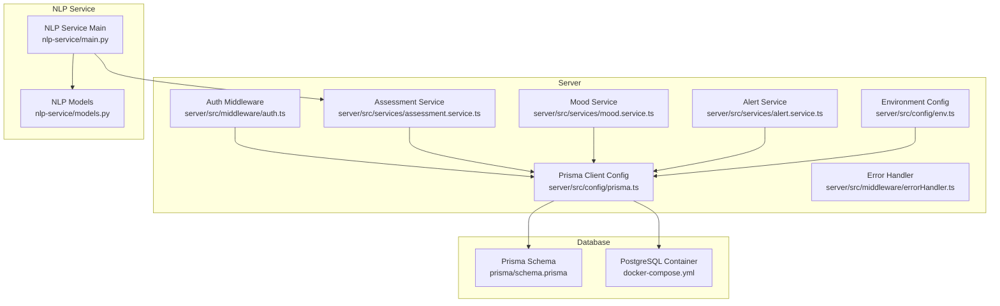
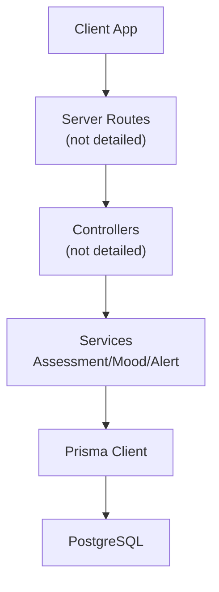
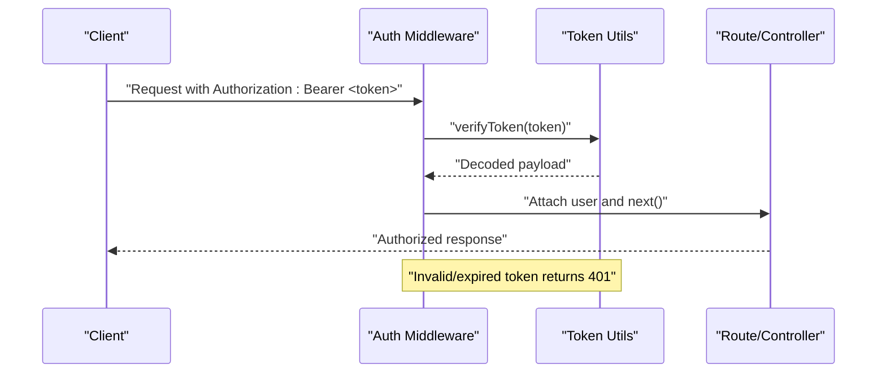
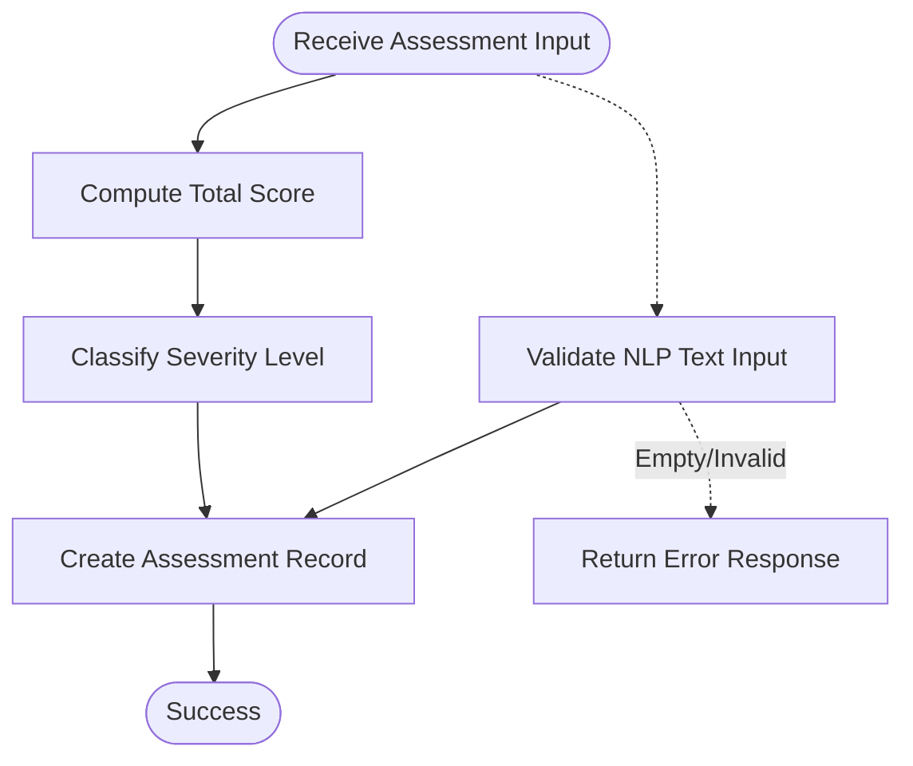
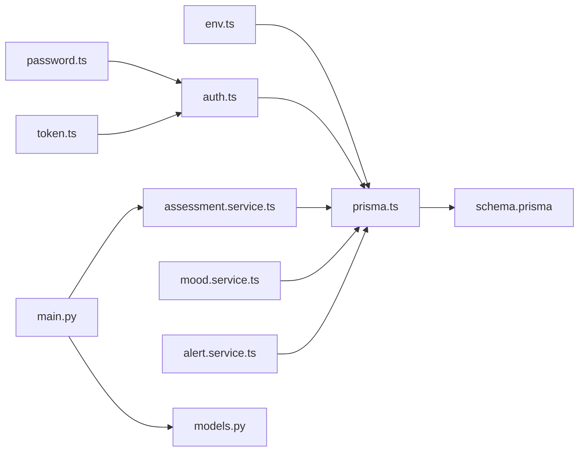
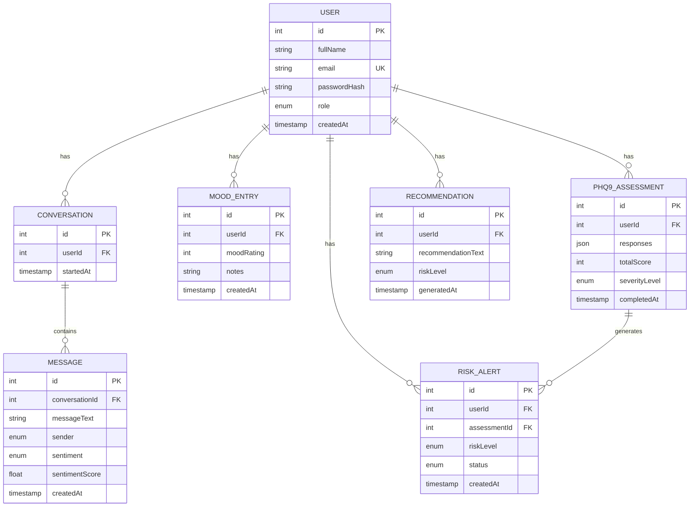

# Data Management Policies

<cite>
**Referenced Files in This Document**
- [schema.prisma](file://prisma/schema.prisma)
- [prisma.ts](file://server/src/config/prisma.ts)
- [env.ts](file://server/src/config/env.ts)
- [docker-compose.yml](file://docker-compose.yml)
- [assessment.service.ts](file://server/src/services/assessment.service.ts)
- [mood.service.ts](file://server/src/services/mood.service.ts)
- [alert.service.ts](file://server/src/services/alert.service.ts)
- [auth.ts](file://server/src/middleware/auth.ts)
- [errorHandler.ts](file://server/src/middleware/errorHandler.ts)
- [password.ts](file://server/src/utils/password.ts)
- [token.ts](file://server/src/utils/token.ts)
- [main.py](file://nlp-service/main.py)
- [models.py](file://nlp-service/models.py)
- [package.json](file://package.json)
</cite>

## Table of Contents
1. [Introduction](#introduction)
2. [Project Structure](#project-structure)
3. [Core Components](#core-components)
4. [Architecture Overview](#architecture-overview)
5. [Detailed Component Analysis](#detailed-component-analysis)
6. [Dependency Analysis](#dependency-analysis)
7. [Performance Considerations](#performance-considerations)
8. [Troubleshooting Guide](#troubleshooting-guide)
9. [Conclusion](#conclusion)
10. [Appendices](#appendices)

## Introduction
This document defines the data management policies for the BuddyAI database, focusing on data lifecycle, security, and operational procedures. It consolidates repository evidence to establish retention, anonymization, backup and recovery, access control, audit logging, validation, sanitization, error handling, performance optimization, and data seeding practices. Where the codebase does not define explicit behavior, this document outlines recommended policies aligned with privacy and security best practices.

## Project Structure
The data layer is defined by Prisma ORM and PostgreSQL, with services orchestrating data operations and middleware enforcing authentication and error handling. The NLP service performs sentiment analysis on textual content. Docker Compose provisions the database container with persistent storage.

**Diagram sources**
- [prisma.ts:1-6](file://server/src/config/prisma.ts#L1-L6)
- [env.ts:1-12](file://server/src/config/env.ts#L1-L12)
- [schema.prisma:1-134](file://prisma/schema.prisma#L1-L134)
- [docker-compose.yml:1-19](file://docker-compose.yml#L1-L19)
- [assessment.service.ts:1-89](file://server/src/services/assessment.service.ts#L1-L89)
- [mood.service.ts:1-58](file://server/src/services/mood.service.ts#L1-L58)
- [alert.service.ts:1-62](file://server/src/services/alert.service.ts#L1-L62)
- [auth.ts:1-39](file://server/src/middleware/auth.ts#L1-L39)
- [errorHandler.ts:1-13](file://server/src/middleware/errorHandler.ts#L1-L13)
- [main.py:1-71](file://nlp-service/main.py#L1-L71)
- [models.py:1-26](file://nlp-service/models.py#L1-L26)

**Section sources**
- [prisma.ts:1-6](file://server/src/config/prisma.ts#L1-L6)
- [env.ts:1-12](file://server/src/config/env.ts#L1-L12)
- [schema.prisma:1-134](file://prisma/schema.prisma#L1-L134)
- [docker-compose.yml:1-19](file://docker-compose.yml#L1-L19)
- [assessment.service.ts:1-89](file://server/src/services/assessment.service.ts#L1-L89)
- [mood.service.ts:1-58](file://server/src/services/mood.service.ts#L1-L58)
- [alert.service.ts:1-62](file://server/src/services/alert.service.ts#L1-L62)
- [auth.ts:1-39](file://server/src/middleware/auth.ts#L1-L39)
- [errorHandler.ts:1-13](file://server/src/middleware/errorHandler.ts#L1-L13)
- [main.py:1-71](file://nlp-service/main.py#L1-L71)
- [models.py:1-26](file://nlp-service/models.py#L1-L26)

## Core Components
- Database schema and indices: The Prisma schema defines entities for users, conversations, messages, mood entries, PHQ-9 assessments, recommendations, and risk alerts, with explicit indices on foreign keys and unique identifiers. Evidence includes model definitions and index directives.
- Prisma client configuration: The Prisma client is instantiated centrally and used by services.
- Environment configuration: Database URL and JWT secret are loaded from environment variables.
- Authentication and roles: Middleware enforces bearer token validation and role-based access control.
- Services orchestration: Assessment, mood, and alert services encapsulate data operations and relationships.
- NLP integration: The NLP service performs sentiment analysis and returns structured results consumed by the system.

**Section sources**
- [schema.prisma:47-134](file://prisma/schema.prisma#L47-L134)
- [prisma.ts:1-6](file://server/src/config/prisma.ts#L1-L6)
- [env.ts:6-11](file://server/src/config/env.ts#L6-L11)
- [auth.ts:5-38](file://server/src/middleware/auth.ts#L5-L38)
- [assessment.service.ts:20-33](file://server/src/services/assessment.service.ts#L20-L33)
- [mood.service.ts:3-7](file://server/src/services/mood.service.ts#L3-L7)
- [alert.service.ts:3-16](file://server/src/services/alert.service.ts#L3-L16)
- [main.py:43-64](file://nlp-service/main.py#L43-L64)

## Architecture Overview
The system follows a layered architecture:
- Presentation and routing occur in the client and server route modules (not detailed here).
- Controllers delegate to services.
- Services use the Prisma client to query and mutate data.
- The database is PostgreSQL, provisioned via Docker Compose with persistent volume.
- The NLP service is a separate microservice that enriches textual data.

**Diagram sources**
- [prisma.ts:1-6](file://server/src/config/prisma.ts#L1-L6)
- [schema.prisma:1-134](file://prisma/schema.prisma#L1-L134)
- [docker-compose.yml:4-15](file://docker-compose.yml#L4-L15)

## Detailed Component Analysis

### Data Lifecycle and Retention
- Automatic deletion schedules: Not defined in the codebase. Recommended policy: Define retention periods per data type (e.g., mood entries, messages, assessments) and implement scheduled jobs to purge expired records. Align with applicable privacy regulations (e.g., GDPR, state laws) requiring erasure upon request or after defined intervals.
- Compliance with privacy regulations: Implement data minimization, purpose limitation, and individual rights (access, rectification, erasure). Establish documented procedures for data subject requests and lawful basis for processing.
- Audit trail: Maintain logs for data creation, modification, and deletion events with timestamps and actor identification.

[No sources needed since this section provides general guidance]

### Data Anonymization for Research and Analytics
- De-identification strategy: Remove or encrypt direct identifiers (fullName, email). Aggregate or generalize derived metrics (e.g., sentiment distributions) to prevent re-identification.
- Access controls: Enforce role-based access to datasets and restrict analytics queries to approved scopes.
- Data sharing: Use encrypted channels and signed agreements; maintain data processing agreements where required.

[No sources needed since this section provides general guidance]

### Backup and Recovery Strategies
- Database backups: Schedule regular logical backups (e.g., daily) and continuous archiving. Store backups offsite or in secure cloud storage with encryption at rest and in transit.
- Disaster recovery: Define RPO/RTO targets, test restoration procedures quarterly, and maintain a secondary region or cloud failover.
- Volume management: The Docker Compose volume persists PostgreSQL data; ensure periodic snapshotting and integrity checks.

**Section sources**
- [docker-compose.yml:14-15](file://docker-compose.yml#L14-L15)

### Data Archival Policies
- Tiered storage: Move cold data (older assessments, historical trends) to archival storage with metadata retained for searchable retrieval.
- Metadata retention: Archive schema versions and audit logs with retention aligned to legal requirements.

[No sources needed since this section provides general guidance]

### Access Control Mechanisms
- Authentication: Bearer tokens validated by middleware; token payload includes identity and role.
- Authorization: Role-based enforcement for privileged endpoints.
- Secrets management: JWT secret sourced from environment variables.

**Diagram sources**
- [auth.ts:5-22](file://server/src/middleware/auth.ts#L5-L22)
- [token.ts:14-16](file://server/src/utils/token.ts#L14-L16)

**Section sources**
- [auth.ts:5-38](file://server/src/middleware/auth.ts#L5-L38)
- [token.ts:10-16](file://server/src/utils/token.ts#L10-L16)
- [env.ts:9-10](file://server/src/config/env.ts#L9-L10)

### Audit Logging for Data Modifications
- Logging scope: Record who modified what, when, and why (contextual metadata).
- Storage: Persist logs in a dedicated table or external SIEM with tamper-evident hashing.
- Retention: Align log retention with legal and operational needs.

[No sources needed since this section provides general guidance]

### Security Measures for Protecting Sensitive Information
- Encryption: Enforce TLS for transport; encrypt secrets and sensitive fields at rest.
- Password handling: Hash passwords with a strong algorithm and salt; never store plaintext.
- Input validation: Validate and sanitize inputs at boundaries; reject malformed or suspicious payloads.
- Least privilege: Restrict database credentials and service accounts to minimal required permissions.

**Section sources**
- [password.ts:5-11](file://server/src/utils/password.ts#L5-L11)

### Data Validation Rules and Input Sanitization
- Service-level validation: Services accept typed inputs and construct safe queries. For example, assessment submission computes totals and severity safely.
- NLP input validation: Pydantic models enforce non-empty text and structured responses.
- Middleware error handling: Centralized error handler returns standardized error responses.

**Diagram sources**
- [assessment.service.ts:20-33](file://server/src/services/assessment.service.ts#L20-L33)
- [models.py:7-12](file://nlp-service/models.py#L7-L12)
- [errorHandler.ts:7-12](file://server/src/middleware/errorHandler.ts#L7-L12)

**Section sources**
- [assessment.service.ts:20-33](file://server/src/services/assessment.service.ts#L20-L33)
- [models.py:4-12](file://nlp-service/models.py#L4-L12)
- [errorHandler.ts:7-12](file://server/src/middleware/errorHandler.ts#L7-L12)

### Error Handling for Data Operations
- Standardized errors: Centralized handler ensures consistent HTTP error responses with status codes and messages.
- Service failures: Wrap database operations in try/catch and propagate meaningful errors to clients.

**Section sources**
- [errorHandler.ts:7-12](file://server/src/middleware/errorHandler.ts#L7-L12)

### Performance Optimization: Indexing and Queries
- Current indices: Explicit indices exist on foreign keys and unique identifiers (e.g., user email, conversation ID, assessment ID).
- Recommendations: Add composite indices for frequent filter/order combinations (e.g., user+createdAt for mood history). Monitor slow queries and add targeted indices. Use connection pooling and limit result sets for paginated endpoints.

**Section sources**
- [schema.prisma:60-61](file://prisma/schema.prisma#L60-L61)
- [schema.prisma:83-84](file://prisma/schema.prisma#L83-L84)
- [schema.prisma:107-108](file://prisma/schema.prisma#L107-L108)
- [schema.prisma:131-132](file://prisma/schema.prisma#L131-L132)

### Database Maintenance Procedures
- Routine tasks: Vacuum/analyze periodically; monitor table bloat; update statistics; rotate logs.
- Schema migrations: Use Prisma migrations for controlled schema changes; keep migration scripts reversible where possible.

**Section sources**
- [package.json:15-17](file://package.json#L15-L17)

### Data Seeding for Development Environments
- Initial data population: Seed development databases with representative but synthetic datasets. Automate seeding via scripts or Prisma seed commands.
- Environment isolation: Keep development, staging, and production seeds distinct and governed by separate policies.

[No sources needed since this section provides general guidance]

## Dependency Analysis
The server depends on Prisma for data access, environment variables for configuration, and JWT for authentication. The NLP service is a separate process that enriches textual data.

**Diagram sources**
- [env.ts:6-11](file://server/src/config/env.ts#L6-L11)
- [prisma.ts:1-6](file://server/src/config/prisma.ts#L1-L6)
- [schema.prisma:1-134](file://prisma/schema.prisma#L1-L134)
- [auth.ts:1-39](file://server/src/middleware/auth.ts#L1-L39)
- [password.ts:1-12](file://server/src/utils/password.ts#L1-L12)
- [token.ts:1-17](file://server/src/utils/token.ts#L1-L17)
- [assessment.service.ts:1-89](file://server/src/services/assessment.service.ts#L1-L89)
- [mood.service.ts:1-58](file://server/src/services/mood.service.ts#L1-L58)
- [alert.service.ts:1-62](file://server/src/services/alert.service.ts#L1-L62)
- [main.py:1-71](file://nlp-service/main.py#L1-L71)
- [models.py:1-26](file://nlp-service/models.py#L1-L26)

**Section sources**
- [env.ts:6-11](file://server/src/config/env.ts#L6-L11)
- [prisma.ts:1-6](file://server/src/config/prisma.ts#L1-L6)
- [schema.prisma:1-134](file://prisma/schema.prisma#L1-L134)
- [auth.ts:1-39](file://server/src/middleware/auth.ts#L1-L39)
- [password.ts:1-12](file://server/src/utils/password.ts#L1-L12)
- [token.ts:1-17](file://server/src/utils/token.ts#L1-L17)
- [assessment.service.ts:1-89](file://server/src/services/assessment.service.ts#L1-L89)
- [mood.service.ts:1-58](file://server/src/services/mood.service.ts#L1-L58)
- [alert.service.ts:1-62](file://server/src/services/alert.service.ts#L1-L62)
- [main.py:1-71](file://nlp-service/main.py#L1-L71)
- [models.py:1-26](file://nlp-service/models.py#L1-L26)

## Performance Considerations
- Indexing: Leverage existing indices and add composite indices for common queries (e.g., user+timestamp).
- Query optimization: Use pagination, selective projections, and avoid N+1 queries (already addressed via relations and includes).
- Connection management: Pool connections and tune pool sizes according to workload.
- Background processing: Offload heavy analytics to batch jobs to reduce latency.

[No sources needed since this section provides general guidance]

## Troubleshooting Guide
- Authentication failures: Verify Authorization header format, token validity, and JWT secret configuration.
- Database connectivity: Confirm DATABASE_URL and network access; check Docker volume persistence.
- NLP service errors: Validate text input length and ensure NLTK resources are available.

**Section sources**
- [auth.ts:8-21](file://server/src/middleware/auth.ts#L8-L21)
- [env.ts:8-10](file://server/src/config/env.ts#L8-L10)
- [docker-compose.yml:8-15](file://docker-compose.yml#L8-L15)
- [models.py:7-12](file://nlp-service/models.py#L7-L12)

## Conclusion
This document consolidates observed data management practices from the codebase and augments them with recommended policies for retention, anonymization, backup/recovery, access control, auditing, validation, error handling, performance, and seeding. Implementing these policies will strengthen data governance and align operations with privacy and security expectations.

[No sources needed since this section summarizes without analyzing specific files]

## Appendices
- Data model overview: Users, Conversations, Messages, Mood Entries, PHQ-9 Assessments, Recommendations, Risk Alerts.

**Diagram sources**
- [schema.prisma:47-134](file://prisma/schema.prisma#L47-L134)