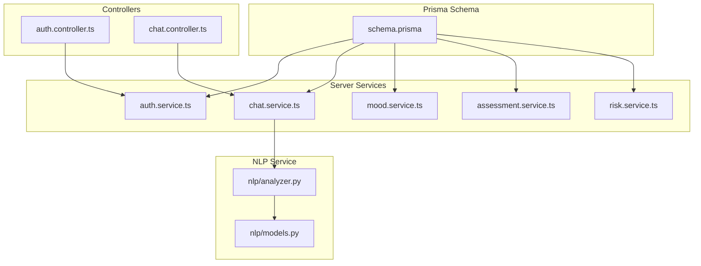
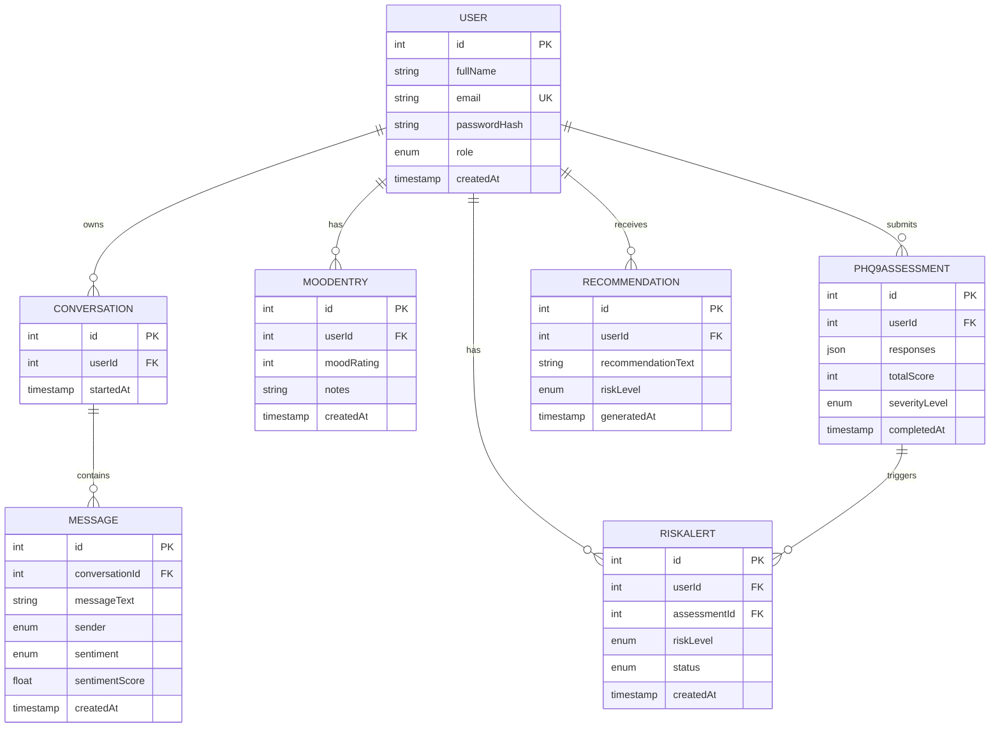
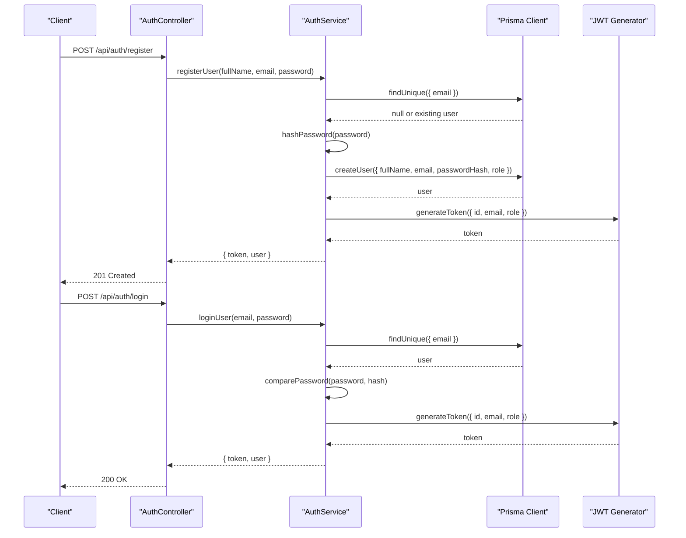
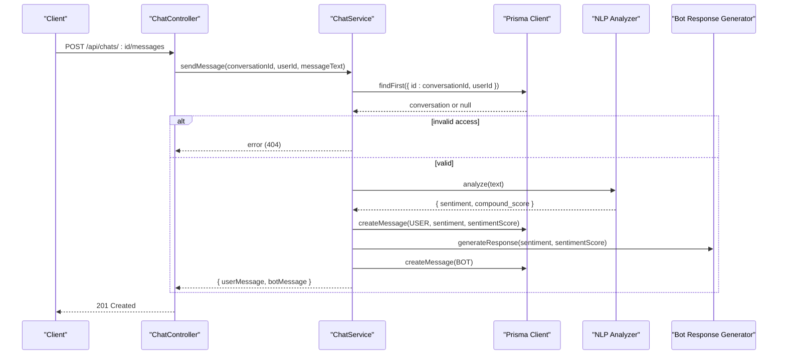
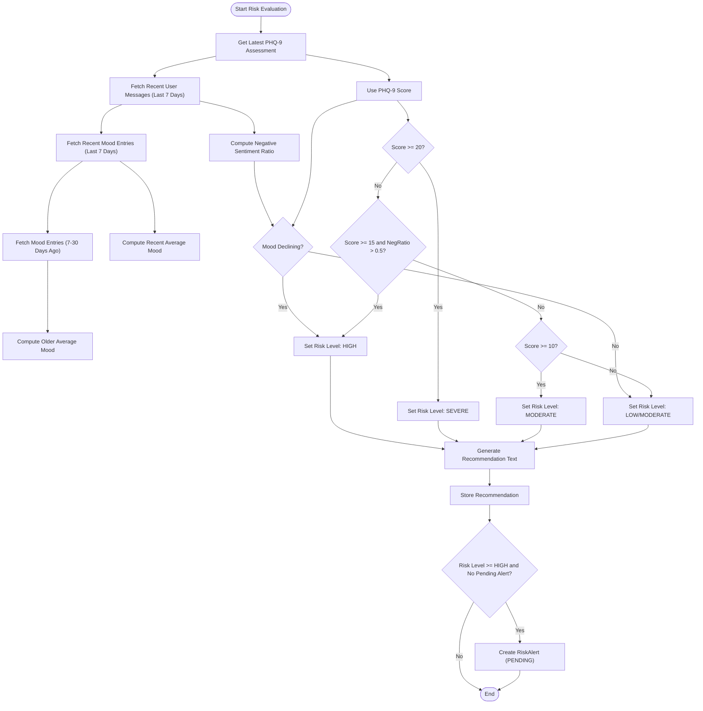
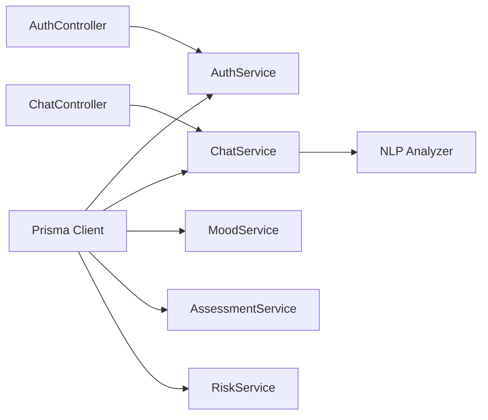

# Data Models

<cite>
**Referenced Files in This Document**
- [schema.prisma](file://prisma/schema.prisma)
- [auth.service.ts](file://server/src/services/auth.service.ts)
- [chat.service.ts](file://server/src/services/chat.service.ts)
- [mood.service.ts](file://server/src/services/mood.service.ts)
- [assessment.service.ts](file://server/src/services/assessment.service.ts)
- [risk.service.ts](file://server/src/services/risk.service.ts)
- [analyzer.py](file://nlp-service/nlp/analyzer.py)
- [models.py](file://nlp-service/models.py)
- [auth.controller.ts](file://server/src/controllers/auth.controller.ts)
- [chat.controller.ts](file://server/src/controllers/chat.controller.ts)
</cite>

## Table of Contents
1. [Introduction](#introduction)
2. [Project Structure](#project-structure)
3. [Core Components](#core-components)
4. [Architecture Overview](#architecture-overview)
5. [Detailed Component Analysis](#detailed-component-analysis)
6. [Dependency Analysis](#dependency-analysis)
7. [Performance Considerations](#performance-considerations)
8. [Troubleshooting Guide](#troubleshooting-guide)
9. [Conclusion](#conclusion)

## Introduction
This document provides comprehensive data model documentation for the BuddyAI database schema. It focuses on the User, Conversation, Message, MoodEntry, Phq9Assessment, Recommendation, and RiskAlert models, detailing field definitions, data types, constraints, defaults, validations, and business rules. Enum types (Role, Sentiment, Sender, SeverityLevel, RiskLevel, AlertStatus) are documented with their usage patterns across the schema.

## Project Structure
The data models are defined in the Prisma schema and enforced by the backend services and controllers. The NLP service provides sentiment analysis used by the messaging pipeline.

**Diagram sources**
- [schema.prisma:1-134](file://prisma/schema.prisma#L1-L134)
- [auth.service.ts:1-72](file://server/src/services/auth.service.ts#L1-L72)
- [chat.service.ts:1-105](file://server/src/services/chat.service.ts#L1-L105)
- [mood.service.ts:1-58](file://server/src/services/mood.service.ts#L1-L58)
- [assessment.service.ts:1-89](file://server/src/services/assessment.service.ts#L1-L89)
- [risk.service.ts:1-138](file://server/src/services/risk.service.ts#L1-L138)
- [auth.controller.ts:1-50](file://server/src/controllers/auth.controller.ts#L1-L50)
- [chat.controller.ts:1-69](file://server/src/controllers/chat.controller.ts#L1-L69)
- [analyzer.py:1-27](file://nlp-service/nlp/analyzer.py#L1-L27)
- [models.py:1-26](file://nlp-service/models.py#L1-L26)

**Section sources**
- [schema.prisma:1-134](file://prisma/schema.prisma#L1-L134)
- [auth.service.ts:1-72](file://server/src/services/auth.service.ts#L1-L72)
- [chat.service.ts:1-105](file://server/src/services/chat.service.ts#L1-L105)
- [mood.service.ts:1-58](file://server/src/services/mood.service.ts#L1-L58)
- [assessment.service.ts:1-89](file://server/src/services/assessment.service.ts#L1-L89)
- [risk.service.ts:1-138](file://server/src/services/risk.service.ts#L1-L138)
- [auth.controller.ts:1-50](file://server/src/controllers/auth.controller.ts#L1-L50)
- [chat.controller.ts:1-69](file://server/src/controllers/chat.controller.ts#L1-L69)
- [analyzer.py:1-27](file://nlp-service/nlp/analyzer.py#L1-L27)
- [models.py:1-26](file://nlp-service/models.py#L1-L26)

## Core Components
This section documents each model with its primary keys, unique constraints, defaults, validation rules, and business logic constraints.

### User Model
- Purpose: Stores user account information and role for authentication and authorization.
- Fields:
  - id: Integer, auto-incremented primary key.
  - fullName: String, required.
  - email: String, required, unique.
  - passwordHash: String, required.
  - role: Enum Role, default STUDENT.
  - createdAt: DateTime, default now().
- Constraints and Defaults:
  - Unique constraint on email.
  - Default role STUDENT.
  - Default createdAt now().
- Business Rules:
  - Authentication requires unique email and hashed password verification.
  - Role determines access to features (student vs counsellor).
- Validation:
  - Registration enforces presence of fullName, email, password.
  - Login validates credentials against stored hash.

**Section sources**
- [schema.prisma:47-61](file://prisma/schema.prisma#L47-L61)
- [auth.service.ts:5-33](file://server/src/services/auth.service.ts#L5-L33)
- [auth.controller.ts:5-19](file://server/src/controllers/auth.controller.ts#L5-L19)

### Conversation Model
- Purpose: Represents a chat session initiated by a user.
- Fields:
  - id: Integer, auto-incremented primary key.
  - userId: Integer, foreign key to User.
  - startedAt: DateTime, default now().
- Constraints and Defaults:
  - Default startedAt now().
- Business Rules:
  - Conversations belong to a single user; access is validated by userId.
  - Messages are grouped under a conversation.
- Validation:
  - Creation requires authenticated user.
  - Retrieval filters by userId.

**Section sources**
- [schema.prisma:63-71](file://prisma/schema.prisma#L63-L71)
- [chat.service.ts:26-43](file://server/src/services/chat.service.ts#L26-L43)
- [chat.controller.ts:5-31](file://server/src/controllers/chat.controller.ts#L5-L31)

### Message Model
- Purpose: Stores individual messages exchanged in a conversation, including sentiment analysis.
- Fields:
  - id: Integer, auto-incremented primary key.
  - conversationId: Integer, foreign key to Conversation.
  - messageText: String, required.
  - sender: Enum Sender, required (USER or BOT).
  - sentiment: Enum Sentiment, nullable.
  - sentimentScore: Float, nullable.
  - createdAt: DateTime, default now().
- Constraints and Defaults:
  - Default createdAt now().
  - sentiment and sentimentScore are nullable to handle NLP failures.
- Business Rules:
  - Messages are owned by a conversation; access is validated by conversationId and userId.
  - Sentiment is derived from NLP service; fallback to neutral if unavailable.
  - Bot generates contextual responses based on sentiment.
- Validation:
  - sendMessage requires non-empty messageText.
  - Access checks ensure conversation belongs to the requesting user.

**Section sources**
- [schema.prisma:73-84](file://prisma/schema.prisma#L73-L84)
- [chat.service.ts:45-89](file://server/src/services/chat.service.ts#L45-L89)
- [chat.controller.ts:33-53](file://server/src/controllers/chat.controller.ts#L33-L53)
- [analyzer.py:8-27](file://nlp-service/nlp/analyzer.py#L8-L27)
- [models.py:4-21](file://nlp-service/models.py#L4-L21)

### MoodEntry Model
- Purpose: Records daily mood ratings and optional notes.
- Fields:
  - id: Integer, auto-incremented primary key.
  - userId: Integer, foreign key to User.
  - moodRating: Integer, required.
  - notes: String, nullable.
  - createdAt: DateTime, default now().
- Constraints and Defaults:
  - Default createdAt now().
- Business Rules:
  - Mood entries are associated with a user.
  - Trends are computed by comparing recent vs older averages.
- Validation:
  - Rating is persisted as-is; business logic computes averages and trends.

**Section sources**
- [schema.prisma:86-95](file://prisma/schema.prisma#L86-L95)
- [mood.service.ts:3-20](file://server/src/services/mood.service.ts#L3-L20)

### Phq9Assessment Model
- Purpose: Stores PHQ-9 responses, calculated total score, and severity level.
- Fields:
  - id: Integer, auto-incremented primary key.
  - userId: Integer, foreign key to User.
  - responses: Json, required.
  - totalScore: Integer, required.
  - severityLevel: Enum SeverityLevel, required.
  - completedAt: DateTime, default now().
  - riskAlerts: Relation to RiskAlert.
- Constraints and Defaults:
  - Default completedAt now().
- Business Rules:
  - Total score is computed by summing responses.
  - Severity level is derived from score thresholds.
  - Links to RiskAlerts for risk tracking.
- Validation:
  - Responses are aggregated to compute total score and severity.

**Section sources**
- [schema.prisma:97-108](file://prisma/schema.prisma#L97-L108)
- [assessment.service.ts:20-33](file://server/src/services/assessment.service.ts#L20-L33)

### Recommendation Model
- Purpose: Stores risk-based recommendations generated for users.
- Fields:
  - id: Integer, auto-incremented primary key.
  - userId: Integer, foreign key to User.
  - recommendationText: String, required.
  - riskLevel: Enum RiskLevel, required.
  - generatedAt: DateTime, default now().
- Constraints and Defaults:
  - Default generatedAt now().
- Business Rules:
  - Recommendations are generated from assessment severity or risk evaluation.
  - Risk level influences alert creation and content.
- Validation:
  - Recommendation text is built based on severity or risk level.

**Section sources**
- [schema.prisma:110-119](file://prisma/schema.prisma#L110-L119)
- [assessment.service.ts:76-88](file://server/src/services/assessment.service.ts#L76-L88)
- [risk.service.ts:79-85](file://server/src/services/risk.service.ts#L79-L85)

### RiskAlert Model
- Purpose: Tracks risk alerts for users, linked to assessments.
- Fields:
  - id: Integer, auto-incremented primary key.
  - userId: Integer, foreign key to User.
  - assessmentId: Integer, foreign key to Phq9Assessment.
  - riskLevel: Enum RiskLevel, required.
  - status: Enum AlertStatus, default PENDING.
  - createdAt: DateTime, default now().
- Constraints and Defaults:
  - Default status PENDING.
  - Default createdAt now().
- Business Rules:
  - Alerts are created for HIGH or SEVERE risk levels.
  - Prevents duplicate pending alerts for the same assessment.
  - Counsellors review and update alert status.
- Validation:
  - Only created when risk evaluation meets threshold.
  - Status transitions handled by business logic.

**Section sources**
- [schema.prisma:121-133](file://prisma/schema.prisma#L121-L133)
- [risk.service.ts:87-104](file://server/src/services/risk.service.ts#L87-L104)

## Architecture Overview
The data models form a cohesive schema with explicit relations and enums. Services orchestrate business logic, while controllers enforce request validation and authentication.

**Diagram sources**
- [schema.prisma:47-133](file://prisma/schema.prisma#L47-L133)

## Detailed Component Analysis

### Enum Types and Usage Patterns
- Role: STUDENT, COUNSELLOR. Used on User.role; default STUDENT during registration.
- Sentiment: POSITIVE, NEUTRAL, NEGATIVE. Stored on Message.sentiment; nullable to handle NLP failures.
- Sender: USER, BOT. Indicates origin of Message.
- SeverityLevel: MINIMAL, MILD, MODERATE, MODERATELY_SEVERE, SEVERE. Derived from PHQ-9 total score.
- RiskLevel: LOW, MODERATE, HIGH, SEVERE. Generated from severity or risk evaluation.
- AlertStatus: PENDING, REVIEWED, RESOLVED. Tracks RiskAlert lifecycle.

**Section sources**
- [schema.prisma:10-45](file://prisma/schema.prisma#L10-L45)
- [assessment.service.ts:12-18](file://server/src/services/assessment.service.ts#L12-L18)
- [risk.service.ts:56-73](file://server/src/services/risk.service.ts#L56-L73)

### User Authentication Flow

**Diagram sources**
- [auth.controller.ts:5-35](file://server/src/controllers/auth.controller.ts#L5-L35)
- [auth.service.ts:5-59](file://server/src/services/auth.service.ts#L5-L59)

### Chat and Sentiment Analysis Flow

**Diagram sources**
- [chat.controller.ts:33-53](file://server/src/controllers/chat.controller.ts#L33-L53)
- [chat.service.ts:45-89](file://server/src/services/chat.service.ts#L45-L89)
- [analyzer.py:8-27](file://nlp-service/nlp/analyzer.py#L8-L27)

### Risk Evaluation and Alert Generation

**Diagram sources**
- [risk.service.ts:11-107](file://server/src/services/risk.service.ts#L11-L107)

## Dependency Analysis
- Prisma schema defines models and relations; services depend on Prisma client for persistence.
- Controllers depend on services for business logic and enforce request validation and authentication.
- NLP service integrates with chat service to enrich messages with sentiment.

**Diagram sources**
- [schema.prisma:1-134](file://prisma/schema.prisma#L1-L134)
- [auth.service.ts:1-72](file://server/src/services/auth.service.ts#L1-L72)
- [chat.service.ts:1-105](file://server/src/services/chat.service.ts#L1-L105)
- [mood.service.ts:1-58](file://server/src/services/mood.service.ts#L1-L58)
- [assessment.service.ts:1-89](file://server/src/services/assessment.service.ts#L1-L89)
- [risk.service.ts:1-138](file://server/src/services/risk.service.ts#L1-L138)
- [auth.controller.ts:1-50](file://server/src/controllers/auth.controller.ts#L1-L50)
- [chat.controller.ts:1-69](file://server/src/controllers/chat.controller.ts#L1-L69)
- [analyzer.py:1-27](file://nlp-service/nlp/analyzer.py#L1-L27)

**Section sources**
- [schema.prisma:1-134](file://prisma/schema.prisma#L1-L134)
- [auth.service.ts:1-72](file://server/src/services/auth.service.ts#L1-L72)
- [chat.service.ts:1-105](file://server/src/services/chat.service.ts#L1-L105)
- [mood.service.ts:1-58](file://server/src/services/mood.service.ts#L1-L58)
- [assessment.service.ts:1-89](file://server/src/services/assessment.service.ts#L1-L89)
- [risk.service.ts:1-138](file://server/src/services/risk.service.ts#L1-L138)
- [auth.controller.ts:1-50](file://server/src/controllers/auth.controller.ts#L1-L50)
- [chat.controller.ts:1-69](file://server/src/controllers/chat.controller.ts#L1-L69)
- [analyzer.py:1-27](file://nlp-service/nlp/analyzer.py#L1-L27)

## Performance Considerations
- Indexes: Email on User, userId on Conversation, conversationId on Message, userId on MoodEntry, userId on Phq9Assessment, userId and assessmentId on RiskAlert improve query performance.
- Defaults: createdAt/completedAt/generatedAt defaults reduce write overhead.
- NLP latency: Sentiment analysis is optional; fallback to neutral ensures resilience.
- Aggregations: Risk evaluation and trends compute averages over bounded windows to limit scan cost.

[No sources needed since this section provides general guidance]

## Troubleshooting Guide
- Authentication errors:
  - Registration fails if email already exists; login fails if credentials are invalid.
  - Ensure fullName, email, and password are provided for registration; email and password for login.
- Chat access:
  - Conversation not found errors occur when accessing another user’s conversation.
  - messageText must be a non-empty string.
- NLP service:
  - If NLP is unavailable, sentiment remains null; chat continues with neutral fallback.
- Risk alerts:
  - Duplicate pending alerts are prevented for the same assessment.

**Section sources**
- [auth.service.ts:6-59](file://server/src/services/auth.service.ts#L6-L59)
- [auth.controller.ts:9-12](file://server/src/controllers/auth.controller.ts#L9-L12)
- [chat.service.ts:47-52](file://server/src/services/chat.service.ts#L47-L52)
- [chat.controller.ts:43-46](file://server/src/controllers/chat.controller.ts#L43-L46)
- [risk.service.ts:90-92](file://server/src/services/risk.service.ts#L90-L92)

## Conclusion
The BuddyAI data models provide a robust foundation for user management, conversational history, mood tracking, mental health assessments, risk evaluation, and alerting. Enums standardize categorical data, defaults simplify persistence, and service-layer logic enforces business rules and validations. The architecture balances reliability (NLP fallback), scalability (indexed relations), and clarity (explicit enums and defaults).