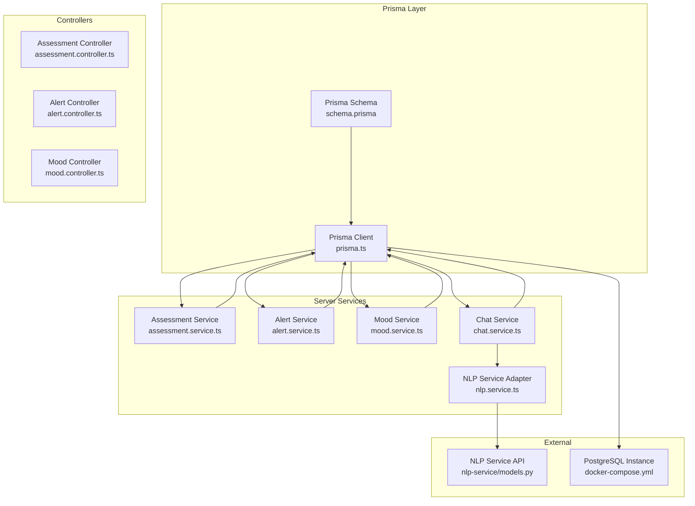
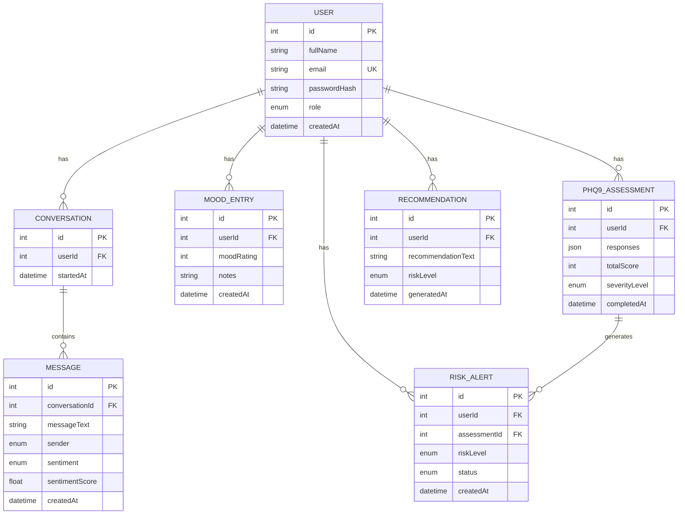
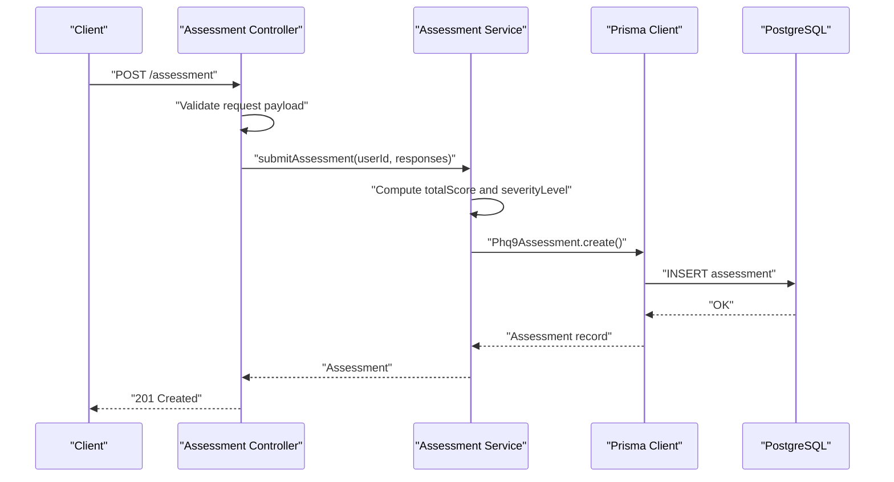
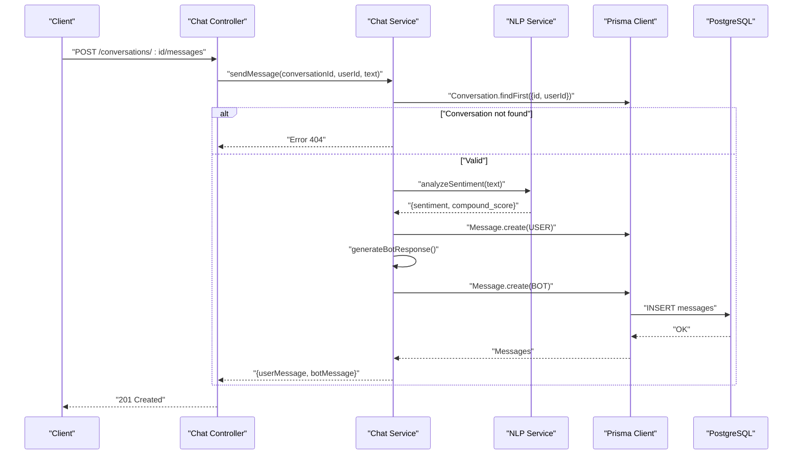
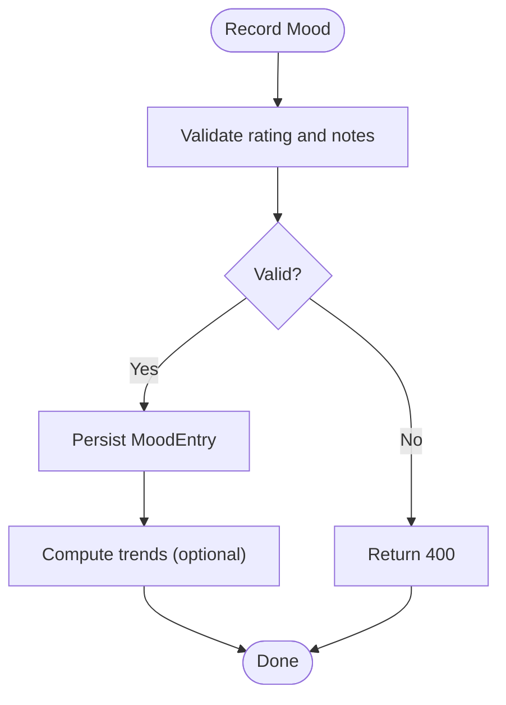
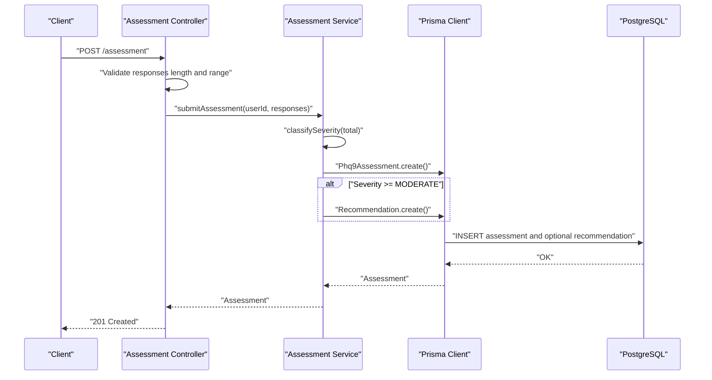
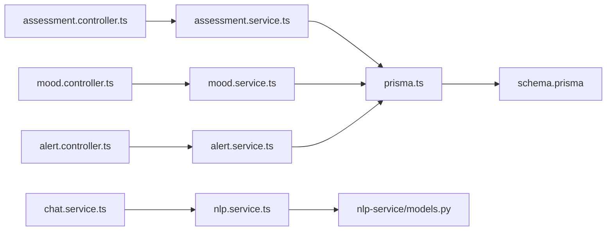

# Database Design

<cite>
**Referenced Files in This Document**
- [schema.prisma](file://prisma/schema.prisma)
- [prisma.ts](file://server/src/config/prisma.ts)
- [assessment.service.ts](file://server/src/services/assessment.service.ts)
- [alert.service.ts](file://server/src/services/alert.service.ts)
- [mood.service.ts](file://server/src/services/mood.service.ts)
- [chat.service.ts](file://server/src/services/chat.service.ts)
- [assessment.controller.ts](file://server/src/controllers/assessment.controller.ts)
- [alert.controller.ts](file://server/src/controllers/alert.controller.ts)
- [mood.controller.ts](file://server/src/controllers/mood.controller.ts)
- [nlp.service.ts](file://server/src/services/nlp.service.ts)
- [models.py](file://nlp-service/models.py)
- [docker-compose.yml](file://docker-compose.yml)
- [password.ts](file://server/src/utils/password.ts)
- [token.ts](file://server/src/utils/token.ts)
</cite>

## Update Summary
**Changes Made**
- Comprehensive database schema documentation with complete mental health support system design
- Added detailed coverage of all enum types: Role, Sentiment, Sender, SeverityLevel, RiskLevel, AlertStatus
- Enhanced entity-relationship model documentation with complete foreign key relationships
- Updated Prisma ORM configuration and migration management details
- Expanded data validation rules and business logic constraints
- Added security, privacy, and access control documentation
- Included performance considerations and troubleshooting guide

## Table of Contents
1. [Introduction](#introduction)
2. [Project Structure](#project-structure)
3. [Core Components](#core-components)
4. [Architecture Overview](#architecture-overview)
5. [Detailed Component Analysis](#detailed-component-analysis)
6. [Dependency Analysis](#dependency-analysis)
7. [Performance Considerations](#performance-considerations)
8. [Troubleshooting Guide](#troubleshooting-guide)
9. [Conclusion](#conclusion)
10. [Appendices](#appendices)

## Introduction
This document provides comprehensive data model documentation for the BuddyAI mental health tracking platform. It describes the relational schema, entity-relationship model, Prisma ORM configuration, and operational aspects such as migrations, seeding, validation rules, and access patterns. The focus is on Users, Conversations, Messages, Mood Entries, PHQ-9 Assessments, Recommendations, and Risk Alerts, with explicit attention to referential integrity, indexes, constraints, and security considerations.

## Project Structure
The database design is defined declaratively in Prisma and consumed by the backend services. The key elements are:
- Declarative schema defining models, enums, relations, and indexes
- Prisma client instantiation for database access
- Service-layer logic implementing business rules and validations
- Controllers enforcing request validation and role-based access
- Docker Compose provisioning a PostgreSQL instance

**Diagram sources**
- [schema.prisma:1-135](file://prisma/schema.prisma#L1-L135)
- [prisma.ts:1-6](file://server/src/config/prisma.ts#L1-L6)
- [assessment.service.ts:1-89](file://server/src/services/assessment.service.ts#L1-L89)
- [alert.service.ts:1-62](file://server/src/services/alert.service.ts#L1-L62)
- [mood.service.ts:1-58](file://server/src/services/mood.service.ts#L1-L58)
- [chat.service.ts:1-105](file://server/src/services/chat.service.ts#L1-L105)
- [nlp.service.ts:1-24](file://server/src/services/nlp.service.ts#L1-L24)
- [models.py:1-26](file://nlp-service/models.py#L1-L26)
- [docker-compose.yml:1-19](file://docker-compose.yml#L1-L19)

**Section sources**
- [schema.prisma:1-135](file://prisma/schema.prisma#L1-L135)
- [prisma.ts:1-6](file://server/src/config/prisma.ts#L1-L6)
- [docker-compose.yml:1-19](file://docker-compose.yml#L1-L19)

## Core Components
This section documents the relational schema and associated constraints, indexes, and relationships.

### Enum Types
The database defines six critical enum types that govern system behavior:

- **Role**: STUDENT, COUNSELLOR - User role-based access control
- **Sentiment**: POSITIVE, NEUTRAL, NEGATIVE - Message sentiment classification
- **Sender**: USER, BOT - Message origin identification
- **SeverityLevel**: MINIMAL, MILD, MODERATE, MODERATELY_SEVERE, SEVERE - PHQ-9 assessment severity
- **RiskLevel**: LOW, MODERATE, HIGH, SEVERE - Risk categorization for recommendations
- **AlertStatus**: PENDING, REVIEWED, RESOLVED - Risk alert lifecycle management

### Entity Definitions

#### Users
- **Fields**: id (autoincrement PK), fullName (String), email (String, unique), passwordHash (String), role (Role enum, default STUDENT), createdAt (DateTime, default now)
- **Indexes**: unique(email); implicit primary key index
- **Relationships**: one-to-many to Conversations, MoodEntries, Phq9Assessments, Recommendations, RiskAlerts

#### Conversations
- **Fields**: id (autoincrement PK), userId (Int), startedAt (DateTime, default now)
- **Foreign Keys**: userId references User(id)
- **Indexes**: userId
- **Relationships**: belongs to User; one-to-many to Messages

#### Messages
- **Fields**: id (autoincrement PK), conversationId (Int), messageText (String), sender (Sender enum), sentiment (Sentiment enum nullable), sentimentScore (Float nullable), createdAt (DateTime, default now)
- **Foreign Keys**: conversationId references Conversation(id)
- **Indexes**: conversationId
- **Relationships**: belongs to Conversation

#### Mood Entries
- **Fields**: id (autoincrement PK), userId (Int), moodRating (Int), notes (String nullable), createdAt (DateTime, default now)
- **Foreign Keys**: userId references User(id)
- **Indexes**: userId
- **Relationships**: belongs to User

#### PHQ-9 Assessments
- **Fields**: id (autoincrement PK), userId (Int), responses (Json), totalScore (Int), severityLevel (SeverityLevel enum), completedAt (DateTime, default now)
- **Foreign Keys**: userId references User(id)
- **Indexes**: userId
- **Relationships**: belongs to User; one-to-many to RiskAlerts

#### Recommendations
- **Fields**: id (autoincrement PK), userId (Int), recommendationText (String), riskLevel (RiskLevel enum), generatedAt (DateTime, default now)
- **Foreign Keys**: userId references User(id)
- **Indexes**: userId
- **Relationships**: belongs to User

#### Risk Alerts
- **Fields**: id (autoincrement PK), userId (Int), assessmentId (Int), riskLevel (RiskLevel enum), status (AlertStatus enum, default PENDING), createdAt (DateTime, default now)
- **Foreign Keys**: userId references User(id), assessmentId references Phq9Assessment(id)
- **Indexes**: userId, assessmentId
- **Relationships**: belongs to User; belongs to Phq9Assessment

**Diagram sources**
- [schema.prisma:11-46](file://prisma/schema.prisma#L11-L46)
- [schema.prisma:48-134](file://prisma/schema.prisma#L48-L134)

**Section sources**
- [schema.prisma:11-134](file://prisma/schema.prisma#L11-L134)

## Architecture Overview
The system follows a layered architecture:
- Prisma schema defines the canonical data model and enforces referential integrity
- Prisma client is injected into services for database operations
- Controllers validate requests and enforce authorization
- Services encapsulate business logic and data transformations
- NLP service integrates sentiment analysis for chat messages

**Diagram sources**
- [assessment.controller.ts:5-34](file://server/src/controllers/assessment.controller.ts#L5-L34)
- [assessment.service.ts:20-33](file://server/src/services/assessment.service.ts#L20-L33)
- [schema.prisma:98-109](file://prisma/schema.prisma#L98-L109)

## Detailed Component Analysis

### Users
- **Purpose**: Authentication and authorization backbone; role-based access control
- **Constraints**:
  - Email uniqueness enforced at schema level
  - Role defaults to STUDENT
  - Password hashes stored; raw passwords are never persisted
- **Access patterns**:
  - Controllers require authenticated user context
  - Tokens carry id, email, role for downstream checks

**Section sources**
- [schema.prisma:48-62](file://prisma/schema.prisma#L48-L62)
- [token.ts:4-16](file://server/src/utils/token.ts#L4-L16)
- [password.ts:1-12](file://server/src/utils/password.ts#L1-L12)

### Conversations and Messages
- **Purpose**: Chat history tracking with sentiment analysis
- **Constraints**:
  - Messages belong to a single Conversation
  - Optional sentiment and numeric sentimentScore derived from NLP
- **Business logic**:
  - Controllers verify ownership before allowing read/write
  - Services derive bot responses based on sentiment

**Diagram sources**
- [chat.service.ts:45-89](file://server/src/services/chat.service.ts#L45-L89)
- [nlp.service.ts:11-23](file://server/src/services/nlp.service.ts#L11-L23)
- [models.py:4-21](file://nlp-service/models.py#L4-L21)
- [schema.prisma:64-85](file://prisma/schema.prisma#L64-L85)

**Section sources**
- [chat.service.ts:1-105](file://server/src/services/chat.service.ts#L1-L105)
- [assessment.controller.ts:50-73](file://server/src/controllers/assessment.controller.ts#L50-L73)

### Mood Entries
- **Purpose**: Track daily mood ratings and trends
- **Validation**:
  - Rating is integer between 1 and 5
  - Notes optional string
- **Analytics**:
  - Services compute averages and trend direction over recent windows

**Diagram sources**
- [mood.controller.ts:5-34](file://server/src/controllers/mood.controller.ts#L5-L34)
- [mood.service.ts:3-20](file://server/src/services/mood.service.ts#L3-L20)

**Section sources**
- [mood.controller.ts:1-67](file://server/src/controllers/mood.controller.ts#L1-L67)
- [mood.service.ts:22-57](file://server/src/services/mood.service.ts#L22-L57)

### PHQ-9 Assessments and Risk Alerts
- **Purpose**: Depression screening, severity classification, risk mapping, and alerting
- **Validation**:
  - Exactly 9 items, each integer 0–3
  - Severity mapped from total score
- **Recommendations**:
  - Automatic generation for moderate/severe cases
- **Alerts**:
  - Status lifecycle: PENDING → REVIEWED → RESOLVED
  - Counsellors can update status and view summaries

**Diagram sources**
- [assessment.controller.ts:5-34](file://server/src/controllers/assessment.controller.ts#L5-L34)
- [assessment.service.ts:12-33](file://server/src/services/assessment.service.ts#L12-L33)
- [assessment.service.ts:48-88](file://server/src/services/assessment.service.ts#L48-L88)
- [schema.prisma:98-119](file://prisma/schema.prisma#L98-L119)

**Section sources**
- [assessment.controller.ts:1-74](file://server/src/controllers/assessment.controller.ts#L1-L74)
- [assessment.service.ts:1-89](file://server/src/services/assessment.service.ts#L1-L89)
- [alert.controller.ts:1-70](file://server/src/controllers/alert.controller.ts#L1-L70)
- [alert.service.ts:1-62](file://server/src/services/alert.service.ts#L1-L62)

## Dependency Analysis
- **Internal dependencies**:
  - Controllers depend on services for business logic
  - Services depend on Prisma client for persistence
  - Chat service depends on NLP service adapter
- **External dependencies**:
  - PostgreSQL via Prisma client
  - NLP microservice via HTTP API

**Diagram sources**
- [assessment.controller.ts:1-74](file://server/src/controllers/assessment.controller.ts#L1-L74)
- [assessment.service.ts:1-89](file://server/src/services/assessment.service.ts#L1-L89)
- [mood.controller.ts:1-67](file://server/src/controllers/mood.controller.ts#L1-L67)
- [mood.service.ts:1-58](file://server/src/services/mood.service.ts#L1-L58)
- [alert.controller.ts:1-70](file://server/src/controllers/alert.controller.ts#L1-L70)
- [alert.service.ts:1-62](file://server/src/services/alert.service.ts#L1-L62)
- [chat.service.ts:1-105](file://server/src/services/chat.service.ts#L1-L105)
- [nlp.service.ts:1-24](file://server/src/services/nlp.service.ts#L1-L24)
- [models.py:1-26](file://nlp-service/models.py#L1-L26)
- [prisma.ts:1-6](file://server/src/config/prisma.ts#L1-L6)
- [schema.prisma:1-135](file://prisma/schema.prisma#L1-L135)

**Section sources**
- [prisma.ts:1-6](file://server/src/config/prisma.ts#L1-L6)
- [schema.prisma:1-135](file://prisma/schema.prisma#L1-L135)

## Performance Considerations
- **Indexes**
  - Unique index on User.email supports fast lookups and prevents duplicates
  - Non-unique indexes on foreign keys (Conversation.userId, Message.conversationId, MoodEntry.userId, RiskAlert.userId, RiskAlert.assessmentId) optimize joins and filtering
- **Query patterns**
  - Prefer filtered queries with orderBy and take to limit result sets (e.g., recent entries, last assessment)
  - Use include/select to avoid loading unnecessary fields
- **Data types**
  - Json for PHQ-9 responses enables flexible storage; consider validating shape at service boundary
  - Float for sentimentScore allows fine-grained scoring
- **Caching and retries**
  - NLP service failures are handled gracefully; consider retry/backoff for resilience
- **Concurrency**
  - Use Prisma transactions for multi-step operations requiring atomicity (e.g., creating conversation and initial messages)

## Troubleshooting Guide
- **Authentication errors**
  - Controllers return 401 when req.user is missing; ensure JWT middleware runs before controllers
- **Authorization errors**
  - Chat service validates ownership of conversations; 404 is returned if mismatch
- **Validation errors**
  - Assessment controller validates responses length and value range; 400 is returned for invalid input
  - Mood controller validates rating range and notes type; 400 is returned for invalid input
- **NLP service unavailability**
  - Chat service logs and continues without sentiment; monitor NLP service health
- **Database connectivity**
  - Ensure DATABASE_URL is set and PostgreSQL is reachable; Docker Compose provisions a local instance

**Section sources**
- [assessment.controller.ts:7-21](file://server/src/controllers/assessment.controller.ts#L7-L21)
- [mood.controller.ts:14-27](file://server/src/controllers/mood.controller.ts#L14-L27)
- [chat.service.ts:47-52](file://server/src/services/chat.service.ts#L47-L52)
- [nlp.service.ts:18-20](file://server/src/services/nlp.service.ts#L18-L20)
- [docker-compose.yml:8-13](file://docker-compose.yml#L8-L13)

## Conclusion
The BuddyAI database design centers on a clean relational model with strong referential integrity and deliberate indexes. Prisma provides a robust ORM layer, while services encapsulate domain logic and validations. The schema supports core mental health tracking workflows: mood logging, conversational sentiment analysis, structured PHQ-9 assessments, automated risk alerting, and counselor recommendations. Security is addressed through role-based access, token-based authentication, and secure password hashing.

## Appendices

### Prisma ORM Configuration and Migration Management
- **Provider**: PostgreSQL
- **Client generation**: prisma-client-js
- **Environment-driven connection**: DATABASE_URL
- **Migration management**: Use Prisma CLI to generate and apply migrations against the configured datasource

**Section sources**
- [schema.prisma:1-9](file://prisma/schema.prisma#L1-L9)
- [prisma.ts:1-6](file://server/src/config/prisma.ts#L1-L6)

### Data Seeding Strategies
- **Seed scripts**: Create seed files to populate initial roles, default users, and static reference data
- **PHQ-9 baseline**: Seed representative severity categories and risk thresholds
- **Chat samples**: Add sample conversations and messages for testing
- **NLP integration**: Ensure NLP service availability during seeding to enrich sentiment fields

### Data Validation Rules and Business Logic Constraints
- **PHQ-9**
  - Exactly 9 integer responses, each 0–3
  - Severity computed from total score
  - Recommendations generated for MODERATE and above
- **Mood Entries**
  - Rating 1–5 inclusive
  - Notes optional string
- **Messages**
  - Ownership verified per conversation
  - Sentiment and score derived from NLP; fallback to neutral if unavailable
- **Risk Alerts**
  - Status lifecycle enforced by controller validation

**Section sources**
- [assessment.controller.ts:14-21](file://server/src/controllers/assessment.controller.ts#L14-L21)
- [assessment.service.ts:12-18](file://server/src/services/assessment.service.ts#L12-L18)
- [assessment.service.ts:48-61](file://server/src/services/assessment.service.ts#L48-L61)
- [mood.controller.ts:19-22](file://server/src/controllers/mood.controller.ts#L19-L22)
- [chat.service.ts:58-65](file://server/src/services/chat.service.ts#L58-L65)
- [alert.controller.ts:37-40](file://server/src/controllers/alert.controller.ts#L37-L40)

### Data Access Patterns and Query Optimization
- Use targeted includes/selects to minimize payload size
- Apply orderBy and take for paginated views (e.g., recent mood entries, conversation previews)
- Filter by userId to enforce tenant isolation
- Leverage existing indexes on foreign keys and unique fields

**Section sources**
- [alert.service.ts:8-15](file://server/src/services/alert.service.ts#L8-L15)
- [mood.service.ts:9-20](file://server/src/services/mood.service.ts#L9-L20)
- [chat.service.ts:32-43](file://server/src/services/chat.service.ts#L32-L43)

### Security, Privacy, and Access Control
- **Authentication**: JWT tokens with id, email, role
- **Authorization**: Controllers check user identity and resource ownership
- **Secrets**: DATABASE_URL and JWT secret managed via environment
- **Data protection**: Passwords hashed with bcrypt; sensitive fields excluded from responses

**Section sources**
- [token.ts:4-16](file://server/src/utils/token.ts#L4-L16)
- [password.ts:1-12](file://server/src/utils/password.ts#L1-L12)
- [docker-compose.yml:8-11](file://docker-compose.yml#L8-L11)

### Backup, Disaster Recovery, and Audit Trail
- **Backups**: Schedule regular logical backups of the PostgreSQL volume
- **Disaster recovery**: Restore from backups and reattach named volume; validate Prisma client connectivity
- **Audit trail**: Consider adding audit logs for sensitive operations (e.g., alert status updates, assessment creation)