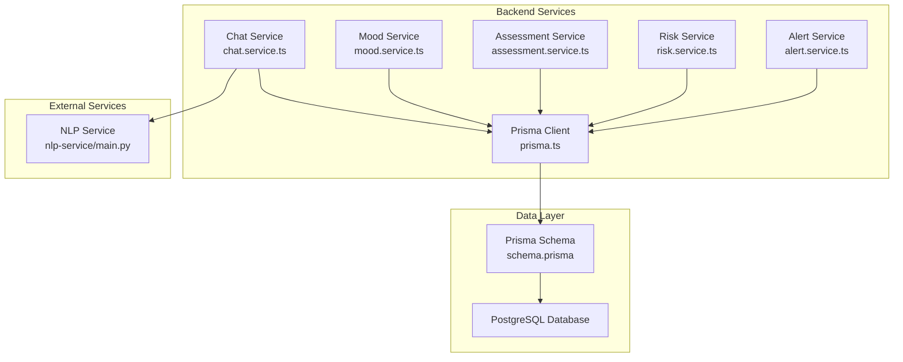
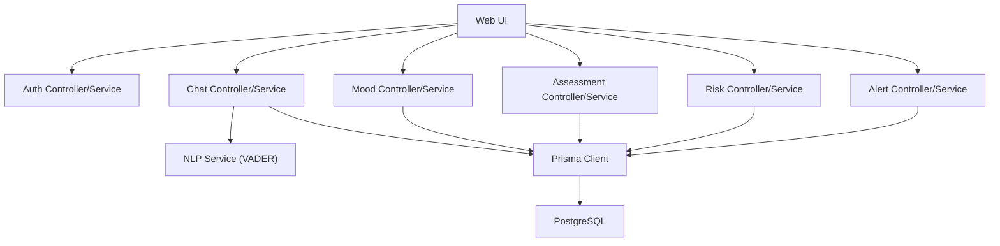
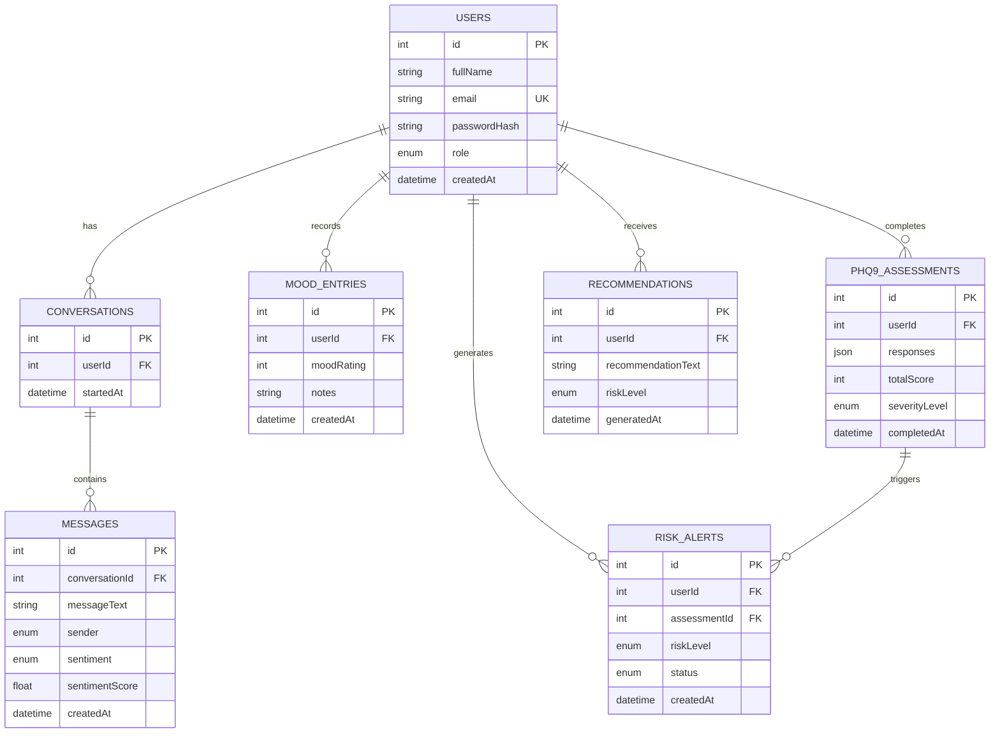
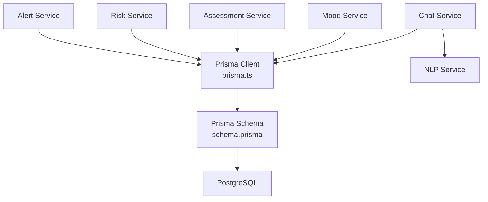

# Entity Relationships

<cite>
**Referenced Files in This Document**
- [schema.prisma](file://prisma/schema.prisma)
- [chat.service.ts](file://server/src/services/chat.service.ts)
- [mood.service.ts](file://server/src/services/mood.service.ts)
- [assessment.service.ts](file://server/src/services/assessment.service.ts)
- [risk.service.ts](file://server/src/services/risk.service.ts)
- [alert.service.ts](file://server/src/services/alert.service.ts)
- [prisma.ts](file://server/src/config/prisma.ts)
- [docker-compose.yml](file://docker-compose.yml)
- [README.md](file://README.md)
</cite>

## Table of Contents
1. [Introduction](#introduction)
2. [Project Structure](#project-structure)
3. [Core Components](#core-components)
4. [Architecture Overview](#architecture-overview)
5. [Detailed Component Analysis](#detailed-component-analysis)
6. [Dependency Analysis](#dependency-analysis)
7. [Performance Considerations](#performance-considerations)
8. [Troubleshooting Guide](#troubleshooting-guide)
9. [Conclusion](#conclusion)

## Introduction
This document provides comprehensive entity relationship documentation for the BuddyAI database schema. It focuses on the relational model connecting Users, Conversations, Messages, Mood Entries, PHQ-9 Assessments, Recommendations, and Risk Alerts. The document details foreign key relationships, referential integrity constraints, cascade behaviors, cardinalities, and data consistency mechanisms. It also explains junction table patterns where applicable, outlines query patterns leveraging these relationships, and provides optimization strategies grounded in the repository’s Prisma schema and service-layer usage.

## Project Structure
The database schema is defined declaratively using Prisma ORM. The backend services orchestrate operations that enforce referential integrity and maintain data consistency. The NLP service provides sentiment analysis results consumed by the chat service to enrich Messages with sentiment metadata.

**Diagram sources**
- [schema.prisma](file://prisma/schema.prisma)
- [chat.service.ts](file://server/src/services/chat.service.ts)
- [mood.service.ts](file://server/src/services/mood.service.ts)
- [assessment.service.ts](file://server/src/services/assessment.service.ts)
- [risk.service.ts](file://server/src/services/risk.service.ts)
- [alert.service.ts](file://server/src/services/alert.service.ts)
- [prisma.ts](file://server/src/config/prisma.ts)
- [docker-compose.yml](file://docker-compose.yml)

**Section sources**
- [schema.prisma](file://prisma/schema.prisma)
- [prisma.ts](file://server/src/config/prisma.ts)
- [docker-compose.yml](file://docker-compose.yml)

## Core Components
This section maps the core entities and their relationships as defined in the Prisma schema, including foreign keys, indexes, and enums. It also summarizes how services interact with these entities to maintain referential integrity and enforce business rules.

- Users
  - Primary key: id
  - Relationships: one-to-many to Conversations, Mood Entries, Phq9Assessments, Recommendations, Risk Alerts
  - Index: email
- Conversations
  - Primary key: id
  - Foreign key: userId → Users.id
  - Relationships: one-to-many to Messages; many-to-one to Users
  - Index: userId
- Messages
  - Primary key: id
  - Foreign key: conversationId → Conversations.id
  - Attributes: messageText, sender, sentiment, sentimentScore, createdAt
  - Index: conversationId
- Mood Entries
  - Primary key: id
  - Foreign key: userId → Users.id
  - Attributes: moodRating, notes, createdAt
  - Index: userId
- PHQ-9 Assessments
  - Primary key: id
  - Foreign key: userId → Users.id
  - Attributes: responses (JSON), totalScore, severityLevel, completedAt
  - Relationships: one-to-many to Risk Alerts; many-to-one to Users
  - Index: userId
- Recommendations
  - Primary key: id
  - Foreign key: userId → Users.id
  - Attributes: recommendationText, riskLevel, generatedAt
  - Index: userId
- Risk Alerts
  - Primary key: id
  - Foreign keys: userId → Users.id, assessmentId → Phq9Assessments.id
  - Attributes: riskLevel, status, createdAt
  - Indexes: userId, assessmentId

Cardinalities:
- User → Conversation: one-to-many
- Conversation → Message: one-to-many
- User → MoodEntry: one-to-many
- User → Phq9Assessment: one-to-many
- User → Recommendation: one-to-many
- User → RiskAlert: one-to-many
- Phq9Assessment → RiskAlert: one-to-many (via assessmentId)

Constraints and indexes:
- Unique index on Users.email
- Indexes on foreign keys to optimize joins and lookups
- No explicit cascade behaviors are declared in the schema; defaults apply per Prisma/PostgreSQL behavior

**Section sources**
- [schema.prisma](file://prisma/schema.prisma)

## Architecture Overview
The system follows a layered architecture with clear separation between presentation, backend services, NLP analysis, and the data layer. The backend services use Prisma to access PostgreSQL, enforcing referential integrity and enabling efficient queries.

**Diagram sources**
- [README.md](file://README.md)
- [chat.service.ts](file://server/src/services/chat.service.ts)
- [mood.service.ts](file://server/src/services/mood.service.ts)
- [assessment.service.ts](file://server/src/services/assessment.service.ts)
- [risk.service.ts](file://server/src/services/risk.service.ts)
- [alert.service.ts](file://server/src/services/alert.service.ts)
- [prisma.ts](file://server/src/config/prisma.ts)

## Detailed Component Analysis

### ER Diagram and Relationship Definitions
The following ER diagram reflects the actual Prisma schema definitions and indexes present in the repository.

**Diagram sources**
- [schema.prisma](file://prisma/schema.prisma)

### Relationship Details and Cardinalities

- User → Conversation
  - Cardinality: one-to-many
  - FK: Conversations.userId → Users.id
  - Index: Conversations.userId
  - Notes: Users own multiple conversations; enforced by relation directive and index.

- Conversation → Message
  - Cardinality: one-to-many
  - FK: Messages.conversationId → Conversations.id
  - Index: Messages.conversationId
  - Notes: Messages belong to a single conversation; retrieval ordered by creation time.

- User → MoodEntry
  - Cardinality: one-to-many
  - FK: MoodEntries.userId → Users.id
  - Index: MoodEntries.userId
  - Notes: Users log multiple mood entries; retrieval sorted by creation time.

- User → Phq9Assessment
  - Cardinality: one-to-many
  - FK: Phq9Assessments.userId → Users.id
  - Index: Phq9Assessments.userId
  - Notes: Users complete multiple assessments; severity derived from total score.

- User → Recommendation
  - Cardinality: one-to-many
  - FK: Recommendations.userId → Users.id
  - Index: Recommendations.userId
  - Notes: Recommendations are generated per user; linked to assessments and risk evaluation.

- User → RiskAlert
  - Cardinality: one-to-many
  - FK: RiskAlerts.userId → Users.id
  - Index: RiskAlerts.userId
  - Notes: Alerts are associated with users; created when risk level is high or severe.

- Phq9Assessment → RiskAlert
  - Cardinality: one-to-many
  - FK: RiskAlerts.assessmentId → Phq9Assessments.id
  - Index: RiskAlerts.assessmentId
  - Notes: Alerts are triggered by specific assessments; prevents duplicates via service logic.

**Section sources**
- [schema.prisma](file://prisma/schema.prisma)

### Junction Table Patterns
There is no explicit junction table in the schema. Bidirectional relationships are modeled using foreign keys:
- RiskAlerts links Users and Phq9Assessments via separate foreign keys (userId and assessmentId), forming a many-to-one relationship from RiskAlerts to both Users and Phq9Assessments. This pattern avoids a dedicated junction table while preserving bidirectionality.

**Section sources**
- [schema.prisma](file://prisma/schema.prisma)

### Referential Integrity and Cascade Behaviors
- The Prisma schema does not declare explicit cascade behaviors for relations. Therefore, defaults apply:
  - Deleting a User without cascading deletes will fail if dependent records exist (e.g., Conversations, Assessments).
  - Deleting a Conversation will fail if Messages exist unless configured otherwise.
  - Deleting a Phq9Assessment may fail if RiskAlerts depend on it.
- To prevent orphaned data, services enforce ownership checks and avoid deleting parent records when children exist.

Evidence from services:
- Chat service verifies conversation ownership before retrieving messages.
- Risk service checks for existing pending alerts before creating new ones.
- Alert service includes related user and assessment data when listing alerts.

**Section sources**
- [chat.service.ts](file://server/src/services/chat.service.ts)
- [risk.service.ts](file://server/src/services/risk.service.ts)
- [alert.service.ts](file://server/src/services/alert.service.ts)
- [schema.prisma](file://prisma/schema.prisma)

### Data Consistency Mechanisms
- Unique constraint on Users.email ensures consistent identity.
- Indexes on foreign keys optimize join performance and reduce lookup latency.
- Service-layer validations:
  - Ownership verification for conversations and messages.
  - Prevention of duplicate pending alerts for the same assessment.
  - Aggregation of sentiment and mood data for risk evaluation.

**Section sources**
- [schema.prisma](file://prisma/schema.prisma)
- [chat.service.ts](file://server/src/services/chat.service.ts)
- [risk.service.ts](file://server/src/services/risk.service.ts)
- [alert.service.ts](file://server/src/services/alert.service.ts)

### Query Patterns Leveraging Relationships
Common query patterns observed in services:
- Retrieve user conversations with the latest message per conversation.
- Fetch all messages for a given conversation ordered by creation time.
- Get mood history with optional date-range filtering.
- List assessment history ordered by completion time.
- Evaluate risk using the latest assessment, recent messages, and mood trends.
- Generate recommendations based on severity and store them for the user.
- List risk alerts with included user and assessment details.

These patterns rely on:
- Foreign key joins (implicit via Prisma relations)
- Indexes on userId, conversationId, assessmentId
- Ordering by timestamps for chronological retrieval

**Section sources**
- [chat.service.ts](file://server/src/services/chat.service.ts)
- [mood.service.ts](file://server/src/services/mood.service.ts)
- [assessment.service.ts](file://server/src/services/assessment.service.ts)
- [risk.service.ts](file://server/src/services/risk.service.ts)
- [alert.service.ts](file://server/src/services/alert.service.ts)
- [schema.prisma](file://prisma/schema.prisma)

## Dependency Analysis
This section maps dependencies between services and the data layer, highlighting how Prisma client and PostgreSQL are used to maintain consistency.

**Diagram sources**
- [prisma.ts](file://server/src/config/prisma.ts)
- [schema.prisma](file://prisma/schema.prisma)
- [chat.service.ts](file://server/src/services/chat.service.ts)
- [mood.service.ts](file://server/src/services/mood.service.ts)
- [assessment.service.ts](file://server/src/services/assessment.service.ts)
- [risk.service.ts](file://server/src/services/risk.service.ts)
- [alert.service.ts](file://server/src/services/alert.service.ts)

**Section sources**
- [prisma.ts](file://server/src/config/prisma.ts)
- [schema.prisma](file://prisma/schema.prisma)
- [chat.service.ts](file://server/src/services/chat.service.ts)
- [mood.service.ts](file://server/src/services/mood.service.ts)
- [assessment.service.ts](file://server/src/services/assessment.service.ts)
- [risk.service.ts](file://server/src/services/risk.service.ts)
- [alert.service.ts](file://server/src/services/alert.service.ts)

## Performance Considerations
- Indexes
  - Ensure foreign-key indexes remain aligned with query patterns:
    - Conversations.userId for user-scoped conversations
    - Messages.conversationId for message retrieval
    - MoodEntries.userId for mood history
    - Phq9Assessments.userId for assessment history
    - RiskAlerts.userId and RiskAlerts.assessmentId for alert queries
- Joins and Includes
  - Services commonly include related entities (e.g., messages in conversations, user/assessment in alerts). Keep includes minimal and selective to reduce payload size.
- Pagination and Limits
  - Use take and skip for long lists (e.g., recent messages, mood entries, recommendations).
- Aggregations
  - Risk evaluation aggregates sentiment and mood data over time windows. Consider caching or materialized views if these queries become frequent and expensive.
- NLP Latency
  - The chat service calls the NLP service asynchronously. Ensure retries and timeouts are configured to handle transient failures gracefully.

[No sources needed since this section provides general guidance]

## Troubleshooting Guide
- Conversation Not Found
  - Symptom: Attempting to fetch messages for a conversation fails with a not-found error.
  - Cause: Ownership verification failed (conversation does not belong to the user).
  - Resolution: Confirm the user ID matches the conversation’s owner before querying messages.

- Duplicate Risk Alerts
  - Symptom: Multiple alerts created for the same assessment.
  - Cause: Missing duplicate prevention logic.
  - Resolution: Risk service checks for existing pending alerts before creating a new one.

- Sentiment Analysis Failures
  - Symptom: Messages stored without sentiment metadata.
  - Cause: NLP service unavailable or returned unexpected results.
  - Resolution: Chat service continues without sentiment when NLP is down; monitor NLP health endpoint.

- Constraint Violations
  - Symptom: Insert/update fails due to missing foreign keys or unique violations.
  - Cause: Missing parent records or duplicate emails.
  - Resolution: Validate existence of parent entities and uniqueness of identifiers before writes.

**Section sources**
- [chat.service.ts](file://server/src/services/chat.service.ts)
- [risk.service.ts](file://server/src/services/risk.service.ts)
- [alert.service.ts](file://server/src/services/alert.service.ts)
- [schema.prisma](file://prisma/schema.prisma)

## Conclusion
The BuddyAI database schema establishes a clear relational model centered on Users and their interactions captured through Conversations, Messages, Mood Entries, PHQ-9 Assessments, Recommendations, and Risk Alerts. The Prisma schema defines foreign keys, indexes, and enums that enforce referential integrity and enable efficient queries. Services implement ownership checks, deduplication, and aggregation to maintain data consistency and support risk evaluation. While no explicit cascade behaviors are declared, the service-layer safeguards prevent orphaned data and ensure robust operation under real-world usage patterns.