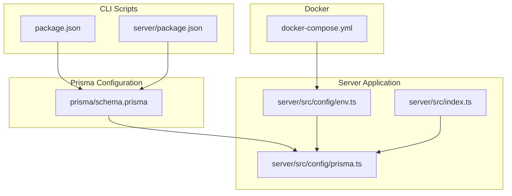
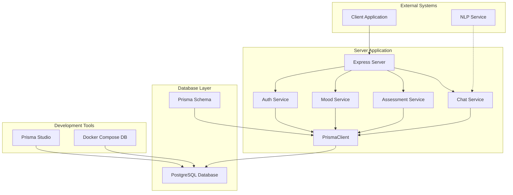
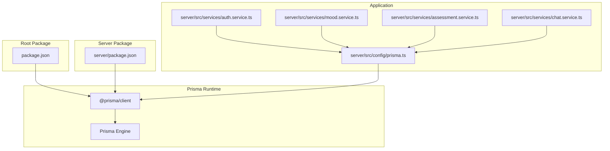

# Prisma ORM Configuration

<cite>
**Referenced Files in This Document**
- [schema.prisma](file://prisma/schema.prisma)
- [prisma.ts](file://server/src/config/prisma.ts)
- [env.ts](file://server/src/config/env.ts)
- [index.ts](file://server/src/index.ts)
- [package.json](file://package.json)
- [server/package.json](file://server/package.json)
- [docker-compose.yml](file://docker-compose.yml)
- [auth.service.ts](file://server/src/services/auth.service.ts)
- [mood.service.ts](file://server/src/services/mood.service.ts)
- [assessment.service.ts](file://server/src/services/assessment.service.ts)
- [chat.service.ts](file://server/src/services/chat.service.ts)
</cite>

## Table of Contents
1. [Introduction](#introduction)
2. [Project Structure](#project-structure)
3. [Core Components](#core-components)
4. [Architecture Overview](#architecture-overview)
5. [Detailed Component Analysis](#detailed-component-analysis)
6. [Dependency Analysis](#dependency-analysis)
7. [Performance Considerations](#performance-considerations)
8. [Troubleshooting Guide](#troubleshooting-guide)
9. [Conclusion](#conclusion)
10. [Appendices](#appendices)

## Introduction
This document provides comprehensive Prisma ORM configuration documentation for the BuddyAI project. It focuses on database client setup, connection management, Prisma-specific configurations, environment variable management, Prisma client initialization, connection pooling, transaction management, migration workflows, Prisma CLI commands, best practices for query optimization and error handling, and Prisma Studio usage for local development.

## Project Structure
The BuddyAI project organizes Prisma configuration and usage across three primary areas:
- Prisma schema definition under the prisma directory
- Prisma client initialization in the server application
- Environment configuration and Prisma CLI scripts in the root and server packages

**Diagram sources**
- [schema.prisma:1-134](file://prisma/schema.prisma#L1-L134)
- [prisma.ts:1-6](file://server/src/config/prisma.ts#L1-L6)
- [env.ts:1-12](file://server/src/config/env.ts#L1-L12)
- [index.ts:1-35](file://server/src/index.ts#L1-L35)
- [package.json:1-33](file://package.json#L1-L33)
- [server/package.json:1-36](file://server/package.json#L1-L36)
- [docker-compose.yml:1-19](file://docker-compose.yml#L1-L19)

**Section sources**
- [schema.prisma:1-134](file://prisma/schema.prisma#L1-L134)
- [prisma.ts:1-6](file://server/src/config/prisma.ts#L1-L6)
- [env.ts:1-12](file://server/src/config/env.ts#L1-L12)
- [index.ts:1-35](file://server/src/index.ts#L1-L35)
- [package.json:1-33](file://package.json#L1-L33)
- [server/package.json:1-36](file://server/package.json#L1-L36)
- [docker-compose.yml:1-19](file://docker-compose.yml#L1-L19)

## Core Components
This section documents the core Prisma components and their roles in the BuddyAI project.

- Prisma Schema Definition
  - Generator configuration for TypeScript client generation
  - Datasource configuration for PostgreSQL connection using DATABASE_URL
  - Enum definitions for Role, Sentiment, Sender, SeverityLevel, RiskLevel, and AlertStatus
  - Model definitions for User, Conversation, Message, MoodEntry, Phq9Assessment, Recommendation, and RiskAlert with relations and indexes

- Prisma Client Initialization
  - Centralized PrismaClient instantiation in the server application
  - Exported singleton for use across services

- Environment Variable Management
  - DATABASE_URL loaded via dotenv from the project root .env file
  - Other environment variables for JWT secret and NLP service URL

- Prisma CLI Commands
  - Migration creation and database synchronization
  - Client generation
  - Prisma Studio launch for local database inspection

**Section sources**
- [schema.prisma:1-134](file://prisma/schema.prisma#L1-L134)
- [prisma.ts:1-6](file://server/src/config/prisma.ts#L1-L6)
- [env.ts:1-12](file://server/src/config/env.ts#L1-L12)
- [package.json:5-18](file://package.json#L5-L18)

## Architecture Overview
The Prisma architecture integrates with the server application and external systems as follows:

**Diagram sources**
- [index.ts:1-35](file://server/src/index.ts#L1-L35)
- [auth.service.ts:1-72](file://server/src/services/auth.service.ts#L1-L72)
- [mood.service.ts:1-58](file://server/src/services/mood.service.ts#L1-L58)
- [assessment.service.ts:1-89](file://server/src/services/assessment.service.ts#L1-L89)
- [chat.service.ts:1-105](file://server/src/services/chat.service.ts#L1-L105)
- [prisma.ts:1-6](file://server/src/config/prisma.ts#L1-L6)
- [schema.prisma:1-134](file://prisma/schema.prisma#L1-L134)
- [docker-compose.yml:1-19](file://docker-compose.yml#L1-L19)

## Detailed Component Analysis

### Prisma Schema Configuration
The schema defines:
- Generator: TypeScript client generation for type-safe database operations
- Datasource: PostgreSQL provider with DATABASE_URL from environment
- Enums: Role, Sentiment, Sender, SeverityLevel, RiskLevel, AlertStatus
- Models: User, Conversation, Message, MoodEntry, Phq9Assessment, Recommendation, RiskAlert
- Relations: One-to-many and many-to-one relationships between models
- Indexes: Composite and single-column indexes for performance optimization

Key considerations:
- The schema uses autoincremented integer IDs for all models
- Unique constraints are applied to email in the User model
- Default values are set for timestamps and roles
- Enum fields enforce domain-specific values

**Section sources**
- [schema.prisma:1-134](file://prisma/schema.prisma#L1-L134)

### Prisma Client Initialization
The Prisma client is initialized as a singleton in the server application:
- Import from @prisma/client
- Instantiation using new PrismaClient()
- Export for global use across services

This pattern ensures a single client instance per process, simplifying connection lifecycle management.

**Section sources**
- [prisma.ts:1-6](file://server/src/config/prisma.ts#L1-L6)

### Environment Configuration
Environment variables are managed via dotenv:
- Load .env from project root
- Expose DATABASE_URL for Prisma datasource
- Provide defaults for JWT secret and NLP service URL
- Port configuration for the Express server

Best practices:
- Keep sensitive credentials in .env
- Provide sensible defaults for local development
- Avoid committing .env files to version control

**Section sources**
- [env.ts:1-12](file://server/src/config/env.ts#L1-L12)

### Service Layer Usage
Services demonstrate typical Prisma usage patterns:
- Authentication service: user registration, login, and retrieval
- Mood service: creating entries, fetching history, computing trends
- Assessment service: PHQ-9 scoring, severity classification, recommendation generation
- Chat service: conversation management, message sending with sentiment analysis

Each service imports the shared Prisma client and performs CRUD operations against the defined models.

**Section sources**
- [auth.service.ts:1-72](file://server/src/services/auth.service.ts#L1-L72)
- [mood.service.ts:1-58](file://server/src/services/mood.service.ts#L1-L58)
- [assessment.service.ts:1-89](file://server/src/services/assessment.service.ts#L1-L89)
- [chat.service.ts:1-105](file://server/src/services/chat.service.ts#L1-L105)

### Prisma CLI Workflows
The project includes convenient scripts for Prisma operations:
- Migration creation and database synchronization
- Client generation
- Prisma Studio launch for local inspection

These scripts streamline development workflows and ensure consistent Prisma usage across environments.

**Section sources**
- [package.json:15-17](file://package.json#L15-L17)

### Docker Database Setup
A PostgreSQL service is defined for local development:
- Uses postgres:16-alpine image
- Exposes port 5432
- Persists data using a named volume
- Configures user, password, and database name

This setup supports local Prisma migrations and development without manual database installation.

**Section sources**
- [docker-compose.yml:1-19](file://docker-compose.yml#L1-L19)

## Dependency Analysis
Prisma dependencies and relationships:

**Diagram sources**
- [package.json:20-26](file://package.json#L20-L26)
- [server/package.json:13-19](file://server/package.json#L13-L19)
- [prisma.ts:1-6](file://server/src/config/prisma.ts#L1-L6)
- [auth.service.ts:1-72](file://server/src/services/auth.service.ts#L1-L72)
- [mood.service.ts:1-58](file://server/src/services/mood.service.ts#L1-L58)
- [assessment.service.ts:1-89](file://server/src/services/assessment.service.ts#L1-L89)
- [chat.service.ts:1-105](file://server/src/services/chat.service.ts#L1-L105)

**Section sources**
- [package.json:20-26](file://package.json#L20-L26)
- [server/package.json:13-19](file://server/package.json#L13-L19)
- [prisma.ts:1-6](file://server/src/config/prisma.ts#L1-L6)

## Performance Considerations
- Connection Pooling
  - PrismaClient manages an internal connection pool by default
  - Configure pool settings via PrismaClient constructor options for production deployments
  - Monitor pool utilization and adjust max connections based on workload

- Query Optimization
  - Use selective field projections to minimize payload sizes
  - Apply appropriate filters and pagination for large datasets
  - Leverage indexes defined in the schema for frequent query patterns
  - Batch operations where possible to reduce round trips

- Transaction Management
  - Use Prisma transactions for multi-step operations requiring atomicity
  - Wrap related writes in transaction blocks to maintain consistency
  - Handle transaction errors gracefully and roll back on failures

- Error Handling
  - Implement centralized error handling middleware
  - Distinguish between application errors and database constraint violations
  - Log meaningful error context while avoiding sensitive data exposure

[No sources needed since this section provides general guidance]

## Troubleshooting Guide
Common Prisma issues and resolutions:

- Connection Issues
  - Verify DATABASE_URL format and accessibility
  - Ensure PostgreSQL service is running locally via Docker
  - Check network connectivity and firewall settings

- Migration Problems
  - Run prisma migrate dev to apply pending migrations
  - Use prisma migrate resolve to mark failed migrations as resolved
  - Revert migrations using prisma migrate dev --rollback when necessary

- Client Generation Failures
  - Run prisma generate after schema changes
  - Clear node_modules/.prisma and regenerate if TypeScript types are outdated

- Development Workflow
  - Use prisma studio for interactive database inspection during development
  - Validate schema changes before applying to production databases

**Section sources**
- [package.json:15-17](file://package.json#L15-L17)
- [docker-compose.yml:1-19](file://docker-compose.yml#L1-L19)

## Conclusion
The BuddyAI project implements a robust Prisma ORM configuration with clear separation of concerns between schema definition, client initialization, and service-layer usage. The setup supports local development with Docker, provides efficient query patterns through indexed models, and offers practical CLI workflows for migrations and database inspection. Following the best practices outlined here will help maintain a scalable and reliable data layer for the application.

[No sources needed since this section summarizes without analyzing specific files]

## Appendices

### Prisma CLI Command Reference
- Migration creation and sync: npm run db:migrate
- Client generation: npm run db:generate
- Launch Prisma Studio: npm run db:studio

**Section sources**
- [package.json:15-17](file://package.json#L15-L17)

### Environment Variables
- DATABASE_URL: PostgreSQL connection string
- PORT: Server listening port (default 3001)
- JWT_SECRET: Secret for JWT token signing
- NLP_SERVICE_URL: URL for NLP sentiment analysis service

**Section sources**
- [env.ts:6-11](file://server/src/config/env.ts#L6-L11)