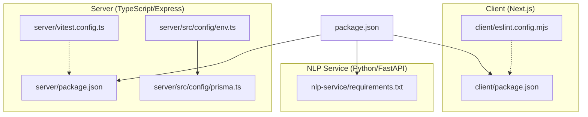
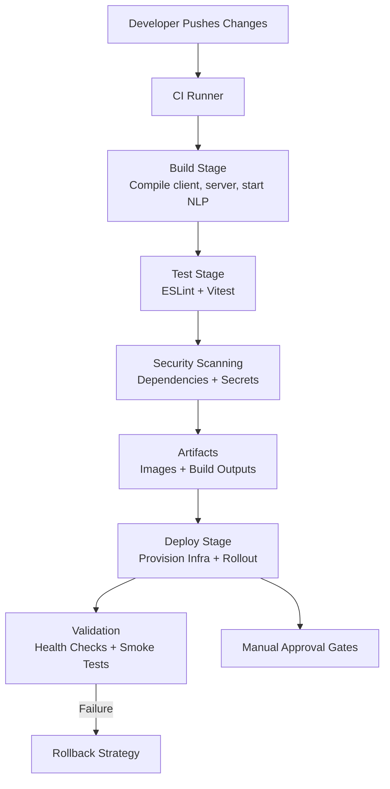
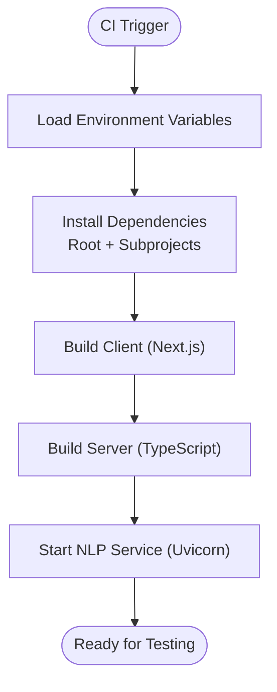
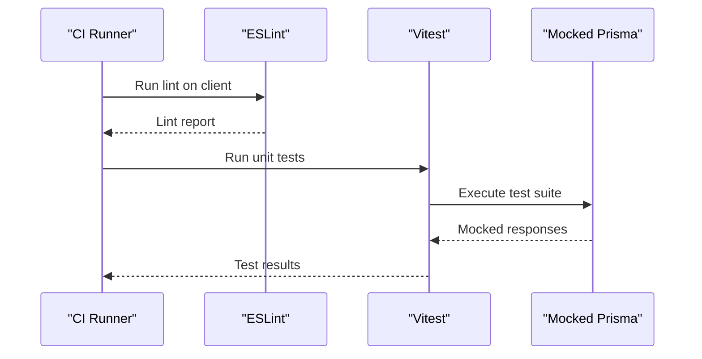
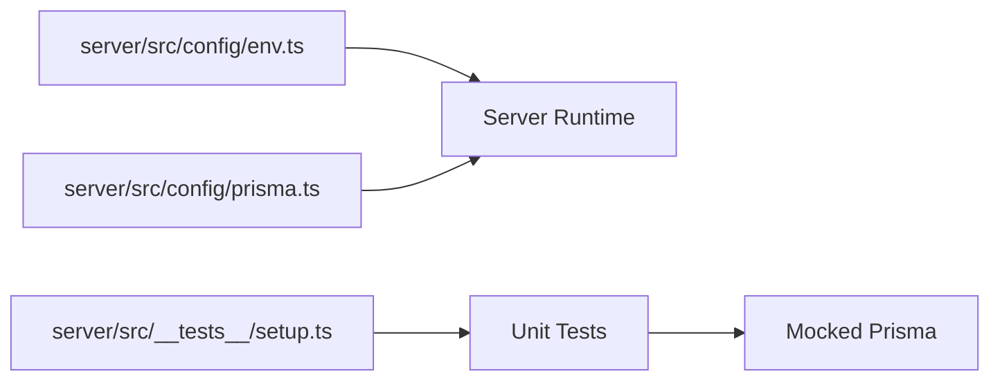

# CI/CD Pipelines and Automation

<cite>
**Referenced Files in This Document**
- [package.json](file://package.json)
- [client/package.json](file://client/package.json)
- [server/package.json](file://server/package.json)
- [docker-compose.yml](file://docker-compose.yml)
- [server/vitest.config.ts](file://server/vitest.config.ts)
- [client/eslint.config.mjs](file://client/eslint.config.mjs)
- [server/src/config/env.ts](file://server/src/config/env.ts)
- [server/src/config/prisma.ts](file://server/src/config/prisma.ts)
- [server/src/__tests__/assessment.test.ts](file://server/src/__tests__/assessment.test.ts)
- [server/src/__tests__/auth.test.ts](file://server/src/__tests__/auth.test.ts)
- [server/src/__tests__/setup.ts](file://server/src/__tests__/setup.ts)
- [nlp-service/requirements.txt](file://nlp-service/requirements.txt)
</cite>

## Table of Contents
1. [Introduction](#introduction)
2. [Project Structure](#project-structure)
3. [Core Components](#core-components)
4. [Architecture Overview](#architecture-overview)
5. [Detailed Component Analysis](#detailed-component-analysis)
6. [Dependency Analysis](#dependency-analysis)
7. [Performance Considerations](#performance-considerations)
8. [Troubleshooting Guide](#troubleshooting-guide)
9. [Conclusion](#conclusion)
10. [Appendices](#appendices)

## Introduction
This document provides a comprehensive guide to designing CI/CD pipelines and automation for the BuddyAI project. It focuses on continuous integration and deployment workflows, covering build processes, automated testing, artifact management, versioning, security scanning, deployment strategies, quality gates, and troubleshooting. The guidance is grounded in the repository’s current tooling and structure, including monorepo-style frontend/backend services, a Python NLP service, and a shared Postgres database via Docker Compose.

## Project Structure
The project follows a monorepo-like layout with three primary areas:
- Frontend (Next.js): client application under client/
- Backend (TypeScript/Express): server application under server/
- NLP Service (Python/FastAPI): nlp-service/
- Shared infrastructure: docker-compose.yml defines a Postgres database volume and container.

Key characteristics:
- Cross-service communication: The backend reads environment variables for service URLs and secrets.
- Testing framework: Vitest is configured for TypeScript unit tests in the backend.
- Linting: ESLint is configured for the Next.js client.
- Build scripts: Root-level scripts orchestrate multi-service development and production builds.

**Diagram sources**
- [package.json:1-33](file://package.json#L1-L33)
- [client/package.json:1-27](file://client/package.json#L1-L27)
- [server/package.json:1-36](file://server/package.json#L1-L36)
- [nlp-service/requirements.txt:1-6](file://nlp-service/requirements.txt#L1-L6)
- [server/vitest.config.ts:1-10](file://server/vitest.config.ts#L1-L10)
- [client/eslint.config.mjs:1-19](file://client/eslint.config.mjs#L1-L19)
- [server/src/config/env.ts:1-12](file://server/src/config/env.ts#L1-L12)
- [server/src/config/prisma.ts:1-6](file://server/src/config/prisma.ts#L1-L6)

**Section sources**
- [package.json:1-33](file://package.json#L1-L33)
- [client/package.json:1-27](file://client/package.json#L1-L27)
- [server/package.json:1-36](file://server/package.json#L1-L36)
- [nlp-service/requirements.txt:1-6](file://nlp-service/requirements.txt#L1-L6)
- [docker-compose.yml:1-19](file://docker-compose.yml#L1-L19)

## Core Components
- Root orchestration: The root package.json coordinates development and build commands across client, server, and NLP service.
- Client: Next.js with ESLint for linting and TypeScript for type safety.
- Server: Express-based backend with Vitest for unit testing and Prisma for database access.
- NLP Service: Python FastAPI service with Uvicorn for ASGI hosting.
- Infrastructure: Docker Compose provisions a Postgres database for local and CI environments.

Practical implications for CI/CD:
- Build stages should compile client (Next.js), server (TypeScript), and start the NLP service.
- Test stages should run ESLint for the client and Vitest for the server.
- Environment configuration should be injected via secrets and environment files.
- Artifacts include compiled client bundles, server binaries, and container images.

**Section sources**
- [package.json:5-18](file://package.json#L5-L18)
- [client/package.json:5-10](file://client/package.json#L5-L10)
- [server/package.json:6-12](file://server/package.json#L6-L12)
- [server/vitest.config.ts:1-10](file://server/vitest.config.ts#L1-L10)
- [client/eslint.config.mjs:1-19](file://client/eslint.config.mjs#L1-L19)
- [server/src/config/env.ts:1-12](file://server/src/config/env.ts#L1-L12)
- [docker-compose.yml:1-19](file://docker-compose.yml#L1-L19)

## Architecture Overview
The CI/CD pipeline integrates the following stages:
- Build: Compile client, server, and start NLP service.
- Test: Run ESLint and Vitest.
- Security: Scan dependencies and code.
- Package: Produce artifacts (container images, build outputs).
- Deploy: Provision infrastructure and rollout updates.
- Gatekeeping: Quality gates, approvals, and validation.

[No sources needed since this diagram shows conceptual workflow, not actual code structure]

## Detailed Component Analysis

### Build Pipeline Stages
- Client build: Use Next.js build script to produce optimized static assets.
- Server build: Use TypeScript compiler to emit JavaScript.
- NLP service: Start the FastAPI app with Uvicorn for integration checks.
- Orchestration: Use root scripts to coordinate multi-service startup during development and CI.

**Section sources**
- [package.json:5-18](file://package.json#L5-L18)
- [client/package.json:6-8](file://client/package.json#L6-L8)
- [server/package.json:7-9](file://server/package.json#L7-L9)

### Automated Testing Integration
- Client linting: ESLint configuration enforces code quality for Next.js.
- Server unit tests: Vitest runs with Node environment and a 10-second timeout.
- Test isolation: Mocked Prisma and utilities enable deterministic unit tests.

**Diagram sources**
- [client/eslint.config.mjs:1-19](file://client/eslint.config.mjs#L1-L19)
- [server/vitest.config.ts:1-10](file://server/vitest.config.ts#L1-L10)
- [server/src/__tests__/assessment.test.ts:1-156](file://server/src/__tests__/assessment.test.ts#L1-L156)
- [server/src/__tests__/auth.test.ts:1-133](file://server/src/__tests__/auth.test.ts#L1-L133)
- [server/src/__tests__/setup.ts:1-47](file://server/src/__tests__/setup.ts#L1-L47)

**Section sources**
- [client/eslint.config.mjs:1-19](file://client/eslint.config.mjs#L1-L19)
- [server/vitest.config.ts:1-10](file://server/vitest.config.ts#L1-L10)
- [server/src/__tests__/assessment.test.ts:19-156](file://server/src/__tests__/assessment.test.ts#L19-L156)
- [server/src/__tests__/auth.test.ts:31-133](file://server/src/__tests__/auth.test.ts#L31-L133)
- [server/src/__tests__/setup.ts:1-47](file://server/src/__tests__/setup.ts#L1-L47)

### Artifact Management and Version Tagging
- Artifacts produced:
  - Client build output (Next.js).
  - Server compiled output (TypeScript).
  - Container images for server and NLP service.
- Versioning:
  - Use semantic version tags (e.g., v1.2.3) for releases.
  - Store version in package.json and propagate to containers.
- Release automation:
  - Tag commits on successful validations.
  - Publish container images to a registry with tag v<version>.

[No sources needed since this section provides general guidance]

### Security Scanning Integration
- Dependency scanning:
  - npm audit for Node dependencies.
  - pip-audit for Python dependencies.
- Secrets detection:
  - Scan for exposed tokens or keys in committed code.
- SAST:
  - Integrate ESLint and TypeScript compiler diagnostics.
- Supply chain:
  - Pin dependency versions and rebuild images regularly.

[No sources needed since this section provides general guidance]

### Deployment Strategies
- Infrastructure provisioning:
  - Use Docker Compose locally; adopt Kubernetes manifests for staging/prod.
- Rollouts:
  - Blue/green or rolling updates with health checks.
- Canary releases:
  - Route a small percentage of traffic to the new version.
- A/B testing:
  - Feature flags or route-based experiments at the gateway level.
- Rollback:
  - Re-deploy previous image/tag on failure; ensure zero-downtime swaps.

[No sources needed since this section provides general guidance]

### Quality Gates and Validation
- Code coverage:
  - Enforce minimum thresholds for Vitest coverage.
- Manual approvals:
  - Gate deployments for production using pull requests and review policies.
- Health checks:
  - Verify database connectivity, NLP service availability, and API readiness.

[No sources needed since this section provides general guidance]

### Environment-Specific Configurations
- Local development:
  - Use .env files and docker-compose for local Postgres.
- CI:
  - Inject secrets via CI provider variables; mount ephemeral databases for tests.
- Staging/Production:
  - Externalize secrets and configure service URLs via environment variables.

**Section sources**
- [server/src/config/env.ts:1-12](file://server/src/config/env.ts#L1-L12)
- [docker-compose.yml:1-19](file://docker-compose.yml#L1-L19)

### Practical Examples
- Build command references:
  - Client build: [client/package.json:7](file://client/package.json#L7)
  - Server build: [server/package.json:8](file://server/package.json#L8)
  - Root build orchestrator: [package.json:10](file://package.json#L10)
- Test command references:
  - Server tests: [server/package.json:10](file://server/package.json#L10)
  - Vitest config: [server/vitest.config.ts:1-10](file://server/vitest.config.ts#L1-L10)
- Lint command references:
  - Client lint: [client/package.json:9](file://client/package.json#L9)
  - ESLint config: [client/eslint.config.mjs:1-19](file://client/eslint.config.mjs#L1-L19)
- NLP service runtime:
  - Uvicorn startup: [package.json:14](file://package.json#L14)
  - Requirements: [nlp-service/requirements.txt:1-6](file://nlp-service/requirements.txt#L1-L6)

**Section sources**
- [client/package.json:5-10](file://client/package.json#L5-L10)
- [server/package.json:6-12](file://server/package.json#L6-L12)
- [package.json:10-14](file://package.json#L10-L14)
- [nlp-service/requirements.txt:1-6](file://nlp-service/requirements.txt#L1-L6)

## Dependency Analysis
The backend depends on environment configuration and Prisma for database operations. The environment module loads variables from a .env file, while Prisma is mocked in tests to isolate units.

**Diagram sources**
- [server/src/config/env.ts:1-12](file://server/src/config/env.ts#L1-L12)
- [server/src/config/prisma.ts:1-6](file://server/src/config/prisma.ts#L1-L6)
- [server/src/__tests__/setup.ts:1-47](file://server/src/__tests__/setup.ts#L1-L47)

**Section sources**
- [server/src/config/env.ts:1-12](file://server/src/config/env.ts#L1-L12)
- [server/src/config/prisma.ts:1-6](file://server/src/config/prisma.ts#L1-L6)
- [server/src/__tests__/setup.ts:1-47](file://server/src/__tests__/setup.ts#L1-L47)

## Performance Considerations
- Parallelization:
  - Run linting and unit tests in parallel where possible.
- Caching:
  - Cache node_modules and Python virtual environments between pipeline runs.
- Incremental builds:
  - Use build caching and selective rebuilds for changed packages.
- Image optimization:
  - Multi-stage Docker builds to reduce production image sizes.

[No sources needed since this section provides general guidance]

## Troubleshooting Guide
Common pipeline issues and resolutions:
- Missing environment variables:
  - Ensure DATABASE_URL, JWT_SECRET, and NLP_SERVICE_URL are set in CI.
- Port conflicts:
  - Verify that ports for Postgres and NLP service are free in CI runners.
- Test flakiness:
  - Increase timeouts and rely on mocked Prisma in unit tests.
- Dependency installation failures:
  - Pin versions and use lockfiles; cache dependency directories.

**Section sources**
- [server/src/config/env.ts:6-11](file://server/src/config/env.ts#L6-L11)
- [server/vitest.config.ts:7](file://server/vitest.config.ts#L7)
- [docker-compose.yml:4-15](file://docker-compose.yml#L4-L15)

## Conclusion
This guide outlines a robust CI/CD strategy tailored to the BuddyAI project’s architecture. By aligning build, test, security, packaging, and deployment stages with the existing toolchain—Next.js, Vitest, ESLint, and Docker Compose—you can establish reliable, repeatable, and secure delivery workflows. Incorporate quality gates, manual approvals, and rollback mechanisms to ensure safe releases across environments.

[No sources needed since this section summarizes without analyzing specific files]

## Appendices
- Example references for configuration files:
  - Root scripts and commands: [package.json:5-18](file://package.json#L5-L18)
  - Client build and lint: [client/package.json:5-10](file://client/package.json#L5-L10)
  - Server build and test: [server/package.json:6-12](file://server/package.json#L6-L12)
  - Vitest configuration: [server/vitest.config.ts:1-10](file://server/vitest.config.ts#L1-L10)
  - ESLint configuration: [client/eslint.config.mjs:1-19](file://client/eslint.config.mjs#L1-L19)
  - Environment variables: [server/src/config/env.ts:1-12](file://server/src/config/env.ts#L1-L12)
  - Prisma client: [server/src/config/prisma.ts:1-6](file://server/src/config/prisma.ts#L1-L6)
  - NLP service requirements: [nlp-service/requirements.txt:1-6](file://nlp-service/requirements.txt#L1-L6)

[No sources needed since this section aggregates references without analysis]