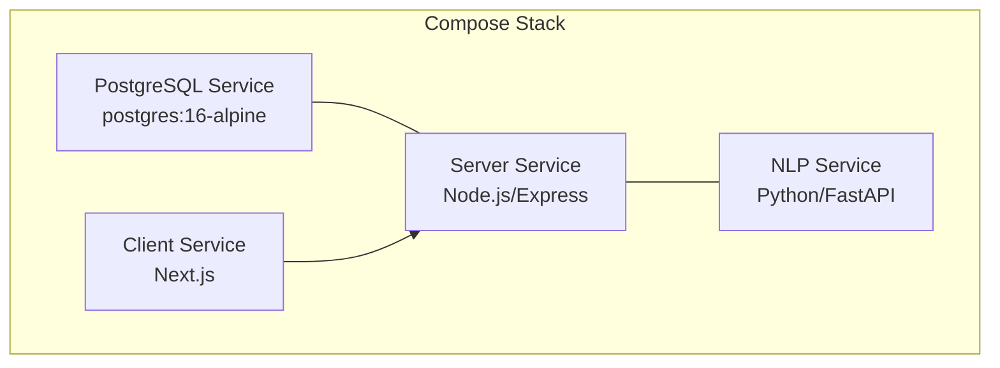
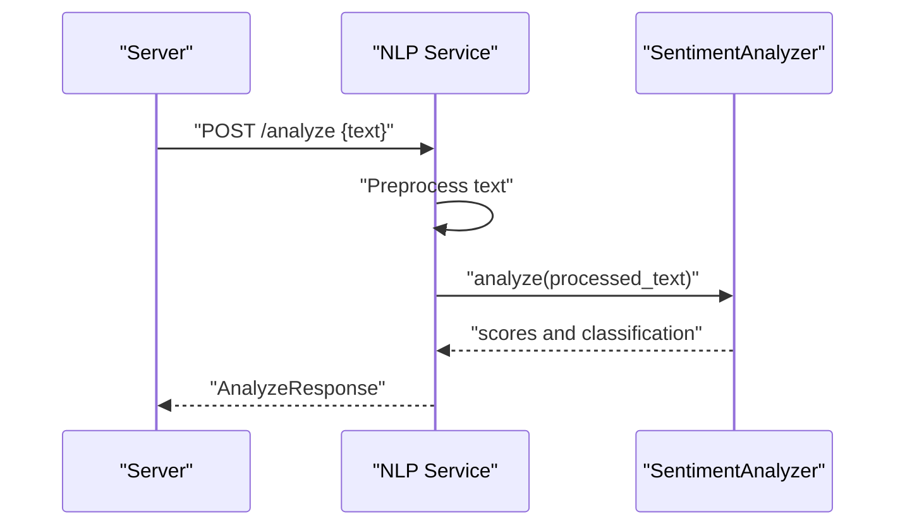
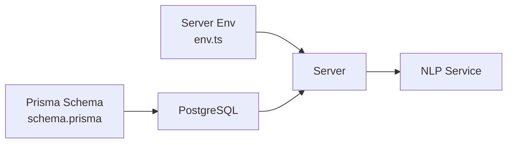

# Containerization and Docker Configuration

<cite>
**Referenced Files in This Document**
- [docker-compose.yml](file://docker-compose.yml)
- [schema.prisma](file://prisma/schema.prisma)
- [env.ts](file://server/src/config/env.ts)
- [index.ts](file://server/src/index.ts)
- [main.py](file://nlp-service/main.py)
- [models.py](file://nlp-service/models.py)
- [analyzer.py](file://nlp-service/nlp/analyzer.py)
- [processor.py](file://nlp-service/nlp/processor.py)
- [requirements.txt](file://nlp-service/requirements.txt)
- [package.json](file://server/package.json)
- [package.json](file://client/package.json)
</cite>

## Table of Contents
1. [Introduction](#introduction)
2. [Project Structure](#project-structure)
3. [Core Components](#core-components)
4. [Architecture Overview](#architecture-overview)
5. [Detailed Component Analysis](#detailed-component-analysis)
6. [Dependency Analysis](#dependency-analysis)
7. [Performance Considerations](#performance-considerations)
8. [Troubleshooting Guide](#troubleshooting-guide)
9. [Conclusion](#conclusion)
10. [Appendices](#appendices)

## Introduction
This document provides a comprehensive guide to containerizing the BuddyAI platform with a focus on multi-service deployment using Docker and Docker Compose. It covers the current database service definition, environment variable management, inter-service communication, and practical steps to extend the stack with the client, server, and NLP service. It also outlines strategies for networking, volume management, resource allocation, and operational best practices.

## Project Structure
The repository follows a multi-repo-like structure with four primary components:
- Database: PostgreSQL managed via Docker Compose
- Server: Node.js/Express backend configured via environment variables
- NLP Service: Python/FastAPI service for sentiment analysis
- Client: Next.js frontend (development mode)



**Diagram sources**
- [docker-compose.yml:1-19](file://docker-compose.yml#L1-L19)
- [env.ts:6-11](file://server/src/config/env.ts#L6-L11)
- [main.py:28-71](file://nlp-service/main.py#L28-L71)

**Section sources**
- [docker-compose.yml:1-19](file://docker-compose.yml#L1-L19)

## Core Components
- Database service: PostgreSQL 16 Alpine with named volume for persistence and explicit port mapping
- Environment-driven configuration: Server reads DATABASE_URL, JWT secret, and NLP service URL from environment
- NLP service: FastAPI microservice exposing /analyze and /health endpoints with NLTK resources pre-downloaded
- Client: Next.js application intended to run in development mode locally

Key observations:
- The current Compose file defines only the database service
- The server expects environment variables for connectivity and runtime behavior
- The NLP service exposes a health endpoint and requires NLTK data initialization

**Section sources**
- [docker-compose.yml:4-18](file://docker-compose.yml#L4-L18)
- [env.ts:6-11](file://server/src/config/env.ts#L6-L11)
- [main.py:28-71](file://nlp-service/main.py#L28-L71)

## Architecture Overview
The system is composed of four services orchestrated together. The database persists relational data, the server exposes REST APIs and integrates with the NLP service, the NLP service performs sentiment analysis, and the client consumes the server’s API.

```mermaid
graph TB
subgraph "Network: default"
DB["PostgreSQL<br/>host: postgres<br/>port: 5432"]
SRV["Server<br/>host: server<br/>port: 3001"]
NLP["NLP Service<br/>host: nlp-service<br/>port: 8001"]
CL["Client<br/>host: client<br/>port: 3000"]
end
DB < --> SRV
SRV --> NLP
CL --> SRV
```

**Diagram sources**
- [docker-compose.yml:4-18](file://docker-compose.yml#L4-L18)
- [env.ts](file://server/src/config/env.ts#L10)
- [main.py](file://nlp-service/main.py#L69)

## Detailed Component Analysis

### Database Service (PostgreSQL)
- Image: postgres:16-alpine
- Container name: buddyai-db
- Restart policy: unless-stopped
- Environment variables: POSTGRES_USER, POSTGRES_PASSWORD, POSTGRES_DB
- Port mapping: host 5432 to container 5432
- Volume: named volume postgres_data mounted to /var/lib/postgresql/data

Operational notes:
- The named volume ensures persistence across container recreation
- The service is reachable internally via hostname “postgres” and externally on port 5432

**Section sources**
- [docker-compose.yml:4-18](file://docker-compose.yml#L4-L18)

### Server Service (Node.js/Express)
- Purpose: REST API gateway for authentication, mood tracking, assessments, conversations, risk alerts, and dashboards
- Environment configuration:
  - PORT: defaults to 3001
  - DATABASE_URL: Prisma connection string
  - JWT_SECRET: signing secret
  - NLP_SERVICE_URL: base URL for NLP service
- Health endpoint: GET /health
- Routes: /api/auth, /api/mood, /api/assessments, /api/conversations, /api/risk, /api/alerts, /api/dashboard

Networking and connectivity:
- Connects to PostgreSQL using DATABASE_URL
- Calls NLP service at NLP_SERVICE_URL (defaults to http://localhost:8001)

**Section sources**
- [env.ts:6-11](file://server/src/config/env.ts#L6-L11)
- [index.ts:18-34](file://server/src/index.ts#L18-L34)
- [package.json:6-12](file://server/package.json#L6-L12)

### NLP Service (Python/FastAPI)
- Purpose: Provides sentiment analysis for text inputs
- Endpoints:
  - POST /analyze: Accepts text, preprocesses, and returns sentiment classification and scores
  - GET /health: Returns service health status
- Dependencies: FastAPI, Uvicorn, NLTK, Pydantic, python-dotenv
- Startup behavior:
  - Creates local NLTK data directory and downloads required corpora
  - Exposes service on port 8001 by default



**Diagram sources**
- [main.py:43-64](file://nlp-service/main.py#L43-L64)
- [analyzer.py:8-26](file://nlp-service/nlp/analyzer.py#L8-L26)
- [processor.py:10-18](file://nlp-service/nlp/processor.py#L10-L18)

**Section sources**
- [main.py:28-71](file://nlp-service/main.py#L28-L71)
- [models.py:4-25](file://nlp-service/models.py#L4-L25)
- [requirements.txt:1-6](file://nlp-service/requirements.txt#L1-L6)

### Client Service (Next.js)
- Purpose: Frontend web application
- Scripts: dev, build, start, lint
- Not currently defined in Compose; intended for local development

**Section sources**
- [package.json:5-9](file://client/package.json#L5-L9)

## Dependency Analysis
- Server depends on:
  - Database connectivity via Prisma (schema.prisma)
  - NLP service for sentiment analysis
- NLP service depends on:
  - NLTK corpora (downloaded at startup)
  - Pydantic for request/response validation
- Compose orchestration:
  - Services communicate via internal DNS hostnames
  - Database volume persists data across restarts



**Diagram sources**
- [schema.prisma:5-8](file://prisma/schema.prisma#L5-L8)
- [env.ts:8-11](file://server/src/config/env.ts#L8-L11)
- [docker-compose.yml:4-18](file://docker-compose.yml#L4-L18)

**Section sources**
- [schema.prisma:1-134](file://prisma/schema.prisma#L1-L134)
- [env.ts:6-11](file://server/src/config/env.ts#L6-L11)

## Performance Considerations
- Resource allocation:
  - Assign CPU shares and memory limits per service in Compose for predictable performance
  - Consider separate CPU and memory limits for database and application services
- Database tuning:
  - Adjust shared_buffers and work_mem in PostgreSQL for workload characteristics
  - Use connection pooling in the server to reduce overhead
- NLP service:
  - Limit concurrent requests to avoid memory spikes during NLTK downloads and analysis
  - Warm-up the service after container start to preload NLTK data
- Networking:
  - Keep services on the same Compose network to minimize latency
  - Use health checks to prevent routing traffic to unhealthy instances

[No sources needed since this section provides general guidance]

## Troubleshooting Guide
Common startup and connectivity issues:
- Database not ready:
  - Add a health check and wait-on pattern in Compose for dependent services
  - Verify credentials and database URL format
- NLP service failures:
  - Confirm NLTK data downloads succeed; check disk space and permissions
  - Ensure the service is reachable at the configured NLP_SERVICE_URL
- Server connectivity:
  - Validate DATABASE_URL matches the database service hostname and credentials
  - Confirm CORS settings allow the client origin if applicable
- Port conflicts:
  - Change host port mappings if 5432 or 3001 are in use

Operational tips:
- Use docker compose logs <service> to inspect logs
- Add restart policies and health checks for resilience
- Persist logs to a dedicated volume or external logging system

**Section sources**
- [docker-compose.yml:7-15](file://docker-compose.yml#L7-L15)
- [env.ts:8-11](file://server/src/config/env.ts#L8-L11)
- [main.py:9-26](file://nlp-service/main.py#L9-L26)

## Conclusion
The current Compose setup provides a solid foundation with a persistent PostgreSQL database. Extending the stack to include the server, NLP service, and client involves defining service entries, establishing environment variables, and configuring networking and volumes. Following the guidance in this document will help achieve a reliable, scalable, and maintainable containerized deployment.

[No sources needed since this section summarizes without analyzing specific files]

## Appendices

### Practical Commands
- Build and start the current stack:
  - docker compose up -d
- View logs:
  - docker compose logs postgres
- Stop and remove:
  - docker compose down

Environment variable management:
- Define DATABASE_URL pointing to the database service hostname and credentials
- Set NLP_SERVICE_URL to the NLP service hostname and port
- Configure JWT_SECRET and PORT as needed

Volume management:
- Named volume postgres_data persists database data
- Consider adding volumes for application logs and NLP model caches if needed

Port mapping:
- Database exposed on host port 5432
- Server listens on port 3001 inside the network
- NLP service listens on port 8001 inside the network

Resource allocation:
- Use deploy.resources in Compose to set limits and reservations
- Monitor memory and CPU usage under realistic load

Registry and automation:
- Tag images consistently (e.g., buddyai/server:1.x.y)
- Automate builds with CI/CD pipelines
- Pin dependency versions in requirements.txt and package.json

**Section sources**
- [docker-compose.yml:12-15](file://docker-compose.yml#L12-L15)
- [env.ts:7-11](file://server/src/config/env.ts#L7-L11)
- [main.py](file://nlp-service/main.py#L69)