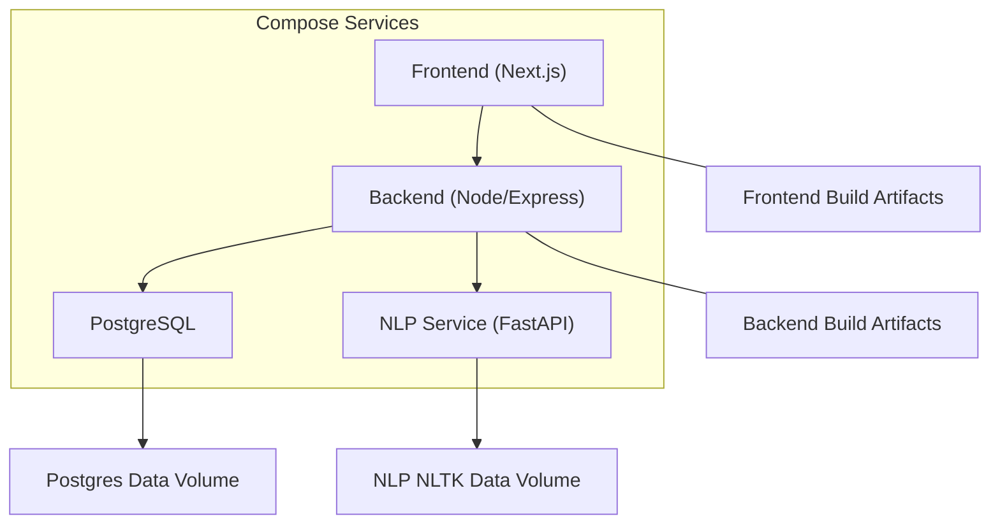
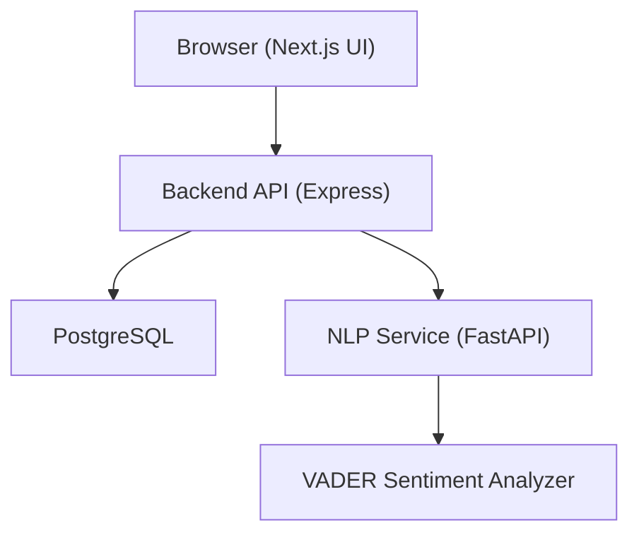
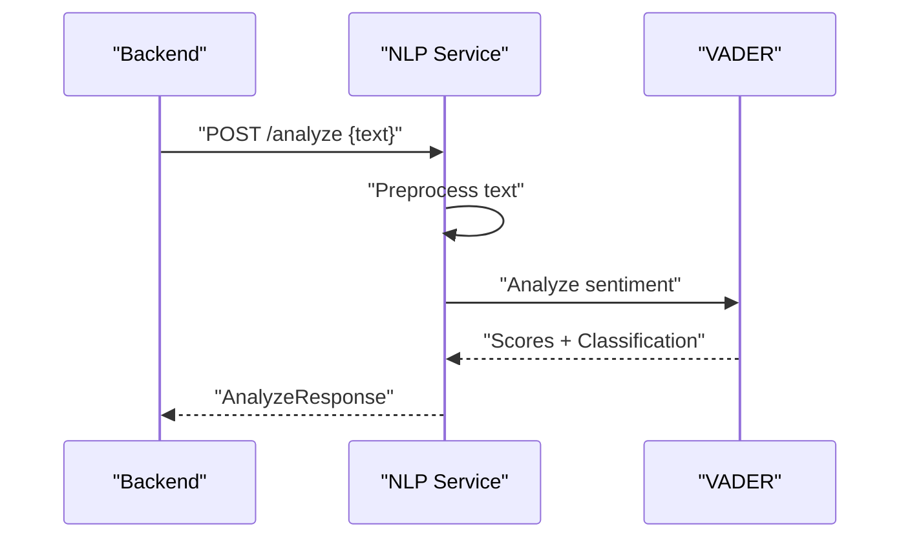
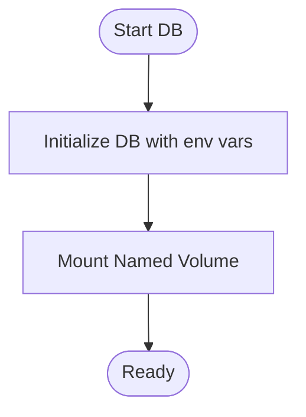
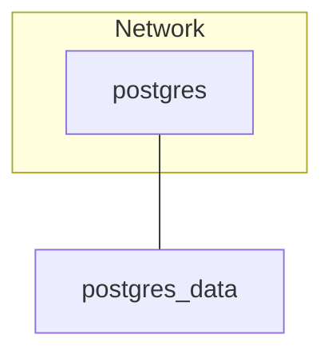
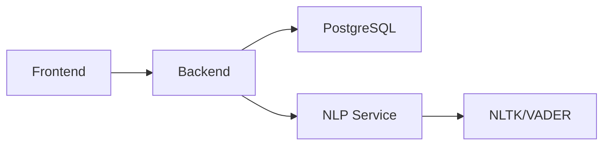

# Deployment and DevOps

<cite>
**Referenced Files in This Document**
- [docker-compose.yml](file://docker-compose.yml)
- [README.md](file://README.md)
- [client/package.json](file://client/package.json)
- [server/package.json](file://server/package.json)
- [server/src/config/env.ts](file://server/src/config/env.ts)
- [server/src/config/prisma.ts](file://server/src/config/prisma.ts)
- [nlp-service/main.py](file://nlp-service/main.py)
- [nlp-service/requirements.txt](file://nlp-service/requirements.txt)
- [nlp-service/models.py](file://nlp-service/models.py)
- [nlp-service/nlp/analyzer.py](file://nlp-service/nlp/analyzer.py)
- [nlp-service/nlp/processor.py](file://nlp-service/nlp/processor.py)
</cite>

## Table of Contents
1. [Introduction](#introduction)
2. [Project Structure](#project-structure)
3. [Core Components](#core-components)
4. [Architecture Overview](#architecture-overview)
5. [Detailed Component Analysis](#detailed-component-analysis)
6. [Dependency Analysis](#dependency-analysis)
7. [Performance Considerations](#performance-considerations)
8. [Troubleshooting Guide](#troubleshooting-guide)
9. [Conclusion](#conclusion)
10. [Appendices](#appendices)

## Introduction
This document provides comprehensive deployment and DevOps guidance for the BuddyAI system with a focus on containerized deployment using Docker Compose and production readiness. It covers container configurations for the frontend (Next.js), backend (Node.js/Express), NLP service (FastAPI), and PostgreSQL database, including networking, volumes, environment configuration, secrets management, service orchestration, and production strategies such as scaling, load balancing, monitoring, logging, health checks, backups, disaster recovery, and security (SSL/TLS, network security, access controls). It also outlines CI/CD pipeline setup, automated testing integration, and release management procedures.

## Project Structure
The repository follows a multi-module structure:
- Frontend: Next.js application under client/
- Backend: Node.js/Express server under server/
- NLP Service: Python/FastAPI service under nlp-service/
- Database: PostgreSQL managed via Prisma ORM
- Orchestration: docker-compose.yml defines services and volumes

**Diagram sources**
- [docker-compose.yml:1-19](file://docker-compose.yml#L1-L19)
- [client/package.json:1-27](file://client/package.json#L1-L27)
- [server/package.json:1-36](file://server/package.json#L1-L36)
- [nlp-service/main.py:1-71](file://nlp-service/main.py#L1-L71)

**Section sources**
- [README.md:1-923](file://README.md#L1-L923)
- [docker-compose.yml:1-19](file://docker-compose.yml#L1-L19)

## Core Components
- Frontend (Next.js): Runs in development or production mode via scripts; builds static assets and serves the UI.
- Backend (Node/Express): TypeScript-based server using Express, Prisma ORM, JWT, bcrypt, and CORS; loads environment variables from a .env file.
- NLP Service (FastAPI): Provides sentiment analysis via VADER; exposes health and analyze endpoints; initializes NLTK resources on startup.
- Database (PostgreSQL): Managed by Prisma; persisted via named volumes.

Key deployment-relevant observations:
- Environment-driven configuration for backend (PORT, DATABASE_URL, JWT_SECRET, NLP_SERVICE_URL).
- NLP service exposes a health endpoint and listens on a configurable port.
- Database is configured with a named volume for persistence.

**Section sources**
- [client/package.json:1-27](file://client/package.json#L1-L27)
- [server/package.json:1-36](file://server/package.json#L1-L36)
- [server/src/config/env.ts:1-12](file://server/src/config/env.ts#L1-L12)
- [nlp-service/main.py:1-71](file://nlp-service/main.py#L1-L71)
- [docker-compose.yml:1-19](file://docker-compose.yml#L1-L19)

## Architecture Overview
The system architecture integrates a frontend, backend, NLP service, and database. The backend orchestrates authentication, chat, mood tracking, PHQ-9 assessments, and admin dashboards, while delegating text processing to the NLP service. All data is persisted in PostgreSQL.

**Diagram sources**
- [README.md:125-210](file://README.md#L125-L210)
- [server/src/config/env.ts:1-12](file://server/src/config/env.ts#L1-L12)
- [nlp-service/main.py:1-71](file://nlp-service/main.py#L1-L71)

## Detailed Component Analysis

### Frontend Containerization (Next.js)
- Build and runtime:
  - Use the official Next.js image or a minimal Node base image to build and start the app.
  - Set NODE_ENV appropriately for production.
- Ports:
  - Expose the port used by Next.js (commonly 3000) and publish externally if needed.
- Volumes:
  - Mount build artifacts or bind-mount the built output for hot-reload alternatives in development.
- Health checks:
  - Implement a lightweight health endpoint in the frontend for readiness/liveness probes.
- Networking:
  - Place behind a reverse proxy/load balancer in production; configure CORS and origin policies accordingly.

[No sources needed since this section provides general guidance]

### Backend Containerization (Node/Express)
- Build and runtime:
  - Compile TypeScript to JavaScript and run the compiled server.
  - Use environment variables for PORT, DATABASE_URL, JWT_SECRET, and NLP_SERVICE_URL.
- Secrets management:
  - Store secrets in a secrets manager or compose secrets; avoid hardcoding sensitive values.
- Health checks:
  - Add a GET /health endpoint returning service status and DB connectivity.
- Networking:
  - Expose only necessary ports; place behind a reverse proxy/load balancer.
- Persistence:
  - No local filesystem persistence required; rely on database for state.

**Section sources**
- [server/package.json:1-36](file://server/package.json#L1-L36)
- [server/src/config/env.ts:1-12](file://server/src/config/env.ts#L1-L12)

### NLP Service Containerization (FastAPI)
- Build and runtime:
  - Install dependencies from requirements.txt; run with Uvicorn on a configurable port.
- Health checks:
  - Use the existing GET /health endpoint for liveness/readiness.
- Networking:
  - Expose the NLP port and ensure backend can reach it via service discovery.
- Data persistence:
  - NLTK data is downloaded on startup; mount a persistent volume for NLTK data to avoid repeated downloads.

**Diagram sources**
- [nlp-service/main.py:43-64](file://nlp-service/main.py#L43-L64)
- [nlp-service/nlp/processor.py:1-19](file://nlp-service/nlp/processor.py#L1-L19)
- [nlp-service/nlp/analyzer.py:1-27](file://nlp-service/nlp/analyzer.py#L1-L27)
- [nlp-service/models.py:1-26](file://nlp-service/models.py#L1-L26)

**Section sources**
- [nlp-service/main.py:1-71](file://nlp-service/main.py#L1-L71)
- [nlp-service/requirements.txt:1-6](file://nlp-service/requirements.txt#L1-L6)
- [nlp-service/models.py:1-26](file://nlp-service/models.py#L1-L26)

### Database Containerization (PostgreSQL)
- Image and persistence:
  - Use postgres:alpine; persist data via a named volume.
- Environment:
  - Configure POSTGRES_USER, POSTGRES_PASSWORD, POSTGRES_DB.
- Networking:
  - Keep internal for backend/NLP; expose only for local development or DBA tasks.
- Backups:
  - Schedule logical backups using pg_dump and store offsite.

**Diagram sources**
- [docker-compose.yml:4-18](file://docker-compose.yml#L4-L18)

**Section sources**
- [docker-compose.yml:1-19](file://docker-compose.yml#L1-L19)

### Orchestration with Docker Compose
- Services:
  - postgres: configured with environment, ports, and named volume.
- Networking:
  - Default bridge network allows inter-service communication by service name.
- Volumes:
  - postgres_data persists PostgreSQL data.

**Diagram sources**
- [docker-compose.yml:3-18](file://docker-compose.yml#L3-L18)

**Section sources**
- [docker-compose.yml:1-19](file://docker-compose.yml#L1-L19)

## Dependency Analysis
- Backend depends on:
  - Database URL for Prisma connection.
  - NLP_SERVICE_URL for sentiment analysis requests.
- NLP service depends on:
  - NLTK resources initialized at startup.
- Frontend communicates with backend APIs; backend communicates with database and NLP service.

**Diagram sources**
- [server/src/config/env.ts:1-12](file://server/src/config/env.ts#L1-L12)
- [nlp-service/main.py:1-71](file://nlp-service/main.py#L1-L71)
- [server/src/config/prisma.ts:1-6](file://server/src/config/prisma.ts#L1-L6)

**Section sources**
- [server/src/config/env.ts:1-12](file://server/src/config/env.ts#L1-L12)
- [server/src/config/prisma.ts:1-6](file://server/src/config/prisma.ts#L1-L6)

## Performance Considerations
- Horizontal scaling:
  - Backend: Stateless Node server; scale replicas behind a load balancer; enable sticky sessions only if required.
  - NLP: Stateless FastAPI service; scale replicas; consider rate limiting and circuit breakers.
- Caching:
  - Use Redis for session storage and short-lived caches (optional).
- Database:
  - Use connection pooling; monitor slow queries; consider read replicas for reporting/admin dashboards.
- Observability:
  - Enable structured logging; export metrics to Prometheus/Grafana.
- Resource limits:
  - Set CPU/memory limits per service in Compose or Kubernetes.

[No sources needed since this section provides general guidance]

## Troubleshooting Guide
Common deployment issues and resolutions:
- Backend cannot connect to database:
  - Verify DATABASE_URL format and network connectivity; confirm service names and ports.
- NLP service health check fails:
  - Ensure NLTK data is downloaded; consider mounting a persistent volume for NLTK data.
- CORS errors in browser:
  - Configure allowed origins in the backend; ensure frontend origin matches.
- Port conflicts:
  - Change published ports in Compose or run on different hosts.
- Secrets not loaded:
  - Confirm .env presence and path resolution; use secrets management in production.

**Section sources**
- [server/src/config/env.ts:1-12](file://server/src/config/env.ts#L1-L12)
- [nlp-service/main.py:1-71](file://nlp-service/main.py#L1-L71)

## Conclusion
This guide outlines a production-ready deployment strategy for BuddyAI using Docker Compose, covering containerization, networking, volumes, environment configuration, secrets management, service orchestration, scaling, load balancing, monitoring/logging, health checks, backups, disaster recovery, and security. Extend the Compose setup with secrets, reverse proxies, and observability stacks for production environments.

## Appendices

### A. Environment Configuration and Secrets Management
- Backend environment variables:
  - PORT, DATABASE_URL, JWT_SECRET, NLP_SERVICE_URL
- Secrets management:
  - Use Docker secrets or a secrets manager; avoid committing secrets to version control.
- Example locations:
  - Backend reads environment from a .env file resolved from server/src/config/env.ts.

**Section sources**
- [server/src/config/env.ts:1-12](file://server/src/config/env.ts#L1-L12)

### B. Health Checks and Readiness
- NLP Service:
  - GET /health returns service status.
- Backend:
  - Implement GET /health returning service status and DB connectivity.
- Frontend:
  - Implement a lightweight health endpoint for readiness.

**Section sources**
- [nlp-service/main.py:61-64](file://nlp-service/main.py#L61-L64)

### C. Monitoring and Logging
- Logging:
  - Standard out/in container logs; integrate with centralized logging (e.g., ELK or similar).
- Metrics:
  - Expose Prometheus metrics from backend; scrape with Prometheus and visualize with Grafana.
- Tracing:
  - Add distributed tracing (e.g., OpenTelemetry) for cross-service visibility.

[No sources needed since this section provides general guidance]

### D. Backup and Disaster Recovery
- Database backups:
  - Schedule periodic pg_dump logical backups; store offsite.
- Restore procedure:
  - Test restores regularly; automate restore verification.
- DR plan:
  - Replicate backups to secondary region; define RTO/RPO targets.

[No sources needed since this section provides general guidance]

### E. Security Considerations
- TLS/SSL:
  - Terminate TLS at reverse proxy/load balancer; enforce HTTPS.
- Network security:
  - Restrict inbound ports; use firewalls; segment networks.
- Access controls:
  - Enforce RBAC; rotate JWT secrets; audit logs.

[No sources needed since this section provides general guidance]

### F. CI/CD Pipeline Setup
- Build stages:
  - Build frontend and backend images; push to registry.
- Testing:
  - Run unit/integration tests in CI; gate deployments.
- Release management:
  - Tag releases; promote images; rollback on failure.

[No sources needed since this section provides general guidance]

### G. Practical Commands and Examples
- Local deployment:
  - docker-compose up -d
  - docker-compose down
- Scaling:
  - docker-compose up --scale backend=<n>
- Health checks:
  - curl http://host:port/health
- Logs:
  - docker-compose logs -f <service>

[No sources needed since this section provides general guidance]