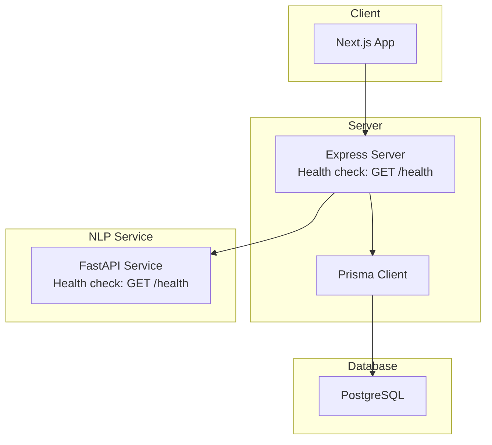
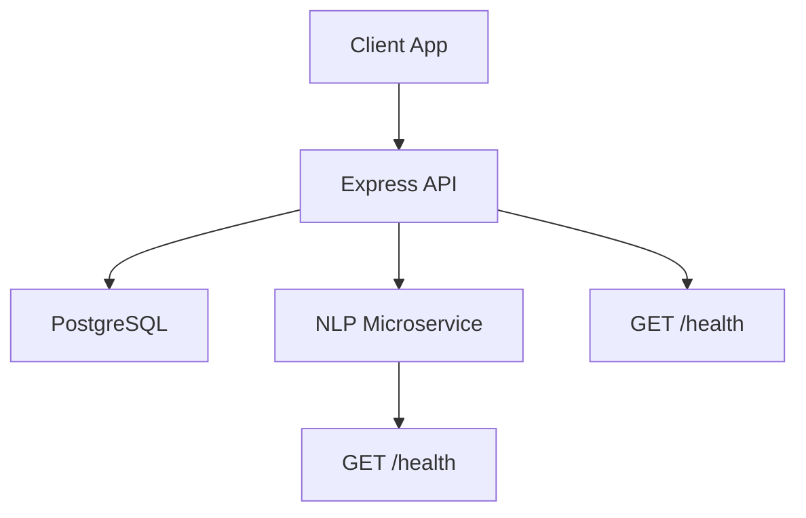
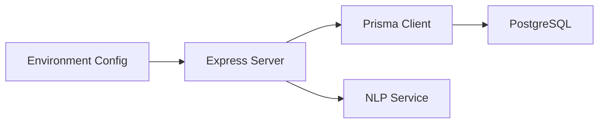

# Monitoring and Maintenance

<cite>
**Referenced Files in This Document**
- [docker-compose.yml](file://docker-compose.yml)
- [package.json](file://package.json)
- [requirements.txt](file://requirements.txt)
- [prisma/schema.prisma](file://prisma/schema.prisma)
- [server/src/index.ts](file://server/src/index.ts)
- [server/src/config/env.ts](file://server/src/config/env.ts)
- [server/src/config/prisma.ts](file://server/src/config/prisma.ts)
- [server/src/middleware/errorHandler.ts](file://server/src/middleware/errorHandler.ts)
- [nlp-service/main.py](file://nlp-service/main.py)
- [nlp-service/nlp/analyzer.py](file://nlp-service/nlp/analyzer.py)
- [nlp-service/nlp/processor.py](file://nlp-service/nlp/processor.py)
</cite>

## Table of Contents
1. [Introduction](#introduction)
2. [Project Structure](#project-structure)
3. [Core Components](#core-components)
4. [Architecture Overview](#architecture-overview)
5. [Detailed Component Analysis](#detailed-component-analysis)
6. [Dependency Analysis](#dependency-analysis)
7. [Performance Considerations](#performance-considerations)
8. [Troubleshooting Guide](#troubleshooting-guide)
9. [Conclusion](#conclusion)
10. [Appendices](#appendices)

## Introduction
This document provides a comprehensive guide to monitoring and maintenance for BuddyAI with a focus on observability and operational excellence. It covers application metrics collection, health checks, logging configuration, system monitoring, database monitoring, application performance monitoring (APM), maintenance procedures, and disaster recovery. The content is grounded in the repository’s current configuration and codebase.

## Project Structure
The project consists of:
- Frontend (Next.js) under client/
- Backend (Express) under server/
- NLP microservice (FastAPI) under nlp-service/
- Database (PostgreSQL) orchestrated via Docker Compose
- Prisma schema for database modeling

**Diagram sources**
- [server/src/index.ts:18-20](file://server/src/index.ts#L18-L20)
- [nlp-service/main.py:61-64](file://nlp-service/main.py#L61-L64)
- [docker-compose.yml:4-15](file://docker-compose.yml#L4-L15)

**Section sources**
- [docker-compose.yml:1-19](file://docker-compose.yml#L1-L19)
- [package.json:1-33](file://package.json#L1-L33)
- [prisma/schema.prisma:1-134](file://prisma/schema.prisma#L1-L134)

## Core Components
- Express server exposes a health endpoint and routes for API resources.
- NLP service exposes a health endpoint and a sentiment analysis endpoint.
- PostgreSQL is configured via Docker Compose with persistent volume.
- Prisma is used for database client generation and schema modeling.
- Logging stack includes loguru for Python services.

Key operational endpoints:
- Server health: GET /health
- NLP health: GET /health

**Section sources**
- [server/src/index.ts:18-20](file://server/src/index.ts#L18-L20)
- [nlp-service/main.py:61-64](file://nlp-service/main.py#L61-L64)
- [docker-compose.yml:4-15](file://docker-compose.yml#L4-L15)
- [prisma/schema.prisma:1-134](file://prisma/schema.prisma#L1-L134)
- [requirements.txt:55](file://requirements.txt#L55)

## Architecture Overview
The system follows a microservices architecture with a backend API, a frontend, and an NLP microservice. Observability is supported by health endpoints and logging libraries.

**Diagram sources**
- [server/src/index.ts:18-20](file://server/src/index.ts#L18-L20)
- [nlp-service/main.py:61-64](file://nlp-service/main.py#L61-L64)

## Detailed Component Analysis

### Health Checks
- Server: A simple JSON health endpoint returns system status.
- NLP Service: A dedicated health endpoint confirms service readiness.

Operational guidance:
- Use these endpoints for basic liveness/readiness probes in container orchestrators.
- Extend health endpoints to include database connectivity checks and external service pings.

**Section sources**
- [server/src/index.ts:18-20](file://server/src/index.ts#L18-L20)
- [nlp-service/main.py:61-64](file://nlp-service/main.py#L61-L64)

### Logging Configuration
- Python services use loguru for structured logging.
- Centralized log aggregation is not configured in the repository; logs are emitted locally.

Recommendations:
- Configure log aggregation (e.g., ELK/EFK stack or cloud-native solutions).
- Standardize log formats and include correlation IDs for distributed tracing.
- Set up log rotation policies to manage disk usage.

**Section sources**
- [requirements.txt:55](file://requirements.txt#L55)

### System Monitoring (CPU, Memory, Disk, Network)
- Current repository does not include system-level metrics collection.
- Implement OS-level monitoring agents and integrate with a metrics platform (e.g., Prometheus/Grafana).

Focus areas:
- CPU utilization per service container
- Memory consumption trends
- Disk I/O and volume capacity for PostgreSQL data
- Network throughput and latency between services

[No sources needed since this section provides general guidance]

### Database Monitoring (PostgreSQL)
Current state:
- PostgreSQL is containerized with a named volume for persistence.
- No database-specific monitoring or alerting is configured.

Recommended practices:
- Track query performance using EXPLAIN/ANALYZE and slow query logs.
- Monitor connection pool saturation and timeouts.
- Verify backups and perform periodic restore drills.
- Use database-level metrics (connections, replication lag, WAL size).

**Section sources**
- [docker-compose.yml:4-15](file://docker-compose.yml#L4-L15)
- [prisma/schema.prisma:1-134](file://prisma/schema.prisma#L1-L134)

### Application Performance Monitoring (APM)
- No APM instrumentation is present in the repository.
- Recommended integrations:
  - Python: OpenTelemetry SDK or vendor-specific agent for tracing and profiling.
  - Node.js: Profiling and tracing hooks for Express applications.
- Correlate traces with logs and metrics for end-to-end visibility.

**Section sources**
- [nlp-service/main.py:1-71](file://nlp-service/main.py#L1-L71)
- [server/src/index.ts:1-35](file://server/src/index.ts#L1-L35)

### Maintenance Procedures
- Patch management:
  - Regularly update dependencies declared in package.json and requirements.txt.
  - Review and apply security patches promptly.
- Database maintenance:
  - Use Prisma migrations for schema changes.
  - Schedule vacuum/analyze periodically for performance.
- Backup and restore:
  - Back up PostgreSQL data volume regularly.
  - Test restore procedures and validate data integrity.

**Section sources**
- [package.json:20-31](file://package.json#L20-L31)
- [requirements.txt:1-68](file://requirements.txt#L1-L68)
- [docker-compose.yml:17-19](file://docker-compose.yml#L17-L19)

### Practical Examples
- Setting up monitoring dashboards:
  - Create dashboards for health endpoints, error rates, and latency.
  - Add database metrics (connections, queries per second).
- Configuring alerts:
  - Alert on failing health checks, elevated error rates, and slow response times.
  - Define thresholds for CPU/memory/disk usage.
- Troubleshooting performance issues:
  - Use logs to identify bottlenecks.
  - Profile hotspots in Python and Node.js code.
  - Inspect database query plans and indexes.

[No sources needed since this section provides general guidance]

## Dependency Analysis
The backend depends on Prisma for database operations, while the NLP service is independent. The database is managed externally via Docker Compose.

**Diagram sources**
- [server/src/config/env.ts:6-11](file://server/src/config/env.ts#L6-L11)
- [server/src/config/prisma.ts:1-6](file://server/src/config/prisma.ts#L1-L6)
- [docker-compose.yml:4-15](file://docker-compose.yml#L4-L15)

**Section sources**
- [server/src/config/env.ts:1-12](file://server/src/config/env.ts#L1-L12)
- [server/src/config/prisma.ts:1-6](file://server/src/config/prisma.ts#L1-L6)
- [docker-compose.yml:1-19](file://docker-compose.yml#L1-L19)

## Performance Considerations
- Optimize database queries and ensure proper indexing.
- Scale horizontally by adding replicas and load balancing.
- Use connection pooling and limit concurrent requests to prevent overload.
- Monitor garbage collection and memory pressure in Python services.

[No sources needed since this section provides general guidance]

## Troubleshooting Guide
- Health check failures:
  - Verify service availability and port bindings.
  - Confirm environment variables and database connectivity.
- Error handling:
  - Centralized error handler returns standardized error responses.
- Logging:
  - Enable structured logs and include request IDs for traceability.

**Section sources**
- [server/src/middleware/errorHandler.ts:1-13](file://server/src/middleware/errorHandler.ts#L1-L13)
- [server/src/index.ts:18-20](file://server/src/index.ts#L18-L20)

## Conclusion
BuddyAI currently provides foundational health endpoints and logging primitives. To achieve operational excellence, extend observability with comprehensive metrics, centralized logging, database monitoring, APM, and robust maintenance processes. The recommended steps align with the existing project structure and technology stack.

[No sources needed since this section summarizes without analyzing specific files]

## Appendices

### Appendix A: Health Check Endpoints
- Server: GET /health
- NLP Service: GET /health

**Section sources**
- [server/src/index.ts:18-20](file://server/src/index.ts#L18-L20)
- [nlp-service/main.py:61-64](file://nlp-service/main.py#L61-L64)

### Appendix B: Database Schema Highlights
- Enumerations for roles, sentiments, sender types, severity, risk levels, and alert statuses.
- Relations among User, Conversation, Message, MoodEntry, Phq9Assessment, Recommendation, and RiskAlert.

**Section sources**
- [prisma/schema.prisma:10-45](file://prisma/schema.prisma#L10-L45)
- [prisma/schema.prisma:47-133](file://prisma/schema.prisma#L47-L133)

### Appendix C: NLP Service Components
- TextProcessor: Cleans and tokenizes input text.
- SentimentAnalyzer: Computes sentiment scores using VADER.

**Section sources**
- [nlp-service/nlp/processor.py:1-19](file://nlp-service/nlp/processor.py#L1-L19)
- [nlp-service/nlp/analyzer.py:1-27](file://nlp-service/nlp/analyzer.py#L1-L27)