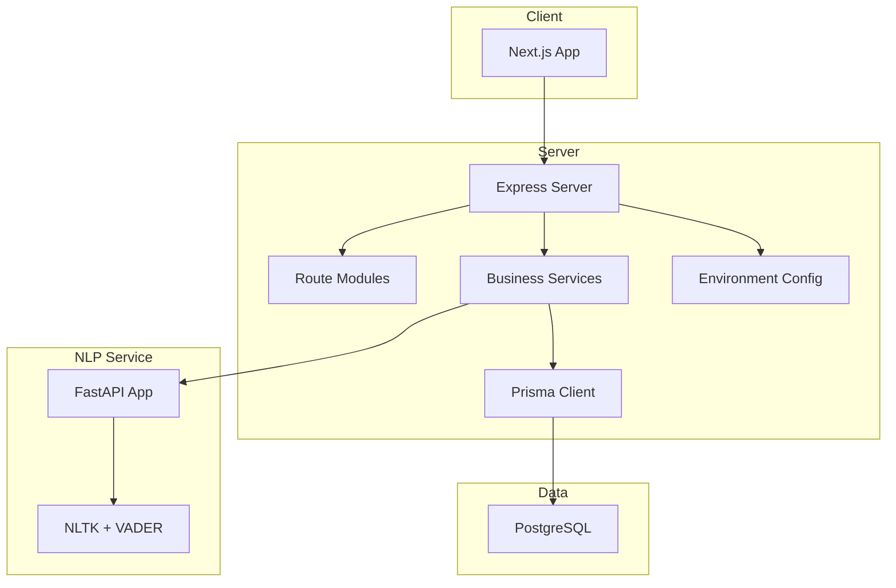
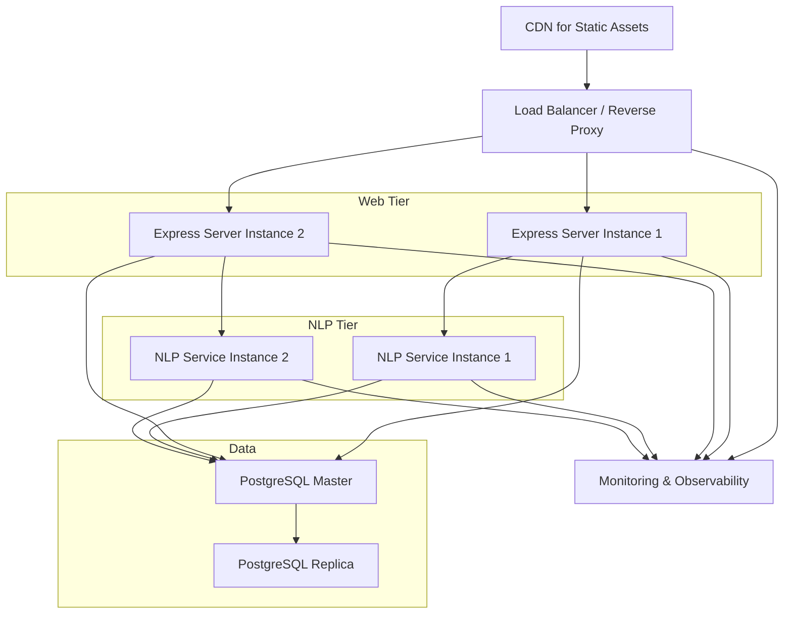
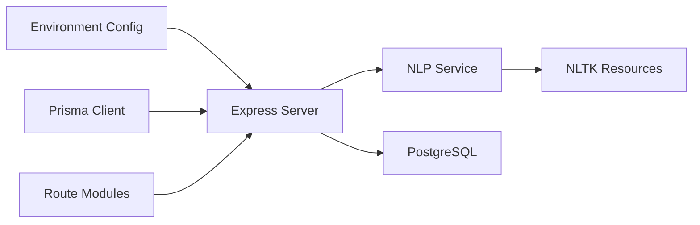

# Production Deployment and Scaling

<cite>
**Referenced Files in This Document**
- [docker-compose.yml](file://docker-compose.yml)
- [package.json](file://package.json)
- [server/package.json](file://server/package.json)
- [server/src/index.ts](file://server/src/index.ts)
- [server/src/config/env.ts](file://server/src/config/env.ts)
- [server/src/config/prisma.ts](file://server/src/config/prisma.ts)
- [server/src/services/nlp.service.ts](file://server/src/services/nlp.service.ts)
- [nlp-service/main.py](file://nlp-service/main.py)
- [nlp-service/models.py](file://nlp-service/models.py)
- [prisma/schema.prisma](file://prisma/schema.prisma)
- [client/next.config.ts](file://client/next.config.ts)
</cite>

## Table of Contents
1. [Introduction](#introduction)
2. [Project Structure](#project-structure)
3. [Core Components](#core-components)
4. [Architecture Overview](#architecture-overview)
5. [Detailed Component Analysis](#detailed-component-analysis)
6. [Dependency Analysis](#dependency-analysis)
7. [Performance Considerations](#performance-considerations)
8. [Troubleshooting Guide](#troubleshooting-guide)
9. [Conclusion](#conclusion)
10. [Appendices](#appendices)

## Introduction
This document provides enterprise-grade production deployment and scaling guidance for BuddyAI. It covers environment configuration, secrets management, deployment workflows across staging and production, rollback and blue-green strategies, horizontal scaling and load balancing, auto-scaling policies, cloud platform deployment options, security hardening, performance optimization, monitoring, capacity planning, disaster recovery, backup strategies, and maintenance windows.

## Project Structure
BuddyAI consists of:
- Frontend: Next.js application
- Backend: Express server with TypeScript
- NLP Service: Python FastAPI microservice
- Database: PostgreSQL managed via Prisma
- Orchestration: docker-compose for local development and base for production containers

**Diagram sources**
- [server/src/index.ts:1-35](file://server/src/index.ts#L1-L35)
- [server/src/config/env.ts:1-12](file://server/src/config/env.ts#L1-L12)
- [server/src/config/prisma.ts:1-6](file://server/src/config/prisma.ts#L1-L6)
- [nlp-service/main.py:1-71](file://nlp-service/main.py#L1-L71)
- [prisma/schema.prisma:1-134](file://prisma/schema.prisma#L1-L134)

**Section sources**
- [docker-compose.yml:1-19](file://docker-compose.yml#L1-L19)
- [package.json:1-33](file://package.json#L1-L33)
- [server/src/index.ts:1-35](file://server/src/index.ts#L1-L35)
- [nlp-service/main.py:1-71](file://nlp-service/main.py#L1-L71)
- [prisma/schema.prisma:1-134](file://prisma/schema.prisma#L1-L134)

## Core Components
- Express server exposes REST APIs and health checks, wired to route modules and business services.
- Environment configuration loads runtime settings from process environment variables.
- Prisma client connects to PostgreSQL using DATABASE_URL.
- NLP microservice provides sentiment analysis via FastAPI and UVicorn.
- Next.js client consumes the backend API.

Key production readiness areas:
- Environment variables for port, database URL, JWT secret, and NLP service URL.
- Health endpoints for observability and load balancer probing.
- CORS configuration for cross-origin requests.
- Database schema and Prisma client initialization.

**Section sources**
- [server/src/index.ts:1-35](file://server/src/index.ts#L1-L35)
- [server/src/config/env.ts:1-12](file://server/src/config/env.ts#L1-L12)
- [server/src/config/prisma.ts:1-6](file://server/src/config/prisma.ts#L1-L6)
- [nlp-service/main.py:1-71](file://nlp-service/main.py#L1-L71)
- [prisma/schema.prisma:1-134](file://prisma/schema.prisma#L1-L134)

## Architecture Overview
The production architecture comprises:
- Stateless Express server behind a reverse proxy/load balancer
- PostgreSQL with connection pooling and backups
- Standalone NLP FastAPI service scaled independently
- CDN for static assets (Next.js)
- Observability stack (metrics, logs, traces)
- CI/CD pipeline with automated testing and deployment

[No sources needed since this diagram shows conceptual workflow, not actual code structure]

## Detailed Component Analysis

### Environment Variables and Secrets Management
Production-grade environment variables:
- PORT: Application port
- DATABASE_URL: PostgreSQL connection string
- JWT_SECRET: Cryptographic key for tokens
- NLP_SERVICE_URL: URL of the NLP FastAPI service

Secrets management recommendations:
- Store secrets in a secure vault (e.g., AWS Secrets Manager, Azure Key Vault, Google Secret Manager).
- Inject secrets at runtime via environment variables or mounted secret files.
- Never commit secrets to version control.

Configuration loading pattern:
- Load .env during development; in production, rely on environment injection.

**Section sources**
- [server/src/config/env.ts:1-12](file://server/src/config/env.ts#L1-L12)
- [server/src/index.ts:1-35](file://server/src/index.ts#L1-L35)
- [nlp-service/main.py:67-71](file://nlp-service/main.py#L67-L71)

### Database and Prisma
- Prisma schema defines models and enums for users, conversations, messages, moods, assessments, recommendations, and risk alerts.
- DATABASE_URL is sourced from environment variables.
- Use Prisma migrations for schema changes in CI/CD.

Production considerations:
- Enable connection pooling at the application level.
- Configure read replicas for reporting workloads.
- Schedule maintenance windows for migrations.

**Section sources**
- [prisma/schema.prisma:1-134](file://prisma/schema.prisma#L1-L134)
- [server/src/config/prisma.ts:1-6](file://server/src/config/prisma.ts#L1-L6)
- [server/src/config/env.ts:1-12](file://server/src/config/env.ts#L1-L12)

### NLP Microservice
- FastAPI service exposes /analyze and /health endpoints.
- Uses NLTK resources downloaded to a local directory.
- Exposed on a dedicated port and consumed by the backend.

Scaling strategy:
- Scale NLP instances independently from the web tier.
- Use health checks for load balancer probes.

**Section sources**
- [nlp-service/main.py:1-71](file://nlp-service/main.py#L1-L71)
- [nlp-service/models.py:1-26](file://nlp-service/models.py#L1-L26)
- [server/src/services/nlp.service.ts:1-24](file://server/src/services/nlp.service.ts#L1-L24)

### Frontend Build and CDN
- Next.js builds static assets; deploy to a CDN for global distribution.
- Configure asset prefixes and cache headers appropriately.

**Section sources**
- [client/next.config.ts:1-8](file://client/next.config.ts#L1-L8)
- [package.json:1-33](file://package.json#L1-L33)

### Deployment Workflows (Staging → Production)
Recommended flow:
- Staging: Deploy with a single backend replica and one NLP replica; enable health checks and basic metrics.
- Production: Use blue-green deployment with external traffic shifting after pre-stop verification.
- Rollback: Keep previous release images; switch traffic back on failure.

Rollback procedure:
- Switch traffic to the previous healthy revision.
- Validate health and key metrics.
- If issues persist, revert again or initiate another fix release.

Blue-Green deployment:
- Maintain two identical environments (blue/green).
- Route traffic to the updated environment after validation.
- Revert instantly by switching back.

**Section sources**
- [server/src/index.ts:18-20](file://server/src/index.ts#L18-L20)
- [nlp-service/main.py:61-65](file://nlp-service/main.py#L61-L65)

### Horizontal Scaling and Load Balancing
- Scale backend instances behind a load balancer.
- Use health checks (/health) for readiness and liveness.
- Enable sticky sessions only if required; otherwise keep stateless design.

Auto-scaling policies:
- Target CPU utilization or requests per instance.
- Set minimum and maximum instance counts.
- Scale out on latency or error rate thresholds.

**Section sources**
- [server/src/index.ts:18-20](file://server/src/index.ts#L18-L20)
- [nlp-service/main.py:61-65](file://nlp-service/main.py#L61-L65)

### Cloud Platform Deployment Options
- AWS: Use ECS with Fargate for containers; RDS for PostgreSQL; Parameter Store for secrets; CloudFront for CDN.
- Azure: Use AKS with Helm charts; Azure Database for PostgreSQL; Key Vault for secrets; CDN for static assets.
- GCP: Use GKE with Cloud SQL for PostgreSQL; Secret Manager for secrets; Cloud CDN for assets.

Infrastructure-as-Code examples:
- Terraform: Define VPC, subnets, security groups, ALB, ECS/ACI/GKE, RDS/Azure Database/Cloud SQL, and CDN.
- ARM/AzureRM: Provision AKS, PostgreSQL, Key Vault, and CDN.
- CloudFormation: Define EKS, RDS, Secrets Manager, and CloudFront.

[No sources needed since this section provides general guidance]

### Security Hardening
- TLS/SSL: Terminate TLS at the load balancer; enforce HTTPS-only headers.
- Network: Place services in private subnets; allow-list only necessary ingress (load balancer).
- Firewalls: Use security groups/firewalls to restrict inbound/outbound traffic.
- Secrets: Rotate JWT_SECRET regularly; store in platform vaults.
- CORS: Restrict origins to trusted domains in production.

**Section sources**
- [server/src/index.ts:15-16](file://server/src/index.ts#L15-L16)
- [nlp-service/main.py:30-36](file://nlp-service/main.py#L30-L36)

### Performance Optimization
- Database: Use connection pooling; optimize queries; add appropriate indexes.
- Caching: Implement Redis for session/stateless caching; cache-safe responses.
- CDN: Serve static assets via CDN; set long cache TTLs.
- NLP: Scale NLP service independently; batch requests if feasible.

**Section sources**
- [server/src/config/prisma.ts:1-6](file://server/src/config/prisma.ts#L1-L6)
- [nlp-service/main.py:1-71](file://nlp-service/main.py#L1-L71)

### Monitoring Setup
- Metrics: Expose Prometheus metrics; monitor latency, error rates, throughput.
- Logs: Centralized logging (e.g., CloudWatch, Azure Monitor, GCP Logging).
- Traces: Distributed tracing (e.g., OpenTelemetry) for request correlation.
- Dashboards: Track key SLOs (uptime, p95 latency).

**Section sources**
- [server/src/index.ts:18-20](file://server/src/index.ts#L18-L20)
- [nlp-service/main.py:61-65](file://nlp-service/main.py#L61-L65)

### Capacity Planning and Practical Commands
Capacity planning:
- Estimate peak concurrent users; size backend instances accordingly.
- Account for NLP service latency and throughput.
- Plan database connections and read replicas.

Example commands (replace placeholders with your environment):
- Build and push images:
  - docker build -f Dockerfile.server -t myrepo/buddyai-server:tag .
  - docker push myrepo/buddyai-server:tag
- Deploy to staging:
  - helm upgrade --install buddyai-staging ./helm/buddyai -n staging
- Blue-green swap:
  - Update target group to new revision; wait for warmup; switch traffic.

[No sources needed since this section provides general guidance]

### Disaster Recovery and Backups
- Backups: Automated snapshots for PostgreSQL; retain rotation policy.
- DR: Multi-region replication; failover scripts; DNS failover.
- Maintenance windows: Schedule during low-traffic periods; communicate SLA impact.

**Section sources**
- [docker-compose.yml:14-15](file://docker-compose.yml#L14-L15)

## Dependency Analysis
Runtime dependencies and their roles:
- Express server depends on environment configuration, Prisma client, and route modules.
- NLP service depends on FastAPI, NLTK, and Uvicorn.
- Frontend depends on Next.js and consumes backend endpoints.

**Diagram sources**
- [server/src/config/env.ts:1-12](file://server/src/config/env.ts#L1-L12)
- [server/src/config/prisma.ts:1-6](file://server/src/config/prisma.ts#L1-L6)
- [server/src/index.ts:1-35](file://server/src/index.ts#L1-L35)
- [nlp-service/main.py:1-71](file://nlp-service/main.py#L1-L71)

**Section sources**
- [server/src/index.ts:1-35](file://server/src/index.ts#L1-L35)
- [server/src/config/env.ts:1-12](file://server/src/config/env.ts#L1-L12)
- [server/src/config/prisma.ts:1-6](file://server/src/config/prisma.ts#L1-L6)
- [nlp-service/main.py:1-71](file://nlp-service/main.py#L1-L71)

## Performance Considerations
- Database connection pooling: Configure pool size proportional to expected concurrency.
- Caching: Use in-memory or distributed cache for hot data; invalidate on updates.
- CDN: Offload static assets; configure cache-control headers.
- NLP latency: Asynchronous processing or queuing for heavy analysis.

[No sources needed since this section provides general guidance]

## Troubleshooting Guide
Common production issues and resolutions:
- Health check failures: Verify /health endpoints on all instances; inspect load balancer target groups.
- Database connectivity: Confirm DATABASE_URL; test connection outside the app.
- NLP service errors: Check NLP_SERVICE_URL; validate /health on NLP instances.
- CORS errors: Align allowed origins with frontend domain; avoid wildcard in production.

**Section sources**
- [server/src/index.ts:18-20](file://server/src/index.ts#L18-L20)
- [nlp-service/main.py:61-65](file://nlp-service/main.py#L61-L65)
- [server/src/config/env.ts:1-12](file://server/src/config/env.ts#L1-L12)

## Conclusion
This guide outlines a robust, scalable, and secure production deployment strategy for BuddyAI. By leveraging environment-driven configuration, secrets management, blue-green deployments, horizontal scaling, and cloud-native tooling, teams can achieve reliable uptime, predictable performance, and rapid recoverability.

[No sources needed since this section summarizes without analyzing specific files]

## Appendices

### Appendix A: Environment Variables Reference
- PORT: Server port
- DATABASE_URL: PostgreSQL connection string
- JWT_SECRET: Signing key for tokens
- NLP_SERVICE_URL: URL of the NLP FastAPI service

**Section sources**
- [server/src/config/env.ts:6-11](file://server/src/config/env.ts#L6-L11)
- [nlp-service/main.py:69-70](file://nlp-service/main.py#L69-L70)

### Appendix B: Health Endpoints
- GET /health on the Express server
- GET /health on the NLP service

**Section sources**
- [server/src/index.ts:18-20](file://server/src/index.ts#L18-L20)
- [nlp-service/main.py:61-65](file://nlp-service/main.py#L61-L65)