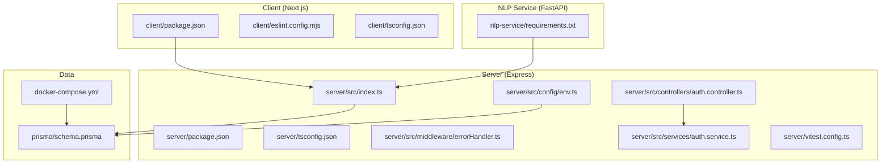
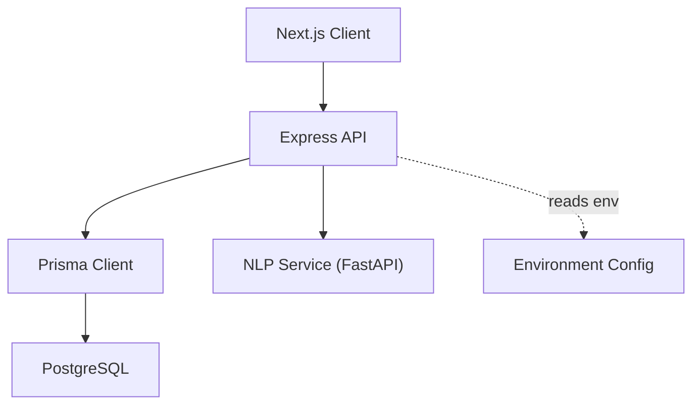
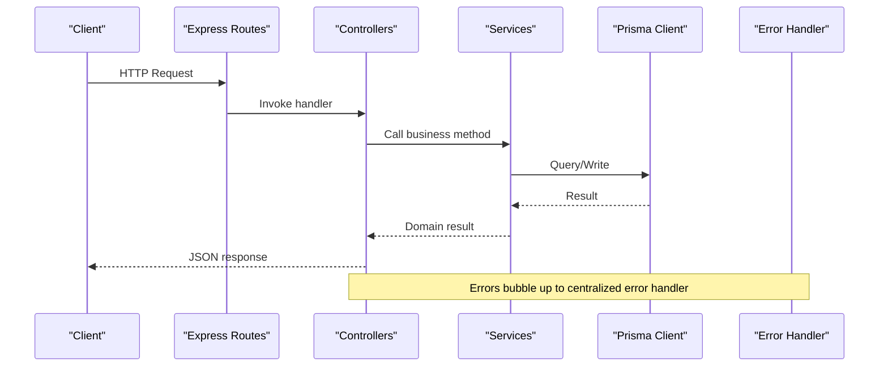
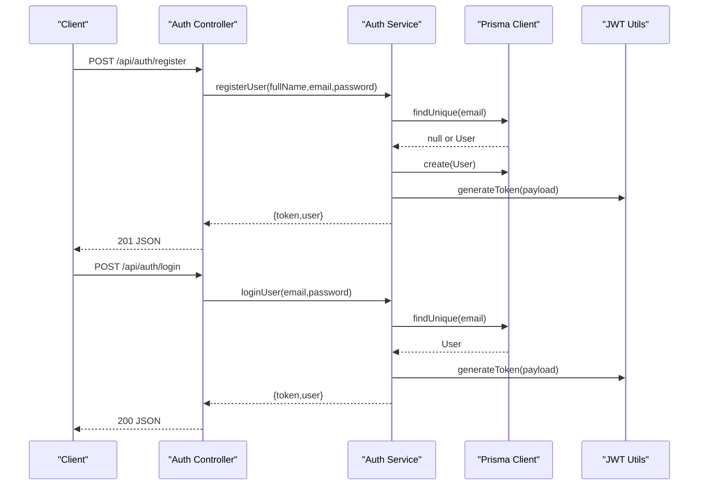
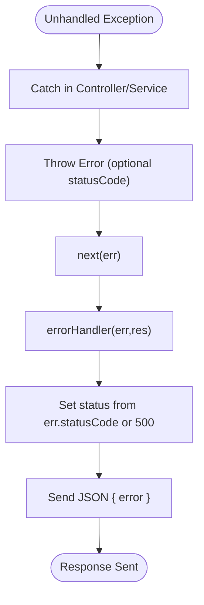
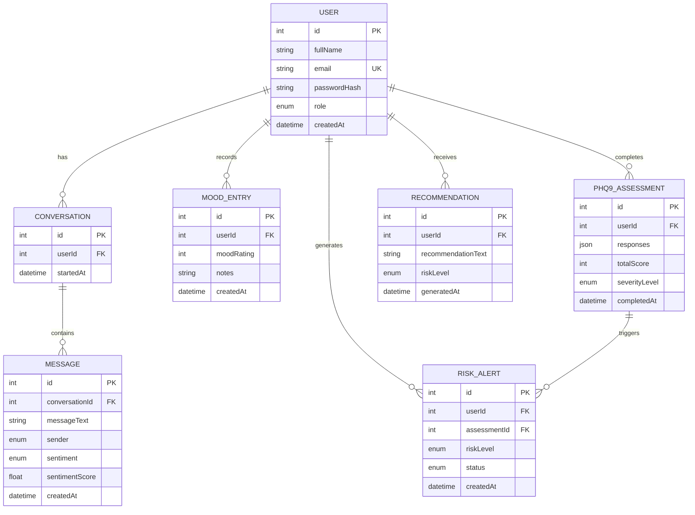
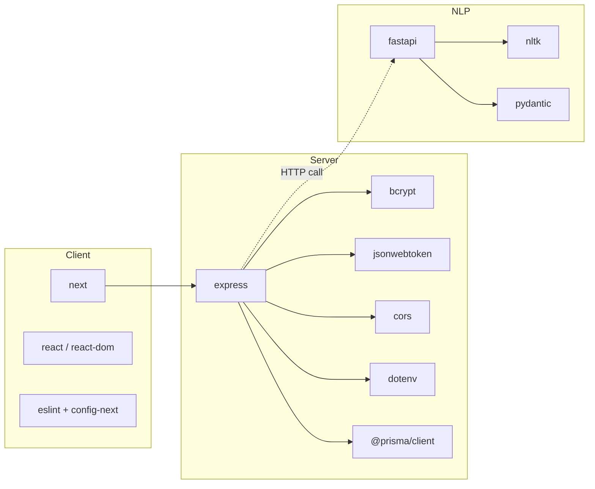

# Development Guidelines

<cite>
**Referenced Files in This Document**
- [README.md](file://README.md)
- [requirements.md](file://requirements.md)
- [docker-compose.yml](file://docker-compose.yml)
- [prisma/schema.prisma](file://prisma/schema.prisma)
- [client/package.json](file://client/package.json)
- [client/eslint.config.mjs](file://client/eslint.config.mjs)
- [client/tsconfig.json](file://client/tsconfig.json)
- [server/package.json](file://server/package.json)
- [server/tsconfig.json](file://server/tsconfig.json)
- [server/src/index.ts](file://server/src/index.ts)
- [server/src/config/env.ts](file://server/src/config/env.ts)
- [server/src/middleware/errorHandler.ts](file://server/src/middleware/errorHandler.ts)
- [server/src/controllers/auth.controller.ts](file://server/src/controllers/auth.controller.ts)
- [server/src/services/auth.service.ts](file://server/src/services/auth.service.ts)
- [server/vitest.config.ts](file://server/vitest.config.ts)
- [nlp-service/requirements.txt](file://nlp-service/requirements.txt)
</cite>

## Table of Contents
1. [Introduction](#introduction)
2. [Project Structure](#project-structure)
3. [Core Components](#core-components)
4. [Architecture Overview](#architecture-overview)
5. [Detailed Component Analysis](#detailed-component-analysis)
6. [Dependency Analysis](#dependency-analysis)
7. [Performance Considerations](#performance-considerations)
8. [Troubleshooting Guide](#troubleshooting-guide)
9. [Security Coding Practices](#security-coding-practices)
10. [Accessibility Requirements](#accessibility-requirements)
11. [Internationalization Considerations](#internationalization-considerations)
12. [Testing Requirements](#testing-requirements)
13. [Documentation Standards](#documentation-standards)
14. [Commit Message Conventions](#commit-message-conventions)
15. [Branch Management and Pull Request Procedures](#branch-management-and-pull-request-procedures)
16. [Extending the System and Maintaining Backward Compatibility](#extending-the-system-and-maintaining-backward-compatibility)
17. [Conclusion](#conclusion)

## Introduction
This document provides comprehensive development guidelines for the BuddyAI project, covering code standards, best practices, contribution workflows, architectural patterns, testing, documentation, and operational conventions. It consolidates the current state of the codebase and outlines consistent practices for TypeScript across the frontend and backend, ESLint configuration, Prisma schema conventions, and backend MVC-style structure with explicit error handling.

## Project Structure
The repository follows a multi-repository-like structure with three primary areas:
- client: Next.js application with React and TypeScript
- server: Express-based backend with TypeScript and Vitest tests
- nlp-service: Python FastAPI service for sentiment analysis
- prisma: Database schema definition
- docker-compose: Local database provisioning

**Diagram sources**
- [client/package.json:1-27](file://client/package.json#L1-L27)
- [client/eslint.config.mjs:1-19](file://client/eslint.config.mjs#L1-L19)
- [client/tsconfig.json:1-35](file://client/tsconfig.json#L1-L35)
- [server/package.json:1-36](file://server/package.json#L1-L36)
- [server/tsconfig.json:1-19](file://server/tsconfig.json#L1-L19)
- [server/src/index.ts:1-35](file://server/src/index.ts#L1-L35)
- [server/src/config/env.ts:1-12](file://server/src/config/env.ts#L1-L12)
- [server/src/middleware/errorHandler.ts:1-13](file://server/src/middleware/errorHandler.ts#L1-L13)
- [server/src/controllers/auth.controller.ts:1-50](file://server/src/controllers/auth.controller.ts#L1-L50)
- [server/src/services/auth.service.ts:1-72](file://server/src/services/auth.service.ts#L1-L72)
- [server/vitest.config.ts:1-10](file://server/vitest.config.ts#L1-L10)
- [nlp-service/requirements.txt:1-6](file://nlp-service/requirements.txt#L1-L6)
- [prisma/schema.prisma:1-134](file://prisma/schema.prisma#L1-L134)
- [docker-compose.yml:1-19](file://docker-compose.yml#L1-L19)

**Section sources**
- [README.md:125-210](file://README.md#L125-L210)
- [client/package.json:1-27](file://client/package.json#L1-L27)
- [server/package.json:1-36](file://server/package.json#L1-L36)
- [nlp-service/requirements.txt:1-6](file://nlp-service/requirements.txt#L1-L6)
- [prisma/schema.prisma:1-134](file://prisma/schema.prisma#L1-L134)
- [docker-compose.yml:1-19](file://docker-compose.yml#L1-L19)

## Core Components
- Frontend (client)
  - Next.js 16 with React 19 and TypeScript strict mode
  - ESLint configured via eslint-config-next with custom ignores
  - Tailwind CSS v4 and ShadCN UI for styling and components
- Backend (server)
  - Express 4 with TypeScript strict mode
  - Prisma ORM for PostgreSQL
  - JWT-based authentication and bcrypt password hashing
  - Centralized error handling middleware
  - Vitest for unit/integration tests
- NLP Service
  - FastAPI with NLTK and Pydantic for sentiment analysis
- Database
  - PostgreSQL with Prisma schema defining enums and relations

**Section sources**
- [README.md:86-123](file://README.md#L86-L123)
- [client/package.json:11-25](file://client/package.json#L11-L25)
- [client/eslint.config.mjs:1-19](file://client/eslint.config.mjs#L1-L19)
- [client/tsconfig.json:7-14](file://client/tsconfig.json#L7-L14)
- [server/package.json:13-34](file://server/package.json#L13-L34)
- [server/tsconfig.json:7-14](file://server/tsconfig.json#L7-L14)
- [server/src/middleware/errorHandler.ts:1-13](file://server/src/middleware/errorHandler.ts#L1-L13)
- [prisma/schema.prisma:1-134](file://prisma/schema.prisma#L1-L134)
- [nlp-service/requirements.txt:1-6](file://nlp-service/requirements.txt#L1-L6)

## Architecture Overview
BuddyAI follows a multi-tier architecture:
- Presentation Layer: Next.js web UI
- Backend Layer: Express REST APIs
- NLP Layer: FastAPI service for sentiment analysis
- Data Layer: PostgreSQL via Prisma

**Diagram sources**
- [server/src/index.ts:1-35](file://server/src/index.ts#L1-L35)
- [server/src/config/env.ts:1-12](file://server/src/config/env.ts#L1-L12)
- [prisma/schema.prisma:1-134](file://prisma/schema.prisma#L1-L134)
- [nlp-service/requirements.txt:1-6](file://nlp-service/requirements.txt#L1-L6)

**Section sources**
- [README.md:125-210](file://README.md#L125-L210)
- [server/src/index.ts:1-35](file://server/src/index.ts#L1-L35)
- [server/src/config/env.ts:1-12](file://server/src/config/env.ts#L1-L12)

## Detailed Component Analysis

### MVC Structure and Dependency Flow
The backend follows an MVC-like structure:
- Routes mount controller handlers
- Controllers delegate to Services
- Services interact with Prisma client
- Middleware handles cross-cutting concerns (CORS, JSON parsing, error handling)

**Diagram sources**
- [server/src/index.ts:1-35](file://server/src/index.ts#L1-L35)
- [server/src/controllers/auth.controller.ts:1-50](file://server/src/controllers/auth.controller.ts#L1-L50)
- [server/src/services/auth.service.ts:1-72](file://server/src/services/auth.service.ts#L1-L72)
- [server/src/middleware/errorHandler.ts:1-13](file://server/src/middleware/errorHandler.ts#L1-L13)

**Section sources**
- [server/src/index.ts:1-35](file://server/src/index.ts#L1-L35)
- [server/src/controllers/auth.controller.ts:1-50](file://server/src/controllers/auth.controller.ts#L1-L50)
- [server/src/services/auth.service.ts:1-72](file://server/src/services/auth.service.ts#L1-L72)
- [server/src/middleware/errorHandler.ts:1-13](file://server/src/middleware/errorHandler.ts#L1-L13)

### Authentication Flow

**Diagram sources**
- [server/src/controllers/auth.controller.ts:1-50](file://server/src/controllers/auth.controller.ts#L1-L50)
- [server/src/services/auth.service.ts:1-72](file://server/src/services/auth.service.ts#L1-L72)

**Section sources**
- [server/src/controllers/auth.controller.ts:1-50](file://server/src/controllers/auth.controller.ts#L1-L50)
- [server/src/services/auth.service.ts:1-72](file://server/src/services/auth.service.ts#L1-L72)

### Error Handling Convention
- Centralized Express error handler responds with JSON containing an error message and inferred status code
- Services and controllers can throw errors with optional statusCode to influence response status

**Diagram sources**
- [server/src/middleware/errorHandler.ts:1-13](file://server/src/middleware/errorHandler.ts#L1-L13)

**Section sources**
- [server/src/middleware/errorHandler.ts:1-13](file://server/src/middleware/errorHandler.ts#L1-L13)

### Database Schema Overview
The Prisma schema defines core entities and enums for roles, sentiments, sender types, severity levels, risk levels, and alert statuses, with relations between users, conversations, messages, assessments, recommendations, and risk alerts.

**Diagram sources**
- [prisma/schema.prisma:1-134](file://prisma/schema.prisma#L1-L134)

**Section sources**
- [prisma/schema.prisma:1-134](file://prisma/schema.prisma#L1-L134)

## Dependency Analysis
- Frontend
  - Dependencies: next, react, react-dom
  - Dev dependencies: typescript, eslint, tailwindcss, @types/*
- Backend
  - Dependencies: express, bcrypt, cors, dotenv, jsonwebtoken, @prisma/client
  - Dev dependencies: typescript, vitest, ts-node, nodemon, prisma, @types/*
- NLP Service
  - Dependencies: fastapi, uvicorn, nltk, pydantic, python-dotenv

**Diagram sources**
- [client/package.json:11-25](file://client/package.json#L11-L25)
- [server/package.json:13-34](file://server/package.json#L13-L34)
- [nlp-service/requirements.txt:1-6](file://nlp-service/requirements.txt#L1-L6)

**Section sources**
- [client/package.json:1-27](file://client/package.json#L1-L27)
- [server/package.json:1-36](file://server/package.json#L1-L36)
- [nlp-service/requirements.txt:1-6](file://nlp-service/requirements.txt#L1-L6)

## Performance Considerations
- Use Prisma’s generated client for type-safe queries and leverage database indexes defined in the schema
- Keep TypeScript strict mode enabled to catch performance-related issues early
- Minimize payload sizes in API responses and avoid sending sensitive fields unintentionally
- Cache non-sensitive computed results where appropriate and invalidate on data changes
- Ensure database connections are reused and environment variables are loaded once per process

[No sources needed since this section provides general guidance]

## Troubleshooting Guide
- Health endpoint
  - Verify server availability via GET /health
- Environment configuration
  - Confirm DATABASE_URL, JWT_SECRET, PORT, and NLP_SERVICE_URL are set
- Error responses
  - Centralized error handler returns JSON with error message and status code
- Testing
  - Run tests with Vitest and adjust timeouts as needed

**Section sources**
- [server/src/index.ts:18-20](file://server/src/index.ts#L18-L20)
- [server/src/config/env.ts:1-12](file://server/src/config/env.ts#L1-L12)
- [server/src/middleware/errorHandler.ts:1-13](file://server/src/middleware/errorHandler.ts#L1-L13)
- [server/vitest.config.ts:1-10](file://server/vitest.config.ts#L1-L10)

## Security Coding Practices
- Authentication
  - Use bcrypt for password hashing and jsonwebtoken for secure tokens
- Authorization
  - Enforce role-based access control and protect endpoints with middleware
- Secrets
  - Load secrets via dotenv and avoid committing sensitive values
- CORS
  - Configure CORS appropriately for deployment environments
- Data Protection
  - Never return hashed passwords; sanitize responses before sending

**Section sources**
- [server/src/services/auth.service.ts:1-72](file://server/src/services/auth.service.ts#L1-L72)
- [server/src/config/env.ts:1-12](file://server/src/config/env.ts#L1-L12)
- [server/src/index.ts:15-16](file://server/src/index.ts#L15-L16)

## Accessibility Requirements
- Semantic HTML and ARIA attributes in UI components
- Keyboard navigation and focus management
- Sufficient color contrast and readable font sizes
- Screen reader compatibility for dynamic content updates

[No sources needed since this section provides general guidance]

## Internationalization Considerations
- Centralize text strings and use locale-aware formatting
- Support right-to-left languages if needed
- Avoid hardcoded strings in components; externalize to translation files

[No sources needed since this section provides general guidance]

## Testing Requirements
- Unit and integration tests with Vitest
- Test coverage for critical business logic (services)
- Mock external dependencies (e.g., NLP service) during tests
- Use descriptive test names and assertions aligned with requirements

**Section sources**
- [server/vitest.config.ts:1-10](file://server/vitest.config.ts#L1-L10)
- [requirements.md:257-321](file://requirements.md#L257-L321)

## Documentation Standards
- Keep README.md up to date with architecture, runtime behavior, and data flow
- Document API endpoints, request/response schemas, and error codes
- Maintain Prisma schema comments and ERD diagrams for stakeholders
- Add inline comments for complex logic and decisions

**Section sources**
- [README.md:125-210](file://README.md#L125-L210)
- [prisma/schema.prisma:1-134](file://prisma/schema.prisma#L1-L134)

## Commit Message Conventions
- Use imperative mood: “Add feature”, “Fix bug”
- Keep subject concise (< 50 chars), explain motivation and effects
- Reference issue numbers where applicable

[No sources needed since this section provides general guidance]

## Branch Management and Pull Request Procedures
- Feature branches per task; rebase or merge main before opening PR
- Include tests and documentation updates with feature changes
- Assign reviewers; address comments promptly
- Squash or rebase commits prior to merging

[No sources needed since this section provides general guidance]

## Extending the System and Maintaining Backward Compatibility
- Follow existing folder and file naming conventions
- Add new routes, controllers, services, and database models consistently
- Preserve API response shapes and deprecate fields gracefully
- Update Prisma schema migrations and keep seed data synchronized

**Section sources**
- [server/src/index.ts:22-28](file://server/src/index.ts#L22-L28)
- [prisma/schema.prisma:1-134](file://prisma/schema.prisma#L1-L134)

## Conclusion
These guidelines consolidate the current state of the BuddyAI codebase and establish consistent practices for TypeScript development, architecture, testing, documentation, and collaboration. By adhering to these standards, contributors can ensure maintainability, security, and scalability across the frontend, backend, and NLP components.