# API Integration

<cite>
**Referenced Files in This Document**
- [api.ts](file://client/src/lib/api.ts)
- [auth.ts](file://client/src/lib/auth.ts)
- [page.tsx (Chat)](file://client/src/app/chat/page.tsx)
- [page.tsx (Dashboard)](file://client/src/app/dashboard/page.tsx)
- [page.tsx (Mood)](file://client/src/app/mood/page.tsx)
- [page.tsx (Login)](file://client/src/app/login/page.tsx)
- [page.tsx (Register)](file://client/src/app/register/page.tsx)
- [auth.routes.ts](file://server/src/routes/auth.routes.ts)
- [chat.routes.ts](file://server/src/routes/chat.routes.ts)
- [auth.controller.ts](file://server/src/controllers/auth.controller.ts)
- [chat.controller.ts](file://server/src/controllers/chat.controller.ts)
- [chat.service.ts](file://server/src/services/chat.service.ts)
- [auth.middleware.ts](file://server/src/middleware/auth.ts)
- [error.handler.ts](file://server/src/middleware/errorHandler.ts)
</cite>

## Table of Contents
1. [Introduction](#introduction)
2. [Project Structure](#project-structure)
3. [Core Components](#core-components)
4. [Architecture Overview](#architecture-overview)
5. [Detailed Component Analysis](#detailed-component-analysis)
6. [Dependency Analysis](#dependency-analysis)
7. [Performance Considerations](#performance-considerations)
8. [Troubleshooting Guide](#troubleshooting-guide)
9. [Conclusion](#conclusion)
10. [Appendices](#appendices)

## Introduction
This document explains the API integration layer for the client application, focusing on the HTTP client implementation, data fetching patterns, authentication, protected routes, and real-time-like messaging behavior. It also covers form submission workflows, optimistic updates, error handling, loading states, security considerations, CORS, and performance optimization strategies grounded in the existing codebase.

## Project Structure
The API integration spans two primary areas:
- Client-side HTTP client and utilities for authentication and data fetching
- Server-side routes, controllers, middleware, and services that expose REST endpoints

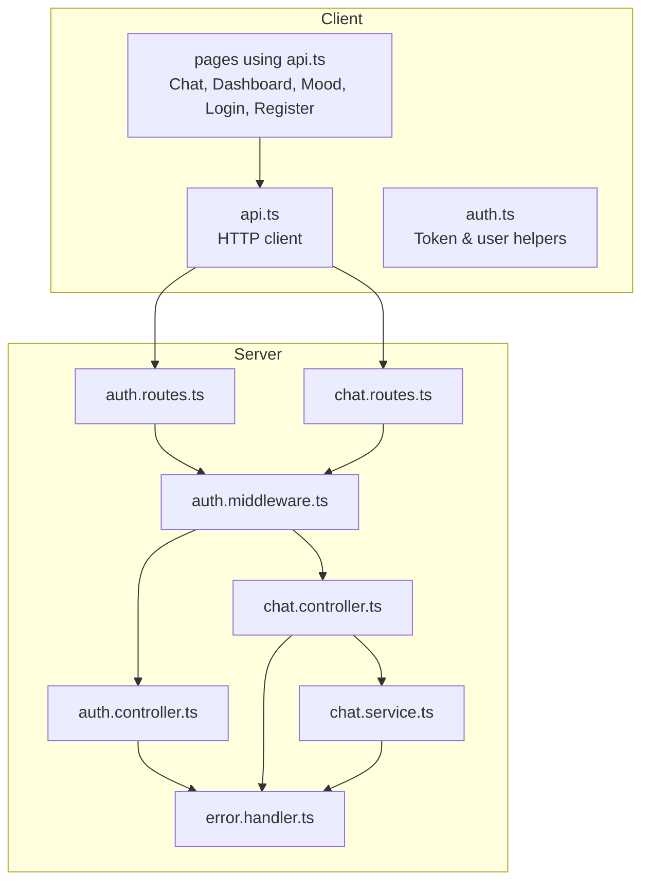

**Diagram sources**
- [api.ts](file://client/src/lib/api.ts)
- [auth.ts](file://client/src/lib/auth.ts)
- [page.tsx (Chat)](file://client/src/app/chat/page.tsx)
- [page.tsx (Dashboard)](file://client/src/app/dashboard/page.tsx)
- [page.tsx (Mood)](file://client/src/app/mood/page.tsx)
- [page.tsx (Login)](file://client/src/app/login/page.tsx)
- [page.tsx (Register)](file://client/src/app/register/page.tsx)
- [auth.routes.ts](file://server/src/routes/auth.routes.ts)
- [chat.routes.ts](file://server/src/routes/chat.routes.ts)
- [auth.controller.ts](file://server/src/controllers/auth.controller.ts)
- [chat.controller.ts](file://server/src/controllers/chat.controller.ts)
- [chat.service.ts](file://server/src/services/chat.service.ts)
- [auth.middleware.ts](file://server/src/middleware/auth.ts)
- [error.handler.ts](file://server/src/middleware/errorHandler.ts)

**Section sources**
- [api.ts](file://client/src/lib/api.ts)
- [auth.ts](file://client/src/lib/auth.ts)
- [auth.routes.ts](file://server/src/routes/auth.routes.ts)
- [chat.routes.ts](file://server/src/routes/chat.routes.ts)
- [auth.controller.ts](file://server/src/controllers/auth.controller.ts)
- [chat.controller.ts](file://server/src/controllers/chat.controller.ts)
- [chat.service.ts](file://server/src/services/chat.service.ts)
- [auth.middleware.ts](file://server/src/middleware/auth.ts)
- [error.handler.ts](file://server/src/middleware/errorHandler.ts)

## Core Components
- HTTP client: centralized request function that injects tokens, handles 401, parses JSON, and throws on non-OK responses
- Authentication utilities: manage token and user data in local storage and expose helpers for protected routes
- Page components: demonstrate data fetching, optimistic updates, loading states, and error handling
- Server routes/controllers/services: define endpoints, enforce authentication, and implement business logic

Key responsibilities:
- Base URL configuration via environment variable
- Authorization header injection for authenticated requests
- Centralized error handling and redirect on unauthorized responses
- Token persistence and retrieval for protected pages
- Optimistic UI updates during form submissions

**Section sources**
- [api.ts](file://client/src/lib/api.ts)
- [auth.ts](file://client/src/lib/auth.ts)
- [page.tsx (Chat)](file://client/src/app/chat/page.tsx)
- [page.tsx (Dashboard)](file://client/src/app/dashboard/page.tsx)
- [page.tsx (Mood)](file://client/src/app/mood/page.tsx)
- [page.tsx (Login)](file://client/src/app/login/page.tsx)
- [page.tsx (Register)](file://client/src/app/register/page.tsx)

## Architecture Overview
The client invokes server endpoints through a thin HTTP wrapper. Authentication middleware validates tokens and attaches user context to requests. Controllers orchestrate service calls and return structured JSON responses. Error handling ensures consistent error payloads.

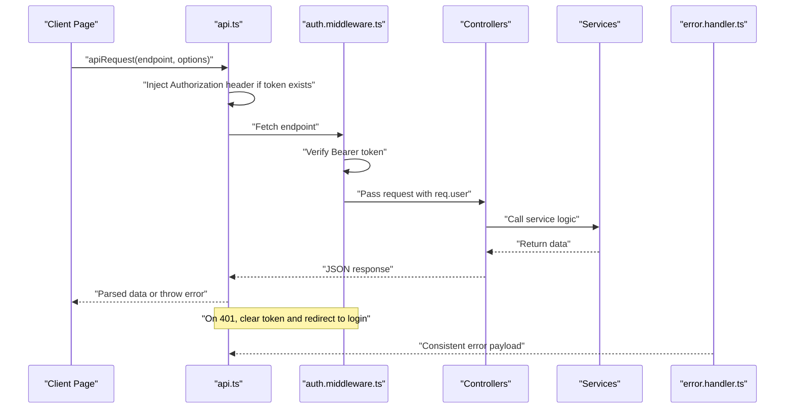

**Diagram sources**
- [api.ts](file://client/src/lib/api.ts)
- [auth.middleware.ts](file://server/src/middleware/auth.ts)
- [auth.controller.ts](file://server/src/controllers/auth.controller.ts)
- [chat.controller.ts](file://server/src/controllers/chat.controller.ts)
- [chat.service.ts](file://server/src/services/chat.service.ts)
- [error.handler.ts](file://server/src/middleware/errorHandler.ts)

## Detailed Component Analysis

### HTTP Client: api.ts
- Base URL resolution from environment variable
- Authorization header injection using stored token
- Centralized 401 handling: clears token and redirects to login
- JSON parsing and error propagation for non-OK responses
- Extensible via RequestInit options for method, headers, and body

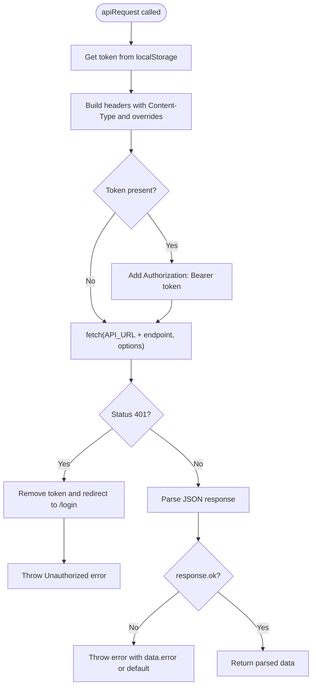

**Diagram sources**
- [api.ts](file://client/src/lib/api.ts)

**Section sources**
- [api.ts](file://client/src/lib/api.ts)

### Authentication Utilities: auth.ts
- Token management: get, set, remove token
- User profile management: get/set user object in localStorage
- isAuthenticated helper for protected routes

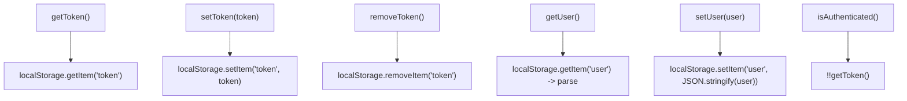

**Diagram sources**
- [auth.ts](file://client/src/lib/auth.ts)

**Section sources**
- [auth.ts](file://client/src/lib/auth.ts)

### Protected Routes and Redirects
- Pages check authentication and redirect unauthenticated users to login
- Dashboard enforces role-based routing and guards against counselors accessing student dashboard

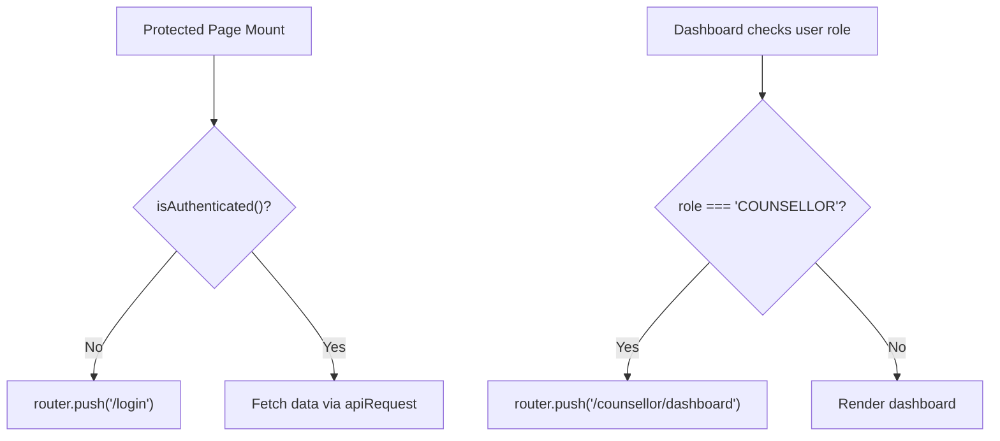

**Diagram sources**
- [page.tsx (Dashboard)](file://client/src/app/dashboard/page.tsx)
- [page.tsx (Chat)](file://client/src/app/chat/page.tsx)

**Section sources**
- [page.tsx (Dashboard)](file://client/src/app/dashboard/page.tsx)
- [page.tsx (Chat)](file://client/src/app/chat/page.tsx)

### Form Submission Workflows and Optimistic Updates
- Login and Registration: submit credentials, receive token and user, persist via auth utilities, navigate based on role
- Mood logging: validate selection, submit POST, show success, refresh lists optimistically after re-fetch
- Chat: create conversation if needed, POST message, append user and bot messages optimistically, scroll to bottom

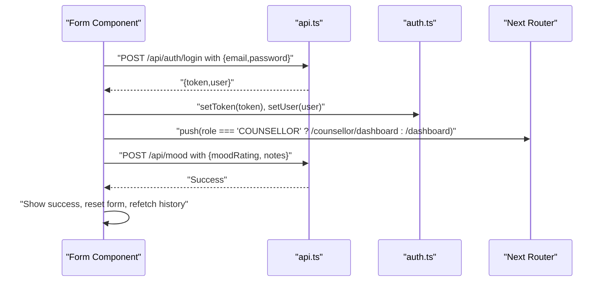

**Diagram sources**
- [page.tsx (Login)](file://client/src/app/login/page.tsx)
- [page.tsx (Register)](file://client/src/app/register/page.tsx)
- [page.tsx (Mood)](file://client/src/app/mood/page.tsx)
- [api.ts](file://client/src/lib/api.ts)
- [auth.ts](file://client/src/lib/auth.ts)

**Section sources**
- [page.tsx (Login)](file://client/src/app/login/page.tsx)
- [page.tsx (Register)](file://client/src/app/register/page.tsx)
- [page.tsx (Mood)](file://client/src/app/mood/page.tsx)
- [api.ts](file://client/src/lib/api.ts)
- [auth.ts](file://client/src/lib/auth.ts)

### Real-Time Communication for Chat
- Current behavior: client-driven polling via apiRequest for conversations and messages
- Real-time enhancement suggestion: integrate WebSocket connection to receive live updates for new messages and bot responses
- Benefits: reduced latency, fewer unnecessary requests, improved UX for ongoing conversations

Note: The current implementation does not establish a WebSocket connection. The following diagram illustrates a recommended architecture for adding WebSockets.

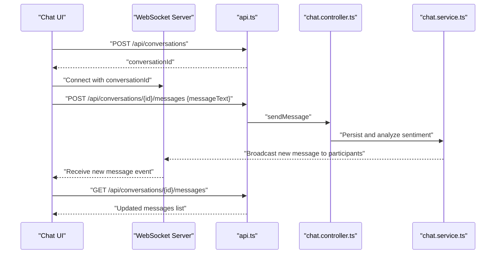

**Diagram sources**
- [page.tsx (Chat)](file://client/src/app/chat/page.tsx)
- [api.ts](file://client/src/lib/api.ts)
- [chat.controller.ts](file://server/src/controllers/chat.controller.ts)
- [chat.service.ts](file://server/src/services/chat.service.ts)

**Section sources**
- [page.tsx (Chat)](file://client/src/app/chat/page.tsx)
- [api.ts](file://client/src/lib/api.ts)
- [chat.controller.ts](file://server/src/controllers/chat.controller.ts)
- [chat.service.ts](file://server/src/services/chat.service.ts)

### Data Validation and Error Management
- Client-side validation: form components validate inputs before submission
- Centralized error handling: api.ts throws on non-OK responses; pages catch and display user-friendly messages
- Server-side validation: controllers validate request bodies and respond with structured errors
- Consistent error payload: error handler returns JSON with an error field

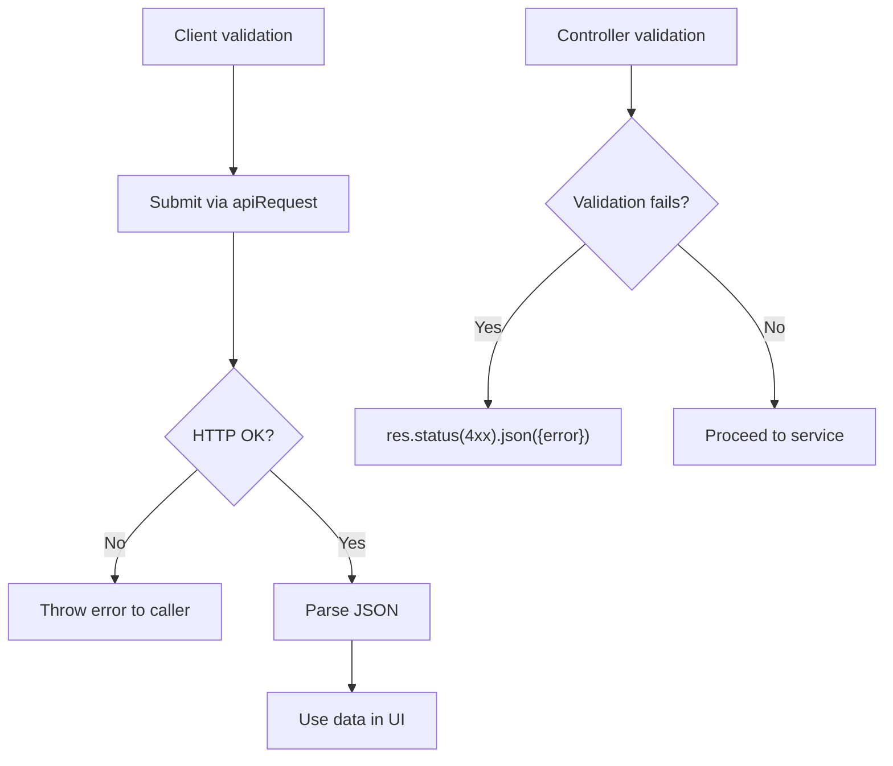

**Diagram sources**
- [page.tsx (Mood)](file://client/src/app/mood/page.tsx)
- [auth.controller.ts](file://server/src/controllers/auth.controller.ts)
- [error.handler.ts](file://server/src/middleware/errorHandler.ts)
- [api.ts](file://client/src/lib/api.ts)

**Section sources**
- [page.tsx (Mood)](file://client/src/app/mood/page.tsx)
- [auth.controller.ts](file://server/src/controllers/auth.controller.ts)
- [error.handler.ts](file://server/src/middleware/errorHandler.ts)
- [api.ts](file://client/src/lib/api.ts)

### Loading State Management
- Pages set loading states while fetching initial data
- Dashboard uses Promise.allSettled to fetch multiple resources concurrently and update UI progressively
- Chat uses separate loading and sending flags for distinct operations

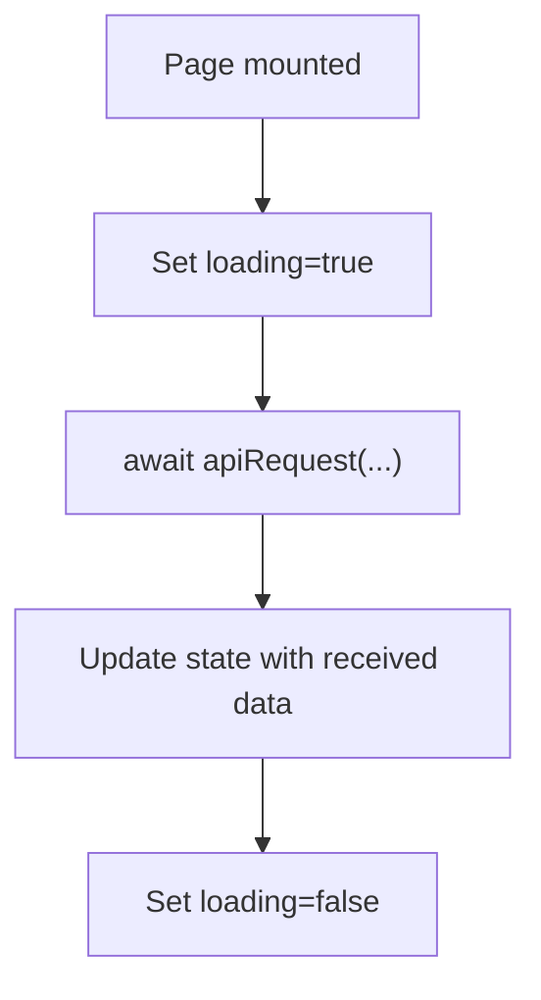

**Diagram sources**
- [page.tsx (Dashboard)](file://client/src/app/dashboard/page.tsx)
- [page.tsx (Chat)](file://client/src/app/chat/page.tsx)

**Section sources**
- [page.tsx (Dashboard)](file://client/src/app/dashboard/page.tsx)
- [page.tsx (Chat)](file://client/src/app/chat/page.tsx)

### API Mocking for Development
- Strategy: replace apiRequest with a mock implementation that returns predefined fixtures for endpoints
- Benefits: faster iteration, deterministic UI states, testing without backend connectivity
- Implementation tip: wrap fetch with a configurable transport so apiRequest can be swapped during tests or dev builds

[No sources needed since this section provides general guidance]

### Security Considerations
- Authentication: Bearer tokens are attached automatically; middleware verifies tokens and rejects invalid/expired ones
- Protected routes: server routes require authentication; clients guard routes and redirect unauthenticated users
- CORS: configure server to allow client origin; avoid wildcard origins in production
- Input sanitization: validate and sanitize inputs on the server; avoid XSS by rendering user content safely
- Token storage: localStorage is convenient but consider HttpOnly cookies for sensitive environments

**Section sources**
- [auth.middleware.ts](file://server/src/middleware/auth.ts)
- [auth.routes.ts](file://server/src/routes/auth.routes.ts)
- [page.tsx (Chat)](file://client/src/app/chat/page.tsx)
- [page.tsx (Dashboard)](file://client/src/app/dashboard/page.tsx)

### CORS Handling
- Configure Express to whitelist the client origin and set appropriate headers
- Ensure preflight OPTIONS requests are handled for cross-origin requests
- Avoid permissive defaults; restrict methods and headers to what the client needs

[No sources needed since this section provides general guidance]

## Dependency Analysis
The client depends on api.ts and auth.ts for network and auth concerns. Pages depend on these utilities. On the server, routes depend on middleware for authentication and on controllers/services for business logic.

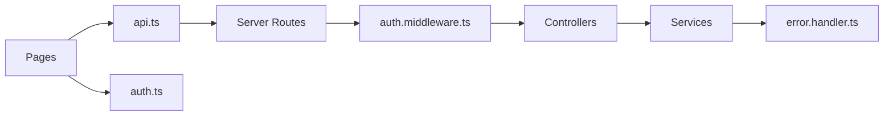

**Diagram sources**
- [api.ts](file://client/src/lib/api.ts)
- [auth.ts](file://client/src/lib/auth.ts)
- [auth.routes.ts](file://server/src/routes/auth.routes.ts)
- [chat.routes.ts](file://server/src/routes/chat.routes.ts)
- [auth.middleware.ts](file://server/src/middleware/auth.ts)
- [auth.controller.ts](file://server/src/controllers/auth.controller.ts)
- [chat.controller.ts](file://server/src/controllers/chat.controller.ts)
- [chat.service.ts](file://server/src/services/chat.service.ts)
- [error.handler.ts](file://server/src/middleware/errorHandler.ts)

**Section sources**
- [api.ts](file://client/src/lib/api.ts)
- [auth.ts](file://client/src/lib/auth.ts)
- [auth.routes.ts](file://server/src/routes/auth.routes.ts)
- [chat.routes.ts](file://server/src/routes/chat.routes.ts)
- [auth.middleware.ts](file://server/src/middleware/auth.ts)
- [auth.controller.ts](file://server/src/controllers/auth.controller.ts)
- [chat.controller.ts](file://server/src/controllers/chat.controller.ts)
- [chat.service.ts](file://server/src/services/chat.service.ts)
- [error.handler.ts](file://server/src/middleware/errorHandler.ts)

## Performance Considerations
- Concurrent data fetching: use Promise.allSettled to parallelize independent requests
- Minimize re-renders: memoize derived values and avoid unnecessary state updates
- Debounce or throttle rapid user actions (e.g., frequent keystrokes) when appropriate
- Optimize images and assets; lazy-load non-critical resources
- Consider caching strategies for infrequently changing data
- Monitor network requests and reduce payload sizes where possible

**Section sources**
- [page.tsx (Dashboard)](file://client/src/app/dashboard/page.tsx)
- [page.tsx (Mood)](file://client/src/app/mood/page.tsx)

## Troubleshooting Guide
Common issues and resolutions:
- Unauthorized access: 401 responses trigger token removal and redirect to login
- Network failures: api.ts throws on non-OK responses; catch and display user-friendly messages
- Server errors: error handler returns consistent JSON with error field
- Authentication middleware: missing or invalid Bearer token leads to 401 responses

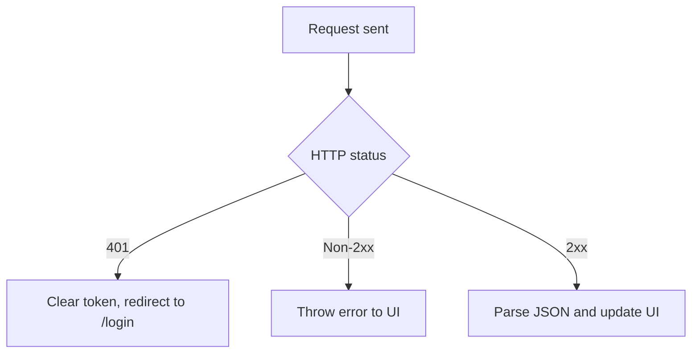

**Diagram sources**
- [api.ts](file://client/src/lib/api.ts)
- [auth.middleware.ts](file://server/src/middleware/auth.ts)
- [error.handler.ts](file://server/src/middleware/errorHandler.ts)

**Section sources**
- [api.ts](file://client/src/lib/api.ts)
- [auth.middleware.ts](file://server/src/middleware/auth.ts)
- [error.handler.ts](file://server/src/middleware/errorHandler.ts)

## Conclusion
The client’s API integration centers on a concise HTTP client and straightforward authentication utilities. Pages implement robust loading and error handling, optimistic updates for immediate feedback, and guarded access to protected routes. The server enforces authentication and provides structured responses. To enhance real-time capabilities, integrating WebSocket connections would improve responsiveness and user experience for chat interactions.

## Appendices
- Environment configuration: NEXT_PUBLIC_API_URL drives the base URL for API calls
- Endpoint coverage: authentication, chat conversations and messages, mood history and trends, risk and assessments

**Section sources**
- [api.ts](file://client/src/lib/api.ts)
- [auth.routes.ts](file://server/src/routes/auth.routes.ts)
- [chat.routes.ts](file://server/src/routes/chat.routes.ts)
- [page.tsx (Dashboard)](file://client/src/app/dashboard/page.tsx)
- [page.tsx (Mood)](file://client/src/app/mood/page.tsx)
- [page.tsx (Chat)](file://client/src/app/chat/page.tsx)