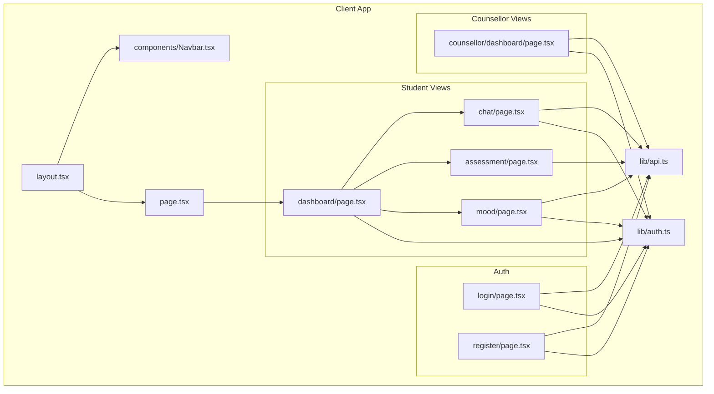
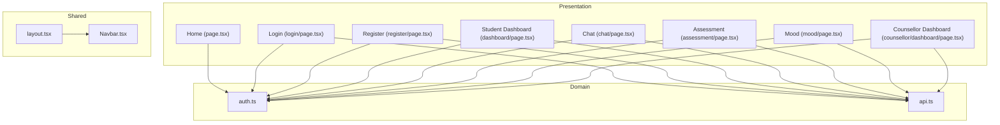
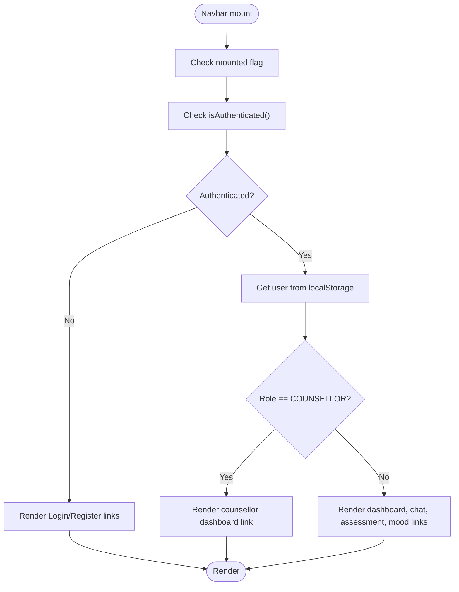
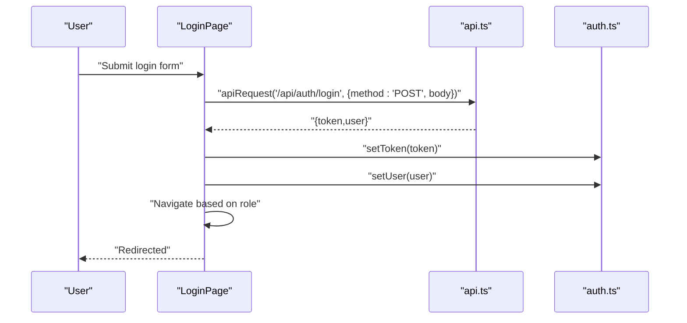
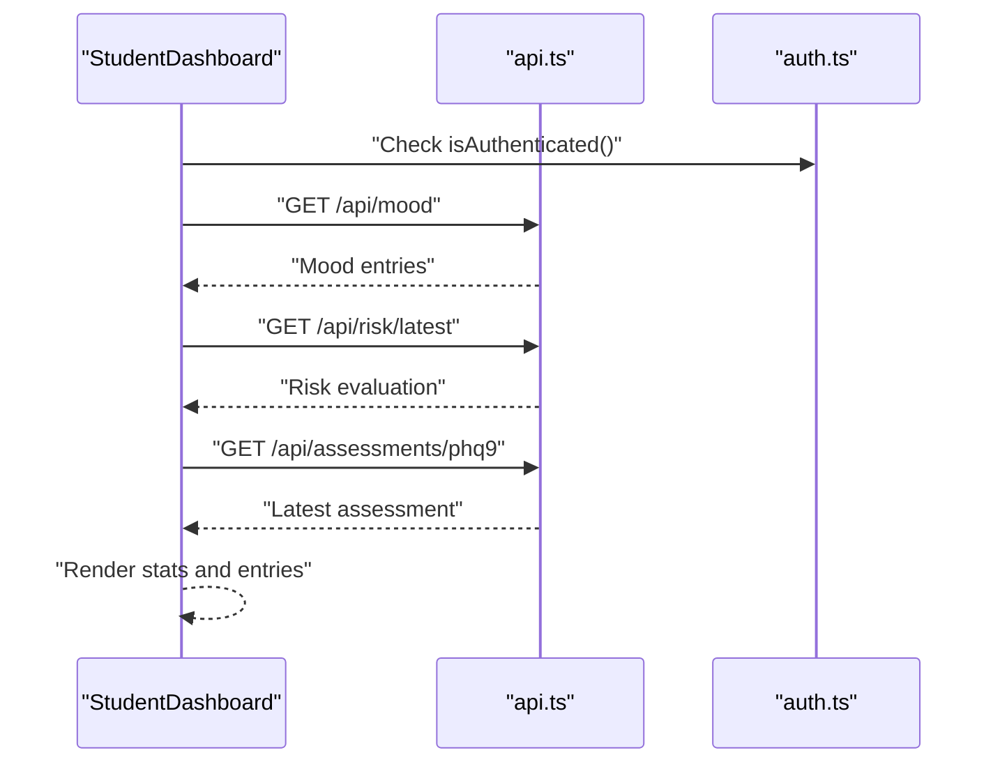
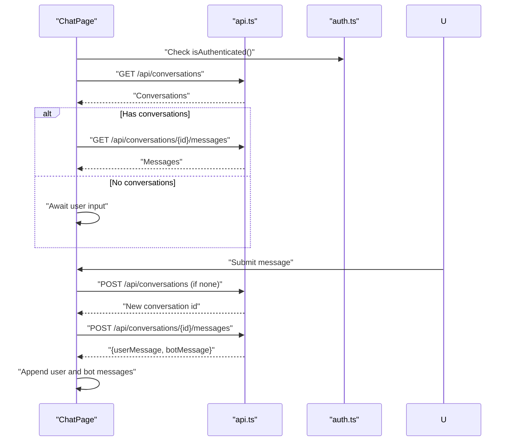
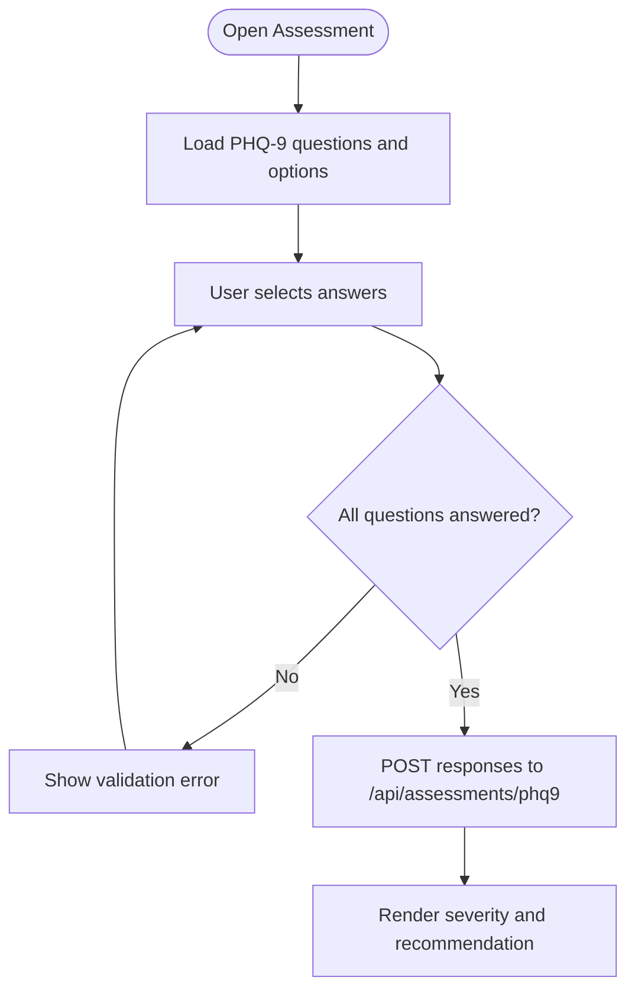
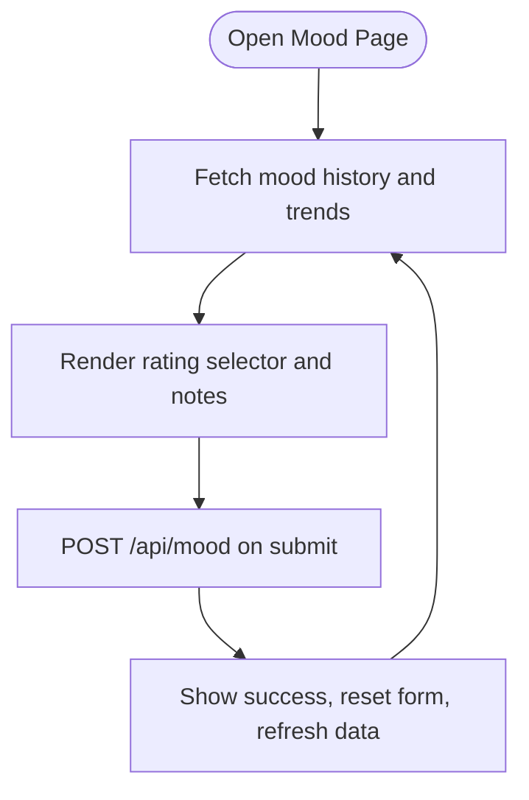
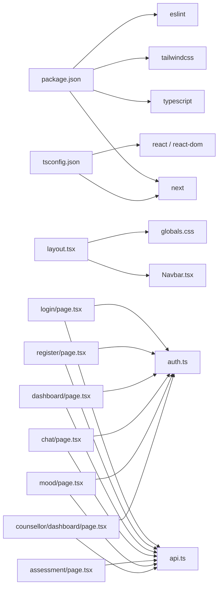

# Frontend Application

<cite>
**Referenced Files in This Document**
- [package.json](file://client/package.json)
- [tsconfig.json](file://client/tsconfig.json)
- [next.config.ts](file://client/next.config.ts)
- [layout.tsx](file://client/src/app/layout.tsx)
- [page.tsx](file://client/src/app/page.tsx)
- [login/page.tsx](file://client/src/app/login/page.tsx)
- [register/page.tsx](file://client/src/app/register/page.tsx)
- [dashboard/page.tsx](file://client/src/app/dashboard/page.tsx)
- [chat/page.tsx](file://client/src/app/chat/page.tsx)
- [assessment/page.tsx](file://client/src/app/assessment/page.tsx)
- [mood/page.tsx](file://client/src/app/mood/page.tsx)
- [counsellor/dashboard/page.tsx](file://client/src/app/counsellor/dashboard/page.tsx)
- [Navbar.tsx](file://client/src/components/Navbar.tsx)
- [auth.ts](file://client/src/lib/auth.ts)
- [api.ts](file://client/src/lib/api.ts)
</cite>

## Table of Contents
1. [Introduction](#introduction)
2. [Project Structure](#project-structure)
3. [Core Components](#core-components)
4. [Architecture Overview](#architecture-overview)
5. [Detailed Component Analysis](#detailed-component-analysis)
6. [Dependency Analysis](#dependency-analysis)
7. [Performance Considerations](#performance-considerations)
8. [Troubleshooting Guide](#troubleshooting-guide)
9. [Conclusion](#conclusion)
10. [Appendices](#appendices)

## Introduction
This document describes the frontend application built with Next.js App Router and React. It covers the application structure, routing configuration, component architecture, state management patterns, UI components (Navbar, authentication forms, chat interface, assessment forms, and dashboard layouts), styling strategy using Tailwind CSS, responsive design, accessibility considerations, API integration patterns, authentication flow, error handling strategies, TypeScript configuration, build process, and deployment considerations. Practical examples of component usage, form handling, and real-time-like chat functionality are included, along with performance optimization techniques, code splitting strategies, and browser compatibility requirements.

## Project Structure
The frontend is organized under the client directory using Next.js App Router conventions. Pages are grouped by feature under src/app, shared components live under src/components, and reusable utilities under src/lib. Global styles are centralized in src/app/globals.css, and the root layout wraps all pages with a global navigation bar.

Key characteristics:
- App Router with route groups for features (e.g., assessment, chat, dashboard, login, mood, register, counsellor)
- Shared client-side utilities for authentication and API requests
- Centralized layout with a global Navbar and metadata
- Strict TypeScript configuration with path aliases

**Diagram sources**
- [layout.tsx](file://client/src/app/layout.tsx)
- [page.tsx](file://client/src/app/page.tsx)
- [login/page.tsx](file://client/src/app/login/page.tsx)
- [register/page.tsx](file://client/src/app/register/page.tsx)
- [dashboard/page.tsx](file://client/src/app/dashboard/page.tsx)
- [chat/page.tsx](file://client/src/app/chat/page.tsx)
- [assessment/page.tsx](file://client/src/app/assessment/page.tsx)
- [mood/page.tsx](file://client/src/app/mood/page.tsx)
- [counsellor/dashboard/page.tsx](file://client/src/app/counsellor/dashboard/page.tsx)
- [Navbar.tsx](file://client/src/components/Navbar.tsx)
- [auth.ts](file://client/src/lib/auth.ts)
- [api.ts](file://client/src/lib/api.ts)

**Section sources**
- [layout.tsx](file://client/src/app/layout.tsx)
- [page.tsx](file://client/src/app/page.tsx)

## Core Components
- Global Layout and Navbar: The root layout injects fonts, global CSS, and renders a shared Navbar. The Navbar conditionally renders menu items based on user role and authentication state, and handles logout.
- Authentication Utilities: Token and user persistence helpers manage localStorage tokens and user metadata, and expose an isAuthenticated check.
- API Utility: A unified apiRequest helper centralizes HTTP calls, attaches Authorization headers when present, normalizes 401 responses into redirects, and throws descriptive errors for non-OK responses.

Practical usage examples:
- Redirecting unauthenticated users on home page load based on role
- Protecting student-only pages and redirecting to appropriate dashboards
- Using apiRequest to fetch dashboard stats, mood history, assessments, and chat conversations

**Section sources**
- [layout.tsx](file://client/src/app/layout.tsx)
- [Navbar.tsx](file://client/src/components/Navbar.tsx)
- [auth.ts](file://client/src/lib/auth.ts)
- [api.ts](file://client/src/lib/api.ts)
- [page.tsx](file://client/src/app/page.tsx)
- [dashboard/page.tsx](file://client/src/app/dashboard/page.tsx)

## Architecture Overview
The frontend follows a layered architecture:
- Presentation Layer: Page components under src/app implement UI and orchestrate data fetching
- Domain Layer: Page components coordinate with API utilities and authentication helpers
- Infrastructure Layer: API utility encapsulates HTTP communication and error normalization
- Shared Layer: Navbar and global layout provide cross-cutting concerns

**Diagram sources**
- [page.tsx](file://client/src/app/page.tsx)
- [login/page.tsx](file://client/src/app/login/page.tsx)
- [register/page.tsx](file://client/src/app/register/page.tsx)
- [dashboard/page.tsx](file://client/src/app/dashboard/page.tsx)
- [chat/page.tsx](file://client/src/app/chat/page.tsx)
- [assessment/page.tsx](file://client/src/app/assessment/page.tsx)
- [mood/page.tsx](file://client/src/app/mood/page.tsx)
- [counsellor/dashboard/page.tsx](file://client/src/app/counsellor/dashboard/page.tsx)
- [auth.ts](file://client/src/lib/auth.ts)
- [api.ts](file://client/src/lib/api.ts)
- [layout.tsx](file://client/src/app/layout.tsx)
- [Navbar.tsx](file://client/src/components/Navbar.tsx)

## Detailed Component Analysis

### Navigation Bar (Navbar)
Responsibilities:
- Render top navigation with branding and dynamic links
- Conditionally show student vs. counsellor menus
- Display authenticated user info and logout action
- Client-side hydration guard to avoid SSR mismatches

Implementation highlights:
- Uses next/navigation useRouter for programmatic navigation
- Reads user from localStorage via auth helpers
- Removes token and user data on logout and redirects to login

**Diagram sources**
- [Navbar.tsx](file://client/src/components/Navbar.tsx)
- [auth.ts](file://client/src/lib/auth.ts)

**Section sources**
- [Navbar.tsx](file://client/src/components/Navbar.tsx)
- [auth.ts](file://client/src/lib/auth.ts)

### Authentication Forms: Login and Register
Responsibilities:
- Capture credentials, submit via apiRequest, persist token and user, and navigate based on role
- Display user-friendly error messages and loading states

Key flows:
- Login: On submit, call POST /api/auth/login, store token and user, redirect to student or counsellor dashboard
- Register: On submit, call POST /api/auth/register, store token and user, redirect to student dashboard

**Diagram sources**
- [login/page.tsx](file://client/src/app/login/page.tsx)
- [api.ts](file://client/src/lib/api.ts)
- [auth.ts](file://client/src/lib/auth.ts)

**Section sources**
- [login/page.tsx](file://client/src/app/login/page.tsx)
- [register/page.tsx](file://client/src/app/register/page.tsx)
- [api.ts](file://client/src/lib/api.ts)
- [auth.ts](file://client/src/lib/auth.ts)

### Dashboard Layouts: Student and Counsellor
Student Dashboard:
- Fetches recent mood entries, latest risk evaluation, and latest PHQ-9 assessment concurrently
- Renders quick stats cards and recent mood entries
- Provides quick action links to chat, assessment, and mood tracker

Counsellor Dashboard:
- Fetches dashboard statistics and paginates/queries alerts by status and risk level
- Renders summary cards and a filtered list of alerts with status and risk badges

**Diagram sources**
- [dashboard/page.tsx](file://client/src/app/dashboard/page.tsx)
- [api.ts](file://client/src/lib/api.ts)
- [auth.ts](file://client/src/lib/auth.ts)

**Section sources**
- [dashboard/page.tsx](file://client/src/app/dashboard/page.tsx)
- [counsellor/dashboard/page.tsx](file://client/src/app/counsellor/dashboard/page.tsx)

### Chat Interface
Responsibilities:
- Load existing conversations and messages, or create a new conversation
- Send user messages and append user and bot responses to the UI
- Display typing indicators and scroll to the latest message

Real-time-like behavior:
- After sending, the UI immediately appends user and bot messages to the list
- Uses Promise.allSettled for concurrent loads to improve perceived performance

**Diagram sources**
- [chat/page.tsx](file://client/src/app/chat/page.tsx)
- [api.ts](file://client/src/lib/api.ts)
- [auth.ts](file://client/src/lib/auth.ts)

**Section sources**
- [chat/page.tsx](file://client/src/app/chat/page.tsx)

### Assessment Form (PHQ-9)
Responsibilities:
- Present nine questions with four response options per question
- Validate completeness before submission
- Submit responses to /api/assessments/phq9 and render severity classification and recommendation

**Diagram sources**
- [assessment/page.tsx](file://client/src/app/assessment/page.tsx)
- [api.ts](file://client/src/lib/api.ts)

**Section sources**
- [assessment/page.tsx](file://client/src/app/assessment/page.tsx)

### Mood Tracker
Responsibilities:
- Allow users to rate mood from 1–5 with emoji feedback
- Optionally add notes
- Fetch and display mood history and trends (average, total entries, trend direction)

**Diagram sources**
- [mood/page.tsx](file://client/src/app/mood/page.tsx)
- [api.ts](file://client/src/lib/api.ts)

**Section sources**
- [mood/page.tsx](file://client/src/app/mood/page.tsx)

## Dependency Analysis
- Routing: Next.js App Router organizes pages under src/app with nested route groups (e.g., /counsellor/dashboard)
- Component Coupling: Pages depend on auth.ts and api.ts; Navbar depends on auth.ts and next/navigation
- External Dependencies: Next.js runtime, React, Tailwind CSS v4, TypeScript, ESLint

**Diagram sources**
- [package.json](file://client/package.json)
- [tsconfig.json](file://client/tsconfig.json)
- [layout.tsx](file://client/src/app/layout.tsx)
- [login/page.tsx](file://client/src/app/login/page.tsx)
- [register/page.tsx](file://client/src/app/register/page.tsx)
- [dashboard/page.tsx](file://client/src/app/dashboard/page.tsx)
- [chat/page.tsx](file://client/src/app/chat/page.tsx)
- [assessment/page.tsx](file://client/src/app/assessment/page.tsx)
- [mood/page.tsx](file://client/src/app/mood/page.tsx)
- [counsellor/dashboard/page.tsx](file://client/src/app/counsellor/dashboard/page.tsx)
- [Navbar.tsx](file://client/src/components/Navbar.tsx)
- [auth.ts](file://client/src/lib/auth.ts)
- [api.ts](file://client/src/lib/api.ts)

**Section sources**
- [package.json](file://client/package.json)
- [tsconfig.json](file://client/tsconfig.json)

## Performance Considerations
- Concurrent Data Fetching: Pages use Promise.allSettled to parallelize independent API calls (e.g., dashboard stats, mood history, risk, assessments)
- Minimal Re-renders: Prefer local state for UI flags (loading, submitting) and avoid unnecessary props drilling
- Client-side Routing: next/navigation enables fast client transitions without full-page reloads
- Lazy Loading: For future enhancements, consider dynamic imports for heavy components or modals
- Code Splitting: Next.js automatically splits chunks; keep components modular to leverage automatic code splitting
- Rendering Optimizations: Memoize derived values (e.g., severity badges) and avoid heavy computations in render paths
- Network Resilience: apiRequest centralizes error handling; consider adding retry/backoff for critical flows

[No sources needed since this section provides general guidance]

## Troubleshooting Guide
Common issues and remedies:
- Unauthorized Access: apiRequest detects 401 and clears token, then redirects to login
- Form Validation Errors: Display localized error messages for incomplete forms (assessment, mood)
- Navigation Guards: Pages check isAuthenticated and role; redirect to login or appropriate dashboard
- LocalStorage Availability: auth.ts checks for window availability; ensure client-side usage for auth helpers
- API Failures: apiRequest throws descriptive errors; surface user-friendly messages and allow retry

**Section sources**
- [api.ts](file://client/src/lib/api.ts)
- [assessment/page.tsx](file://client/src/app/assessment/page.tsx)
- [mood/page.tsx](file://client/src/app/mood/page.tsx)
- [dashboard/page.tsx](file://client/src/app/dashboard/page.tsx)
- [auth.ts](file://client/src/lib/auth.ts)

## Conclusion
The frontend leverages Next.js App Router to deliver a structured, type-safe, and maintainable React application. Authentication and API utilities encapsulate cross-cutting concerns, while page components focus on user workflows. The design emphasizes responsive UI with Tailwind CSS, guarded navigation, and robust error handling. Future enhancements can include dynamic imports, caching strategies, and improved accessibility attributes.

[No sources needed since this section summarizes without analyzing specific files]

## Appendices

### Styling Strategy and Responsive Design
- Tailwind CSS v4 is configured via Tailwind PostCSS plugin; use utility classes for responsive breakpoints and component variants
- Global fonts are injected via Next Fonts; ensure consistent typography across components
- Responsive grids and spacing are used extensively (e.g., grid-cols-1 md:grid-cols-3)
- Accessibility: Prefer semantic HTML, labels for inputs, and focus-visible outlines; ensure sufficient color contrast for severity and risk badges

**Section sources**
- [layout.tsx](file://client/src/app/layout.tsx)
- [dashboard/page.tsx](file://client/src/app/dashboard/page.tsx)
- [assessment/page.tsx](file://client/src/app/assessment/page.tsx)
- [mood/page.tsx](file://client/src/app/mood/page.tsx)
- [counsellor/dashboard/page.tsx](file://client/src/app/counsellor/dashboard/page.tsx)

### TypeScript Configuration
- Target ES2017 with modern libs; strict mode enabled; noEmit to rely on Next’s type generation
- Bundler module resolution and isolatedModules for fast builds
- Path alias @/* mapped to ./src/*
- Includes Next’s generated types for app dir

**Section sources**
- [tsconfig.json](file://client/tsconfig.json)

### Build and Deployment Considerations
- Scripts: dev, build, start, lint
- Environment variables: NEXT_PUBLIC_API_URL consumed by api.ts
- Next config: empty default; configure advanced features (image optimization, headers, redirects) as needed
- Deployment: Build with next build, serve with next start; ensure environment variables are set in hosting platform

**Section sources**
- [package.json](file://client/package.json)
- [next.config.ts](file://client/next.config.ts)
- [api.ts](file://client/src/lib/api.ts)