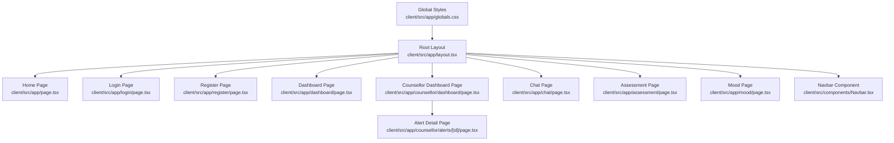
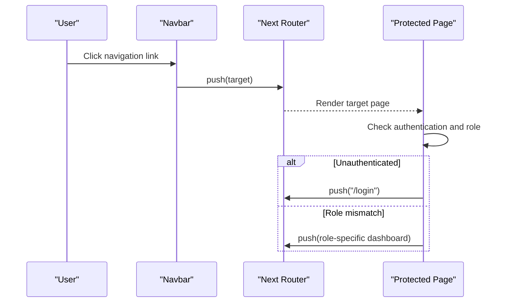
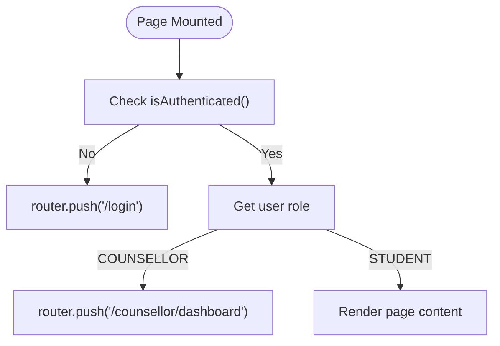
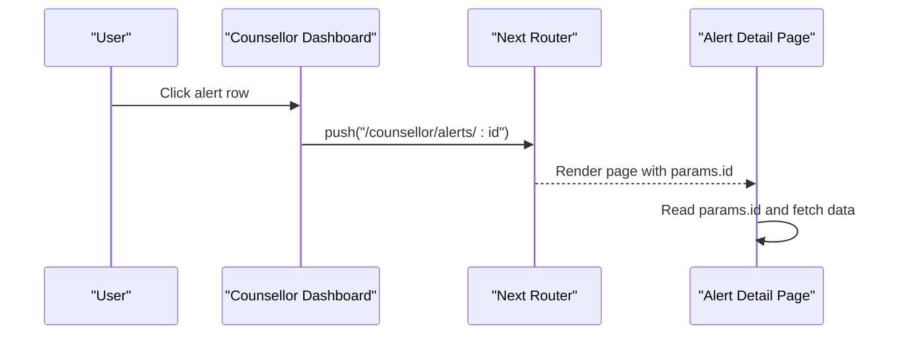
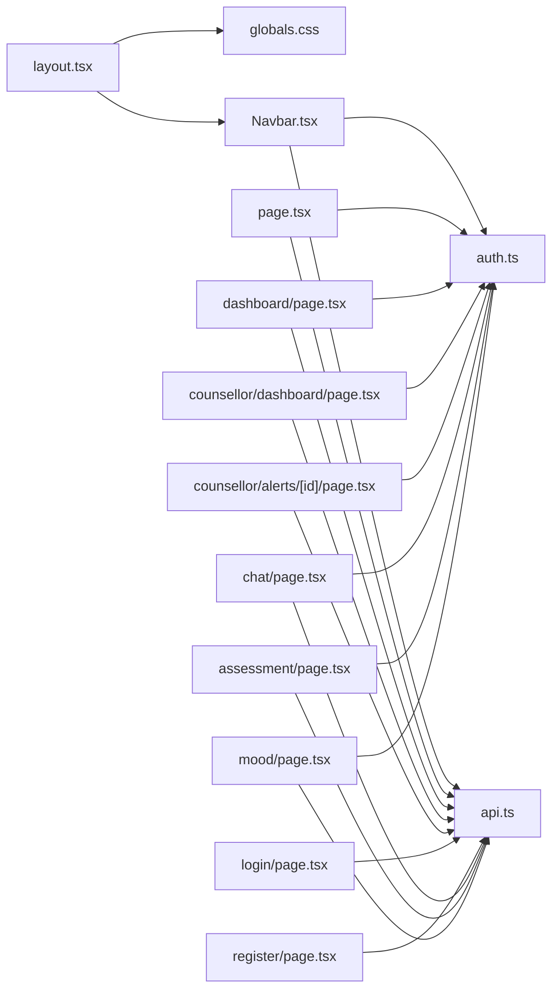

# Routing and Navigation

<cite>
**Referenced Files in This Document**
- [layout.tsx](file://client/src/app/layout.tsx)
- [globals.css](file://client/src/app/globals.css)
- [Navbar.tsx](file://client/src/components/Navbar.tsx)
- [auth.ts](file://client/src/lib/auth.ts)
- [api.ts](file://client/src/lib/api.ts)
- [page.tsx](file://client/src/app/page.tsx)
- [login/page.tsx](file://client/src/app/login/page.tsx)
- [register/page.tsx](file://client/src/app/register/page.tsx)
- [dashboard/page.tsx](file://client/src/app/dashboard/page.tsx)
- [counsellor/dashboard/page.tsx](file://client/src/app/counsellor/dashboard/page.tsx)
- [counsellor/alerts/[id]/page.tsx](file://client/src/app/counsellor/alerts/[id]/page.tsx)
- [chat/page.tsx](file://client/src/app/chat/page.tsx)
- [assessment/page.tsx](file://client/src/app/assessment/page.tsx)
- [mood/page.tsx](file://client/src/app/mood/page.tsx)
- [next.config.ts](file://client/next.config.ts)
- [package.json](file://client/package.json)
</cite>

## Table of Contents
1. [Introduction](#introduction)
2. [Project Structure](#project-structure)
3. [Core Components](#core-components)
4. [Architecture Overview](#architecture-overview)
5. [Detailed Component Analysis](#detailed-component-analysis)
6. [Dependency Analysis](#dependency-analysis)
7. [Performance Considerations](#performance-considerations)
8. [Troubleshooting Guide](#troubleshooting-guide)
9. [Conclusion](#conclusion)
10. [Appendices](#appendices)

## Introduction
This document explains the routing and navigation implementation in the Next.js App Router for the client application. It covers the application layout structure, route configuration, navigation patterns, and how the Navbar integrates with protected routes. It also documents metadata and font loading, dynamic routing patterns, route protection, navigation state management, SEO and accessibility considerations, and practical examples for adding new routes and handling parameters.

## Project Structure
The client application follows the Next.js App Router convention under client/src/app. Routes are defined by file system nesting and page.tsx files. The global layout wraps all pages and renders the shared Navbar. Authentication state is managed via localStorage and consumed by pages and the Navbar.

**Diagram sources**
- [layout.tsx:1-38](file://client/src/app/layout.tsx#L1-L38)
- [page.tsx:1-32](file://client/src/app/page.tsx#L1-L32)
- [login/page.tsx:1-108](file://client/src/app/login/page.tsx#L1-L108)
- [register/page.tsx:1-120](file://client/src/app/register/page.tsx#L1-L120)
- [dashboard/page.tsx:1-206](file://client/src/app/dashboard/page.tsx#L1-L206)
- [counsellor/dashboard/page.tsx:1-213](file://client/src/app/counsellor/dashboard/page.tsx#L1-L213)
- [counsellor/alerts/[id]/page.tsx](file://client/src/app/counsellor/alerts/[id]/page.tsx#L1-L246)
- [chat/page.tsx:1-196](file://client/src/app/chat/page.tsx#L1-L196)
- [assessment/page.tsx:1-192](file://client/src/app/assessment/page.tsx#L1-L192)
- [mood/page.tsx:1-245](file://client/src/app/mood/page.tsx#L1-L245)
- [Navbar.tsx:1-96](file://client/src/components/Navbar.tsx#L1-L96)
- [globals.css:1-20](file://client/src/app/globals.css#L1-L20)

**Section sources**
- [layout.tsx:1-38](file://client/src/app/layout.tsx#L1-L38)
- [globals.css:1-20](file://client/src/app/globals.css#L1-L20)

## Core Components
- RootLayout: Provides the HTML wrapper, global fonts, and renders the Navbar and page content.
- Navbar: Implements responsive navigation, conditional links for authenticated users and roles, and logout behavior.
- Authentication utilities: Manage tokens and user state in localStorage and expose helpers for route guards.
- API client: Centralized request handler with automatic Authorization header injection and 401 handling.

Key responsibilities:
- RootLayout sets metadata and font variables globally.
- Navbar conditionally renders links based on authentication and role.
- Pages redirect unauthenticated users and enforce role-specific destinations.
- Dynamic routes resolve parameters via App Router conventions.

**Section sources**
- [layout.tsx:16-37](file://client/src/app/layout.tsx#L16-L37)
- [Navbar.tsx:8-95](file://client/src/components/Navbar.tsx#L8-L95)
- [auth.ts:1-27](file://client/src/lib/auth.ts#L1-L27)
- [api.ts:1-36](file://client/src/lib/api.ts#L1-L36)

## Architecture Overview
The routing architecture is file-system based with shared layout and per-route pages. Navigation relies on Next.js Link and client-side router hooks. Authentication drives route protection and role-aware navigation.

**Diagram sources**
- [Navbar.tsx:18-22](file://client/src/components/Navbar.tsx#L18-L22)
- [dashboard/page.tsx:37-46](file://client/src/app/dashboard/page.tsx#L37-L46)
- [counsellor/dashboard/page.tsx:36-44](file://client/src/app/counsellor/dashboard/page.tsx#L36-L44)
- [login/page.tsx:30-34](file://client/src/app/login/page.tsx#L30-L34)

## Detailed Component Analysis

### RootLayout and Metadata
- Defines global metadata (title and description).
- Loads Google Fonts via next/font and exposes CSS variables for sans and mono faces.
- Applies Tailwind base styles and ensures the body fills the viewport.

Implementation highlights:
- Font variables are attached to the html element for global usage.
- Navbar is rendered inside the layout, ensuring consistent navigation across pages.

**Section sources**
- [layout.tsx:16-37](file://client/src/app/layout.tsx#L16-L37)
- [globals.css:1-20](file://client/src/app/globals.css#L1-L20)

### Navbar Component
Responsibilities:
- Detects hydration state to avoid SSR mismatches.
- Reads authentication state and user role from localStorage.
- Renders role-aware navigation links:
  - Students see Dashboard, Chat, Assessment, Mood.
  - Counsellors see Counsellor Dashboard.
- Provides logout that clears tokens and navigates to login.

Responsive behavior:
- Uses flexbox and spacing utilities to adapt to small, medium, and large screens.

Accessibility considerations:
- Uses semantic nav and anchor elements with clear labels.
- Buttons use appropriate roles and keyboard-friendly interactions.

**Section sources**
- [Navbar.tsx:8-95](file://client/src/components/Navbar.tsx#L8-L95)
- [auth.ts:14-26](file://client/src/lib/auth.ts#L14-L26)

### Route Protection and Navigation Guards
Protection patterns are implemented consistently across pages:
- On mount, pages check authentication and redirect accordingly.
- Role checks redirect students to the standard dashboard and counsellors to the counsellor dashboard.
- Unauthorized API responses trigger a redirect to login.

Examples:
- Home page redirects authenticated users to role-appropriate dashboards.
- Dashboard page enforces authentication and role.
- Counsellor dashboard enforces authentication and role.
- Other pages enforce authentication similarly.

**Diagram sources**
- [page.tsx:10-21](file://client/src/app/page.tsx#L10-L21)
- [dashboard/page.tsx:37-46](file://client/src/app/dashboard/page.tsx#L37-L46)
- [counsellor/dashboard/page.tsx:36-44](file://client/src/app/counsellor/dashboard/page.tsx#L36-L44)

**Section sources**
- [page.tsx:10-21](file://client/src/app/page.tsx#L10-L21)
- [dashboard/page.tsx:37-46](file://client/src/app/dashboard/page.tsx#L37-L46)
- [counsellor/dashboard/page.tsx:36-44](file://client/src/app/counsellor/dashboard/page.tsx#L36-L44)
- [login/page.tsx:16-40](file://client/src/app/login/page.tsx#L16-L40)

### Dynamic Routing Patterns
Dynamic segments are supported via square brackets in file names. The alerts detail page demonstrates:
- Extracting the dynamic id via useRouter and useParams.
- Fetching related data and rendering role-restricted views.

**Diagram sources**
- [counsellor/dashboard/page.tsx:177-180](file://client/src/app/counsellor/dashboard/page.tsx#L177-L180)
- [counsellor/alerts/[id]/page.tsx](file://client/src/app/counsellor/alerts/[id]/page.tsx#L34-L55)

**Section sources**
- [counsellor/alerts/[id]/page.tsx](file://client/src/app/counsellor/alerts/[id]/page.tsx#L34-L55)

### Navigation State Management
Navigation state is primarily handled client-side:
- Next.js router is used to navigate after authentication actions and in-page flows.
- Navbar maintains minimal local state for hydration and user display.
- API client centralizes headers and error handling, indirectly influencing navigation on 401.

Practical tips:
- Use router.push for programmatic navigation.
- Use router.replace to avoid polluting history for initial redirects.
- Keep authentication state in sync with localStorage and rehydrate on mount.

**Section sources**
- [Navbar.tsx:18-22](file://client/src/components/Navbar.tsx#L18-L22)
- [login/page.tsx:27-34](file://client/src/app/login/page.tsx#L27-L34)
- [api.ts:20-26](file://client/src/lib/api.ts#L20-L26)

### SEO Optimization and Meta Tags
- Global metadata is configured in the root layout.
- For page-specific metadata, define metadata exports in individual pages.
- Canonical URLs and Open Graph tags can be added per page as needed.

Best practices:
- Set concise and descriptive titles and descriptions.
- Use structured data where applicable.
- Ensure robots.txt and sitemap generation align with route visibility.

**Section sources**
- [layout.tsx:16-19](file://client/src/app/layout.tsx#L16-L19)

### Accessibility Considerations for Navigation
- Use semantic markup (nav, ul/li, buttons).
- Ensure keyboard navigation and focus management.
- Provide visible focus indicators and skip links if needed.
- Use descriptive link text and aria-labels where appropriate.

[No sources needed since this section provides general guidance]

### Practical Examples

#### Implementing a New Route
Steps:
- Create a new folder under client/src/app with a page.tsx file.
- Optionally add nested routes by adding subfolders and page.tsx files.
- Reference the new route using Next.js Link in the Navbar or other pages.

Example references:
- Adding a new top-level route mirrors the existing pages structure.
- Nested routes mirror the existing nested folders.

**Section sources**
- [layout.tsx:21-37](file://client/src/app/layout.tsx#L21-L37)
- [Navbar.tsx:29-62](file://client/src/components/Navbar.tsx#L29-L62)

#### Handling Route Parameters
- Use useParams to extract dynamic segments.
- Fetch related data and render accordingly.
- Guard access by role and authentication.

Example references:
- Dynamic alerts route extraction and usage.

**Section sources**
- [counsellor/alerts/[id]/page.tsx](file://client/src/app/counsellor/alerts/[id]/page.tsx#L34-L55)

#### Managing Navigation Flow Between Sections
- Use router.push for cross-section navigation.
- Maintain role-aware navigation in the Navbar.
- Redirect on authentication changes to keep users in authorized areas.

Example references:
- Navbar conditional links and logout flow.
- Protected pages redirecting to appropriate dashboards.

**Section sources**
- [Navbar.tsx:29-95](file://client/src/components/Navbar.tsx#L29-L95)
- [dashboard/page.tsx:37-46](file://client/src/app/dashboard/page.tsx#L37-L46)
- [counsellor/dashboard/page.tsx:36-44](file://client/src/app/counsellor/dashboard/page.tsx#L36-L44)

## Dependency Analysis
The routing and navigation stack depends on:
- Next.js App Router for file-system routing and client navigation.
- LocalStorage for authentication state.
- API client for authenticated requests and centralized error handling.

**Diagram sources**
- [layout.tsx:1-38](file://client/src/app/layout.tsx#L1-L38)
- [globals.css:1-20](file://client/src/app/globals.css#L1-L20)
- [Navbar.tsx:1-96](file://client/src/components/Navbar.tsx#L1-L96)
- [auth.ts:1-27](file://client/src/lib/auth.ts#L1-L27)
- [api.ts:1-36](file://client/src/lib/api.ts#L1-L36)
- [page.tsx:1-32](file://client/src/app/page.tsx#L1-L32)
- [dashboard/page.tsx:1-206](file://client/src/app/dashboard/page.tsx#L1-L206)
- [counsellor/dashboard/page.tsx:1-213](file://client/src/app/counsellor/dashboard/page.tsx#L1-L213)
- [counsellor/alerts/[id]/page.tsx](file://client/src/app/counsellor/alerts/[id]/page.tsx#L1-L246)
- [login/page.tsx:1-108](file://client/src/app/login/page.tsx#L1-L108)
- [register/page.tsx:1-120](file://client/src/app/register/page.tsx#L1-L120)
- [chat/page.tsx:1-196](file://client/src/app/chat/page.tsx#L1-L196)
- [assessment/page.tsx:1-192](file://client/src/app/assessment/page.tsx#L1-L192)
- [mood/page.tsx:1-245](file://client/src/app/mood/page.tsx#L1-L245)

**Section sources**
- [layout.tsx:1-38](file://client/src/app/layout.tsx#L1-L38)
- [auth.ts:1-27](file://client/src/lib/auth.ts#L1-L27)
- [api.ts:1-36](file://client/src/lib/api.ts#L1-L36)

## Performance Considerations
- Prefer client-side navigation for internal links to avoid full-page reloads.
- Defer heavy data fetching to useEffect and use loading states to improve perceived performance.
- Use dynamic imports for large components if needed, though not required for current structure.
- Minimize unnecessary re-renders by keeping Navbar state scoped and avoiding prop drilling.

[No sources needed since this section provides general guidance]

## Troubleshooting Guide
Common issues and resolutions:
- Stuck on login despite being authenticated:
  - Verify token presence in localStorage and that the API client attaches Authorization headers.
  - Ensure the API returns 401 for invalid/expired tokens and that the client redirects to login.
- Role mismatch leading to wrong dashboard:
  - Confirm the user role stored in localStorage and the conditional logic in pages.
- Dynamic route not resolving:
  - Ensure the file path matches the intended segment and useParams is used correctly.

**Section sources**
- [auth.ts:1-27](file://client/src/lib/auth.ts#L1-L27)
- [api.ts:20-26](file://client/src/lib/api.ts#L20-L26)
- [counsellor/alerts/[id]/page.tsx](file://client/src/app/counsellor/alerts/[id]/page.tsx#L34-L55)

## Conclusion
The application’s routing and navigation leverage Next.js App Router conventions with a shared layout and a responsive Navbar. Authentication and role checks are enforced at the page level, while the API client centralizes request handling. Dynamic routing supports flexible alert detail views. Following the documented patterns enables safe extension of routes, robust protection, and accessible navigation.

## Appendices

### Next.js Configuration Notes
- The Next.js configuration file is present but does not override defaults.
- Ensure environment variables for the API base URL are set appropriately for development and production.

**Section sources**
- [next.config.ts:1-8](file://client/next.config.ts#L1-L8)
- [package.json:1-27](file://client/package.json#L1-L27)
- [api.ts:1-1](file://client/src/lib/api.ts#L1-L1)